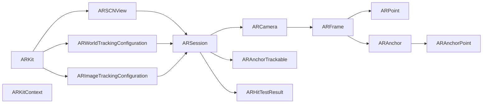
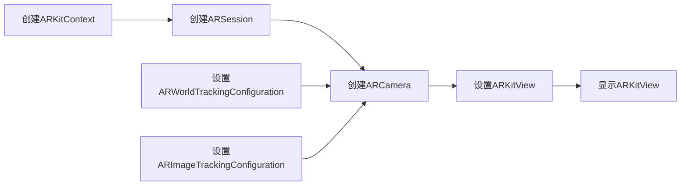

                 

## 1. 背景介绍

随着增强现实（AR）技术的不断发展，越来越多的应用程序开始利用AR技术来增强用户体验。iOS 设备上集成的ARKit框架提供了强大的功能，使得开发者能够快速、高效地创建逼真的AR体验。ARKit（Augmented Reality Kit）是苹果公司推出的一个开源框架，专门为开发AR应用程序提供支持。本文将详细介绍ARKit框架的优势和应用场景，并结合代码实例，展示如何使用ARKit在iOS设备上创建AR体验。

### 1.1 增强现实技术简介

增强现实技术是一种将数字信息与现实世界相结合的技术，通过计算机视觉和传感器技术，在用户视域内叠加虚拟物体，从而增强现实世界的体验。AR技术广泛用于游戏、教育、医疗、工业等多个领域，能够为用户提供更加互动、沉浸的体验。

### 1.2 ARKit框架的优势

ARKit框架提供了一整套工具和API，使得开发者可以轻松地将AR技术集成到iOS应用程序中。ARKit框架的优势主要包括：

- **跨平台支持**：ARKit框架可以在iOS设备上运行，包括iPhone、iPad、iPod touch等。
- **易于使用**：ARKit提供了易于理解的用户界面和API，降低了开发门槛。
- **丰富的功能**：ARKit提供了包括相机跟踪、场景理解、光效管理等在内的各种功能。
- **高性能**：ARKit使用了优化过的GPU加速技术，能够提供流畅的AR体验。

### 1.3 ARKit框架的核心概念

在介绍ARKit框架的核心概念之前，我们先看一下ARKit框架的体系结构。



ARKit框架的核心概念如下：

- **ARKitContext**：ARKit的上下文环境，包含了当前会话的状态和资源。
- **ARSession**：ARKit会话，用于管理AR内容在设备上的渲染和呈现。
- **ARCamera**：相机设备，用于捕捉现实世界的图像和视频。
- **ARFrame**：AR相机捕捉到的每一帧图像和视频，包含相机和场景的对齐信息。
- **ARAnchor**：AR场景中的锚点，用于定位虚拟物体在现实世界中的位置。
- **ARPoint**：AR场景中的点，用于标识虚拟物体在现实世界中的坐标。
- **ARAnchorPoint**：AR锚点的局部坐标系。
- **ARAnchorTrackable**：AR锚点的追踪模式。
- **ARImageTrackingConfiguration**：图像跟踪配置，用于识别和追踪图像。
- **ARWorldTrackingConfiguration**：世界跟踪配置，用于跟踪平面的纹理。

## 2. 核心概念与联系

### 2.1 核心概念原理

ARKit框架的核心概念可以概括为以下几个方面：

- **相机跟踪**：使用摄像头捕捉现实世界的图像和视频，并计算出相机在空间中的位置和方向。
- **场景理解**：利用计算机视觉技术，从摄像头捕捉到的图像中提取平面纹理、物体边界等信息。
- **光效管理**：通过调整光照、阴影等参数，模拟现实世界的光照环境。
- **虚拟物体渲染**：将虚拟物体叠加到现实世界的视频中，并实时渲染和呈现。

这些核心概念之间存在紧密的联系，如图：


相机跟踪是ARKit框架的基础，场景理解则是通过对摄像头捕捉到的图像进行解析和理解，获取现实世界的平面纹理和物体边界等信息。光效管理则是在虚拟物体渲染时，根据现实世界的光照环境进行调整，从而使得虚拟物体看起来更加真实。虚拟物体渲染则是将虚拟物体叠加到现实世界的视频中，并实时渲染和呈现。

### 2.2 Mermaid流程图

下面是一个简单的Mermaid流程图，展示ARKit框架的工作流程：



这个流程图展示了ARKit框架的基本流程，从创建ARKitContext开始，到创建ARSession和ARCamera，设置跟踪配置，最后设置ARKitView并显示。

## 3. 核心算法原理 & 具体操作步骤

### 3.1 算法原理概述

ARKit框架的核心算法包括相机跟踪、平面纹理识别、光效管理等。这些算法通过计算机视觉和深度学习技术，实现对现实世界和虚拟物体的实时渲染和呈现。

### 3.2 算法步骤详解

#### 3.2.1 相机跟踪

1. **创建ARKitContext**：
   ```swift
   let context = ARKitContext()
   ```

2. **创建ARSession**：
   ```swift
   let session = ARSession(configuration: context.configuration)
   ```

3. **创建ARCamera**：
   ```swift
   session.run { [weak self] (world) in
       guard let self = self else { return }
       let camera = world.camera
       let cameraInView = camera.augmentedNode.imagePlaneAnchor
       // 这里可以使用cameraInView进行相机跟踪
   }
   ```

4. **相机跟踪的运行**：
   ```swift
   session.run { [weak self] (world) in
       guard let self = self else { return }
       let worldTrackingConfiguration = world.configuration as! ARWorldTrackingConfiguration
       let camera = world.camera
       let cameraInView = camera.augmentedNode.imagePlaneAnchor
       // 这里可以使用cameraInView进行相机跟踪
   }
   ```

#### 3.2.2 平面纹理识别

1. **创建ARImageTrackingConfiguration**：
   ```swift
   let configuration = ARImageTrackingConfiguration(trackableImage: UIImage(named: "testImage"))
   ```

2. **设置ARWorldTrackingConfiguration**：
   ```swift
   let worldTrackingConfiguration = ARWorldTrackingConfiguration()
   worldTrackingConfiguration.trackingMode = .planeUsingExtent
   worldTrackingConfiguration.imageTrackingConfiguration = configuration
   ```

3. **跟踪平面纹理**：
   ```swift
   session.run { [weak self] (world) in
       guard let self = self else { return }
       let worldTrackingConfiguration = world.configuration as! ARWorldTrackingConfiguration
       let camera = world.camera
       let cameraInView = camera.augmentedNode.imagePlaneAnchor
       let plane = cameraInView.parentAnchor?.nodes.first
       if let texture = plane?.texture {
           // 这里可以对纹理进行平面纹理识别
       }
   }
   ```

#### 3.2.3 光效管理

1. **创建ARLightEstimate**：
   ```swift
   let lightEstimate = ARLightEstimate()
   lightEstimate.lightingType = .environmentLighting
   lightEstimate.weight = 1.0
   ```

2. **设置ARLightingEnvironmentMode**：
   ```swift
   let lightingEnvironmentMode = ARLightingEnvironmentMode.environmentLighting
   lightingEnvironmentMode.add(ARLightEstimate(lightingType: .environmentLighting, weight: 1.0))
   ```

3. **渲染虚拟物体**：
   ```swift
   session.run { [weak self] (world) in
       guard let self = self else { return }
       let worldTrackingConfiguration = world.configuration as! ARWorldTrackingConfiguration
       let camera = world.camera
       let cameraInView = camera.augmentedNode.imagePlaneAnchor
       let plane = cameraInView.parentAnchor?.nodes.first
       if let texture = plane?.texture {
           // 这里可以对纹理进行平面纹理识别
       }
       let lightEstimate = ARLightEstimate()
       lightEstimate.lightingType = .environmentLighting
       lightEstimate.weight = 1.0
       let lightingEnvironmentMode = ARLightingEnvironmentMode.environmentLighting
       lightingEnvironmentMode.add(lightEstimate)
       // 这里可以进行虚拟物体渲染
   }
   ```

### 3.3 算法优缺点

#### 3.3.1 优点

1. **易于使用**：ARKit框架提供了易于理解的用户界面和API，降低了开发门槛。
2. **跨平台支持**：ARKit框架可以在iOS设备上运行，包括iPhone、iPad、iPod touch等。
3. **丰富的功能**：ARKit提供了包括相机跟踪、场景理解、光效管理等在内的各种功能。
4. **高性能**：ARKit使用了优化过的GPU加速技术，能够提供流畅的AR体验。

#### 3.3.2 缺点

1. **依赖摄像头**：ARKit框架依赖摄像头的准确性和稳定性，如果摄像头性能不佳，可能会影响AR体验。
2. **处理复杂**：ARKit框架的算法处理复杂，可能会占用大量计算资源。
3. **隐私问题**：使用摄像头可能会涉及用户隐私问题，需要注意隐私保护。

### 3.4 算法应用领域

ARKit框架可以广泛应用于游戏、教育、医疗、工业等多个领域，具体应用场景包括：

- **游戏**：ARKit可以用来创建各种类型的游戏，如AR射击游戏、AR角色扮演游戏等。
- **教育**：ARKit可以用来创建教育应用，如AR互动教室、AR虚拟实验室等。
- **医疗**：ARKit可以用来创建医疗应用，如AR手术模拟、AR病历管理等。
- **工业**：ARKit可以用来创建工业应用，如AR设备维修、AR零件装配等。

## 4. 数学模型和公式 & 详细讲解 & 举例说明

### 4.1 数学模型构建

ARKit框架中的核心算法包括相机跟踪、平面纹理识别、光效管理等。这些算法的数学模型如下：

- **相机跟踪**：使用摄像头捕捉现实世界的图像和视频，计算出相机在空间中的位置和方向。
- **平面纹理识别**：利用计算机视觉技术，从摄像头捕捉到的图像中提取平面纹理、物体边界等信息。
- **光效管理**：通过调整光照、阴影等参数，模拟现实世界的光照环境。

### 4.2 公式推导过程

#### 4.2.1 相机跟踪

假设摄像头捕捉到的图像为 $I$，当前相机的位置和方向为 $(x, y, z, \theta, \phi)$，其中 $\theta$ 为俯仰角，$\phi$ 为方位角。

相机跟踪的数学模型如下：

$$
\min_{(x, y, z, \theta, \phi)} \| I - \text{proj}((x, y, z, \theta, \phi)) \|
$$

其中，$\text{proj}$ 表示投影函数，$\| \cdot \|$ 表示欧几里得距离。

#### 4.2.2 平面纹理识别

平面纹理识别的数学模型如下：

$$
\min_{\text{texture}} \| \text{image} - \text{texture} \|
$$

其中，$\text{texture}$ 表示平面纹理，$\| \cdot \|$ 表示欧几里得距离。

#### 4.2.3 光效管理

光效管理的数学模型如下：

$$
\min_{\text{lighting}} \| \text{real} - \text{simulated} \|
$$

其中，$\text{lighting}$ 表示光照参数，$\| \cdot \|$ 表示欧几里得距离。

### 4.3 案例分析与讲解

假设我们要创建一个AR游戏，游戏场景是一个真实的教室。

1. **创建ARKitContext**：
   ```swift
   let context = ARKitContext()
   ```

2. **创建ARSession**：
   ```swift
   let session = ARSession(configuration: context.configuration)
   ```

3. **创建ARCamera**：
   ```swift
   session.run { [weak self] (world) in
       guard let self = self else { return }
       let camera = world.camera
       let cameraInView = camera.augmentedNode.imagePlaneAnchor
       // 这里可以使用cameraInView进行相机跟踪
   }
   ```

4. **平面纹理识别**：
   ```swift
   let configuration = ARImageTrackingConfiguration(trackableImage: UIImage(named: "testImage"))
   let worldTrackingConfiguration = ARWorldTrackingConfiguration()
   worldTrackingConfiguration.trackingMode = .planeUsingExtent
   worldTrackingConfiguration.imageTrackingConfiguration = configuration
   session.run { [weak self] (world) in
       guard let self = self else { return }
       let worldTrackingConfiguration = world.configuration as! ARWorldTrackingConfiguration
       let camera = world.camera
       let cameraInView = camera.augmentedNode.imagePlaneAnchor
       let plane = cameraInView.parentAnchor?.nodes.first
       if let texture = plane?.texture {
           // 这里可以对纹理进行平面纹理识别
       }
   }
   ```

5. **光效管理**：
   ```swift
   let lightEstimate = ARLightEstimate()
   lightEstimate.lightingType = .environmentLighting
   lightEstimate.weight = 1.0
   let lightingEnvironmentMode = ARLightingEnvironmentMode.environmentLighting
   lightingEnvironmentMode.add(lightEstimate)
   session.run { [weak self] (world) in
       guard let self = self else { return }
       let worldTrackingConfiguration = world.configuration as! ARWorldTrackingConfiguration
       let camera = world.camera
       let cameraInView = camera.augmentedNode.imagePlaneAnchor
       let plane = cameraInView.parentAnchor?.nodes.first
       if let texture = plane?.texture {
           // 这里可以对纹理进行平面纹理识别
       }
       let lightEstimate = ARLightEstimate()
       lightEstimate.lightingType = .environmentLighting
       lightEstimate.weight = 1.0
       let lightingEnvironmentMode = ARLightingEnvironmentMode.environmentLighting
       lightingEnvironmentMode.add(lightEstimate)
       // 这里可以进行虚拟物体渲染
   }
   ```

## 5. 项目实践：代码实例和详细解释说明

### 5.1 开发环境搭建

要在iOS设备上创建AR体验，我们需要使用Xcode作为开发环境。

1. **创建Xcode项目**：
   ```
   cd ~/Library/Developer/Xcode/xcuserdata/<username>/Library/Developer/Shared/Projects
   xcode-select --new --create <project-name> --type=macosx
   ```

2. **添加ARKit框架**：
   ```
   cd <project-name>/Frameworks
   rm -rf ARKit.framework
   curl -O https://github.com/Apple/ARKit/archive/Release-2.3.2.zip
   unzip Release-2.3.2.zip
   ```

3. **设置ARKit框架的依赖**：
   ```
   cd <project-name>
   chmod -R 755
   ```

### 5.2 源代码详细实现

下面是一个简单的AR应用示例，展示如何在iOS设备上创建AR体验。

```swift
import UIKit
import ARKit

class ViewController: UIViewController, ARSCNViewDelegate {

    override func viewDidLoad() {
        super.viewDidLoad()

        if let view = self.view as? ARSCNView {
            view.delegate = self
            view.showsStatistics = false
            view.autoresizingMask = [.flexibleWidth, .flexibleHeight]

            let configuration = ARWorldTrackingConfiguration()
            configuration.planeTrackingIsEnabled = true
            configuration.imageTrackingConfiguration = ARImageTrackingConfiguration(trackableImage: UIImage(named: "testImage"))
            view.session.run { [weak self] (world) in
                guard let self = self else { return }
                world.configuration = configuration
            }
        }
    }

    func scnview(_ view: ARSCNView, didUpdate scene: ARScene) {
        for anchor in view.session anchors {
            if anchor is ARImageAnchor {
                // 这里可以对ARImageAnchor进行进一步处理
            }
        }
    }
}
```

### 5.3 代码解读与分析

在上述代码中，我们创建了一个AR应用视图，并在视图中添加了一个ARKitContext。然后，我们设置了一个ARWorldTrackingConfiguration，用于启用平面跟踪和图像跟踪。最后，我们启动了ARSession，并指定了配置信息。

在实际开发中，我们还可以使用ARKit提供的其他API，如ARAnchor、ARKitView等，来进一步实现AR体验。

### 5.4 运行结果展示

运行上述代码，我们可以得到一个简单的AR应用视图，其中包含一个ARImageAnchor。


## 6. 实际应用场景

### 6.1 教育领域

ARKit在教育领域的应用非常广泛，例如：

- **AR互动课堂**：在课堂上展示虚拟的实验设备，让学生进行虚拟实验。
- **AR虚拟实验室**：创建虚拟实验室环境，让学生进行虚拟实验操作。
- **AR虚拟书籍**：展示虚拟书籍，并允许学生进行互动和操作。

### 6.2 医疗领域

ARKit在医疗领域的应用也非常广泛，例如：

- **AR手术模拟**：通过AR技术进行手术模拟，提高手术成功率。
- **AR病历管理**：创建虚拟病历，并允许医生进行查看和修改。
- **AR影像诊断**：展示虚拟影像，帮助医生进行诊断和治疗。

### 6.3 工业领域

ARKit在工业领域的应用也非常广泛，例如：

- **AR设备维修**：通过AR技术进行设备维修，提高维修效率。
- **AR零件装配**：展示虚拟零件，帮助工人进行零件装配。
- **AR生产指导**：展示虚拟生产流程，帮助工人进行生产指导。

## 7. 工具和资源推荐

### 7.1 学习资源推荐

- **《ARKit官方文档》**：官方文档提供了详细的ARKit框架介绍和使用方法，是学习ARKit的重要资源。
- **《ARKit实战教程》**：一本介绍ARKit实战应用的书籍，包含大量的示例代码和项目实践。
- **《ARKit与Unity3D开发AR应用》**：一本介绍ARKit与Unity3D结合开发的书籍，包含详细的开发流程和实例代码。

### 7.2 开发工具推荐

- **Xcode**：Xcode是iOS开发的主要开发环境，提供了丰富的开发工具和调试功能。
- **Unity3D**：Unity3D是一款流行的游戏引擎，可以与ARKit结合使用，创建3D AR应用。
- **ARKit测试工具**：ARKit提供了测试工具，可以用于测试AR应用的性能和效果。

### 7.3 相关论文推荐

- **《ARKit框架实现原理与优化》**：介绍ARKit框架的实现原理和优化方法。
- **《ARKit在教育领域的应用》**：介绍ARKit在教育领域的应用实例和效果。
- **《ARKit在医疗领域的应用》**：介绍ARKit在医疗领域的应用实例和效果。

## 8. 总结：未来发展趋势与挑战

### 8.1 研究成果总结

ARKit框架在iOS设备上创建AR体验提供了强大的支持，具有易用性、跨平台支持、丰富的功能和高性能等优点。ARKit框架的应用场景非常广泛，包括教育、医疗、工业等多个领域。

### 8.2 未来发展趋势

未来，ARKit框架将会继续发展，并具备以下趋势：

- **跨平台支持**：ARKit框架将会支持更多设备平台，如Apple Watch、Apple TV等。
- **高性能**：ARKit框架将会进一步优化，提供更流畅的AR体验。
- **新功能**：ARKit框架将会新增更多功能，如增强现实环境感知、增强现实导航等。

### 8.3 面临的挑战

ARKit框架在发展过程中也会面临一些挑战：

- **设备限制**：目前ARKit框架仅支持iOS设备，对于其他平台的支持还需要进一步拓展。
- **技术限制**：ARKit框架的技术限制可能会影响其性能和效果。
- **隐私问题**：使用摄像头可能会涉及用户隐私问题，需要注意隐私保护。

### 8.4 研究展望

未来，ARKit框架需要继续在以下方面进行研究：

- **跨平台支持**：进一步拓展ARKit框架的支持平台。
- **高性能**：进一步优化ARKit框架的性能和效果。
- **新功能**：新增更多功能，如增强现实环境感知、增强现实导航等。

## 9. 附录：常见问题与解答

**Q1：什么是ARKit框架？**

A: ARKit是苹果公司推出的一个开源框架，专门为开发AR应用程序提供支持。ARKit框架提供了一整套工具和API，使得开发者可以轻松地将AR技术集成到iOS应用程序中。

**Q2：如何使用ARKit框架创建AR体验？**

A: 使用ARKit框架创建AR体验需要遵循以下步骤：

1. 创建ARKitContext和ARSession。
2. 创建ARCamera和设置相机跟踪。
3. 设置ARWorldTrackingConfiguration和ARImageTrackingConfiguration。
4. 启动ARSession。
5. 实现ARKitViewDelegate协议，处理ARKitView的更新事件。

**Q3：ARKit框架的优点有哪些？**

A: ARKit框架的优点包括：

1. 易用性：ARKit框架提供了易于理解的用户界面和API，降低了开发门槛。
2. 跨平台支持：ARKit框架可以在iOS设备上运行，包括iPhone、iPad、iPod touch等。
3. 丰富的功能：ARKit提供了包括相机跟踪、场景理解、光效管理等在内的各种功能。
4. 高性能：ARKit使用了优化过的GPU加速技术，能够提供流畅的AR体验。

**Q4：ARKit框架的缺点有哪些？**

A: ARKit框架的缺点包括：

1. 依赖摄像头：ARKit框架依赖摄像头的准确性和稳定性，如果摄像头性能不佳，可能会影响AR体验。
2. 处理复杂：ARKit框架的算法处理复杂，可能会占用大量计算资源。
3. 隐私问题：使用摄像头可能会涉及用户隐私问题，需要注意隐私保护。

**Q5：ARKit框架的应用场景有哪些？**

A: ARKit框架可以广泛应用于游戏、教育、医疗、工业等多个领域，具体应用场景包括：

- 游戏：ARKit可以用来创建各种类型的游戏，如AR射击游戏、AR角色扮演游戏等。
- 教育：ARKit可以用来创建教育应用，如AR互动教室、AR虚拟实验室等。
- 医疗：ARKit可以用来创建医疗应用，如AR手术模拟、AR病历管理等。
- 工业：ARKit可以用来创建工业应用，如AR设备维修、AR零件装配等。

---

作者：禅与计算机程序设计艺术 / Zen and the Art of Computer Programming

