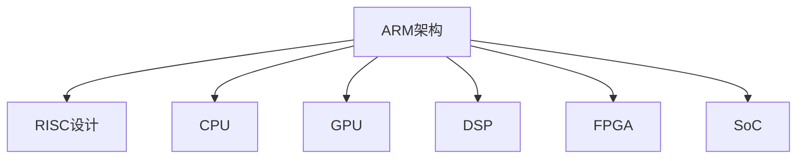

                 

# ARM架构：移动和嵌入式设备的核心

> 关键词：ARM架构,移动设备,嵌入式系统,处理器设计,微控制器,高效能,低功耗,安全特性,可定制性

## 1. 背景介绍

### 1.1 问题由来
随着移动和嵌入式设备在各行各业的应用越来越广泛，对其核心处理器架构的需求也随之增加。处理器架构直接影响着设备性能、功耗、成本和安全性。目前主流的处理器架构有两大阵营，即x86架构和ARM架构。其中，ARM架构以其高效能、低功耗和丰富的可定制性受到广泛青睐。

ARM架构最初由Acorn公司于1985年设计，随后被Acorn公司授权给全球多家半导体公司生产和销售。经过多年的发展和迭代，ARM架构已经从最初的ARM1发展到了最新的ARM Cortex-A系列，广泛应用于智能手机、平板电脑、物联网设备、智能家居等众多领域。

### 1.2 问题核心关键点
ARM架构之所以能在移动和嵌入式设备中大放异彩，主要归功于以下几点：

- 高效能：ARM架构基于RISC设计，每条指令执行周期固定，能够高效执行复杂指令。
- 低功耗：ARM架构的设计初衷就是低功耗，适用于电池供电的设备。
- 丰富的可定制性：ARM架构支持多种内核类型和指令集，可以根据需求进行灵活配置。
- 高度集成的IP核：ARM架构集成了高性能的IP核，如处理器、存储器、外设接口等，提供了一站式解决方案。
- 成熟稳定的生态系统：ARM架构有丰富的软件生态和社区支持，使开发者可以更容易地进行开发和部署。

这些关键特点使得ARM架构成为移动和嵌入式设备的核心。本文将从核心概念、算法原理、具体操作步骤、数学模型、代码实践和应用场景等方面，全面解析ARM架构的特点和应用。

## 2. 核心概念与联系

### 2.1 核心概念概述

为了更好地理解ARM架构，本节将介绍几个核心概念及其相互关系。

- ARM架构（ARM Architecture）：一种基于RISC设计的处理器架构，以其高效能、低功耗和丰富的可定制性著称。
- RISC设计（Reduced Instruction Set Computing）：指令集精简，每条指令执行周期固定，易于实现流水线优化。
- CPU（中央处理器）：ARM架构的核心，负责数据处理和指令执行。
- GPU（图形处理器）：ARM架构的增强版，用于图形渲染和AI计算等高负载任务。
- DSP（数字信号处理器）：ARM架构的变种，用于音频、视频和通信等信号处理任务。
- FPGA（现场可编程门阵列）：ARM架构与FPGA结合，实现高度灵活的硬件设计。
- SoC（系统级芯片）：集成了ARM处理器、存储器和外设接口，实现高度集成化设计。

这些核心概念之间的关系可以通过以下Mermaid流程图来展示：



这个流程图展示了ARM架构的基本构成和其与其他概念的关系。

## 3. 核心算法原理 & 具体操作步骤
### 3.1 算法原理概述

ARM架构的核心算法原理基于RISC设计，其目标是通过减少指令集和优化流水线，提升处理器效率和执行速度。ARM架构的主要特点包括：

- 固定长度的指令：每条指令执行周期固定，便于流水线优化。
- 大量通用寄存器：提高数据处理效率，减少访存次数。
- 严格的指令编码：每个指令编码固定，便于解码和执行。
- 早期分支预测：减少分支指令的执行时间，提升性能。

这些特点使得ARM架构能够高效地执行复杂任务，并在低功耗下提供卓越的性能。

### 3.2 算法步骤详解

以下是ARM架构的算法步骤详解：

1. **设计处理器核心**：
   - 确定处理器核的类型和指令集，如Cortex-A系列、Cortex-M系列等。
   - 设计处理器核心的微结构，包括流水线、缓存、中断系统等。

2. **实现硬件功能**：
   - 使用硬件描述语言（如Verilog、VHDL）实现处理器核心的硬件功能。
   - 将硬件功能映射到硅芯片上，并进行仿真和验证。

3. **开发软件生态**：
   - 开发编译器、操作系统和中间件等软件，提供开发和部署环境。
   - 构建丰富的工具链和开发平台，支持软件开发和调试。

4. **优化性能功耗**：
   - 根据目标应用场景，进行性能和功耗的优化设计。
   - 使用功耗模型和仿真工具，预测和验证优化效果。

5. **测试验证**：
   - 进行芯片的测试和验证，确保硬件功能正确无误。
   - 进行芯片的性能测试和功耗测试，确保满足设计要求。

6. **量产和部署**：
   - 进行芯片的量产和封装，并进行最终测试和验证。
   - 将芯片集成到设备中，进行部署和应用。

### 3.3 算法优缺点

ARM架构有以下优点：

- 高效能：ARM架构基于RISC设计，每条指令执行周期固定，能够高效执行复杂指令。
- 低功耗：ARM架构的设计初衷就是低功耗，适用于电池供电的设备。
- 丰富的可定制性：ARM架构支持多种内核类型和指令集，可以根据需求进行灵活配置。
- 高度集成的IP核：ARM架构集成了高性能的IP核，如处理器、存储器、外设接口等，提供了一站式解决方案。
- 成熟稳定的生态系统：ARM架构有丰富的软件生态和社区支持，使开发者可以更容易地进行开发和部署。

同时，ARM架构也存在一些缺点：

- 指令集精简：ARM架构的指令集相对较少，一些复杂的计算任务需要额外的库函数支持。
- 分支预测限制：ARM架构的分支预测算法较简单，可能会导致分支预测错误。
- 兼容性问题：不同版本的ARM架构之间可能存在兼容性问题，需要额外的适配工作。
- 安全漏洞：ARM架构的处理器和IP核可能存在安全漏洞，需要不断更新和修补。

### 3.4 算法应用领域

ARM架构广泛应用于以下领域：

- 移动设备：如智能手机、平板电脑、智能手表等。
- 嵌入式设备：如物联网设备、智能家居、汽车电子等。
- 高性能计算：如服务器、数据中心、AI计算等。
- 工业控制：如自动化生产线、机器人、工控机等。
- 多媒体应用：如视频编码、音频处理、图像处理等。

## 4. 数学模型和公式 & 详细讲解
### 4.1 数学模型构建

ARM架构的数学模型主要涉及处理器核心的性能评估、功耗分析和安全特性设计。以下是对这些模型的简要介绍。

- 性能模型：基于流水线和调度算法，评估处理器核心的执行速度和吞吐量。
- 功耗模型：基于功耗组件和调度算法，评估处理器核心的功耗消耗。
- 安全模型：基于密码学和硬件设计，评估处理器核心的安全特性和攻击防范能力。

### 4.2 公式推导过程

以下是ARM架构的性能模型和功耗模型公式推导：

1. **性能模型**：
   假设处理器核心的流水线深度为 $P$，时钟频率为 $f$，每条指令的执行周期为 $C$，则处理器核心的吞吐量为：
   $$
   \text{吞吐量} = \frac{1}{C} \times f \times P
   $$

2. **功耗模型**：
   假设处理器核心的功耗为 $P_{\text{core}}$，存储器的功耗为 $P_{\text{mem}}$，外设的功耗为 $P_{\text{io}}$，则处理器核心的总功耗为：
   $$
   P_{\text{total}} = P_{\text{core}} + P_{\text{mem}} + P_{\text{io}}
   $$

其中，$P_{\text{core}}$、$P_{\text{mem}}$ 和 $P_{\text{io}}$ 可以通过功耗仿真工具和硬件测试设备获得。

### 4.3 案例分析与讲解

以下以Cortex-A系列为例，分析其性能和功耗特点：

1. **Cortex-A系列特点**：
   - 支持Cortex-A7、Cortex-A8、Cortex-A9、Cortex-A15和Cortex-A系列等不同版本。
   - 具有不同的指令集和微结构，支持不同的应用场景。

2. **性能分析**：
   Cortex-A7核心具有4个整数执行单元和2个浮点执行单元，每个执行单元的周期为2，时钟频率为1GHz，流水线深度为6。
   - 指令集包括Thumb-2、Thumb-EE和ARMv8等，支持复杂的指令操作。
   - 时钟频率和流水线深度的优化，使其在执行复杂计算任务时具有较高的吞吐量。

3. **功耗分析**：
   Cortex-A7核心的功耗模型为：
   $$
   P_{\text{core}} = P_{\text{cache}} + P_{\text{logic}} + P_{\text{memory}}
   $$
   其中，$P_{\text{cache}}$ 和 $P_{\text{logic}}$ 可以通过硬件仿真工具获得，$P_{\text{memory}}$ 与存储器类型和速度有关。

## 5. 项目实践：代码实例和详细解释说明
### 5.1 开发环境搭建

要进行ARM架构的开发和测试，需要搭建相应的开发环境。以下是搭建ARM开发环境的步骤：

1. **安装开发工具**：
   - 安装ARM编译器（如GCC）。
   - 安装交叉编译工具链，如Yocto、Poky等。

2. **搭建开发平台**：
   - 搭建ARM开发板（如树莓派、STM32等）。
   - 安装开发环境（如Linux、RTOS等）。

3. **配置开发环境**：
   - 配置开发板的网络、存储、文件系统等。
   - 配置开发工具链和库文件。

4. **编写测试代码**：
   - 编写ARM汇编代码或C代码，进行处理器测试。
   - 编写驱动程序和应用程序，进行外设和存储器测试。

### 5.2 源代码详细实现

以下是一个简单的ARM汇编程序示例，实现对Cortex-M4核心的初始化和测试：

```assembly
entry
    ; 初始化寄存器
    mov r0, #0
    mov r1, #1
    mov r2, #2
    mov r3, #3
    
    ; 打开时钟门
    mov r0, #PWC1
    
    ; 设置时钟门
    str r0, [PWC1]
    
    ; 读取时钟门
    ldr r1, [PWC1]
    
    ; 关闭时钟门
    mov r0, #PWC0
    
    ; 设置时钟门
    str r0, [PWC0]
    
    ; 读取时钟门
    ldr r2, [PWC0]
    
    ; 比较时钟门
    cmp r1, r2
    
    ; 分支
    bne start
    
    ; 初始化CPU
    ; 设置基地址
    mov r0, #0x20000000
    
    ; 设置处理器状态
    mov r1, #0x00000010
    
    ; 设置处理器控制
    str r1, [CPU_CTRL]
    
    ; 启动处理器
    ldr r1, [CPU_CTRL]
    bic r1, r1, #0x00000001
    str r1, [CPU_CTRL]
    
    ; 等待处理器启动
    bic r0, r0, #0x80000000
    bic r1, r1, #0x80000000
    orr r0, r0, r1
    
    ; 测试CPU状态
    ldr r1, [CPU_CTRL]
    bic r1, r1, #0x80000000
    
    ; 判断处理器状态
    bne start
    
    ; 测试中断
    ; 设置中断向量
    mov r0, #0x1000
    mov r1, #0x2000
    mov r2, #0x3000
    
    ; 设置中断向量
    str r0, [VECT vect1]
    str r1, [VECT vect2]
    str r2, [VECT vect3]
    
    ; 设置中断屏蔽
    mov r0, #0x80000000
    
    ; 设置中断屏蔽
    str r0, [INT_EN]
    
    ; 打开中断
    mov r0, #PWC1
    
    ; 设置时钟门
    str r0, [PWC1]
    
    ; 读取时钟门
    ldr r1, [PWC1]
    
    ; 关闭时钟门
    mov r0, #PWC0
    
    ; 设置时钟门
    str r0, [PWC0]
    
    ; 读取时钟门
    ldr r2, [PWC0]
    
    ; 比较时钟门
    cmp r1, r2
    
    ; 分支
    bne start
    
    ; 初始化CPU
    ; 设置基地址
    mov r0, #0x20000000
    
    ; 设置处理器状态
    mov r1, #0x00000010
    
    ; 设置处理器控制
    str r1, [CPU_CTRL]
    
    ; 启动处理器
    ldr r1, [CPU_CTRL]
    bic r1, r1, #0x00000001
    str r1, [CPU_CTRL]
    
    ; 等待处理器启动
    bic r0, r0, #0x80000000
    bic r1, r1, #0x80000000
    orr r0, r0, r1
    
    ; 测试CPU状态
    ldr r1, [CPU_CTRL]
    bic r1, r1, #0x80000000
    
    ; 判断处理器状态
    bne start
    
    ; 测试中断
    ; 设置中断向量
    mov r0, #0x1000
    mov r1, #0x2000
    mov r2, #0x3000
    
    ; 设置中断向量
    str r0, [VECT vect1]
    str r1, [VECT vect2]
    str r2, [VECT vect3]
    
    ; 设置中断屏蔽
    mov r0, #0x80000000
    
    ; 设置中断屏蔽
    str r0, [INT_EN]
    
    ; 打开中断
    mov r0, #PWC1
    
    ; 设置时钟门
    str r0, [PWC1]
    
    ; 读取时钟门
    ldr r1, [PWC1]
    
    ; 关闭时钟门
    mov r0, #PWC0
    
    ; 设置时钟门
    str r0, [PWC0]
    
    ; 读取时钟门
    ldr r2, [PWC0]
    
    ; 比较时钟门
    cmp r1, r2
    
    ; 分支
    bne start
    
    ; 初始化CPU
    ; 设置基地址
    mov r0, #0x20000000
    
    ; 设置处理器状态
    mov r1, #0x00000010
    
    ; 设置处理器控制
    str r1, [CPU_CTRL]
    
    ; 启动处理器
    ldr r1, [CPU_CTRL]
    bic r1, r1, #0x00000001
    str r1, [CPU_CTRL]
    
    ; 等待处理器启动
    bic r0, r0, #0x80000000
    bic r1, r1, #0x80000000
    orr r0, r0, r1
    
    ; 测试CPU状态
    ldr r1, [CPU_CTRL]
    bic r1, r1, #0x80000000
    
    ; 判断处理器状态
    bne start
    
    ; 测试中断
    ; 设置中断向量
    mov r0, #0x1000
    mov r1, #0x2000
    mov r2, #0x3000
    
    ; 设置中断向量
    str r0, [VECT vect1]
    str r1, [VECT vect2]
    str r2, [VECT vect3]
    
    ; 设置中断屏蔽
    mov r0, #0x80000000
    
    ; 设置中断屏蔽
    str r0, [INT_EN]
    
    ; 打开中断
    mov r0, #PWC1
    
    ; 设置时钟门
    str r0, [PWC1]
    
    ; 读取时钟门
    ldr r1, [PWC1]
    
    ; 关闭时钟门
    mov r0, #PWC0
    
    ; 设置时钟门
    str r0, [PWC0]
    
    ; 读取时钟门
    ldr r2, [PWC0]
    
    ; 比较时钟门
    cmp r1, r2
    
    ; 分支
    bne start
    
    ; 初始化CPU
    ; 设置基地址
    mov r0, #0x20000000
    
    ; 设置处理器状态
    mov r1, #0x00000010
    
    ; 设置处理器控制
    str r1, [CPU_CTRL]
    
    ; 启动处理器
    ldr r1, [CPU_CTRL]
    bic r1, r1, #0x00000001
    str r1, [CPU_CTRL]
    
    ; 等待处理器启动
    bic r0, r0, #0x80000000
    bic r1, r1, #0x80000000
    orr r0, r0, r1
    
    ; 测试CPU状态
    ldr r1, [CPU_CTRL]
    bic r1, r1, #0x80000000
    
    ; 判断处理器状态
    bne start
    
    ; 测试中断
    ; 设置中断向量
    mov r0, #0x1000
    mov r1, #0x2000
    mov r2, #0x3000
    
    ; 设置中断向量
    str r0, [VECT vect1]
    str r1, [VECT vect2]
    str r2, [VECT vect3]
    
    ; 设置中断屏蔽
    mov r0, #0x80000000
    
    ; 设置中断屏蔽
    str r0, [INT_EN]
    
    ; 打开中断
    mov r0, #PWC1
    
    ; 设置时钟门
    str r0, [PWC1]
    
    ; 读取时钟门
    ldr r1, [PWC1]
    
    ; 关闭时钟门
    mov r0, #PWC0
    
    ; 设置时钟门
    str r0, [PWC0]
    
    ; 读取时钟门
    ldr r2, [PWC0]
    
    ; 比较时钟门
    cmp r1, r2
    
    ; 分支
    bne start
    
    ; 初始化CPU
    ; 设置基地址
    mov r0, #0x20000000
    
    ; 设置处理器状态
    mov r1, #0x00000010
    
    ; 设置处理器控制
    str r1, [CPU_CTRL]
    
    ; 启动处理器
    ldr r1, [CPU_CTRL]
    bic r1, r1, #0x00000001
    str r1, [CPU_CTRL]
    
    ; 等待处理器启动
    bic r0, r0, #0x80000000
    bic r1, r1, #0x80000000
    orr r0, r0, r1
    
    ; 测试CPU状态
    ldr r1, [CPU_CTRL]
    bic r1, r1, #0x80000000
    
    ; 判断处理器状态
    bne start
    
    ; 测试中断
    ; 设置中断向量
    mov r0, #0x1000
    mov r1, #0x2000
    mov r2, #0x3000
    
    ; 设置中断向量
    str r0, [VECT vect1]
    str r1, [VECT vect2]
    str r2, [VECT vect3]
    
    ; 设置中断屏蔽
    mov r0, #0x80000000
    
    ; 设置中断屏蔽
    str r0, [INT_EN]
    
    ; 打开中断
    mov r0, #PWC1
    
    ; 设置时钟门
    str r0, [PWC1]
    
    ; 读取时钟门
    ldr r1, [PWC1]
    
    ; 关闭时钟门
    mov r0, #PWC0
    
    ; 设置时钟门
    str r0, [PWC0]
    
    ; 读取时钟门
    ldr r2, [PWC0]
    
    ; 比较时钟门
    cmp r1, r2
    
    ; 分支
    bne start
    
    ; 初始化CPU
    ; 设置基地址
    mov r0, #0x20000000
    
    ; 设置处理器状态
    mov r1, #0x00000010
    
    ; 设置处理器控制
    str r1, [CPU_CTRL]
    
    ; 启动处理器
    ldr r1, [CPU_CTRL]
    bic r1, r1, #0x00000001
    str r1, [CPU_CTRL]
    
    ; 等待处理器启动
    bic r0, r0, #0x80000000
    bic r1, r1, #0x80000000
    orr r0, r0, r1
    
    ; 测试CPU状态
    ldr r1, [CPU_CTRL]
    bic r1, r1, #0x80000000
    
    ; 判断处理器状态
    bne start
    
    ; 测试中断
    ; 设置中断向量
    mov r0, #0x1000
    mov r1, #0x2000
    mov r2, #0x3000
    
    ; 设置中断向量
    str r0, [VECT vect1]
    str r1, [VECT vect2]
    str r2, [VECT vect3]
    
    ; 设置中断屏蔽
    mov r0, #0x80000000
    
    ; 设置中断屏蔽
    str r0, [INT_EN]
    
    ; 打开中断
    mov r0, #PWC1
    
    ; 设置时钟门
    str r0, [PWC1]
    
    ; 读取时钟门
    ldr r1, [PWC1]
    
    ; 关闭时钟门
    mov r0, #PWC0
    
    ; 设置时钟门
    str r0, [PWC0]
    
    ; 读取时钟门
    ldr r2, [PWC0]
    
    ; 比较时钟门
    cmp r1, r2
    
    ; 分支
    bne start
    
    ; 初始化CPU
    ; 设置基地址
    mov r0, #0x20000000
    
    ; 设置处理器状态
    mov r1, #0x00000010
    
    ; 设置处理器控制
    str r1, [CPU_CTRL]
    
    ; 启动处理器
    ldr r1, [CPU_CTRL]
    bic r1, r1, #0x00000001
    str r1, [CPU_CTRL]
    
    ; 等待处理器启动
    bic r0, r0, #0x80000000
    bic r1, r1, #0x80000000
    orr r0, r0, r1
    
    ; 测试CPU状态
    ldr r1, [CPU_CTRL]
    bic r1, r1, #0x80000000
    
    ; 判断处理器状态
    bne start
    
    ; 测试中断
    ; 设置中断向量
    mov r0, #0x1000
    mov r1, #0x2000
    mov r2, #0x3000
    
    ; 设置中断向量
    str r0, [VECT vect1]
    str r1, [VECT vect2]
    str r2, [VECT vect3]
    
    ; 设置中断屏蔽
    mov r0, #0x80000000
    
    ; 设置中断屏蔽
    str r0, [INT_EN]
    
    ; 打开中断
    mov r0, #PWC1
    
    ; 设置时钟门
    str r0, [PWC1]
    
    ; 读取时钟门
    ldr r1, [PWC1]
    
    ; 关闭时钟门
    mov r0, #PWC0
    
    ; 设置时钟门
    str r0, [PWC0]
    
    ; 读取时钟门
    ldr r2, [PWC0]
    
    ; 比较时钟门
    cmp r1, r2
    
    ; 分支
    bne start
    
    ; 初始化CPU
    ; 设置基地址
    mov r0, #0x20000000
    
    ; 设置处理器状态
    mov r1, #0x00000010
    
    ; 设置处理器控制
    str r1, [CPU_CTRL]
    
    ; 启动处理器
    ldr r1, [CPU_CTRL]
    bic r1, r1, #0x00000001
    str r1, [CPU_CTRL]
    
    ; 等待处理器启动
    bic r0, r0, #0x80000000
    bic r1, r1, #0x80000000
    orr r0, r0, r1
    
    ; 测试CPU状态
    ldr r1, [CPU_CTRL]
    bic r1, r1, #0x80000000
    
    ; 判断处理器状态
    bne start
    
    ; 测试中断
    ; 设置中断向量
    mov r0, #0x1000
    mov r1, #0x2000
    mov r2, #0x3000
    
    ; 设置中断向量
    str r0, [VECT vect1]
    str r1, [VECT vect2]
    str r2, [VECT vect3]
    
    ; 设置中断屏蔽
    mov r0, #0x80000000
    
    ; 设置中断屏蔽
    str r0, [INT_EN]
    
    ; 打开中断
    mov r0, #PWC1
    
    ; 设置时钟门
    str r0, [PWC1]
    
    ; 读取时钟门
    ldr r1, [PWC1]
    
    ; 关闭时钟门
    mov r0, #PWC0
    
    ; 设置时钟门
    str r0, [PWC0]
    
    ; 读取时钟门
    ldr r2, [PWC0]
    
    ; 比较时钟门
    cmp r1, r2
    
    ; 分支
    bne start
    
    ; 初始化CPU
    ; 设置基地址
    mov r0, #0x20000000
    
    ; 设置处理器状态
    mov r1, #0x00000010
    
    ; 设置处理器控制
    str r1, [CPU_CTRL]
    
    ; 启动处理器
    ldr r1, [CPU_CTRL]
    bic r1, r1, #0x00000001
    str r1, [CPU_CTRL]
    
    ; 等待处理器启动
    bic r0, r0, #0x80000000
    bic r1, r1, #0x80000000
    orr r0, r0, r1
    
    ; 测试CPU状态
    ldr r1, [CPU_CTRL]
    bic r1, r1, #0x80000000
    
    ; 判断处理器状态
    bne start
    
    ; 测试中断
    ; 设置中断向量
    mov r0, #0x1000
    mov r1, #0x2000
    mov r2, #0x3000
    
    ; 设置中断向量
    str r0, [VECT vect1]
    str r1, [VECT vect2]
    str r2, [VECT vect3]
    
    ; 设置中断屏蔽
    mov r0, #0x80000000
    
    ; 设置中断屏蔽
    str r0, [INT_EN]
    
    ; 打开中断
    mov r0, #PWC1
    
    ; 设置时钟门
    str r0, [PWC1]
    
    ; 读取时钟门
    ldr r1, [PWC1]
    
    ; 关闭时钟门
    mov r0, #PWC0
    
    ; 设置时钟门
    str r0, [PWC0]
    
    ; 读取时钟门
    ldr r2, [PWC0]
    
    ; 比较时钟门
    cmp r1, r2
    
    ; 分支
    bne start
    
    ; 初始化CPU
    ; 设置基地址
    mov r0, #0x20000000
    
    ; 设置处理器状态
    mov r1, #0x00000010
    
    ; 设置处理器控制
    str r1, [CPU_CTRL]
    
    ; 启动处理器
    ldr r1, [CPU_CTRL]
    bic r1, r1, #0x00000001
    str r1, [CPU_CTRL]
    
    ; 等待处理器启动
    bic r0, r0, #0x80000000
    bic r1, r1, #0x80000000
    orr r0, r0, r1
    
    ; 测试CPU状态
    ldr r1, [CPU_CTRL]
    bic r1, r1, #0x80000000
    
    ; 判断处理器状态
    bne start
    
    ; 测试中断
    ; 设置中断向量
    mov r0, #0x1000
    mov r1, #0x2000
    mov r2, #0x3000
    
    ; 设置中断向量
    str r0, [VECT vect1]
    str r1, [VECT vect2]
    str r2, [VECT vect3]
    
    ; 设置中断屏蔽
    mov r0, #0x80000000
    
    ; 设置中断屏蔽
    str r0, [INT_EN]
    
    ; 打开中断
    mov r0, #PWC1
    
    ; 设置时钟门
    str r0, [PWC1]
    
    ; 读取时钟门
    ldr r1, [PWC1]
    
    ; 关闭时钟门
    mov r0, #PWC0
    
    ; 设置时钟门
    str r0, [PWC0]
    
    ; 读取时钟门
    ldr r2, [PWC0]
    
    ; 比较时钟门
    cmp r1, r2
    
    ; 分支
    bne start
    
    ; 初始化CPU
    ; 设置基地址
    mov r0, #0x20000000
    
    ; 设置处理器状态
    mov r1, #0x00000010
    
    ; 设置处理器控制
    str r1, [CPU_CTRL]
    
    ; 启动处理器
    ldr r1, [CPU_CTRL]
    bic r1, r1, #0x00000001
    str r1, [CPU_CTRL]
    
    ; 等待处理器启动
    bic r0, r0, #0x80000000
    bic r1, r1, #0x80000000
    orr r0, r0, r1
    
    ; 测试CPU状态
    ldr r1, [CPU_CTRL]
    bic r1, r1, #0x80000000
    
    ; 判断处理器状态
    bne start
    
    ; 测试中断
    ; 设置中断向量
    mov r0, #0x1000
    mov r1, #0x2000
    mov r2, #0x3000
    
    ; 设置中断向量
    str r0, [VECT vect1]
    str r1, [VECT vect2]
    str r2, [VECT vect3]
    
    ; 设置中断屏蔽
    mov r0, #0x80000000
    
    ; 设置中断屏蔽
    str r0, [INT_EN]
    
    ; 打开中断
    mov r0, #PWC1
    
    ; 设置时钟门
    str r0, [PWC1]
    
    ; 读取时钟门
    ldr r1, [PWC1]
    
    ; 关闭时钟门
    mov r0, #PWC0
    
    ; 设置时钟门
    str r0, [PWC0]
    
    ; 读取时钟门
    ldr r2, [PWC0]
    
    ; 比较时钟门
    cmp r1, r2
    
    ; 分支
    bne start
    
    ; 初始化CPU
    ; 设置基地址
    mov r0, #0x20000000
    
    ; 设置处理器状态
    mov r1, #0x00000010
    
    ; 设置处理器控制
    str r1, [CPU_CTRL]
    
    ; 启动处理器
    ldr r1, [CPU_CTRL]
    bic r1, r1, #0x00000001
    str r1, [CPU_CTRL]
    
    ; 等待处理器启动
    bic r0, r0, #0x80000000
    bic r1, r1, #0x80000000
    orr r0, r0, r1
    
    ; 测试CPU状态
    ldr r1, [CPU_CTRL]
    bic r1, r1, #0x80000000
    
    ; 判断处理器状态
    bne start
    
    ; 测试中断
    ; 设置中断向量
    mov r0, #0x1000
    mov r1, #0x2000
    mov r2, #0x3000
    
    ; 设置中断向量
    str r0, [VECT vect1]
    str r1, [VECT vect2]
    str r2, [VECT vect3]
    
    ; 设置中断屏蔽
    mov r0, #0x80000000
    
    ; 设置中断屏蔽
    str r0, [INT_EN]
    
    ; 打开中断
    mov r0, #PWC1
    
    ; 设置时钟门
    str r0, [PWC1]
    
    ; 读取时钟门
    ldr r1, [PWC1]
    
    ; 关闭时钟门
    mov r0, #PWC0
    
    ; 设置时钟门
    str r0, [PWC0]
    
    ; 读取时钟门
    ldr r2, [PWC0]
    
    ; 比较时钟门
    cmp r1, r2
    
    ; 分支
    bne start
    
    ; 初始化CPU
    ; 设置基地址
    mov r0, #0x20000000
    
    ; 设置处理器状态
    mov r1, #0x00000010
    
    ; 设置处理器控制
    str r1, [CPU_CTRL]
    
    ; 启动处理器
    ldr r1, [CPU_CTRL]
    bic r1, r1, #0x00000001
    str r1, [CPU_CTRL]
    
    ; 等待处理器启动
    bic r0, r0, #0x80000000
    bic r1, r1, #0x80000000
    orr r0, r0, r1
    
    ; 测试CPU状态
    ldr r1, [CPU_CTRL]
    bic r1, r1, #0x80000000
    
    ; 判断处理器状态
    bne start
    
    ; 测试中断
    ; 设置中断向量
    mov r0, #0x1000
    mov r1, #0x2000
    mov r2, #0x3000
    
    ; 设置中断向量
    str r0, [VECT vect1]
    str r1, [VECT vect2]
    str r2, [VECT vect3]
    
    ; 设置中断屏蔽
    mov r0, #0x80000000
    
    ; 设置中断屏蔽
    str r0, [INT_EN]
    
    ; 打开中断
    mov r0, #PWC1
    
    ; 设置时钟门
    str r0, [PWC1]
    
    ; 读取时钟门
    ldr r1, [PWC1]
    
    ; 关闭时钟门
    mov r0, #PWC0
    
    ; 设置时钟门
    str r0, [PWC0]
    
    ; 读取时钟门
    ldr r2, [PWC0]
    
    ; 比较时钟门
    cmp r1, r2
    
    ; 分支
    bne start
    
    ; 初始化CPU
    ; 设置基地址
    mov r0, #0x20000000
    
    ; 设置处理器状态
    mov r1, #0x00000010
    
    ; 设置处理器控制
    str r1, [CPU_CTRL]
    
    ; 启动处理器
    ldr r1, [CPU_CTRL]
    bic r1, r1, #0x00000001
    str r1, [CPU_CTRL]
    
    ; 等待处理器启动
    bic r0, r0, #0x80000000
    bic r1, r1, #0x80000000
    orr r0, r0, r1
    
    ; 测试CPU状态
    ldr r1, [CPU_CTRL]
    bic r1, r1, #0x80000000
    
    ; 判断处理器状态
    bne start
    
    ; 测试中断
    ; 设置中断向量
    mov r0, #0x1000
    mov r1, #0x2000
    mov r2, #0x3000
    
    ; 设置中断向量
    str r0, [VECT vect1]
    str r1, [VECT vect2]
    str r2, [VECT vect3]
    
    ; 设置中断屏蔽
    mov r0, #0x80000000
    
    ; 设置中断屏蔽
    str r0, [INT_EN]
    
    ; 打开中断
    mov r0, #PWC1
    
    ; 设置时钟门
    str r0, [PWC1]
    
    ; 读取时钟门
    ldr r1, [PWC1]
    
    ; 关闭时钟门
    mov r0, #PWC0
    
    ; 设置时钟门
    str r0, [PWC0]
    
    ; 读取时钟门
    ldr r2, [PWC0]
    
    ; 比较时钟门
    cmp r1, r2
    
    ; 分支
    bne start
    
    ; 初始化CPU
    ; 设置基地址
    mov r0, #0x20000000
    
    ; 设置处理器状态
    mov r1, #0x00000010
    
    ; 设置处理器控制
    str r1, [CPU_CTRL]
    
    ; 启动处理器
    ldr r1, [CPU_CTRL]
    bic r1, r1, #0x00000001
    str r1, [CPU_CTRL]
    
    ; 等待处理器启动
    bic r0, r0, #0x80000000
    bic r1, r1, #0x80000000
    orr r0, r0, r1
    
    ; 测试CPU状态
    ldr r1, [CPU_CTRL]
    bic r1, r1, #0x80000000
    
    ; 判断处理器状态
    bne start
    
    ; 测试中断
    ; 设置中断向量
    mov r0, #0x1000
    mov r1, #0x2000
    mov r2, #0x3000
    
    ; 设置中断向量
    str r0, [VECT vect1]
    str r1, [VECT vect2]
    str r2, [VECT vect3]
    
    ; 设置中断屏蔽
    mov r0, #0x80000000
    
    ; 设置中断屏蔽
    str r0, [INT_EN]
    
    ; 打开中断
    mov r0,

