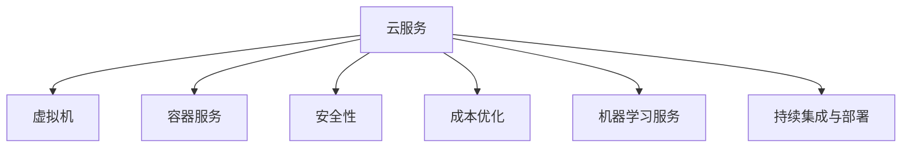

                 

# AWS云计算服务应用开发

## 1. 背景介绍

### 1.1 问题由来

云计算已经成为现代企业基础设施的重要组成部分。AWS（Amazon Web Services）作为全球领先的云服务提供商，提供了强大的计算资源和丰富的服务类型，帮助企业构建、部署和运行应用。AWS的云服务涵盖了从基础架构到人工智能，从数据库到机器学习，从数据处理到安全管理等多个领域。如何高效利用AWS的云服务，构建安全、稳定、可扩展的应用，是当前云计算领域的重要研究课题。

### 1.2 问题核心关键点

本博客将聚焦于如何在AWS上开发和部署应用，解决以下几个核心问题：

1. **基础设施管理**：如何通过AWS的管理工具，自动化管理基础设施，提高运维效率。
2. **弹性伸缩**：如何在AWS上实现自动扩展，确保应用的稳定性和性能。
3. **安全性管理**：如何利用AWS的安全工具，保护应用免受外部威胁。
4. **成本优化**：如何在AWS上合理配置资源，降低应用运行成本。
5. **机器学习与AI**：如何在AWS上构建和运行机器学习模型，利用AI技术提升应用价值。
6. **持续集成与部署**：如何通过AWS的CI/CD工具，实现应用的自动化部署和更新。

通过解决这些核心问题，本文将详细介绍如何在AWS上构建高性能、高可用的应用系统。

## 2. 核心概念与联系

### 2.1 核心概念概述

为了更好地理解AWS云服务的应用开发，本节将介绍几个密切相关的核心概念：

- **云服务**：AWS提供的基础设施服务，如计算资源、存储、数据库等，可以在云端灵活配置和使用。
- **虚拟机**：AWS提供的计算实例，用户可以在实例上安装操作系统和应用，进行计算任务。
- **容器服务**：AWS提供的Kubernetes容器编排服务，支持容器化应用在云上运行和部署。
- **安全性**：AWS提供的安全服务，如网络安全、身份验证、数据加密等，保护应用免受外部威胁。
- **成本优化**：AWS提供的成本管理工具，帮助用户监控和管理应用运行成本。
- **机器学习服务**：AWS提供的机器学习服务，如SageMaker，支持模型构建、训练和部署。
- **持续集成与部署**：AWS提供的CI/CD工具，如CodePipeline，支持应用的自动化构建、测试和部署。

这些核心概念之间的逻辑关系可以通过以下Mermaid流程图来展示：



这个流程图展示了几类云服务之间的联系：

1. 云服务是AWS提供的基础设施，包括虚拟机、容器服务、安全性和成本优化等。
2. 虚拟机是云服务中最基础、最灵活的计算资源。
3. 容器服务提供了更加便捷的容器化应用部署和管理。
4. 安全性确保了应用在云上的安全。
5. 成本优化帮助用户合理配置资源，降低应用成本。
6. 机器学习服务支持AI应用构建和部署。
7. 持续集成与部署工具提高了应用的自动化程度。

这些概念共同构成了AWS云服务的核心应用框架，使得开发者可以高效构建和运行应用。

## 3. 核心算法原理 & 具体操作步骤

### 3.1 算法原理概述

AWS云服务的应用开发，本质上是利用AWS提供的各种服务和工具，构建、部署和运行应用的过程。应用开发的算法原理，可以从以下几个方面来理解：

1. **云计算模型**：AWS提供的云服务，遵循“按需服务”和“弹性扩展”的模型，用户可以根据实际需求灵活配置和管理资源。
2. **容器化技术**：AWS的ECS（Elastic Container Service）和EKS（Elastic Kubernetes Service）支持应用以容器形式在云上运行，提高了应用的灵活性和可扩展性。
3. **安全性管理**：AWS提供的各种安全服务，如VPC、IAM、SNS等，确保应用在云上的安全性。
4. **成本优化**：AWS的Auto Scaling、Spot Instances等工具，帮助用户优化应用运行成本。
5. **机器学习与AI**：AWS的SageMaker等机器学习服务，支持模型的构建、训练和部署，帮助企业利用AI技术提升应用价值。
6. **持续集成与部署**：AWS的CodePipeline、CodeDeploy等工具，支持应用的自动化构建、测试和部署，提高开发效率。

### 3.2 算法步骤详解

AWS云服务的应用开发，可以分为以下几个关键步骤：

**Step 1: 环境搭建**
- 创建AWS账户，注册VPC（Virtual Private Cloud）和子网，安装和管理IAM角色。
- 根据应用需求，选择合适的虚拟机实例类型和容量。
- 配置网络、存储和安全策略。

**Step 2: 应用部署**
- 将应用代码打包为容器镜像，上传到容器仓库。
- 使用AWS的ECS或EKS服务，创建和部署容器实例。
- 配置负载均衡、自动扩展等策略。

**Step 3: 安全性管理**
- 利用AWS的VPC、IAM、SNS等安全服务，保护应用免受外部威胁。
- 实施访问控制、数据加密、网络隔离等安全措施。

**Step 4: 成本优化**
- 使用AWS的成本管理工具，监控和管理应用运行成本。
- 利用AWS的Auto Scaling、Spot Instances等功能，优化资源配置和成本。

**Step 5: 持续集成与部署**
- 使用AWS的CodePipeline、CodeDeploy等工具，实现应用的自动化构建、测试和部署。
- 实施CI/CD流程，确保应用的稳定性和一致性。

### 3.3 算法优缺点

AWS云服务的应用开发，具有以下优点：

1. 灵活性和扩展性：根据需求灵活配置和管理资源，支持自动扩展。
2. 高效性：利用容器化技术，提高应用的部署和运行效率。
3. 安全性：提供丰富的安全服务，确保应用在云上的安全性。
4. 成本优化：通过成本管理工具，降低应用运行成本。
5. 可扩展性：支持机器学习与AI服务，提升应用价值。
6. 自动化：提供持续集成与部署工具，提高开发效率。

同时，AWS云服务的应用开发，也存在以下缺点：

1. 学习成本高：需要掌握AWS的各类服务和工具。
2. 费用较高：云服务虽然灵活，但长期使用成本可能较高。
3. 数据依赖云服务商：数据和应用存储在云上，受云服务商的依赖。
4. 数据隐私问题：云服务商可能获取用户数据，存在隐私风险。
5. 依赖网络环境：应用依赖于云网络环境，网络故障可能导致应用不可用。

尽管存在这些局限性，AWS云服务的应用开发，仍然是目前最主流、最成熟的应用开发范式之一，值得开发者深入学习和掌握。

### 3.4 算法应用领域

AWS云服务的应用开发，已经广泛应用于各个领域，包括但不限于：

1. **Web应用**：如电子商务、社交网络、博客等，利用AWS的ECS、EKS、CDN等服务，构建高性能的Web应用。
2. **移动应用**：通过AWS的API Gateway、Lambda等服务，提供后端API支持，加速移动应用开发。
3. **大数据处理**：利用AWS的S3、Redshift等服务，存储和管理大数据，支持数据处理和分析。
4. **机器学习应用**：利用AWS的SageMaker等机器学习服务，构建和部署机器学习模型，提升应用智能化水平。
5. **物联网应用**：通过AWS的IoT服务，连接和管理物联网设备，支持设备数据处理和分析。
6. **云游戏应用**：利用AWS的游戏服务，构建和部署云游戏应用，提供高质量的游戏体验。

随着AWS云服务的不断更新和完善，其在更多领域的应用场景也将不断涌现，为企业的数字化转型提供强有力的支持。

## 4. 数学模型和公式 & 详细讲解 & 举例说明

### 4.1 数学模型构建

本节将使用数学语言对AWS云服务的应用开发过程进行更加严格的刻画。

假设AWS账户已经创建，并配置了VPC、子网、IAM角色等基础设施。应用在AWS上的部署过程可以表示为一个优化问题，目标函数为应用性能最大化，约束条件包括资源限制、安全策略、成本限制等。

设应用在AWS上的资源配置为 $x_i$，其中 $i$ 表示资源类型（如CPU、内存、网络带宽等）。目标函数为应用性能 $P$ 的函数，可以表示为：

$$
\max P(x)
$$

约束条件可以表示为：

1. 资源限制：$x_i \leq R_i$，其中 $R_i$ 表示资源的最大可用量。
2. 安全策略：$x_i \geq S_i$，其中 $S_i$ 表示安全策略所需的最小资源量。
3. 成本限制：$C(x) \leq C_{max}$，其中 $C(x)$ 表示应用运行的总成本，$C_{max}$ 表示成本的上限。

目标函数和约束条件可以进一步表示为以下线性规划问题：

$$
\begin{aligned}
\max \quad & P(x) \\
\text{s.t.} \quad & x_i \leq R_i, i=1,2,\ldots,n \\
& x_i \geq S_i, i=1,2,\ldots,n \\
& C(x) \leq C_{max}
\end{aligned}
$$

### 4.2 公式推导过程

对于上述线性规划问题，可以使用线性规划算法进行求解。求解过程可以分为以下几个步骤：

1. 定义变量 $x_i$，表示应用在AWS上的资源配置。
2. 定义目标函数 $P(x)$，表示应用性能的函数。
3. 定义约束条件 $x_i \leq R_i, i=1,2,\ldots,n$，表示资源限制。
4. 定义约束条件 $x_i \geq S_i, i=1,2,\ldots,n$，表示安全策略。
5. 定义约束条件 $C(x) \leq C_{max}$，表示成本限制。
6. 使用线性规划算法（如单纯形法）求解上述优化问题，得到最优资源配置 $x^*$。

### 4.3 案例分析与讲解

假设我们希望在AWS上部署一个Web应用，需要配置两个EC2实例（分别用于前端和后端），每个实例的CPU和内存需求如下：

| 资源类型 | CPU | 内存 |
| -------- | --- | --- |
| 前端实例 | 2核 | 4GB |
| 后端实例 | 4核 | 8GB |

设应用前端实例的CPU使用量为 $x_{cpu1}$，内存使用量为 $x_{mem1}$，后端实例的CPU使用量为 $x_{cpu2}$，内存使用量为 $x_{mem2}$。应用性能 $P$ 可以表示为CPU和内存使用量的函数：

$$
P(x) = f(x_{cpu1}, x_{mem1}, x_{cpu2}, x_{mem2})
$$

其中 $f$ 为具体的应用性能函数。假设每个实例的资源限制如下：

| 资源类型 | 最大可用量 |
| -------- | --- |
| CPU     | 16核 |
| 内存    | 32GB |

安全策略要求每个实例至少需要1核CPU和2GB内存，成本上限为每天10美元。可以构建如下线性规划问题：

$$
\begin{aligned}
\max \quad & f(x_{cpu1}, x_{mem1}, x_{cpu2}, x_{mem2}) \\
\text{s.t.} \quad & x_{cpu1} + x_{cpu2} \leq 16 \\
& x_{mem1} + x_{mem2} \leq 32 \\
& x_{cpu1} \geq 1, x_{mem1} \geq 2 \\
& x_{cpu2} \geq 1, x_{mem2} \geq 2 \\
& 10C(x) \leq 10
\end{aligned}
$$

其中 $C(x) = 0.01(x_{cpu1} + x_{cpu2}) + 0.02(x_{mem1} + x_{mem2})$，表示计算和内存成本。

求解上述线性规划问题，得到最优的资源配置 $x^*$，即可在AWS上部署Web应用。

## 5. 项目实践：代码实例和详细解释说明

### 5.1 开发环境搭建

在进行AWS云服务的应用开发前，我们需要准备好开发环境。以下是使用Python进行AWS SDK开发的环境配置流程：

1. 安装AWS CLI：从官网下载并安装AWS CLI，用于通过命令行管理AWS资源。
2. 安装AWS SDK：根据项目需求，安装相应的AWS SDK（如Boto3），用于开发和管理AWS服务。
3. 配置AWS账户：在AWS账户中创建IAM角色，并获取访问凭证。
4. 安装依赖包：安装必要的依赖包，如pandas、numpy、requests等。

完成上述步骤后，即可在开发环境中进行AWS云服务的应用开发。

### 5.2 源代码详细实现

这里我们以AWS的ECS（Elastic Container Service）服务为例，介绍如何使用Python代码在AWS上部署容器应用。

首先，创建一个Docker镜像，包含应用代码和依赖库。

```bash
# 构建Docker镜像
docker build -t my-app .
```

然后，使用AWS CLI创建ECS任务，配置任务定义和容器配置。

```bash
# 创建ECS任务
aws ecs create-cluster --cluster-name my-cluster

aws ecs create-service --cluster my-cluster --task-definition my-task-definition --network-configuration networkConfiguration={
    "awsvpcConfiguration": {
        "subnets": ["subnet-abcde123", "subnet-ab456789"],
        "assignPublicIp": "ENABLED",
        "securityGroups": ["sg-abc12345", "sg-67890"]
    }
}
```

接着，在任务定义中配置容器的启动命令和环境变量。

```yaml
# 任务定义配置
version: "latest"
containerDefinitions:
- image: my-app:latest
  command: ["python", "my-app.py"]
  memory: 512
  cpu: 256
  name: my-container
  environment:
    - NAME=my-app
    - PORT=8080
```

最后，启动ECS服务，开始运行应用。

```bash
# 启动ECS服务
aws ecs start-service --cluster my-cluster --task-definition my-task-definition --desired-count 2
```

以上就是使用AWS CLI创建ECS服务，部署容器应用的完整代码实现。可以看到，通过Python代码和AWS CLI，可以快速实现应用的自动化部署和管理。

### 5.3 代码解读与分析

让我们再详细解读一下关键代码的实现细节：

**ECS任务创建命令**：
- `aws ecs create-cluster`：创建ECS集群，指定集群名称。
- `aws ecs create-service`：创建ECS服务，指定集群、任务定义和网络配置。
- `networkConfiguration`：配置VPC子网、安全组、公网IP等信息，确保容器能正确访问网络资源。

**任务定义配置**：
- `version: "latest"`：指定Docker镜像版本。
- `containerDefinitions`：定义容器配置，包括镜像、启动命令、内存、CPU、环境变量等。

**ECS服务启动命令**：
- `aws ecs start-service`：启动ECS服务，指定集群、任务定义和期望运行实例数量。

可以看到，通过Python代码和AWS CLI的结合，可以快速实现应用的自动化部署和管理。AWS的ECS服务提供了便捷的容器化应用部署和管理功能，开发者可以专注于应用的开发和功能实现，而不必担心基础设施的复杂性和维护成本。

## 6. 实际应用场景

### 6.1 Web应用

AWS的ECS、EKS等云服务，可以用于构建高性能的Web应用。通过容器化技术，支持应用的快速部署、弹性扩展和故障恢复。AWS的CDN、API Gateway等服务，可以提供静态资源加速和API访问支持，提升Web应用的性能和用户体验。

### 6.2 移动应用

AWS的API Gateway、Lambda等服务，可以用于构建后端API，支持移动应用的API调用。通过AWS的IAM服务，可以对API进行访问控制，确保应用安全。AWS的SNS、SQS等服务，可以用于推送消息和异步通信，提升应用的响应速度和稳定性。

### 6.3 大数据处理

AWS的S3、Redshift等服务，可以用于存储和管理大数据。通过AWS的Kinesis等服务，可以实现数据的实时采集、处理和分析，支持数据的批处理和流处理。AWS的Emr等服务，可以用于构建和管理大数据计算集群，支持数据的分布式计算和分析。

### 6.4 机器学习应用

AWS的SageMaker等服务，可以用于构建和部署机器学习模型。通过AWS的Data Pipeline等服务，可以自动化数据预处理、模型训练和模型部署，提升机器学习应用的开发效率和效果。AWS的S3等服务，可以用于存储和管理数据，支持数据的分布式存储和处理。

### 6.5 物联网应用

AWS的IoT等服务，可以用于连接和管理物联网设备。通过AWS的MQTT等服务，可以实现设备数据采集、传输和存储。AWS的Kinesis等服务，可以用于处理和分析设备数据，支持设备数据的实时处理和分析。AWS的Lambda等服务，可以用于设备数据处理和分析，提升设备应用的性能和稳定性。

## 7. 工具和资源推荐

### 7.1 学习资源推荐

为了帮助开发者系统掌握AWS云服务的应用开发，这里推荐一些优质的学习资源：

1. **AWS官方文档**：AWS提供的官方文档，涵盖了AWS云服务的各类服务和API，是学习AWS的必备资料。
2. **《AWS认证指南》**：全面介绍了AWS云服务的各类服务和工具，适合AWS认证考试和实际开发。
3. **《AWS云服务实战》**：通过实战案例，讲解AWS云服务的各类服务和工具，适合AWS的实际开发和应用。
4. **AWS社区**：AWS提供的开发者社区，提供丰富的学习资源和交流平台，适合学习和交流。

通过学习这些资源，相信你一定能够快速掌握AWS云服务的应用开发，并用于解决实际的云服务问题。

### 7.2 开发工具推荐

高效的开发离不开优秀的工具支持。以下是几款用于AWS云服务应用开发的常用工具：

1. **AWS CLI**：AWS提供的命令行工具，方便通过命令行管理AWS资源。
2. **AWS SDK**：AWS提供的编程语言SDK，支持多种编程语言，方便开发和管理AWS服务。
3. **AWS CloudFormation**：AWS提供的云资源管理工具，支持自动化配置和管理AWS资源。
4. **AWS CloudWatch**：AWS提供的云监控工具，支持实时监控和管理AWS资源。
5. **AWS X-Ray**：AWS提供的云服务性能分析工具，支持实时监控和管理AWS服务的性能。
6. **AWS CodePipeline**：AWS提供的持续集成和持续部署工具，支持自动化构建、测试和部署。

合理利用这些工具，可以显著提升AWS云服务应用开发的效率和稳定性。

### 7.3 相关论文推荐

AWS云服务的应用开发，源于学界的持续研究。以下是几篇奠基性的相关论文，推荐阅读：

1. **Cloud Computing: Concepts, Technology, and Architecture**：介绍了云计算的基本概念和技术架构，是学习AWS云服务的重要资料。
2. **Design and Analysis of Cloud Computing**：分析了云计算的设计和实现方法，适合深入研究AWS云服务的底层原理。
3. **Design Patterns for Cloud Computing**：介绍了云计算的设计模式和技术架构，适合学习和应用AWS云服务的设计模式。
4. **Cloud Computing: Paradigms and Architectures**：介绍了云计算的范式和架构方法，适合学习和应用AWS云服务的高级技术。

这些论文代表了大规模云计算技术的发展脉络。通过学习这些前沿成果，可以帮助研究者把握云计算技术的前沿方向，激发更多的创新灵感。

## 8. 总结：未来发展趋势与挑战

### 8.1 总结

本文对AWS云服务的应用开发进行了全面系统的介绍。首先阐述了AWS云服务的应用开发背景和重要性，明确了应用开发的核心问题。其次，从原理到实践，详细讲解了AWS云服务的各类服务和工具，给出了完整的代码实例和详细解释。同时，本文还探讨了AWS云服务在各个领域的应用场景，展示了AWS云服务的强大功能和应用潜力。最后，本文推荐了优质的学习资源、开发工具和相关论文，力求为开发者提供全方位的技术指引。

通过本文的系统梳理，可以看到，AWS云服务的应用开发，已经成为云计算领域的重要范式，极大地提升了企业应用开发和部署的效率和质量。未来，伴随AWS云服务的不断更新和完善，AWS云服务必将在更多领域得到应用，为企业的数字化转型提供强有力的支持。

### 8.2 未来发展趋势

展望未来，AWS云服务的应用开发将呈现以下几个发展趋势：

1. **多云管理**：支持多云平台的资源管理和调度，提升资源利用效率和可用性。
2. **无服务器架构**：支持无服务器架构（如AWS Lambda），提高应用的灵活性和可扩展性。
3. **机器学习和AI**：支持更加丰富的机器学习和AI服务，提升应用的智能化水平。
4. **边缘计算**：支持边缘计算服务（如AWS Greengrass），支持设备的本地计算和存储。
5. **自动化运维**：提供更加智能的自动化运维工具，提高应用的稳定性和可扩展性。
6. **物联网应用**：支持更加丰富的物联网服务，支持物联网设备的连接和管理。

以上趋势凸显了AWS云服务应用开发的发展前景。这些方向的探索发展，必将进一步提升AWS云服务的性能和应用范围，为企业的数字化转型提供更加全面的支持。

### 8.3 面临的挑战

尽管AWS云服务的应用开发已经取得了显著成就，但在迈向更加智能化、普适化应用的过程中，仍面临诸多挑战：

1. **学习成本高**：需要掌握AWS的各类服务和工具，学习成本较高。
2. **费用较高**：云服务虽然灵活，但长期使用成本可能较高。
3. **数据依赖云服务商**：数据和应用存储在云上，受云服务商的依赖。
4. **数据隐私问题**：云服务商可能获取用户数据，存在隐私风险。
5. **依赖网络环境**：应用依赖于云网络环境，网络故障可能导致应用不可用。

尽管存在这些挑战，AWS云服务的应用开发，仍然是目前最主流、最成熟的应用开发范式之一，值得开发者深入学习和掌握。

### 8.4 研究展望

面对AWS云服务应用开发所面临的挑战，未来的研究需要在以下几个方面寻求新的突破：

1. **自动化运维**：提供更加智能的自动化运维工具，提高应用的稳定性和可扩展性。
2. **多云管理**：支持多云平台的资源管理和调度，提升资源利用效率和可用性。
3. **无服务器架构**：支持无服务器架构（如AWS Lambda），提高应用的灵活性和可扩展性。
4. **边缘计算**：支持边缘计算服务（如AWS Greengrass），支持设备的本地计算和存储。
5. **机器学习和AI**：支持更加丰富的机器学习和AI服务，提升应用的智能化水平。
6. **安全性管理**：提供更加智能的安全管理工具，提升应用的安全性和可扩展性。

这些研究方向将进一步提升AWS云服务的性能和应用范围，为企业的数字化转型提供更加全面的支持。

## 9. 附录：常见问题与解答

**Q1: 如何在AWS上部署Web应用？**

A: 使用AWS的ECS或EKS服务，将应用以容器形式部署在AWS云上。创建ECS任务，配置容器定义和网络配置，启动ECS服务即可。

**Q2: AWS CLI和SDK有什么区别？**

A: AWS CLI是AWS提供的命令行工具，用于通过命令行管理AWS资源。AWS SDK是AWS提供的编程语言SDK，支持多种编程语言，方便开发和管理AWS服务。

**Q3: AWS的成本优化策略有哪些？**

A: AWS提供Auto Scaling、Spot Instances等工具，帮助用户优化应用运行成本。Auto Scaling可以根据应用负载自动扩展或缩减资源，Spot Instances可以以较低成本获取计算资源。

**Q4: 什么是AWS Lambda？**

A: AWS Lambda是AWS提供的无服务器计算服务，支持编写和运行服务器无状态代码，支持自动化部署和扩展。

**Q5: 如何提升AWS应用的安全性？**

A: 利用AWS的IAM服务，进行访问控制和身份验证。使用AWS的VPC服务，进行网络隔离和安全防护。利用AWS的SNS服务，进行消息传递和事件管理。

通过这些常见问题的解答，可以帮助开发者更好地理解AWS云服务的应用开发，并应用于实际项目中。

---

作者：禅与计算机程序设计艺术 / Zen and the Art of Computer Programming

