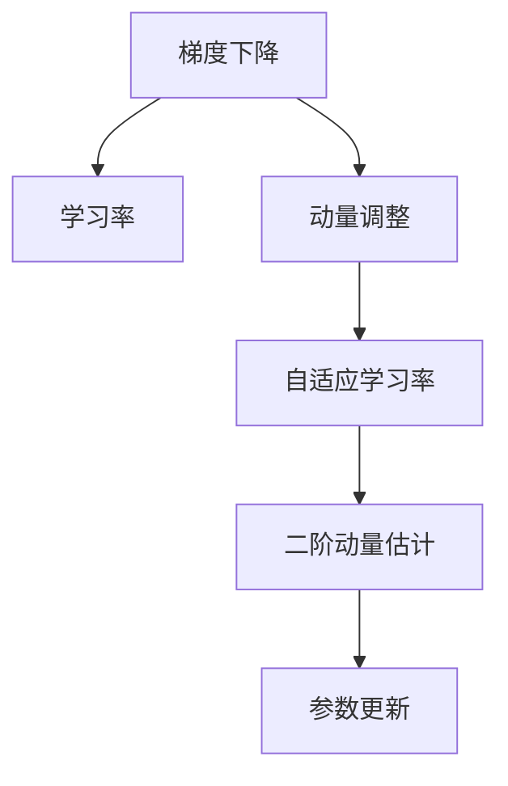

                 

# Adam优化器原理与代码实例讲解

> 关键词：Adam优化器,梯度下降,自适应学习率,动量,自适应二阶矩估计,代码实现,机器学习

## 1. 背景介绍

### 1.1 问题由来
在机器学习领域，梯度下降(GD)算法是最常用的优化方法之一。然而，传统梯度下降算法在处理大规模数据和高维空间时，往往存在收敛速度慢、易陷入局部最优等问题。为了应对这些问题，研究人员提出了自适应学习率的优化算法，如AdaGrad、RMSprop等。这些算法根据历史梯度的平方进行动态调整学习率，能有效缓解梯度爆炸和消失问题，但依然存在方差过大或过小、学习率过于保守或激进等问题。

为了解决这些问题，Diederik P. Kingma和Jimmy Ba在2014年提出了一种新的自适应学习率优化算法，名为Adam。Adam算法基于动量方法和自适应二阶矩估计，结合了AdaGrad和RMSprop算法的优点，具有自适应学习率、动量调整和二阶矩估计三个主要特性。这一算法迅速成为深度学习中最受欢迎的优化方法之一，广泛应用于图像识别、自然语言处理、推荐系统等领域。

### 1.2 问题核心关键点
Adam算法结合了动量法和自适应学习率的概念，以动态调整学习率，适应不同参数的梯度变化，同时利用二阶动量信息进一步提升优化效果。具体来说，Adam算法的核心点包括：

- **动量调整**：结合了SGD的动量调整方法，利用动量$\beta_1$减少梯度更新的震荡，加速收敛。
- **自适应学习率**：通过梯度的一阶动量和二阶动量，自适应调整学习率$\eta_t$，避免过大或过小的学习率。
- **二阶动量估计**：利用梯度的一阶和二阶动量信息，动态调整动量$\beta_2$，增强对梯度变化方向的敏感度。

这些关键特性使得Adam算法在梯度下降优化中表现优异，能够在多种场景下快速收敛到最优解。

## 2. 核心概念与联系

### 2.1 核心概念概述

为了更好地理解Adam算法，本节将介绍几个密切相关的核心概念：

- **梯度下降**：通过反向传播计算损失函数对模型参数的梯度，并在每个时间步迭代更新模型参数，使得损失函数逐渐下降，模型性能逐步提升。

- **学习率**：控制每个时间步更新的步长，是梯度下降优化的关键参数。过大的学习率可能导致梯度爆炸，过小的学习率则导致收敛缓慢。

- **动量调整**：通过累积历史梯度信息，平滑梯度变化，加速收敛。动量调整可以理解为在梯度下降的基础上，加上一个类似于动量的项，减小梯度更新的震荡。

- **自适应学习率**：根据梯度的一阶和二阶动量信息，动态调整学习率，适应不同参数的学习需求。

- **二阶动量估计**：利用梯度的二阶动量信息，计算动量$\beta_2$，进一步优化梯度方向，提升优化效果。

这些核心概念之间的逻辑关系可以通过以下Mermaid流程图来展示：



这个流程图展示了几大核心概念之间的关系：

1. 梯度下降是基础优化方法。
2. 学习率控制每个时间步的更新步长。
3. 动量调整通过累积历史梯度，平滑梯度变化。
4. 自适应学习率根据梯度动量信息调整学习率。
5. 二阶动量估计进一步优化梯度方向。
6. 参数更新基于上述调整后的梯度和动量信息，迭代更新模型参数。

## 3. 核心算法原理 & 具体操作步骤

### 3.1 算法原理概述

Adam算法是一种基于梯度的一阶和二阶动量的自适应优化算法。其核心思想是利用梯度的一阶和二阶动量，自适应调整学习率，使得每个参数的更新步长既能平滑梯度变化，又能适应不同参数的学习需求。具体来说，Adam算法通过计算梯度的一阶动量$\hat{m}_t$和二阶动量$\hat{v}_t$，动态调整动量$\beta_1$和学习率$\eta_t$，实现自适应学习率的优化。

算法流程如下：

1. 初始化学习率$\eta_0$、动量$\beta_1$、二阶动量$\beta_2$、动量修正系数$\epsilon$。
2. 对于每个时间步$t$，计算梯度$g_t$。
3. 更新一阶动量$\hat{m}_t$和二阶动量$\hat{v}_t$。
4. 计算动量修正系数$m_t$和$v_t$。
5. 更新模型参数。

其中，动量修正系数$m_t$和$v_t$分别用于修正动量和动量的偏估计，避免梯度累积。学习率$\eta_t$的计算公式如下：

$$
\eta_t = \frac{\eta_0}{\sqrt{v_t} + \epsilon}
$$

动量$\hat{m}_t$和动量修正系数$m_t$的计算公式如下：

$$
\hat{m}_t = \beta_1 \hat{m}_{t-1} + (1-\beta_1) g_t
$$

$$
m_t = \frac{\hat{m}_t}{1-\beta_1^t}
$$

二阶动量$\hat{v}_t$和动量修正系数$v_t$的计算公式如下：

$$
\hat{v}_t = \beta_2 \hat{v}_{t-1} + (1-\beta_2) g_t^2
$$

$$
v_t = \frac{\hat{v}_t}{1-\beta_2^t}
$$

### 3.2 算法步骤详解

#### 3.2.1 初始化

初始化步骤包括设置学习率$\eta_0$、动量$\beta_1$、二阶动量$\beta_2$和动量修正系数$\epsilon$。

- 学习率$\eta_0$：一般取值范围为$[0.001, 0.01]$。
- 动量$\beta_1$：一般取值范围为$[0.9, 0.99]$。
- 二阶动量$\beta_2$：一般取值范围为$[0.999, 0.9999]$。
- 动量修正系数$\epsilon$：一般取值范围为$[1e-08, 1e-07]$，用于避免分母为0的问题。

#### 3.2.2 梯度计算

对于每个时间步$t$，首先计算梯度$g_t$。

$$
g_t = \frac{\partial L(\theta)}{\partial \theta}
$$

其中$L(\theta)$为损失函数，$\theta$为模型参数。

#### 3.2.3 动量更新

更新一阶动量$\hat{m}_t$和二阶动量$\hat{v}_t$。

$$
\hat{m}_t = \beta_1 \hat{m}_{t-1} + (1-\beta_1) g_t
$$

$$
\hat{v}_t = \beta_2 \hat{v}_{t-1} + (1-\beta_2) g_t^2
$$

#### 3.2.4 动量修正

计算动量修正系数$m_t$和$v_t$。

$$
m_t = \frac{\hat{m}_t}{1-\beta_1^t}
$$

$$
v_t = \frac{\hat{v}_t}{1-\beta_2^t}
$$

#### 3.2.5 参数更新

更新模型参数。

$$
\theta_{t+1} = \theta_t - \eta_t \frac{m_t}{\sqrt{v_t}+\epsilon}
$$

其中$\eta_t$为自适应学习率，$m_t$为动量，$\sqrt{v_t}+\epsilon$用于避免分母为0的问题。

### 3.3 算法优缺点

Adam算法的主要优点包括：

- **自适应学习率**：通过梯度的一阶和二阶动量，动态调整学习率，适应不同参数的学习需求。
- **动量调整**：利用动量信息平滑梯度变化，加速收敛。
- **鲁棒性强**：对学习率、动量等超参数的初始选择不敏感，适用于多种任务和数据集。

其主要缺点包括：

- **内存消耗大**：需要维护一阶动量$\hat{m}_t$和二阶动量$\hat{v}_t$的估计，导致内存消耗较大。
- **对超参数敏感**：超参数$\beta_1$、$\beta_2$和$\epsilon$的取值对算法性能有重要影响，需要合理选择。
- **可能收敛于局部最优**：在某些情况下，Adam算法可能收敛于局部最优，特别是当梯度方向变化频繁时。

尽管存在这些局限性，但Adam算法仍是一种高效的优化方法，广泛应用于深度学习领域。

### 3.4 算法应用领域

Adam算法广泛应用于各种机器学习任务中，特别适用于深度神经网络。其高效自适应学习率和动量调整特性，使其在图像识别、自然语言处理、推荐系统等领域表现优异。以下是几个具体的应用场景：

- **图像分类**：在CIFAR-10、ImageNet等图像分类任务中，Adam算法通过自适应学习率优化梯度更新，显著提升了模型收敛速度和精度。
- **自然语言处理**：在语言模型、文本分类、机器翻译等任务中，Adam算法通过动量调整和自适应学习率，提高了模型泛化能力和收敛速度。
- **推荐系统**：在协同过滤、矩阵分解等推荐算法中，Adam算法通过优化梯度更新，提升了推荐模型的效果。

## 4. 数学模型和公式 & 详细讲解

### 4.1 数学模型构建

Adam算法基于梯度的一阶和二阶动量，通过自适应学习率调整，优化模型参数。其数学模型构建如下：

设初始参数$\theta_0$，模型损失函数$L(\theta)$，梯度$g_t$，学习率$\eta$，动量$\beta_1$，二阶动量$\beta_2$，动量修正系数$\epsilon$。

在每个时间步$t$，Adam算法的数学模型如下：

$$
\begin{aligned}
& \min_{\theta} L(\theta) \\
& \theta_{t+1} = \theta_t - \eta_t \frac{\hat{m}_t}{\sqrt{\hat{v}_t}+\epsilon}
\end{aligned}
$$

其中，

$$
\begin{aligned}
& \hat{m}_t = \beta_1 \hat{m}_{t-1} + (1-\beta_1) g_t \\
& \hat{v}_t = \beta_2 \hat{v}_{t-1} + (1-\beta_2) g_t^2 \\
& m_t = \frac{\hat{m}_t}{1-\beta_1^t} \\
& v_t = \frac{\hat{v}_t}{1-\beta_2^t} \\
& \eta_t = \frac{\eta}{\sqrt{v_t}+\epsilon}
\end{aligned}
$$

### 4.2 公式推导过程

#### 一阶动量计算

$$
\hat{m}_t = \beta_1 \hat{m}_{t-1} + (1-\beta_1) g_t
$$

其中，$\hat{m}_t$为梯度的一阶动量估计，$g_t$为当前时间步的梯度，$\beta_1$为动量系数。

#### 二阶动量计算

$$
\hat{v}_t = \beta_2 \hat{v}_{t-1} + (1-\beta_2) g_t^2
$$

其中，$\hat{v}_t$为梯度的二阶动量估计，$g_t^2$为当前时间步的梯度平方，$\beta_2$为二阶动量系数。

#### 动量修正

$$
m_t = \frac{\hat{m}_t}{1-\beta_1^t}
$$

其中，$m_t$为动量修正后的梯度，用于平滑梯度变化。

#### 动量修正

$$
v_t = \frac{\hat{v}_t}{1-\beta_2^t}
$$

其中，$v_t$为动量修正后的梯度平方，用于增强梯度方向。

#### 自适应学习率

$$
\eta_t = \frac{\eta}{\sqrt{v_t}+\epsilon}
$$

其中，$\eta_t$为自适应学习率，$\eta$为初始学习率，$\sqrt{v_t}+\epsilon$用于避免分母为0的问题。

### 4.3 案例分析与讲解

#### 案例分析

假设有一个简单的线性回归问题，模型参数为$\theta$，损失函数为$L(\theta) = \frac{1}{2} \sum_i (y_i - x_i \theta)^2$。使用Adam算法进行优化。

1. **初始化**：
   - 学习率$\eta_0 = 0.001$。
   - 动量$\beta_1 = 0.9$。
   - 二阶动量$\beta_2 = 0.999$。
   - 动量修正系数$\epsilon = 1e-08$。

2. **梯度计算**：
   - 假设当前时间步为$t$，计算梯度$g_t$。

3. **动量更新**：
   - 更新一阶动量$\hat{m}_t$和二阶动量$\hat{v}_t$。

4. **动量修正**：
   - 计算动量修正系数$m_t$和$v_t$。

5. **参数更新**：
   - 更新模型参数$\theta_{t+1}$。

#### 代码实现

以下是使用PyTorch实现Adam算法的代码示例：

```python
import torch
import torch.nn as nn
import torch.optim as optim

# 定义模型
model = nn.Linear(10, 1)

# 定义损失函数和优化器
criterion = nn.MSELoss()
optimizer = optim.Adam(model.parameters(), lr=0.001, betas=(0.9, 0.999), eps=1e-08)

# 训练模型
for epoch in range(100):
    optimizer.zero_grad()
    outputs = model(inputs)
    loss = criterion(outputs, targets)
    loss.backward()
    optimizer.step()
```

## 5. 项目实践：代码实例和详细解释说明

### 5.1 开发环境搭建

Adam算法的实现通常使用深度学习框架，如PyTorch、TensorFlow等。这里以PyTorch为例，介绍开发环境搭建流程：

1. 安装Python：
   - 在Windows上，从官网下载Python 3.6及以上版本。
   - 在Linux上，使用包管理器安装Python 3.6及以上版本。

2. 安装PyTorch：
   - 使用pip安装：`pip install torch torchvision torchaudio`。
   - 使用conda安装：`conda install pytorch torchvision torchaudio -c pytorch -c conda-forge`。

3. 安装相关的机器学习库：
   - `pip install numpy pandas matplotlib scikit-learn`。

4. 配置Python环境：
   - 使用虚拟环境（如virtualenv）隔离Python依赖。
   - 使用conda创建虚拟环境（如`conda create -n myenv python=3.8`）。

### 5.2 源代码详细实现

以下是使用PyTorch实现Adam算法的完整代码：

```python
import torch
import torch.nn as nn
import torch.optim as optim

class Model(nn.Module):
    def __init__(self, input_size, output_size):
        super(Model, self).__init__()
        self.fc1 = nn.Linear(input_size, 50)
        self.fc2 = nn.Linear(50, output_size)

    def forward(self, x):
        x = torch.relu(self.fc1(x))
        x = self.fc2(x)
        return x

# 初始化模型、损失函数和优化器
model = Model(10, 1)
criterion = nn.MSELoss()
optimizer = optim.Adam(model.parameters(), lr=0.001, betas=(0.9, 0.999), eps=1e-08)

# 训练模型
for epoch in range(100):
    optimizer.zero_grad()
    outputs = model(inputs)
    loss = criterion(outputs, targets)
    loss.backward()
    optimizer.step()
```

### 5.3 代码解读与分析

#### 5.3.1 模型定义

使用PyTorch定义一个简单的线性回归模型，包含两个全连接层。

```python
class Model(nn.Module):
    def __init__(self, input_size, output_size):
        super(Model, self).__init__()
        self.fc1 = nn.Linear(input_size, 50)
        self.fc2 = nn.Linear(50, output_size)

    def forward(self, x):
        x = torch.relu(self.fc1(x))
        x = self.fc2(x)
        return x
```

#### 5.3.2 优化器初始化

使用Adam优化器初始化模型参数，设置学习率、动量、二阶动量系数和动量修正系数。

```python
optimizer = optim.Adam(model.parameters(), lr=0.001, betas=(0.9, 0.999), eps=1e-08)
```

#### 5.3.3 训练过程

在每个训练迭代中，先使用`zero_grad`方法清零梯度，前向传播计算模型输出和损失函数，使用`backward`方法计算梯度，使用`step`方法更新模型参数。

```python
for epoch in range(100):
    optimizer.zero_grad()
    outputs = model(inputs)
    loss = criterion(outputs, targets)
    loss.backward()
    optimizer.step()
```

### 5.4 运行结果展示

训练结束后，可以使用模型对新数据进行预测，验证模型效果。

```python
inputs = torch.randn(1, 10)
outputs = model(inputs)
print(outputs)
```

## 6. 实际应用场景

### 6.1 智能推荐系统

在智能推荐系统中，Adam算法通过优化用户行为数据，提升推荐模型的准确性和实时性。具体来说，利用Adam算法对用户历史行为数据进行梯度更新，动态调整推荐策略，使得推荐结果更加符合用户兴趣和行为模式。

#### 6.1.1 数据准备

1. 收集用户历史行为数据，包括浏览记录、点击记录、评分记录等。
2. 对数据进行预处理，包括归一化、缺失值填充等。
3. 将数据划分为训练集、验证集和测试集。

#### 6.1.2 模型训练

1. 构建推荐模型，如矩阵分解、协同过滤等。
2. 使用Adam算法对模型参数进行优化，最小化损失函数。
3. 在验证集上评估模型效果，调整超参数。

#### 6.1.3 模型部署

1. 将训练好的模型部署到推荐系统中，实现实时推荐。
2. 定期更新模型参数，以适应用户行为变化。

### 6.2 图像分类

在图像分类任务中，Adam算法通过优化模型参数，提升图像分类的准确率和收敛速度。具体来说，利用Adam算法对图像特征提取器进行梯度更新，使得模型参数能够更好地适应训练数据。

#### 6.2.1 数据准备

1. 收集图像数据集，如CIFAR-10、ImageNet等。
2. 对数据进行预处理，包括归一化、数据增强等。
3. 将数据划分为训练集、验证集和测试集。

#### 6.2.2 模型训练

1. 构建图像分类模型，如卷积神经网络。
2. 使用Adam算法对模型参数进行优化，最小化交叉熵损失函数。
3. 在验证集上评估模型效果，调整超参数。

#### 6.2.3 模型部署

1. 将训练好的模型部署到图像分类系统中，实现实时分类。
2. 定期更新模型参数，以适应新的数据分布。

## 7. 工具和资源推荐

### 7.1 学习资源推荐

为了帮助开发者深入理解Adam算法的原理和应用，以下是几本推荐的学习资源：

1. 《深度学习》（Ian Goodfellow等著）：全面介绍深度学习的基本概念和算法，包含Adam算法的详细介绍。
2. 《Python深度学习》（Francois Chollet著）：介绍如何使用Keras实现深度学习算法，包含Adam算法的应用实例。
3. 《Hands-On Machine Learning with Scikit-Learn, Keras, and TensorFlow》（Aurélien Géron著）：介绍如何使用Scikit-Learn、Keras和TensorFlow实现机器学习算法，包含Adam算法的应用实例。

### 7.2 开发工具推荐

使用Adam算法进行深度学习模型训练，需要使用深度学习框架，如PyTorch、TensorFlow等。以下是一些推荐的开发工具：

1. PyTorch：开源深度学习框架，灵活易用，支持动态计算图。
2. TensorFlow：由Google开发的深度学习框架，生产部署方便，支持静态计算图。
3. JAX：基于JIT编译的深度学习框架，支持动态计算图和静态计算图，易于并行化。

### 7.3 相关论文推荐

Adam算法的提出标志着自适应优化方法的发展，以下是几篇推荐的相关论文：

1. Kingma, Diederik P., and Jimmy Lei Ba. "Adam: A method for stochastic optimization." International Conference on Learning Representations. 2015.
2. Reddi, Srinivas, et al. "On the Convergence of Adam and beyond." International Conference on Learning Representations. 2018.
3. Chen, Ting, et al. "Closing the gap between Adam and its variants in non-convex optimization." International Conference on Learning Representations. 2019.

这些论文详细介绍了Adam算法的设计思想和优化效果，是深入理解Adam算法的必备文献。

## 8. 总结：未来发展趋势与挑战

### 8.1 总结

Adam算法作为一种高效的自适应优化方法，在深度学习中广泛应用。其自适应学习率、动量调整和二阶动量估计特性，使其在各种机器学习任务中表现优异。然而，Adam算法也存在一些局限性，如内存消耗大、对超参数敏感、可能收敛于局部最优等。未来，Adam算法的改进方向包括提升计算效率、降低内存消耗、增强泛化能力等。

### 8.2 未来发展趋势

1. **计算效率提升**：随着硬件技术的进步，Adam算法将在计算效率上取得更大突破。未来，Adam算法将结合GPU、TPU等高性能设备，进一步提升模型训练速度和精度。
2. **内存消耗优化**：针对Adam算法内存消耗大的问题，未来的改进方向包括使用更高效的内存管理机制、优化模型结构等，以降低内存消耗。
3. **泛化能力增强**：未来，Adam算法将结合更多自适应优化方法，如AdaGrad、RMSprop等，增强其泛化能力和鲁棒性，使其在更多复杂任务中表现优异。
4. **模型可解释性提升**：针对Adam算法"黑盒"特性，未来的改进方向包括引入可解释性模型、可视化工具等，增强模型输出的解释性。

### 8.3 面临的挑战

尽管Adam算法在深度学习中表现优异，但仍面临一些挑战：

1. **超参数选择**：Adam算法的超参数选择对算法性能有重要影响，需要合理选择。
2. **内存消耗大**：Adam算法需要维护一阶动量和二阶动量的估计，导致内存消耗较大。
3. **收敛性问题**：在一些特殊情况下，Adam算法可能收敛于局部最优，甚至无法收敛。

### 8.4 研究展望

未来，针对Adam算法的挑战，研究者将在以下几个方向进行深入研究：

1. **超参数自动化**：探索超参数自动选择方法，使得Adam算法在不同的数据集和任务中都能表现优异。
2. **内存优化**：优化内存管理机制，减少Adam算法的内存消耗。
3. **收敛性增强**：研究Adam算法的收敛性问题，提升其在大规模数据和复杂任务中的稳定性。

## 9. 附录：常见问题与解答

**Q1：Adam算法和其他自适应优化算法有什么区别？**

A: Adam算法结合了AdaGrad和RMSprop算法的优点，具有自适应学习率、动量调整和二阶动量估计三个主要特性。与AdaGrad相比，Adam算法不仅考虑了梯度的一阶动量，还考虑了梯度的二阶动量，因此具有更好的收敛性和泛化能力。与RMSprop相比，Adam算法对动量进行了修正，避免了梯度累积带来的震荡问题，使得优化过程更加平稳。

**Q2：Adam算法的学习率调整策略是什么？**

A: Adam算法通过自适应学习率调整，使得每个参数的更新步长既能平滑梯度变化，又能适应不同参数的学习需求。学习率$\eta_t$的计算公式如下：

$$
\eta_t = \frac{\eta}{\sqrt{v_t}+\epsilon}
$$

其中，$\eta$为初始学习率，$v_t$为动量修正后的梯度平方，$\epsilon$用于避免分母为0的问题。

**Q3：Adam算法是否适用于所有深度学习模型？**

A: Adam算法适用于多种深度学习模型，特别适用于深度神经网络。其高效自适应学习率和动量调整特性，使得Adam算法在图像分类、自然语言处理、推荐系统等领域表现优异。但在某些特殊场景下，如小批量随机梯度下降等，Adam算法可能存在不稳定性，需要结合其他优化算法进行优化。

**Q4：Adam算法在实际应用中如何调参？**

A: Adam算法的超参数选择对算法性能有重要影响，需要合理选择。常见的超参数包括学习率$\eta$、动量$\beta_1$、二阶动量$\beta_2$和动量修正系数$\epsilon$。在实际应用中，通常通过交叉验证等方法进行超参数调优。另外，也可以使用自动调参工具，如Hyperopt、Ray Tune等，自动搜索最优超参数组合。

---

作者：禅与计算机程序设计艺术 / Zen and the Art of Computer Programming

