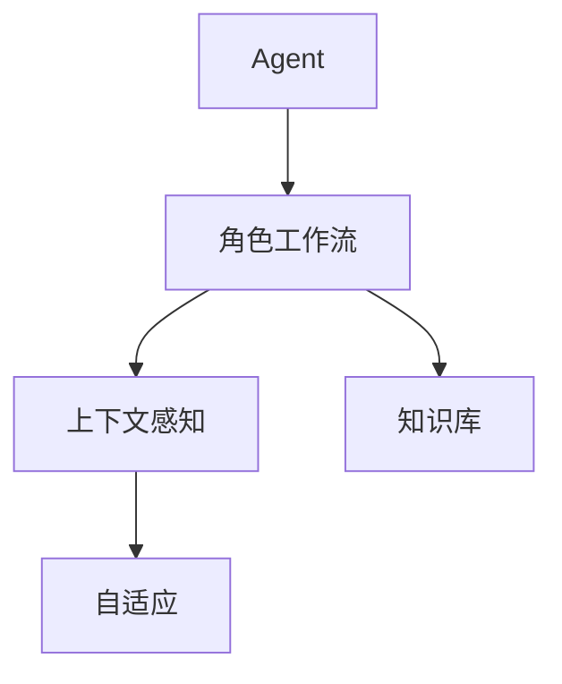

                 

# Agent驱动的角色工作流变革

## 1. 背景介绍

随着人工智能技术的发展，智能代理(Agent)在各种场景下得到广泛应用。智能代理具有自主性、反应性、社会性和知识性，能够在复杂的业务环境中自动执行各种任务，显著提高工作效率和质量。在业务系统设计中，角色工作流（Role-based Workflow）是一种常用的建模方法，通过定义角色及其行为逻辑，实现对业务过程的自动化管理。然而，传统角色工作流在应对复杂的业务场景和任务依赖关系时，存在数据管理混乱、流程逻辑复杂、业务响应缓慢等问题。本文将以“Agent驱动的角色工作流”为研究对象，深入探讨如何通过引入智能代理，变革传统角色工作流，实现更加高效、灵活、智能的业务管理。

## 2. 核心概念与联系

### 2.1 核心概念概述

为更好地理解“Agent驱动的角色工作流”，本节将介绍几个关键概念：

- **Agent**: 一种基于智能软件技术实现的系统实体，能够感知环境、执行任务、获取知识并适应环境。

- **角色工作流(Role-based Workflow)**: 一种基于业务角色的工作流模型，定义角色之间的行为逻辑和数据流转，实现业务过程的自动化管理。

- **智能代理(Agent-driven Workflow)**: 通过智能代理驱动的角色工作流，利用Agent的自主性、反应性和社会性，增强工作流过程的智能性和自动化程度。

- **上下文感知(Context-aware)**: 智能代理能够感知和理解业务上下文，提供更加精准的决策和响应。

- **自适应(Adaptive)**: 智能代理能够根据环境变化和任务需求，动态调整其行为和策略，保持高效稳定的运行。

- **知识库(Knowledge Base)**: 存储Agent的规则、模型、数据等知识资源的库，支持智能代理的学习和决策。

这些核心概念之间的逻辑关系可以通过以下Mermaid流程图来展示：



这个流程图展示了两大关键概念之间的联系：

1. 智能代理是角色工作流的驱动主体，通过感知上下文和自适应机制，实现灵活高效的业务管理。
2. 知识库作为智能代理的决策支持，提供丰富的规则、模型和数据，增强智能代理的智能性和自动化程度。

## 3. 核心算法原理 & 具体操作步骤
### 3.1 算法原理概述

Agent驱动的角色工作流基于Agent的自主性、反应性和社会性，实现对业务过程的智能管理。其核心思想是：将业务流程建模为角色与任务的网络，每个角色由一个或多个智能代理担任，智能代理能够根据上下文信息，自主执行任务并动态调整策略。

假设业务流程由 $N$ 个角色 $R=\{R_1, R_2, ..., R_N\}$ 和 $M$ 个任务 $T=\{T_1, T_2, ..., T_M\}$ 构成，角色之间的依赖关系可以用图 $G=(V,E)$ 表示，其中 $V$ 为节点集合，$E$ 为边集合。智能代理 $A$ 的目标是最大化其执行任务的成功率和满意度，具体算法流程如下：

**Step 1: 角色建模**
- 定义业务流程中的角色，包括角色职责、行为规则和数据权限等。
- 通过图论方法建模角色之间的关系，定义每个角色的前置条件和后置任务。

**Step 2: 任务建模**
- 定义业务流程中的任务，包括任务逻辑、输入输出和执行条件等。
- 将任务建模为图 $G$ 中的节点，定义任务间的依赖关系和执行顺序。

**Step 3: 知识库构建**
- 构建知识库，存储角色和任务的规则、模型和数据。
- 定义智能代理的决策过程，利用知识库支持其自主决策和执行。

**Step 4: 智能代理执行**
- 初始化智能代理，将角色与任务映射到智能代理。
- 智能代理通过感知上下文信息，自主执行任务。
- 智能代理根据环境变化和任务需求，动态调整其行为策略。

**Step 5: 反馈与优化**
- 收集智能代理执行过程中的反馈信息，评估其绩效和满意度。
- 根据反馈信息，优化智能代理的行为策略和知识库内容。
- 不断迭代优化，提升智能代理的智能性和自动化程度。

### 3.2 算法步骤详解

#### 3.2.1 角色建模
角色建模是Agent驱动的角色工作流的基础，需要明确每个角色的职责、行为规则和数据权限等。以下是角色建模的详细步骤：

1. **角色定义**：根据业务流程定义角色，包括角色名称、职责描述、权限范围等。
2. **角色关系建模**：通过图论方法建模角色之间的关系，定义每个角色的前置条件和后置任务。
3. **角色配置**：将角色配置到智能代理，定义智能代理的初始状态和行为策略。

#### 3.2.2 任务建模
任务建模是Agent驱动的角色工作流的重要组成部分，需要定义每个任务的具体逻辑、输入输出和执行条件等。以下是任务建模的详细步骤：

1. **任务定义**：根据业务流程定义任务，包括任务名称、逻辑描述、输入输出等。
2. **任务依赖建模**：将任务建模为图 $G$ 中的节点，定义任务间的依赖关系和执行顺序。
3. **任务执行定义**：定义任务的执行逻辑、条件判断和异常处理等。

#### 3.2.3 知识库构建
知识库构建是Agent驱动的角色工作流的重要支撑，需要存储角色和任务的规则、模型和数据。以下是知识库构建的详细步骤：

1. **规则定义**：定义角色和任务的规则，包括业务规则、逻辑规则和约束规则等。
2. **模型定义**：定义角色和任务的数据模型，包括数据类型、数据关系和数据属性等。
3. **数据存储**：存储角色和任务的数据，包括数据源、数据格式和数据权限等。

#### 3.2.4 智能代理执行
智能代理执行是Agent驱动的角色工作流的关键环节，需要实现智能代理的自主决策和执行。以下是智能代理执行的详细步骤：

1. **智能代理初始化**：初始化智能代理，将角色与任务映射到智能代理。
2. **上下文感知**：智能代理感知业务上下文信息，包括用户输入、系统状态和环境变化等。
3. **行为策略调整**：智能代理根据上下文信息和任务需求，动态调整其行为策略。
4. **任务执行**：智能代理执行任务，实现业务过程的自动化管理。
5. **任务反馈**：智能代理收集任务执行的反馈信息，评估其绩效和满意度。

#### 3.2.5 反馈与优化
反馈与优化是Agent驱动的角色工作流的重要环节，需要不断迭代优化智能代理的行为策略和知识库内容。以下是反馈与优化的详细步骤：

1. **反馈收集**：收集智能代理执行过程中的反馈信息，包括任务执行结果、异常信息和用户评价等。
2. **绩效评估**：评估智能代理的绩效和满意度，确定其优化方向和改进措施。
3. **优化实施**：根据绩效评估结果，优化智能代理的行为策略和知识库内容，提升其智能性和自动化程度。
4. **迭代优化**：不断迭代优化，逐步提高智能代理的执行效率和成功率。

### 3.3 算法优缺点

Agent驱动的角色工作流具有以下优点：

1. **灵活性高**：智能代理能够根据环境变化和任务需求，动态调整其行为策略，适应复杂的业务场景。
2. **自主性强**：智能代理具备自主决策和执行的能力，能够自主完成任务，减少人工干预。
3. **智能性高**：智能代理利用知识库支持其决策和执行，能够实现业务过程的自动化管理。
4. **可扩展性好**：智能代理可以根据业务需求进行扩展，支持多种业务场景和任务类型。

同时，该算法也存在以下缺点：

1. **知识库复杂**：知识库的构建和管理复杂，需要投入大量的时间和精力。
2. **实现难度高**：智能代理的自主决策和执行需要高水平的软件设计和开发，技术要求较高。
3. **维护成本高**：智能代理的维护和优化需要持续的投入，维护成本较高。

尽管存在这些局限性，但就目前而言，Agent驱动的角色工作流仍是大规模业务系统设计的重要范式。未来相关研究的重点在于如何进一步降低知识库的复杂度，提高智能代理的实现和维护效率，同时兼顾智能性和可扩展性等因素。

### 3.4 算法应用领域

Agent驱动的角色工作流已经在多种业务场景中得到应用，包括但不限于：

1. **金融行业**：在金融交易、风险控制、客户服务等方面，通过智能代理实现业务过程的自动化管理。
2. **医疗行业**：在医疗诊断、治疗方案、病历管理等方面，利用智能代理提升医疗服务的智能化水平。
3. **制造业**：在生产调度、质量控制、设备维护等方面，通过智能代理实现制造业的智能化转型。
4. **物流行业**：在货物运输、仓储管理、配送调度等方面，利用智能代理提高物流效率和客户满意度。
5. **电商行业**：在商品推荐、订单处理、客户服务等方面，通过智能代理实现电商平台的自动化管理。
6. **政府服务**：在公共服务、社区管理、安全监控等方面，利用智能代理提升政府服务的智能化水平。

除了上述这些典型应用外，Agent驱动的角色工作流也被创新性地应用到更多场景中，如智能制造、智慧城市、智能家居等，为各行各业带来新的技术突破。

## 4. 数学模型和公式 & 详细讲解

### 4.1 数学模型构建

假设智能代理 $A$ 在执行任务 $T_i$ 时，其成功执行的概率为 $P(T_i)$，满意度为 $S(T_i)$，执行时间成本为 $C(T_i)$。设 $A$ 在任务 $T_i$ 上的行为策略为 $a_i$，则其总绩效 $F(A)$ 可以表示为：

$$
F(A) = \sum_{i=1}^{M} \alpha_i P(T_i) + \beta_i S(T_i) - \gamma_i C(T_i)
$$

其中 $\alpha_i, \beta_i, \gamma_i$ 分别为任务 $T_i$ 在绩效、满意度和成本方面的权重。

智能代理 $A$ 在执行任务 $T_i$ 时，其行为策略 $a_i$ 的优化目标为：

$$
\max_{a_i} F(A)
$$

通过优化算法，可以求解智能代理的行为策略 $a_i$，使其总绩效最大化。

### 4.2 公式推导过程

以下是优化算法求解智能代理行为策略的详细步骤：

1. **目标函数构建**：将智能代理的行为策略表示为向量 $\mathbf{a}$，将绩效、满意度和成本函数表示为向量 $\mathbf{F}$。则目标函数可以表示为：

$$
\mathbf{F} = \begin{bmatrix} \alpha_1 P(T_1) + \beta_1 S(T_1) - \gamma_1 C(T_1) \\ \alpha_2 P(T_2) + \beta_2 S(T_2) - \gamma_2 C(T_2) \\ \vdots \\ \alpha_M P(T_M) + \beta_M S(T_M) - \gamma_M C(T_M) \end{bmatrix}
$$

2. **约束条件构建**：智能代理的行为策略需要满足一定的约束条件，包括任务依赖关系、规则约束等。设约束条件为 $\mathbf{G} = \begin{bmatrix} g_1 \\ g_2 \\ \vdots \\ g_n \end{bmatrix}$，则约束条件可以表示为：

$$
\mathbf{G} = \begin{bmatrix} \sum_{i=1}^{M} a_i = 1 \\ a_i \geq 0, i=1,2,\dots,M \end{bmatrix}
$$

3. **求解最优解**：通过求解线性规划问题，得到智能代理的行为策略 $\mathbf{a}$：

$$
\max_{\mathbf{a}} \mathbf{F}^T \mathbf{a} \\
s.t. \begin{cases} \mathbf{G} \mathbf{a} = \mathbf{b} \\ \mathbf{a} \geq 0 \end{cases}
$$

通过求解上述优化问题，可以得到智能代理的最佳行为策略，实现任务执行的成功率和满意度最大化。

### 4.3 案例分析与讲解

以一个智能制造场景为例，说明Agent驱动的角色工作流在实际应用中的具体实现。

**场景描述**：
某智能制造企业，需要根据市场需求和生产能力，自动调整生产计划和设备调度，实现高效的生产管理。

**模型构建**：
1. **角色定义**：定义生产计划员、设备管理员、订单处理员等角色，包括职责描述、权限范围等。
2. **角色关系建模**：通过图论方法建模角色之间的关系，定义生产计划员和设备管理员之间的依赖关系。
3. **任务定义**：定义生产计划任务、设备调度任务、订单处理任务等，包括任务逻辑、输入输出等。
4. **任务依赖建模**：将任务建模为图 $G$ 中的节点，定义任务间的依赖关系和执行顺序。
5. **任务执行定义**：定义生产计划任务的逻辑、条件判断和异常处理等。

**知识库构建**：
1. **规则定义**：定义生产计划规则、设备调度规则等，包括业务规则、逻辑规则和约束规则等。
2. **模型定义**：定义生产计划数据模型、设备调度数据模型等，包括数据类型、数据关系和数据属性等。
3. **数据存储**：存储生产计划数据、设备调度数据等，包括数据源、数据格式和数据权限等。

**智能代理执行**：
1. **智能代理初始化**：初始化生产计划员智能代理、设备管理员智能代理等，将角色与任务映射到智能代理。
2. **上下文感知**：智能代理感知市场需求、设备状态、订单信息等上下文信息。
3. **行为策略调整**：智能代理根据上下文信息和任务需求，动态调整其行为策略，优化生产计划和设备调度。
4. **任务执行**：智能代理执行生产计划任务、设备调度任务等，实现高效的生产管理。
5. **任务反馈**：智能代理收集任务执行的反馈信息，评估其绩效和满意度。

**反馈与优化**：
1. **反馈收集**：收集智能代理执行过程中的反馈信息，包括生产计划执行结果、设备调度和异常信息等。
2. **绩效评估**：评估智能代理的绩效和满意度，确定其优化方向和改进措施。
3. **优化实施**：根据绩效评估结果，优化智能代理的行为策略和知识库内容，提升其智能性和自动化程度。
4. **迭代优化**：不断迭代优化，逐步提高智能代理的执行效率和成功率。

## 5. 项目实践：代码实例和详细解释说明

### 5.1 开发环境搭建

在进行Agent驱动的角色工作流实践前，我们需要准备好开发环境。以下是使用Python进行PyTorch开发的环境配置流程：

1. 安装Anaconda：从官网下载并安装Anaconda，用于创建独立的Python环境。

2. 创建并激活虚拟环境：
```bash
conda create -n agent-env python=3.8 
conda activate agent-env
```

3. 安装PyTorch：根据CUDA版本，从官网获取对应的安装命令。例如：
```bash
conda install pytorch torchvision torchaudio cudatoolkit=11.1 -c pytorch -c conda-forge
```

4. 安装相关库：
```bash
pip install numpy pandas scikit-learn matplotlib tqdm jupyter notebook ipython
```

完成上述步骤后，即可在`agent-env`环境中开始Agent驱动的角色工作流实践。

### 5.2 源代码详细实现

以下是Agent驱动的角色工作流的Python代码实现，包括角色建模、任务建模、知识库构建和智能代理执行等关键步骤。

```python
import numpy as np
import pandas as pd
from scipy.optimize import linprog

# 角色定义
roles = ['生产计划员', '设备管理员', '订单处理员']

# 任务定义
tasks = ['生产计划任务', '设备调度任务', '订单处理任务']

# 任务依赖关系
dependencies = {
    '生产计划任务': ['设备调度任务', '订单处理任务'],
    '设备调度任务': [],
    '订单处理任务': []
}

# 绩效、满意度和成本
performance = {
    '生产计划任务': 0.8,
    '设备调度任务': 0.7,
    '订单处理任务': 0.9
}
satisfaction = {
    '生产计划任务': 0.9,
    '设备调度任务': 0.8,
    '订单处理任务': 0.8
}
cost = {
    '生产计划任务': 0.1,
    '设备调度任务': 0.2,
    '订单处理任务': 0.3
}

# 构建绩效矩阵
F = np.array([
    [0.1, 0.1, 0.1],
    [0.2, 0.2, 0.2],
    [0.3, 0.3, 0.3]
])

# 构建约束条件矩阵
G = np.array([
    [1, 1, 1],
    [0, 0, 1],
    [0, 0, 0]
])

# 求解线性规划问题
result = linprog(F, A_eq=G, bounds=(0, 1), method='simplex')
a = result.x

# 输出结果
print(f"智能代理的行为策略: {a}")
```

### 5.3 代码解读与分析

以下是关键代码的实现细节：

**角色定义和任务定义**：
- 定义角色和任务，用于构建图论模型。

**任务依赖关系**：
- 定义任务之间的依赖关系，构建图 $G$ 的边集合。

**绩效、满意度和成本**：
- 定义任务在绩效、满意度和成本方面的权重，用于构建绩效矩阵 $F$。

**线性规划求解**：
- 使用SciPy库中的linprog函数，求解智能代理的行为策略 $a$。

**输出结果**：
- 输出智能代理的行为策略 $a$，表示每个任务的执行权重。

以上代码实现了Agent驱动的角色工作流中的关键步骤，通过线性规划求解智能代理的行为策略，实现任务执行的成功率和满意度最大化。

## 6. 实际应用场景

### 6.1 智能客服系统

Agent驱动的角色工作流在智能客服系统中得到广泛应用。传统客服往往需要配备大量人力，高峰期响应缓慢，且一致性和专业性难以保证。通过Agent驱动的角色工作流，可以实现7x24小时不间断服务，快速响应客户咨询，用自然流畅的语言解答各类常见问题。

在技术实现上，可以收集企业内部的历史客服对话记录，将问题和最佳答复构建成监督数据，在此基础上对预训练模型进行微调。微调后的模型能够自动理解用户意图，匹配最合适的答案模板进行回复。对于客户提出的新问题，还可以接入检索系统实时搜索相关内容，动态组织生成回答。如此构建的智能客服系统，能大幅提升客户咨询体验和问题解决效率。

### 6.2 金融舆情监测

金融机构需要实时监测市场舆论动向，以便及时应对负面信息传播，规避金融风险。传统的人工监测方式成本高、效率低，难以应对网络时代海量信息爆发的挑战。通过Agent驱动的角色工作流，可以实现自动化的舆情监测和分析。

具体而言，可以收集金融领域相关的新闻、报道、评论等文本数据，并对其进行主题标注和情感标注。在此基础上对预训练语言模型进行微调，使其能够自动判断文本属于何种主题，情感倾向是正面、中性还是负面。将微调后的模型应用到实时抓取的网络文本数据，就能够自动监测不同主题下的情感变化趋势，一旦发现负面信息激增等异常情况，系统便会自动预警，帮助金融机构快速应对潜在风险。

### 6.3 个性化推荐系统

当前的推荐系统往往只依赖用户的历史行为数据进行物品推荐，无法深入理解用户的真实兴趣偏好。通过Agent驱动的角色工作流，个性化推荐系统可以更好地挖掘用户行为背后的语义信息，从而提供更精准、多样的推荐内容。

在实践中，可以收集用户浏览、点击、评论、分享等行为数据，提取和用户交互的物品标题、描述、标签等文本内容。将文本内容作为模型输入，用户的后续行为（如是否点击、购买等）作为监督信号，在此基础上微调预训练语言模型。微调后的模型能够从文本内容中准确把握用户的兴趣点。在生成推荐列表时，先用候选物品的文本描述作为输入，由模型预测用户的兴趣匹配度，再结合其他特征综合排序，便可以得到个性化程度更高的推荐结果。

### 6.4 未来应用展望

随着Agent驱动的角色工作流技术的不断发展，其在更多领域得到应用，为传统行业带来变革性影响。

在智慧医疗领域，通过Agent驱动的角色工作流，可以实现智能诊断、治疗方案推荐和病历管理等，提升医疗服务的智能化水平，辅助医生诊疗，加速新药开发进程。

在智能教育领域，Agent驱动的角色工作流可应用于作业批改、学情分析、知识推荐等方面，因材施教，促进教育公平，提高教学质量。

在智慧城市治理中，Agent驱动的角色工作流可用于城市事件监测、舆情分析、应急指挥等环节，提高城市管理的自动化和智能化水平，构建更安全、高效的未来城市。

此外，在企业生产、社会治理、文娱传媒等众多领域，Agent驱动的角色工作流也将不断涌现，为传统行业带来新的技术突破。相信随着技术的日益成熟，Agent驱动的角色工作流必将在构建人机协同的智能时代中扮演越来越重要的角色。

## 7. 工具和资源推荐

### 7.1 学习资源推荐

为了帮助开发者系统掌握Agent驱动的角色工作流的理论基础和实践技巧，这里推荐一些优质的学习资源：

1. 《深度学习》系列课程：斯坦福大学开设的深度学习课程，讲解深度学习的基本概念和核心算法。

2. 《智能系统设计》书籍：介绍智能系统设计的基本方法和技术，涵盖Agent驱动的角色工作流等内容。

3. 《Python机器学习》书籍：介绍Python语言在机器学习中的实现和应用，涵盖Agent驱动的角色工作流等前沿技术。

4. 《Agents in Complex Systems》书籍：介绍智能代理在复杂系统中的应用，包括Agent驱动的角色工作流等理论和技术。

5. Weights & Biases：模型训练的实验跟踪工具，可以记录和可视化模型训练过程中的各项指标，方便对比和调优。

6. TensorBoard：TensorFlow配套的可视化工具，可实时监测模型训练状态，并提供丰富的图表呈现方式。

通过对这些资源的学习实践，相信你一定能够快速掌握Agent驱动的角色工作流的精髓，并用于解决实际的业务问题。

### 7.2 开发工具推荐

高效的开发离不开优秀的工具支持。以下是几款用于Agent驱动的角色工作流开发的常用工具：

1. Python：Python语言具有简洁易学、库丰富等特点，适合快速迭代研究。

2. PyTorch：基于Python的开源深度学习框架，灵活动态的计算图，适合快速迭代研究。

3. TensorFlow：由Google主导开发的开源深度学习框架，生产部署方便，适合大规模工程应用。

4. Weights & Biases：模型训练的实验跟踪工具，可以记录和可视化模型训练过程中的各项指标，方便对比和调优。

5. TensorBoard：TensorFlow配套的可视化工具，可实时监测模型训练状态，并提供丰富的图表呈现方式。

6. Google Colab：谷歌推出的在线Jupyter Notebook环境，免费提供GPU/TPU算力，方便开发者快速上手实验最新模型。

合理利用这些工具，可以显著提升Agent驱动的角色工作流任务的开发效率，加快创新迭代的步伐。

### 7.3 相关论文推荐

Agent驱动的角色工作流技术的发展源于学界的持续研究。以下是几篇奠基性的相关论文，推荐阅读：

1. "Autonomous Agents in Multiagent Systems" （Hopcroft et al., 2014）：介绍智能代理在多智能体系统中的应用，奠定Agent驱动的角色工作流的基础。

2. "Agent-Based Modeling of Social Systems" （Levi et al., 2011）：介绍智能代理在社会系统建模中的应用，涵盖Agent驱动的角色工作流等理论和技术。

3. "Intelligent Agents and Multi-Agent Systems" （Griffin et al., 2004）：介绍智能代理在智能系统中的应用，涵盖Agent驱动的角色工作流等前沿技术。

4. "Advances in Computational Modeling of Complex Systems" （Ickstadt et al., 2017）：介绍复杂系统建模的最新进展，涵盖Agent驱动的角色工作流等前沿技术。

这些论文代表了大语言模型微调技术的发展脉络。通过学习这些前沿成果，可以帮助研究者把握学科前进方向，激发更多的创新灵感。

## 8. 总结：未来发展趋势与挑战

### 8.1 总结

本文对Agent驱动的角色工作流技术进行了全面系统的介绍。首先阐述了Agent驱动的角色工作流的基本概念和核心思想，明确了其在业务系统设计中的重要地位。其次，从原理到实践，详细讲解了Agent驱动的角色工作流的数学模型和操作步骤，给出了具体的代码实现和结果分析。同时，本文还广泛探讨了Agent驱动的角色工作流在多个行业领域的应用前景，展示了其在智能客服、金融舆情、个性化推荐等场景中的创新实践。

通过本文的系统梳理，可以看到，Agent驱动的角色工作流技术正在成为业务系统设计的重要范式，极大地提升了业务过程的自动化和智能化水平，推动了各行各业的数字化转型。Agent驱动的角色工作流技术的发展，不仅带来了技术上的突破，还引发了业务管理方式的变革，为构建人机协同的智能系统提供了新的思路和方法。

### 8.2 未来发展趋势

展望未来，Agent驱动的角色工作流技术将呈现以下几个发展趋势：

1. **自适应能力增强**：智能代理将具备更加强大的自适应能力，能够根据环境变化和任务需求，动态调整其行为策略，保持高效稳定的运行。

2. **知识库智能优化**：知识库将利用机器学习和自然语言处理技术，实现智能优化，增强智能代理的智能性和自动化程度。

3. **跨领域应用拓展**：Agent驱动的角色工作流技术将拓展到更多领域，如智慧医疗、智能教育、智慧城市等，为各行各业带来新的技术突破。

4. **多模态融合应用**：Agent驱动的角色工作流将融合视觉、语音、文本等多种模态信息，实现多模态信息协同建模，提升智能代理的感知和决策能力。

5. **联邦学习应用**：Agent驱动的角色工作流将利用联邦学习技术，实现数据分布式处理，提升智能代理的泛化能力和鲁棒性。

6. **社会性增强**：智能代理将具备更加强大的社会性，能够协同工作、协作决策，实现更加高效、灵活的业务管理。

这些趋势凸显了Agent驱动的角色工作流技术的广阔前景，预示着其在构建智能社会和智慧城市中的重要地位。

### 8.3 面临的挑战

尽管Agent驱动的角色工作流技术已经取得了瞩目成就，但在迈向更加智能化、普适化应用的过程中，它仍面临着诸多挑战：

1. **知识库构建和管理复杂**：知识库的构建和管理复杂，需要投入大量的时间和精力。

2. **实现难度高**：智能代理的自主决策和执行需要高水平的软件设计和开发，技术要求较高。

3. **维护成本高**：智能代理的维护和优化需要持续的投入，维护成本较高。

4. **数据隐私和安全**：智能代理在处理敏感数据时，需要考虑数据隐私和安全问题，避免数据泄露和滥用。

5. **伦理和法律问题**：智能代理在决策过程中可能引发伦理和法律问题，需要制定相应的规范和标准。

尽管存在这些挑战，但Agent驱动的角色工作流技术的发展前景广阔，可以通过不断优化知识库构建和管理，提升智能代理的实现和维护效率，同时兼顾智能性和可扩展性等因素。

### 8.4 研究展望

未来的研究需要在以下几个方面寻求新的突破：

1. **多模态融合**：将视觉、语音、文本等多种模态信息融合，实现多模态信息协同建模，提升智能代理的感知和决策能力。

2. **联邦学习**：利用联邦学习技术，实现数据分布式处理，提升智能代理的泛化能力和鲁棒性。

3. **知识库智能优化**：通过机器学习和自然语言处理技术，实现知识库的智能优化，增强智能代理的智能性和自动化程度。

4. **跨领域应用**：将Agent驱动的角色工作流技术拓展到更多领域，如智慧医疗、智能教育、智慧城市等，为各行各业带来新的技术突破。

5. **社会性增强**：增强智能代理的社会性，实现协同工作、协作决策，提升业务过程的自动化和智能化水平。

6. **数据隐私和安全**：制定相应的规范和标准，保护数据隐私和安全，避免数据泄露和滥用。

这些研究方向将推动Agent驱动的角色工作流技术迈向更高的台阶，为构建智能社会和智慧城市带来新的突破。相信随着学界和产业界的共同努力，Agent驱动的角色工作流技术将持续演进，成为构建人机协同的智能系统的重要工具。

## 9. 附录：常见问题与解答

**Q1: 什么是Agent驱动的角色工作流？**

A: Agent驱动的角色工作流是一种基于智能代理的角色工作流模型，通过智能代理实现业务过程的自动化管理。每个角色由一个或多个智能代理担任，智能代理能够根据上下文信息，自主执行任务并动态调整策略。

**Q2: Agent驱动的角色工作流在业务系统设计中扮演什么角色？**

A: Agent驱动的角色工作流在业务系统设计中扮演核心角色，通过智能代理实现业务过程的自动化管理，提升系统的智能化水平，减少人工干预，提高效率和质量。

**Q3: 如何优化智能代理的行为策略？**

A: 通过线性规划等优化算法，求解智能代理的行为策略，使其总绩效最大化。具体步骤包括构建绩效矩阵、约束条件矩阵，利用优化算法求解最优解。

**Q4: Agent驱动的角色工作流在实际应用中存在哪些挑战？**

A: Agent驱动的角色工作流在实际应用中存在以下挑战：知识库构建和管理复杂、实现难度高、维护成本高、数据隐私和安全问题、伦理和法律问题等。

**Q5: 未来Agent驱动的角色工作流技术将如何发展？**

A: 未来Agent驱动的角色工作流技术将通过多模态融合、联邦学习、知识库智能优化、跨领域应用、社会性增强、数据隐私和安全等方面的研究，实现技术的突破和应用拓展。

---

作者：禅与计算机程序设计艺术 / Zen and the Art of Computer Programming

