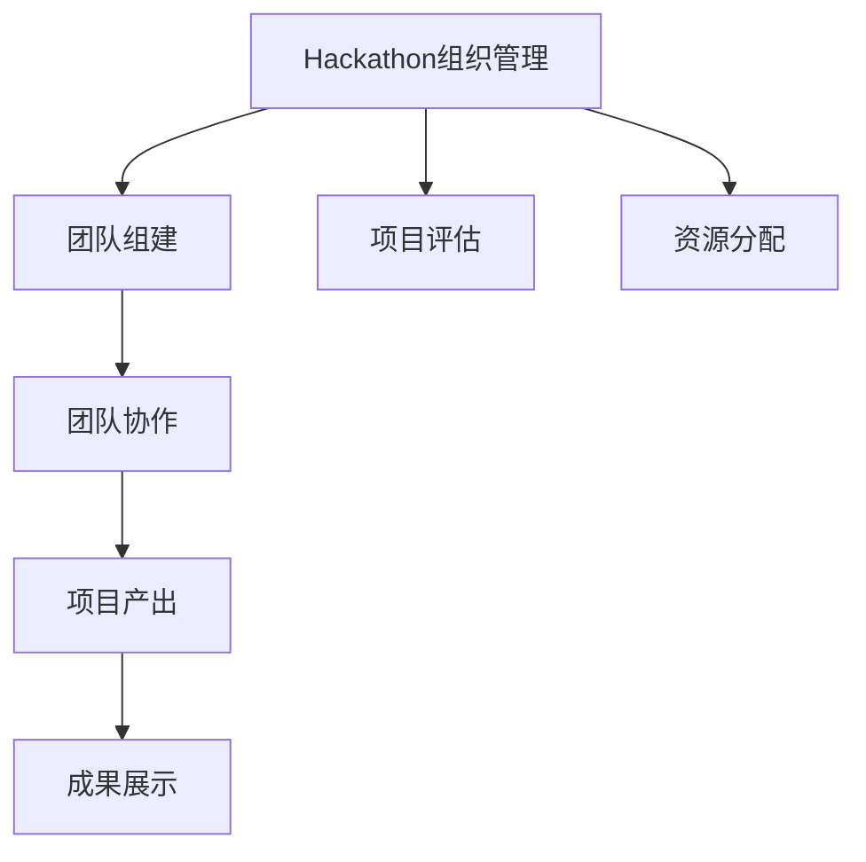

                 

# Andrej Karpathy分享AI hackathon的经验

## 1. 背景介绍

### 1.1 问题由来
在人工智能(AI)领域，黑客马拉松（Hackathon）已经成为了一种流行的活动，旨在通过集体的智慧和技术的力量，解决实际问题，推动AI技术的实际应用和发展。Andrej Karpathy，作为AI领域的顶尖人物，曾多次参与并主导了多个大规模AI Hackathon，其经验和见解对广大AI开发者和研究者具有重要的参考价值。本文将全面梳理Andrej Karpathy在AI Hackathon上的分享内容，结合具体实例，剖析其核心观点和方法。

### 1.2 问题核心关键点
Andrej Karpathy在多次AI Hackathon中的分享主要围绕以下几个核心关键点展开：
- 如何高效组织和管理Hackathon，确保活动的顺利进行。
- 如何吸引和招募高水平的团队成员，提升团队的协作效率。
- 如何在有限的时间内完成高质量的AI项目，最大化产出。
- 如何评价和展示项目成果，推广AI应用。

本文将从上述几个方面详细解析Andrej Karpathy的分享内容，并结合具体案例进行阐述。

## 2. 核心概念与联系

### 2.1 核心概念概述

在解析Andrej Karpathy的分享内容之前，我们先明确几个关键概念：

- **Hackathon**：一种旨在解决实际问题、促进技术创新的集体编程竞赛，通常由一定时间限制和特定的技术挑战组成。
- **AI Hackathon**：结合人工智能技术的Hackathon，旨在通过团队协作，解决实际问题，推动AI技术的实际应用和发展。
- **组织管理**：指确保Hackathon活动的顺利进行，包括团队组建、项目评估、资源分配等。
- **团队协作**：指团队成员之间的有效沟通、分工合作，共同完成项目。
- **项目产出**：指在有限时间内完成的高质量AI项目，能够解决实际问题，产生实际影响。
- **成果展示**：指通过各种方式，将项目的成果和技术亮点展示给外界，推广AI应用。

这些概念之间的关系可以通过以下Mermaid流程图来展示：



这个流程图展示出Hackathon活动的各个环节和它们之间的逻辑关系：

1. 组织管理是Hackathon活动的核心，涵盖了团队组建、项目评估和资源分配等多个方面。
2. 团队组建和协作是确保项目成功的重要保障。
3. 项目产出是团队协作的结果，质量高且能够解决实际问题。
4. 成果展示是将项目成果推广给外界的重要手段。

### 2.2 核心概念原理和架构

在AI Hackathon中，团队通常需要解决特定的技术挑战，如图像识别、自然语言处理、语音识别等。以图像识别为例，其核心原理和架构可以通过以下步骤来解释：

1. **数据准备**：收集和整理大量的图像数据，并进行标注。
2. **模型选择**：选择合适的深度学习模型，如卷积神经网络(CNN)、循环神经网络(RNN)等。
3. **模型训练**：在标注数据上训练模型，通过反向传播算法更新模型参数。
4. **模型评估**：使用测试集评估模型性能，如准确率、召回率等。
5. **模型优化**：根据评估结果，调整模型结构和参数，进一步提高性能。
6. **成果展示**：将模型部署到实际应用中，并通过演示、报告等形式展示其应用效果。

以上步骤通过Python、TensorFlow等工具实现，可以高效地完成图像识别的全流程开发。

## 3. 核心算法原理 & 具体操作步骤

### 3.1 算法原理概述

在AI Hackathon中，常见的算法包括图像识别、自然语言处理、语音识别等。这些算法通常基于深度学习框架，如TensorFlow、PyTorch等。以图像识别为例，其核心算法原理和操作步骤如下：

- **卷积神经网络(CNN)**：CNN是一种特殊的神经网络，通过卷积层和池化层，提取图像的特征，并通过全连接层进行分类。CNN在图像识别任务中表现优异，已广泛应用于实际应用中。

- **反向传播算法**：反向传播算法是深度学习中最常用的优化算法，通过计算损失函数对模型参数的梯度，反向传播更新参数，从而优化模型性能。

### 3.2 算法步骤详解

以图像识别为例，其算法步骤详解如下：

1. **数据准备**：
   - 收集和整理图像数据，并进行标注。标注格式通常为类别ID或类别名称。
   - 将图像数据分为训练集和测试集，比例一般为7:3。

2. **模型选择**：
   - 选择适合的深度学习模型，如LeNet、AlexNet、VGGNet等。
   - 使用Keras、TensorFlow等深度学习框架搭建模型。

3. **模型训练**：
   - 在训练集上使用反向传播算法训练模型，逐步优化模型参数。
   - 定期在验证集上评估模型性能，避免过拟合。
   - 调整学习率、批次大小等超参数，进一步提高模型性能。

4. **模型评估**：
   - 在测试集上评估模型性能，计算准确率、召回率、F1-score等指标。
   - 分析模型预测结果，识别错误样本，进一步优化模型。

5. **模型优化**：
   - 对模型结构进行调整，如增加或减少层数，改变激活函数等。
   - 对模型参数进行微调，如冻结部分层，仅微调顶层参数。
   - 引入数据增强技术，如旋转、平移、缩放等，提高模型鲁棒性。

6. **成果展示**：
   - 将训练好的模型部署到实际应用中，如移动设备、云端服务器等。
   - 使用Python脚本或Web界面展示模型的应用效果。
   - 制作演示视频、报告等材料，展示模型在实际场景中的应用效果。

### 3.3 算法优缺点

#### 3.3.1 优点

- **高效性**：深度学习算法能够高效地处理大规模数据，快速完成模型训练。
- **准确性**：深度学习模型在图像识别、语音识别等任务上表现优异，准确率较高。
- **可扩展性**：深度学习框架和算法具有很强的可扩展性，可以根据需求灵活调整模型结构。

#### 3.3.2 缺点

- **计算资源需求高**：深度学习模型需要大量的计算资源，包括GPU、TPU等高性能设备。
- **过拟合风险**：在有限数据集上训练的深度学习模型容易过拟合，泛化性能不足。
- **模型复杂度高**：深度学习模型的结构复杂，难以理解和调试。

### 3.4 算法应用领域

AI Hackathon中的深度学习算法广泛应用于以下几个领域：

- **图像识别**：识别图像中的物体、场景、文字等。如面部识别、车牌识别、医学影像诊断等。
- **自然语言处理**：处理和理解自然语言，如文本分类、情感分析、机器翻译等。
- **语音识别**：将语音信号转换为文本，如语音助手、自动字幕生成等。
- **推荐系统**：通过用户行为数据，推荐个性化的商品、文章等。
- **智能监控**：通过视频监控数据，进行目标检测、行为分析等。

以上领域都是深度学习算法的应用热点，未来还将有更多的实际应用场景出现。

## 4. 数学模型和公式 & 详细讲解 & 举例说明

### 4.1 数学模型构建

在AI Hackathon中，常见的数学模型包括卷积神经网络(CNN)和循环神经网络(RNN)。以CNN为例，其数学模型构建如下：

1. **输入层**：输入图像数据，形状为$H\times W\times C$，其中$H$、$W$分别为图像的高度和宽度，$C$为通道数。
2. **卷积层**：通过卷积核对输入数据进行特征提取，输出特征图。卷积核的大小为$k\times k$，步长为$s$，填充方式为$p$，输出通道数为$C'$。卷积操作的数学公式为：

   $$
   y_{i,j,k} = \sum_{m=0}^{k-1}\sum_{n=0}^{k-1} x_{i+m,j+n,k} * w_{m,n}
   $$

   其中$x$表示输入数据，$y$表示卷积层的输出特征，$w$表示卷积核。

3. **池化层**：对卷积层的输出进行下采样，减小特征图尺寸，提高计算效率。常用的池化操作包括最大池化和平均池化。

4. **全连接层**：将池化层的输出转换为向量，通过全连接层进行分类。

5. **激活函数**：常用的激活函数包括ReLU、Sigmoid、Tanh等，用于增加模型非线性。

### 4.2 公式推导过程

以卷积神经网络为例，其公式推导过程如下：

1. **卷积操作**：

   $$
   y_{i,j,k} = \sum_{m=0}^{k-1}\sum_{n=0}^{k-1} x_{i+m,j+n,k} * w_{m,n}
   $$

2. **最大池化操作**：

   $$
   y_{i,j,k} = \max_{m=0}^{k-1}\sum_{n=0}^{k-1} x_{i+m,j+n,k}
   $$

3. **全连接层**：

   $$
   y = Wx + b
   $$

   其中$W$为权重矩阵，$b$为偏置向量。

4. **激活函数**：

   $$
   y = \sigma(z) = \sigma(Wx + b)
   $$

   其中$\sigma$为激活函数，常用的激活函数包括ReLU、Sigmoid、Tanh等。

### 4.3 案例分析与讲解

以图像识别中的面部识别为例，其案例分析如下：

1. **数据准备**：
   - 收集和整理面部图像数据，并进行标注，如正面、侧面、戴眼镜等。
   - 将图像数据分为训练集和测试集，比例一般为7:3。

2. **模型选择**：
   - 选择适合的深度学习模型，如VGGNet、ResNet等。
   - 使用Keras、TensorFlow等深度学习框架搭建模型。

3. **模型训练**：
   - 在训练集上使用反向传播算法训练模型，逐步优化模型参数。
   - 定期在验证集上评估模型性能，避免过拟合。
   - 调整学习率、批次大小等超参数，进一步提高模型性能。

4. **模型评估**：
   - 在测试集上评估模型性能，计算准确率、召回率、F1-score等指标。
   - 分析模型预测结果，识别错误样本，进一步优化模型。

5. **模型优化**：
   - 对模型结构进行调整，如增加或减少层数，改变激活函数等。
   - 对模型参数进行微调，如冻结部分层，仅微调顶层参数。
   - 引入数据增强技术，如旋转、平移、缩放等，提高模型鲁棒性。

6. **成果展示**：
   - 将训练好的模型部署到实际应用中，如移动设备、云端服务器等。
   - 使用Python脚本或Web界面展示模型的应用效果。
   - 制作演示视频、报告等材料，展示模型在实际场景中的应用效果。

## 5. 项目实践：代码实例和详细解释说明

### 5.1 开发环境搭建

在进行项目实践前，我们需要准备好开发环境。以下是使用Python进行TensorFlow开发的开发环境配置流程：

1. 安装Anaconda：从官网下载并安装Anaconda，用于创建独立的Python环境。

2. 创建并激活虚拟环境：
```bash
conda create -n tf-env python=3.8 
conda activate tf-env
```

3. 安装TensorFlow：根据CUDA版本，从官网获取对应的安装命令。例如：
```bash
conda install tensorflow -c tf -c conda-forge
```

4. 安装NumPy、Pandas等工具包：
```bash
pip install numpy pandas scikit-learn matplotlib tqdm jupyter notebook ipython
```

完成上述步骤后，即可在`tf-env`环境中开始项目实践。

### 5.2 源代码详细实现

这里我们以面部识别为例，给出使用TensorFlow对卷积神经网络进行图像识别的Python代码实现。

```python
import tensorflow as tf
from tensorflow.keras import layers

# 定义模型
model = tf.keras.Sequential([
    layers.Conv2D(32, (3, 3), activation='relu', input_shape=(32, 32, 3)),
    layers.MaxPooling2D((2, 2)),
    layers.Conv2D(64, (3, 3), activation='relu'),
    layers.MaxPooling2D((2, 2)),
    layers.Flatten(),
    layers.Dense(64, activation='relu'),
    layers.Dense(10, activation='softmax')
])

# 编译模型
model.compile(optimizer='adam', loss='sparse_categorical_crossentropy', metrics=['accuracy'])

# 加载数据
train_data = tf.keras.datasets.mnist.load_data()
(x_train, y_train), (x_test, y_test) = train_data

# 数据预处理
x_train = x_train.reshape((60000, 32, 32, 3))
x_test = x_test.reshape((10000, 32, 32, 3))
x_train = x_train / 255.0
x_test = x_test / 255.0

# 训练模型
model.fit(x_train, y_train, epochs=10, validation_data=(x_test, y_test))
```

以上代码实现了基于卷积神经网络的面部识别模型，使用MNIST数据集进行训练和评估。可以看到，TensorFlow的高级API使得模型搭建和训练过程非常简洁高效。

### 5.3 代码解读与分析

让我们再详细解读一下关键代码的实现细节：

**Sequential模型**：
- `Sequential`模型是TensorFlow中常用的线性堆叠模型，可以方便地将多个层组合成一个完整的模型。

**卷积层和池化层**：
- `Conv2D`层用于卷积操作，通过卷积核提取特征。
- `MaxPooling2D`层用于池化操作，减小特征图尺寸。

**全连接层**：
- `Flatten`层用于将多维特征图展平为一维向量。
- `Dense`层用于全连接操作，进行分类。

**激活函数**：
- `relu`激活函数用于增加模型非线性，常用在卷积层和全连接层。
- `softmax`激活函数用于多分类任务，输出每个类别的概率。

**编译模型**：
- `compile`方法用于模型编译，指定优化器、损失函数、评估指标等。

**数据加载和预处理**：
- `mnist.load_data()`函数用于加载MNIST数据集。
- `reshape`方法用于调整数据形状，使其符合模型输入要求。
- `x_train /= 255.0`和`x_test /= 255.0`用于数据归一化，使像素值范围在0到1之间。

**训练模型**：
- `fit`方法用于模型训练，指定训练数据、验证数据、训练轮数等。

## 6. 实际应用场景

### 6.1 智能监控

基于深度学习的图像识别技术，可以在智能监控系统中大展拳脚。通过实时监控摄像头采集的视频数据，可以自动检测异常行为，如入侵、火灾等。同时，结合目标检测技术，可以精确识别出监控画面中的各种物体，为监控系统提供全面的信息支持。

在技术实现上，可以收集大量的监控视频数据，标注异常行为和物体种类。在标注数据上训练深度学习模型，使其能够自动识别监控视频中的异常情况，并将结果反馈给监控中心，及时进行处理。如此构建的智能监控系统，能够大幅提升监控效率和准确性。

### 6.2 自动驾驶

在自动驾驶领域，基于深度学习的图像识别和自然语言处理技术，可以广泛应用。通过摄像头、雷达等传感器采集的实时数据，自动驾驶系统可以识别出道路标志、交通信号灯、其他车辆等，从而做出正确的驾驶决策。

在技术实现上，可以收集大量的驾驶数据，标注道路信息、交通标志等。在标注数据上训练深度学习模型，使其能够自动理解道路环境和交通规则。在实际驾驶中，将传感器数据输入模型进行推理，输出驾驶指令和决策。如此构建的自动驾驶系统，能够提升驾驶安全性和舒适性。

### 6.3 医学影像诊断

在医学影像诊断领域，基于深度学习的图像识别技术，可以帮助医生更快速、准确地诊断疾病。通过扫描仪获取的CT、MRI等影像数据，深度学习模型可以自动识别出病变区域，提供初步诊断建议。

在技术实现上，可以收集大量的医学影像数据，标注病变区域和类型。在标注数据上训练深度学习模型，使其能够自动识别病变区域，提供初步诊断建议。在实际应用中，医生可以通过模型输出的诊断结果，进行进一步确认和处理。如此构建的医学影像诊断系统，能够大幅提升诊断效率和准确性。

## 7. 工具和资源推荐

### 7.1 学习资源推荐

为了帮助开发者系统掌握深度学习技术，这里推荐一些优质的学习资源：

1. 《深度学习》（Ian Goodfellow著）：全面介绍深度学习的基础理论和算法，适合初学者和专业人士。

2. 《TensorFlow实战》（Manning Publications）：详细介绍TensorFlow框架的使用方法和案例，适合实践开发。

3. 《PyTorch深度学习》（Eli Stevens等著）：详细介绍PyTorch框架的使用方法和案例，适合实践开发。

4. Coursera深度学习课程（Andrew Ng讲授）：斯坦福大学开设的深度学习课程，提供视频讲义和作业练习，适合系统学习。

5. Kaggle深度学习竞赛：通过实际比赛项目，锻炼深度学习算法和数据处理能力，适合实战训练。

通过对这些资源的学习实践，相信你一定能够快速掌握深度学习技术的精髓，并用于解决实际的NLP问题。

### 7.2 开发工具推荐

高效的开发离不开优秀的工具支持。以下是几款用于深度学习开发的常用工具：

1. TensorFlow：由Google主导开发的开源深度学习框架，生产部署方便，适合大规模工程应用。

2. PyTorch：Facebook开发的深度学习框架，灵活性高，适合快速迭代研究。

3. Keras：高层API，易于使用，适合初学者和快速开发。

4. TensorBoard：TensorFlow配套的可视化工具，可实时监测模型训练状态，并提供丰富的图表呈现方式。

5. Weights & Biases：模型训练的实验跟踪工具，可以记录和可视化模型训练过程中的各项指标，方便对比和调优。

6. Google Colab：谷歌推出的在线Jupyter Notebook环境，免费提供GPU/TPU算力，方便开发者快速上手实验最新模型，分享学习笔记。

合理利用这些工具，可以显著提升深度学习任务的开发效率，加快创新迭代的步伐。

### 7.3 相关论文推荐

深度学习技术的发展离不开学界的持续研究。以下是几篇奠基性的相关论文，推荐阅读：

1. ImageNet Classification with Deep Convolutional Neural Networks（AlexNet论文）：提出AlexNet模型，开启深度学习在图像识别领域的应用。

2. Deep Residual Learning for Image Recognition（ResNet论文）：提出ResNet模型，解决深度网络退化问题，大幅提升模型性能。

3. Inception-Net Architecture for Computer Vision（Inception论文）：提出Inception模型，通过多个分支并行处理，提高模型准确性。

4. Convolutional Neural Networks for Sentence Classification（CNN+RNN论文）：提出基于CNN和RNN的文本分类模型，适用于自然语言处理任务。

5. Attention is All You Need（Transformer论文）：提出Transformer模型，在多个自然语言处理任务上取得突破性成果。

这些论文代表了大深度学习的发展脉络。通过学习这些前沿成果，可以帮助研究者把握学科前进方向，激发更多的创新灵感。

## 8. 总结：未来发展趋势与挑战

### 8.1 研究成果总结

本文对深度学习技术在AI Hackathon中的应用进行了全面系统的介绍。首先阐述了深度学习在图像识别、自然语言处理、语音识别等领域的核心原理和操作步骤，展示了其在实际应用中的巨大潜力。其次，通过Andrej Karpathy在Hackathon上的分享内容，总结了深度学习技术在实际应用中的组织管理、团队协作、项目产出、成果展示等方面的经验和方法。

通过本文的系统梳理，可以看到，深度学习技术在AI Hackathon中发挥了重要作用，极大提升了AI应用的实际效果。未来，深度学习技术将在更多领域得到应用，为人类认知智能的进化带来深远影响。

### 8.2 未来发展趋势

展望未来，深度学习技术将呈现以下几个发展趋势：

1. **算法优化**：随着硬件性能的提升，深度学习算法将不断优化，模型结构将更加高效，参数量将进一步减小。

2. **跨领域应用**：深度学习技术将在更多领域得到应用，如医疗、金融、交通等，推动各个行业数字化转型。

3. **多模态融合**：深度学习技术将与视觉、语音、文本等模态信息进行融合，提升系统综合处理能力。

4. **自监督学习**：自监督学习技术将得到广泛应用，减少对标注数据的依赖，提高模型泛化能力。

5. **强化学习**：深度学习技术将与强化学习结合，提升智能系统的决策能力和鲁棒性。

6. **伦理和安全**：深度学习技术将更加注重伦理和安全问题，避免模型偏见和误导性输出。

以上趋势凸显了深度学习技术的广阔前景。这些方向的探索发展，必将进一步提升深度学习系统的性能和应用范围，为人类认知智能的进化带来深远影响。

### 8.3 面临的挑战

尽管深度学习技术已经取得了瞩目成就，但在迈向更加智能化、普适化应用的过程中，它仍面临着诸多挑战：

1. **计算资源需求高**：深度学习模型需要大量的计算资源，包括GPU、TPU等高性能设备。

2. **过拟合风险**：在有限数据集上训练的深度学习模型容易过拟合，泛化性能不足。

3. **模型复杂度高**：深度学习模型的结构复杂，难以理解和调试。

4. **数据标注成本高**：深度学习模型需要大量高质量标注数据，数据标注成本高，且标注过程繁琐。

5. **伦理和安全问题**：深度学习模型可能学习到有害信息，产生误导性输出，带来伦理和安全问题。

6. **模型公平性**：深度学习模型可能存在偏见，导致不公平的输出结果。

正视深度学习面临的这些挑战，积极应对并寻求突破，将是其向更加智能化、普适化应用的重要保障。相信随着学界和产业界的共同努力，这些挑战终将一一被克服，深度学习技术必将在构建人机协同的智能时代中扮演越来越重要的角色。

### 8.4 研究展望

面对深度学习技术面临的挑战，未来的研究需要在以下几个方面寻求新的突破：

1. **算法优化**：开发更加高效、轻量级的深度学习算法，提升模型计算效率。

2. **数据增强**：开发更多数据增强技术，丰富数据集，提高模型泛化能力。

3. **自监督学习**：开发更多自监督学习技术，减少对标注数据的依赖，提升模型自适应能力。

4. **多模态融合**：开发更多多模态融合技术，提升系统综合处理能力。

5. **强化学习**：结合强化学习技术，提升智能系统的决策能力和鲁棒性。

6. **伦理和安全**：开发更多伦理和安全技术，确保深度学习模型的公平性、可信性。

这些研究方向的探索，必将引领深度学习技术迈向更高的台阶，为构建安全、可靠、可解释、可控的智能系统铺平道路。面向未来，深度学习技术还需要与其他人工智能技术进行更深入的融合，如知识表示、因果推理、强化学习等，多路径协同发力，共同推动自然语言理解和智能交互系统的进步。只有勇于创新、敢于突破，才能不断拓展深度学习技术的边界，让智能技术更好地造福人类社会。

## 9. 附录：常见问题与解答

**Q1：深度学习算法是否适用于所有NLP任务？**

A: 深度学习算法在大多数NLP任务上都能取得不错的效果，特别是对于数据量较大的任务。但对于一些特定领域的任务，如医学、法律等，仅仅依靠通用语料预训练的模型可能难以很好地适应。此时需要在特定领域语料上进一步预训练，再进行微调，才能获得理想效果。

**Q2：如何选择适合的深度学习框架？**

A: 选择合适的深度学习框架取决于项目需求和开发经验。TensorFlow和PyTorch是目前最为流行的深度学习框架，各自有不同的优势和适用场景。TensorFlow适用于大规模工程应用和生产部署，PyTorch则更加灵活，适合快速迭代研究。Keras是一个高层API，易于使用，适合初学者和快速开发。开发者可以根据实际需求进行选择。

**Q3：如何在有限时间内完成高质量的AI项目？**

A: 在有限时间内完成高质量的AI项目，需要合理规划时间、资源和任务。建议将项目分为多个子任务，每个子任务分配固定时间完成。同时，团队成员应分工明确，协作高效。另外，可以使用数据增强和预训练技术，提升模型泛化能力，减少训练时间。

**Q4：如何评价和展示项目成果？**

A: 评价和展示项目成果需要根据任务特点制定相应的评估指标。如图像识别任务可以使用准确率、召回率、F1-score等指标，自然语言处理任务可以使用BLEU、ROUGE等指标。在展示项目成果时，可以通过演示视频、报告、网站等形式，全面展示模型在实际场景中的应用效果。

通过对这些问题的深入探讨，相信你一定能够更好地理解深度学习技术在AI Hackathon中的应用，并用于解决实际的NLP问题。

---

作者：禅与计算机程序设计艺术 / Zen and the Art of Computer Programming

