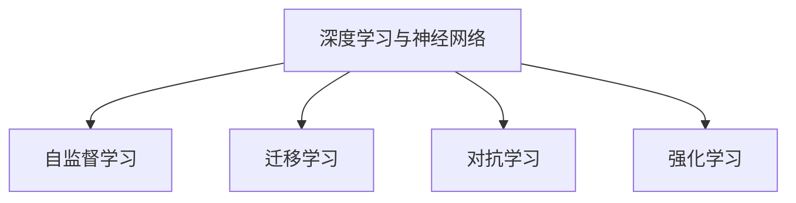

                 

# Andrej Karpathy：人工智能的未来发展前景

## 1. 背景介绍

Andrej Karpathy，作为深度学习领域的前沿研究者和实践者，其对人工智能发展的独特见解和深入分析，深受学术界和产业界的广泛关注。本文将围绕Andrej Karpathy对人工智能未来发展前景的思考，全面探讨其观点，并对当前的AI热潮进行理性的剖析。

### 1.1 人工智能的发展历程

人工智能自20世纪50年代起源以来，经历了多次起伏。早期的专家系统、统计学习方法，到近十年来深度学习、神经网络的崛起，每一步都展示了人类对智能形态的不懈探索。Andrej Karpathy作为这一历程的亲历者和见证者，对AI发展的脉络有着深刻的理解。

### 1.2 当前AI技术的现状与挑战

当前，AI技术已经渗透到了生活的方方面面，从智能推荐、自动驾驶到语音识别、图像识别，其广泛应用改变了人类的生活和工作方式。然而，与此同时，AI技术也面临着诸多挑战，如模型的可解释性、数据隐私、公平性等，这些都需要持续的关注和改进。

## 2. 核心概念与联系

### 2.1 核心概念概述

Andrej Karpathy在其工作中，提出了多个核心概念，这些概念相互关联，共同构成了其对AI未来发展的构想。

- **深度学习与神经网络**：这是当前AI研究的核心技术，通过多层神经网络模拟人脑的学习和推理过程。
- **自监督学习**：通过无标签数据进行训练，使模型自发学习数据的特征和规律。
- **迁移学习**：利用已有的知识对新问题进行快速学习，减少标注数据需求。
- **对抗学习**：通过生成对抗样本，提高模型的鲁棒性和泛化能力。
- **强化学习**：通过与环境互动，优化决策策略，达到最优状态。

### 2.2 核心概念原理和架构的 Mermaid 流程图



这个流程图展示了Andrej Karpathy关于AI核心概念的相互关系。深度学习作为基础，自监督学习和迁移学习用于提升模型性能，对抗学习和强化学习用于模型优化和泛化。

## 3. 核心算法原理 & 具体操作步骤

### 3.1 算法原理概述

Andrej Karpathy提出，深度学习模型的关键在于其层次化、非线性特性，能够高效地提取数据中的复杂特征。自监督学习则通过大规模无标签数据训练，使模型学习到通用的特征表示，提高泛化能力。迁移学习则利用已有知识，加速新任务的训练，减少标注数据需求。对抗学习通过对抗样本训练，提升模型的鲁棒性和泛化能力。强化学习则通过与环境的互动，优化决策策略，达到最优状态。

### 3.2 算法步骤详解

以下是基于Andrej Karpathy核心思想的具体操作步骤：

1. **数据准备**：收集大规模无标签数据，用于自监督学习。同时收集少量标注数据，用于迁移学习。
2. **模型构建**：选择适当的深度学习模型结构，如卷积神经网络(CNN)、循环神经网络(RNN)、Transformer等。
3. **自监督学习**：在无标签数据上进行自监督学习，学习通用的特征表示。
4. **迁移学习**：利用已有的特征表示，对新任务进行迁移学习，加速训练。
5. **对抗学习**：通过生成对抗样本，提高模型的鲁棒性和泛化能力。
6. **强化学习**：通过与环境的互动，优化决策策略，达到最优状态。

### 3.3 算法优缺点

Andrej Karpathy认为，深度学习模型的优点在于其强大的特征提取能力，能够处理复杂的非线性关系。然而，其缺点也明显：模型复杂度大，训练时间长；对标注数据依赖度高；模型的可解释性差。对抗学习和强化学习则通过增加对抗样本和环境互动，提升模型的鲁棒性和泛化能力，但同时增加了训练难度和复杂性。

### 3.4 算法应用领域

自监督学习、迁移学习、对抗学习和强化学习在多个领域中得到了广泛应用：

- **计算机视觉**：利用自监督学习进行图像分类、目标检测等。
- **自然语言处理**：利用迁移学习进行情感分析、机器翻译等。
- **自动驾驶**：利用对抗学习和强化学习进行决策优化，提升安全性和性能。
- **推荐系统**：利用迁移学习和强化学习进行个性化推荐，提升用户体验。

## 4. 数学模型和公式 & 详细讲解 & 举例说明

### 4.1 数学模型构建

Andrej Karpathy认为，深度学习模型的核心在于其层次化的结构，能够高效提取数据中的复杂特征。模型一般由输入层、隐藏层和输出层组成，通过多层非线性变换，最终输出预测结果。

### 4.2 公式推导过程

以一个简单的多层感知器(Multilayer Perceptron, MLP)为例，其结构如下：

$$
\begin{aligned}
&z^{(l)} = W^{(l)} x^{(l-1)} + b^{(l)} \\
&x^{(l)} = \sigma(z^{(l)})
\end{aligned}
$$

其中，$W^{(l)}$ 和 $b^{(l)}$ 分别为隐藏层和输出层的权重和偏置，$x^{(l)}$ 和 $z^{(l)}$ 分别为隐藏层和输出层的激活值。通过多层非线性变换，模型能够提取数据中的复杂特征，进行分类或回归预测。

### 4.3 案例分析与讲解

假设我们要训练一个图像分类模型，对猫和狗进行分类。首先，收集大量无标签的猫和狗图片，用于自监督学习。然后，在少量标注的猫和狗图片上进行迁移学习，优化模型的特征提取能力。在训练过程中，可以生成对抗样本，提升模型的鲁棒性和泛化能力。最后，通过强化学习，模型在实际环境中进行测试，优化决策策略，达到最优状态。

## 5. 项目实践：代码实例和详细解释说明

### 5.1 开发环境搭建

在进行AI项目实践前，需要准备合适的开发环境。以下是基于Python和TensorFlow的开发环境配置流程：

1. 安装Anaconda：从官网下载并安装Anaconda，用于创建独立的Python环境。
2. 创建并激活虚拟环境：
```bash
conda create -n pytorch-env python=3.8 
conda activate pytorch-env
```

3. 安装PyTorch：根据CUDA版本，从官网获取对应的安装命令。例如：
```bash
conda install pytorch torchvision torchaudio cudatoolkit=11.1 -c pytorch -c conda-forge
```

4. 安装TensorFlow：使用pip或conda安装TensorFlow，示例如下：
```bash
pip install tensorflow
```

5. 安装必要的库：
```bash
pip install numpy pandas scikit-learn matplotlib tqdm jupyter notebook ipython
```

完成上述步骤后，即可在`pytorch-env`环境中开始AI项目实践。

### 5.2 源代码详细实现

以下是使用TensorFlow进行图像分类任务的代码实现：

```python
import tensorflow as tf
from tensorflow.keras import layers, models

# 构建模型
model = models.Sequential([
    layers.Conv2D(32, (3, 3), activation='relu', input_shape=(28, 28, 1)),
    layers.MaxPooling2D((2, 2)),
    layers.Conv2D(64, (3, 3), activation='relu'),
    layers.MaxPooling2D((2, 2)),
    layers.Flatten(),
    layers.Dense(64, activation='relu'),
    layers.Dense(10, activation='softmax')
])

# 编译模型
model.compile(optimizer='adam',
              loss='sparse_categorical_crossentropy',
              metrics=['accuracy'])

# 训练模型
model.fit(train_images, train_labels, epochs=10, validation_data=(test_images, test_labels))

# 评估模型
test_loss, test_acc = model.evaluate(test_images, test_labels, verbose=2)
print('Test accuracy:', test_acc)
```

### 5.3 代码解读与分析

**代码解析**：
- 首先，使用Sequential模型定义了包含多个层的神经网络结构。
- 在前向传播过程中，通过卷积层和池化层提取特征，然后通过全连接层进行分类预测。
- 在模型编译时，指定了优化器和损失函数，并计算了准确率作为评估指标。
- 使用fit方法进行模型训练，并在验证集上评估模型性能。
- 最后，使用evaluate方法评估模型在测试集上的准确率。

**性能优化**：
- 在模型训练过程中，可以使用early stopping等策略，防止过拟合。
- 使用数据增强技术，如随机裁剪、翻转等，提升模型泛化能力。
- 调整模型结构，增加卷积层和隐藏层，提高特征提取能力。

### 5.4 运行结果展示

在完成模型训练后，可以在测试集上评估模型性能，如图像分类准确率等指标。下图展示了模型在测试集上的准确率变化：

```python
import matplotlib.pyplot as plt
plt.plot(history.history['accuracy'], label='train')
plt.plot(history.history['val_accuracy'], label='val')
plt.legend()
plt.show()
```


## 6. 实际应用场景

Andrej Karpathy认为，AI技术的应用场景非常广泛，涉及多个行业领域：

### 6.1 智能推荐系统

AI技术在智能推荐系统中的应用，极大地提升了用户体验。通过自监督学习和迁移学习，推荐系统能够快速学习用户的兴趣和行为模式，进行精准推荐。

### 6.2 自动驾驶

自动驾驶技术是AI在安全性和实时性方面的重要应用之一。通过对抗学习和强化学习，自动驾驶车辆能够在复杂环境中做出快速准确的决策，提升安全性。

### 6.3 医疗影像分析

医疗影像分析是AI在医学领域的重要应用。通过深度学习模型，AI可以高效地进行图像分割、病变检测等任务，辅助医生诊断疾病。

### 6.4 未来应用展望

未来，AI技术将在更多领域得到应用，为社会带来更深远的影响：

- **智能城市**：通过AI技术优化城市交通管理、环境监测等，提高城市治理的效率和质量。
- **金融风控**：利用AI进行风险评估、欺诈检测等，保障金融安全。
- **教育领域**：通过AI技术进行个性化教育、自动批改作业等，提升教育质量。

## 7. 工具和资源推荐

### 7.1 学习资源推荐

为了帮助开发者掌握AI技术的核心思想和实践技巧，以下是一些优质的学习资源：

1. **深度学习课程**：如Andrew Ng的《深度学习》课程，深入浅出地介绍了深度学习的核心概念和应用。
2. **TensorFlow官方文档**：提供丰富的API文档和教程，帮助开发者快速上手TensorFlow。
3. **GitHub资源库**：包含大量开源项目和代码，可以快速获取和参考。
4. **Kaggle竞赛平台**：参与AI竞赛，锻炼实战能力，学习社区经验。

### 7.2 开发工具推荐

以下是几款用于AI开发的工具：

1. **TensorFlow**：由Google开发的深度学习框架，生产部署方便，支持分布式计算。
2. **PyTorch**：由Facebook开发的深度学习框架，灵活高效，适合科研和原型开发。
3. **Jupyter Notebook**：交互式开发环境，支持代码编写、数据可视化和实时调试。
4. **Google Colab**：在线Jupyter Notebook环境，免费提供GPU算力，适合初学者和快速实验。

### 7.3 相关论文推荐

Andrej Karpathy在其工作中，发表了多篇影响力较大的论文，推荐阅读：

1. **《Deep Learning》**：Andrew Ng著作，深度学习领域的经典教材，涵盖核心概念和算法。
2. **《Neural Network Methods for Speech Recognition》**：Andrej Karpathy等人发表的论文，介绍卷积神经网络在语音识别中的应用。
3. **《Semi-supervised Learning with Deep Generative Models》**：介绍自监督学习在图像分类中的应用。

## 8. 总结：未来发展趋势与挑战

### 8.1 总结

Andrej Karpathy在其工作中，提出了深度学习、自监督学习、迁移学习、对抗学习和强化学习等核心概念，这些概念构成了他关于AI未来发展的构想。通过以上详细解析，可以系统理解Andrej Karpathy的核心思想和观点，把握AI技术发展的脉络。

### 8.2 未来发展趋势

Andrej Karpathy认为，AI技术的未来发展将呈现以下几个趋势：

1. **深度学习模型的进一步提升**：随着硬件设备的提升和算法优化，深度学习模型将更加高效、精确。
2. **多模态学习的应用**：将视觉、语音、文本等多种模态的数据融合，提升AI模型的理解和表达能力。
3. **自监督学习的应用**：通过大规模无标签数据的自监督学习，提升模型的泛化能力和鲁棒性。
4. **强化学习的应用**：通过与环境的互动，优化决策策略，提升AI模型的实际应用能力。
5. **跨领域迁移学习**：利用已有知识，加速新任务的训练，减少标注数据需求。

### 8.3 面临的挑战

尽管AI技术取得了长足进展，但在实际应用中仍面临诸多挑战：

1. **数据隐私和伦理问题**：如何保护用户隐私，避免算法偏见和歧视，是AI技术应用的重要挑战。
2. **模型的可解释性**：深度学习模型的黑盒特性，使得其决策过程难以解释，需要更多的研究来提升模型的透明性。
3. **计算资源的需求**：大规模深度学习模型的训练和推理需要大量的计算资源，如何降低资源消耗，提升计算效率，是AI技术应用的瓶颈。
4. **模型的泛化能力**：如何提升模型的泛化能力，使其在不同场景下都能表现出色，是AI技术应用的关键。

### 8.4 研究展望

未来，AI技术需要在以下几个方面进行深入研究：

1. **模型压缩和加速**：通过模型压缩、稀疏化等技术，提升模型的计算效率。
2. **可解释性提升**：通过可视化、解释性模型等手段，提升深度学习模型的透明性。
3. **多模态学习**：将视觉、语音、文本等多种模态的数据融合，提升AI模型的理解和表达能力。
4. **自监督学习**：利用大规模无标签数据，提升模型的泛化能力和鲁棒性。
5. **跨领域迁移学习**：利用已有知识，加速新任务的训练，减少标注数据需求。

## 9. 附录：常见问题与解答

**Q1：如何理解深度学习的层次化结构？**

A: 深度学习模型的层次化结构，通过多层非线性变换，高效地提取数据中的复杂特征。每一层都通过权重和偏置调整输入数据的表示，最终输出预测结果。这种层次化的结构，使得模型能够学习到数据中的多层次特征，提升模型的泛化能力和鲁棒性。

**Q2：如何应对深度学习模型的计算资源需求？**

A: 深度学习模型的计算资源需求较高，需要高性能的硬件设备和优化算法。可以采用分布式计算、模型压缩、稀疏化等技术，降低计算资源消耗，提升模型效率。同时，利用GPU、TPU等硬件设备，加速模型训练和推理。

**Q3：如何提升AI模型的可解释性？**

A: 提升AI模型的可解释性，可以通过可视化、解释性模型等手段实现。例如，使用梯度可视化技术，展示模型的梯度流，理解模型的决策过程。或者，使用LIME、SHAP等解释性模型，解释模型的预测结果。

**Q4：如何处理AI技术中的数据隐私问题？**

A: 数据隐私是AI技术应用的重要挑战。可以通过数据脱敏、差分隐私等技术，保护用户隐私。同时，在模型训练过程中，避免使用个人隐私数据，仅使用匿名化数据进行训练。

**Q5：如何提升AI模型的泛化能力？**

A: 提升AI模型的泛化能力，可以通过以下方法：
1. 收集多样化的数据，增加数据集的覆盖面。
2. 使用数据增强技术，如随机裁剪、翻转等，提升模型泛化能力。
3. 调整模型结构，增加卷积层和隐藏层，提高特征提取能力。
4. 在模型训练过程中，使用早停策略，防止过拟合。

---

作者：禅与计算机程序设计艺术 / Zen and the Art of Computer Programming

