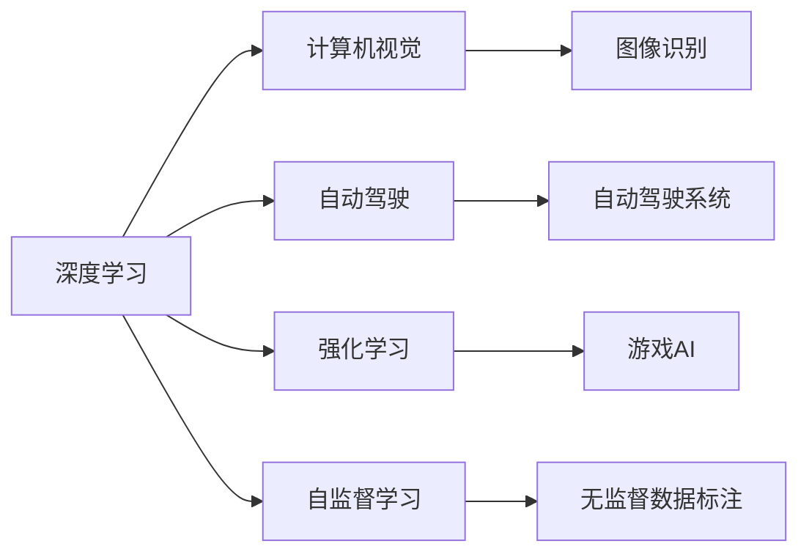

                 

## 1. 背景介绍

### 1.1 问题由来

在人工智能(AI)迅猛发展的背景下，AI的未来发展机遇和挑战成为科技界的热点话题。在这个过程中，AI领域的领导者之一，Andrej Karpathy，以其在深度学习、计算机视觉和自动驾驶等领域的丰富经验，对AI的发展趋势和未来机遇进行了深入的思考和分析。

### 1.2 问题核心关键点

Andrej Karpathy强调，AI的未来机遇主要来自于以下几个关键点：

- **数据量与数据质量的提升**：随着传感器和数据收集技术的进步，数据的规模和质量将显著提升，为AI提供更多的训练样本和更真实的数据。
- **计算能力的增强**：摩尔定律和GPU技术的进步使得AI模型可以处理更复杂的任务，包括更高效的图像处理和语音识别等。
- **跨领域知识的整合**：AI将越来越多地整合不同领域的知识，如图像、语音、自然语言处理(NLP)等，以构建更全面、更强大的智能系统。
- **自主学习和决策**：AI将具备更强的自主学习和决策能力，能够从经验中学习和适应，并独立做出决策，如自动驾驶、机器人控制等。
- **伦理与安全性的考量**：随着AI应用的普及，如何确保其行为的透明度、可解释性和安全性，将是未来的一大挑战。

### 1.3 问题研究意义

Andrej Karpathy的研究对理解和把握AI的未来发展具有重要意义：

1. **技术前沿洞察**：其深入分析AI领域的最新技术进展，为科研人员和工程师提供有价值的参考。
2. **未来趋势预测**：通过前瞻性的视角，揭示AI可能的发展方向，帮助企业和政府机构提前做好准备。
3. **伦理与社会影响**：强调AI发展中面临的伦理问题和安全挑战，促使全社会共同思考和解决这些问题。

## 2. 核心概念与联系

### 2.1 核心概念概述

Andrej Karpathy的研究涉及以下几个核心概念：

- **深度学习**：一种基于神经网络的机器学习方法，能够从大量数据中自动学习特征，进行分类、预测和生成等任务。
- **计算机视觉**：研究如何让计算机理解并解释图像和视频等视觉信息，包括图像识别、目标检测、语义分割等。
- **自动驾驶**：AI在交通运输领域的应用，旨在实现自动驾驶汽车，提高道路安全性和交通效率。
- **强化学习**：通过与环境的交互，AI可以学习最优策略以最大化预期收益，应用于游戏、机器人控制等。
- **自监督学习**：利用未标注的数据进行自我训练，避免对大量标注数据的依赖。

这些概念之间存在密切联系，共同构成了AI技术的多样性和复杂性。以下是一个简化的Mermaid流程图，展示了这些概念之间的联系：



这个流程图展示了深度学习如何应用于计算机视觉、自动驾驶、强化学习和自监督学习等不同领域，并详细描述了其在这些领域中的具体应用。

## 3. 核心算法原理 & 具体操作步骤

### 3.1 算法原理概述

Andrej Karpathy的研究主要集中在以下几个核心算法原理：

- **卷积神经网络(CNN)**：一种特殊的深度神经网络，常用于图像处理和计算机视觉任务。其通过卷积层、池化层等结构提取图像特征，并通过全连接层进行分类或回归。
- **递归神经网络(RNN)**：用于处理序列数据，如文本、语音和时间序列等。其通过循环结构捕捉序列中的时间依赖关系。
- **注意力机制(Attention)**：一种增强RNN的机制，通过动态计算注意力权重，聚焦于序列中重要的部分，提高模型效率和效果。
- **生成对抗网络(GAN)**：一种生成模型，通过两个神经网络（生成器和判别器）之间的对抗训练，生成高质量的假数据。
- **强化学习算法**：如Q-learning、策略梯度等，通过与环境的交互，学习最优策略以最大化预期收益。

这些算法原理在大规模数据和计算能力的基础上，能够实现复杂的AI任务，如图像识别、自然语言处理、自动驾驶等。

### 3.2 算法步骤详解

以下是一个基于卷积神经网络进行图像识别的详细算法步骤：

1. **数据预处理**：将图像数据标准化、归一化，并进行数据增强。
2. **模型构建**：设计卷积神经网络的结构，包括卷积层、池化层、全连接层等。
3. **模型训练**：使用标注数据集进行训练，调整模型参数以最小化损失函数。
4. **模型评估**：使用测试集对模型进行评估，计算准确率、召回率等指标。
5. **模型部署**：将训练好的模型部署到实际应用中，如自动驾驶相机、智能手机相机等。

### 3.3 算法优缺点

Andrej Karpathy对各算法原理的优缺点进行了详细分析：

- **优点**：
  - **高效性**：如CNN和RNN能够高效处理大规模数据，适用于图像识别、语音识别等任务。
  - **鲁棒性**：如GAN生成的假数据可以用于数据增强，提高模型泛化能力。
  - **灵活性**：如强化学习能够适应复杂的决策任务，应用于自动驾驶等。

- **缺点**：
  - **计算资源消耗大**：如CNN和RNN需要大量计算资源，对GPU和内存要求较高。
  - **过拟合风险**：如GAN生成的假数据可能会与真实数据存在差异，导致模型过拟合。
  - **数据依赖性强**：如深度学习和强化学习需要大量标注数据进行训练，对数据获取和质量要求高。

### 3.4 算法应用领域

Andrej Karpathy的研究涉及多个应用领域：

- **计算机视觉**：用于图像识别、目标检测、语义分割等任务，如图像分类、人脸识别、物体检测等。
- **自动驾驶**：AI在交通运输领域的应用，包括自动驾驶汽车、无人驾驶等。
- **自然语言处理(NLP)**：用于文本生成、机器翻译、情感分析等任务。
- **游戏AI**：用于游戏智能体，如AlphaGo、Dota 2等。
- **机器人控制**：用于机器人路径规划、动作生成等任务。

## 4. 数学模型和公式 & 详细讲解 & 举例说明

### 4.1 数学模型构建

Andrej Karpathy的研究中，使用数学模型来描述深度学习模型和算法的行为。以下是一个简单的卷积神经网络模型的数学模型：

$$
\text{Convolutional Layer}(x) = \text{ReLU}( \text{Conv}(x, \mathbf{W}, \mathbf{b}) + \mathbf{b}')
$$

其中，$x$为输入图像，$\mathbf{W}$和$\mathbf{b}$为卷积核和偏置，$\mathbf{b}'$为卷积层的偏置。

### 4.2 公式推导过程

以卷积神经网络为例，推导卷积操作的公式。卷积操作定义为：

$$
\text{Conv}(x, \mathbf{W}, \mathbf{b}) = \sum_{i,j} \mathbf{W}_{i,j} \cdot x_{i,j}
$$

其中，$x_{i,j}$为输入图像的像素值，$\mathbf{W}_{i,j}$为卷积核的权重，$\mathbf{b}$为卷积核的偏置。

### 4.3 案例分析与讲解

以图像分类为例，使用卷积神经网络进行图像分类。卷积神经网络由多个卷积层和全连接层构成，通过卷积操作提取图像特征，并通过全连接层进行分类。

## 5. 项目实践：代码实例和详细解释说明

### 5.1 开发环境搭建

Andrej Karpathy的研究涉及多种深度学习框架和工具，如TensorFlow、PyTorch、Keras等。以下是一个简单的TensorFlow项目搭建流程：

1. **安装TensorFlow**：
```bash
pip install tensorflow
```

2. **创建Python脚本**：
```python
import tensorflow as tf

# 创建模型
model = tf.keras.Sequential([
  tf.keras.layers.Conv2D(32, (3, 3), activation='relu', input_shape=(28, 28, 1)),
  tf.keras.layers.MaxPooling2D((2, 2)),
  tf.keras.layers.Flatten(),
  tf.keras.layers.Dense(10, activation='softmax')
])

# 编译模型
model.compile(optimizer='adam',
              loss='sparse_categorical_crossentropy',
              metrics=['accuracy'])

# 训练模型
model.fit(train_images, train_labels, epochs=10, validation_data=(test_images, test_labels))
```

### 5.2 源代码详细实现

以下是一个简单的卷积神经网络实现，用于图像分类任务：

```python
import tensorflow as tf
from tensorflow.keras import datasets, layers, models

# 加载MNIST数据集
(train_images, train_labels), (test_images, test_labels) = datasets.mnist.load_data()

# 数据预处理
train_images = train_images.reshape((60000, 28, 28, 1))
train_images = train_images / 255.0

test_images = test_images.reshape((10000, 28, 28, 1))
test_images = test_images / 255.0

# 创建模型
model = models.Sequential()
model.add(layers.Conv2D(32, (3, 3), activation='relu', input_shape=(28, 28, 1)))
model.add(layers.MaxPooling2D((2, 2)))
model.add(layers.Conv2D(64, (3, 3), activation='relu'))
model.add(layers.MaxPooling2D((2, 2)))
model.add(layers.Conv2D(64, (3, 3), activation='relu'))
model.add(layers.Flatten())
model.add(layers.Dense(64, activation='relu'))
model.add(layers.Dense(10))

# 编译模型
model.compile(optimizer='adam',
              loss='sparse_categorical_crossentropy',
              metrics=['accuracy'])

# 训练模型
model.fit(train_images, train_labels, epochs=5, validation_data=(test_images, test_labels))
```

### 5.3 代码解读与分析

上述代码实现了卷积神经网络的构建和训练，使用了TensorFlow框架。代码中包含了数据加载、预处理、模型构建、编译、训练等关键步骤。

## 6. 实际应用场景

### 6.1 智能推荐系统

智能推荐系统通过分析用户行为数据，为用户推荐个性化内容，如商品、文章、视频等。Andrej Karpathy的研究中，使用深度学习模型进行推荐系统的构建。

1. **数据预处理**：收集用户行为数据，包括浏览历史、点击记录、购买记录等。
2. **模型训练**：使用深度学习模型对用户行为进行建模，生成推荐结果。
3. **模型评估**：使用A/B测试等方法评估推荐系统的效果。
4. **模型部署**：将训练好的模型部署到实际应用中，为用户推荐个性化内容。

### 6.2 医疗诊断

医疗诊断通过分析患者的病历和影像数据，提供疾病诊断和治疗建议。Andrej Karpathy的研究中，使用深度学习模型进行医疗诊断系统的构建。

1. **数据预处理**：收集和清洗患者的病历、影像等数据。
2. **模型训练**：使用深度学习模型对医疗数据进行建模，生成疾病诊断结果。
3. **模型评估**：使用医生的标注数据对模型进行评估，计算准确率、召回率等指标。
4. **模型部署**：将训练好的模型部署到医疗系统中，为患者提供诊断和治疗建议。

### 6.3 自动驾驶

自动驾驶通过感知、决策和控制等模块，实现车辆的自主驾驶。Andrej Karpathy的研究中，使用深度学习模型进行自动驾驶系统的构建。

1. **数据预处理**：收集和清洗道路传感器、车辆传感器等数据。
2. **模型训练**：使用深度学习模型对传感器数据进行建模，生成驾驶决策。
3. **模型评估**：在模拟环境和实际道路进行测试，评估自动驾驶系统的安全性、可靠性等。
4. **模型部署**：将训练好的模型部署到自动驾驶车辆中，实现自主驾驶。

### 6.4 未来应用展望

Andrej Karpathy对AI的未来应用进行了展望，包括以下几个方面：

1. **多模态AI**：AI将越来越多地整合不同领域的知识，如图像、语音、自然语言处理(NLP)等，以构建更全面、更强大的智能系统。
2. **自主学习和决策**：AI将具备更强的自主学习和决策能力，能够从经验中学习和适应，并独立做出决策，如自动驾驶、机器人控制等。
3. **人机协作**：AI将在人机协作中发挥重要作用，辅助人类完成复杂任务，如智能助手、智能客服等。
4. **大规模分布式AI**：AI将在大规模分布式环境中运行，提高计算效率和系统可靠性。

## 7. 工具和资源推荐

### 7.1 学习资源推荐

Andrej Karpathy的研究涉及多个领域，推荐以下学习资源：

1. **深度学习框架文档**：如TensorFlow、PyTorch等，提供了丰富的API文档和示例代码。
2. **在线课程**：如Coursera上的《深度学习专项课程》，由Andrew Ng教授讲授，涵盖深度学习的基础和进阶内容。
3. **学术论文**：如ICML、NeurIPS等会议论文，跟踪最新的AI研究成果和技术进展。
4. **开源项目**：如GitHub上的TensorFlow、PyTorch等开源项目，提供了丰富的代码和资源。

### 7.2 开发工具推荐

Andrej Karpathy的研究涉及多个开发工具，推荐以下工具：

1. **深度学习框架**：如TensorFlow、PyTorch、Keras等，提供了丰富的API和工具支持。
2. **数据处理工具**：如Pandas、NumPy等，用于数据预处理和分析。
3. **可视化工具**：如TensorBoard、Visdom等，用于模型训练和结果可视化。
4. **模型部署平台**：如Amazon SageMaker、Google Cloud AI Platform等，用于模型部署和监控。

### 7.3 相关论文推荐

Andrej Karpathy的研究涉及多个领域的经典论文，推荐以下论文：

1. **深度学习**：如AlexNet、VGGNet等，展示了深度学习在图像分类、物体检测等任务上的突破。
2. **计算机视觉**：如R-CNN、Faster R-CNN等，展示了计算机视觉在目标检测、语义分割等任务上的进展。
3. **自动驾驶**：如DriveNet、Tesla AI等，展示了自动驾驶在车辆感知、决策和控制等模块的进展。
4. **强化学习**：如AlphaGo、Dota 2等，展示了强化学习在游戏AI、机器人控制等任务上的应用。
5. **自监督学习**：如SimCLR、CPC等，展示了自监督学习在数据增强、模型训练等任务上的进展。

## 8. 总结：未来发展趋势与挑战

### 8.1 研究成果总结

Andrej Karpathy的研究展示了AI在深度学习、计算机视觉、自动驾驶等领域的最新进展和技术突破，具有以下特点：

1. **数据驱动**：AI的成功离不开大量的数据，数据的质量和规模对模型的性能有重要影响。
2. **计算能力**：大规模数据和复杂模型的训练需要高性能计算资源，如GPU、TPU等。
3. **跨领域整合**：AI将越来越多地整合不同领域的知识，如图像、语音、NLP等，以构建更全面、更强大的智能系统。
4. **自主学习和决策**：AI将具备更强的自主学习和决策能力，能够从经验中学习和适应，并独立做出决策。
5. **伦理与安全**：AI的应用需要考虑伦理和安全性问题，确保其行为的透明性和可解释性。

### 8.2 未来发展趋势

Andrej Karpathy对AI的未来发展进行了展望，包括以下几个趋势：

1. **数据量与数据质量的提升**：随着传感器和数据收集技术的进步，数据的规模和质量将显著提升，为AI提供更多的训练样本和更真实的数据。
2. **计算能力的增强**：摩尔定律和GPU技术的进步使得AI模型可以处理更复杂的任务，包括更高效的图像处理和语音识别等。
3. **跨领域知识的整合**：AI将越来越多地整合不同领域的知识，如图像、语音、NLP等，以构建更全面、更强大的智能系统。
4. **自主学习和决策**：AI将具备更强的自主学习和决策能力，能够从经验中学习和适应，并独立做出决策，如自动驾驶、机器人控制等。
5. **伦理与安全性的考量**：随着AI应用的普及，如何确保其行为的透明度、可解释性和安全性，将是未来的一大挑战。

### 8.3 面临的挑战

Andrej Karpathy对AI未来发展面临的挑战进行了分析，包括以下几个方面：

1. **数据依赖性强**：AI需要大量标注数据进行训练，获取高质量标注数据的成本较高，且数据分布不均衡可能导致模型泛化能力不足。
2. **计算资源消耗大**：大规模数据和复杂模型的训练需要高性能计算资源，如GPU、TPU等，但这些设备的成本较高。
3. **模型鲁棒性不足**：AI模型在面对域外数据时，泛化性能往往大打折扣，模型的鲁棒性有待提高。
4. **伦理与安全性问题**：AI的应用需要考虑伦理和安全性问题，确保其行为的透明性和可解释性。
5. **可解释性不足**：当前AI模型往往是一个"黑盒"系统，难以解释其内部工作机制和决策逻辑，缺乏可解释性。

### 8.4 研究展望

Andrej Karpathy对AI未来研究提出了以下展望：

1. **数据增强与自监督学习**：开发更多的数据增强和自监督学习技术，提高模型的泛化能力，减少对标注数据的依赖。
2. **参数高效与计算高效**：开发更多参数高效和计算高效的模型，减少计算资源消耗，提高模型训练和推理效率。
3. **跨领域融合**：开发更多跨领域融合的技术，如多模态AI、知识图谱等，提高AI系统的全面性和复杂性。
4. **自主学习与决策**：开发更多自主学习和决策技术，如强化学习、自适应学习等，提高AI系统的自主性和适应性。
5. **伦理与安全**：开发更多伦理和安全的AI技术，如透明性、可解释性、可控性等，确保AI系统的行为符合伦理和安全标准。

## 9. 附录：常见问题与解答

**Q1：AI未来的发展方向是什么？**

A: AI未来的发展方向主要包括以下几个方面：

1. **数据驱动**：AI的成功离不开大量的数据，数据的质量和规模对模型的性能有重要影响。
2. **计算能力**：摩尔定律和GPU技术的进步使得AI模型可以处理更复杂的任务，包括更高效的图像处理和语音识别等。
3. **跨领域整合**：AI将越来越多地整合不同领域的知识，如图像、语音、NLP等，以构建更全面、更强大的智能系统。
4. **自主学习和决策**：AI将具备更强的自主学习和决策能力，能够从经验中学习和适应，并独立做出决策，如自动驾驶、机器人控制等。
5. **伦理与安全**：AI的应用需要考虑伦理和安全性问题，确保其行为的透明性和可解释性。

**Q2：AI应用中的数据质量如何影响模型性能？**

A: 数据质量对AI模型的性能有重要影响，主要体现在以下几个方面：

1. **数据标注质量**：标注数据的准确性和一致性对模型的性能有重要影响，不准确的标注数据可能导致模型过拟合或欠拟合。
2. **数据分布不均衡**：数据分布不均衡可能导致模型对少数类别的预测性能差，需要通过数据增强等技术进行调整。
3. **数据噪声**：数据中的噪声和异常值可能导致模型学习错误的特征，需要通过数据清洗和预处理等技术进行处理。

**Q3：AI在自动驾驶中的应用有哪些？**

A: AI在自动驾驶中的应用主要包括以下几个方面：

1. **感知模块**：通过传感器（如雷达、摄像头、激光雷达等）感知周围环境，生成道路、车辆、行人等物体的检测结果。
2. **决策模块**：根据感知模块的输出，生成驾驶决策，如加速、减速、变道、停车等。
3. **控制模块**：根据决策模块的输出，控制车辆执行相应的动作，如转向、刹车、油门等。

**Q4：AI在医疗诊断中的应用有哪些？**

A: AI在医疗诊断中的应用主要包括以下几个方面：

1. **影像诊断**：通过分析医学影像（如CT、MRI、X光等），生成疾病诊断结果。
2. **电子病历分析**：通过分析患者的电子病历，生成疾病诊断和治疗建议。
3. **基因组分析**：通过分析基因组数据，生成疾病预测和治疗方案。

**Q5：AI在推荐系统中的应用有哪些？**

A: AI在推荐系统中的应用主要包括以下几个方面：

1. **用户行为建模**：通过分析用户的行为数据，生成用户兴趣和偏好的模型。
2. **物品特征提取**：通过分析物品的特征，生成物品相似性的模型。
3. **推荐结果生成**：根据用户和物品的模型，生成推荐结果，如商品、文章、视频等。

**Q6：AI在智能推荐系统中的应用有哪些？**

A: AI在智能推荐系统中的应用主要包括以下几个方面：

1. **用户行为建模**：通过分析用户的行为数据，生成用户兴趣和偏好的模型。
2. **物品特征提取**：通过分析物品的特征，生成物品相似性的模型。
3. **推荐结果生成**：根据用户和物品的模型，生成推荐结果，如商品、文章、视频等。

---

作者：禅与计算机程序设计艺术 / Zen and the Art of Computer Programming

