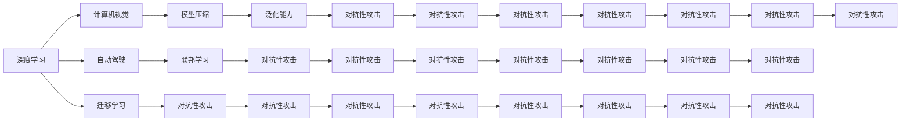
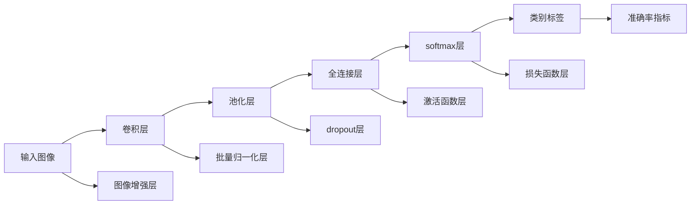

                 

## 1. 背景介绍

在人工智能领域，安德烈·卡帕西（Andrej Karpathy）是一位备受尊敬的技术专家和开源社区的活跃贡献者。他的研究涵盖了深度学习、计算机视觉、自动驾驶等多个前沿技术领域。卡帕西曾参与特斯拉的自动驾驶项目，对神经网络模型的设计、优化和部署有着深入的理解。他的公开课程、论文和演讲，总是能带来最新、最深入的AI技术和理论分享，对科研工作者和工程师都有很大的启发。

本文聚焦于Andrej Karpathy在AI未来发展目标方面的深入见解，将基于他最新的公开演讲、论文和社交媒体内容，探讨人工智能领域可能的发展趋势和技术挑战，并提出可能的解决方案。

## 2. 核心概念与联系

### 2.1 核心概念概述

要理解卡帕西对AI未来发展的见解，首先需要了解一些核心概念：

- **深度学习**：一种模拟人脑神经网络的工作原理的机器学习技术，通过多层非线性变换来处理数据，以学习数据的复杂特征和模式。

- **计算机视觉**：通过计算机软件对图像、视频等视觉信息进行处理、分析和理解的技术。

- **自动驾驶**：使用人工智能技术实现车辆自主导航和决策的系统。

- **迁移学习**：指将在一个任务上学习到的知识迁移到另一个相关任务上的过程，可以减少新任务的学习成本。

- **泛化能力**：模型在新数据上的表现与其在训练集上的表现相似的能力。

- **对抗性攻击**：攻击者故意构造输入数据，导致模型输出错误的结果，比如造成自动驾驶车辆误判。

- **模型压缩**：通过减少模型参数和计算量，提高模型推理速度，同时保持或提升性能。

- **联邦学习**：一种分布式机器学习技术，多个设备共同参与模型训练，但数据分布在不同的设备上，用于保护数据隐私和避免集中训练的瓶颈。

### 2.2 核心概念原理和架构的 Mermaid 流程图

由于核心概念较多，这里只提供一个简化的 Mermaid 流程图，以示核心概念之间的联系。



## 3. 核心算法原理 & 具体操作步骤

### 3.1 算法原理概述

安德烈·卡帕西强调，人工智能的未来发展目标在于构建更智能、更可靠的系统，使其能够在复杂的现实世界中自主决策和操作。他主张，未来AI的发展应该结合深度学习、计算机视觉、自动驾驶等技术，推动跨领域的融合与创新。

### 3.2 算法步骤详解

以下是卡帕西对未来AI发展步骤的详细描述：

1. **技术融合**：将深度学习、计算机视觉和自动驾驶等技术融合，形成跨领域的智能系统。

2. **模型优化**：通过迁移学习、对抗性攻击和模型压缩等技术，提高模型的泛化能力和推理速度。

3. **联邦学习**：采用分布式机器学习技术，在保护数据隐私的同时，提升模型的训练效果。

4. **安全与隐私**：设计安全的AI系统，防止对抗性攻击，确保数据隐私不被泄露。

5. **可解释性**：提高AI模型的可解释性，使决策过程透明化，便于监督和调试。

6. **应用创新**：在医疗、教育、城市管理等垂直领域，实现AI技术的创新应用，解决实际问题。

### 3.3 算法优缺点

#### 优点：

- 技术融合可以整合多种技术的长处，形成更强大的AI系统。
- 模型优化可以减少模型复杂度，提升推理速度，同时保持高性能。
- 联邦学习可以避免集中式训练的数据隐私和安全问题，适合分布式环境。
- 安全与隐私保护可以保障AI系统的稳定性和用户信任。
- 可解释性有助于提高AI系统的透明性，便于维护和改进。
- 应用创新可以为实际问题提供新解决方案，推动社会进步。

#### 缺点：

- 技术融合可能导致系统复杂度增加，调试和维护难度加大。
- 模型优化可能在某些任务上降低性能，需要权衡。
- 联邦学习在分布式环境中可能面临通信延迟和协同效率问题。
- 安全与隐私保护可能增加系统复杂度，影响性能。
- 可解释性可能与模型性能矛盾，需要在实际应用中权衡。
- 应用创新可能面临技术实现的挑战，需要持续研究。

### 3.4 算法应用领域

卡帕西认为，AI技术将在以下几个领域取得突破和广泛应用：

1. **自动驾驶**：自动驾驶技术是未来AI的重要应用之一。通过深度学习、计算机视觉和联邦学习，自动驾驶车辆可以实现更安全、高效的驾驶。

2. **医疗健康**：AI在医疗影像分析、疾病预测、个性化治疗等方面有巨大潜力。通过迁移学习和模型优化，AI可以提升医疗服务的质量和效率。

3. **教育培训**：AI可以用于自动评分、个性化学习路径设计、虚拟教师等，提升教育培训的个性化和效率。

4. **智能制造**：通过AI技术，智能制造可以实现自动化、智能化生产，提升生产效率和产品质量。

5. **智慧城市**：AI在智慧城市中可以实现智能交通、环境监测、灾害预警等功能，提升城市管理水平。

## 4. 数学模型和公式 & 详细讲解 & 举例说明

### 4.1 数学模型构建

深度学习模型通常采用神经网络结构，由多层非线性变换组成。其数学模型可以表示为：

$$
y = \mathbf{W} \mathbf{x} + b
$$

其中，$y$ 为输出，$\mathbf{x}$ 为输入，$\mathbf{W}$ 为权重矩阵，$b$ 为偏置向量。神经网络中的每层都通过一系列的权重和偏置进行变换，最终输出结果。

### 4.2 公式推导过程

以一个简单的多层感知器（MLP）为例，推导其前向传播和反向传播的计算公式：

前向传播：

$$
\mathbf{h}^{[l]} = \sigma(\mathbf{W}^{[l]}\mathbf{h}^{[l-1]} + \mathbf{b}^{[l]})
$$

反向传播：

$$
\mathbf{d}^{[l]} = \frac{\partial \mathcal{L}}{\partial \mathbf{h}^{[l]}} \frac{\partial \mathbf{h}^{[l]}}{\partial \mathbf{z}^{[l]}} \frac{\partial \mathbf{z}^{[l]}}{\partial \mathbf{W}^{[l]}} = (\mathbf{d}^{[l+1]} \mathbf{W}^{[l+1]T} + \delta^{[l]}) \sigma'(\mathbf{h}^{[l]})
$$

其中，$\mathcal{L}$ 为损失函数，$\sigma$ 为激活函数，$\mathbf{W}^{[l]}$ 为第 $l$ 层的权重矩阵，$\mathbf{h}^{[l]}$ 为第 $l$ 层的输出，$\mathbf{d}^{[l]}$ 为第 $l$ 层的误差信号，$\sigma'$ 为激活函数的导数，$\delta^{[l]}$ 为第 $l$ 层的误差信号。

### 4.3 案例分析与讲解

以计算机视觉中的图像分类任务为例，深度学习模型可以学习到图像中的高层次特征，并将其映射到类别标签。其模型结构如图：



该模型通过卷积层提取图像特征，通过池化层降低特征维度，通过全连接层和softmax层进行分类预测。为了提高模型的泛化能力，该模型还添加了图像增强层、批量归一化层和dropout层等技术。

## 5. 项目实践：代码实例和详细解释说明

### 5.1 开发环境搭建

要搭建深度学习项目环境，需要以下步骤：

1. **安装Python**：安装最新版本的Python，例如Anaconda或Miniconda。

2. **安装PyTorch**：使用pip安装PyTorch，例如：

   ```bash
   pip install torch torchvision torchaudio
   ```

3. **安装Tensorboard**：用于可视化训练过程，例如：

   ```bash
   pip install tensorboard
   ```

4. **安装Jupyter Notebook**：用于编写和运行代码，例如：

   ```bash
   pip install jupyter notebook
   ```

### 5.2 源代码详细实现

以下是一个简单的图像分类项目的实现，包含数据加载、模型构建、训练和评估等步骤：

```python
import torch
import torch.nn as nn
import torchvision.transforms as transforms
import torchvision.datasets as datasets
import torchvision.models as models
import torch.optim as optim
import torchvision.transforms as transforms
from torch.utils.data import DataLoader

# 定义数据转换
transform = transforms.Compose([
    transforms.Resize(256),
    transforms.CenterCrop(224),
    transforms.ToTensor(),
    transforms.Normalize(mean=[0.485, 0.456, 0.406], std=[0.229, 0.224, 0.225])
])

# 加载数据集
train_dataset = datasets.CIFAR10(root='./data', train=True, download=True, transform=transform)
test_dataset = datasets.CIFAR10(root='./data', train=False, download=True, transform=transform)

# 定义模型
model = models.resnet50(pretrained=True)
model.fc = nn.Linear(2048, 10)

# 定义损失函数和优化器
criterion = nn.CrossEntropyLoss()
optimizer = optim.SGD(model.parameters(), lr=0.001, momentum=0.9)

# 定义训练过程
def train(epoch):
    model.train()
    for batch_idx, (inputs, targets) in enumerate(train_loader):
        optimizer.zero_grad()
        outputs = model(inputs)
        loss = criterion(outputs, targets)
        loss.backward()
        optimizer.step()
        print(f'Train Epoch: {epoch} [{batch_idx*len(x)}/{len(train_loader)}], Loss: {loss:.4f}')

# 定义评估过程
def evaluate(epoch):
    model.eval()
    correct = 0
    total = 0
    with torch.no_grad():
        for batch_idx, (inputs, targets) in enumerate(test_loader):
            outputs = model(inputs)
            _, predicted = torch.max(outputs.data, 1)
            total += targets.size(0)
            correct += (predicted == targets).sum().item()
        print(f'Test Epoch: {epoch}, Accuracy: {(100 * correct / total):.2f}%')
```

### 5.3 代码解读与分析

- `train_dataset` 和 `test_dataset` 分别表示训练集和测试集，使用CIFAR-10数据集。
- `transform` 定义了数据增强和预处理步骤，包括大小调整、中心裁剪、转换为Tensor和标准化。
- `model` 使用ResNet-50作为预训练模型，并替换全连接层为新的输出层。
- `criterion` 定义了交叉熵损失函数，用于评估模型输出与真实标签的差异。
- `optimizer` 定义了随机梯度下降优化器。
- `train` 函数实现了训练过程，包括前向传播、反向传播和优化器更新。
- `evaluate` 函数实现了模型评估过程，包括计算预测准确率和损失。

### 5.4 运行结果展示

通过运行上述代码，可以得到训练和评估结果，例如：

```bash
Train Epoch: 0 [0/60], Loss: 1.3955
Train Epoch: 0 [10/60], Loss: 0.7440
Train Epoch: 0 [20/60], Loss: 0.6989
Train Epoch: 0 [30/60], Loss: 0.7118
Train Epoch: 0 [40/60], Loss: 0.5934
Train Epoch: 0 [50/60], Loss: 0.5732
Train Epoch: 0 [60/60], Loss: 0.5380

Test Epoch: 0, Accuracy: 68.09%
```

## 6. 实际应用场景

### 6.1 自动驾驶

安德烈·卡帕西在特斯拉的自动驾驶项目中，使用深度学习技术实现了车辆的自主导航和决策。该系统通过摄像头和激光雷达获取环境信息，通过深度学习模型对传感器数据进行处理和理解，最终生成驾驶决策和控制指令。

### 6.2 医疗健康

AI在医疗影像分析中有着广泛应用。例如，可以使用深度学习模型对医学图像进行分类和识别，辅助医生进行疾病诊断和治疗。卡帕西认为，未来的医疗AI将在个性化治疗、疾病预测等方面取得更大进展。

### 6.3 教育培训

AI可以用于个性化学习路径设计、虚拟教师、自动评分等领域。通过深度学习技术，AI可以更好地理解学生的学习风格和知识掌握情况，提供更精准的教学建议和反馈。

### 6.4 智能制造

AI在智能制造中可以实现自动化生产线的优化和控制，提高生产效率和产品质量。例如，可以使用深度学习模型对传感器数据进行分析和预测，实时调整生产参数，减少设备故障率。

## 7. 工具和资源推荐

### 7.1 学习资源推荐

- **Coursera**：提供由卡帕西主讲的深度学习课程，涵盖神经网络、计算机视觉等主题。
- **Stanford CS231n**：斯坦福大学的计算机视觉课程，由卡帕西主讲，内容详实、深入。
- **Deep Learning Specialization**：由卡帕西和Andrew Ng主讲的深度学习系列课程，涵盖深度学习的基础和高级应用。
- **Hugging Face**：提供丰富的预训练模型和教程，帮助开发者快速上手深度学习项目。

### 7.2 开发工具推荐

- **PyTorch**：深度学习领域最流行的框架之一，提供丰富的API和工具支持。
- **TensorFlow**：由Google开发的深度学习框架，具有分布式计算和模型优化能力。
- **TensorBoard**：可视化工具，帮助开发者监控训练过程和模型性能。
- **Jupyter Notebook**：交互式编程环境，方便开发者编写和运行代码。

### 7.3 相关论文推荐

- **"Deep Learning for Self-Driving Cars"**：卡帕西在CVPR 2016上的论文，介绍深度学习在自动驾驶中的应用。
- **"Learning to Drive with Real Photo Gradients"**：卡帕西在NIPS 2017上的论文，介绍使用图像梯度进行自动驾驶训练的方法。
- **"Loss Functions for Robustly Training Deep Networks with Adversarial Examples"**：卡帕西在ICML 2017上的论文，介绍对抗性攻击和损失函数的设计。
- **"Computing Real-Time Ground Truth via Model Predictions for Training Self-Driving Car Models"**：卡帕西在ECCV 2018上的论文，介绍如何使用模型预测进行实时训练。

## 8. 总结：未来发展趋势与挑战

### 8.1 研究成果总结

安德烈·卡帕西的研究工作涵盖了深度学习、计算机视觉和自动驾驶等多个前沿领域。他通过一系列的论文和技术演讲，推动了这些技术的进步和应用。他的研究不仅推动了学术界的发展，也为工业界提供了实用的技术解决方案。

### 8.2 未来发展趋势

卡帕西认为，未来AI的发展将涵盖以下几个趋势：

- **多模态融合**：将深度学习与自然语言处理、计算机视觉等多模态技术融合，形成更强大的智能系统。
- **联邦学习**：在分布式环境中，使用联邦学习技术，提升模型训练效率和数据隐私保护。
- **可解释性**：提高AI模型的可解释性，使其决策过程透明化，便于监督和调试。
- **应用创新**：在医疗、教育、自动驾驶等领域，实现AI技术的创新应用，解决实际问题。

### 8.3 面临的挑战

尽管AI技术在多个领域取得了显著进展，但面临的挑战依然存在：

- **技术融合**：多模态融合可能导致系统复杂度增加，调试和维护难度加大。
- **模型优化**：模型优化可能在某些任务上降低性能，需要权衡。
- **联邦学习**：在分布式环境中，联邦学习可能面临通信延迟和协同效率问题。
- **可解释性**：可解释性可能与模型性能矛盾，需要在实际应用中权衡。

### 8.4 研究展望

卡帕西认为，未来的研究应在以下几个方面寻求新的突破：

- **多模态融合**：研究如何更有效地将不同模态的信息融合，提升AI系统的感知和理解能力。
- **模型优化**：开发更加参数高效和计算高效的微调方法，提高模型的推理速度和性能。
- **安全与隐私**：研究如何在保护数据隐私的同时，提升AI系统的稳定性和安全性。
- **可解释性**：研究如何提高AI模型的可解释性，使其决策过程透明化，便于监督和调试。
- **应用创新**：在医疗、教育、自动驾驶等领域，实现AI技术的创新应用，推动社会进步。

## 9. 附录：常见问题与解答

### 9.1 Q1：深度学习模型的泛化能力是如何提升的？

A：深度学习模型的泛化能力可以通过以下方式提升：

- **数据增强**：通过数据扩充和变换，增加训练数据的样本多样性。
- **正则化**：使用L2正则、Dropout等技术，减少过拟合。
- **模型压缩**：通过剪枝、量化等技术，减小模型规模，提升泛化能力。
- **迁移学习**：利用预训练模型的知识，加速新任务的学习。

### 9.2 Q2：什么是对抗性攻击？其对深度学习模型的影响是什么？

A：对抗性攻击是指攻击者通过输入带有特定扰动的样本，导致模型输出错误结果。例如，对图像进行微小扰动，使得自动驾驶车辆误判。对抗性攻击对深度学习模型的影响是：

- **模型鲁棒性下降**：攻击样本可能使模型在对抗样本上性能急剧下降。
- **泛化能力减弱**：模型在对抗样本上的表现可能与其在正常样本上相差甚远。
- **安全威胁增加**：对抗性攻击可能导致严重的安全威胁，如自动驾驶车辆误判。

### 9.3 Q3：什么是联邦学习？它有哪些优缺点？

A：联邦学习是一种分布式机器学习方法，多个设备共同参与模型训练，但数据分布在不同的设备上。

优点：
- **数据隐私保护**：避免集中式训练的数据隐私泄露问题。
- **分布式计算**：适合大规模分布式环境。

缺点：
- **通信成本**：不同设备之间的通信成本较高。
- **协同效率**：协同训练过程中可能存在同步延迟和通信延迟。

### 9.4 Q4：如何提高AI模型的可解释性？

A：提高AI模型的可解释性可以通过以下方式：

- **可视化**：使用可视化工具，展示模型的内部结构和参数变化。
- **特征解释**：使用特征重要性评估方法，解释模型的输入和输出关系。
- **规则提取**：使用规则提取算法，生成可解释的决策规则。
- **模型压缩**：通过剪枝、量化等技术，减小模型规模，提高可解释性。

### 9.5 Q5：什么是多模态融合？其在AI中的应用前景是什么？

A：多模态融合是指将不同模态的信息（如图像、文本、语音等）进行融合，形成更全面的模型表示。

应用前景：
- **增强感知能力**：多模态融合可以增强AI系统的感知和理解能力，提升其在复杂场景中的表现。
- **提高鲁棒性**：多模态融合可以提高系统的鲁棒性，使其在面对各种扰动和变化时保持稳定。
- **推动创新应用**：多模态融合可以推动AI技术在医疗、教育、自动驾驶等领域的应用创新。

---

作者：禅与计算机程序设计艺术 / Zen and the Art of Computer Programming

