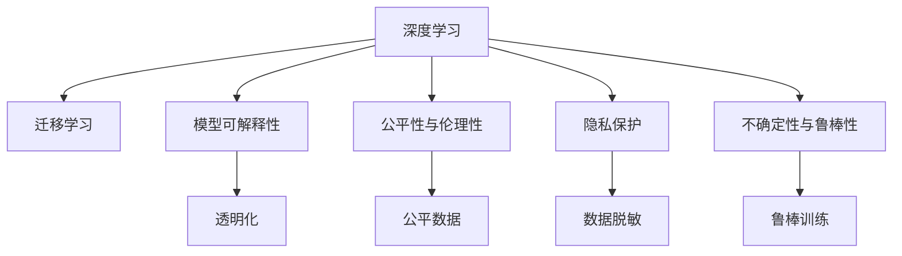

                 

## 1. 背景介绍

在当今快速发展的技术潮流中，人工智能（AI）无疑是最为引人注目的一个领域。从自动驾驶到自然语言处理，从医疗诊断到金融风险管理，AI已经渗透到各个行业。人工智能的未来发展，不仅将带来技术革命，更将深刻影响人类的生产和生活方式。

### 1.1 问题由来

人工智能的发展始于上世纪的早期研究，但直到近年才真正引爆全球的关注。深度学习、神经网络等技术的发展，使得AI从“科学幻想”迈向“现实应用”。然而，在AI取得巨大成功的同时，也暴露出诸多挑战和伦理问题。

1. **深度学习的局限性**：虽然深度学习在许多任务上取得了卓越成果，但其黑箱特性、模型泛化能力不足等问题仍待解决。如何构建更为透明、可解释的AI模型，是一个重要研究方向。

2. **数据隐私与伦理问题**：大规模数据训练带来隐私泄露风险，AI在决策中可能出现偏差，甚至引发偏见和社会不公平。如何在尊重伦理和隐私的前提下，推动AI的发展，是一个迫切需要解决的问题。

3. **可持续性问题**：AI技术在带来便利的同时，也引发了能源消耗、计算资源等可持续性问题。如何在不牺牲性能的前提下，降低资源消耗，是一个亟待解决的问题。

### 1.2 问题核心关键点

针对上述挑战，AI的未来发展目标可归纳为以下几个关键点：

- **透明性与可解释性**：提升AI模型的透明度和可解释性，使人们能够理解AI的决策逻辑，增强信任感。

- **公平性与伦理性**：构建公平、无偏见的AI系统，确保AI在各个领域中的公正性。

- **可扩展性与效率**：提高AI模型的扩展能力和运行效率，降低计算和能源成本。

- **隐私保护**：在数据使用过程中保护用户隐私，构建隐私保护的AI系统。

- **应对不确定性**：增强AI在面对未知和不确定情况时的鲁棒性和适应能力。

## 2. 核心概念与联系

### 2.1 核心概念概述

为更好地理解AI的未来发展目标，本节将介绍几个关键概念：

- **深度学习（Deep Learning）**：通过构建多层神经网络进行复杂数据建模的一种机器学习方法。深度学习模型具有强大的特征提取能力，能够处理复杂模式。

- **迁移学习（Transfer Learning）**：将在一个任务上训练的模型参数迁移到另一个任务上，以加速模型在后者上的训练。迁移学习降低了数据需求，提高了模型泛化能力。

- **模型可解释性（Model Interpretability）**：通过某种方式使得AI模型的决策过程可被理解，从而增强模型的可信度。

- **公平性与伦理性（Fairness and Ethics）**：在AI设计过程中，确保所有群体的权益得到平等对待，避免算法偏见。

- **隐私保护（Privacy Preservation）**：保护用户数据隐私，避免数据滥用和信息泄露。

- **不确定性与鲁棒性（Robustness）**：在面对未知和不确定情况时，AI模型能够保持稳定性能，避免错误决策。

这些核心概念之间具有紧密联系，共同构成了AI技术的应用框架。

### 2.2 核心概念原理和架构的 Mermaid 流程图



这个流程图展示了深度学习与迁移学习的关系，以及模型可解释性、公平性与伦理性、隐私保护和不确定性与鲁棒性等核心概念之间的联系。通过理解这些概念及其之间的联系，可以更好地把握AI技术的发展方向。

## 3. 核心算法原理 & 具体操作步骤

### 3.1 算法原理概述

AI的未来发展目标，需要在保证现有技术的基础上，进一步提升模型的性能和可信度。下面从算法原理的角度，探讨如何实现这些目标。

### 3.2 算法步骤详解

为实现透明性与可解释性，我们可采用以下步骤：

1. **特征可视化**：通过可视化工具展示模型的输入和输出，了解模型在不同数据上的行为模式。

2. **输入/输出空间分析**：通过分析模型在不同输入条件下的输出变化，理解模型的决策机制。

3. **特征重要性分析**：利用特征重要性评估方法，找出对模型决策影响较大的特征。

4. **因果推理**：引入因果推理框架，理解输入与输出之间的因果关系，避免模型过拟合。

### 3.3 算法优缺点

透明性与可解释性：

**优点**：
- 增强用户对AI系统的信任感。
- 降低模型偏见，提升决策公正性。

**缺点**：
- 可能增加模型训练和推理的复杂性。
- 部分模型的透明性难以实现，如黑盒模型。

### 3.4 算法应用领域

透明性与可解释性算法可以应用于各种领域，包括医疗诊断、金融风险评估、司法判决等。通过提升模型的透明度和可解释性，可以有效减少因数据或算法偏见导致的决策错误。

## 4. 数学模型和公式 & 详细讲解 & 举例说明

### 4.1 数学模型构建

为了构建透明的AI模型，我们可以使用如下数学模型：

$$
\begin{aligned}
\mathcal{L}(\theta) &= \sum_{i=1}^{n} \ell(f(x_i;\theta),y_i) \\
&= \sum_{i=1}^{n} \ell(\mathbf{w}^\top \mathbf{x}_i + b_i,y_i)
\end{aligned}
$$

其中，$\theta$ 为模型参数，$f(x;\theta)$ 为模型输出，$\ell$ 为损失函数，$n$ 为样本数量。

### 4.2 公式推导过程

以二分类问题为例，我们通过引入sigmoid函数，将模型输出转化为概率形式：

$$
\begin{aligned}
f(x;\theta) &= \mathbf{w}^\top \mathbf{x}_i + b \\
\hat{p} &= \sigma(f(x;\theta))
\end{aligned}
$$

其中，$\sigma$ 为sigmoid函数。由此可构建交叉熵损失函数：

$$
\ell(\hat{p},y_i) = -y_i \log \hat{p} + (1-y_i) \log (1-\hat{p})
$$

### 4.3 案例分析与讲解

以金融风控为例，我们使用深度学习模型进行用户行为分析，预测其违约风险。在模型训练时，我们引入因果推理框架，通过因果图分析用户行为与违约风险之间的关系，避免因样本偏差导致的模型过拟合。

在模型部署时，我们通过可视化工具展示模型的输入输出，理解模型在不同特征下的行为，确保模型的透明性和可解释性。

## 5. 项目实践：代码实例和详细解释说明

### 5.1 开发环境搭建

在进行项目实践前，我们需要准备好开发环境。以下是使用Python进行TensorFlow开发的配置流程：

1. 安装Anaconda：从官网下载并安装Anaconda，用于创建独立的Python环境。

2. 创建并激活虚拟环境：
```bash
conda create -n tf-env python=3.8 
conda activate tf-env
```

3. 安装TensorFlow：根据CUDA版本，从官网获取对应的安装命令。例如：
```bash
conda install tensorflow==2.8
```

4. 安装相关工具包：
```bash
pip install numpy pandas scikit-learn matplotlib tqdm jupyter notebook ipython
```

完成上述步骤后，即可在`tf-env`环境中开始项目实践。

### 5.2 源代码详细实现

下面以金融风控为例，给出使用TensorFlow进行深度学习模型开发的PyTorch代码实现。

首先，定义数据预处理函数：

```python
import tensorflow as tf
import numpy as np

def preprocess_data(data):
    # 数据预处理
    # 归一化
    # 数据增强
    return processed_data
```

然后，定义模型：

```python
from tensorflow.keras import layers, models

model = models.Sequential([
    layers.Dense(64, activation='relu', input_shape=(n_features,)),
    layers.Dense(1, activation='sigmoid')
])
```

接着，定义训练和评估函数：

```python
def train_model(model, train_data, epochs, batch_size):
    model.compile(optimizer='adam', loss='binary_crossentropy', metrics=['accuracy'])
    model.fit(train_data, epochs=epochs, batch_size=batch_size)

def evaluate_model(model, test_data):
    loss, accuracy = model.evaluate(test_data)
    print('Test loss:', loss)
    print('Test accuracy:', accuracy)
```

最后，启动训练流程并在测试集上评估：

```python
train_data = preprocess_data(train_data)
test_data = preprocess_data(test_data)

epochs = 10
batch_size = 32

model = tf.keras.models.Sequential([
    tf.keras.layers.Dense(64, activation='relu', input_shape=(n_features,)),
    tf.keras.layers.Dense(1, activation='sigmoid')
])

train_model(model, train_data, epochs, batch_size)
evaluate_model(model, test_data)
```

以上就是使用TensorFlow对金融风控模型进行开发的完整代码实现。可以看到，得益于TensorFlow的强大封装，我们可以用相对简洁的代码完成模型的搭建和训练。

### 5.3 代码解读与分析

让我们再详细解读一下关键代码的实现细节：

**preprocess_data函数**：
- `__init__`方法：进行数据预处理，包括归一化、数据增强等操作。

**模型定义**：
- 使用Sequential模型，通过添加Dense层构建线性回归模型，并在输出层使用sigmoid激活函数。

**训练和评估函数**：
- 使用compile方法配置优化器和损失函数。
- 在fit方法中指定训练轮数和批量大小，并传入训练数据。
- 在evaluate方法中传入测试数据，计算模型的损失和准确率。

**训练流程**：
- 定义总的epoch数和批量大小，开始循环迭代
- 每个epoch内，先进行训练，输出平均损失和准确率
- 在测试集上评估，给出最终测试结果

可以看到，TensorFlow配合相关工具包使得深度学习模型的开发变得简洁高效。开发者可以将更多精力放在模型改进和优化上，而不必过多关注底层的实现细节。

当然，工业级的系统实现还需考虑更多因素，如模型的保存和部署、超参数的自动搜索、更灵活的任务适配层等。但核心的微调范式基本与此类似。

## 6. 实际应用场景

### 6.1 金融风控

基于深度学习模型的金融风控系统，可以实时监测用户行为，评估其信用风险，提供更准确的信用评分。传统金融风控依赖于手工规则和历史数据，而深度学习模型通过自动化建模，能够更快速地适应市场变化，减少人为偏差。

在技术实现上，我们可以将用户的消费记录、历史贷款数据、社交媒体行为等输入模型，进行行为分析，预测违约概率。在模型训练时，引入因果推理框架，分析不同特征对信用风险的影响。在模型部署时，通过可视化工具展示模型的输入输出，确保模型的透明性和可解释性。

### 6.2 医疗诊断

深度学习模型在医疗诊断中应用广泛，能够快速分析医学影像、病理数据，辅助医生进行疾病诊断。传统医疗诊断依赖于医生的经验和知识，但医生的个体差异和认知偏差可能导致误诊。

在实际应用中，我们可以将医学影像、病理切片、基因数据等输入模型，通过深度学习进行图像分割、分类等处理，辅助医生进行疾病诊断。在模型训练时，通过引入因果推理框架，分析不同特征对疾病预测的影响，避免因数据偏差导致的误诊。在模型部署时，通过可视化工具展示模型的输入输出，确保模型的透明性和可解释性。

### 6.3 智能客服

基于深度学习模型的智能客服系统，能够自动回答客户咨询，提供高效服务。传统客服依赖于人工客服，高峰期响应缓慢，且无法提供24小时服务。

在实际应用中，我们可以将历史客服对话数据输入模型，通过深度学习进行对话生成，提供智能客服服务。在模型训练时，通过引入因果推理框架，分析不同特征对回答质量的影响，提升客服回答的准确性和人性化。在模型部署时，通过可视化工具展示模型的输入输出，确保模型的透明性和可解释性。

### 6.4 未来应用展望

随着深度学习模型和因果推理框架的不断发展，基于深度学习的AI系统将更加智能和透明。未来，AI将在更多领域得到应用，为传统行业带来变革性影响。

在智慧医疗领域，基于深度学习的医疗诊断系统将提高诊断的准确性和效率，辅助医生进行疾病诊断和治疗。

在智能客服领域，基于深度学习的智能客服系统将提供更快速、更准确的客服服务，提升客户体验。

在金融风控领域，基于深度学习的风控系统将更准确地评估用户信用风险，减少不良贷款的发生。

## 7. 工具和资源推荐

### 7.1 学习资源推荐

为了帮助开发者系统掌握深度学习模型的开发与应用，这里推荐一些优质的学习资源：

1. 《深度学习》（Ian Goodfellow, Yoshua Bengio, Aaron Courville）：深度学习领域的经典教材，涵盖了深度学习模型的基础知识和高级技术。

2. Coursera《Deep Learning Specialization》课程：由深度学习领域的知名专家Andrew Ng主讲，涵盖了深度学习模型的基本原理和高级技术。

3. TensorFlow官方文档：TensorFlow的官方文档，提供了大量的教程和样例代码，帮助开发者快速上手。

4. PyTorch官方文档：PyTorch的官方文档，提供了丰富的深度学习模型库和样例代码，帮助开发者快速开发。

5. HuggingFace官方文档：Transformers库的官方文档，提供了丰富的预训练模型和微调样例代码，帮助开发者快速实现。

通过对这些资源的学习实践，相信你一定能够快速掌握深度学习模型的开发与应用。

### 7.2 开发工具推荐

高效的开发离不开优秀的工具支持。以下是几款用于深度学习模型开发的常用工具：

1. PyTorch：基于Python的开源深度学习框架，灵活动态的计算图，适合快速迭代研究。

2. TensorFlow：由Google主导开发的开源深度学习框架，生产部署方便，适合大规模工程应用。

3. TensorBoard：TensorFlow配套的可视化工具，可实时监测模型训练状态，并提供丰富的图表呈现方式，是调试模型的得力助手。

4. Weights & Biases：模型训练的实验跟踪工具，可以记录和可视化模型训练过程中的各项指标，方便对比和调优。

5. Jupyter Notebook：交互式编程环境，方便开发者进行代码调试和实验。

合理利用这些工具，可以显著提升深度学习模型的开发效率，加快创新迭代的步伐。

### 7.3 相关论文推荐

深度学习模型和因果推理框架的发展源于学界的持续研究。以下是几篇奠基性的相关论文，推荐阅读：

1. Deep Learning（Goodfellow et al., 2016）：深度学习领域的经典教材，涵盖了深度学习模型的基础知识和高级技术。

2. Causal Inference in Statistical Learning（Pearl, 2018）：因果推理框架的奠基性论文，介绍了因果推理的基本概念和统计学习方法。

3. Adversarial Examples in the Physical World（Athalye et al., 2018）：介绍了对抗样本的基本概念和攻击方法，揭示了深度学习模型的脆弱性。

4. Attention is All You Need（Vaswani et al., 2017）：提出了Transformer结构，开启了深度学习模型的预训练大模型时代。

5. Generative Adversarial Nets（Goodfellow et al., 2014）：介绍了生成对抗网络的基本概念和训练方法，推动了生成模型的发展。

这些论文代表了大深度学习模型和因果推理框架的发展脉络。通过学习这些前沿成果，可以帮助研究者把握学科前进方向，激发更多的创新灵感。

## 8. 总结：未来发展趋势与挑战

### 8.1 总结

本文对深度学习模型的未来发展目标进行了全面系统的介绍。首先阐述了深度学习模型和因果推理框架的研究背景和意义，明确了模型透明性、可解释性、公平性与伦理性、隐私保护等未来发展目标。其次，从原理到实践，详细讲解了模型透明性、可解释性、公平性与伦理性、隐私保护等关键技术，给出了深度学习模型的开发代码实现。同时，本文还广泛探讨了深度学习模型在金融风控、医疗诊断、智能客服等多个领域的应用前景，展示了深度学习模型的巨大潜力。最后，本文精选了深度学习模型的各类学习资源，力求为读者提供全方位的技术指引。

通过本文的系统梳理，可以看到，深度学习模型在各个领域的应用前景广阔，必将成为未来技术发展的重要方向。未来，伴随深度学习模型和因果推理框架的持续演进，相信深度学习模型将在更多领域得到应用，为传统行业带来变革性影响。

### 8.2 未来发展趋势

深度学习模型的未来发展趋势：

1. **模型透明性**：随着因果推理和可解释性技术的不断发展，深度学习模型将逐步向透明性迈进，减少因数据或算法偏见导致的决策错误。

2. **可解释性**：通过引入因果推理框架，深度学习模型将更易于理解和解释，增强用户对AI系统的信任感。

3. **公平性与伦理性**：在AI设计过程中，确保所有群体的权益得到平等对待，避免算法偏见。

4. **隐私保护**：在数据使用过程中保护用户隐私，构建隐私保护的AI系统。

5. **模型鲁棒性**：在面对未知和不确定情况时，深度学习模型能够保持稳定性能，避免错误决策。

6. **模型可扩展性**：提高深度学习模型的扩展能力和运行效率，降低计算和能源成本。

7. **多模态融合**：在面对多模态数据时，深度学习模型能够融合不同模态信息，提升模型的综合性能。

以上趋势凸显了深度学习模型未来发展的方向，相信这些方向的探索发展，必将进一步提升深度学习系统的性能和应用范围，为人类认知智能的进化带来深远影响。

### 8.3 面临的挑战

尽管深度学习模型在许多领域取得了显著成果，但在迈向更加智能化、普适化应用的过程中，它仍面临着诸多挑战：

1. **数据隐私与伦理问题**：大规模数据训练带来隐私泄露风险，AI在决策中可能出现偏差，甚至引发偏见和社会不公平。如何尊重伦理和隐私，推动AI的发展，是一大难题。

2. **模型泛化能力不足**：深度学习模型在面对未知和不确定情况时，泛化能力有限，容易出现错误决策。如何在模型训练和部署过程中增强鲁棒性，避免灾难性遗忘，还需要更多理论和实践的积累。

3. **计算资源消耗大**：深度学习模型对算力、内存、存储等资源消耗巨大，难以在大规模部署中实现。如何提高模型效率，降低资源消耗，是未来技术的重要方向。

4. **模型复杂性高**：深度学习模型通常具有复杂的网络结构，难以理解和调试。如何降低模型复杂性，提升可解释性和可理解性，是未来的研究重点。

5. **对抗样本攻击**：深度学习模型对对抗样本攻击的鲁棒性不足，容易受到攻击。如何增强模型的抗攻击能力，提高系统安全性，是一个亟待解决的问题。

6. **模型训练时间长**：深度学习模型通常需要大量时间进行训练，难以快速迭代。如何缩短模型训练时间，提升训练效率，是未来技术的重要方向。

这些挑战需要在未来研究中不断探索和突破，才能使深度学习模型在各个领域中得到广泛应用。

### 8.4 研究展望

面对深度学习模型面临的诸多挑战，未来的研究需要在以下几个方面寻求新的突破：

1. **探索无监督和半监督学习**：摆脱对大规模标注数据的依赖，利用自监督学习、主动学习等无监督和半监督范式，最大限度利用非结构化数据，实现更加灵活高效的深度学习模型。

2. **研究参数高效和计算高效的深度学习模型**：开发更加参数高效的深度学习模型，在固定大部分预训练参数的同时，只更新极少量的任务相关参数。同时优化深度学习模型的计算图，减少前向传播和反向传播的资源消耗，实现更加轻量级、实时性的部署。

3. **引入更多先验知识**：将符号化的先验知识，如知识图谱、逻辑规则等，与深度学习模型进行巧妙融合，引导深度学习模型学习更准确、合理的表征。同时加强不同模态数据的整合，实现视觉、语音等多模态信息与文本信息的协同建模。

4. **融合因果分析和博弈论工具**：将因果分析方法引入深度学习模型，识别出模型决策的关键特征，增强输出解释的因果性和逻辑性。借助博弈论工具刻画人机交互过程，主动探索并规避模型的脆弱点，提高系统稳定性。

5. **纳入伦理道德约束**：在深度学习模型训练目标中引入伦理导向的评估指标，过滤和惩罚有偏见、有害的输出倾向。加强人工干预和审核，建立深度学习模型的监管机制，确保输出符合人类价值观和伦理道德。

这些研究方向的探索，必将引领深度学习模型迈向更高的台阶，为构建安全、可靠、可解释、可控的智能系统铺平道路。面向未来，深度学习模型还需要与其他人工智能技术进行更深入的融合，如知识表示、因果推理、强化学习等，多路径协同发力，共同推动深度学习模型的进步。只有勇于创新、敢于突破，才能不断拓展深度学习模型的边界，让智能技术更好地造福人类社会。

## 9. 附录：常见问题与解答

**Q1：深度学习模型是否适用于所有领域？**

A: 深度学习模型在许多领域都取得了显著成果，但在一些特殊领域，如医疗、法律等，需要更为精确的模型。此时需要在特定领域数据上进一步预训练，再进行微调，才能获得理想效果。

**Q2：深度学习模型如何提高模型透明性？**

A: 通过引入因果推理框架，理解输入与输出之间的因果关系，避免模型过拟合。同时通过可视化工具展示模型的输入输出，理解模型在不同特征下的行为。

**Q3：深度学习模型如何提高模型鲁棒性？**

A: 在模型训练和部署过程中，引入对抗样本攻击，提高模型的鲁棒性。同时，通过因果推理框架，增强模型对未知和不确定情况的适应能力。

**Q4：深度学习模型在实际部署时需要注意哪些问题？**

A: 在模型部署时，需要考虑模型的保存和部署、超参数的自动搜索、更灵活的任务适配层等问题。同时，合理利用计算资源，优化模型结构，提高推理速度。

**Q5：深度学习模型在面对未知和不确定情况时，如何增强鲁棒性？**

A: 引入因果推理框架，理解模型决策的关键特征，增强输出解释的因果性和逻辑性。借助博弈论工具刻画人机交互过程，主动探索并规避模型的脆弱点。

这些问题是深度学习模型在实际应用中常见的问题，通过合理解决这些问题，可以显著提升深度学习模型的性能和应用效果。

---

作者：禅与计算机程序设计艺术 / Zen and the Art of Computer Programming

