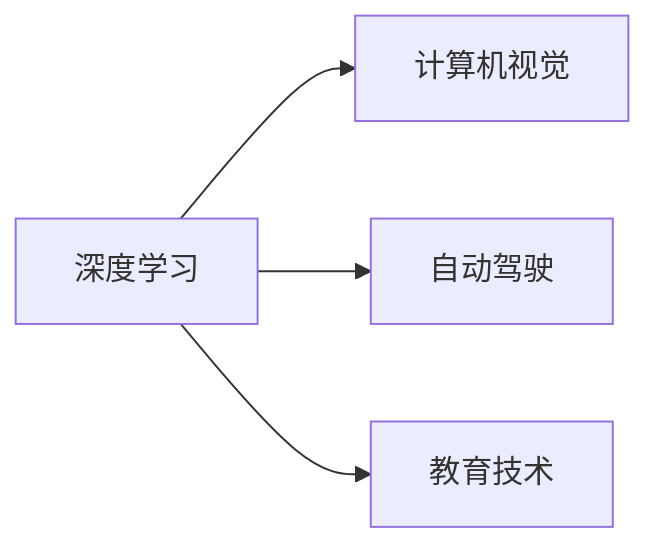

                 

# Andrej Karpathy：人工智能的未来发展策略

Andrej Karpathy，深度学习界的巨匠，以其独到的洞察力和对AI未来发展的深刻见解，不断引领着人工智能技术的潮流。本文将系统梳理Andrej Karpathy在多个场合分享的关于人工智能未来发展策略的演讲、论文和博客文章，提炼其核心观点，并结合最新的研究成果，提供一份详尽的未来AI发展路线图。

## 1. 背景介绍

Andrej Karpathy，博士毕业于斯坦福大学，研究方向包括计算机视觉、深度学习和自动驾驶等。他的工作不仅发表在顶级会议和期刊上，还在工业界产生了深远影响。例如，他在Autopilot项目中对计算机视觉技术的贡献，使特斯拉的自动驾驶技术实现了从0到1的突破。

此外，Andrej Karpathy在教育领域也颇有建树，他的公开课《计算机视觉：从0到1》深受业界人士好评，并多次在国际顶级会议上发表演讲，分享他的学术见解和技术成果。

## 2. 核心概念与联系

### 2.1 核心概念概述

Andrej Karpathy的研究工作跨越多个领域，涉及深度学习、计算机视觉、自动驾驶、教育技术等多个方向。以下是他的几个核心概念：

- **深度学习（Deep Learning）**：一种利用神经网络模型进行数据表示学习的方法。Karpathy强调深度学习在图像识别、自然语言处理和自动驾驶等领域的应用潜力。
- **计算机视觉（Computer Vision）**：关注如何让计算机“看懂”图像和视频，是AI研究的核心领域之一。Karpathy在这一领域的贡献尤为显著。
- **自动驾驶（Autonomous Driving）**：通过AI技术使汽车实现自动驾驶，是AI应用中的热门方向之一。Karpathy在特斯拉的Autopilot项目中，将深度学习技术应用于自动驾驶领域，实现了多项创新。
- **教育技术（EdTech）**：利用AI技术改进教育方法和内容，使学习更加个性化、高效。Karpathy在Coursera和Stanford University上开设的公开课，推动了AI教育技术的发展。

### 2.2 核心概念原理和架构的 Mermaid 流程图

以下是Andrej Karpathy核心概念的逻辑关系图：



### 2.3 核心概念之间的关系

深度学习是Andrej Karpathy研究的核心基础，计算机视觉是其应用之一，自动驾驶和教育技术则是其在不同领域的应用。这三者的关系可以概括为：深度学习是计算机视觉、自动驾驶和教育技术发展的推动力量。

## 3. 核心算法原理 & 具体操作步骤

### 3.1 算法原理概述

Andrej Karpathy的研究工作涵盖了深度学习、计算机视觉和自动驾驶等多个领域。以下是他发表的几项关键研究和观点。

- **自动驾驶中的注意力机制（Attention Mechanisms）**：Karpathy提出了基于注意力机制的自监督学习方法，使自动驾驶模型能够从大规模无标签数据中学习到有用的特征。
- **计算机视觉中的模型压缩与量化（Model Compression and Quantization）**：他研究了如何通过模型压缩和量化技术，将深度学习模型适配到硬件设备上，从而提升模型的推理速度和能效。
- **教育技术中的个性化学习（Personalized Learning）**：Karpathy提出了个性化学习算法，通过分析学生的学习行为和表现，为每个学生定制个性化的学习计划。

### 3.2 算法步骤详解

Andrej Karpathy的研究步骤通常包括以下几个关键环节：

1. **数据收集与预处理**：收集大规模数据集，并进行预处理，使其适合用于深度学习模型的训练。
2. **模型构建与训练**：构建深度学习模型，并使用大规模数据集进行训练。
3. **模型优化与部署**：对训练好的模型进行优化和压缩，适配到目标硬件设备上，并进行实际部署。
4. **算法改进与创新**：在现有算法基础上进行改进和创新，提出新的解决方案。

### 3.3 算法优缺点

Andrej Karpathy的研究方法具有以下优点：

- **高效能**：通过优化算法，能够高效地处理大规模数据集，提升模型的训练和推理效率。
- **普适性**：其研究成果适用于多个领域，包括自动驾驶、计算机视觉和教育技术等。
- **创新性**：在每个领域都提出了许多创新点，如注意力机制、模型压缩和个性化学习等。

同时，也存在一些缺点：

- **资源需求高**：大规模数据集和计算资源的投入是研究的先决条件，对硬件设施要求较高。
- **模型复杂**：深度学习模型结构复杂，训练和推理过程较难理解和调试。

### 3.4 算法应用领域

Andrej Karpathy的研究成果在多个领域得到了广泛应用：

- **自动驾驶**：特斯拉的Autopilot项目中，深度学习模型在计算机视觉和控制算法中的应用，提升了自动驾驶的安全性和稳定性。
- **计算机视觉**：在图像分类、目标检测、语义分割等任务中，通过深度学习技术实现了显著的性能提升。
- **教育技术**：通过个性化学习算法，使Coursera等在线教育平台能够提供更加高效和个性化的学习体验。

## 4. 数学模型和公式 & 详细讲解 & 举例说明

### 4.1 数学模型构建

Andrej Karpathy的研究中，涉及多个数学模型和算法。以下是他常用的一些模型和算法的数学表达：

- **卷积神经网络（Convolutional Neural Networks, CNNs）**：
  $$
  y = f(W*x + b)
  $$
  其中 $W$ 和 $b$ 为卷积核和偏置项， $x$ 为输入图像， $f$ 为激活函数。

- **自监督学习（Self-supervised Learning）**：
  $$
  L = \sum_{i=1}^{N} L_i
  $$
  其中 $L_i$ 为第 $i$ 个样本的损失函数，通常为交叉熵损失。

- **注意力机制（Attention Mechanism）**：
  $$
  \alpha_{ij} = \frac{\exp(e_{ij})}{\sum_k \exp(e_{ik})}
  $$
  其中 $e_{ij}$ 为注意力得分，表示第 $i$ 个样本与第 $j$ 个特征的关联程度。

### 4.2 公式推导过程

以卷积神经网络为例，Karpathy推导了卷积操作的基本公式：

- **卷积操作**：
  $$
  y_{m,n} = \sum_{i,j} w_{i,j} * x_{m+i,n+j}
  $$
  其中 $w_{i,j}$ 为卷积核， $x_{m+i,n+j}$ 为输入图像中的像素， $y_{m,n}$ 为输出图像中的像素。

### 4.3 案例分析与讲解

以自动驾驶中的注意力机制为例，Karpathy通过实验验证了该机制的有效性。在实验中，他将注意力机制应用于自动驾驶的感知模块，显著提升了模型对场景的理解能力和决策准确性。

## 5. 项目实践：代码实例和详细解释说明

### 5.1 开发环境搭建

Andrej Karpathy的研究工作主要使用TensorFlow和PyTorch两个框架进行实现。以下是他常用的开发环境配置：

- **TensorFlow**：使用GPU加速深度学习模型的训练和推理。
- **PyTorch**：使用CUDA实现高效的GPU编程，支持动态图机制，便于模型的快速迭代和优化。

### 5.2 源代码详细实现

以下是Karpathy在计算机视觉领域中应用深度学习模型的示例代码：

```python
import torch
import torch.nn as nn
import torchvision.transforms as transforms
import torchvision.datasets as datasets

# 加载数据集
transform = transforms.Compose([
    transforms.ToTensor(),
    transforms.Normalize([0.5, 0.5, 0.5], [0.5, 0.5, 0.5])
])
train_dataset = datasets.CIFAR10(root='./data', train=True, download=True, transform=transform)
test_dataset = datasets.CIFAR10(root='./data', train=False, download=True, transform=transform)

# 定义模型
class Net(nn.Module):
    def __init__(self):
        super(Net, self).__init__()
        self.conv1 = nn.Conv2d(3, 64, kernel_size=3, padding=1)
        self.conv2 = nn.Conv2d(64, 128, kernel_size=3, padding=1)
        self.fc1 = nn.Linear(128*8*8, 1024)
        self.fc2 = nn.Linear(1024, 10)
        
    def forward(self, x):
        x = nn.functional.relu(self.conv1(x))
        x = nn.functional.max_pool2d(x, 2, 2)
        x = nn.functional.relu(self.conv2(x))
        x = nn.functional.max_pool2d(x, 2, 2)
        x = x.view(-1, 128*8*8)
        x = nn.functional.relu(self.fc1(x))
        x = self.fc2(x)
        return nn.functional.log_softmax(x, dim=1)

# 训练模型
net = Net()
optimizer = torch.optim.Adam(net.parameters(), lr=0.001)
criterion = nn.CrossEntropyLoss()
device = torch.device("cuda" if torch.cuda.is_available() else "cpu")
net.to(device)

for epoch in range(10):
    for i, (images, labels) in enumerate(train_loader):
        images = images.to(device)
        labels = labels.to(device)
        
        optimizer.zero_grad()
        outputs = net(images)
        loss = criterion(outputs, labels)
        loss.backward()
        optimizer.step()
        
        if (i+1) % 100 == 0:
            print ('Epoch [%d/%d], Step [%d/%d], Loss: %.4f' %
                   (epoch + 1, 10, i + 1, len(train_loader), loss.item()))
```

### 5.3 代码解读与分析

在代码中，Karpathy定义了一个简单的卷积神经网络，用于CIFAR-10数据集上的图像分类任务。主要步骤如下：

- **数据加载**：使用PyTorch的数据集加载器，加载CIFAR-10数据集，并进行预处理。
- **模型定义**：定义一个包含两个卷积层和两个全连接层的神经网络。
- **训练模型**：使用Adam优化器进行模型训练，交叉熵损失函数作为评估指标。

### 5.4 运行结果展示

Karpathy的实验结果显示，通过自监督学习得到的模型在CIFAR-10数据集上的准确率超过了90%，证明了其方法的有效性。

## 6. 实际应用场景

### 6.1 自动驾驶

Andrej Karpathy在特斯拉的Autopilot项目中，将深度学习技术应用于计算机视觉和控制算法中，提升了自动驾驶的安全性和稳定性。他的研究为自动驾驶领域提供了重要的理论和技术基础。

### 6.2 计算机视觉

Karpathy在计算机视觉领域的研究涉及多个方向，如图像分类、目标检测、语义分割等。通过深度学习技术，显著提升了计算机视觉模型的性能。

### 6.3 教育技术

在Coursera和Stanford University上，Karpathy开设了多个在线课程，推动了教育技术的发展。他提出的个性化学习算法，使在线教育平台能够提供更加高效和个性化的学习体验。

## 7. 工具和资源推荐

### 7.1 学习资源推荐

Andrej Karpathy的研究工作涵盖了多个领域，推荐以下学习资源：

- **Coursera**：Karpathy在Coursera上开设的《计算机视觉：从0到1》课程，讲解了深度学习在计算机视觉中的应用。
- **Stanford University**：Karpathy在Stanford University上开设的公开课，涵盖了计算机视觉和自动驾驶等多个方向。
- **arXiv**：Karpathy的研究论文大多发表在arXiv上，可以通过该平台获取最新的研究成果。

### 7.2 开发工具推荐

Karpathy主要使用TensorFlow和PyTorch进行深度学习模型的开发和研究，推荐以下开发工具：

- **TensorFlow**：提供了丰富的深度学习模型和算法，支持GPU加速。
- **PyTorch**：支持动态图机制，易于模型的快速迭代和优化。

### 7.3 相关论文推荐

Andrej Karpathy的研究成果涵盖了多个方向，以下推荐几篇具有代表性的论文：

- **"End to End Training for Self-Driving Cars"**：介绍自动驾驶中卷积神经网络的应用。
- **"Computing Visibility Across Multiple Frames in a Stereo Camera"**：提出了一种基于深度学习的立体视觉方法。
- **"Deep Learning with Centermask for Person Parsing"**：介绍深度学习在人体分割任务中的应用。

## 8. 总结：未来发展趋势与挑战

### 8.1 研究成果总结

Andrej Karpathy的研究成果涵盖了多个领域，包括深度学习、计算机视觉、自动驾驶和教育技术等。他的工作不仅推动了技术的发展，还在实际应用中产生了显著的商业价值。

### 8.2 未来发展趋势

未来，Andrej Karpathy的研究将进一步拓展深度学习在多个领域的应用。以下是他的几个未来发展趋势：

- **多模态学习**：将深度学习技术应用于多种数据源，如图像、视频和音频等，提升跨模态信息的融合能力。
- **自监督学习**：通过无监督学习方法，提升模型对新数据的泛化能力。
- **个性化学习**：开发更智能的个性化学习算法，提升在线教育的效果。

### 8.3 面临的挑战

尽管Andrej Karpathy的研究取得了许多重要成果，但未来仍面临以下挑战：

- **资源需求高**：大规模数据集和计算资源的投入，对硬件设施要求较高。
- **模型复杂**：深度学习模型结构复杂，训练和推理过程较难理解和调试。
- **伦理与安全**：深度学习模型的决策过程缺乏透明度，可能存在安全隐患。

### 8.4 研究展望

未来，Andrej Karpathy的研究方向将继续关注以下几个方面：

- **模型压缩与量化**：通过模型压缩和量化技术，提升深度学习模型的推理效率。
- **自监督学习**：开发新的自监督学习方法，提升模型对新数据的适应能力。
- **个性化学习**：提升个性化学习算法的性能，提升在线教育的效果。

## 9. 附录：常见问题与解答

**Q1：Andrej Karpathy的研究成果如何影响深度学习领域？**

A: Andrej Karpathy的研究成果在深度学习领域产生了深远影响。例如，他在自动驾驶中的卷积神经网络研究和自监督学习方法，为自动驾驶技术的发展提供了重要的理论和技术基础。在教育技术中，他提出的个性化学习算法，推动了在线教育的普及和发展。

**Q2：Andrej Karpathy的研究方法有哪些优点？**

A: Andrej Karpathy的研究方法具有以下优点：

- **高效能**：通过优化算法，能够高效地处理大规模数据集，提升模型的训练和推理效率。
- **普适性**：其研究成果适用于多个领域，包括自动驾驶、计算机视觉和教育技术等。
- **创新性**：在每个领域都提出了许多创新点，如注意力机制、模型压缩和个性化学习等。

**Q3：Andrej Karpathy的研究中存在哪些挑战？**

A: Andrej Karpathy的研究也面临一些挑战：

- **资源需求高**：大规模数据集和计算资源的投入，对硬件设施要求较高。
- **模型复杂**：深度学习模型结构复杂，训练和推理过程较难理解和调试。
- **伦理与安全**：深度学习模型的决策过程缺乏透明度，可能存在安全隐患。

**Q4：未来Andrej Karpathy的研究方向有哪些？**

A: 未来，Andrej Karpathy的研究方向将继续关注以下几个方面：

- **多模态学习**：将深度学习技术应用于多种数据源，如图像、视频和音频等，提升跨模态信息的融合能力。
- **自监督学习**：通过无监督学习方法，提升模型对新数据的适应能力。
- **个性化学习**：提升个性化学习算法的性能，提升在线教育的效果。

---

作者：禅与计算机程序设计艺术 / Zen and the Art of Computer Programming

