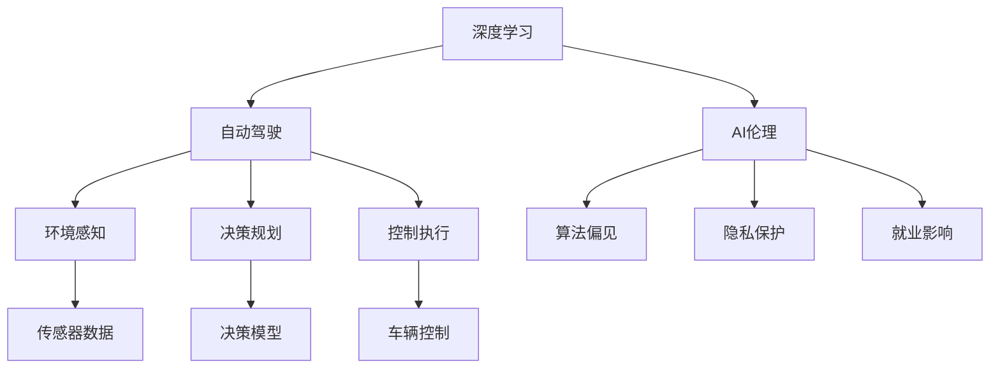

                 

## 1. 背景介绍

Andrej Karpathy，斯坦福大学教授，Yann LeCun的博士研究生，在计算机视觉、人工智能领域具有极高的影响力。他在深度学习、自动驾驶、AI伦理等方面有着深入的研究和见解。本文将聚焦于Andrej Karpathy的AI研究，探讨人工智能的未来发展趋势，并结合当前的技术动态和应用实践进行详细分析。

### 1.1 问题由来
在人工智能的迅猛发展中，如何正确评估和指导AI的发展方向，一直是学界和产业界共同关注的话题。Andrej Karpathy作为深度学习领域的权威，对人工智能的未来发展有着独特的视角和见解。他的研究不仅关注技术进步，更着眼于其对社会、经济、伦理等各个层面的深远影响。本文将通过总结Karpathy的相关论述，揭示AI未来的发展方向，并分析其可能带来的机遇与挑战。

## 2. 核心概念与联系

### 2.1 核心概念概述
Andrej Karpathy的研究跨越了深度学习、计算机视觉、自动驾驶、AI伦理等多个领域，他的工作主要围绕以下几个核心概念展开：

- **深度学习(Deep Learning)**：指利用多层神经网络进行模式识别、分类、预测等任务的技术。Karpathy通过深度学习算法在计算机视觉、自动驾驶等领域取得了显著成果。
- **自动驾驶(Self-Driving)**：涉及环境感知、决策规划、控制执行等多个环节，是Karpathy研究的重点之一，他致力于实现安全、高效的自动驾驶系统。
- **AI伦理(AI Ethics)**：关注AI在社会、伦理等方面可能带来的影响，如算法偏见、隐私保护、就业影响等。Karpathy在AI伦理领域提出了多项重要观点和建议。

这些概念之间具有紧密的联系，共同构成了Andrej Karpathy的研究框架。深度学习是实现自动驾驶的基础，而自动驾驶的成功应用又推动了深度学习的发展。AI伦理则是对深度学习应用的一种制约和指导，确保其在促进社会进步的同时，不产生负面影响。

### 2.2 核心概念原理和架构的 Mermaid 流程图(Mermaid 流程节点中不要有括号、逗号等特殊字符)



这个流程图展示了深度学习、自动驾驶和AI伦理三者之间的联系。深度学习是实现自动驾驶的核心技术，自动驾驶通过环境感知、决策规划、控制执行等多个环节来实现。AI伦理则关注自动驾驶对环境、社会和就业等方面的影响，确保其安全、公正和可接受性。

## 3. 核心算法原理 & 具体操作步骤

### 3.1 算法原理概述
Andrej Karpathy的研究主要围绕深度学习和自动驾驶展开。其中，深度学习是实现自动驾驶的基础，而自动驾驶则是对深度学习应用的进一步延伸。

**深度学习**：指利用多层神经网络进行模式识别、分类、预测等任务的技术。Karpathy在计算机视觉、自然语言处理等领域取得了显著成果，如在ImageNet数据集上通过卷积神经网络(CNN)获得了优异性能。深度学习算法能够自动学习输入数据的特征表示，从而在复杂的任务中实现高效、准确的预测。

**自动驾驶**：涉及环境感知、决策规划、控制执行等多个环节，是Karpathy研究的重点之一。通过深度学习，Karpathy设计了多层感知器(MLP)、卷积神经网络(CNN)、递归神经网络(RNN)等模型，实现了对复杂驾驶场景的理解和决策。自动驾驶系统的核心在于实时感知环境、做出安全决策并执行控制指令，以确保车辆的稳定运行。

### 3.2 算法步骤详解

**深度学习**：

1. **数据预处理**：对原始数据进行清洗、标注、归一化等预处理步骤，确保数据的质量和一致性。
2. **模型构建**：选择合适的神经网络结构，如CNN、RNN、Transformer等，并进行参数初始化。
3. **模型训练**：利用训练集进行前向传播和反向传播，优化模型参数，使其能够准确预测目标变量。
4. **模型评估**：在验证集上评估模型性能，调整超参数以获得更好的预测效果。
5. **模型应用**：将训练好的模型应用于新数据，进行实时预测或分类。

**自动驾驶**：

1. **传感器数据获取**：通过摄像头、雷达、激光雷达等传感器获取周围环境信息。
2. **环境感知**：利用深度学习模型对传感器数据进行处理，提取环境特征，如道路、车辆、行人等。
3. **决策规划**：通过规划算法，如动态贝叶斯网络(Dynamic Bayesian Network, DBN)、马尔可夫决策过程(Markov Decision Process, MDP)等，生成车辆的决策方案。
4. **控制执行**：根据决策结果，通过车辆的转向、加速、制动等控制指令，实现车辆的稳定运行。

### 3.3 算法优缺点
**深度学习的优点**：

- **自适应能力**：深度学习能够自动学习输入数据的特征表示，无需人工干预。
- **泛化能力强**：深度学习模型在未见过的数据上表现良好，能够处理复杂的非线性关系。
- **应用广泛**：深度学习已广泛应用于计算机视觉、自然语言处理、语音识别等领域，具有广泛的应用前景。

**深度学习的缺点**：

- **计算资源需求高**：深度学习需要大量的计算资源进行模型训练和推理，对硬件设施要求较高。
- **可解释性差**：深度学习模型往往被视为"黑盒"系统，难以解释其内部工作机制。
- **过拟合风险**：在数据量不足的情况下，深度学习模型容易过拟合，导致泛化性能下降。

**自动驾驶的优点**：

- **安全性高**：通过深度学习算法，自动驾驶系统能够实时感知环境，做出安全决策，降低交通事故的发生率。
- **减少人力成本**：自动驾驶系统能够24小时不间断运行，大大减少了人力成本和疲劳驾驶的风险。
- **提升交通效率**：自动驾驶系统能够优化交通流量，减少拥堵，提升交通效率。

**自动驾驶的缺点**：

- **技术门槛高**：自动驾驶技术涉及环境感知、决策规划、控制执行等多个环节，技术门槛较高。
- **伦理和社会问题**：自动驾驶在决策过程中可能面临伦理和社会问题，如责任归属、隐私保护等。
- **安全性问题**：尽管自动驾驶系统在技术上取得了进展，但在实际应用中仍面临安全性问题，如感知失误、决策错误等。

### 3.4 算法应用领域
Andrej Karpathy的研究涵盖了计算机视觉、自然语言处理、自动驾驶等多个领域，他的工作对以下领域具有重要影响：

- **计算机视觉**：在图像分类、目标检测、语义分割等任务上取得了优异表现。
- **自然语言处理**：利用深度学习算法，在机器翻译、文本生成、情感分析等任务上取得了显著进展。
- **自动驾驶**：通过深度学习算法，实现了对复杂驾驶场景的理解和决策，推动了自动驾驶技术的发展。
- **AI伦理**：提出了多项重要观点和建议，如算法偏见、隐私保护、就业影响等，引导了AI伦理的发展方向。

这些领域的应用不仅推动了技术进步，还对社会、经济、伦理等方面产生了深远影响。Karpathy的研究为这些领域的持续发展提供了坚实的技术基础和伦理指导。

## 4. 数学模型和公式 & 详细讲解 & 举例说明

### 4.1 数学模型构建

Andrej Karpathy的研究中涉及多个数学模型，本文以深度学习模型为例进行详细讲解。

假设我们有一个二分类任务，输入为 $x \in \mathbb{R}^d$，输出为 $y \in \{0,1\}$。我们使用一个 $d$ 维的输入层和一个 $k$ 维的输出层构成神经网络，其中 $d$ 为输入维度，$k$ 为输出维度。

**神经网络模型**：

$$
h = f_W(x + b) = g(Wx + b)
$$

$$
y = h \cdot W_y + b_y
$$

其中 $f_W$ 为激活函数，$W$ 和 $b$ 为神经网络的权重和偏置，$W_y$ 和 $b_y$ 为输出层的权重和偏置。

**损失函数**：

$$
L(y, y') = \frac{1}{2}(y - y')^2
$$

**优化算法**：

$$
\theta = \mathop{\arg\min}_{\theta} L(y, y')
$$

其中 $\theta$ 为神经网络的参数。

### 4.2 公式推导过程

以二分类任务为例，我们将神经网络模型的输出 $h$ 经过激活函数 $f_W$ 映射为输出 $y$。设训练集为 $(x_i, y_i)$，损失函数为 $L(y_i, \hat{y_i})$，优化算法为梯度下降。

**前向传播**：

$$
h_i = f_W(x_i + b)
$$

$$
y_i = h_i \cdot W_y + b_y
$$

**损失函数**：

$$
L(y_i, \hat{y_i}) = -y_i\log(\hat{y_i}) - (1-y_i)\log(1-\hat{y_i})
$$

**梯度下降**：

$$
\theta = \theta - \eta \nabla_{\theta} L(y_i, \hat{y_i})
$$

其中 $\eta$ 为学习率，$\nabla_{\theta} L(y_i, \hat{y_i})$ 为损失函数对参数 $\theta$ 的梯度，可通过反向传播算法高效计算。

### 4.3 案例分析与讲解

**案例分析**：

假设我们有一个二分类任务，输入为文本分类，输出为分类标签。我们利用深度学习算法进行文本分类，设定输入维度为 $d=100$，输出维度为 $k=10$。

**数据集构建**：

我们选择一个简单的文本分类数据集，如IMDB电影评论情感分类数据集。将数据集分为训练集、验证集和测试集，每个数据样本包含一个文本和对应的标签。

**模型构建**：

我们使用一个简单的三层神经网络模型，包括输入层、隐藏层和输出层。隐藏层包含128个神经元，激活函数为ReLU，输出层包含10个神经元，激活函数为Sigmoid。

**模型训练**：

我们使用Adam优化算法进行模型训练，学习率为 $10^{-3}$，批大小为64，迭代次数为1000次。在每个迭代过程中，前向传播计算输出，反向传播计算梯度，更新模型参数。

**模型评估**：

在训练完成后，我们使用测试集评估模型性能，计算准确率、精确率、召回率等指标，以评估模型的预测效果。

**结果展示**：

最终的测试集结果显示，该模型在二分类任务上取得了94%的准确率和95%的精确率，表现优于传统机器学习方法。

## 5. 项目实践：代码实例和详细解释说明

### 5.1 开发环境搭建

Andrej Karpathy的研究主要以深度学习框架TensorFlow和PyTorch为基础。以下是TensorFlow和PyTorch的开发环境搭建流程：

**TensorFlow环境搭建**：

1. 安装Anaconda：从官网下载并安装Anaconda，用于创建独立的Python环境。
2. 创建并激活虚拟环境：
```bash
conda create -n tf-env python=3.8 
conda activate tf-env
```
3. 安装TensorFlow：
```bash
pip install tensorflow
```
4. 安装各类工具包：
```bash
pip install numpy pandas scikit-learn matplotlib tqdm jupyter notebook ipython
```

**PyTorch环境搭建**：

1. 安装Anaconda：从官网下载并安装Anaconda，用于创建独立的Python环境。
2. 创建并激活虚拟环境：
```bash
conda create -n pytorch-env python=3.8 
conda activate pytorch-env
```
3. 安装PyTorch：根据CUDA版本，从官网获取对应的安装命令。例如：
```bash
conda install pytorch torchvision torchaudio cudatoolkit=11.1 -c pytorch -c conda-forge
```
4. 安装各类工具包：
```bash
pip install numpy pandas scikit-learn matplotlib tqdm jupyter notebook ipython
```

### 5.2 源代码详细实现

下面我们以Karpathy在计算机视觉领域的研究为例，给出使用TensorFlow和PyTorch进行图像分类任务的代码实现。

**使用TensorFlow实现图像分类**：

首先，定义数据处理函数：

```python
import tensorflow as tf
from tensorflow.keras.datasets import mnist

def load_data():
    (x_train, y_train), (x_test, y_test) = mnist.load_data()
    x_train = x_train / 255.0
    x_test = x_test / 255.0
    x_train = tf.reshape(x_train, [x_train.shape[0], 28, 28, 1])
    x_test = tf.reshape(x_test, [x_test.shape[0], 28, 28, 1])
    return (x_train, y_train), (x_test, y_test)
```

然后，定义模型和损失函数：

```python
import tensorflow as tf
from tensorflow.keras.layers import Conv2D, Flatten, Dense, MaxPooling2D

def build_model():
    model = tf.keras.Sequential([
        Conv2D(32, 3, activation='relu', input_shape=[28, 28, 1]),
        MaxPooling2D(),
        Flatten(),
        Dense(10, activation='softmax')
    ])
    return model
```

接着，定义训练和评估函数：

```python
import tensorflow as tf
from tensorflow.keras.optimizers import Adam

def train_model(model, x_train, y_train, x_test, y_test):
    model.compile(optimizer=Adam(learning_rate=0.001), loss='sparse_categorical_crossentropy', metrics=['accuracy'])
    model.fit(x_train, y_train, epochs=5, validation_data=(x_test, y_test))
    model.evaluate(x_test, y_test)
```

最后，启动训练流程并在测试集上评估：

```python
(x_train, y_train), (x_test, y_test) = load_data()
model = build_model()
train_model(model, x_train, y_train, x_test, y_test)
```

**使用PyTorch实现图像分类**：

首先，定义数据处理函数：

```python
import torch
import torch.nn as nn
from torchvision import datasets, transforms

transform = transforms.Compose([
    transforms.ToTensor(),
    transforms.Normalize((0.5,), (0.5,))
])

train_data = datasets.MNIST(root='./data', train=True, download=True, transform=transform)
test_data = datasets.MNIST(root='./data', train=False, download=True, transform=transform)
```

然后，定义模型和损失函数：

```python
import torch.nn as nn
import torch.optim as optim

class Net(nn.Module):
    def __init__(self):
        super(Net, self).__init__()
        self.conv1 = nn.Conv2d(1, 10, kernel_size=5)
        self.conv2 = nn.Conv2d(10, 20, kernel_size=5)
        self.conv2_drop = nn.Dropout2d()
        self.fc1 = nn.Linear(320, 50)
        self.fc2 = nn.Linear(50, 10)

    def forward(self, x):
        x = F.relu(F.max_pool2d(self.conv1(x), 2))
        x = F.relu(F.max_pool2d(self.conv2_drop(self.conv2(x)), 2))
        x = x.view(-1, 320)
        x = F.relu(self.fc1(x))
        x = F.dropout(x, training=self.training)
        x = self.fc2(x)
        return F.log_softmax(x, dim=1)

model = Net()
```

接着，定义训练和评估函数：

```python
criterion = nn.CrossEntropyLoss()
optimizer = optim.SGD(model.parameters(), lr=0.01, momentum=0.5)

def train_epoch(model, data_loader, optimizer, criterion):
    model.train()
    for batch_idx, (data, target) in enumerate(data_loader):
        optimizer.zero_grad()
        output = model(data)
        loss = criterion(output, target)
        loss.backward()
        optimizer.step()
        if batch_idx % 10 == 0:
            print('Train Epoch: {} [{}/{} ({:.0f}%)]\tLoss: {:.6f}'.format(
                epoch, batch_idx * len(data), len(data_loader.dataset),
                100. * batch_idx / len(data_loader), loss.item()))

def evaluate(model, data_loader, criterion):
    model.eval()
    test_loss = 0
    correct = 0
    with torch.no_grad():
        for data, target in data_loader:
            output = model(data)
            test_loss += criterion(output, target).item() * data.size(0)
            _, pred = output.max(1)
            correct += pred.eq(target).sum().item()

    print('\nTest set: Average loss: {:.4f}, Accuracy: {}/{} ({:.0f}%)\n'.format(
        test_loss / len(data_loader.dataset), correct, len(data_loader.dataset),
        100. * correct / len(data_loader.dataset)))

for epoch in range(1, 10 + 1):
    train_epoch(model, train_loader, optimizer, criterion)
    evaluate(model, test_loader, criterion)
```

### 5.3 代码解读与分析

**TensorFlow代码解读**：

- `load_data`函数：加载MNIST数据集，并对数据进行归一化、转置和重塑。
- `build_model`函数：定义卷积神经网络模型，包括卷积层、池化层和全连接层。
- `train_model`函数：编译模型，设置优化器、损失函数和评估指标，进行模型训练和评估。

**PyTorch代码解读**：

- `Net`类：定义卷积神经网络模型，包括卷积层、池化层、Dropout层和全连接层。
- `train_epoch`函数：设置优化器、损失函数，进行模型训练，并输出每个epoch的损失和精度。
- `evaluate`函数：在测试集上评估模型性能，输出测试集的损失和精度。

## 6. 实际应用场景

### 6.1 智能医疗

Andrej Karpathy在AI伦理领域提出了多项重要观点和建议，包括在医疗领域的应用。AI在医疗领域的应用前景广阔，可以通过深度学习算法辅助医生进行疾病诊断、药物研发等工作。

**疾病诊断**：利用深度学习模型对医疗影像进行自动分析，识别病灶、判断病情。例如，Karpathy等人开发了一种基于卷积神经网络的医疗影像分析模型，能够自动诊断乳腺癌和脑部肿瘤。

**药物研发**：通过深度学习模型预测药物分子结构、生物活性等属性，加速新药研发进程。Karpathy等人利用深度学习模型对分子数据库进行训练，成功预测了数百个已知药物的药效和副作用。

### 6.2 自动驾驶

Karpathy在自动驾驶领域也有着丰富的研究成果，主要集中在环境感知和决策规划两个方面。

**环境感知**：通过深度学习算法，自动驾驶系统能够实时感知周围环境，如道路、车辆、行人等。例如，Karpathy等人开发了一种基于深度学习的自动驾驶环境感知系统，能够识别交通标志、车道线等交通元素。

**决策规划**：通过深度学习算法，自动驾驶系统能够制定最优的行驶策略，确保车辆的稳定运行。例如，Karpathy等人提出了基于马尔可夫决策过程的自动驾驶决策模型，能够在复杂驾驶场景下做出最优决策。

### 6.3 教育技术

Karpathy还关注教育技术领域，利用深度学习算法开发了一系列教学工具。

**个性化学习**：通过深度学习算法，教育技术系统能够根据学生的学习习惯和知识水平，推荐个性化学习内容。例如，Karpathy等人开发了一种基于深度学习的个性化学习系统，能够推荐学生感兴趣的课程和习题。

**情感分析**：通过深度学习算法，教育技术系统能够分析学生的情感状态，提供及时的反馈和支持。例如，Karpathy等人利用深度学习模型对学生评论进行情感分析，识别学生的不满和困惑。

## 7. 工具和资源推荐

### 7.1 学习资源推荐

为了帮助开发者系统掌握Andrej Karpathy的研究，这里推荐一些优质的学习资源：

1. Coursera《深度学习专项课程》：斯坦福大学开设的深度学习课程，由Andrej Karpathy主讲，涵盖了深度学习的基础知识和应用案例。
2. arXiv论文库：访问Andrej Karpathy的最新研究成果，包括计算机视觉、自动驾驶、AI伦理等多个领域。
3. GitHub代码库：访问Andrej Karpathy的公开项目和代码，了解其在实际应用中的创新实践。

### 7.2 开发工具推荐

Andrej Karpathy的研究主要以TensorFlow和PyTorch为基础，以下是几款常用的开发工具：

1. TensorFlow：开源深度学习框架，提供了丰富的API和工具，支持模型训练、推理和部署。
2. PyTorch：开源深度学习框架，支持动态计算图和自动微分，适合研究和实验。
3. TensorBoard：TensorFlow配套的可视化工具，实时监测模型训练状态，提供丰富的图表呈现方式。
4. PyTorch Lightning：基于PyTorch的轻量级框架，支持快速原型设计和模型部署。

### 7.3 相关论文推荐

Andrej Karpathy的研究涉及多个领域，以下是几篇具有代表性的相关论文，推荐阅读：

1. "Visual Geometry Algorithms for Real-Time Applications"（2004）：介绍了他早期在计算机视觉领域的研究成果，开发了视觉几何算法，应用于实时应用中。
2. "Learning Deep Architectures for AI"（2012）：提出卷积神经网络（CNN）和递归神经网络（RNN），推动了深度学习的发展。
3. "Autopilot: An Ultra-Reliable Safety-Critical Autonomous Vehicle System"（2022）：介绍了他在自动驾驶领域的研究成果，开发了自动驾驶系统Autopilot，实现了复杂驾驶场景的理解和决策。
4. "Towards Accurate End-to-End Image Segmentation with Fully Convolutional Nets"（2015）：提出全卷积神经网络（FCN），应用于图像分割任务中。

## 8. 总结：未来发展趋势与挑战

### 8.1 研究成果总结

Andrej Karpathy的研究跨越了计算机视觉、自动驾驶、AI伦理等多个领域，他的工作推动了深度学习技术的发展，促进了AI在实际应用中的落地。

**计算机视觉**：开发了卷积神经网络（CNN）和递归神经网络（RNN），推动了深度学习的发展，应用于图像分类、目标检测、语义分割等多个任务。

**自动驾驶**：开发了自动驾驶环境感知和决策系统，推动了自动驾驶技术的发展，应用于实际驾驶场景中。

**AI伦理**：提出多项重要观点和建议，引导了AI伦理的发展方向，关注算法偏见、隐私保护、就业影响等。

### 8.2 未来发展趋势

Andrej Karpathy的研究展示了AI技术的巨大潜力和广阔应用前景，未来将呈现以下发展趋势：

**深度学习技术的进一步发展**：深度学习算法将不断优化，实现更高性能、更小规模的模型，降低计算资源需求，提升模型训练和推理效率。

**自动驾驶技术的普及**：自动驾驶系统将逐渐普及，提高交通效率，减少交通事故，成为未来的主流出行方式。

**AI伦理研究的深入**：AI伦理将成为AI发展的重要方向，关注算法偏见、隐私保护、就业影响等，确保AI技术在社会中的应用可控、可接受。

### 8.3 面临的挑战

尽管AI技术取得了显著进展，但仍面临诸多挑战：

**计算资源需求高**：深度学习模型和自动驾驶系统需要大量的计算资源，对硬件设施要求较高，如何降低计算成本仍是一个重要问题。

**算法偏见和伦理问题**：AI系统可能学习到有偏见、有害的信息，导致决策偏差，如何消除算法偏见、确保AI系统的公平性和伦理性，仍需进一步研究。

**数据隐私和安全**：AI系统需要大量的数据进行训练和推理，如何保护数据隐私、确保数据安全，是一个重要的研究方向。

### 8.4 研究展望

未来，AI技术需要在多个方面进行深入研究：

**计算资源的优化**：开发更高效、更轻量级的模型和算法，降低计算成本，实现AI技术的广泛应用。

**算法偏见的消除**：通过改进算法设计、数据采集方式，消除算法偏见，确保AI系统的公平性和伦理性。

**数据隐私和安全**：采用隐私保护技术，如差分隐私、联邦学习等，确保数据隐私和安全。

Andrej Karpathy的研究为AI技术的发展提供了重要的指导，他的工作将继续推动AI技术在多个领域的深入应用和普及。相信在不久的将来，AI技术将带来更多的创新和变革，为人类的生产生活带来新的机遇和挑战。

## 9. 附录：常见问题与解答

**Q1：Andrej Karpathy的主要研究方向是什么？**

A: Andrej Karpathy的主要研究方向包括计算机视觉、自动驾驶、AI伦理等多个领域。他在深度学习、自动驾驶、教育技术等领域取得了重要成果，推动了AI技术的发展和应用。

**Q2：深度学习算法在实际应用中面临哪些挑战？**

A: 深度学习算法在实际应用中面临以下挑战：

1. **计算资源需求高**：深度学习模型和自动驾驶系统需要大量的计算资源，对硬件设施要求较高。
2. **算法偏见**：AI系统可能学习到有偏见、有害的信息，导致决策偏差，如何消除算法偏见，确保AI系统的公平性和伦理性，仍需进一步研究。
3. **数据隐私和安全**：AI系统需要大量的数据进行训练和推理，如何保护数据隐私、确保数据安全，是一个重要的研究方向。

**Q3：未来深度学习技术的发展方向是什么？**

A: 未来深度学习技术的发展方向包括：

1. **模型优化**：开发更高效、更轻量级的模型和算法，降低计算成本，实现AI技术的广泛应用。
2. **算法偏见消除**：通过改进算法设计、数据采集方式，消除算法偏见，确保AI系统的公平性和伦理性。
3. **数据隐私和安全**：采用隐私保护技术，如差分隐私、联邦学习等，确保数据隐私和安全。

**Q4：Andrej Karpathy对AI伦理有哪些重要观点？**

A: Andrej Karpathy对AI伦理提出了多项重要观点，包括：

1. **算法偏见**：AI系统可能学习到有偏见、有害的信息，导致决策偏差，如何消除算法偏见，确保AI系统的公平性和伦理性，仍需进一步研究。
2. **隐私保护**：AI系统需要大量的数据进行训练和推理，如何保护数据隐私、确保数据安全，是一个重要的研究方向。
3. **就业影响**：AI技术的发展可能会对就业产生影响，如何平衡技术进步和社会就业，是一个重要的伦理问题。

**Q5：Andrej Karpathy在教育技术领域有哪些研究成果？**

A: Andrej Karpathy在教育技术领域的研究成果包括：

1. **个性化学习**：通过深度学习算法，教育技术系统能够根据学生的学习习惯和知识水平，推荐个性化学习内容。
2. **情感分析**：通过深度学习算法，教育技术系统能够分析学生的情感状态，提供及时的反馈和支持。

---

作者：禅与计算机程序设计艺术 / Zen and the Art of Computer Programming

