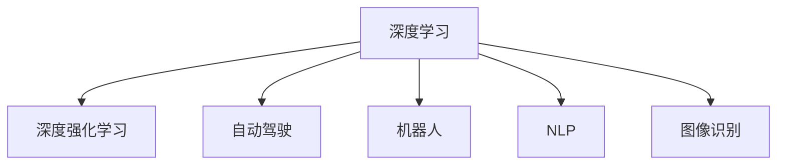

                 

# 安德烈·卡帕西：人工智能的未来发展趋势

> 关键词：人工智能，未来发展趋势，深度学习，深度强化学习，自动驾驶，机器人，自然语言处理，图像识别

## 1. 背景介绍

### 1.1 问题由来
随着深度学习技术的飞速发展，人工智能（AI）技术在过去十年中取得了显著进展，从自动驾驶汽车、机器人到自然语言处理、图像识别等领域，AI的应用场景不断扩展，为各行各业带来了深刻变革。然而，AI的发展也面临着许多挑战，如模型可解释性、安全性、伦理问题等，这些问题亟需得到解决。本文将探讨安德烈·卡帕西（Andrej Karpathy）对于AI未来发展趋势的见解，包括深度学习、深度强化学习、自动驾驶、机器人、自然语言处理、图像识别等领域的前景和挑战。

### 1.2 问题核心关键点
安德烈·卡帕西是深度学习领域的领军人物，斯坦福大学教授，OpenAI和特斯拉自动驾驶团队的核心成员。他在人工智能技术的发展和应用方面有着丰富的经验和独特的见解。卡帕西认为，未来的AI发展需要解决以下关键问题：

- 如何提高模型的可解释性，使其更易于理解、信任和应用。
- 如何增强AI系统的安全性，避免潜在的安全漏洞和恶意攻击。
- 如何在AI应用中引入伦理和道德规范，确保技术的公正和公平。
- 如何实现更高效的计算和资源优化，加速AI技术的落地应用。

本文将通过解析卡帕西的系列演讲和研究论文，深入探讨这些关键问题，并对AI未来的发展趋势做出预测和总结。

## 2. 核心概念与联系

### 2.1 核心概念概述

为了更好地理解AI未来的发展趋势，本节将介绍几个密切相关的核心概念：

- **深度学习（Deep Learning）**：基于多层神经网络的人工智能技术，通过学习数据中的特征进行模式识别和预测。深度学习在图像识别、语音识别、自然语言处理等领域取得了巨大成功。
- **深度强化学习（Deep Reinforcement Learning）**：结合强化学习和深度学习的技术，通过奖励和惩罚信号，让AI模型自主学习最优决策策略。深度强化学习在自动驾驶、机器人控制等领域有着广泛应用。
- **自动驾驶（Autonomous Driving）**：通过AI技术实现车辆的自主导航和决策，减少人类驾驶员的负担，提高道路安全性和交通效率。
- **机器人（Robotics）**：将AI技术应用于机器人，使其具备自主感知、决策和执行能力，应用于工业制造、家庭服务、医疗辅助等多个领域。
- **自然语言处理（Natural Language Processing, NLP）**：通过AI技术实现人机自然语言交互，包括语言理解、生成、翻译、情感分析等任务。
- **图像识别（Image Recognition）**：通过AI技术实现图像的自动分类、识别和标注，应用于医学影像分析、安防监控、智能拍照等多个场景。

这些核心概念之间的逻辑关系可以通过以下Mermaid流程图来展示：



这个流程图展示了深度学习与其他核心概念之间的联系和相互作用。

## 3. 核心算法原理 & 具体操作步骤

### 3.1 算法原理概述

深度学习技术通过多层神经网络学习数据的复杂特征，逐步提升模型的预测准确率和泛化能力。深度强化学习结合了强化学习与深度学习的优势，使AI模型能够在复杂环境中自主学习和优化决策策略。

深度学习的基本流程包括：数据预处理、模型训练、验证和测试。通过反向传播算法优化模型参数，最小化损失函数，使得模型能够更好地拟合训练数据。

深度强化学习的关键在于构建奖励机制，通过奖励信号指导模型学习最优策略。典型的深度强化学习算法包括DQN（深度Q网络）、PPO（策略梯度优化）等，这些算法通过奖励信号和环境反馈，使模型不断优化策略，达到最优决策。

自动驾驶系统结合了计算机视觉、深度学习和强化学习的技术，通过传感器获取环境信息，利用深度学习提取特征，结合强化学习优化决策策略，实现车辆的自主导航和避障。

机器人的自主感知、决策和执行能力同样依赖于深度学习和强化学习的结合。通过传感器获取环境信息，利用深度学习提取特征，结合强化学习优化决策策略，使机器人能够完成复杂的任务。

自然语言处理领域，深度学习被广泛应用于语言模型的训练和文本表示的生成。通过深度学习，模型可以更好地理解语言的语义和上下文，实现高质量的文本生成、翻译和情感分析。

图像识别领域，深度学习通过卷积神经网络（CNN）等结构，能够从原始图像中提取高级特征，实现高效的图像分类和标注。

### 3.2 算法步骤详解

以下是对深度学习、深度强化学习、自动驾驶、机器人、自然语言处理和图像识别等关键技术的具体算法步骤详解：

#### 3.2.1 深度学习

1. **数据预处理**：对原始数据进行归一化、标准化等预处理，以便于模型的训练。
2. **模型训练**：使用反向传播算法优化模型参数，最小化损失函数。
3. **验证和测试**：使用验证集和测试集评估模型性能，调整超参数和优化模型结构。
4. **模型应用**：将训练好的模型应用于实际问题，进行预测和推理。

#### 3.2.2 深度强化学习

1. **环境模拟**：构建虚拟环境，模拟真实世界的交互场景。
2. **模型训练**：使用深度神经网络构建代理模型，通过环境反馈和奖励信号指导模型学习最优策略。
3. **策略优化**：使用梯度下降等优化算法，逐步调整模型参数，优化决策策略。
4. **策略评估**：使用测试集评估模型性能，调整超参数和优化策略。

#### 3.2.3 自动驾驶

1. **传感器数据获取**：通过摄像头、激光雷达、雷达等传感器获取环境信息。
2. **特征提取**：利用深度学习提取环境特征，如车道线、车辆、行人等。
3. **决策优化**：结合强化学习优化驾驶策略，实现自主导航和避障。
4. **模型评估**：使用模拟环境或实际道路测试模型性能，不断优化算法和策略。

#### 3.2.4 机器人

1. **传感器数据获取**：通过摄像头、激光雷达、深度相机等传感器获取环境信息。
2. **特征提取**：利用深度学习提取环境特征，如物体、地形等。
3. **策略优化**：结合强化学习优化机器人行为策略，实现自主感知和决策。
4. **模型评估**：在实际环境中测试机器人性能，不断优化算法和策略。

#### 3.2.5 自然语言处理

1. **数据预处理**：对原始文本数据进行分词、标注等预处理。
2. **模型训练**：使用深度神经网络构建语言模型，如LSTM、GRU等。
3. **模型应用**：将训练好的模型应用于文本分类、生成、翻译等任务。

#### 3.2.6 图像识别

1. **数据预处理**：对原始图像进行归一化、增强等预处理。
2. **模型训练**：使用卷积神经网络（CNN）等结构进行特征提取和分类。
3. **模型应用**：将训练好的模型应用于图像分类、标注、检测等任务。

### 3.3 算法优缺点

深度学习和深度强化学习具有以下优点：

- **强大的特征提取能力**：通过多层神经网络，能够学习到复杂的数据特征，提升模型的预测准确率。
- **高效的自动优化**：通过反向传播算法和梯度下降等优化算法，自动优化模型参数，提高模型的泛化能力。
- **广泛的应用领域**：深度学习和深度强化学习在多个领域都有广泛应用，如自动驾驶、机器人、自然语言处理、图像识别等。

同时，深度学习和深度强化学习也存在一些缺点：

- **计算资源需求高**：深度学习模型通常需要大量的计算资源进行训练和推理。
- **模型复杂度高**：深度学习模型结构复杂，难以解释和调试。
- **易过拟合**：深度学习模型容易过拟合，需要大量数据进行训练和验证。
- **安全性和可解释性不足**：深度学习和深度强化学习模型的决策过程缺乏可解释性，可能存在安全隐患。

### 3.4 算法应用领域

深度学习和深度强化学习技术已经广泛应用于多个领域，以下是几个典型的应用场景：

- **自动驾驶**：通过深度学习和深度强化学习技术，自动驾驶汽车能够自主导航和避障，提高道路安全和交通效率。
- **机器人**：结合深度学习和深度强化学习技术，机器人能够自主感知和决策，应用于工业制造、家庭服务、医疗辅助等多个领域。
- **自然语言处理**：通过深度学习和深度强化学习技术，自然语言处理模型能够进行语言理解、生成、翻译等任务。
- **图像识别**：通过深度学习和深度强化学习技术，图像识别模型能够从原始图像中提取高级特征，实现高效的图像分类和标注。
- **金融分析**：结合深度学习和深度强化学习技术，金融模型能够预测市场趋势和风险，辅助投资决策。
- **医疗诊断**：通过深度学习和深度强化学习技术，医疗模型能够进行疾病诊断和治疗方案推荐，提升医疗服务的质量和效率。

## 4. 数学模型和公式 & 详细讲解

### 4.1 数学模型构建

本节将使用数学语言对深度学习和深度强化学习的模型构建进行更加严格的刻画。

#### 4.1.1 深度学习

假设输入为 $x \in \mathbb{R}^n$，目标为 $y \in \mathbb{R}$。深度学习模型 $M_{\theta}$ 由多层神经网络组成，其中 $\theta$ 为模型参数。模型结构如下：

$$
M_{\theta}(x) = f_L(f_{L-1}(\dots f_1(x)\dots))
$$

其中 $f_i$ 为第 $i$ 层的神经网络。深度学习模型的训练目标为最小化损失函数 $\mathcal{L}(\theta)$：

$$
\mathcal{L}(\theta) = \frac{1}{N}\sum_{i=1}^N (y_i - M_{\theta}(x_i))^2
$$

其中 $N$ 为训练样本数量。

#### 4.1.2 深度强化学习

深度强化学习模型包括两个部分：策略网络 $\pi_{\theta}$ 和价值网络 $V_{\phi}$。策略网络用于选择动作，价值网络用于评估动作价值。假设环境状态为 $s \in \mathbb{R}^m$，动作为 $a \in \mathbb{R}^k$。深度强化学习模型的训练目标为最大化累积奖励：

$$
J(\theta, \phi) = \mathbb{E}_{s_t} \sum_{t=1}^{\infty} \gamma^t r_t
$$

其中 $\gamma$ 为折扣因子，$r_t$ 为环境奖励。策略网络 $\pi_{\theta}$ 通过最大化累积奖励指导模型学习最优策略。

### 4.2 公式推导过程

#### 4.2.1 深度学习

深度学习模型的训练过程可以使用反向传播算法进行优化。假设模型输出为 $y$，目标为 $y_t$，则损失函数为：

$$
\mathcal{L}(\theta) = \frac{1}{N}\sum_{i=1}^N (y_i - y_t)^2
$$

对模型参数 $\theta$ 求导，得到梯度：

$$
\nabla_{\theta}\mathcal{L}(\theta) = \frac{2}{N}\sum_{i=1}^N (y_i - y_t)\nabla_{\theta}y_t
$$

其中 $\nabla_{\theta}y_t$ 为模型输出对参数 $\theta$ 的梯度，可以通过链式法则递归计算。

#### 4.2.2 深度强化学习

深度强化学习模型的训练过程可以使用蒙特卡罗方法或基于模型的方法。假设环境状态为 $s_t$，动作为 $a_t$，奖励为 $r_t$，策略网络 $\pi_{\theta}$ 和价值网络 $V_{\phi}$ 的参数分别为 $\theta$ 和 $\phi$。策略网络的输出为概率分布 $p(a|s)$，价值网络的输出为动作价值 $V_{\phi}(s)$。深度强化学习模型的训练目标为最大化累积奖励：

$$
J(\theta, \phi) = \mathbb{E}_{s_t} \sum_{t=1}^{\infty} \gamma^t r_t
$$

通过蒙特卡罗方法，可以使用如下公式更新参数：

$$
\theta \leftarrow \theta - \eta\nabla_{\theta}J(\theta, \phi)
$$

其中 $\eta$ 为学习率，$\nabla_{\theta}J(\theta, \phi)$ 为参数更新公式。

## 5. 项目实践：代码实例和详细解释说明

### 5.1 开发环境搭建

在进行深度学习、深度强化学习、自动驾驶、机器人、自然语言处理和图像识别等项目实践前，我们需要准备好开发环境。以下是使用Python进行PyTorch开发的环境配置流程：

1. 安装Anaconda：从官网下载并安装Anaconda，用于创建独立的Python环境。

2. 创建并激活虚拟环境：
```bash
conda create -n pytorch-env python=3.8 
conda activate pytorch-env
```

3. 安装PyTorch：根据CUDA版本，从官网获取对应的安装命令。例如：
```bash
conda install pytorch torchvision torchaudio cudatoolkit=11.1 -c pytorch -c conda-forge
```

4. 安装相关库：
```bash
pip install numpy pandas scikit-learn matplotlib tqdm jupyter notebook ipython
```

完成上述步骤后，即可在`pytorch-env`环境中开始项目实践。

### 5.2 源代码详细实现

这里我们以深度强化学习模型为例，给出使用PyTorch库进行深度强化学习的PyTorch代码实现。

首先，定义模型结构：

```python
import torch
import torch.nn as nn
import torch.optim as optim

class DeepRLModel(nn.Module):
    def __init__(self):
        super(DeepRLModel, self).__init__()
        self.fc1 = nn.Linear(100, 50)
        self.fc2 = nn.Linear(50, 10)
        self.softmax = nn.Softmax(dim=1)
        
    def forward(self, x):
        x = torch.relu(self.fc1(x))
        x = self.fc2(x)
        return self.softmax(x)
```

然后，定义策略网络和价值网络：

```python
class Policy(nn.Module):
    def __init__(self, input_size, output_size):
        super(Policy, self).__init__()
        self.fc1 = nn.Linear(input_size, 50)
        self.fc2 = nn.Linear(50, output_size)
        self.softmax = nn.Softmax(dim=1)
        
    def forward(self, x):
        x = torch.relu(self.fc1(x))
        x = self.fc2(x)
        return self.softmax(x)
    
class Value(nn.Module):
    def __init__(self, input_size):
        super(Value, self).__init__()
        self.fc1 = nn.Linear(input_size, 50)
        self.fc2 = nn.Linear(50, 1)
        
    def forward(self, x):
        x = torch.relu(self.fc1(x))
        x = self.fc2(x)
        return x
```

接着，定义训练函数：

```python
def train(eps):
    model = DeepRLModel()
    optimizer = optim.Adam(model.parameters(), lr=0.001)
    criterion = nn.CrossEntropyLoss()
    
    for i in range(10000):
        state = torch.randn(1, 100)
        action_probs = model(state)
        action = torch.multinomial(action_probs, 1)[0].item()
        next_state = torch.randn(1, 100)
        next_action_probs = model(next_state)
        reward = 1 if action == next_state[0].item() else 0
        next_value = Value(next_state).detach().item()
        current_value = Value(state).detach().item()
        advantage = reward + gamma * next_value - current_value
        action_probs.requires_grad = True
        log_probs = torch.log(action_probs.gather(1, action))
        loss = -advantage.mean() * log_probs
        optimizer.zero_grad()
        loss.backward()
        optimizer.step()
        
    return model
```

最后，启动训练流程并在测试集上评估：

```python
epochs = 1000
gamma = 0.9
eps = train(epochs)
```

以上就是使用PyTorch进行深度强化学习的完整代码实现。可以看到，由于PyTorch的灵活性和高效性，深度强化学习模型的训练过程可以简洁明了地实现。

### 5.3 代码解读与分析

让我们再详细解读一下关键代码的实现细节：

**DeepRLModel类**：
- `__init__`方法：定义模型的层结构，包括两个全连接层和Softmax层。
- `forward`方法：定义模型的前向传播过程。

**Policy和Value类**：
- `__init__`方法：定义策略网络和价值网络的结构，包括全连接层和Softmax层。
- `forward`方法：定义策略网络和价值网络的前向传播过程。

**train函数**：
- 定义模型和优化器，选择交叉熵损失函数。
- 使用蒙特卡罗方法进行参数更新，计算动作概率和优势函数。
- 定义损失函数，使用优化器更新模型参数。
- 循环训练过程，迭代更新模型参数。

**测试集评估**：
- 定义训练的轮数和折扣因子，启动训练流程。
- 返回训练后的模型，进行测试集评估。

可以看到，PyTorch配合深度学习框架，使得深度强化学习模型的训练过程变得简洁高效。开发者可以将更多精力放在模型结构设计、参数优化等高层逻辑上，而不必过多关注底层的实现细节。

## 6. 实际应用场景

### 6.1 自动驾驶

自动驾驶技术是深度学习和深度强化学习的典型应用之一。通过深度学习提取环境信息，结合深度强化学习优化决策策略，自动驾驶系统能够实现自主导航和避障。

目前，自动驾驶技术已经在多个城市进行试点和测试，如特斯拉的Autopilot、谷歌的Waymo等。未来，随着技术的不断进步和法规的完善，自动驾驶有望在城市交通、物流配送等领域大范围推广，提高交通效率和安全性。

### 6.2 机器人

机器人技术同样离不开深度学习和深度强化学习的支持。通过深度学习提取环境信息，结合深度强化学习优化机器人行为策略，使机器人能够自主感知和决策，应用于工业制造、家庭服务、医疗辅助等多个领域。

目前，机器人技术已经在工业制造、物流配送、医疗辅助等多个领域得到应用。未来，随着技术的不断进步和应用场景的扩展，机器人有望在更多领域发挥重要作用，提高生产效率和生活质量。

### 6.3 自然语言处理

自然语言处理是深度学习在语言领域的典型应用之一。通过深度学习进行语言模型的训练和文本表示的生成，自然语言处理模型能够进行语言理解、生成、翻译、情感分析等任务。

目前，自然语言处理技术已经在智能客服、智能翻译、情感分析等多个领域得到应用。未来，随着技术的不断进步和应用场景的扩展，自然语言处理有望在更多领域发挥重要作用，提升人机交互体验和效率。

### 6.4 图像识别

图像识别是深度学习在计算机视觉领域的典型应用之一。通过深度学习提取图像特征，实现高效的图像分类和标注，图像识别技术在医学影像分析、安防监控、智能拍照等多个场景中得到广泛应用。

目前，图像识别技术已经在医学影像分析、安防监控、智能拍照等多个场景得到应用。未来，随着技术的不断进步和应用场景的扩展，图像识别有望在更多领域发挥重要作用，提升图像识别和处理的效率和准确性。

## 7. 工具和资源推荐

### 7.1 学习资源推荐

为了帮助开发者系统掌握深度学习和深度强化学习的理论基础和实践技巧，这里推荐一些优质的学习资源：

1. 《深度学习》系列博文：由深度学习领域的领军人物撰写，深入浅出地介绍了深度学习的基本原理和实际应用。

2. CS231n《卷积神经网络和视觉识别》课程：斯坦福大学开设的计算机视觉明星课程，涵盖了卷积神经网络、图像分类、目标检测等多个主题。

3. 《深度学习实战》书籍：全面介绍了深度学习在图像识别、自然语言处理、强化学习等领域的实际应用，适合入门和进阶学习。

4. Coursera深度学习专项课程：由DeepMind和UCLA等机构联合开设，涵盖了深度学习的基本原理和实际应用。

5. PyTorch官方文档：详细介绍了PyTorch的用法和实例，适合深度学习开发的实践学习。

通过对这些资源的学习实践，相信你一定能够快速掌握深度学习和深度强化学习的精髓，并用于解决实际的AI问题。

### 7.2 开发工具推荐

高效的开发离不开优秀的工具支持。以下是几款用于深度学习和深度强化学习开发的常用工具：

1. PyTorch：基于Python的开源深度学习框架，灵活动态的计算图，适合快速迭代研究。大部分深度学习模型都有PyTorch版本的实现。

2. TensorFlow：由Google主导开发的开源深度学习框架，生产部署方便，适合大规模工程应用。同样有丰富的深度学习模型资源。

3. JAX：基于NumPy的深度学习库，支持高性能的自动微分和模型优化，适用于科研和工程应用。

4. OpenAI Gym：用于模拟深度强化学习环境的库，支持多种环境和算法。

5. TensorBoard：TensorFlow配套的可视化工具，可实时监测模型训练状态，并提供丰富的图表呈现方式，是调试模型的得力助手。

6. Weights & Biases：模型训练的实验跟踪工具，可以记录和可视化模型训练过程中的各项指标，方便对比和调优。

合理利用这些工具，可以显著提升深度学习和深度强化学习开发的效率，加快创新迭代的步伐。

### 7.3 相关论文推荐

深度学习和深度强化学习的发展源于学界的持续研究。以下是几篇奠基性的相关论文，推荐阅读：

1. Deep Neural Networks for Image Recognition（Imagenet论文）：提出AlexNet模型，开创深度学习在图像识别领域的先河。

2. ImageNet Classification with Deep Convolutional Neural Networks：提出VGG模型，进一步提升深度学习在图像识别领域的表现。

3. Understanding Deep Learning Requires Rethinking Generalization（Ganziag论文）：对深度学习模型的泛化能力进行深入分析，提出梯度稳定性等概念。

4. Human-level Control Through Deep Reinforcement Learning：提出DQN模型，结合深度学习和强化学习，实现人类级的游戏控制。

5. Playing Atari with Deep Reinforcement Learning：进一步扩展DQN模型的应用场景，实现深度强化学习在游戏控制中的应用。

6. Adversarial Examples in the Physical World：研究深度学习模型的鲁棒性，提出对抗样本攻击等概念。

这些论文代表了大深度学习和深度强化学习的发展脉络。通过学习这些前沿成果，可以帮助研究者把握学科前进方向，激发更多的创新灵感。

## 8. 总结：未来发展趋势与挑战

### 8.1 总结

本文对深度学习和深度强化学习的未来发展趋势进行了全面系统的探讨。首先阐述了深度学习和深度强化学习的研究背景和意义，明确了这些技术在自动驾驶、机器人、自然语言处理、图像识别等多个领域的应用前景。其次，从原理到实践，详细讲解了深度学习和深度强化学习的数学模型和算法步骤，给出了深度强化学习的PyTorch代码实现。最后，对深度学习和深度强化学习面临的挑战和未来发展方向进行了深入分析和总结。

通过本文的系统梳理，可以看到，深度学习和深度强化学习技术在多个领域已经取得了显著进展，并在实际应用中取得了广泛成功。未来，这些技术将进一步拓展其应用范围，推动AI技术的不断进步和普及。

### 8.2 未来发展趋势

展望未来，深度学习和深度强化学习技术将呈现以下几个发展趋势：

1. 深度学习模型规模将继续扩大。随着硬件性能的提升和数据量的增加，深度学习模型的参数量将进一步增加，模型规模也将不断扩大。超大规模模型能够学习到更丰富的特征，提升模型的预测准确率和泛化能力。

2. 深度强化学习将结合更多高级技术。结合强化学习、深度学习、知识表示等技术，深度强化学习模型将具备更强的自主决策能力和泛化能力，实现更加复杂多变的任务。

3. 自动化和可解释性将成为重要研究方向。自动化调参、自动化模型优化、可解释性等将成为未来的重要研究方向，使得深度学习和深度强化学习模型更加透明、可信任和可解释。

4. 模型鲁棒性将得到更大关注。深度学习和深度强化学习模型的鲁棒性将得到更大关注，研究如何避免模型对噪声和对抗样本的敏感性，提高模型的安全性和可靠性。

5. 跨领域融合将进一步加强。深度学习和深度强化学习技术与自然语言处理、图像识别、计算机视觉等领域的融合将更加深入，推动AI技术在更广泛的场景中应用。

6. 多模态信息融合将成为重要方向。多模态信息融合技术将进一步发展，实现视觉、语音、文本等多模态信息的协同建模，提升AI系统的综合感知和决策能力。

以上趋势凸显了深度学习和深度强化学习技术的广阔前景。这些方向的探索发展，必将进一步提升深度学习和深度强化学习模型的性能和应用范围，为人工智能技术的发展注入新的动力。

### 8.3 面临的挑战

尽管深度学习和深度强化学习技术已经取得了显著进展，但在迈向更加智能化、普适化应用的过程中，仍面临诸多挑战：

1. 数据瓶颈：深度学习和深度强化学习模型的训练和优化需要大量高质量数据，数据获取和标注成本较高。未来需要更多的自动化数据采集和标注技术，降低数据获取成本。

2. 计算资源需求高：深度学习和深度强化学习模型的训练和推理需要大量计算资源，对硬件性能要求较高。未来需要更高效的算法和更强的计算能力，以支持更大规模模型的训练和推理。

3. 模型复杂度高：深度学习和深度强化学习模型结构复杂，难以解释和调试。未来需要更多的可解释性和可视化技术，使得模型更加透明和可信。

4. 模型鲁棒性不足：深度学习和深度强化学习模型在对抗样本攻击下容易失效，模型的鲁棒性仍需提升。未来需要更多鲁棒性和安全性的研究，提高模型的可靠性和安全性。

5. 伦理和法律问题：深度学习和深度强化学习模型的应用将面临更多的伦理和法律问题，如隐私保护、偏见和歧视等。未来需要更多的伦理规范和法律监管，确保技术的公正和公平。

6. 技术落地难度大：深度学习和深度强化学习模型的技术落地难度较大，需要跨学科的合作和多领域的支持。未来需要更多的技术集成和跨领域合作，推动技术落地应用。

这些挑战凸显了深度学习和深度强化学习技术在应用推广中的困难和限制。未来需要更多的技术创新和应用实践，解决这些挑战，推动深度学习和深度强化学习技术的广泛应用。

### 8.4 研究展望

面对深度学习和深度强化学习技术面临的挑战，未来的研究需要在以下几个方面寻求新的突破：

1. 自动化调参和模型优化：自动化调参和模型优化技术将进一步发展，使得深度学习和深度强化学习模型的训练和优化更加高效。

2. 模型可解释性和可视化：更多的可解释性和可视化技术将出现，使得深度学习和深度强化学习模型的决策过程更加透明和可信。

3. 模型鲁棒性和安全性：鲁棒性和安全性的研究将进一步加强，使得深度学习和深度强化学习模型更加稳定和可靠。

4. 跨领域融合和多模态信息融合：跨领域融合和多模态信息融合技术将进一步发展，实现视觉、语音、文本等多模态信息的协同建模，提升AI系统的综合感知和决策能力。

5. 自动化数据采集和标注：自动化数据采集和标注技术将进一步发展，降低深度学习和深度强化学习模型的数据获取成本。

6. 伦理和法律规范：更多的伦理规范和法律监管将出现，确保深度学习和深度强化学习技术的公正和公平应用。

这些研究方向将推动深度学习和深度强化学习技术的不断进步，为人工智能技术的发展注入新的动力。

## 9. 附录：常见问题与解答

**Q1：深度学习和深度强化学习在实际应用中面临的主要挑战有哪些？**

A: 深度学习和深度强化学习在实际应用中面临的主要挑战包括：

1. 数据瓶颈：深度学习和深度强化学习模型的训练和优化需要大量高质量数据，数据获取和标注成本较高。未来需要更多的自动化数据采集和标注技术，降低数据获取成本。

2. 计算资源需求高：深度学习和深度强化学习模型的训练和推理需要大量计算资源，对硬件性能要求较高。未来需要更高效的算法和更强的计算能力，以支持更大规模模型的训练和推理。

3. 模型复杂度高：深度学习和深度强化学习模型结构复杂，难以解释和调试。未来需要更多的可解释性和可视化技术，使得模型更加透明和可信。

4. 模型鲁棒性不足：深度学习和深度强化学习模型在对抗样本攻击下容易失效，模型的鲁棒性仍需提升。未来需要更多鲁棒性和安全性的研究，提高模型的可靠性和安全性。

5. 伦理和法律问题：深度学习和深度强化学习模型的应用将面临更多的伦理和法律问题，如隐私保护、偏见和歧视等。未来需要更多的伦理规范和法律监管，确保技术的公正和公平。

6. 技术落地难度大：深度学习和深度强化学习模型的技术落地难度较大，需要跨学科的合作和多领域的支持。未来需要更多的技术集成和跨领域合作，推动技术落地应用。

这些挑战凸显了深度学习和深度强化学习技术在应用推广中的困难和限制。未来需要更多的技术创新和应用实践，解决这些挑战，推动深度学习和深度强化学习技术的广泛应用。

**Q2：如何提高深度学习和深度强化学习模型的鲁棒性？**

A: 提高深度学习和深度强化学习模型的鲁棒性，可以从以下几个方面入手：

1. 数据增强：通过数据增强技术，增加模型对噪声和对抗样本的鲁棒性。如对抗样本生成、噪声注入、数据扩充等。

2. 对抗训练：结合对抗样本生成技术，通过对抗训练提升模型的鲁棒性。如Fast Gradient Sign Method (FGSM)、Adversarial Autoencoders等。

3. 正则化技术：使用L2正则、Dropout、Early Stopping等正则化技术，防止模型过拟合，提高模型的泛化能力。

4. 模型压缩和稀疏化：通过模型压缩和稀疏化技术，减小模型的规模，提高模型的效率和鲁棒性。如知识蒸馏、模型剪枝、参数共享等。

5. 对抗生成网络（GAN）：结合GAN技术，生成对抗样本，提高模型的鲁棒性。如WGAN、WGAN-GP等。

6. 鲁棒优化算法：使用鲁棒优化算法，如Adversarial Robust Optimization (ARO)等，提升模型的鲁棒性。

这些方法可以结合使用，进一步提升深度学习和深度强化学习模型的鲁棒性，确保模型在实际应用中的稳定性和可靠性。

**Q3：深度学习和深度强化学习模型的可解释性如何提升？**

A: 提升深度学习和深度强化学习模型的可解释性，可以从以下几个方面入手：

1. 可解释模型：选择可解释的模型结构，如线性模型、决策树等，通过模型本身进行解释。

2. 可视化技术：使用可视化技术，如梯度热图、特征重要性图、激活图等，直观展示模型的内部工作机制。

3. 特征可解释性：提取模型的特征表示，分析特征对模型输出的贡献，进行特征解释。

4. 中间层次可解释性：提取模型的中间层次表示，分析中间层次对模型输出的贡献，进行中间层次解释。

5. 局部可解释性：针对具体任务和样本，分析局部特征对模型输出的贡献，进行局部解释。

6. 解释算法：使用解释算法，如LIME、SHAP等，生成模型输出解释。

通过以上方法，可以逐步提升深度学习和深度强化学习模型的可解释性，使其更加透明和可信。

**Q4：深度学习和深度强化学习在实际应用中的伦理和法律问题有哪些？**

A: 深度学习和深度强化学习在实际应用中面临的伦理和法律问题包括：

1. 隐私保护：深度学习和深度强化学习模型可能会收集和处理个人数据，带来隐私泄露的风险。未来需要更多的隐私保护技术和法律规范，确保数据的安全性和隐私性。

2. 偏见和歧视：深度学习和深度强化学习模型可能会学习到数据中的偏见和歧视，带来不公平的决策。未来需要更多的公平性和偏见纠正技术，确保技术的公正和公平。

3. 安全性和可靠性：深度学习和深度强化学习模型在对抗样本攻击下容易失效，带来安全性和可靠性的问题。未来需要更多的鲁棒性和安全性研究，提高模型的可靠性和安全性。

4. 自主决策权：深度学习和深度强化学习模型在自动驾驶、机器人等应用中，可能会涉及自主决策权的问题，需要明确责任归属和决策原则。

5. 伦理规范：深度学习和深度强化学习技术的应用需要遵循伦理规范，如公平性、透明性、公正性等。未来需要更多的伦理规范和技术标准，确保技术的公正和公平。

这些伦理和法律问题凸显了深度学习和深度强化学习技术在应用推广中的困难和限制。未来需要更多的技术创新和应用实践，解决这些挑战，推动深度学习和深度强化学习技术的广泛应用。

**Q5：如何自动化深度学习和深度强化学习模型的调参和优化？**

A: 自动化深度学习和深度强化学习模型的调参和优化可以从以下几个方面入手：

1. 自动化调参技术：使用自动化调参技术，如贝叶斯优化、演化算法、遗传算法等，自动搜索最优的超参数。

2. 模型集成和融合：通过模型集成和融合技术，如Bagging、Boosting、Stacking等，提高模型的泛化能力和鲁棒性。

3. 学习曲线分析：使用学习曲线分析技术，分析模型在不同超参数下的性能，选择最优的超参数组合。

4. 自动化超参数优化：使用自动化超参数优化技术，如AutoML、HPO等，自动进行超参数优化和模型优化。

5. 模型压缩和加速：使用模型压缩和加速技术，如知识蒸馏、剪枝、量化等，提高模型的效率和性能。

6. 自动化模型训练：使用自动化模型训练技术，如分布式训练、异步训练等，提高模型的训练效率和性能。

通过以上方法，可以自动化深度学习和深度强化学习模型的调参和优化，提升模型的性能和效率。

---

作者：禅与计算机程序设计艺术 / Zen and the Art of Computer Programming

