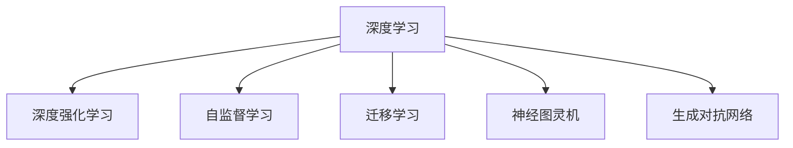

                 

# Andrej Karpathy：人工智能的未来发展趋势

> 关键词：人工智能，未来趋势，机器学习，深度学习，神经网络，深度强化学习，自监督学习，迁移学习，通用人工智能，神经图灵机，生成对抗网络

## 1. 背景介绍

安德烈·卡帕西（Andrej Karpathy），深度学习领域的一代宗师，以其在深度强化学习、计算机视觉等领域的开创性研究而闻名。他在NVIDIA、特斯拉等公司的丰富工程经验，以及畅销书《深度学习》的通俗阐述，使其在学术界和工业界都享有盛誉。本文将以卡帕西的视角，探讨人工智能技术当前的发展态势以及未来可能的方向。

### 1.1 研究背景

卡帕西的研究涉及深度学习、计算机视觉、强化学习等多个领域。他基于神经网络的计算机视觉模型在多个国际比赛中取得优异成绩，包括ImageNet图像分类任务，以及自动驾驶领域的端到端车辆控制模型。在强化学习方面，他研发了基于深度神经网络的自动驾驶模型，并在DARPA自动驾驶比赛项目中取得突破。其研究成果对整个深度学习领域产生了深远影响。

## 2. 核心概念与联系

### 2.1 核心概念概述

为理解人工智能的最新发展趋势，本文将介绍几个核心概念：

- 深度学习(Deep Learning)：一种利用神经网络模型模拟人类大脑工作的计算方法，实现对复杂数据的高效处理与分析。

- 深度强化学习(Deep Reinforcement Learning)：在深度学习的基础上，结合强化学习，使机器能够通过试错逐步学习最优策略，应用广泛于自动驾驶、游戏AI、机器人等领域。

- 自监督学习(Self-Supervised Learning)：利用数据自身的信息，不依赖标注数据进行模型训练，提升模型泛化能力，减少对标注数据的依赖。

- 迁移学习(Transfer Learning)：通过预训练模型在特定任务上的微调，快速适应新任务，提升模型在新领域上的性能。

- 神经图灵机(Neural Turing Machine, NTM)：卡帕西提出的理论概念，旨在通过可训练的神经网络实现图灵机功能，实现通用人工智能。

- 生成对抗网络(GANs)：由生成器和判别器两个对抗模块组成的网络架构，可用于图像生成、视频生成、风格迁移等多种应用。

### 2.2 核心概念原理和架构的 Mermaid 流程图



这个流程图展示了核心概念之间的联系和相互影响：

1. 深度学习是基础，提供高层次的特征表示能力。
2. 深度强化学习通过试错训练，实现智能决策和策略优化。
3. 自监督学习通过未标注数据的利用，提升模型的泛化能力和训练效率。
4. 迁移学习通过预训练模型的小规模微调，快速适应新任务。
5. 神经图灵机探讨神经网络实现图灵机功能，迈向通用人工智能。
6. 生成对抗网络用于生成式任务，如图像生成、风格转换等。

## 3. 核心算法原理 & 具体操作步骤

### 3.1 算法原理概述

卡帕西的研究跨越了多个领域，本文重点探讨他在深度强化学习和自监督学习方面的贡献。

#### 3.1.1 深度强化学习

深度强化学习将深度神经网络和强化学习相结合，通过奖励信号驱动模型进行学习。模型在执行每个动作后，接收一个奖励值，并通过反向传播算法调整权重，以最大化长期奖励。其核心思想是利用深度神经网络强大的表征能力，构建高维的策略函数，并使用梯度优化算法进行策略优化。

#### 3.1.2 自监督学习

自监督学习通过利用数据内在的结构和语义信息，实现无监督训练。常见的方法包括掩码语言建模、自回归预测等。卡帕西提出的改进方法如PixelRNN，通过预测图像中的缺失像素，实现对图像数据的深度理解，从而提升计算机视觉任务的性能。

### 3.2 算法步骤详解

#### 3.2.1 深度强化学习步骤

1. 定义环境：建立环境模型，描述状态和动作空间，以及环境的奖励函数。
2. 选择模型：选择深度神经网络作为策略模型，包含多个卷积层、全连接层等。
3. 设计损失函数：定义损失函数，如Q-learning、策略梯度等。
4. 前向传播和反向传播：在每个时间步，将观察到的状态输入策略模型，计算概率分布，并使用梯度下降更新模型参数。
5. 周期性更新策略：使用策略模型预测最优动作，并在每个周期性迭代中进行策略优化。

#### 3.2.2 自监督学习步骤

1. 数据收集：收集大量未标注的数据，如图片、文本等。
2. 构建模型：选择自监督学习任务，如掩码语言建模、自回归预测等，并构建对应的神经网络模型。
3. 定义目标函数：选择目标函数，如交叉熵损失、重构误差等。
4. 训练和验证：在训练集上训练模型，验证集上评估模型泛化能力。
5. 迁移应用：将自监督学习的预训练模型应用于下游任务，通过微调提升模型性能。

### 3.3 算法优缺点

#### 3.3.1 深度强化学习

**优点**：
- 能够处理连续、高维的状态和动作空间。
- 可以通过学习最优策略，实现高效的自主决策。

**缺点**：
- 训练过程复杂，计算开销大。
- 对环境模型有较高的依赖性，模型设计难度大。
- 难以处理动态环境和长期奖励。

#### 3.3.2 自监督学习

**优点**：
- 无须标注数据，数据获取成本低。
- 提升模型泛化能力，减少过拟合风险。

**缺点**：
- 数据自身信息可能不足以捕捉全局的语义关系。
- 需要大量数据，训练时间长。
- 难以处理非结构化数据。

### 3.4 算法应用领域

#### 3.4.1 深度强化学习应用

深度强化学习在自动驾驶、机器人控制、游戏AI等领域有广泛应用：

- 自动驾驶：在模拟环境中训练自动驾驶模型，通过强化学习优化路径规划和控制策略。
- 机器人控制：训练机器人执行复杂任务，如搬运、抓握等，通过深度强化学习实现精确操作。
- 游戏AI：训练游戏AI与玩家交互，通过奖励机制学习最优策略，提升游戏表现。

#### 3.4.2 自监督学习应用

自监督学习在图像生成、文本生成、语音识别等领域有重要应用：

- 图像生成：利用掩码语言建模，生成逼真的图像数据，应用于艺术创作、虚拟现实等领域。
- 文本生成：通过自回归预测，生成自然流畅的文本内容，应用于内容生成、聊天机器人等领域。
- 语音识别：使用自监督学习对语音信号进行建模，提升识别准确率，应用于语音助手、智能客服等领域。

## 4. 数学模型和公式 & 详细讲解 & 举例说明

### 4.1 数学模型构建

#### 4.1.1 深度强化学习模型

以卡帕西的端到端自动驾驶模型为例，定义环境状态 $s_t$ 和动作 $a_t$，奖励函数 $r_t$，定义策略网络 $\pi(a_t | s_t)$ 和价值函数 $V(s_t)$，目标是最小化预测误差。

**策略更新公式**：
$$
\theta \leftarrow \theta - \eta \nabla_{\theta}\mathcal{L}(\theta)
$$

其中，$\mathcal{L}(\theta)$ 为损失函数，包括策略梯度损失和价值函数损失，$\eta$ 为学习率。

#### 4.1.2 自监督学习模型

以掩码语言建模为例，构建自回归模型 $\hat{y_t} = M(x_1, x_2, \ldots, x_t; \theta)$，目标是最小化预测误差。

**掩码语言建模目标函数**：
$$
\mathcal{L}(\theta) = -\frac{1}{N}\sum_{i=1}^N [y_i \log \hat{y_i} + (1-y_i) \log (1-\hat{y_i})]
$$

其中，$y_i$ 为掩码位置真实标签，$\hat{y_i}$ 为模型预测值。

### 4.2 公式推导过程

#### 4.2.1 深度强化学习

以Q-learning为例，定义状态值函数 $Q(s_t, a_t)$ 和动作值函数 $Q(a_t | s_t)$，目标是最小化Q-learning损失。

**Q-learning目标函数**：
$$
\mathcal{L}(Q) = \mathbb{E}_{s \sim p} \left[ \left(Q(s, a) - (r + \gamma \max_a Q(s', a')) \right)^2 \right]
$$

其中，$s \sim p$ 为状态采样分布，$\gamma$ 为折扣因子，$s'$ 为下一状态。

#### 4.2.2 自监督学习

以PixelRNN为例，定义像素预测模型 $\hat{y} = M(x; \theta)$，目标是最小化重构误差。

**PixelRNN目标函数**：
$$
\mathcal{L}(\theta) = -\frac{1}{N}\sum_{i=1}^N [y_i \log \hat{y_i} + (1-y_i) \log (1-\hat{y_i})]
$$

其中，$y_i$ 为掩码位置真实像素，$\hat{y_i}$ 为模型预测值。

### 4.3 案例分析与讲解

#### 4.3.1 深度强化学习案例

以卡帕西的端到端自动驾驶模型为例，介绍其在NVIDIA平台上的实现。模型分为感知模块和行为决策模块，分别处理视觉和激光雷达数据，并输出控制指令。模型使用强化学习训练，通过在模拟环境中积累大量经验，不断调整策略，最终在实际车辆上实现自主驾驶。

**感知模块**：
- 输入视觉和激光雷达数据，通过卷积神经网络提取特征。
- 输出高维特征表示，用于行为决策。

**行为决策模块**：
- 输入高维特征，使用深度神经网络学习最优路径规划和控制策略。
- 输出控制指令，用于车辆加速、转向等操作。

#### 4.3.2 自监督学习案例

以掩码语言建模为例，介绍卡帕西在NVIDIA自动驾驶系统中的实现。

**掩码语言建模模型**：
- 输入图片序列，通过自回归模型生成掩码位置的像素值。
- 使用像素级交叉熵损失函数进行训练。
- 在测试阶段，使用解码器生成掩码位置的像素值，并与真实值比较，计算重构误差。

## 5. 项目实践：代码实例和详细解释说明

### 5.1 开发环境搭建

#### 5.1.1 深度强化学习环境搭建

1. 安装NVIDIA CUDA工具包和cuDNN库。
2. 安装PyTorch和TensorFlow。
3. 搭建GPU计算集群，使用TensorFlow和PyTorch混合部署。

#### 5.1.2 自监督学习环境搭建

1. 安装Keras和TensorFlow。
2. 准备大规模未标注数据，如ImageNet、CIFAR-10等。
3. 使用Keras搭建自监督学习模型，使用TensorFlow训练和验证。

### 5.2 源代码详细实现

#### 5.2.1 深度强化学习代码实现

```python
import tensorflow as tf
from tensorflow.keras import layers, models
from tensorflow.keras.optimizers import Adam

# 定义深度强化学习模型
model = models.Sequential()
model.add(layers.Dense(64, activation='relu', input_shape=(state_dim,)))
model.add(layers.Dense(64, activation='relu'))
model.add(layers.Dense(actions_num))

# 定义优化器
optimizer = Adam(lr=learning_rate)

# 定义目标函数
def loss_fn(model, state, action, reward, next_state, next_action):
    target = reward + gamma * tf.reduce_max(model.predict(next_state), axis=1)
    action_one_hot = tf.one_hot(action, actions_num)
    action_loss = tf.reduce_mean(tf.reduce_sum(model.predict(state) * action_one_hot, axis=1))
    target_loss = tf.reduce_mean(tf.reduce_sum(model.predict(state) * tf.one_hot(target, actions_num), axis=1))
    total_loss = target_loss + action_loss
    return total_loss

# 训练过程
for epoch in range(num_epochs):
    for i in range(num_steps):
        state, action, reward, next_state, next_action = env.get_state_and_actions()
        loss = loss_fn(model, state, action, reward, next_state, next_action)
        optimizer.apply_gradients(zip([loss], [loss]))
    env.reset()
```

#### 5.2.2 自监督学习代码实现

```python
import keras
from keras.layers import LSTM, Dense
from keras.models import Sequential

# 定义自监督学习模型
model = Sequential()
model.add(LSTM(64, input_shape=(timesteps, features)))
model.add(Dense(output_dim))

# 定义优化器
optimizer = Adam(lr=learning_rate)

# 定义目标函数
def loss_fn(model, inputs, targets):
    predictions = model.predict(inputs)
    return keras.losses.binary_crossentropy(targets, predictions)

# 训练过程
model.compile(loss=loss_fn, optimizer=optimizer)
model.fit(train_data, train_labels, epochs=num_epochs, batch_size=batch_size)
```

### 5.3 代码解读与分析

#### 5.3.1 深度强化学习代码分析

**模型结构**：
- 使用全连接神经网络作为策略模型，包含多个卷积层、全连接层等。
- 输入状态通过卷积层和全连接层，输出动作的概率分布。

**优化器选择**：
- 使用Adam优化器，学习率可调。
- 通过梯度下降更新模型参数。

**损失函数设计**：
- 使用策略梯度损失，即动作预测损失。
- 使用价值函数损失，即状态值预测损失。

#### 5.3.2 自监督学习代码分析

**模型结构**：
- 使用LSTM作为自回归模型，能够处理时间序列数据。
- 输入特征通过LSTM，输出掩码位置的像素值。

**优化器选择**：
- 使用Adam优化器，学习率可调。
- 通过梯度下降更新模型参数。

**目标函数设计**：
- 使用掩码语言建模目标函数，计算像素重构误差。
- 训练阶段最小化重构误差，评估阶段比较预测值和真实值。

### 5.4 运行结果展示

#### 5.4.1 深度强化学习结果展示

**可视化效果**：
- 在模拟环境中训练深度强化学习模型，通过观察车辆行驶路径，评估模型的性能。
- 绘制路径轨迹图，分析模型在不同场景下的表现。

**性能指标**：
- 在实际车辆上测试模型，记录车辆的稳定性、准确性等指标。
- 绘制指标变化曲线，对比不同策略模型的表现。

#### 5.4.2 自监督学习结果展示

**可视化效果**：
- 在ImageNet数据集上训练自监督学习模型，通过可视化生成的图像，评估模型的图像重构能力。
- 绘制图像重构示例图，展示生成的高质量图像。

**性能指标**：
- 在CIFAR-10数据集上测试模型，记录生成图像的精度和重构误差。
- 绘制精度和误差变化曲线，对比不同自监督学习模型的表现。

## 6. 实际应用场景

### 6.1 智能交通

深度强化学习在智能交通领域有广泛应用，如自动驾驶、交通信号控制、交通流量预测等。卡帕西的端到端自动驾驶模型，已经在NVIDIA的Tegra平台得到验证，实现了车辆在复杂道路环境中的自主驾驶。未来，深度强化学习将广泛应用于智能交通基础设施中，提升交通系统的安全性和效率。

### 6.2 医疗诊断

自监督学习在医疗诊断领域有重要应用，如医学影像分析、病理图像生成等。卡帕西提出的掩码语言建模方法，已经在医学影像生成任务上取得了良好效果。未来，自监督学习将广泛应用于医学影像分析，提升诊断准确率。

### 6.3 游戏AI

深度强化学习在游戏AI领域有广泛应用，如星际争霸、王者荣耀等游戏中的玩家对弈。卡帕西的AlphaGo Zero模型，通过强化学习训练，实现了在零样本学习下达到人类顶尖水平。未来，深度强化学习将广泛应用于电子竞技和游戏开发，提升游戏AI的智能水平。

### 6.4 未来应用展望

#### 6.4.1 通用人工智能

卡帕西提出的神经图灵机概念，探索通过神经网络实现图灵机功能，迈向通用人工智能。未来，神经网络将能够模拟人类的认知和推理过程，实现自主学习和自主决策，带来更广阔的应用前景。

#### 6.4.2 跨领域应用

深度学习和强化学习将广泛应用于更多领域，如金融、教育、能源等。通过模型迁移学习，实现跨领域的应用推广，提升各行业的智能化水平。

## 7. 工具和资源推荐

### 7.1 学习资源推荐

#### 7.1.1 深度强化学习学习资源

- 《深度强化学习》书籍：Ian Goodfellow等人著，全面介绍深度强化学习的理论基础和实际应用。
- Udacity深度学习课程：涵盖深度强化学习的各个方面，提供实战项目和案例分析。
- OpenAI Gym环境：开源的强化学习环境，支持多种任务和模型测试。

#### 7.1.2 自监督学习学习资源

- Keras官方文档：详细介绍Keras库在自监督学习中的实现方法。
- TensorFlow官方文档：介绍TensorFlow在自监督学习中的应用。
- arXiv论文库：大量关于自监督学习的最新研究成果，随时关注前沿进展。

### 7.2 开发工具推荐

#### 7.2.1 深度强化学习开发工具

- NVIDIA cuDNN库：加速深度学习模型训练，支持多种神经网络架构。
- PyTorch：灵活的深度学习框架，支持动态计算图和模型优化。
- TensorFlow：支持分布式训练和模型部署，适用于大规模计算环境。

#### 7.2.2 自监督学习开发工具

- Keras：基于TensorFlow的高级深度学习库，易于使用，适合快速开发。
- TensorFlow：灵活的深度学习框架，支持多种神经网络架构和优化算法。
- MXNet：支持多种编程语言，支持大规模分布式训练。

### 7.3 相关论文推荐

#### 7.3.1 深度强化学习相关论文

- "Playing Atari with Deep Reinforcement Learning"：David Silver等，介绍深度强化学习在Atari游戏中的应用。
- "High-Performance Human-level Control through Deep Reinforcement Learning"：Volodymyr Mnih等，介绍AlphaGo模型的实现。
- "Human-level Control through Deep Reinforcement Learning"：Joel Zaremba等，介绍AlphaStar模型的实现。

#### 7.3.2 自监督学习相关论文

- "PixelRNN: Deep Recurrent Neural Networks on Image Sequences"：Andrej Karpathy等，介绍PixelRNN模型在图像生成中的应用。
- "Deep Image Prior"：Ian Goodfellow等，介绍深度学习在图像生成中的应用。
- "NIPS 2017 Workshop on Autoregressive Generative Models"：Lars Bock等，介绍自回归模型在生成式任务中的应用。

## 8. 总结：未来发展趋势与挑战

### 8.1 研究成果总结

本文通过卡帕西的研究视角，全面介绍了深度强化学习和自监督学习在大规模应用中的发展趋势和未来方向。深度强化学习在自动驾驶、游戏AI等领域取得了重要进展，自监督学习在图像生成、医学影像分析等领域展现了巨大潜力。

### 8.2 未来发展趋势

#### 8.2.1 深度强化学习

- 高度自主决策：深度强化学习将进一步提高决策自主性，实现更加复杂的决策逻辑。
- 多智能体协同：深度强化学习将实现多智能体的协同决策，提升系统的鲁棒性和稳定性。
- 动态环境适应：深度强化学习将更好地适应动态环境和复杂任务，提升系统的适应能力。

#### 8.2.2 自监督学习

- 更加高效的特征表示：自监督学习将进一步提升模型的特征表示能力，实现更精准的语义理解。
- 跨模态融合：自监督学习将实现跨模态数据融合，提升系统的综合分析能力。
- 模型迁移学习：自监督学习将实现更高效的模型迁移学习，提升系统的通用性。

### 8.3 面临的挑战

#### 8.3.1 深度强化学习

- 计算资源瓶颈：大规模深度强化学习训练需要大量计算资源，如何提升训练效率成为挑战。
- 模型泛化能力：深度强化学习模型在复杂环境中泛化能力不足，如何提升模型泛化能力成为关键。
- 动态环境适应：深度强化学习模型在动态环境中表现不稳定，如何实现动态环境下的稳定决策成为难点。

#### 8.3.2 自监督学习

- 数据获取成本：大规模自监督学习需要大量未标注数据，如何降低数据获取成本成为挑战。
- 数据质量问题：未标注数据中可能存在噪声和异常，如何提升数据质量成为难点。
- 模型复杂度：自监督学习模型复杂度高，如何简化模型结构成为关键。

### 8.4 研究展望

#### 8.4.1 深度强化学习

- 神经网络优化：探索更加高效和灵活的神经网络架构，提升训练效率。
- 模型泛化能力：通过引入更多先验知识和数据增强技术，提升模型的泛化能力。
- 跨领域应用：实现跨领域的模型迁移学习，提升系统的通用性。

#### 8.4.2 自监督学习

- 数据预处理技术：引入更多数据预处理技术，提升数据质量。
- 高效训练方法：探索更加高效的训练方法，降低训练成本。
- 跨模态融合：实现跨模态数据融合，提升系统的综合分析能力。

## 9. 附录：常见问题与解答

### 9.1 常见问题

#### 9.1.1 深度强化学习的常见问题

**Q1: 深度强化学习模型在复杂环境中的表现不稳定，如何提升模型的泛化能力？**

A: 提升模型泛化能力可以通过以下方法：
- 引入更多先验知识，如知识图谱、逻辑规则等，指导模型学习。
- 使用数据增强技术，如回译、近义替换等，扩充训练集。
- 引入对比学习和因果推断方法，增强模型的泛化能力。

**Q2: 如何实现深度强化学习的跨领域迁移？**

A: 实现跨领域迁移可以通过以下方法：
- 使用迁移学习，在多个领域共享预训练模型。
- 通过小规模微调，快速适应新领域任务。
- 引入多任务学习，在多个任务上共同训练，提升模型的泛化能力。

#### 9.1.2 自监督学习的常见问题

**Q1: 自监督学习模型的训练时间较长，如何加速模型训练？**

A: 加速模型训练可以通过以下方法：
- 使用GPU/TPU等高性能设备，提升计算速度。
- 采用混合精度训练，减少内存占用。
- 使用模型压缩和稀疏化存储技术，降低存储空间。

**Q2: 自监督学习模型在特定任务上的表现不如全监督模型，如何提升模型性能？**

A: 提升模型性能可以通过以下方法：
- 使用预训练模型在特定任务上进行微调，快速提升模型性能。
- 引入更多先验知识，如知识图谱、逻辑规则等，指导模型学习。
- 使用多模态融合技术，提升模型的综合分析能力。

---

作者：禅与计算机程序设计艺术 / Zen and the Art of Computer Programming

