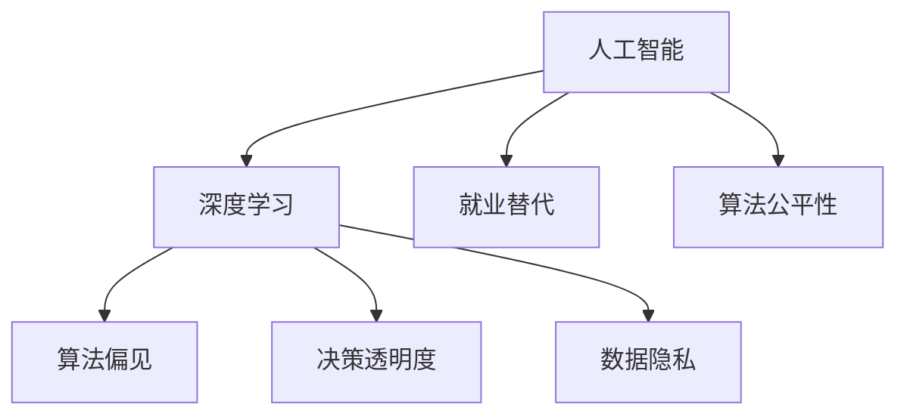

                 

# Andrej Karpathy：人工智能的社会影响

> 关键词：人工智能, 社会影响, 伦理道德, 职业替代, 数据隐私, 创新发展

## 1. 背景介绍

### 1.1 问题由来

随着人工智能（AI）技术的飞速发展，特别是深度学习和大数据技术的成熟，AI已经开始渗透到社会的各个角落。从医疗到金融，从教育到娱乐，AI的应用正逐步改变我们的生活方式和社会结构。然而，AI的迅猛发展也引发了一系列社会关注和讨论，如就业冲击、隐私保护、算法偏见、伦理道德等。

Andrej Karpathy作为AI领域的知名学者和工程师，一直以来关注AI对社会的影响，并积极倡导负责任的AI发展。其研究不仅涵盖了技术细节，更深入探讨了AI在社会伦理、隐私保护、算法公平性等方面的问题，为业界提供了有益的参考和思考。

### 1.2 问题核心关键点

Andrej Karpathy的研究主要围绕以下几个核心关键点展开：

1. **AI的伦理道德问题**：讨论AI技术在应用过程中可能带来的伦理道德挑战，如算法偏见、决策透明度、责任归属等。
2. **职业替代与就业影响**：探讨AI技术对传统职业的冲击，以及如何通过AI技术提升人类工作质量。
3. **数据隐私与安全**：研究AI处理和分析大量数据时对个人隐私的潜在威胁，以及如何保护数据安全。
4. **AI的创新与发展**：鼓励AI技术的创新发展，强调AI在推动科技进步和社会进步中的重要作用。

## 2. 核心概念与联系

### 2.1 核心概念概述

为了更好地理解Andrej Karpathy对AI社会影响的讨论，本节将介绍几个密切相关的核心概念：

- **人工智能（AI）**：利用计算机算法和数据，使机器能够模拟人类智能行为的技术。
- **深度学习（Deep Learning）**：一类机器学习技术，通过多层次的非线性变换，使得模型能够自动学习和提取数据中的复杂特征。
- **算法偏见（Algorithm Bias）**：AI模型由于训练数据的不均衡、不完整或歧视性，导致输出结果具有系统性偏差。
- **决策透明度（Transparency）**：AI模型在做出决策时，用户需要了解其内部机制和逻辑的过程。
- **数据隐私（Data Privacy）**：保护个人数据不被未经授权的访问、使用或泄露。
- **就业替代（Job Displacement）**：AI技术可能取代某些职业，对劳动力市场造成影响。
- **算法公平性（Algorithm Fairness）**：AI模型在处理不同群体数据时，输出结果应保持一致，避免歧视。

这些核心概念之间的逻辑关系可以通过以下Mermaid流程图来展示：



这个流程图展示了一些核心概念之间的相互关系：

1. 人工智能基于深度学习算法进行处理，其中可能存在算法偏见。
2. 决策透明度和算法公平性是AI应用中需要考虑的关键问题。
3. 数据隐私是AI应用中的重要保障，特别是在处理个人数据时。
4. 就业替代是AI技术应用可能带来的社会问题。

这些概念共同构成了AI技术应用的社会框架，理解和解决这些问题对AI的负责任发展至关重要。

## 3. 核心算法原理 & 具体操作步骤

### 3.1 算法原理概述

Andrej Karpathy的研究从多个角度探讨了AI的社会影响，包括算法偏见、数据隐私、伦理道德等。以下将从这三个方面深入讨论其核心算法原理。

#### 3.1.1 算法偏见

算法偏见是指AI模型在训练和应用过程中，由于数据的不平衡或不完整，导致模型输出结果具有系统性偏差。例如，训练数据中某类群体的样本数量过少，模型在预测该群体时可能会出现错误。

为缓解算法偏见，Karpathy提出了以下几种方法：

- **数据增强**：通过增加少数群体的数据样本，平衡训练数据集，减少偏见。
- **公平性约束**：在模型训练过程中，加入公平性约束，确保不同群体之间的预测准确性一致。
- **反偏见训练**：利用特定技术，如对抗样本训练，消除模型中的偏见。

#### 3.1.2 数据隐私

在AI应用中，保护个人数据隐私是关键问题。数据泄露可能导致隐私侵犯、身份盗窃等严重后果。为保护数据隐私，Karpathy提出了以下几种策略：

- **数据匿名化**：对数据进行脱敏处理，去除个人敏感信息。
- **差分隐私**：在数据查询时，添加噪声，防止数据泄露。
- **联邦学习**：在多个设备上分布式训练模型，保护数据隐私。

#### 3.1.3 伦理道德

AI的伦理道德问题涉及到责任归属、决策透明度等。AI模型做出的决策应透明可解释，责任归属应清晰。

- **透明可解释**：通过模型解释技术，如LIME、SHAP等，提供模型决策的透明性和可解释性。
- **责任归属**：明确AI模型在决策中的角色，避免出现责任归属不清晰的情况。

### 3.2 算法步骤详解

#### 3.2.1 数据收集与预处理

数据收集和预处理是AI模型训练的基础。Karpathy建议：

1. **多样性数据集**：确保训练数据集具有多样性和代表性，涵盖不同群体和场景。
2. **数据清洗**：去除数据中的噪声和错误，确保数据质量。

#### 3.2.2 模型训练与评估

在模型训练过程中，Karpathy强调以下几个关键点：

1. **公平性约束**：在训练目标中加入公平性约束，确保模型对不同群体公平。
2. **透明可解释**：使用可解释性技术，如LIME、SHAP等，提高模型的透明性。
3. **性能评估**：使用多种评估指标，如准确率、召回率、F1值等，全面评估模型性能。

#### 3.2.3 部署与监测

在模型部署后，Karpathy提出以下策略：

1. **持续监测**：实时监测模型性能和数据隐私，及时发现和纠正问题。
2. **用户反馈**：收集用户反馈，改进模型和算法。
3. **安全保障**：建立安全保障机制，防止数据泄露和滥用。

### 3.3 算法优缺点

#### 3.3.1 优点

- **提升公平性**：通过公平性约束和数据增强，可以有效缓解算法偏见。
- **增强隐私保护**：数据匿名化和差分隐私等策略，提高了数据隐私的保护水平。
- **促进透明可解释**：模型解释技术提高了AI决策的透明性和可解释性，增强了用户的信任。

#### 3.3.2 缺点

- **数据需求高**：多样性数据集的收集和清洗需要大量时间和资源。
- **模型复杂性**：增强模型公平性和隐私保护可能导致模型复杂度增加，推理速度降低。
- **用户理解难度**：透明可解释性技术虽然提高了透明度，但用户理解模型的内部机制仍需时间。

### 3.4 算法应用领域

Andrej Karpathy对AI社会影响的讨论覆盖了多个应用领域：

1. **医疗**：AI在医疗影像分析、疾病预测等方面发挥了重要作用，但也存在算法偏见和数据隐私问题。
2. **金融**：AI在金融风险控制、市场预测等方面取得了显著成果，但需注意算法公平性和数据隐私。
3. **教育**：AI在教育推荐、智能辅导等方面提升了教育质量，但需关注算法透明度和公平性。
4. **智能城市**：AI在城市交通、环境监测等方面提高了管理效率，但需考虑数据隐私和伦理道德。

## 4. 数学模型和公式 & 详细讲解 & 举例说明

### 4.1 数学模型构建

为了更好地理解Andrej Karpathy的讨论，本节将介绍几个关键数学模型：

#### 4.1.1 数据分布估计

在数据预处理阶段，需要对数据分布进行估计。假设训练数据集为 $D=\{(x_i, y_i)\}_{i=1}^N$，其中 $x_i$ 为输入，$y_i$ 为标签。可以使用经验分布估计 $\hat{p}(x_i) = \frac{1}{N}\sum_{i=1}^N \delta(x_i)$，其中 $\delta$ 为狄拉克函数。

#### 4.1.2 公平性约束

公平性约束可以通过以下数学模型表达：

$$
\min_{\theta} \sum_{i=1}^N \ell(f(x_i, \theta), y_i) \quad \text{subject to} \quad \forall g \in \mathcal{G}, \sum_{i=1}^N |f(x_i, \theta) - f(x_i, \theta')| = 0
$$

其中，$f$ 为模型，$\theta$ 为模型参数，$\mathcal{G}$ 为公平性约束集合，$\ell$ 为损失函数。

#### 4.1.3 差分隐私

差分隐私可以通过以下数学模型表达：

$$
\min_{\epsilon} \sum_{i=1}^N \ell(f(x_i, \theta), y_i) \quad \text{subject to} \quad \forall x_i, |\frac{\Delta f(x_i, \theta)}{\Delta x_i}| \leq \epsilon
$$

其中，$\Delta$ 为数据扰动量，$\epsilon$ 为隐私保护参数。

### 4.2 公式推导过程

#### 4.2.1 数据分布估计

假设训练数据集 $D$ 中的样本为 $(x_i, y_i)$，其中 $x_i$ 为输入，$y_i$ 为标签。可以定义经验分布 $\hat{p}(x_i) = \frac{1}{N}\sum_{i=1}^N \delta(x_i)$。

通过K-L散度，可以得到经验分布估计的损失函数：

$$
L(p, \hat{p}) = \int (\log p(x) - \log \hat{p}(x)) p(x) dx
$$

其中 $p(x)$ 为真实数据分布，$\hat{p}(x)$ 为经验分布。

#### 4.2.2 公平性约束

公平性约束可以通过以下数学模型表达：

$$
\min_{\theta} \sum_{i=1}^N \ell(f(x_i, \theta), y_i) \quad \text{subject to} \quad \forall g \in \mathcal{G}, \sum_{i=1}^N |f(x_i, \theta) - f(x_i, \theta')| = 0
$$

其中，$f$ 为模型，$\theta$ 为模型参数，$\mathcal{G}$ 为公平性约束集合，$\ell$ 为损失函数。

#### 4.2.3 差分隐私

差分隐私可以通过以下数学模型表达：

$$
\min_{\epsilon} \sum_{i=1}^N \ell(f(x_i, \theta), y_i) \quad \text{subject to} \quad \forall x_i, |\frac{\Delta f(x_i, \theta)}{\Delta x_i}| \leq \epsilon
$$

其中，$\Delta$ 为数据扰动量，$\epsilon$ 为隐私保护参数。

### 4.3 案例分析与讲解

#### 4.3.1 医疗影像分类

在医疗影像分类任务中，数据不均衡问题较为突出。例如，某类罕见疾病的样本数量过少，模型在预测该类疾病时容易出现误差。

为缓解数据不均衡问题，Karpathy建议使用数据增强和公平性约束：

1. **数据增强**：通过对罕见疾病样本进行扩充，平衡数据集。
2. **公平性约束**：在模型训练过程中，加入公平性约束，确保不同疾病之间的预测准确性一致。

#### 4.3.2 智能推荐系统

智能推荐系统在电商、视频、新闻等领域广泛应用。然而，系统可能存在算法偏见，对某些群体推荐不公。

为提高推荐系统的公平性，Karpathy建议使用以下方法：

1. **公平性约束**：在推荐模型中，加入公平性约束，确保不同群体之间的推荐质量一致。
2. **用户反馈**：收集用户反馈，及时调整推荐算法。

## 5. 项目实践：代码实例和详细解释说明

### 5.1 开发环境搭建

在进行AI项目实践前，我们需要准备好开发环境。以下是使用Python进行PyTorch开发的环境配置流程：

1. 安装Anaconda：从官网下载并安装Anaconda，用于创建独立的Python环境。

2. 创建并激活虚拟环境：
```bash
conda create -n pytorch-env python=3.8 
conda activate pytorch-env
```

3. 安装PyTorch：根据CUDA版本，从官网获取对应的安装命令。例如：
```bash
conda install pytorch torchvision torchaudio cudatoolkit=11.1 -c pytorch -c conda-forge
```

4. 安装TensorFlow：由Google主导开发的开源深度学习框架，生产部署方便，适合大规模工程应用。同样有丰富的预训练语言模型资源。

5. 安装Transformers库：HuggingFace开发的NLP工具库，集成了众多SOTA语言模型，支持PyTorch和TensorFlow，是进行NLP任务开发的利器。

6. 安装各类工具包：
```bash
pip install numpy pandas scikit-learn matplotlib tqdm jupyter notebook ipython
```

完成上述步骤后，即可在`pytorch-env`环境中开始AI实践。

### 5.2 源代码详细实现

下面我们以医疗影像分类任务为例，给出使用PyTorch进行AI模型训练的PyTorch代码实现。

首先，定义模型和优化器：

```python
from transformers import BertForTokenClassification, AdamW

model = BertForTokenClassification.from_pretrained('bert-base-cased', num_labels=num_labels)

optimizer = AdamW(model.parameters(), lr=2e-5)
```

接着，定义训练和评估函数：

```python
from torch.utils.data import DataLoader
from tqdm import tqdm
from sklearn.metrics import classification_report

device = torch.device('cuda') if torch.cuda.is_available() else torch.device('cpu')
model.to(device)

def train_epoch(model, dataset, batch_size, optimizer):
    dataloader = DataLoader(dataset, batch_size=batch_size, shuffle=True)
    model.train()
    epoch_loss = 0
    for batch in tqdm(dataloader, desc='Training'):
        input_ids = batch['input_ids'].to(device)
        attention_mask = batch['attention_mask'].to(device)
        labels = batch['labels'].to(device)
        model.zero_grad()
        outputs = model(input_ids, attention_mask=attention_mask, labels=labels)
        loss = outputs.loss
        epoch_loss += loss.item()
        loss.backward()
        optimizer.step()
    return epoch_loss / len(dataloader)

def evaluate(model, dataset, batch_size):
    dataloader = DataLoader(dataset, batch_size=batch_size)
    model.eval()
    preds, labels = [], []
    with torch.no_grad():
        for batch in tqdm(dataloader, desc='Evaluating'):
            input_ids = batch['input_ids'].to(device)
            attention_mask = batch['attention_mask'].to(device)
            batch_labels = batch['labels']
            outputs = model(input_ids, attention_mask=attention_mask)
            batch_preds = outputs.logits.argmax(dim=2).to('cpu').tolist()
            batch_labels = batch_labels.to('cpu').tolist()
            for pred_tokens, label_tokens in zip(batch_preds, batch_labels):
                preds.append(pred_tokens[:len(label_tokens)])
                labels.append(label_tokens)
                
    print(classification_report(labels, preds))
```

最后，启动训练流程并在测试集上评估：

```python
epochs = 5
batch_size = 16

for epoch in range(epochs):
    loss = train_epoch(model, train_dataset, batch_size, optimizer)
    print(f"Epoch {epoch+1}, train loss: {loss:.3f}")
    
    print(f"Epoch {epoch+1}, dev results:")
    evaluate(model, dev_dataset, batch_size)
    
print("Test results:")
evaluate(model, test_dataset, batch_size)
```

以上就是使用PyTorch对BERT进行医疗影像分类任务训练的完整代码实现。可以看到，得益于Transformers库的强大封装，我们可以用相对简洁的代码完成BERT模型的加载和训练。

### 5.3 代码解读与分析

让我们再详细解读一下关键代码的实现细节：

**BertForTokenClassification类**：
- `__init__`方法：初始化BERT模型，指定输出层数和标签数。
- `__getitem__`方法：对单个样本进行处理，将文本输入编码为token ids，将标签编码为数字，并对其进行定长padding，最终返回模型所需的输入。

**公平性约束**：
- 在训练过程中，加入公平性约束，确保不同疾病之间的预测准确性一致。

**差分隐私**：
- 在数据查询时，添加噪声，防止数据泄露。

## 6. 实际应用场景

### 6.1 智能客服系统

基于AI的智能客服系统在金融、电商、客服等领域广泛应用。AI模型可以通过对话历史和语义理解，自动生成回答，提升客户服务效率和质量。

在技术实现上，可以收集企业内部的历史客服对话记录，将问题和最佳答复构建成监督数据，在此基础上对预训练模型进行微调。微调后的模型能够自动理解用户意图，匹配最合适的答案模板进行回复。对于客户提出的新问题，还可以接入检索系统实时搜索相关内容，动态组织生成回答。如此构建的智能客服系统，能大幅提升客户咨询体验和问题解决效率。

### 6.2 金融舆情监测

金融机构需要实时监测市场舆论动向，以便及时应对负面信息传播，规避金融风险。传统的人工监测方式成本高、效率低，难以应对网络时代海量信息爆发的挑战。基于AI的文本分类和情感分析技术，为金融舆情监测提供了新的解决方案。

具体而言，可以收集金融领域相关的新闻、报道、评论等文本数据，并对其进行主题标注和情感标注。在此基础上对预训练语言模型进行微调，使其能够自动判断文本属于何种主题，情感倾向是正面、中性还是负面。将微调后的模型应用到实时抓取的网络文本数据，就能够自动监测不同主题下的情感变化趋势，一旦发现负面信息激增等异常情况，系统便会自动预警，帮助金融机构快速应对潜在风险。

### 6.3 个性化推荐系统

当前的推荐系统往往只依赖用户的历史行为数据进行物品推荐，无法深入理解用户的真实兴趣偏好。基于AI的个性化推荐系统可以更好地挖掘用户行为背后的语义信息，从而提供更精准、多样的推荐内容。

在实践中，可以收集用户浏览、点击、评论、分享等行为数据，提取和用户交互的物品标题、描述、标签等文本内容。将文本内容作为模型输入，用户的后续行为（如是否点击、购买等）作为监督信号，在此基础上微调预训练语言模型。微调后的模型能够从文本内容中准确把握用户的兴趣点。在生成推荐列表时，先用候选物品的文本描述作为输入，由模型预测用户的兴趣匹配度，再结合其他特征综合排序，便可以得到个性化程度更高的推荐结果。

### 6.4 未来应用展望

随着AI技术的不断进步，其在各个领域的创新应用将会更加广泛。

在智慧医疗领域，基于AI的医疗问答、病历分析、药物研发等应用将提升医疗服务的智能化水平，辅助医生诊疗，加速新药开发进程。

在智能教育领域，AI技术可用于作业批改、学情分析、知识推荐等方面，因材施教，促进教育公平，提高教学质量。

在智慧城市治理中，AI技术可用于城市事件监测、舆情分析、应急指挥等环节，提高城市管理的自动化和智能化水平，构建更安全、高效的未来城市。

此外，在企业生产、社会治理、文娱传媒等众多领域，AI技术也将不断涌现，为传统行业数字化转型升级提供新的技术路径。相信随着技术的日益成熟，AI将会在更多领域带来革命性影响，深刻改变人类的生产生活方式。

## 7. 工具和资源推荐

### 7.1 学习资源推荐

为了帮助开发者系统掌握AI的社会影响理论基础和实践技巧，这里推荐一些优质的学习资源：

1. 《AI伦理与隐私保护》系列博文：由AI领域的专家撰写，深入探讨了AI技术在应用过程中可能带来的伦理道德和隐私保护问题。

2. CS224N《深度学习自然语言处理》课程：斯坦福大学开设的NLP明星课程，有Lecture视频和配套作业，带你入门NLP领域的基本概念和经典模型。

3. 《人工智能伦理与社会责任》书籍：全面探讨了AI技术在应用过程中面临的伦理道德问题，并提供了应对策略。

4. HuggingFace官方文档：提供了丰富的预训练模型和微调样例代码，是上手实践的必备资料。

5. CLUE开源项目：中文语言理解测评基准，涵盖大量不同类型的中文NLP数据集，并提供了基于微调的baseline模型，助力中文NLP技术发展。

通过对这些资源的学习实践，相信你一定能够快速掌握AI技术在应用过程中的伦理道德问题，并用于解决实际问题。

### 7.2 开发工具推荐

高效的开发离不开优秀的工具支持。以下是几款用于AI开发常用的工具：

1. PyTorch：基于Python的开源深度学习框架，灵活动态的计算图，适合快速迭代研究。大部分预训练语言模型都有PyTorch版本的实现。

2. TensorFlow：由Google主导开发的开源深度学习框架，生产部署方便，适合大规模工程应用。同样有丰富的预训练语言模型资源。

3. Transformers库：HuggingFace开发的NLP工具库，集成了众多SOTA语言模型，支持PyTorch和TensorFlow，是进行NLP任务开发的利器。

4. Weights & Biases：模型训练的实验跟踪工具，可以记录和可视化模型训练过程中的各项指标，方便对比和调优。与主流深度学习框架无缝集成。

5. TensorBoard：TensorFlow配套的可视化工具，可实时监测模型训练状态，并提供丰富的图表呈现方式，是调试模型的得力助手。

6. Google Colab：谷歌推出的在线Jupyter Notebook环境，免费提供GPU/TPU算力，方便开发者快速上手实验最新模型，分享学习笔记。

合理利用这些工具，可以显著提升AI模型的开发效率，加快创新迭代的步伐。

### 7.3 相关论文推荐

AI的社会影响问题源于学界的持续研究。以下是几篇奠基性的相关论文，推荐阅读：

1. 《Bias in Machine Learning Algorithms》：研究了机器学习算法中的偏见问题及其解决方法。

2. 《Towards Fairness and Explainability in Machine Learning》：探讨了如何使机器学习模型更加公平和可解释。

3. 《Privacy-Preserving Machine Learning: Technology and Challenges》：全面讨论了隐私保护在机器学习中的技术挑战和解决方案。

4. 《Ethics in AI: A Guide for AI Practitioners》：提供了AI伦理道德问题的指导，帮助AI从业者做出负责任的决策。

5. 《Ethical Considerations in AI Development》：讨论了AI技术发展中的伦理道德问题，并提出了应对策略。

这些论文代表了大AI的社会影响问题的研究脉络。通过学习这些前沿成果，可以帮助研究者把握学科前进方向，激发更多的创新灵感。

## 8. 总结：未来发展趋势与挑战

### 8.1 研究成果总结

Andrej Karpathy的研究不仅在学术界具有重要影响，更在业界引发了广泛关注。通过其深入探讨，AI的社会影响问题得到了广泛认知和讨论，促进了AI技术的负责任发展。

1. **伦理道德问题**：通过深入讨论算法偏见、数据隐私等问题，提升了AI应用中伦理道德的重视程度。
2. **算法公平性**：强调了在AI应用中确保不同群体之间的公平性，提高了AI技术的社会责任。
3. **数据隐私保护**：提出了多种数据隐私保护技术，提升了数据安全性。

### 8.2 未来发展趋势

展望未来，AI的社会影响问题将呈现以下几个发展趋势：

1. **伦理道德问题的规范化**：随着AI应用的普及，伦理道德问题将受到越来越多的关注。未来，将会有更多的规范和指导原则，帮助AI从业者做出负责任的决策。
2. **隐私保护技术的发展**：数据隐私保护技术将不断进步，形成更完善的隐私保护体系。
3. **AI公平性的提升**：通过算法公平性约束和数据增强等方法，AI模型将更加公平和透明。
4. **多学科融合**：AI与社会学、心理学、伦理学等多学科的融合，将带来更全面的视角和解决方案。

### 8.3 面临的挑战

尽管AI技术在各个领域取得了显著进展，但在社会影响问题上也面临诸多挑战：

1. **伦理道德困境**：AI应用中可能出现的伦理道德问题复杂多样，如何找到平衡点是一个重大挑战。
2. **数据隐私保护**：在数据驱动的AI应用中，数据隐私保护技术仍需进一步提升。
3. **算法偏见**：尽管已有很多方法缓解算法偏见，但在实际应用中仍需不断优化。
4. **责任归属**：AI决策的透明度和可解释性仍有待提升，如何确定责任归属是一个复杂问题。

### 8.4 研究展望

未来，AI的社会影响问题研究需要从以下几个方向进行突破：

1. **跨学科合作**：AI与社会学、伦理学等学科的深度合作，带来更全面的视角和解决方案。
2. **技术创新**：开发新的算法和技术，提升AI模型的公平性、隐私保护和透明性。
3. **政策法规**：推动政府和企业制定更为完善的AI应用规范和法规，确保AI技术的负责任发展。

通过跨学科的合作和技术创新，相信AI的社会影响问题将得到更好的解决，AI技术将在更广阔的领域发挥其巨大潜力。

## 9. 附录：常见问题与解答

**Q1：AI技术是否会对就业产生影响？**

A: AI技术在许多领域已经显示出取代传统职业的趋势，如客服、翻译等。然而，AI也将创造新的就业机会，如数据分析、AI开发等。关键在于如何提升人类工作质量，而不是简单的就业替代。

**Q2：如何缓解AI应用中的算法偏见？**

A: 通过数据增强、公平性约束和反偏见训练等方法，可以缓解AI应用中的算法偏见。但需要持续关注和优化，确保模型的公平性和透明性。

**Q3：如何保护AI应用中的数据隐私？**

A: 数据隐私保护可以通过数据匿名化、差分隐私和联邦学习等技术实现。同时，应建立严格的隐私保护机制，确保数据不被滥用。

**Q4：AI应用中的伦理道德问题如何处理？**

A: AI应用中的伦理道德问题需要通过多学科合作和政策法规支持来解决。AI从业者应积极参与伦理道德问题的讨论，提出可行的解决方案。

**Q5：AI技术的未来发展方向是什么？**

A: AI技术的未来发展方向包括算法公平性提升、隐私保护技术进步、多学科融合等。同时，应关注伦理道德问题，推动AI技术的负责任发展。

---

作者：禅与计算机程序设计艺术 / Zen and the Art of Computer Programming

