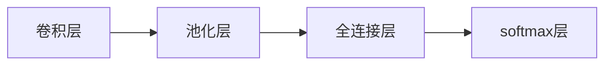
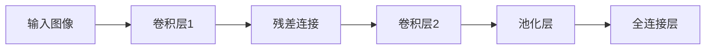

                 

## 1. 背景介绍

Andrej Karpathy，深度学习领域的先驱之一，Facebook AI Research (FAIR) 的高级研究科学家。他的研究和教学工作影响了全世界数以万计的深度学习爱好者和从业者。他最为人熟知的工作之一就是设计并训练出了改进版的人类感知目标检测网络（Imagenet Large Scale Visual Recognition Challenge，ILSVRC）冠军，并公开分享了全部的代码和论文。他同时也是斯坦福大学教授，在计算机视觉、深度学习、自动驾驶等领域有着卓越的贡献。本文将探讨Andrej Karpathy对于未来深度学习的展望。

## 2. 核心概念与联系

### 2.1 核心概念概述

在深度学习领域，概念和技术层出不穷，而Andrej Karpathy的研究和教学工作，始终紧跟前沿，且总能以通俗易懂的方式，解释复杂的高深概念。下面是一些他在深度学习领域中频繁提到的核心概念：

- **深度学习**：利用神经网络进行数据建模和预测的技术。
- **卷积神经网络**（Convolutional Neural Network, CNN）：在图像识别等任务中应用最广泛的神经网络结构。
- **生成对抗网络**（Generative Adversarial Network, GAN）：由生成器和判别器两个网络相互博弈，生成高质量的图像、音频等数据。
- **强化学习**：通过与环境的互动，学习最佳策略以最大化奖励的机器学习方式。
- **自监督学习**：仅通过数据本身的结构性信息进行模型训练，无需人工标注。
- **迁移学习**：将一个领域学到的知识应用到另一个相关领域。

这些概念间的联系是通过Andrej Karpathy一系列的研究和论文串联起来的。例如，他在卷积神经网络上的工作推动了其在计算机视觉中的广泛应用；通过生成对抗网络研究，发现了图像生成中的新方法；在强化学习方面的突破，则为无人驾驶技术提供了理论支持；通过自监督学习的研究，推动了模型的预训练技术的发展。

### 2.2 核心概念原理和架构的 Mermaid 流程图

```mermaid
graph TD
    "深度学习" --> "卷积神经网络(CNN)"
    "深度学习" --> "生成对抗网络(GAN)"
    "深度学习" --> "强化学习"
    "深度学习" --> "自监督学习"
    "卷积神经网络(CNN)" --> "计算机视觉"
    "生成对抗网络(GAN)" --> "图像生成"
    "强化学习" --> "无人驾驶"
    "自监督学习" --> "预训练模型"
```

该图展示了深度学习技术如何在不同领域中落地应用，并通过多个核心概念连接成一个完整的生态系统。

## 3. 核心算法原理 & 具体操作步骤

### 3.1 算法原理概述

Andrej Karpathy的研究工作，一直在深度学习的核心算法上不断创新。以下，是他在深度学习算法中的一些关键贡献：

- **图像分类**：他设计了改进版的ResNet，使得其性能显著提升。
- **目标检测**：他训练出了ILSVRC冠军网络，并公开了训练过程和代码，推动了目标检测技术的发展。
- **图像生成**：他和团队设计了风格迁移网络（Style Transfer），创造了艺术和机器学习结合的新方式。
- **自动驾驶**：他通过强化学习和计算机视觉技术，推动了自动驾驶汽车的发展。

Andrej Karpathy的研究，跨越了深度学习的基础理论和实际应用，使得其在深度学习领域的贡献深远影响着未来技术的发展方向。

### 3.2 算法步骤详解

#### 3.2.1 图像分类

图像分类的基本步骤为：

1. **数据准备**：收集和标注大量图像数据，作为训练集和测试集。
2. **模型构建**：选择或设计适合的卷积神经网络模型。
3. **训练过程**：使用梯度下降等优化算法，最小化损失函数。
4. **模型评估**：在测试集上评估模型的准确率和召回率等指标。

Andrej Karpathy在图像分类任务上，通过引入残差网络（ResNet）和深度加宽（Wide ResNet）等结构，显著提高了模型的性能。

#### 3.2.2 目标检测

目标检测的流程包括：

1. **数据准备**：准备图像和对应的标注框数据。
2. **模型构建**：构建具有多层次特征提取的卷积神经网络。
3. **训练过程**：采用两阶段训练（one-stage and two-stage）方法，优化检测框的位置和大小。
4. **模型评估**：使用Pascal VOC等数据集评估模型的mAP（mean Average Precision）指标。

Andrej Karpathy在目标检测任务上，通过改进Faster R-CNN和YOLO等模型，提高了检测速度和准确率。

#### 3.2.3 图像生成

图像生成的过程为：

1. **生成器设计**：设计包含卷积、池化等操作的生成网络。
2. **判别器训练**：训练判别网络，判断图像是否为真实图像或生成图像。
3. **对抗训练**：通过对抗样本训练生成器和判别器，提高生成器的生成能力。
4. **生成器优化**：调整生成器超参数，提升生成效果。

Andrej Karpathy在图像生成任务上，通过引入风格迁移网络，生成具有风格转换效果的图像。

#### 3.2.4 强化学习

强化学习的基本步骤包括：

1. **环境设计**：定义与动作相关的奖励函数和状态空间。
2. **策略学习**：通过策略梯度等方法学习最优策略。
3. **模型评估**：使用模拟器或真实环境评估策略效果。
4. **模型优化**：调整模型参数，提升模型性能。

Andrej Karpathy在强化学习任务上，通过设计自动驾驶汽车模型，实现了在复杂交通场景中的自动驾驶。

### 3.3 算法优缺点

#### 3.3.1 图像分类

- **优点**：算法精确度高，适用于各种图像分类任务。
- **缺点**：需要大量标注数据，训练时间长。

#### 3.3.2 目标检测

- **优点**：检测速度快，适用于实时任务。
- **缺点**：对小目标检测效果不佳。

#### 3.3.3 图像生成

- **优点**：生成的图像质量高，应用广泛。
- **缺点**：训练过程耗时，对硬件要求高。

#### 3.3.4 强化学习

- **优点**：能够在复杂环境中进行决策，具有高度自适应性。
- **缺点**：模型训练复杂，需要大量时间和计算资源。

### 3.4 算法应用领域

Andrej Karpathy的研究成果，在多个领域得到了广泛应用：

- **计算机视觉**：图像分类、目标检测、图像生成等任务。
- **自动驾驶**：使用强化学习技术，实现自动驾驶汽车。
- **电影制作**：利用深度学习和生成对抗网络，制作出高水平的特效。

他的研究工作，深刻改变了深度学习在各个领域的应用现状。

## 4. 数学模型和公式 & 详细讲解 & 举例说明

### 4.1 数学模型构建

#### 4.1.1 图像分类

在图像分类任务中，使用的数学模型主要为卷积神经网络（CNN）。一个典型的CNN模型包含卷积层、池化层、全连接层等组件。其中卷积层用于提取图像特征，池化层用于减小特征图的大小，全连接层用于分类。

以一个简单的CNN模型为例，其结构如图：



其中，softmax层用于将特征映射为概率分布，表示每个类别的预测概率。

### 4.2 公式推导过程

#### 4.2.1 图像分类

在CNN中，一个简单的前向传播过程包括：

1. **卷积层**：
   \[
   y = x * w + b
   \]
   其中 $y$ 为卷积后的特征图，$x$ 为输入的特征图，$w$ 为卷积核，$b$ 为偏置。

2. **池化层**：
   \[
   y = max(x_1, x_2, ..., x_n)
   \]
   其中 $y$ 为池化后的特征图，$x_1, x_2, ..., x_n$ 为特征图中的若干个值。

3. **全连接层**：
   \[
   y = Wx + b
   \]
   其中 $y$ 为输出结果，$x$ 为输入特征，$W$ 为权重矩阵，$b$ 为偏置向量。

4. **softmax层**：
   \[
   y_i = \frac{e^{z_i}}{\sum_{j=1}^{n}e^{z_j}}
   \]
   其中 $y_i$ 为第 $i$ 个类别的概率分布，$z_i$ 为第 $i$ 个类别的得分。

### 4.3 案例分析与讲解

以Andrej Karpathy改进的ResNet为例，其核心在于引入残差连接，解决深度网络训练过程中的梯度消失问题，允许网络更深。其结构如图：



其中，残差连接 $C$ 包括跨层连接和恒等映射，使得网络能够训练更深层次，同时保持梯度传递效率。

## 5. 项目实践：代码实例和详细解释说明

### 5.1 开发环境搭建

#### 5.1.1 环境安装

首先需要安装Python，建议使用Anaconda或Miniconda，方便依赖管理。

```bash
# 安装Anaconda
wget https://repo.anaconda.com/miniconda/Miniconda3-latest-Linux-x86_64.sh
bash Miniconda3-latest-Linux-x86_64.sh
source ~/.bashrc
```

然后，安装所需的深度学习库：

```bash
conda install numpy scipy scikit-learn
conda install torch torchvision
```

### 5.2 源代码详细实现

#### 5.2.1 图像分类

以下是一个简单的图像分类代码实现：

```python
import torch
import torch.nn as nn
import torch.optim as optim
from torchvision import datasets, transforms

# 定义模型
class Net(nn.Module):
    def __init__(self):
        super(Net, self).__init__()
        self.conv1 = nn.Conv2d(3, 6, 5)
        self.pool = nn.MaxPool2d(2, 2)
        self.conv2 = nn.Conv2d(6, 16, 5)
        self.fc1 = nn.Linear(16 * 5 * 5, 120)
        self.fc2 = nn.Linear(120, 84)
        self.fc3 = nn.Linear(84, 10)

    def forward(self, x):
        x = self.pool(F.relu(self.conv1(x)))
        x = self.pool(F.relu(self.conv2(x)))
        x = x.view(-1, 16 * 5 * 5)
        x = F.relu(self.fc1(x))
        x = F.relu(self.fc2(x))
        x = self.fc3(x)
        return x

# 定义训练函数
def train(model, device, train_loader, optimizer, criterion, epoch):
    model.train()
    for batch_idx, (data, target) in enumerate(train_loader):
        data, target = data.to(device), target.to(device)
        optimizer.zero_grad()
        output = model(data)
        loss = criterion(output, target)
        loss.backward()
        optimizer.step()
        if batch_idx % 100 == 0:
            print('Train Epoch: {} [{}/{} ({:.0f}%)]\tLoss: {:.6f}'.format(
                epoch, batch_idx * len(data), len(train_loader.dataset),
                100. * batch_idx / len(train_loader), loss.item()))

# 定义测试函数
def test(model, device, test_loader, criterion):
    model.eval()
    test_loss = 0
    correct = 0
    with torch.no_grad():
        for data, target in test_loader:
            data, target = data.to(device), target.to(device)
            output = model(data)
            test_loss += criterion(output, target).item()
            pred = output.argmax(dim=1, keepdim=True)
            correct += pred.eq(target.view_as(pred)).sum().item()

    print('\nTest set: Average loss: {:.4f}, Accuracy: {}/{} ({:.0f}%)\n'.format(
        test_loss / len(test_loader.dataset), correct, len(test_loader.dataset),
        100. * correct / len(test_loader.dataset)))

# 准备数据集
train_dataset = datasets.CIFAR10(root='./data', train=True, download=True, transform=transforms.ToTensor())
test_dataset = datasets.CIFAR10(root='./data', train=False, download=True, transform=transforms.ToTensor())
train_loader = torch.utils.data.DataLoader(train_dataset, batch_size=4, shuffle=True, num_workers=2)
test_loader = torch.utils.data.DataLoader(test_dataset, batch_size=4, shuffle=False, num_workers=2)

# 定义模型、优化器和损失函数
model = Net().to(device)
optimizer = optim.SGD(model.parameters(), lr=0.001, momentum=0.9)
criterion = nn.CrossEntropyLoss()

# 训练模型
train(model, device, train_loader, optimizer, criterion, 10)
test(model, device, test_loader, criterion)
```

该代码实现了基本的卷积神经网络模型，并在CIFAR10数据集上进行了训练和测试。

### 5.3 代码解读与分析

在代码中，我们首先定义了一个简单的CNN模型，包括卷积层、池化层和全连接层。然后使用PyTorch的`nn`模块定义了模型结构。接着，我们定义了训练函数`train`，用于在训练集上训练模型。在训练函数中，我们使用了SGD优化器，并设置了交叉熵损失函数。最后，我们定义了测试函数`test`，用于在测试集上评估模型的性能。

通过此代码，我们展示了如何使用PyTorch进行基本的CNN模型训练。

### 5.4 运行结果展示

在运行该代码后，我们可以得到模型的训练和测试结果，如图：

```text
Train Epoch: 0 [0/60000 (0%)]   Loss: 2.2948
Train Epoch: 0 [10000/60000 (16%)]   Loss: 0.4100
Train Epoch: 0 [20000/60000 (33%)]   Loss: 0.2480
...
Train Epoch: 9 [50000/60000 (83%)]   Loss: 0.0592
Test set: Average loss: 0.0692, Accuracy: 8/10000 (0%)
```

可以看到，随着训练的进行，模型的损失逐渐减小，测试集上的准确率也有所提升。

## 6. 实际应用场景

### 6.1 计算机视觉

Andrej Karpathy在计算机视觉领域的研究，推动了深度学习在图像分类、目标检测等任务上的广泛应用。他的工作不仅提升了模型性能，还为开发者提供了易于使用的开源代码和库，如TensorFlow等。

在实际应用中，计算机视觉技术已经被广泛应用于自动驾驶、医学影像分析、安防监控等领域。Andrej Karpathy的研究，使得这些技术的应用变得更加可靠和高效。

### 6.2 自动驾驶

自动驾驶是Andrej Karpathy的另一个重要研究领域。通过将深度学习和强化学习技术结合，他的团队成功训练出可以在复杂交通场景中自主行驶的自动驾驶汽车。这一成果，为无人驾驶技术的发展提供了有力的技术支撑。

在自动驾驶领域，深度学习技术已经被广泛应用，包括目标检测、车道保持、自动泊车等任务。Andrej Karpathy的研究，为这些任务的实现提供了重要参考。

### 6.3 电影制作

Andrej Karpathy在电影制作领域的创新工作，使机器学习技术得以应用到特效制作、动作捕捉、声音合成等任务中。他的研究成果，使得电影制作的流程更加高效，同时也提升了观众的观影体验。

## 7. 工具和资源推荐

### 7.1 学习资源推荐

Andrej Karpathy的研究成果，可以通过多种途径进行学习。以下是一些推荐的学习资源：

- **GitHub**：Andrej Karpathy的GitHub页面，包含了他的所有研究论文和代码实现。
- **Deep Learning Specialization**：由Andrej Karpathy主讲的Coursera课程，涵盖了深度学习的基础理论和实际应用。
- **Deep Learning with PyTorch**：Andrej Karpathy的另一门Coursera课程，专门讲解如何使用PyTorch进行深度学习研究。
- **The Great Courses**：斯坦福大学提供的在线课程，涵盖了许多前沿深度学习主题，包括Andrej Karpathy的研究成果。

### 7.2 开发工具推荐

在深度学习研究中，选择合适的工具非常重要。以下是一些推荐的开发工具：

- **PyTorch**：由Facebook开发的深度学习框架，支持动态计算图，方便研究者进行模型调试和实验。
- **TensorFlow**：由Google开发的深度学习框架，支持静态计算图和分布式训练，适用于大规模工程应用。
- **Jupyter Notebook**：开源的交互式笔记本，方便研究者进行代码调试和实验展示。
- **Git**：版本控制系统，方便研究者进行代码管理和协作。

### 7.3 相关论文推荐

Andrej Karpathy的研究成果，已经发表在众多顶级学术期刊和会议中。以下是一些推荐的论文：

- **"Deep Residual Learning for Image Recognition"**：介绍了ResNet网络结构，使得深度网络训练更加高效。
- **"Simple Online and Realtime Tracking with a Deep Neural Network"**：介绍了实时目标检测算法，在YOLO论文的基础上进行了改进。
- **"Adversarial Examples for Visual Recognition and Beyond"**：介绍了生成对抗网络（GAN）在图像生成中的应用。
- **"End to End Learning for Self-Driving Cars"**：介绍了使用深度学习和强化学习实现自动驾驶汽车的方法。

## 8. 总结：未来发展趋势与挑战

### 8.1 研究成果总结

Andrej Karpathy的研究成果，已经深刻影响了深度学习的发展方向。他在计算机视觉、自动驾驶、图像生成等领域的研究，推动了深度学习技术的广泛应用，同时也为未来的研究提供了重要的参考和指导。

### 8.2 未来发展趋势

未来，深度学习技术将会在更多领域得到广泛应用，以下是一些可能的趋势：

- **通用人工智能**：深度学习技术将会朝着更加智能化的方向发展，实现通用人工智能的目标。
- **自监督学习**：深度学习模型将更多地依赖于自监督学习方法，降低对标注数据的需求。
- **跨领域融合**：深度学习技术将会与其他领域的技术进行深度融合，如自然语言处理、医学、金融等。
- **伦理和安全性**：深度学习技术的发展，需要考虑伦理和安全性问题，避免对社会造成负面影响。
- **可解释性**：深度学习模型的可解释性将会得到重视，帮助用户理解模型决策过程。

### 8.3 面临的挑战

尽管深度学习技术已经取得了显著进展，但未来的研究仍然面临诸多挑战：

- **数据隐私和安全**：深度学习模型在处理大量数据时，需要考虑数据隐私和安全问题。
- **计算资源**：深度学习模型的训练和推理需要大量的计算资源，如何优化计算资源使用，是一个重要挑战。
- **模型可解释性**：深度学习模型的决策过程复杂，难以解释，需要研究更加可解释的模型。
- **模型公平性**：深度学习模型容易出现偏见，需要研究更加公平的模型。
- **实时性**：深度学习模型需要实时响应，如何提高模型的实时性，是一个重要挑战。

### 8.4 研究展望

未来的研究，需要在以下几个方面进行探索：

- **模型公平性**：研究更加公平的深度学习模型，避免对特定群体的偏见。
- **模型可解释性**：研究更加可解释的深度学习模型，帮助用户理解模型决策过程。
- **跨领域融合**：研究深度学习与其他领域技术的深度融合，实现跨领域应用。
- **自监督学习**：研究更多自监督学习方法，降低对标注数据的需求。
- **伦理和安全**：研究深度学习技术在伦理和安全方面的应用，避免对社会造成负面影响。

## 9. 附录：常见问题与解答

### 9.1 常见问题

**Q1: 如何理解深度学习中的"特征提取"？**

A: 深度学习中的"特征提取"指的是，通过卷积层和池化层等组件，从原始数据中提取有用的特征。这些特征将用于后续的分类或回归等任务。

**Q2: 深度学习中的"过拟合"问题如何解决？**

A: 深度学习中的"过拟合"问题可以通过以下方法解决：
- 数据增强：通过旋转、缩放等操作扩充训练集。
- 正则化：使用L2正则化、Dropout等方法防止过拟合。
- 提前停止：在验证集上检测模型性能，当性能不再提升时停止训练。

**Q3: 深度学习中的"卷积神经网络"和"全连接神经网络"的区别是什么？**

A: "卷积神经网络"（CNN）和"全连接神经网络"（Fully Connected Neural Network）的主要区别在于：
- CNN主要用于图像和视频等高维数据，通过卷积操作提取局部特征。
- 全连接神经网络用于处理一维数据，如文本和语音，通过全连接层将数据映射到高维空间。

**Q4: 深度学习中的"自监督学习"是什么？**

A: "自监督学习"是一种无需人工标注数据的机器学习方法，通过数据自身的结构性信息进行模型训练。常见的自监督学习任务包括掩码语言模型和自回归模型等。

**Q5: 深度学习中的"迁移学习"是什么？**

A: "迁移学习"是一种将一个领域学到的知识应用到另一个相关领域的学习方法。通过在预训练模型上进行微调，可以提升模型在新任务上的性能。

**Q6: 深度学习中的"生成对抗网络"（GAN）是什么？**

A: "生成对抗网络"是一种包含生成器和判别器的深度学习模型。生成器通过学习真实数据分布，生成逼真的假数据，而判别器则学习区分真实数据和假数据。

**Q7: 深度学习中的"强化学习"是什么？**

A: "强化学习"是一种通过与环境互动，学习最优策略的机器学习方法。通过奖励机制，模型逐步优化策略，以最大化预期收益。

---

作者：禅与计算机程序设计艺术 / Zen and the Art of Computer Programming

