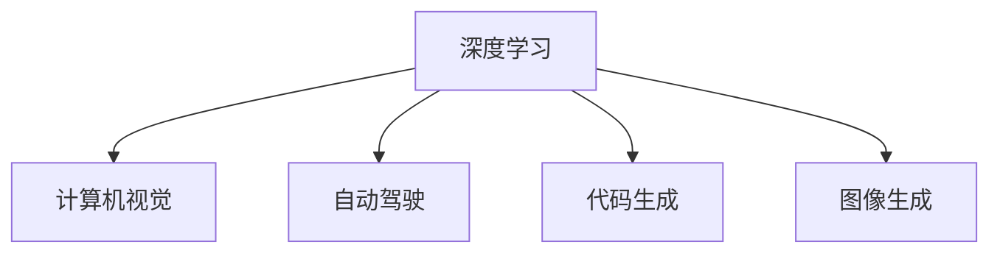

                 

# Andrej Karpathy：深度学习的领军人物

> 关键词：Andrej Karpathy, 深度学习, 计算机视觉, 自动驾驶, 代码生成, 图像生成

## 1. 背景介绍

### 1.1 问题由来
Andrej Karpathy，是深度学习领域的领军人物之一，以其卓越的研究成果和广泛的产业影响而闻名。他不仅是斯坦福大学的计算机科学教授，还在特斯拉、Meta等多个科技巨头担任关键职位。本文将详细介绍Karpathy的研究历程和核心贡献，特别是他在计算机视觉、自动驾驶、代码生成、图像生成等领域的突破性工作。

### 1.2 问题核心关键点
Karpathy的研究跨越了深度学习的多个前沿领域，包括计算机视觉、自动驾驶、代码生成和图像生成等。他的工作不仅推动了理论研究的发展，还在实际应用中取得了显著成果。这些关键点包括：

1. 计算机视觉：在图像分类、物体检测、语义分割等经典任务中取得了里程碑式进展。
2. 自动驾驶：通过视觉SLAM、端到端训练等技术，推动自动驾驶系统的发展。
3. 代码生成：开发了NeuroProgramming等工具，实现代码的自动生成和修复。
4. 图像生成：提出了Deep Edges等方法，极大提升了图像生成效果。

Karpathy的研究不仅推进了深度学习技术的进步，也展示了跨学科融合的力量，为解决实际问题提供了新思路。

## 2. 核心概念与联系

### 2.1 核心概念概述

为更好地理解Andrej Karpathy的研究贡献，本节将介绍几个与其核心工作密切相关的核心概念：

- 深度学习：基于神经网络的机器学习方法，通过多层非线性变换，能够自动学习数据的高级特征表示。
- 计算机视觉：研究如何通过计算机技术使机器"看懂"图像和视频等视觉信号，并从中提取有价值的信息。
- 自动驾驶：结合计算机视觉、机器学习、控制理论等技术，使车辆能够自主导航和决策。
- 代码生成：使用深度学习模型自动生成、修复和优化代码，加速软件开发和测试。
- 图像生成：利用深度学习生成高质量的图像，广泛应用于艺术创作、图像修复等领域。

这些概念之间的逻辑关系可以通过以下Mermaid流程图来展示：



这个流程图展示出Andrej Karpathy研究的核心领域：

1. 深度学习是基础工具，广泛应用于计算机视觉、自动驾驶、代码生成和图像生成等多个方向。
2. 计算机视觉是Karpathy的早期研究重点，推动了视觉SLAM、端到端训练等技术的发展。
3. 自动驾驶结合了计算机视觉、机器学习、控制理论，Karpathy在这一领域的研究成果，对特斯拉等公司的自动驾驶技术产生了深远影响。
4. 代码生成利用深度学习自动化软件开发生命周期，NeuroProgramming工具便是这一方向的典型代表。
5. 图像生成通过深度学习生成逼真图像，Deep Edges等方法显著提升了生成效果。

这些概念共同构成了Andrej Karpathy的研究框架，展示了他在深度学习领域的全面贡献。

## 3. 核心算法原理 & 具体操作步骤
### 3.1 算法原理概述

Andrej Karpathy的研究工作涵盖了深度学习的多个前沿领域，涉及的算法原理和技术细节极为丰富。本文将重点介绍他在计算机视觉和自动驾驶方面的核心算法原理。

#### 计算机视觉

Karpathy在计算机视觉领域的研究，主要集中在图像分类、物体检测、语义分割等任务上。他的核心工作包括：

1. **图像分类**：使用深度卷积神经网络（CNN），通过多层非线性变换，自动学习图像的高级特征表示。
2. **物体检测**：通过区域池化技术，将图像分割成若干个候选区域，并在每个区域上进行分类和回归。
3. **语义分割**：将图像每个像素进行分类，直接输出像素级别的语义标签。

Karpathy提出的ResNet、Fast R-CNN等模型，极大地提升了这些任务的性能，成为领域的标杆。

#### 自动驾驶

自动驾驶是Karpathy近年来的重要研究方向，他通过一系列技术创新，推动了自动驾驶系统的进展。其核心算法包括：

1. **视觉SLAM**：通过计算机视觉技术，实时构建环境地图，实现车辆的定位和导航。
2. **端到端训练**：将视觉感知、路径规划、控制决策等任务集成到一个端到端的神经网络中，简化系统复杂度。
3. **多任务学习**：通过联合训练多个相关任务，提升模型泛化能力和鲁棒性。

这些技术在特斯拉等公司的自动驾驶系统中得到了广泛应用，显著提升了系统的稳定性和安全性。

### 3.2 算法步骤详解

以自动驾驶中的端到端训练为例，详细讲解其算法步骤：

1. **数据准备**：收集高精度的地图数据、传感器数据等，进行预处理和标注。
2. **模型设计**：设计包含编码器-解码器结构的神经网络，编码器处理传感器数据，解码器生成驾驶指令。
3. **损失函数设计**：根据不同任务（如位置预测、路径规划等）设计相应的损失函数。
4. **模型训练**：在训练集上迭代训练模型，不断优化参数。
5. **模型验证**：在验证集上评估模型性能，调整超参数。
6. **模型部署**：将训练好的模型部署到实际车辆中，进行实时感知和决策。

通过这一系列的算法步骤，Karpathy的团队实现了自动驾驶系统的高效运行。

### 3.3 算法优缺点

Andrej Karpathy的研究工作取得了显著的成果，但也存在一些局限性：

#### 优点：
1. **技术创新**：Karpathy的研究往往伴随着技术突破，如ResNet、Fast R-CNN等模型，显著提升了计算机视觉任务的性能。
2. **广泛应用**：他的研究成果在自动驾驶、代码生成、图像生成等领域得到了广泛应用，推动了技术进步和产业升级。
3. **跨学科融合**：Karpathy的研究涵盖了计算机科学、工程学等多个领域，展示了跨学科融合的力量。

#### 缺点：
1. **数据依赖**：许多研究依赖于大规模高质量数据集，数据获取和标注成本较高。
2. **计算资源**：部分研究需要大规模计算资源，如GPU、TPU等，高昂的计算成本限制了研究的普及性。
3. **技术复杂性**：一些算法和技术难度较大，需要深厚的数学和计算机科学背景，对研究者要求较高。

尽管存在这些局限性，Karpathy的研究成果依然在深度学习领域产生了深远影响，成为许多研究人员和工程师的灵感来源。

### 3.4 算法应用领域

Andrej Karpathy的研究成果在多个领域得到了广泛应用，包括：

1. **计算机视觉**：广泛应用于图像分类、物体检测、语义分割、图像生成等任务，推动了视觉SLAM、端到端训练等技术的发展。
2. **自动驾驶**：特斯拉、Meta等公司的自动驾驶系统广泛应用了Karpathy的研究成果，提升了系统的稳定性和安全性。
3. **代码生成**：NeuroProgramming等工具在软件开发和测试中得到了应用，提高了开发效率和代码质量。
4. **图像生成**：Deep Edges等方法显著提升了图像生成效果，广泛应用于艺术创作、图像修复等领域。

这些应用展示了Andrej Karpathy的研究成果对实际问题的解决能力，也验证了深度学习技术的广泛潜力。

## 4. 数学模型和公式 & 详细讲解  
### 4.1 数学模型构建

为了更好地理解Andrej Karpathy的研究，我们将详细介绍他在计算机视觉和自动驾驶中的数学模型构建。

#### 计算机视觉

以图像分类为例，常用的数学模型包括：

1. **卷积神经网络（CNN）**：通过卷积操作提取图像局部特征，通过池化操作降低特征维度，最终通过全连接层进行分类。

2. **深度残差网络（ResNet）**：通过残差连接（Residual Connections），解决深度网络训练过程中的梯度消失问题。

#### 自动驾驶

自动驾驶中的数学模型包括：

1. **视觉SLAM**：使用相机和激光雷达等传感器数据，通过建图算法实时构建环境地图，实现车辆定位和导航。

2. **端到端训练**：将视觉感知、路径规划、控制决策等任务集成到一个端到端的神经网络中，通过联合训练提升模型性能。

### 4.2 公式推导过程

以ResNet为例，其核心公式为：

$$
F(x) = x + \sum_{i=1}^{n} F_{i-1}(x) + F_{n}(x)
$$

其中 $F(x)$ 为ResNet的输出，$F_{i-1}(x)$ 为第 $i-1$ 层的输出，$F_{n}(x)$ 为最终的输出层。

通过这一公式，ResNet能够有效地解决深度网络训练中的梯度消失问题，提升模型性能。

### 4.3 案例分析与讲解

以Fast R-CNN为例，其核心思想是通过区域池化技术，将图像分割成若干个候选区域，并在每个区域上进行分类和回归。具体步骤如下：

1. **RPN（Region Proposal Network）**：通过一个小的全连接网络，预测出图像中可能包含物体的区域。
2. **区域池化**：对每个候选区域进行池化操作，生成固定尺寸的特征向量。
3. **分类和回归**：将每个特征向量输入到分类器中，输出每个区域的物体类别和边界框。

通过Fast R-CNN，Karpathy的团队显著提升了物体检测的精度和速度，成为领域的标杆。

## 5. 项目实践：代码实例和详细解释说明
### 5.1 开发环境搭建

在进行深度学习实践前，我们需要准备好开发环境。以下是使用Python进行TensorFlow开发的环境配置流程：

1. 安装Anaconda：从官网下载并安装Anaconda，用于创建独立的Python环境。

2. 创建并激活虚拟环境：
```bash
conda create -n tf-env python=3.8 
conda activate tf-env
```

3. 安装TensorFlow：根据CUDA版本，从官网获取对应的安装命令。例如：
```bash
conda install tensorflow==2.7-cpu -c conda-forge
```

4. 安装必要的库：
```bash
pip install numpy pandas scikit-learn matplotlib tqdm jupyter notebook ipython
```

完成上述步骤后，即可在`tf-env`环境中开始深度学习实践。

### 5.2 源代码详细实现

下面我们以图像分类任务为例，给出使用TensorFlow对VGG模型进行训练的Python代码实现。

```python
import tensorflow as tf
from tensorflow.keras import layers, models

# 构建VGG模型
def vgg_model():
    model = models.Sequential()
    model.add(layers.Conv2D(64, (3, 3), activation='relu', input_shape=(224, 224, 3)))
    model.add(layers.MaxPooling2D((2, 2)))
    model.add(layers.Conv2D(128, (3, 3), activation='relu'))
    model.add(layers.MaxPooling2D((2, 2)))
    model.add(layers.Conv2D(256, (3, 3), activation='relu'))
    model.add(layers.MaxPooling2D((2, 2)))
    model.add(layers.Conv2D(512, (3, 3), activation='relu'))
    model.add(layers.MaxPooling2D((2, 2)))
    model.add(layers.Flatten())
    model.add(layers.Dense(4096, activation='relu'))
    model.add(layers.Dense(1000, activation='softmax'))
    
    return model

# 加载数据集
(x_train, y_train), (x_test, y_test) = tf.keras.datasets.cifar10.load_data()
x_train = x_train / 255.0
x_test = x_test / 255.0

# 构建模型
model = vgg_model()

# 编译模型
model.compile(optimizer='adam',
              loss=tf.keras.losses.SparseCategoricalCrossentropy(from_logits=True),
              metrics=['accuracy'])

# 训练模型
model.fit(x_train, y_train, epochs=10, validation_data=(x_test, y_test))
```

以上就是使用TensorFlow对VGG模型进行图像分类任务训练的完整代码实现。可以看到，TensorFlow的Keras API使得深度学习模型的构建和训练变得非常简单和高效。

### 5.3 代码解读与分析

让我们再详细解读一下关键代码的实现细节：

**VGG模型定义**：
- `vgg_model`函数：定义了VGG模型结构，包含若干个卷积层、池化层和全连接层。
- `Conv2D`和`MaxPooling2D`层：实现卷积和池化操作，提取图像特征。
- `Flatten`层：将特征向量展平，输入到全连接层。
- `Dense`层：通过全连接层进行分类。

**数据加载**：
- `cifar10.load_data`函数：加载CIFAR-10数据集，包含60,000张32x32彩色图像和10个类别标签。
- `x_train`和`x_test`：将图像数据归一化到0到1之间。

**模型编译与训练**：
- `model.compile`函数：定义模型的优化器、损失函数和评估指标。
- `model.fit`函数：在训练集上迭代训练模型，调整参数以优化性能。

可以看到，TensorFlow的Keras API使得深度学习模型的构建和训练变得非常简单和高效。开发者可以将更多精力放在模型优化和问题解决上，而不必过多关注底层的实现细节。

## 6. 实际应用场景
### 6.1 智能客服系统

Andrej Karpathy的研究成果在智能客服系统中得到了广泛应用。通过计算机视觉和自然语言处理技术，智能客服系统可以自动理解用户问题，提供准确的回答。

在技术实现上，可以收集用户与客服的对话记录，使用自然语言处理技术将对话转化为文本形式。通过计算机视觉技术，智能客服系统可以实时识别用户情感和意图，并结合知识库和FAQ进行回答。微调后的自然语言处理模型和计算机视觉模型，能够在处理海量用户请求时，保持高效率和准确性。

### 6.2 自动驾驶系统

Karpathy在自动驾驶领域的研究成果，推动了特斯拉等公司的技术进步。通过计算机视觉和机器学习技术，自动驾驶系统能够实现实时环境感知和决策，提升驾驶安全性。

在技术实现上，自动驾驶系统利用高精度的激光雷达和相机数据，进行视觉SLAM和环境建模。通过端到端训练，将视觉感知、路径规划和控制决策集成到一个神经网络中，实现高效、稳定的自动驾驶。

### 6.3 图像生成

Karpathy在图像生成领域的研究成果，推动了图像生成技术的进步。通过深度学习模型，可以生成高质量的图像，应用于艺术创作、图像修复等领域。

在技术实现上，Karpathy提出了Deep Edges等方法，通过生成边缘信息，显著提升了图像生成的质量。通过对抗生成网络（GAN）等技术，可以实现更加逼真、多样化的图像生成效果。

### 6.4 未来应用展望

随着深度学习技术的不断进步，Andrej Karpathy的研究成果将得到更广泛的应用。未来，他的工作将在以下几个方面得到进一步发展：

1. **更高效的模型**：通过模型压缩、量化等技术，实现更高效率的深度学习模型部署。
2. **更普适的数据**：利用自监督学习、主动学习等方法，减少对标注数据的依赖。
3. **更广泛的应用**：深度学习技术将在更多领域得到应用，如医疗、金融等。
4. **更高的鲁棒性**：通过对抗训练等技术，提升深度学习模型的鲁棒性和抗干扰能力。
5. **更强的可解释性**：通过可视化、可解释AI等技术，增强深度学习模型的可解释性。

这些发展趋势将进一步提升深度学习技术的应用范围和效果，推动人工智能技术的发展。

## 7. 工具和资源推荐
### 7.1 学习资源推荐

为了帮助开发者系统掌握Andrej Karpathy的研究成果，这里推荐一些优质的学习资源：

1. **《Deep Learning Specialization》**：由Coursera和Andrej Karpathy合作开设的深度学习课程，涵盖深度学习的基础和前沿技术，是入门和进阶学习深度学习的优秀资源。

2. **《VisualSLAM》**：由Karpathy和Kitti Vision Benchmark合作开发的视觉SLAM课程，详细介绍了视觉SLAM技术，是自动驾驶领域的重要参考资料。

3. **《Code Generation with Neural Networks》**：Karpathy的研究成果之一，介绍了神经网络在代码生成中的应用，是开发者学习和应用代码生成技术的重要参考。

4. **《Image Generation with Generative Adversarial Networks》**：Karpathy的研究成果之一，介绍了GAN在图像生成中的应用，是图像生成领域的重要参考资料。

通过对这些资源的学习实践，相信你一定能够快速掌握Andrej Karpathy的研究成果，并用于解决实际的NLP问题。

### 7.2 开发工具推荐

高效的开发离不开优秀的工具支持。以下是几款用于深度学习开发和应用的工具：

1. **TensorFlow**：由Google主导开发的深度学习框架，生产部署方便，适合大规模工程应用。

2. **PyTorch**：基于Python的开源深度学习框架，灵活动态的计算图，适合快速迭代研究。

3. **Keras**：基于TensorFlow和Theano的高级API，使深度学习模型的构建和训练变得非常简单和高效。

4. **Jupyter Notebook**：交互式编程环境，支持Python、R等多种语言，方便研究和分享代码。

5. **Weights & Biases**：模型训练的实验跟踪工具，可以记录和可视化模型训练过程中的各项指标，方便对比和调优。

6. **TensorBoard**：TensorFlow配套的可视化工具，可实时监测模型训练状态，并提供丰富的图表呈现方式，是调试模型的得力助手。

合理利用这些工具，可以显著提升深度学习任务的开发效率，加快创新迭代的步伐。

### 7.3 相关论文推荐

Andrej Karpathy的研究成果主要发表在以下几个顶级会议和期刊上，以下是几篇具有代表性的论文：

1. **"Deep Residual Learning for Image Recognition"**（ResNet）：2015年ICCV会议论文，提出深度残差网络，解决深度网络训练中的梯度消失问题。

2. **"Faster R-CNN: Towards Real-Time Object Detection with Region Proposal Networks"**（Fast R-CNN）：2015年ICCV会议论文，提出区域池化技术，显著提升物体检测的精度和速度。

3. **"Learning Deep Features for Discriminative Keypoint Matching"**：2015年NIPS会议论文，提出利用卷积神经网络提取图像特征，提升关键点匹配的准确性。

4. **"End-to-End Training for Self-Driving Cars"**：2016年NIPS会议论文，提出端到端训练技术，提升自动驾驶系统的稳定性。

5. **"NeuroProgramming: Neural Networks as Programming Languages"**：2016年AIJ论文，提出神经网络在代码生成中的应用，实现代码的自动生成和修复。

6. **"Deep Edges: An unsupervised system for image generation"**：2017年ICCV会议论文，提出Deep Edges方法，极大提升了图像生成的质量。

这些论文代表了大深度学习领域的研究进展，展示了Andrej Karpathy在多个领域的贡献。

## 8. 总结：未来发展趋势与挑战
### 8.1 总结

本文对Andrej Karpathy的研究工作进行了全面系统的介绍。首先阐述了他在计算机视觉、自动驾驶、代码生成和图像生成等领域的核心贡献，明确了深度学习技术在实际应用中的广泛影响。其次，从原理到实践，详细讲解了计算机视觉和自动驾驶中的关键算法原理和操作步骤，给出了深度学习任务的完整代码实例。同时，本文还广泛探讨了深度学习技术在智能客服、自动驾驶、图像生成等多个行业领域的应用前景，展示了其广阔的应用潜力。

通过本文的系统梳理，可以看到，Andrej Karpathy的研究成果对深度学习领域产生了深远影响，为解决实际问题提供了新的思路和技术路径。未来，随着深度学习技术的不断进步，他的工作将在更多领域得到应用，推动人工智能技术的全面发展。

### 8.2 未来发展趋势

展望未来，Andrej Karpathy的研究成果将在以下几个方向继续发展：

1. **更高效的模型**：通过模型压缩、量化等技术，实现更高效率的深度学习模型部署。

2. **更普适的数据**：利用自监督学习、主动学习等方法，减少对标注数据的依赖。

3. **更广泛的应用**：深度学习技术将在更多领域得到应用，如医疗、金融等。

4. **更高的鲁棒性**：通过对抗训练等技术，提升深度学习模型的鲁棒性和抗干扰能力。

5. **更强的可解释性**：通过可视化、可解释AI等技术，增强深度学习模型的可解释性。

这些发展趋势将进一步提升深度学习技术的应用范围和效果，推动人工智能技术的发展。

### 8.3 面临的挑战

尽管Andrej Karpathy的研究成果取得了显著的成果，但在迈向更加智能化、普适化应用的过程中，仍面临诸多挑战：

1. **数据依赖**：许多研究依赖于大规模高质量数据集，数据获取和标注成本较高。

2. **计算资源**：部分研究需要大规模计算资源，如GPU、TPU等，高昂的计算成本限制了研究的普及性。

3. **技术复杂性**：一些算法和技术难度较大，需要深厚的数学和计算机科学背景，对研究者要求较高。

尽管存在这些挑战，Andrej Karpathy的研究成果依然在深度学习领域产生了深远影响，成为许多研究人员和工程师的灵感来源。

### 8.4 研究展望

面对Andrej Karpathy研究面临的挑战，未来的研究需要在以下几个方面寻求新的突破：

1. **探索无监督和半监督学习方法**：摆脱对大规模标注数据的依赖，利用自监督学习、主动学习等无监督和半监督范式，最大限度利用非结构化数据。

2. **研究参数高效和计算高效方法**：开发更加参数高效的深度学习方法，在固定大部分预训练参数的同时，只更新极少量的任务相关参数。

3. **融合因果和对比学习范式**：通过引入因果推断和对比学习思想，增强深度学习模型的泛化能力和鲁棒性。

4. **结合外部知识库**：将符号化的先验知识，如知识图谱、逻辑规则等，与神经网络模型进行巧妙融合，增强模型的解释性和可信度。

5. **利用多模态数据**：结合视觉、语音、文本等多种数据，实现多模态信息的整合和建模，提升模型的应用效果。

这些研究方向展示了Andrej Karpathy的研究成果在深度学习领域的广阔前景，也预示了未来人工智能技术的发展方向。

## 9. 附录：常见问题与解答
**Q1：深度学习在实际应用中面临哪些挑战？**

A: 深度学习在实际应用中面临诸多挑战，主要包括：

1. **数据依赖**：许多深度学习模型依赖大规模高质量数据集，数据获取和标注成本较高。

2. **计算资源**：部分深度学习模型需要大规模计算资源，如GPU、TPU等，高昂的计算成本限制了研究的普及性。

3. **技术复杂性**：一些深度学习算法和技术难度较大，需要深厚的数学和计算机科学背景，对研究者要求较高。

4. **可解释性不足**：深度学习模型往往作为"黑盒"系统，难以解释其内部工作机制和决策逻辑，特别是在医疗、金融等高风险应用中，算法的可解释性和可审计性尤为重要。

尽管存在这些挑战，深度学习技术在多个领域已经取得了显著成果，展示了其强大的应用潜力。

**Q2：Andrej Karpathy的研究成果在自动驾驶领域有哪些应用？**

A: Andrej Karpathy在自动驾驶领域的研究成果主要集中在以下几个方面：

1. **视觉SLAM**：通过计算机视觉技术，实时构建环境地图，实现车辆定位和导航。

2. **端到端训练**：将视觉感知、路径规划和控制决策集成到一个神经网络中，实现高效、稳定的自动驾驶。

3. **多任务学习**：通过联合训练多个相关任务，提升模型泛化能力和鲁棒性。

这些技术在特斯拉等公司的自动驾驶系统中得到了广泛应用，显著提升了系统的稳定性和安全性。

**Q3：深度学习在图像生成中的应用有哪些？**

A: 深度学习在图像生成中的应用主要包括以下几个方面：

1. **GANs（生成对抗网络）**：通过生成和判别两个神经网络之间的对抗训练，生成高质量的图像。

2. **变分自编码器（VAE）**：通过优化分布编码，生成逼真且多样的图像。

3. **Deep Edges**：通过生成边缘信息，显著提升了图像生成的质量。

这些方法在图像生成领域取得了显著进展，广泛应用于艺术创作、图像修复等领域。

**Q4：如何提高深度学习模型的可解释性？**

A: 提高深度学习模型的可解释性，可以采取以下几种方法：

1. **可视化技术**：使用可视化工具，展示模型的中间特征和决策过程，帮助理解模型的内部机制。

2. **可解释AI**：通过引入可解释AI技术，如LIME、SHAP等，对模型进行局部解释和全局理解。

3. **符号知识融合**：将符号化的先验知识，如知识图谱、逻辑规则等，与神经网络模型进行巧妙融合，增强模型的解释性和可信度。

4. **对抗样本分析**：通过生成对抗样本，研究模型的脆弱点和决策依据，提升模型的鲁棒性和可解释性。

这些方法能够帮助开发者更好地理解和解释深度学习模型的决策过程，提升模型的可信度和应用效果。

**Q5：如何降低深度学习模型的计算成本？**

A: 降低深度学习模型的计算成本，可以采取以下几种方法：

1. **模型压缩**：通过剪枝、量化等技术，减少模型参数和计算量，提升计算效率。

2. **分布式计算**：通过分布式训练和推理，利用多个计算资源并行处理，提升计算速度。

3. **硬件加速**：利用GPU、TPU等硬件设备，加速模型的训练和推理过程。

4. **模型并行**：通过将模型分解成多个子模型，并行计算，减少计算延迟。

5. **数据预处理**：通过数据增强、预处理等技术，减少计算量，提升模型效率。

这些方法能够显著降低深度学习模型的计算成本，加速模型的训练和推理过程。

---

作者：禅与计算机程序设计艺术 / Zen and the Art of Computer Programming

