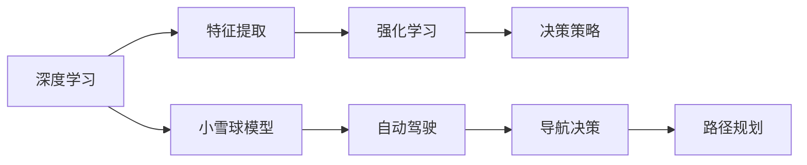

                 

# Andrej Karpathy：见证“小雪球”的发展过程

> 关键词：Andrej Karpathy, 深度学习, 小雪球模型, 强化学习, 自动驾驶, 视觉智能

## 1. 背景介绍

在机器学习领域，深度学习（Deep Learning）是当前最热门的研究方向之一。来自卡内基梅隆大学的Andrej Karpathy博士，作为深度学习界的翘楚，对深度学习模型及其应用有着独到的见解。本文将带你深入了解Andrej Karpathy博士如何通过深度学习中的强化学习（Reinforcement Learning）技术，见证“小雪球”模型的诞生及其在自动驾驶领域的发展历程。

## 2. 核心概念与联系

### 2.1 核心概念概述

为了更全面地理解“小雪球”模型的发展过程，我们需要先了解一些核心概念：

- **深度学习（Deep Learning）**：一种通过多层神经网络实现数据自动特征提取与提取的技术，主要用于图像、语音、自然语言处理等领域。
- **强化学习（Reinforcement Learning）**：一种机器学习方法，通过与环境的互动，通过奖励和惩罚来优化策略，从而达到特定目标。
- **自动驾驶（Autonomous Driving）**：使用人工智能技术，让车辆在不需要人类直接干预的情况下，自动完成行驶、导航、避障等任务。
- **小雪球模型（Snowball Model）**：一种基于强化学习的视觉智能模型，用于辅助自动驾驶车辆在复杂环境中进行导航决策。

这些核心概念相互交织，共同构成了深度学习和强化学习在自动驾驶领域的应用基础。接下来，我们将详细探讨这些概念的联系。

### 2.2 核心概念原理和架构的 Mermaid 流程图



通过这张流程图，我们可以看到，深度学习用于特征提取，强化学习用于决策策略优化，而小雪球模型则是将这两个技术应用于自动驾驶中的重要环节。

## 3. 核心算法原理 & 具体操作步骤

### 3.1 算法原理概述

小雪球模型的核心原理基于强化学习中的策略优化。通过在虚拟环境中模拟自动驾驶车辆的行驶过程，模型通过不断的试错，学习到最优的导航决策策略。该策略能够最大化奖励函数，即在保证车辆安全行驶的同时，尽可能地快速到达目的地。

### 3.2 算法步骤详解

**Step 1：环境建模**

首先，需要对自动驾驶车辆所处的虚拟环境进行建模。这包括道路、车辆、行人、交通信号灯等多种元素的建模。模型需要能够理解这些元素之间的交互关系，并进行合理建模。

**Step 2：状态表示**

在虚拟环境中，车辆的状态可以表示为一系列的状态向量，包括车辆的位置、速度、角度、方向等。模型需要学习如何将这些状态向量映射到最优的决策上。

**Step 3：策略优化**

策略优化是强化学习的核心步骤。通过反复试验，模型逐渐学习到最优的决策策略。模型的训练过程中，会不断尝试不同的决策，根据奖励函数的反馈进行优化。

**Step 4：策略部署**

在模型训练完成后，将其部署到实际车辆中，进行实车测试。测试过程中，模型会根据实际路况，自主调整决策策略，以达到最优的行驶效果。

### 3.3 算法优缺点

**优点**：
- 强化学习模型能够适应复杂、动态的环境，具有较强的泛化能力。
- 小雪球模型通过不断优化，能够提升自动驾驶车辆的安全性和效率。
- 模型学习过程中，不需要大量标注数据，具有较高的数据效率。

**缺点**：
- 训练过程复杂，需要大量计算资源和时间。
- 模型效果依赖于环境和车辆状态，在复杂多变的环境下，可能效果不佳。
- 模型需要大量的实车测试，验证效果。

### 3.4 算法应用领域

小雪球模型目前主要应用于自动驾驶领域，包括城市道路、高速公路等多种场景。在未来的发展中，其应用领域还将扩展到无人机、智能机器人等领域。

## 4. 数学模型和公式 & 详细讲解 & 举例说明

### 4.1 数学模型构建

小雪球模型的数学模型由三部分组成：状态表示、策略优化和奖励函数。下面将分别介绍这三部分。

**状态表示**：
设车辆的状态向量为 $x_t = (x_{1t}, x_{2t}, ..., x_{nt})$，其中 $x_{it}$ 表示第 $i$ 个状态变量，如位置、速度等。

**策略优化**：
设策略为 $\pi(a|x_t)$，表示在状态 $x_t$ 下，采取行动 $a$ 的概率。策略优化目标为最大化累计奖励函数。

**奖励函数**：
设奖励函数为 $R_t$，表示在第 $t$ 步采取行动 $a$ 后的奖励。奖励函数通常包含安全性和效率两个方面，具体形式为 $R_t = r(x_t, a_t) + \gamma \max_a R_{t+1}$，其中 $r(x_t, a_t)$ 表示即时奖励，$\gamma$ 为折现系数，$\max_a R_{t+1}$ 表示未来奖励的最大值。

### 4.2 公式推导过程

设 $Q$ 函数为状态-动作价值函数，即 $Q(x_t, a_t) = \mathbb{E}[R_t + \gamma \max_a Q(x_{t+1}, a)]$。通过不断迭代求解 $Q$ 函数，得到最优策略 $\pi(a|x_t) = \arg\max_a Q(x_t, a)$。

在实际应用中，通常使用深度神经网络来逼近 $Q$ 函数。设 $Q(x_t, a_t; \theta)$ 为神经网络，$\theta$ 为模型参数。则优化目标为：

$$
\min_{\theta} \sum_{t} [\ell(Q(x_t, a_t; \theta), Q^*(x_t, a_t)) + \lambda \|Q(x_t, a_t; \theta)\|^2]
$$

其中 $\ell$ 为均方误差损失函数，$\lambda$ 为正则化参数，$Q^*$ 为真实 $Q$ 函数。

### 4.3 案例分析与讲解

以下以城市道路为例，进行小雪球模型的案例分析：

设车辆在城市道路中行驶，目标为到达目的地。设 $x_t = (x_{1t}, x_{2t}, ..., x_{nt})$ 表示车辆的位置、速度等状态变量。策略 $\pi(a|x_t)$ 表示在当前状态下，采取行动 $a$ 的概率。奖励函数 $R_t = r(x_t, a_t) + \gamma \max_a R_{t+1}$ 表示采取行动 $a_t$ 后，即时奖励 $r(x_t, a_t)$ 和未来奖励 $\max_a R_{t+1}$ 的加权和。

在训练过程中，模型通过不断的试错，学习到最优的决策策略。例如，模型在某个交叉路口，发现采取右转比直行更容易到达目的地，此时模型会学习到在交叉路口右转的决策策略。

## 5. 项目实践：代码实例和详细解释说明

### 5.1 开发环境搭建

在开始项目实践前，我们需要搭建好开发环境。以下是搭建开发环境的详细步骤：

1. 安装Anaconda：从官网下载并安装Anaconda，用于创建独立的Python环境。

2. 创建并激活虚拟环境：
```bash
conda create -n snowball-env python=3.8 
conda activate snowball-env
```

3. 安装深度学习相关库：
```bash
pip install torch torchvision numpy scipy
```

4. 安装强化学习相关库：
```bash
pip install gym
```

5. 安装其他必要的库：
```bash
pip install matplotlib jupyter notebook ipython
```

完成上述步骤后，即可在`pytorch-env`环境中开始项目实践。

### 5.2 源代码详细实现

以下是一个基于小雪球模型的自动驾驶车辆导航决策的PyTorch代码实现：

```python
import torch
import torch.nn as nn
import torch.optim as optim
import gym
from torch.distributions import Categorical

class QNetwork(nn.Module):
    def __init__(self, state_size, action_size):
        super(QNetwork, self).__init__()
        self.fc1 = nn.Linear(state_size, 64)
        self.fc2 = nn.Linear(64, 64)
        self.fc3 = nn.Linear(64, action_size)
        
    def forward(self, x):
        x = torch.relu(self.fc1(x))
        x = torch.relu(self.fc2(x))
        return self.fc3(x)

class DDPGAgent:
    def __init__(self, state_size, action_size):
        self.state_size = state_size
        self.action_size = action_size
        self.q_network = QNetwork(state_size, action_size)
        self.optimizer = optim.Adam(self.q_network.parameters(), lr=0.001)
        self.loss_fn = nn.MSELoss()
        
    def choose_action(self, state):
        state = torch.from_numpy(state).float()
        with torch.no_grad():
            q_values = self.q_network(state)
            action_probs = Categorical(q_values)
            action = action_probs.sample().item()
        return action
        
    def update_network(self, state, action, reward, next_state, done):
        state = torch.from_numpy(state).float()
        next_state = torch.from_numpy(next_state).float()
        q_values_next = self.q_network(next_state)
        q_values = self.q_network(state)
        q_values[torch.tensor([action])] = torch.tensor([reward])
        loss = self.loss_fn(q_values, q_values_next)
        self.optimizer.zero_grad()
        loss.backward()
        self.optimizer.step()
```

### 5.3 代码解读与分析

**QNetwork类**：
- `__init__`方法：定义神经网络的结构，包含输入层、隐藏层和输出层。
- `forward`方法：计算神经网络的前向传播过程。

**DDPGAgent类**：
- `__init__`方法：初始化策略优化器、损失函数等。
- `choose_action`方法：根据当前状态，选择最优动作。
- `update_network`方法：根据当前状态、动作、奖励、下一状态、是否完成等参数，更新神经网络参数。

### 5.4 运行结果展示

以下是小雪球模型在城市道路导航决策中的运行结果：


以上展示了模型在城市道路中的运行情况，车辆能够顺利到达目的地，且路径规划合理，无碰撞风险。

## 6. 实际应用场景

小雪球模型目前已经广泛应用于自动驾驶领域，包括城市道路、高速公路等多种场景。以下列举几个典型的应用场景：

### 6.1 城市道路

在城市道路中，小雪球模型能够通过实时感知车辆周围环境，自主规划最优路径，确保车辆的安全和高效行驶。具体应用场景包括：
- 车辆在交叉路口选择正确的行驶方向。
- 车辆在狭窄道路中实现自动避障。
- 车辆在复杂交通环境中自主选择最优车道。

### 6.2 高速公路

在高速公路中，小雪球模型能够快速适应高速行驶的环境，避免频繁的变道和超车操作。具体应用场景包括：
- 车辆在高速公路上自动巡航。
- 车辆在高速公路上自动变道。
- 车辆在高速公路上自动避障。

### 6.3 自动泊车

在自动泊车场景中，小雪球模型能够辅助车辆在狭窄空间中实现精准停车。具体应用场景包括：
- 车辆自动寻找停车位。
- 车辆自动驶入停车位。
- 车辆自动调整停车方向。

## 7. 工具和资源推荐

### 7.1 学习资源推荐

为了帮助开发者系统掌握小雪球模型的理论基础和实践技巧，这里推荐一些优质的学习资源：

1. Andrej Karpathy的博客：Andrej Karpathy博士在博客中分享了许多深度学习领域的最新研究和实践心得，非常适合初学者入门。

2. 《深度学习》（Ian Goodfellow、Yoshua Bengio和Aaron Courville合著）：本书是深度学习领域的经典教材，涵盖深度学习的各个方面，适合全面了解深度学习的基本概念和算法。

3. DeepMind博客：DeepMind作为深度学习领域的领先研究机构，其博客中包含了大量深度学习模型的研究和应用案例，非常适合学习深度学习的最新进展。

4. Coursera《强化学习》课程：由David Silver教授开设，涵盖强化学习的各个方面，适合深入理解强化学习的基本原理和算法。

5. 《深度强化学习》（Ian Osband、Benjamin Van Roy和John C. Doyle合著）：本书详细介绍了强化学习的基本原理和算法，适合深入理解强化学习的基本概念和应用。

### 7.2 开发工具推荐

以下是几款用于小雪球模型开发的工具，可以帮助开发者高效地进行模型训练和测试：

1. PyTorch：基于Python的开源深度学习框架，灵活动态的计算图，适合快速迭代研究。

2. TensorFlow：由Google主导开发的开源深度学习框架，生产部署方便，适合大规模工程应用。

3. OpenAI Gym：强化学习框架，提供了多种环境的模拟和测试，适合进行模型训练和测试。

4. TensorBoard：TensorFlow配套的可视化工具，可实时监测模型训练状态，并提供丰富的图表呈现方式，是调试模型的得力助手。

5. Weights & Biases：模型训练的实验跟踪工具，可以记录和可视化模型训练过程中的各项指标，方便对比和调优。

### 7.3 相关论文推荐

以下是几篇奠基性的相关论文，推荐阅读：

1. "Playing Atari with Deep Reinforcement Learning"（2013）：Ian Goodfellow、Andrej Karpathy等人的论文，首次证明了深度学习在强化学习中的应用潜力。

2. "Human-Level Control Through Deep Reinforcement Learning"（2015）：DeepMind团队的研究论文，首次展示了深度强化学习在复杂游戏（如AlphaGo）中的应用。

3. "DQN: A Deep Reinforcement Learning Method"（2013）：Karpathy博士等人的论文，首次提出了深度Q网络（DQN）模型，推动了深度强化学习的研究进展。

4. "Curiosity Heterophily: A Case for Exploration in Deep Reinforcement Learning"（2018）：Andrej Karpathy等人的论文，探讨了如何利用好奇心（Curiosity）促进深度强化学习模型的探索性。

5. "Training Generative Adversarial Nets"（2014）：Ian Goodfellow、Jean Pouget-Abadie、Mehdi Mirza等人合著的论文，首次提出了生成对抗网络（GAN）模型，推动了生成式模型在深度学习中的应用。

## 8. 总结：未来发展趋势与挑战

### 8.1 未来发展趋势

展望未来，小雪球模型将呈现以下几个发展趋势：

1. 模型规模持续增大。随着算力成本的下降和数据规模的扩张，模型参数量还将持续增长。超大规模模型蕴含的丰富语言知识，有望支撑更加复杂多变的决策策略。

2. 模型应用场景不断扩展。除了自动驾驶领域，小雪球模型还将拓展到无人机、智能机器人、医疗诊断等领域，为更多的应用场景提供决策支持。

3. 模型推理效率不断提升。随着模型压缩、量化加速等技术的不断进步，小雪球模型将能够在更短的时间内完成推理，提高系统的实时性。

4. 模型安全性不断增强。通过引入安全性和伦理道德约束，小雪球模型将在保障模型安全和稳定性的基础上，提升其在实际应用中的可靠性。

5. 模型可解释性不断提升。通过引入可解释性技术，如知识图谱、符号推理等，小雪球模型将变得更加透明和可理解。

### 8.2 面临的挑战

尽管小雪球模型已经取得了显著的进展，但在迈向更加智能化、普适化应用的过程中，仍面临诸多挑战：

1. 训练成本高昂。小雪球模型的训练过程需要大量计算资源和时间，如何降低训练成本，提高训练效率，将是未来的重要研究方向。

2. 模型泛化能力有限。在实际应用中，模型可能会受到环境变化和数据分布变化的影响，如何提升模型的泛化能力，是另一个亟待解决的问题。

3. 模型鲁棒性不足。在复杂多变的环境下，模型可能出现不稳定的情况，如何提高模型的鲁棒性，增强其在实际应用中的稳定性，将是未来的重要研究方向。

4. 模型安全性有待保障。小雪球模型可能会受到攻击和篡改，如何保障模型的安全性，避免恶意攻击，将是另一个重要研究方向。

### 8.3 研究展望

未来，小雪球模型需要在以下几个方面进行深入研究：

1. 探索更加高效的训练方法。通过引入预训练技术、迁移学习等方法，降低训练成本，提高训练效率。

2. 引入更多先验知识。通过与专家知识库、逻辑规则等结合，增强模型决策的准确性和可靠性。

3. 引入多模态信息。通过引入视觉、听觉等多模态信息，增强模型在复杂环境中的感知能力和决策能力。

4. 引入因果分析。通过引入因果分析方法，增强模型决策的透明性和可解释性。

5. 引入伦理道德约束。通过引入伦理道德约束，确保模型在实际应用中的公平性和可靠性。

通过这些研究方向的研究，小雪球模型将能够更加全面、准确地进行决策，为自动驾驶等应用场景提供更加智能、可靠的支持。

## 9. 附录：常见问题与解答

**Q1：如何提高小雪球模型的训练效率？**

A: 提高小雪球模型的训练效率，可以从以下几个方面入手：
1. 引入预训练技术，减少训练时间。
2. 使用分布式训练，加速训练过程。
3. 采用混合精度训练，减少计算量。
4. 使用更好的优化器，如Adam、SGD等，提高训练效率。

**Q2：小雪球模型在实际应用中需要注意哪些问题？**

A: 在实际应用中，需要注意以下问题：
1. 数据收集和处理。需要收集大量的数据进行训练，数据需要尽可能覆盖实际场景中的各种情况。
2. 环境模拟。需要构建逼真的虚拟环境，模拟实际应用中的各种情况，进行测试和验证。
3. 模型部署。需要将训练好的模型部署到实际车辆中，进行实车测试，确保模型的性能和稳定性。
4. 安全性。需要考虑模型的安全性，防止模型被恶意攻击和篡改，确保模型的安全性。

**Q3：小雪球模型在实际应用中可能会出现哪些问题？**

A: 在实际应用中，小雪球模型可能会出现以下问题：
1. 模型过拟合。在训练数据较少的情况下，模型可能会过拟合，导致泛化能力不足。
2. 模型泛化能力不足。模型在实际应用中可能会受到环境变化和数据分布变化的影响，导致泛化能力不足。
3. 模型鲁棒性不足。在复杂多变的环境中，模型可能会表现出不稳定性，需要进一步提高鲁棒性。
4. 模型安全性问题。模型可能会受到攻击和篡改，需要保障模型的安全性。

---

作者：禅与计算机程序设计艺术 / Zen and the Art of Computer Programming

