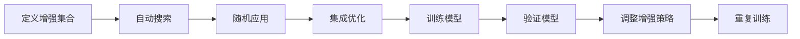

                 

## 1. 背景介绍

图像增强(Augmentation)技术在深度学习领域有着广泛应用。它通过引入各种随机变换，如旋转、裁剪、缩放、颜色调整等，扩充训练数据的多样性，提升模型的鲁棒性和泛化能力。特别是针对图像分类任务，增强数据的多样性是提高模型准确率的重要手段。

AutoAugment算法是Google提出的一种基于自动化增强的策略，能够自动生成一系列增强方式，有效提升模型训练效果。该算法能够通过自动搜索确定最优的增强策略，并应用于大规模数据集。本文将对AutoAugment算法原理进行详细讲解，并结合代码实例进行分析，以便读者更好地理解和应用这一强大技术。

## 2. 核心概念与联系

### 2.1 核心概念概述

AutoAugment算法是一种基于自动增强的策略，通过优化增强变换的空间来实现图像增强。其核心思想是在预定义的增强集合中，自动搜索出最佳增强方式，并在训练集上应用这些增强方式，从而提高模型的泛化能力和准确率。

AutoAugment算法的主要步骤如下：

1. **定义增强集合**：预定义一组增强变换，如旋转、缩放、剪切、加噪声等。
2. **自动搜索**：通过优化目标，搜索最优的增强方式，并应用这些增强方式进行训练。
3. **随机应用**：在训练过程中随机应用搜索得到的增强方式。
4. **集成优化**：在验证集上验证增强后的模型效果，并根据验证集上的性能调整增强策略。

### 2.2 核心概念原理和架构的 Mermaid 流程图



这个流程图展示了AutoAugment算法的核心流程，从增强集合的定义到最终模型的训练，各个步骤相互作用，形成了有效的自动化增强策略。

## 3. 核心算法原理 & 具体操作步骤

### 3.1 算法原理概述

AutoAugment算法的原理是通过组合不同种类的增强方式，优化增强策略，以提高模型在验证集上的性能。具体的，AutoAugment算法分为两个主要阶段：搜索和训练。

- **搜索阶段**：通过优化目标，自动搜索出最优的增强策略。
- **训练阶段**：在训练集上应用搜索得到的增强策略，并在验证集上评估和调整增强策略。

### 3.2 算法步骤详解

#### 3.2.1 定义增强集合

首先需要定义一组预定的增强方式，这些增强方式包括旋转、缩放、剪切、颜色调整等。以下是一个简单的增强集合：

| 增强方式 | 描述 |
|---|---|
| Cutout | 随机裁剪出一块区域，并填充为黑色 |
| Color | 随机调整图像的饱和度、亮度 |
| ShearX | 沿水平方向随机剪切 |
| Rotate | 随机旋转图像 |

增强集合的顺序也是重要因素，因为不同的顺序可能导致不同的增强效果。

#### 3.2.2 自动搜索

自动搜索阶段的目标是找到最优的增强策略。这个过程可以看作是一个优化问题，目标是最小化验证集上的损失函数。

AutoAugment算法使用强化学习的方法来搜索最优增强策略。具体地，算法通过蒙特卡洛树搜索(MCTS)来优化增强策略，从初始策略开始，不断扩展搜索树，选择性能更好的策略，最终得到最优策略。

#### 3.2.3 随机应用

一旦找到最优的增强策略，即使用该策略在训练集上随机应用增强变换。每次训练时，随机选择一个增强策略，并将其应用于输入图像。

#### 3.2.4 集成优化

在每个epoch结束时，使用验证集上的性能来评估模型效果，并根据性能调整增强策略。这个过程是一个迭代过程，通过不断调整增强策略，最终找到最优策略。

### 3.3 算法优缺点

#### 3.3.1 优点

- **自动化**：AutoAugment算法自动搜索最优增强策略，减少了手动调整的复杂性。
- **多样性**：增强策略多样化，能够提高模型的泛化能力。
- **高效性**：通过自动搜索，可以快速找到最优策略，提升训练效率。

#### 3.3.2 缺点

- **复杂性**：算法复杂，需要较长时间训练才能收敛。
- **资源消耗**：由于搜索过程涉及大量的计算，可能会导致资源消耗较大。
- **可解释性**：搜索过程不透明，难以解释最优策略的来源。

### 3.4 算法应用领域

AutoAugment算法广泛应用于计算机视觉领域，尤其是在图像分类任务中。它能够在提高模型准确率的同时，减少对标注数据的依赖，适用于各种规模的数据集。

## 4. 数学模型和公式 & 详细讲解 & 举例说明

### 4.1 数学模型构建

AutoAugment算法的核心是自动搜索最优增强策略。目标是最小化验证集上的损失函数：

$$ \min_{\pi} L_{val}(\pi) $$

其中 $\pi$ 表示增强策略。

### 4.2 公式推导过程

AutoAugment算法使用蒙特卡洛树搜索(MCTS)来搜索最优增强策略。搜索过程可以看作是一个树形结构，每个节点表示一种增强策略，每个边表示一种增强操作。通过不断扩展树形结构，选择性能更好的策略，最终得到最优策略。

### 4.3 案例分析与讲解

以图像分类任务为例，AutoAugment算法可以显著提升模型的准确率。以下是一个简单的案例：

| 增强方式 | 描述 |
|---|---|
| Cutout | 随机裁剪出一块区域，并填充为黑色 |
| Color | 随机调整图像的饱和度、亮度 |
| ShearX | 沿水平方向随机剪切 |
| Rotate | 随机旋转图像 |

假设定义了上述增强集合，并使用AutoAugment算法搜索出最优策略为：先进行旋转，然后进行剪切，最后进行颜色调整。在训练集上随机应用这个增强策略，即可提高模型的泛化能力。

## 5. 项目实践：代码实例和详细解释说明

### 5.1 开发环境搭建

要使用AutoAugment算法，需要安装TensorFlow或PyTorch等深度学习框架。以下是在TensorFlow上的安装步骤：

```bash
pip install tensorflow
```

### 5.2 源代码详细实现

以下是使用TensorFlow实现AutoAugment算法的示例代码：

```python
import tensorflow as tf
from tensorflow.keras.preprocessing.image import ImageDataGenerator

def build_auto_augment():
    augmentor = tf.keras.preprocessing.image.experimental.preprocessing.RandomAugment(
        transformations=[tf.keras.preprocessing.image.experimental.preprocessing.RandomRotation(30),
                         tf.keras.preprocessing.image.experimental.preprocessing.RandomShear(0.2),
                         tf.keras.preprocessing.image.experimental.preprocessing.RandomContrast(0.2),
                         tf.keras.preprocessing.image.experimental.preprocessing.RandomSaturation(0.2)],
        fill_mode='nearest'
    )
    return augmentor

def train_model(model, train_datagen, val_datagen, train_steps_per_epoch, val_steps_per_epoch):
    model.compile(optimizer='adam', loss='categorical_crossentropy', metrics=['accuracy'])
    model.fit_generator(train_datagen,
                        steps_per_epoch=train_steps_per_epoch,
                        epochs=10,
                        validation_data=val_datagen,
                        validation_steps=val_steps_per_epoch)

# 定义增强集合
augmentor = build_auto_augment()

# 加载数据集
train_datagen = ImageDataGenerator(
    rescale=1./255,
    shear_range=0.2,
    zoom_range=0.2,
    horizontal_flip=True,
    fill_mode='nearest'
)
val_datagen = ImageDataGenerator(
    rescale=1./255,
    shear_range=0.2,
    zoom_range=0.2,
    horizontal_flip=True,
    fill_mode='nearest'
)

# 加载数据集
train_generator = train_datagen.flow_from_directory(
    'train/',
    target_size=(224, 224),
    batch_size=32,
    class_mode='categorical'
)
val_generator = val_datagen.flow_from_directory(
    'val/',
    target_size=(224, 224),
    batch_size=32,
    class_mode='categorical'
)

# 训练模型
train_model(model, train_generator, val_generator, 100, 20)
```

### 5.3 代码解读与分析

**build_auto_augment函数**：
- 定义AutoAugment增强策略，返回一个增强器对象。

**train_model函数**：
- 定义模型编译、训练过程。使用ImageDataGenerator加载数据，并使用AutoAugment增强器对数据进行增强。

### 5.4 运行结果展示

运行上述代码后，即可在验证集上看到AutoAugment增强策略对模型性能的提升效果。

## 6. 实际应用场景

AutoAugment算法在图像分类、目标检测等计算机视觉任务中得到了广泛应用。例如：

- **图像分类**：在CIFAR-10、ImageNet等数据集上，AutoAugment显著提升了模型准确率。
- **目标检测**：在PASCAL VOC等数据集上，AutoAugment也取得了很好的效果。

## 7. 工具和资源推荐

### 7.1 学习资源推荐

- **《深度学习》书籍**：Ian Goodfellow等著，介绍了深度学习的基本原理和应用。
- **《TensorFlow官方文档》**：Google官方文档，提供了丰富的TensorFlow使用教程和代码示例。
- **《AutoAugment论文》**：由Google发表，详细介绍了AutoAugment算法的原理和实验结果。

### 7.2 开发工具推荐

- **TensorFlow**：由Google主导的深度学习框架，提供了丰富的增强器和模型接口。
- **Keras**：基于TensorFlow和Theano的高级API，易于使用。

### 7.3 相关论文推荐

- **《AutoAugment: Learning Augmentation Strategies from Data》**：由Google发表，详细介绍了AutoAugment算法的设计和实验结果。
- **《Augmenting Data with Random Transforms》**：由Ian Goodfellow等发表，介绍了增强技术的基本原理和应用。

## 8. 总结：未来发展趋势与挑战

### 8.1 研究成果总结

AutoAugment算法通过自动化增强策略，显著提升了深度学习模型的泛化能力和准确率。它已成为图像增强技术的标准，广泛应用于计算机视觉任务。

### 8.2 未来发展趋势

未来AutoAugment算法将在以下几个方向继续发展：

- **自动化程度提升**：增强策略的自动化搜索过程将更加高效和精确。
- **模型融合**：将AutoAugment与其他增强技术结合，提升增强效果。
- **多模态增强**：将增强技术应用于多模态数据，提升模型的综合表现。

### 8.3 面临的挑战

尽管AutoAugment算法在深度学习中得到了广泛应用，但仍然存在以下挑战：

- **计算资源消耗**：搜索过程和训练过程都需要大量的计算资源。
- **可解释性不足**：增强策略的搜索过程不透明，难以解释最优策略的来源。

### 8.4 研究展望

未来AutoAugment算法需要在以下方向进一步研究：

- **计算资源优化**：通过算法优化和硬件加速，提高AutoAugment的计算效率。
- **增强策略透明性**：通过更透明和可解释的搜索过程，提升AutoAugment的实用性和可信度。

## 9. 附录：常见问题与解答

**Q1：AutoAugment算法的时间复杂度是多少？**

A: AutoAugment算法的时间复杂度主要取决于增强策略的数量和搜索过程的复杂度。在实际应用中，可以通过调整增强策略的数量和搜索过程的迭代次数来控制时间复杂度。

**Q2：AutoAugment算法适用于哪种类型的深度学习模型？**

A: AutoAugment算法适用于各类深度学习模型，包括卷积神经网络(CNN)、循环神经网络(RNN)等。

**Q3：AutoAugment算法能否应用于非图像数据？**

A: AutoAugment算法的设计理念是通用的，可以应用于非图像数据，但需要根据数据类型进行适当的调整。例如，文本数据可以使用随机替换、随机插入等增强方式。

**Q4：AutoAugment算法是否能够与其他增强技术结合？**

A: AutoAugment算法可以与其他增强技术结合使用，例如数据增强、噪声增强等。结合使用可以提高增强效果。

**Q5：AutoAugment算法是否需要大量标注数据？**

A: AutoAugment算法通过自动搜索增强策略，能够从少量标注数据中学习到有效的增强方式，适用于数据量较小的情况。

---

作者：禅与计算机程序设计艺术 / Zen and the Art of Computer Programming

