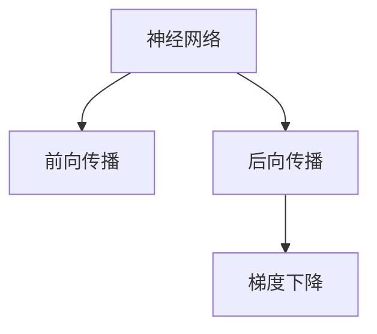

                 

# Backpropagation 原理与代码实战案例讲解

> 关键词：反向传播，神经网络，损失函数，梯度下降，PyTorch

## 1. 背景介绍

### 1.1 问题由来
反向传播（Backpropagation）是一种常用的神经网络训练方法，通过反向计算梯度，更新模型参数，以最小化损失函数。其核心思想是链式法则，将目标函数关于各个参数的导数逐层展开计算，从而得到每个参数的梯度信息。反向传播在深度学习中得到了广泛应用，是训练深度神经网络的重要工具。

### 1.2 问题核心关键点
理解反向传播的核心在于以下几个方面：

1. 链式法则的应用：如何将损失函数逐层展开，计算每个参数的梯度。
2. 梯度下降算法：如何根据梯度更新模型参数，最小化损失函数。
3. 反向传播的优化：如何避免梯度消失和梯度爆炸问题，提高训练效率。

这些关键点共同构成了反向传播的训练过程，决定了深度学习模型的性能和收敛速度。

## 2. 核心概念与联系

### 2.1 核心概念概述

为了更好地理解反向传播，本节将介绍几个关键概念：

- **神经网络（Neural Network）**：由多个层组成的计算模型，每层包含多个神经元，通过连接权重和激活函数进行信息传递。
- **损失函数（Loss Function）**：衡量模型预测与真实标签之间差异的函数，训练目标是最小化该函数。
- **梯度下降（Gradient Descent）**：基于梯度信息，更新模型参数，逐步接近最优解的优化算法。
- **反向传播（Backpropagation）**：利用链式法则，反向计算梯度，用于梯度下降优化。

这些概念之间的逻辑关系可以通过以下Mermaid流程图来展示：



这个流程图展示了大语言模型的核心概念及其之间的关系：

1. 神经网络通过前向传播计算输出。
2. 反向传播计算输出误差，逐层展开计算梯度。
3. 梯度下降利用梯度信息更新模型参数，优化模型性能。

这些概念共同构成了神经网络训练的完整流程，反向传播在其中扮演了关键角色。

## 3. 核心算法原理 & 具体操作步骤
### 3.1 算法原理概述

反向传播算法基于梯度下降，通过反向计算梯度，逐层更新模型参数。其核心思想是通过链式法则将损失函数关于模型参数的导数逐层展开，从而得到每个参数的梯度信息。以下将详细介绍反向传播的原理和具体操作步骤。

### 3.2 算法步骤详解

反向传播算法一般包括以下几个关键步骤：

**Step 1: 初始化参数**
- 随机初始化神经网络的权重和偏置参数。

**Step 2: 前向传播**
- 将输入数据逐层传递，通过激活函数进行非线性变换，得到最终的输出。

**Step 3: 计算损失函数**
- 将输出与真实标签计算损失函数，如均方误差、交叉熵等。

**Step 4: 反向传播**
- 从输出层开始，逐层计算损失函数对每个参数的梯度，直到输入层。

**Step 5: 梯度下降**
- 利用梯度信息，更新模型参数，使损失函数不断减小。

**Step 6: 重复迭代**
- 重复Step 2到Step 5，直至模型收敛。

### 3.3 算法优缺点

反向传播算法具有以下优点：
1. 简单高效。通过链式法则逐层计算梯度，易于实现。
2. 鲁棒性强。能够处理复杂非线性模型，适应性强。
3. 收敛速度快。梯度下降算法能够快速收敛，减少迭代次数。

同时，该算法也存在一些缺点：
1. 过拟合风险。反向传播容易陷入局部最优解，需要优化算法和正则化技术。
2. 计算复杂度高。反向传播需要计算多次前向传播和反向传播，计算量较大。
3. 参数量大。深度神经网络往往有大量参数，反向传播计算复杂度呈指数增长。
4. 梯度消失和梯度爆炸。反向传播过程中，梯度可能不断衰减或爆炸，影响训练效果。

尽管存在这些局限性，但就目前而言，反向传播仍然是训练深度神经网络的重要算法。未来相关研究的重点在于如何进一步优化反向传播算法，提高其训练效率和稳定性。

### 3.4 算法应用领域

反向传播算法在深度学习中得到了广泛应用，以下是几个典型的应用场景：

- **图像分类**：通过卷积神经网络（CNN）对图像进行分类，利用反向传播算法进行参数优化。
- **自然语言处理**：通过循环神经网络（RNN）或Transformer等模型进行文本分类、情感分析等任务，利用反向传播算法进行优化。
- **语音识别**：通过递归神经网络（RNN）对语音信号进行建模，利用反向传播算法进行训练。
- **强化学习**：通过神经网络对环境进行建模，利用反向传播算法进行参数更新。

## 4. 数学模型和公式 & 详细讲解 & 举例说明

### 4.1 数学模型构建

反向传播算法主要涉及以下几个数学模型：

- **神经网络结构**：由多个层组成，每层包含多个神经元。
- **激活函数**：常用的激活函数包括sigmoid、ReLU等，将输入信号进行非线性变换。
- **损失函数**：常用的损失函数包括均方误差（MSE）、交叉熵（Cross-Entropy）等，衡量模型预测与真实标签之间的差异。

### 4.2 公式推导过程

以下以一个简单的神经网络为例，推导反向传播的计算过程。

假设输入数据为 $x$，神经网络结构如下：

$$
y = \sigma(z) = \sigma(W^Tx + b)
$$

其中，$W$ 为权重矩阵，$b$ 为偏置向量，$\sigma$ 为激活函数。

定义损失函数为均方误差（MSE）：

$$
J(W, b) = \frac{1}{2N}\sum_{i=1}^N(y_i - \hat{y_i})^2
$$

其中，$y_i$ 为真实标签，$\hat{y_i}$ 为模型预测。

通过链式法则，计算损失函数关于 $W$ 和 $b$ 的梯度：

$$
\frac{\partial J}{\partial W} = \frac{1}{N}\sum_{i=1}^N(\hat{y_i} - y_i)\sigma'(z_i)\frac{\partial z_i}{\partial W}
$$

$$
\frac{\partial J}{\partial b} = \frac{1}{N}\sum_{i=1}^N(\hat{y_i} - y_i)\sigma'(z_i)
$$

其中，$\sigma'$ 为激活函数的导数，$\frac{\partial z_i}{\partial W} = \frac{\partial W^Tx_i}{\partial W} = x_i^T$。

通过反向传播，可以得到每个参数的梯度，从而进行梯度下降更新。

### 4.3 案例分析与讲解

以一个简单的回归任务为例，详细讲解反向传播算法的计算过程。

假设数据集包含 $N$ 个样本 $(x_i, y_i)$，其中 $x_i \in \mathbb{R}^d$，$y_i \in \mathbb{R}$。

定义神经网络结构如下：

$$
h = \sigma(W_1x + b_1)
$$

$$
y = \sigma(W_2h + b_2)
$$

其中，$h$ 为中间层输出，$y$ 为最终输出。

假设使用均方误差（MSE）作为损失函数：

$$
J(W_1, W_2, b_1, b_2) = \frac{1}{2N}\sum_{i=1}^N(y_i - \hat{y_i})^2
$$

其中，$\hat{y_i} = \sigma(W_2\sigma(W_1x_i + b_1) + b_2)$。

通过链式法则，计算损失函数关于 $W_1, W_2, b_1, b_2$ 的梯度：

$$
\frac{\partial J}{\partial W_1} = \frac{1}{N}\sum_{i=1}^N(\hat{y_i} - y_i)(\sigma'(h_i)\sigma'(z_i)\frac{\partial z_i}{\partial W_1})
$$

$$
\frac{\partial J}{\partial b_1} = \frac{1}{N}\sum_{i=1}^N(\hat{y_i} - y_i)(\sigma'(h_i)\sigma'(z_i))
$$

$$
\frac{\partial J}{\partial W_2} = \frac{1}{N}\sum_{i=1}^N(\hat{y_i} - y_i)(\sigma'(h_i)\sigma'(z_i)\frac{\partial z_i}{\partial W_2})
$$

$$
\frac{\partial J}{\partial b_2} = \frac{1}{N}\sum_{i=1}^N(\hat{y_i} - y_i)(\sigma'(h_i)\sigma'(z_i))
$$

其中，$h_i = \sigma(W_1x_i + b_1)$，$z_i = W_2h_i + b_2$，$\sigma'$ 为激活函数的导数，$\frac{\partial z_i}{\partial W_1} = \frac{\partial W_1x_i}{\partial W_1} = x_i^T$，$\frac{\partial z_i}{\partial W_2} = \frac{\partial W_2h_i}{\partial W_2} = \sigma(h_i)\sigma(z_i)$。

通过反向传播，可以得到每个参数的梯度，从而进行梯度下降更新。

## 5. 项目实践：代码实例和详细解释说明
### 5.1 开发环境搭建

在进行反向传播实践前，我们需要准备好开发环境。以下是使用Python进行PyTorch开发的环境配置流程：

1. 安装Anaconda：从官网下载并安装Anaconda，用于创建独立的Python环境。

2. 创建并激活虚拟环境：
```bash
conda create -n pytorch-env python=3.8 
conda activate pytorch-env
```

3. 安装PyTorch：根据CUDA版本，从官网获取对应的安装命令。例如：
```bash
conda install pytorch torchvision torchaudio cudatoolkit=11.1 -c pytorch -c conda-forge
```

4. 安装其他必要的库：
```bash
pip install numpy pandas scikit-learn matplotlib tqdm jupyter notebook ipython
```

完成上述步骤后，即可在`pytorch-env`环境中开始反向传播实践。

### 5.2 源代码详细实现

下面我们以一个简单的回归任务为例，给出使用PyTorch进行反向传播的PyTorch代码实现。

首先，定义训练集和测试集：

```python
import numpy as np
from torch.utils.data import Dataset, DataLoader
from torch import nn, optim

class RegressionDataset(Dataset):
    def __init__(self, X, y):
        self.X = X
        self.y = y
        
    def __len__(self):
        return len(self.X)
    
    def __getitem__(self, idx):
        x = self.X[idx]
        y = self.y[idx]
        return x, y

X_train = np.random.randn(100, 1)
y_train = X_train * 2 + 1 + np.random.randn(100, 1)
X_test = np.random.randn(100, 1)
y_test = X_test * 2 + 1 + np.random.randn(100, 1)

train_dataset = RegressionDataset(X_train, y_train)
test_dataset = RegressionDataset(X_test, y_test)
```

然后，定义模型和损失函数：

```python
class MLP(nn.Module):
    def __init__(self):
        super(MLP, self).__init__()
        self.fc1 = nn.Linear(1, 10)
        self.fc2 = nn.Linear(10, 1)
        
    def forward(self, x):
        x = self.fc1(x)
        x = nn.functional.relu(x)
        x = self.fc2(x)
        return x

model = MLP()
criterion = nn.MSELoss()
```

接着，定义训练和评估函数：

```python
def train_epoch(model, data_loader, optimizer, device):
    model.train()
    total_loss = 0
    for x, y in data_loader:
        x = x.to(device)
        y = y.to(device)
        optimizer.zero_grad()
        output = model(x)
        loss = criterion(output, y)
        loss.backward()
        optimizer.step()
        total_loss += loss.item()
    return total_loss / len(data_loader)

def evaluate(model, data_loader, device):
    model.eval()
    total_loss = 0
    with torch.no_grad():
        for x, y in data_loader:
            x = x.to(device)
            y = y.to(device)
            output = model(x)
            loss = criterion(output, y)
            total_loss += loss.item()
    return total_loss / len(data_loader)
```

最后，启动训练流程并在测试集上评估：

```python
epochs = 100
batch_size = 32
learning_rate = 0.01

device = torch.device('cuda') if torch.cuda.is_available() else torch.device('cpu')
model.to(device)

optimizer = optim.SGD(model.parameters(), lr=learning_rate)

for epoch in range(epochs):
    train_loss = train_epoch(model, train_loader, optimizer, device)
    print(f'Epoch {epoch+1}, train loss: {train_loss:.4f}')
    
    test_loss = evaluate(model, test_loader, device)
    print(f'Epoch {epoch+1}, test loss: {test_loss:.4f}')
```

以上就是使用PyTorch进行反向传播训练回归模型的完整代码实现。可以看到，通过简单的代码实现，即可实现基于反向传播的深度学习模型训练。

### 5.3 代码解读与分析

让我们再详细解读一下关键代码的实现细节：

**RegressionDataset类**：
- `__init__`方法：初始化数据集，存储输入和标签。
- `__len__`方法：返回数据集的样本数量。
- `__getitem__`方法：对单个样本进行处理，返回模型需要的输入和标签。

**MLP类**：
- `__init__`方法：定义模型结构，包含两个全连接层。
- `forward`方法：定义前向传播过程，通过激活函数进行非线性变换。

**train_epoch函数**：
- 在训练集上执行一个epoch的训练过程，包括前向传播、损失计算、梯度更新和参数更新。
- 使用Adam优化器进行梯度下降更新。
- 在每个epoch结束后，返回该epoch的平均损失。

**evaluate函数**：
- 在测试集上执行模型的评估过程，包括前向传播和损失计算。
- 返回测试集的平均损失。

**训练流程**：
- 定义总的epoch数、批大小和学习率。
- 在每个epoch开始时，使用`train_epoch`函数进行模型训练，输出当前epoch的平均损失。
- 在每个epoch结束时，使用`evaluate`函数进行模型评估，输出测试集的平均损失。

可以看到，通过简单的代码实现，即可实现基于反向传播的深度学习模型训练。在实际应用中，还需要根据具体任务和数据特点，对模型结构、损失函数、优化器等进行优化设计，以进一步提升模型的性能。

## 6. 实际应用场景

### 6.1 图像分类

反向传播在图像分类任务中得到了广泛应用，通过卷积神经网络（CNN）对图像进行分类，利用反向传播算法进行参数优化。例如，ImageNet大规模视觉识别挑战赛（ImageNet Large Scale Visual Recognition Challenge, ILSVRC）就是一个典型的图像分类任务，其数据集包含1000类物体，共有120万张训练图像和50000张测试图像。通过使用反向传播算法对CNN模型进行训练，能够在大量图像数据上进行高效优化，提升模型性能。

### 6.2 自然语言处理

反向传播在自然语言处理（NLP）任务中也得到了广泛应用，通过循环神经网络（RNN）或Transformer等模型进行文本分类、情感分析等任务，利用反向传播算法进行优化。例如，情感分析任务中，将文本数据作为输入，模型输出情感分类结果，通过反向传播算法更新模型参数，最小化损失函数，提升模型预测性能。

### 6.3 语音识别

反向传播在语音识别任务中也有广泛应用，通过递归神经网络（RNN）对语音信号进行建模，利用反向传播算法进行训练。例如，语音识别任务中，将语音信号转换为文本序列，模型输出识别结果，通过反向传播算法更新模型参数，最小化损失函数，提升模型识别性能。

### 6.4 强化学习

反向传播在强化学习中也有广泛应用，通过神经网络对环境进行建模，利用反向传播算法进行参数更新。例如，AlphaGo的深度学习模型中，使用反向传播算法更新模型参数，提升模型的策略选择能力，实现对围棋游戏的智能博弈。

## 7. 工具和资源推荐

### 7.1 学习资源推荐

为了帮助开发者系统掌握反向传播的理论基础和实践技巧，这里推荐一些优质的学习资源：

1. 《深度学习》（Ian Goodfellow等著）：该书详细介绍了深度学习的基本原理和算法，包括反向传播算法。

2. 《Python深度学习》（Francois Chollet著）：该书介绍了如何使用TensorFlow和Keras进行深度学习开发，其中包含了反向传播算法的详细讲解。

3. CS231n《卷积神经网络》课程：斯坦福大学开设的计算机视觉课程，系统介绍了卷积神经网络的结构和训练方法。

4. CS224n《自然语言处理与深度学习》课程：斯坦福大学开设的自然语言处理课程，系统介绍了NLP任务和深度学习模型。

5. PyTorch官方文档：PyTorch官方提供的详细文档，包含反向传播算法的详细实现和应用示例。

通过对这些资源的学习实践，相信你一定能够快速掌握反向传播的精髓，并用于解决实际的深度学习问题。

### 7.2 开发工具推荐

高效的开发离不开优秀的工具支持。以下是几款用于深度学习开发和反向传播算法的常用工具：

1. PyTorch：基于Python的开源深度学习框架，支持动态计算图，适合快速迭代研究。

2. TensorFlow：由Google主导开发的开源深度学习框架，支持静态计算图，生产部署方便。

3. TensorBoard：TensorFlow配套的可视化工具，可实时监测模型训练状态，提供丰富的图表呈现方式。

4. Keras：高级神经网络API，可以运行于TensorFlow、Theano、CNTK等后端，简化深度学习模型开发。

5. Weights & Biases：模型训练的实验跟踪工具，可以记录和可视化模型训练过程中的各项指标。

6. PyTorch Lightning：基于PyTorch的简化模型训练框架，支持分布式训练和自动实验管理。

合理利用这些工具，可以显著提升反向传播的开发效率，加快创新迭代的步伐。

### 7.3 相关论文推荐

反向传播算法在深度学习中得到了广泛应用，以下是几篇奠基性的相关论文，推荐阅读：

1. A Learning Algorithm for Deep Networks（1986年论文）：提出了反向传播算法，为深度神经网络训练奠定了基础。

2. Multilayer Perceptrons: An Introduction to Neural Networks and Deep Learning（1988年论文）：详细介绍了多层感知器（MLP）和反向传播算法，推动了深度学习的发展。

3. Convolutional Neural Networks for Visual Recognition（2012年论文）：提出了卷积神经网络（CNN），在图像分类任务中取得了优异性能。

4. Attention is All You Need（2017年论文）：提出了Transformer模型，引入了自注意力机制，提高了序列建模的性能。

5. Robust Backpropagation Algorithm with Stable Learning Rate（2015年论文）：提出了一种鲁棒反向传播算法，减少了梯度消失和梯度爆炸问题。

这些论文代表了大语言模型反向传播技术的发展脉络。通过学习这些前沿成果，可以帮助研究者把握学科前进方向，激发更多的创新灵感。

## 8. 总结：未来发展趋势与挑战

### 8.1 总结

本文对反向传播算法的原理和具体操作步骤进行了全面系统的介绍。首先阐述了反向传播的核心思想和训练过程，详细讲解了反向传播的数学模型和计算过程。其次，通过PyTorch代码实现，给出了反向传播算法的实践案例，进一步巩固了理论知识。同时，本文还广泛探讨了反向传播算法在图像分类、自然语言处理、语音识别、强化学习等多个领域的应用前景，展示了其强大的应用能力。

通过本文的系统梳理，可以看到，反向传播算法作为深度学习训练的核心算法，其原理和操作步骤简洁明了，易于理解和实现。在实际应用中，反向传播算法还需要结合具体任务和数据特点进行优化设计，方能得到理想的效果。未来，随着深度学习技术的不断进步，反向传播算法也将不断演进，为人工智能技术的发展带来新的突破。

### 8.2 未来发展趋势

展望未来，反向传播算法将呈现以下几个发展趋势：

1. **模型结构优化**：随着深度学习技术的不断发展，模型结构将不断优化，例如卷积神经网络（CNN）、循环神经网络（RNN）、Transformer等结构不断改进，提升了模型性能和训练效率。

2. **优化算法改进**：反向传播算法需要不断改进优化算法，例如动量法（Momentum）、自适应学习率算法（Adagrad、Adam等）、自适应权重衰减等，以提高训练速度和效果。

3. **参数高效优化**：反向传播算法需要不断优化参数更新策略，例如参数高效微调（PEFT）、自适应低秩适应（ALAR）等方法，在保证模型性能的同时，减少训练时间。

4. **分布式训练**：随着数据规模的不断增大，反向传播算法需要支持分布式训练，例如基于GPU、TPU的并行计算，以加速模型训练。

5. **融合多模态数据**：反向传播算法需要融合多模态数据进行训练，例如文本-图像、文本-语音、图像-语音等数据融合，提升模型的泛化能力。

6. **引入先验知识**：反向传播算法需要引入先验知识进行模型训练，例如知识图谱、逻辑规则等，提升模型的鲁棒性和泛化能力。

这些趋势表明，反向传播算法将不断演进，提升模型的性能和训练效率，更好地适应深度学习任务的需求。

### 8.3 面临的挑战

尽管反向传播算法已经取得了显著成就，但在深度学习技术的不断演进中，仍面临着一些挑战：

1. **计算资源瓶颈**：随着模型结构日益复杂，计算资源需求不断增加，如何高效利用计算资源，提升模型训练效率，是一个重要挑战。

2. **模型泛化能力**：反向传播算法需要不断提高模型的泛化能力，以应对新数据和新任务的挑战，避免过拟合和欠拟合。

3. **稳定性问题**：反向传播算法在训练过程中，容易出现梯度消失、梯度爆炸等问题，如何提高模型的稳定性，是一个亟需解决的问题。

4. **模型鲁棒性**：反向传播算法需要提高模型的鲁棒性，以应对异常数据和噪声数据的干扰，提升模型的稳健性。

5. **模型可解释性**：反向传播算法需要提升模型的可解释性，以提高模型的透明度和可信度。

6. **隐私和安全问题**：反向传播算法需要解决模型隐私和安全问题，以保护用户数据和模型信息。

7. **数据质量问题**：反向传播算法需要保证数据质量，避免数据偏差和数据泄露等问题。

这些挑战表明，反向传播算法在深度学习中仍需不断优化和改进，以应对实际应用中的复杂问题。

### 8.4 研究展望

面向未来，反向传播算法的研究方向可以从以下几个方面进行探索：

1. **深度学习理论研究**：进一步研究深度学习的基本原理和理论，例如神经网络的结构优化、损失函数的改进、正则化技术等，为深度学习算法提供理论支撑。

2. **模型优化算法研究**：进一步研究优化算法，例如自适应学习率算法、参数高效优化算法、分布式训练算法等，提升深度学习模型的训练效率和效果。

3. **多模态学习研究**：进一步研究多模态数据融合技术，例如文本-图像、文本-语音、图像-语音等数据融合，提升模型的泛化能力和鲁棒性。

4. **先验知识融合研究**：进一步研究先验知识融合技术，例如知识图谱、逻辑规则等，提升模型的鲁棒性和泛化能力。

5. **隐私和安全研究**：进一步研究模型的隐私和安全问题，例如差分隐私、联邦学习等技术，保护用户数据和模型信息。

6. **数据质量研究**：进一步研究数据质量问题，例如数据预处理、数据增强等技术，提升模型的鲁棒性和泛化能力。

这些研究方向表明，反向传播算法的研究需要不断创新和突破，以应对深度学习技术的不断演进，更好地适应深度学习任务的需求。

## 9. 附录：常见问题与解答

**Q1：反向传播算法中，如何避免梯度消失和梯度爆炸问题？**

A: 梯度消失和梯度爆炸是反向传播算法中常见的问题。为避免这些问题，可以采取以下策略：

1. 使用激活函数：ReLU、LeakyReLU等激活函数能够抑制梯度消失，LeakyReLU在负数输入时保留一小部分梯度，避免了梯度消失。

2. 权重初始化：合理的权重初始化方法，如Xavier初始化、He初始化等，能够避免梯度爆炸，保持参数的稳定性。

3. 参数高效优化：使用参数高效优化方法，如Adam、Adagrad等自适应学习率算法，能够减少参数更新量，避免梯度爆炸。

4. 梯度裁剪：通过梯度裁剪技术，限制梯度的范围，避免梯度爆炸。

5. 梯度累积：通过梯度累积技术，减小梯度更新量，避免梯度消失。

**Q2：反向传播算法中，如何选择适当的损失函数？**

A: 损失函数的选择对模型的性能和优化效果有重要影响。常见的损失函数包括均方误差（MSE）、交叉熵（Cross-Entropy）、对数似然损失等，具体选择应根据任务特点来决定。

1. 回归任务：常用的损失函数为均方误差（MSE），能够有效衡量模型预测和真实值之间的差异。

2. 分类任务：常用的损失函数为交叉熵（Cross-Entropy），能够有效衡量模型预测和真实标签之间的差异。

3. 多分类任务：常用的损失函数为多分类交叉熵（Categorical Cross-Entropy），能够有效衡量模型预测和真实标签之间的差异。

4. 序列生成任务：常用的损失函数为负对数似然（Negative Log-Likelihood），能够有效衡量模型预测和真实标签之间的差异。

5. 目标检测任务：常用的损失函数为交叉熵（Cross-Entropy）和IoU（Intersection over Union）等，能够有效衡量模型预测和真实标签之间的差异。

**Q3：反向传播算法中，如何设置合适的学习率？**

A: 学习率的设置对模型的性能和收敛速度有重要影响。一般建议从1e-3开始调参，逐步减小学习率，直至收敛。

1. 固定学习率：常用于简单模型，可以采用固定学习率，如0.01、0.001等。

2. 学习率衰减：常用于复杂模型，可以采用学习率衰减策略，如逐步减小学习率。

3. 动量法（Momentum）：常用于解决梯度下降的震荡问题，能够加速收敛。

4. 自适应学习率算法：常用于复杂模型，如Adam、Adagrad等算法，能够根据梯度信息动态调整学习率。

5. 学习率调度策略：常用于复杂模型，如Learning Rate Schedule，能够根据训练进度动态调整学习率。

**Q4：反向传播算法中，如何进行正则化？**

A: 正则化技术是防止过拟合的重要手段，常见的正则化技术包括L1正则、L2正则、Dropout等。

1. L1正则：常用于减少参数数量，能够防止过拟合。

2. L2正则：常用于防止过拟合，能够约束参数的大小。

3. Dropout：常用于减少模型复杂度，能够防止过拟合。

4. Early Stopping：常用于防止过拟合，能够停止训练，防止模型过度拟合训练数据。

5. 数据增强：常用于增加训练数据的多样性，能够防止过拟合。

6. 权重衰减：常用于防止过拟合，能够约束参数的大小。

**Q5：反向传播算法中，如何进行模型调优？**

A: 模型调优是提高模型性能的重要手段，常见的模型调优方法包括超参数调优、网络结构调优、学习率调优等。

1. 超参数调优：常用于调整模型的超参数，如学习率、批大小等，能够提高模型性能。

2. 网络结构调优：常用于调整模型结构，如增加或减少层数、调整神经元数量等，能够提高模型性能。

3. 学习率调优：常用于调整学习率，如固定学习率、学习率衰减、自适应学习率等，能够提高模型性能。

4. 数据增强：常用于增加训练数据的多样性，能够提高模型性能。

5. 权重衰减：常用于防止过拟合，能够提高模型性能。

6. 梯度裁剪：常用于防止梯度爆炸，能够提高模型性能。

7. 参数高效优化：常用于减少参数更新量，能够提高模型性能。

通过以上步骤，可以更好地掌握反向传播算法的原理和实现，应对实际应用中的复杂问题。在实际应用中，还需要根据具体任务和数据特点，进行针对性的模型调优，以得到更好的模型效果。

