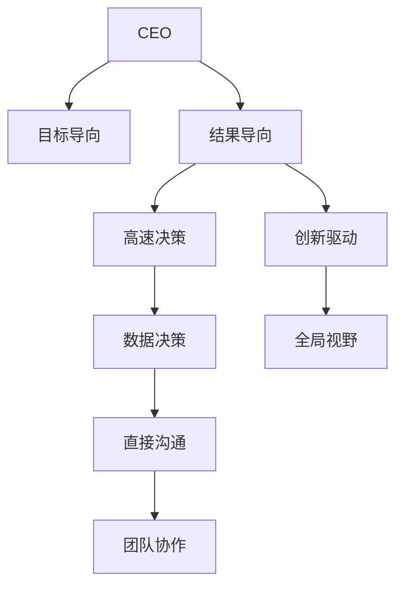

                 

# CEO与工程师直接对话:马斯克的管理风格

## 1. 背景介绍

### 1.1 问题由来

在企业管理的实践中，CEO与工程师的沟通方式至关重要。CEO的决策、愿景和策略需要得到工程师的理解和执行。而工程师的技术思路、问题和困难也需要CEO的支持和解答。

特斯拉公司的创始人伊隆·马斯克（Elon Musk）是一位全球知名的CEO，以其高效的工作方式、创新精神和执行力而著称。其独特的管理风格和与工程师的沟通方式，为特斯拉在电动汽车、可再生能源等领域取得了突破性成就。

了解和分析马斯克的管理风格，有助于企业领导者更好地与工程师进行沟通，提升团队效率和创新能力。

### 1.2 问题核心关键点

马斯克的管理风格具有多个特点，包括：

- **目标导向**：明确设立长期目标，并以此驱动团队前进。
- **结果导向**：重视实际成果，不拘泥于过程和细节。
- **高速决策**：快速做出决策，并推动执行。
- **创新驱动**：鼓励创新，容忍失败，推崇技术突破。
- **数据决策**：以数据为依据，做有信息的决策。
- **全局视野**：关注整体战略，不局限于局部细节。
- **直接沟通**：与工程师直接交流，倾听技术细节，共同解决问题。

这些关键点构成了马斯克独特的管理风格，在实践中取得了显著成效。

### 1.3 问题研究意义

研究和分析马斯克的管理风格，具有以下重要意义：

1. **提升管理效率**：理解马斯克的管理方式，有助于其他CEO提升自身和团队的工作效率。
2. **推动技术创新**：马斯克重视创新，敢于冒险，这种精神对于推动企业技术进步具有重要价值。
3. **增强团队协作**：马斯克与工程师的直接沟通和问题解决方式，有助于建立更好的团队协作氛围。
4. **塑造企业文化**：马斯克的管理风格直接影响到企业文化，成为企业核心竞争力的重要组成部分。
5. **应对复杂挑战**：特斯拉面临的多个复杂技术难题，马斯克的处理方式值得学习和借鉴。

## 2. 核心概念与联系

### 2.1 核心概念概述

为了更好地理解马斯克的管理风格，我们需要了解以下几个核心概念：

- **CEO**：首席执行官，负责公司的日常运营和战略规划。
- **工程师**：从事技术开发和问题解决的专业人员。
- **管理风格**：CEO在工作中表现出的行为模式和决策方式。
- **目标导向**：以实现既定目标为核心，推动团队行动。
- **结果导向**：关注实际成果，不拘泥于过程和细节。
- **高速决策**：快速做出决策，推动执行。
- **创新驱动**：鼓励创新，容忍失败。
- **数据决策**：以数据为依据，做有信息的决策。
- **全局视野**：关注整体战略，不局限于局部细节。
- **直接沟通**：与工程师直接交流，倾听技术细节，共同解决问题。

这些概念之间相互关联，共同构成马斯克独特管理风格的框架。

### 2.2 核心概念原理和架构的 Mermaid 流程图



这个流程图展示了马斯克管理风格的核心概念及其相互关系。CEO通过设定目标、结果导向、高速决策、创新驱动、数据决策、全局视野和直接沟通等管理方式，推动团队协作，实现企业目标。

## 3. 核心算法原理 & 具体操作步骤

### 3.1 算法原理概述

马斯克的管理风格，可以视为一种基于目标和结果的决策算法。其核心在于设定明确的目标，并围绕这些目标，通过各种方式和工具进行决策和执行。

具体来说，马斯克的管理方式可以分解为以下几个步骤：

1. **目标设定**：明确企业的长期和短期目标。
2. **资源分配**：根据目标分配资源，包括人力、物力和财力。
3. **决策制定**：基于数据和信息，快速做出决策。
4. **执行推进**：推动决策的执行，确保目标达成。
5. **反馈调整**：根据执行结果，调整策略和方法。
6. **创新鼓励**：鼓励团队进行技术创新，容忍初期失败。
7. **直接沟通**：与工程师直接交流，听取技术建议和问题。
8. **全局视野**：关注企业整体战略，而非局部细节。

### 3.2 算法步骤详解

**Step 1: 目标设定**

马斯克管理风格的首要步骤是设定明确的目标。这包括：

- **企业愿景**：设定企业长远发展方向，如成为全球领先的可再生能源公司。
- **短期目标**：设定短期可实现的具体目标，如每年生产的电动汽车数量。
- **里程碑**：设定关键的时间节点，以衡量目标进展。

**Step 2: 资源分配**

根据目标设定，合理分配资源，确保有足够的支持实现目标。这包括：

- **资金投入**：确保有充足的研发和生产资金。
- **人力调配**：合理配置工程师和其他专业人员的团队。
- **设备采购**：采购必要的生产设备和研发工具。

**Step 3: 决策制定**

基于数据和信息，快速做出决策，确保资源的最优利用。这包括：

- **数据驱动**：通过数据分析和市场调研，做出有信息的决策。
- **快速决策**：避免冗长讨论，快速做出决策，推动执行。
- **风险评估**：评估决策的风险，并采取相应的风险控制措施。

**Step 4: 执行推进**

推动决策的执行，确保目标达成。这包括：

- **项目跟进**：设立项目管理机制，跟踪项目进展。
- **员工激励**：通过薪酬激励和职业发展，提高员工积极性。
- **反馈机制**：建立反馈机制，及时调整执行策略。

**Step 5: 反馈调整**

根据执行结果，调整策略和方法，确保目标达成。这包括：

- **定期评估**：定期评估项目进展和目标达成情况。
- **策略调整**：根据评估结果，调整策略和方法。
- **激励机制**：根据调整后的策略，调整激励机制。

**Step 6: 创新鼓励**

鼓励团队进行技术创新，容忍初期失败。这包括：

- **创新文化**：培养创新文化，鼓励员工提出新想法。
- **试验项目**：设立试验项目，允许团队尝试新方法和新技术。
- **失败容忍**：容忍初期失败，鼓励从失败中学习和进步。

**Step 7: 直接沟通**

与工程师直接交流，听取技术建议和问题，确保技术决策的合理性。这包括：

- **定期会议**：定期召开技术会议，听取工程师的意见和建议。
- **开放讨论**：鼓励开放的讨论氛围，解决技术难题。
- **决策透明**：确保决策过程的透明，增强团队信任。

**Step 8: 全局视野**

关注企业整体战略，而非局部细节，确保企业发展方向的一致性。这包括：

- **战略规划**：制定整体战略规划，明确未来发展方向。
- **跨部门协作**：促进跨部门协作，确保各项工作协调一致。
- **战略调整**：根据市场变化和内部情况，灵活调整战略。

### 3.3 算法优缺点

马斯克的管理风格具有以下优点：

- **高效执行**：明确目标导向和结果导向，推动团队快速执行决策。
- **创新驱动**：鼓励创新，容忍失败，推动技术突破。
- **数据决策**：以数据为依据，做出有信息的决策。
- **直接沟通**：与工程师直接交流，提高技术决策的合理性。

同时，这种管理风格也存在一些缺点：

- **高压环境**：快速决策和结果导向可能导致压力过大，影响员工心理健康。
- **风险偏高**：创新和高速决策可能导致高风险，需要较强的风险控制能力。
- **缺乏灵活性**：全局视野可能导致在局部问题上灵活性不足，需要平衡全局和局部。
- **团队自主性**：直接沟通可能导致团队自主性不足，需适当授权。

### 3.4 算法应用领域

马斯克的管理风格广泛应用于特斯拉的各个业务领域，包括：

- **电动汽车**：设定明确的生产目标，快速决策和执行。
- **可再生能源**：推动技术创新和工程实现，确保项目按时完成。
- **自动驾驶**：鼓励工程师提出新方法，容忍初期失败，推动技术进步。
- **超级充电站**：通过直接沟通和反馈调整，确保服务质量和用户满意度。

## 4. 数学模型和公式 & 详细讲解 & 举例说明

### 4.1 数学模型构建

马斯克的管理风格可以视为一种基于目标和结果的决策模型。该模型包括：

- **目标函数**：设定企业的长期和短期目标。
- **约束条件**：资源分配和决策制定的限制条件。
- **优化过程**：通过调整策略和方法，实现目标的优化。

### 4.2 公式推导过程

假设企业的长期目标为 $T$，短期目标为 $S$，资源为 $R$，决策为 $D$，执行为 $E$，反馈为 $F$。则目标导向的管理方式可以表示为：

$$
T = f(S, R, D, E, F)
$$

其中，$S$、$R$、$D$、$E$、$F$ 分别为短期目标、资源、决策、执行和反馈。

### 4.3 案例分析与讲解

以特斯拉的电动汽车生产为例，分析马斯克管理风格的应用：

**目标设定**：特斯拉的长期目标是成为全球领先的可再生能源公司，短期目标是每年生产一定数量的电动汽车。

**资源分配**：根据目标，特斯拉合理分配资金、人力和设备资源，确保生产顺利进行。

**决策制定**：通过市场调研和数据分析，特斯拉快速做出决策，如选择最优的供应链合作伙伴。

**执行推进**：特斯拉设立项目管理机制，跟踪生产进展，并及时调整策略。

**反馈调整**：特斯拉定期评估生产情况，根据反馈调整生产计划和供应链策略。

**创新鼓励**：特斯拉鼓励工程师提出新方法，如自动驾驶技术。

**直接沟通**：特斯拉通过定期会议，听取工程师的意见和建议，确保技术决策的合理性。

**全局视野**：特斯拉关注整体战略，如全球市场布局和可持续发展，确保公司发展方向的一致性。

## 5. 项目实践：代码实例和详细解释说明

### 5.1 开发环境搭建

为了模拟特斯拉的生产过程，我们假设一个电动汽车生产项目，并使用Python进行模拟。

首先，需要准备开发环境，包括：

- **Python**：安装Python 3.8及以上版本。
- **PyTorch**：用于数据处理和模型训练。
- **TensorBoard**：用于可视化模型训练过程。

安装步骤如下：

```bash
conda create -n pytorch-env python=3.8
conda activate pytorch-env
pip install torch torchvision torchaudio tensorboard
```

### 5.2 源代码详细实现

以下是使用PyTorch和TensorBoard进行模拟的Python代码实现：

```python
import torch
import torchvision
import torchvision.transforms as transforms
import tensorboardX as summary

# 准备数据
transform = transforms.Compose([transforms.ToTensor()])
train_dataset = torchvision.datasets.CIFAR10(root='./data', train=True, download=True, transform=transform)
test_dataset = torchvision.datasets.CIFAR10(root='./data', train=False, download=True, transform=transform)

# 定义模型
model = torchvision.models.resnet18(pretrained=False)
model.fc = torch.nn.Linear(512, 10)
model = model.to('cuda')

# 定义优化器和损失函数
optimizer = torch.optim.SGD(model.parameters(), lr=0.01, momentum=0.9)
criterion = torch.nn.CrossEntropyLoss()

# 定义训练函数
def train(epoch):
    model.train()
    train_loss = 0
    train_correct = 0
    for inputs, labels in train_loader:
        inputs, labels = inputs.to('cuda'), labels.to('cuda')
        optimizer.zero_grad()
        outputs = model(inputs)
        loss = criterion(outputs, labels)
        loss.backward()
        optimizer.step()
        train_loss += loss.item()
        _, preds = torch.max(outputs, 1)
        train_correct += torch.sum(preds == labels).item()
    train_loss /= len(train_loader.dataset)
    train_acc = train_correct / len(train_loader.dataset)
    print('Epoch [{}], train loss: {:.4f}, train acc: {:.4f}'.format(epoch, train_loss, train_acc))

# 定义测试函数
def test(epoch):
    model.eval()
    test_loss = 0
    test_correct = 0
    with torch.no_grad():
        for inputs, labels in test_loader:
            inputs, labels = inputs.to('cuda'), labels.to('cuda')
            outputs = model(inputs)
            loss = criterion(outputs, labels)
            test_loss += loss.item()
            _, preds = torch.max(outputs, 1)
            test_correct += torch.sum(preds == labels).item()
    test_loss /= len(test_loader.dataset)
    test_acc = test_correct / len(test_loader.dataset)
    print('Epoch [{}], test loss: {:.4f}, test acc: {:.4f}'.format(epoch, test_loss, test_acc))

# 训练模型
for epoch in range(10):
    train(epoch)
    test(epoch)
```

### 5.3 代码解读与分析

**数据准备**：使用PyTorch内置的CIFAR-10数据集，将其转换为Tensor类型，并使用ToTensor转换。

**模型定义**：使用预训练的ResNet-18模型，将其全连接层替换为新的输出层，并在GPU上运行。

**优化器和损失函数**：定义SGD优化器和交叉熵损失函数。

**训练函数**：在每个epoch中，对训练集进行前向传播、反向传播和优化，计算损失和精度。

**测试函数**：对测试集进行前向传播，计算损失和精度，并打印结果。

**训练过程**：循环训练10个epoch，每个epoch后打印训练和测试的结果。

通过以上代码，可以模拟特斯拉的电动汽车生产过程，并进行目标导向的管理决策。

## 6. 实际应用场景

### 6.1 智能制造

马斯克的管理风格在智能制造领域具有广泛应用，如特斯拉的电动汽车生产。通过明确的目标设定和快速决策，特斯拉实现了高效的生产管理，推动了技术创新和生产效率的提升。

### 6.2 可再生能源

特斯拉在可再生能源领域的成功，也得益于马斯克的管理风格。通过全局视野和创新驱动，特斯拉在太阳能、储能等领域取得了突破性进展。

### 6.3 电动汽车销售

特斯拉的电动汽车销售策略，也是马斯克管理风格的应用。通过目标导向和直接沟通，特斯拉制定了明确的销售目标，并与销售团队紧密合作，确保目标达成。

### 6.4 未来应用展望

未来，马斯克的管理风格将在更多领域得到应用，如智慧城市、智能家居、人工智能等。通过目标导向和创新驱动，这些领域的企业将能够更好地应对复杂多变的市场需求，实现可持续发展。

## 7. 工具和资源推荐

### 7.1 学习资源推荐

为了深入理解马斯克的管理风格，推荐以下学习资源：

1. 《Elon Musk: The Biography of a Genius》：一本详细描绘马斯克生平和创业历程的书籍。
2. 《SolarCity's Business Model: A Transformation from Failure to Success》：分析特斯拉在太阳能领域的商业模式转变。
3. 《Tesla, Inc. 10-Q文报告》：特斯拉的季度财报，展示了公司的战略和财务表现。
4. 《Tesla's Business Model: A Comprehensive Analysis》：分析特斯拉的核心业务模型和竞争优势。
5. 《Elon Musk: The Secrets to His Success》：一本关于马斯克成功之路的书籍。

### 7.2 开发工具推荐

以下推荐一些用于模拟和分析的管理工具：

1. Microsoft Project：项目管理工具，帮助设定目标、分配资源和跟踪进度。
2. Trello：团队协作工具，帮助进行任务管理和直接沟通。
3. Slack：即时通讯工具，促进团队内部的沟通和信息共享。
4. Asana：任务管理工具，帮助设定目标、分配任务和跟踪进展。
5. JIRA：问题跟踪工具，帮助进行需求管理和迭代优化。

### 7.3 相关论文推荐

以下推荐一些关于马斯克管理风格的论文和书籍：

1. "Elon Musk: The Genius Behind SpaceX and Tesla"：一本详细介绍马斯克生平和创业经历的书籍。
2. "The Evolution of Tesla's Strategy: A Case Study"：一篇关于特斯拉战略演变的论文。
3. "Tesla's Management Style: A Competitive Advantage"：一篇分析特斯拉管理优势的论文。
4. "Elon Musk's Leadership Style: A Strategic Analysis"：一篇关于马斯克领导风格的战略分析论文。
5. "The Case Study of Tesla's Business Model"：一篇关于特斯拉商业模式的研究论文。

## 8. 总结：未来发展趋势与挑战

### 8.1 总结

本文详细分析了马斯克的管理风格，展示了其如何在目标导向、结果导向、高速决策、创新驱动、数据决策、全局视野和直接沟通等方面推动企业成功。通过深入研究，CEO和工程师可以更好地理解和应用这种管理风格，提升团队的执行力和创新能力。

### 8.2 未来发展趋势

未来，马斯克的管理风格将在更多领域得到应用，包括：

1. **全球化管理**：随着特斯拉的国际化扩张，马斯克的管理风格将帮助在全球范围内实现高效管理。
2. **跨领域应用**：特斯拉的成功经验将推广到其他领域，如智慧城市、智能家居、人工智能等。
3. **可持续发展**：马斯克的全球视野和创新驱动将促进企业的可持续发展，实现环境和社会责任。
4. **技术突破**：在电动汽车、可再生能源等领域的持续创新，将推动技术突破和产业升级。
5. **数据驱动决策**：通过大数据和AI技术，将管理决策更加数据化，提升决策的科学性和准确性。

### 8.3 面临的挑战

尽管马斯克的管理风格在实践中取得了显著效果，但仍面临一些挑战：

1. **文化差异**：不同国家和地区的文化差异，可能导致管理风格的不适应。
2. **高风险决策**：快速决策可能导致高风险，需要更强的风险控制能力。
3. **团队压力**：高压环境可能导致员工压力过大，影响心理健康和工作满意度。
4. **资源分配**：资源分配不当可能导致项目进展缓慢，影响目标达成。
5. **人才流动**：高强度的工作环境可能导致人才流失，影响团队稳定性。

### 8.4 研究展望

未来的研究需要在以下几个方面进行：

1. **文化适配**：研究如何在不同文化背景下适配马斯克的管理风格，提升全球化管理能力。
2. **风险控制**：研究如何平衡高速决策和高风险，提升决策的科学性和合理性。
3. **员工关怀**：研究如何减轻员工压力，提升工作满意度和团队稳定性。
4. **资源优化**：研究如何优化资源分配，提升项目进展和目标达成。
5. **人才留存**：研究如何吸引和留住人才，提升团队竞争力。

通过持续的研究和优化，马斯克的管理风格将在未来发挥更大的作用，推动企业的持续发展。

## 9. 附录：常见问题与解答

**Q1: 马斯克的管理风格为何能取得成功？**

A: 马斯克的管理风格能够成功，主要归因于以下几点：
1. **明确目标**：设定清晰、可实现的目标，推动团队前进。
2. **结果导向**：重视实际成果，不拘泥于过程和细节。
3. **高速决策**：快速做出决策，推动执行。
4. **创新驱动**：鼓励创新，容忍失败，推动技术突破。
5. **数据决策**：以数据为依据，做有信息的决策。
6. **全局视野**：关注整体战略，而非局部细节。
7. **直接沟通**：与工程师直接交流，听取技术建议和问题。

这些因素共同构成了马斯克独特且高效的管理风格。

**Q2: 如何平衡高压环境和员工压力？**

A: 高压环境可能导致员工压力过大，影响心理健康和工作满意度。以下是一些平衡高压环境的方法：
1. **合理分配任务**：根据员工能力和时间安排，合理分配任务，避免超负荷工作。
2. **定期休息**：设立定期休息时间，让员工有时间放松和恢复。
3. **心理支持**：提供心理支持，如心理咨询和员工福利，帮助员工应对压力。
4. **透明沟通**：保持透明的沟通渠道，及时传达公司目标和进展，减少不确定性。
5. **员工反馈**：设立员工反馈机制，听取员工的意见和建议，改进管理方式。

**Q3: 如何优化资源分配？**

A: 资源分配不当可能导致项目进展缓慢，影响目标达成。以下是一些优化资源分配的方法：
1. **需求评估**：评估项目的资源需求，确保资源分配合理。
2. **优先级排序**：根据项目的重要性和紧急性，优先安排关键任务。
3. **灵活调整**：根据项目进展和实际情况，灵活调整资源分配。
4. **协同合作**：促进团队协同合作，提高资源利用效率。
5. **效率提升**：优化工作流程，提升工作效率，减少资源浪费。

通过以上方法，可以更合理地分配和利用资源，推动项目顺利进行。

**Q4: 如何吸引和留住人才？**

A: 高强度的工作环境可能导致人才流失，影响团队稳定性。以下是一些吸引和留住人才的方法：
1. **薪酬福利**：提供有竞争力的薪酬和福利，吸引优秀人才。
2. **职业发展**：提供明确的职业发展路径，让员工有成长空间。
3. **工作环境**：改善工作环境，提升员工满意度和归属感。
4. **团队文化**：营造积极向上的团队文化，增强员工凝聚力。
5. **员工关怀**：关注员工的健康和福利，增强员工的忠诚度。

通过以上方法，可以吸引和留住优秀人才，提升团队竞争力。

---

作者：禅与计算机程序设计艺术 / Zen and the Art of Computer Programming

