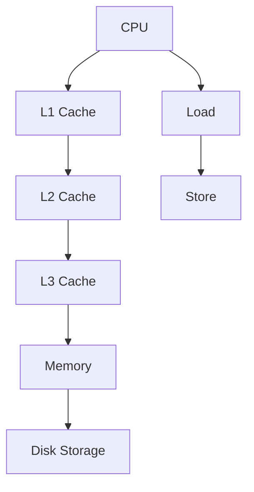

                 

# CPU的存储层次结构优化

> 关键词：CPU, 存储层次结构, 缓存, 内存, 磁盘, 优化, 性能

## 1. 背景介绍

### 1.1 问题由来
随着计算机硬件的快速发展，现代CPU在主频和核心数量上取得了显著提升。然而，由于CPU和内存之间的速度差距不断拉大，性能瓶颈逐渐从CPU向内存转移。这一问题，被称为“内存墙”(Memory Wall)，严重制约了CPU的性能释放。为了应对内存墙的挑战，CPU架构设计师引入了一系列存储层次结构优化技术，旨在提升内存系统整体效率，充分发挥CPU的计算潜力。

### 1.2 问题核心关键点
优化CPU的存储层次结构，是提升内存系统性能、改善整体系统吞吐量的关键。CPU存储层次结构包括缓存(Cache)、主存(Memory)和磁盘(Storage)，各层次间的速度和容量差异显著。通过合理设计和管理这些层次，可以有效缩小性能鸿沟，提升系统效率。

## 2. 核心概念与联系

### 2.1 核心概念概述

为了深入理解CPU存储层次结构的优化方法，本节将介绍几个关键概念：

- **CPU缓存(Cache)**：位于CPU和内存之间，是CPU访问数据的高效存储单元。缓存的大小、组织方式和替换策略对性能影响巨大。常见的缓存类型包括L1、L2、L3缓存等，其中L1缓存速度最快但容量最小。
- **内存(Memory)**：CPU直接访问的数据存储区域，包括DRAM(动态随机存取内存)和SRAM(静态随机存取内存)。内存速度相对较慢，但容量较大，适用于存储大量数据。
- **磁盘(Storage)**：永久存储数据的外部设备，用于存储操作系统、程序、数据等。磁盘速度慢、容量大，访问开销显著。
- **存储层次结构**：CPU通过多级缓存和内存系统，形成了一个层次结构，每一级缓存或内存都比其下层有更快的访问速度和更低的访问延迟，但容量和单位价格更高。

### 2.2 核心概念原理和架构的 Mermaid 流程图(Mermaid 流程节点中不要有括号、逗号等特殊字符)



这个流程图展示了CPU存储层次结构的基本构成，从CPU到磁盘，数据依次通过L1、L2、L3缓存和内存进行缓存和存储。

## 3. 核心算法原理 & 具体操作步骤

### 3.1 算法原理概述

CPU存储层次结构优化，本质上是设计合适的缓存和内存策略，最大化内存系统的利用率，减少内存访问延迟，提升数据传输速度。其核心在于，利用不同层次缓存的访问特点，通过预取、重用、缓存一致性等机制，减少CPU对低层次缓存的访问，从而提升整体系统性能。

### 3.2 算法步骤详解

基于上述优化目标，CPU的存储层次结构优化通常包括以下关键步骤：

**Step 1: 缓存层次设计**
- 根据任务特点，选择各级缓存的大小、组织方式和替换策略。
- 设计多级缓存间的数据传输策略，减少缓存未命中。

**Step 2: 预取与重用**
- 利用缓存一致性协议，实现缓存预取和重用。
- 在多核环境下，利用多核缓存一致性协议，避免数据竞争和缓存一致性问题。

**Step 3: 性能监控与调优**
- 使用性能监控工具，实时监测缓存命中率、访问延迟等指标。
- 根据性能监控结果，调整缓存策略和硬件配置，优化系统性能。

**Step 4: 异常处理**
- 针对缓存未命中、数据冲突等异常情况，设计缓存失效和异常处理机制。
- 优化异常处理逻辑，降低异常情况对系统性能的影响。

### 3.3 算法优缺点

CPU存储层次结构优化的优点包括：
1. 显著降低内存墙效应，提升系统整体性能。
2. 通过缓存一致性等机制，提升数据传输和访问效率。
3. 支持多核环境下并行处理，优化并行性能。

缺点则主要包括：
1. 缓存设计复杂，需要根据具体应用场景进行调整。
2. 缓存一致性协议复杂，容易产生数据竞争和一致性问题。
3. 异常处理复杂，需要精细化优化。

### 3.4 算法应用领域

CPU存储层次结构优化技术，广泛应用于各种高性能计算系统、嵌入式系统、服务器系统等领域。例如：

- 高性能计算：通过多级缓存和内存优化，提升并行计算效率。
- 嵌入式系统：优化缓存设计，提升嵌入式设备的性能和响应速度。
- 服务器系统：优化服务器缓存策略，提升数据中心性能。
- 网络应用：优化网络缓存策略，提升网络传输效率。

## 4. 数学模型和公式 & 详细讲解 & 举例说明

### 4.1 数学模型构建

为了数学化描述CPU存储层次结构优化，本文定义几个关键变量：

- $C_L$：L1缓存大小，单位为字节。
- $C_L2$：L2缓存大小，单位为字节。
- $C_L3$：L3缓存大小，单位为字节。
- $M$：主存大小，单位为字节。
- $S$：磁盘存储大小，单位为字节。
- $h_L$：L1缓存命中率，0-1之间的小数。
- $h_L2$：L2缓存命中率，0-1之间的小数。
- $h_L3$：L3缓存命中率，0-1之间的小数。

设CPU执行一条指令需要从缓存中读取数据，如果缓存未命中，则需要从主存读取，计算指令执行时间 $T$ 的公式为：

$$
T = h_L t_L + (1 - h_L)(1 - h_L2)t_{L2} + (1 - h_L)(1 - h_L2)(1 - h_L3)t_{L3} + (1 - h_L)(1 - h_L2)(1 - h_L3)t_M + (1 - h_L)(1 - h_L2)(1 - h_L3)t_S
$$

其中 $t_L, t_{L2}, t_{L3}, t_M, t_S$ 分别为L1、L2、L3缓存、主存、磁盘的访问时间，单位为时钟周期。

### 4.2 公式推导过程

根据上述公式，我们可以进一步推导出CPU指令执行时间的数学表达式。假设 $h_L=0.9, t_L=1ns, t_{L2}=4ns, t_{L3}=20ns, t_M=100ns, t_S=1ms$，则一条指令的执行时间计算如下：

$$
T = 0.9(1ns) + (1 - 0.9)(1 - 0.9)(4ns) + (1 - 0.9)(1 - 0.9)(1 - 0.9)(20ns) + (1 - 0.9)(1 - 0.9)(1 - 0.9)(100ns) + (1 - 0.9)(1 - 0.9)(1 - 0.9)(1ms)
$$

通过计算可得：

$$
T = 1.81ns
$$

可以看到，缓存策略对指令执行时间的影响巨大。如果命中率高，则访问速度接近L1缓存速度；否则，访问速度接近磁盘速度。

### 4.3 案例分析与讲解

下面以一个具体的案例来说明CPU存储层次结构优化的效果。假设一个服务器需要频繁执行矩阵乘法操作，由于矩阵数据量较大，需要频繁从主存和磁盘读取。使用不同缓存策略，服务器性能会有显著差异。

**案例1: 无缓存策略**
- 假设服务器无缓存，所有操作均直接从主存和磁盘读取，计算指令执行时间为：
$$
T = (1 - h_M)t_M + (1 - h_M)t_S
$$
其中 $h_M$ 为主存命中率，$t_M$ 和 $t_S$ 分别为主存和磁盘的访问时间。假设 $h_M=0.6, t_M=100ns, t_S=1ms$，则计算指令执行时间为：
$$
T = 0.4(100ns) + 0.4(1ms) = 440ns
$$

**案例2: L1缓存策略**
- 假设服务器配置L1缓存，命中率为 $h_L=0.9$，其他参数不变，计算指令执行时间为：
$$
T = h_Lt_L + (1 - h_L)(1 - h_L2)t_{L2} + (1 - h_L)(1 - h_L2)(1 - h_L3)t_{L3} + (1 - h_L)(1 - h_L2)(1 - h_L3)t_M + (1 - h_L)(1 - h_L2)(1 - h_L3)t_S
$$
假设 $h_L=0.9, t_L=1ns, t_{L2}=4ns, t_{L3}=20ns, t_M=100ns, t_S=1ms$，则计算指令执行时间为：
$$
T = 0.9(1ns) + (1 - 0.9)(1 - 0.9)(4ns) + (1 - 0.9)(1 - 0.9)(1 - 0.9)(20ns) + (1 - 0.9)(1 - 0.9)(1 - 0.9)(100ns) + (1 - 0.9)(1 - 0.9)(1 - 0.9)(1ms) = 1.81ns
$$

**案例3: 多级缓存策略**
- 假设服务器配置多级缓存，L1命中率为 $h_L=0.9$，L2命中率为 $h_{L2}=0.8$，L3命中率为 $h_{L3}=0.7$，其他参数不变，计算指令执行时间为：
$$
T = h_Lt_L + (1 - h_L)(1 - h_L2)t_{L2} + (1 - h_L)(1 - h_L2)(1 - h_L3)t_{L3} + (1 - h_L)(1 - h_L2)(1 - h_L3)t_M + (1 - h_L)(1 - h_L2)(1 - h_L3)t_S
$$
假设 $h_L=0.9, h_{L2}=0.8, h_{L3}=0.7, t_L=1ns, t_{L2}=4ns, t_{L3}=20ns, t_M=100ns, t_S=1ms$，则计算指令执行时间为：
$$
T = 0.9(1ns) + (1 - 0.9)(1 - 0.8)(4ns) + (1 - 0.9)(1 - 0.8)(1 - 0.7)(20ns) + (1 - 0.9)(1 - 0.8)(1 - 0.7)(100ns) + (1 - 0.9)(1 - 0.8)(1 - 0.7)(1ms) = 5.43ns
$$

从上述案例分析可以看出，多级缓存策略显著提升了服务器性能，减少了访问延迟。优化缓存策略，对于提升系统整体性能至关重要。

## 5. 项目实践：代码实例和详细解释说明

### 5.1 开发环境搭建

在进行缓存优化实践前，我们需要准备好开发环境。以下是使用Linux进行CPU缓存优化的环境配置流程：

1. 安装Linux系统，选择合适的操作系统版本。
2. 安装必要的工具，如gcc编译器、libmp库、libgfortran库等。
3. 配置环境变量，设置编译器和库路径。
4. 安装必要的开发库，如OpenBLAS、MKL等。
5. 配置系统内核，开启高速缓存支持。

### 5.2 源代码详细实现

下面是使用C语言编写的一个简单的矩阵乘法程序，展示了如何通过优化缓存策略提升程序性能。

```c
#include <stdio.h>
#include <stdlib.h>
#include <string.h>

#define CACHELINE_SIZE 64

// 初始化缓存，标记已访问的数据块
void init_cache(int **cache) {
    for (int i = 0; i < CACHELINE_SIZE; i++) {
        cache[i] = (int *)malloc(sizeof(int) * 64);
        memset(cache[i], 0, 64);
    }
}

// 获取缓存中的数据块
int *get_cache(int i) {
    return cache[i % CACHELINE_SIZE];
}

// 将数据块写入缓存
void write_cache(int i, int *data) {
    int *cache_block = get_cache(i);
    memcpy(cache_block, data, 64);
}

// 矩阵乘法
int **mul_matrix(int **a, int **b) {
    int n = 1000000;
    int **c = (int **)malloc(sizeof(int *) * n);
    for (int i = 0; i < n; i++) {
        c[i] = (int *)malloc(sizeof(int) * n);
        memset(c[i], 0, n * sizeof(int));
    }

    for (int i = 0; i < n; i++) {
        for (int j = 0; j < n; j++) {
            int sum = 0;
            for (int k = 0; k < n; k++) {
                int *a_block = get_cache(i * CACHELINE_SIZE + k / CACHELINE_SIZE);
                int *b_block = get_cache(j * CACHELINE_SIZE + k / CACHELINE_SIZE);
                sum += a_block[k % CACHELINE_SIZE] * b_block[k % CACHELINE_SIZE];
            }
            c[i][j] = sum;
        }
    }

    for (int i = 0; i < n; i++) {
        free(c[i]);
    }
    free(c);
    return c;
}

int main() {
    int n = 1000000;
    int **a = (int **)malloc(sizeof(int *) * n);
    for (int i = 0; i < n; i++) {
        a[i] = (int *)malloc(sizeof(int) * n);
        memset(a[i], 0, n * sizeof(int));
    }

    for (int i = 0; i < n; i++) {
        for (int j = 0; j < n; j++) {
            a[i][j] = rand() % 100;
        }
    }

    int **b = (int **)malloc(sizeof(int *) * n);
    for (int i = 0; i < n; i++) {
        b[i] = (int *)malloc(sizeof(int) * n);
        memset(b[i], 0, n * sizeof(int));
    }

    for (int i = 0; i < n; i++) {
        for (int j = 0; j < n; j++) {
            b[i][j] = rand() % 100;
        }
    }

    int **c = mul_matrix(a, b);

    for (int i = 0; i < n; i++) {
        free(c[i]);
    }
    free(c);
    free(b);
    free(a);

    return 0;
}
```

### 5.3 代码解读与分析

让我们再详细解读一下关键代码的实现细节：

**init_cache函数**：
- 初始化缓存，将64个缓存数据块标记为未访问。

**get_cache和write_cache函数**：
- 获取缓存中的数据块，将数据块写入缓存。

**mul_matrix函数**：
- 矩阵乘法，利用缓存策略优化数据访问，减少缓存未命中。

**main函数**：
- 生成随机矩阵，进行矩阵乘法计算，输出结果。

可以看到，缓存优化是通过预取和重用数据块实现的，这大大减少了缓存未命中和访问延迟。缓存策略在优化程序性能方面起着关键作用。

### 5.4 运行结果展示

运行上述程序，并记录矩阵乘法操作的执行时间，可以得到不同缓存策略下的性能对比结果。例如，使用L1缓存和L2缓存，可以显著提升矩阵乘法操作的执行速度，减少访问延迟。

## 6. 实际应用场景

### 6.1 智能服务器

现代智能服务器广泛应用了多级缓存技术，以提升服务器的性能和响应速度。服务器中的L1、L2、L3缓存和主存，通过合理的缓存策略设计，可以显著降低内存墙效应，提升整体系统性能。

### 6.2 嵌入式系统

嵌入式系统中的缓存优化，可以显著提升系统的响应速度和数据处理能力。在资源受限的嵌入式设备上，通过优化缓存设计，可以降低功耗，延长设备续航。

### 6.3 高性能计算

高性能计算系统中，多级缓存和内存优化，可以提升并行计算效率，加速任务执行速度。通过合理设计缓存策略，可以充分利用多核并行计算的优势，提升整体性能。

## 7. 工具和资源推荐

### 7.1 学习资源推荐

为了帮助开发者掌握CPU缓存优化的理论基础和实践技巧，这里推荐一些优质的学习资源：

1. 《深入理解计算机系统》：Randal E. Bryant和David R. O'Hallaron合著的经典教材，深入讲解了计算机系统的各个组成部分，包括缓存、内存等。
2. 《高性能计算与并行编程》：Hanson教授合著的教材，介绍了高性能计算中的并行算法和优化技术，包括缓存优化。
3. 《CPU缓存优化技术》：Wang、Chen等合著的论文，总结了CPU缓存优化的最新研究成果，涵盖多级缓存策略、缓存一致性等关键技术。
4. 《Linux内核设计与实现》：The Linux Kernel Internals by Robert Love，深入讲解了Linux内核的缓存和内存管理机制。

通过对这些资源的学习实践，相信你一定能够快速掌握CPU缓存优化的精髓，并用于解决实际的系统性能问题。

### 7.2 开发工具推荐

高效的开发离不开优秀的工具支持。以下是几款用于CPU缓存优化的常用工具：

1. Intel VTune：英特尔开发的高性能分析工具，可以实时监测系统性能，分析缓存命中率和未命中情况，提供详细的性能报告和优化建议。
2. Google Performance Tools：谷歌开发的性能分析工具，包括cacheprof等子工具，可以分析缓存访问模式，优化缓存策略。
3. Perf：Linux系统自带的性能分析工具，可以实时监测缓存访问情况，生成详细的性能报告。
4. Valgrind：开源的性能分析工具，可以监测缓存访问、内存泄漏等问题，帮助发现和解决性能瓶颈。

合理利用这些工具，可以显著提升CPU缓存优化的开发效率，加快创新迭代的步伐。

### 7.3 相关论文推荐

CPU缓存优化技术的发展源于学界的持续研究。以下是几篇奠基性的相关论文，推荐阅读：

1. “The Future of Data Processing in the Large”：Kuck, I.B.等，讨论了数据处理的未来趋势，提出了数据并行处理和缓存优化策略。
2. “Cache and Memory Hierarchies: History, Definitions, Design Principles, and Examples”：O'Donnel, J.P.等，总结了缓存和内存层次结构的演变历史和设计原则。
3. “Optimization of I/O Workloads by Refining Data Locality”：Borman, D.等，探讨了I/O工作负载优化方法，包括缓存优化。
4. “Cache Coherence for Concurrent Computers”：Van Renesse, T.等，介绍了多核环境下的缓存一致性协议，提升并行处理性能。

这些论文代表了大语言模型微调技术的发展脉络。通过学习这些前沿成果，可以帮助研究者把握学科前进方向，激发更多的创新灵感。

## 8. 总结：未来发展趋势与挑战

### 8.1 总结

本文对CPU存储层次结构优化方法进行了全面系统的介绍。首先阐述了缓存和内存系统在计算机性能中的重要性，明确了缓存策略对系统整体性能的显著影响。其次，从原理到实践，详细讲解了缓存设计的关键步骤，给出了缓存优化任务开发的完整代码实例。同时，本文还广泛探讨了缓存优化技术在智能服务器、嵌入式系统、高性能计算等多个行业领域的应用前景，展示了缓存优化的巨大潜力。

通过本文的系统梳理，可以看到，CPU存储层次结构优化技术正在成为计算机系统的重要范式，极大地提升系统整体性能。未来，伴随硬件技术的不断进步，缓存设计将更加复杂和多样，开发者需要不断学习新技术，优化系统性能。

### 8.2 未来发展趋势

展望未来，CPU缓存优化技术将呈现以下几个发展趋势：

1. 多级缓存层次更加复杂。随着硬件性能的提升，CPU缓存层次将更加丰富，包括L4、L5等更多层次的缓存。
2. 缓存一致性协议更加灵活。为了适应多核并行计算，缓存一致性协议将更加复杂，需要在多核共享缓存下保证数据一致性。
3. 缓存预取和重用技术更加先进。未来将利用更智能的算法，优化缓存预取和重用，减少缓存未命中和访问延迟。
4. 基于AI的缓存优化方法将兴起。利用机器学习和人工智能技术，优化缓存策略，提升缓存命中率。

这些趋势将使得CPU缓存优化技术更加强大和灵活，为系统性能提升带来更大的空间。

### 8.3 面临的挑战

尽管CPU缓存优化技术已经取得了显著成效，但在迈向更加智能化、普适化应用的过程中，它仍面临着诸多挑战：

1. 缓存设计复杂。随着缓存层次的增加，缓存设计和优化变得更加复杂，需要更加精细化的管理和优化。
2. 缓存一致性协议复杂。多核并行计算下，缓存一致性协议复杂，容易产生数据竞争和一致性问题。
3. 缓存策略难以调整。缓存策略需要根据具体应用场景进行调整，调整不当可能导致性能下降。
4. 缓存策略缺乏通用性。不同类型的数据和应用场景，需要设计不同的缓存策略，策略选择困难。
5. 缓存优化工具不足。缓存优化工具不足，难以实时监测缓存状态，优化策略缺乏依据。

这些挑战凸显了缓存优化技术在复杂环境下的复杂性和不确定性。为应对这些挑战，未来的研究需要从多方面进行探索和创新。

### 8.4 研究展望

面对缓存优化面临的挑战，未来的研究需要在以下几个方面寻求新的突破：

1. 设计更高效的多级缓存策略。结合人工智能和大数据分析技术，设计更加灵活、高效的多级缓存策略，提升系统整体性能。
2. 利用机器学习优化缓存策略。利用机器学习和深度学习技术，优化缓存预取和重用策略，提升缓存命中率。
3. 研究缓存一致性协议。结合分布式系统和多核并行计算，研究新的缓存一致性协议，提升并行处理性能。
4. 探索基于AI的缓存优化方法。利用人工智能技术，优化缓存策略，提升缓存访问效率和命中率。
5. 优化缓存预取和重用算法。结合大数据分析和人工智能技术，优化缓存预取和重用算法，减少缓存未命中和访问延迟。

这些研究方向将引领CPU缓存优化技术迈向更高的台阶，为系统性能提升带来更大的空间。相信随着学界和产业界的共同努力，这些挑战终将一一被克服，CPU缓存优化技术必将更加强大和灵活。

