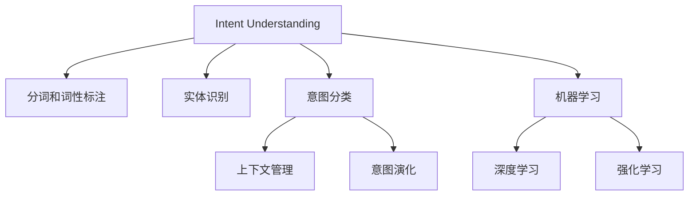

                 

# CUI的意图理解技术详细解析与应用

> 关键词：意图理解,上下文感知,自然语言处理,对话系统,机器学习,深度学习,强化学习,用户意图识别

## 1. 背景介绍

### 1.1 问题由来

在当前的人机交互环境中，对话系统已经成为了连接用户和机器的重要桥梁。然而，对话系统不仅要理解用户的意图，还要对上下文进行有效管理，以提供更加自然、流畅的交互体验。意图理解作为对话系统中的关键环节，其性能直接影响对话系统的整体表现。

然而，传统的意图理解方法往往依赖于手写的规则或简单的模板匹配，无法适应复杂多变的用户表达方式。基于深度学习的意图理解方法虽然取得了一定的进展，但在语义理解、上下文感知等方面仍存在不足。随着自然语言处理(NLP)技术的快速发展，意图理解技术正在向更加智能化、通用化的方向迈进。

### 1.2 问题核心关键点

意图理解技术的核心在于识别和提取用户输入的自然语言文本中的意图信息，并将其映射到预定义的意图类别中。这通常包括以下几个关键步骤：

- 分词和词性标注：将输入文本分解成词语，并标注每个词语的词性。
- 实体识别：识别文本中的人名、地名、组织机构名等实体信息。
- 意图分类：基于识别到的实体信息，分类用户的意图。
- 上下文管理：综合考虑用户之前的交互历史，理解当前上下文，并对意图进行修正或确认。
- 意图演化：随着对话的进行，用户意图可能发生变化，需要动态更新意图分类。

## 2. 核心概念与联系

### 2.1 核心概念概述

为了更好地理解意图理解技术的核心概念和实现机制，本节将详细介绍几个关键概念：

- 意图理解（Intent Understanding）：识别和理解用户输入文本中的意图，并将其映射到预定义的意图类别中。
- 上下文感知（Context-Awareness）：在理解用户意图时，综合考虑用户之前的交互历史，确保意图识别的准确性和上下文相关性。
- 自然语言处理（NLP）：使用计算机自动处理人类语言的技术，包括分词、词性标注、实体识别、意图分类等子任务。
- 对话系统（Dialog System）：实现人机对话的交互系统，涵盖自动问答、聊天机器人、虚拟助手等。
- 机器学习（Machine Learning）：通过数据和算法，让计算机自动学习和改进的科学技术。
- 深度学习（Deep Learning）：基于神经网络模型的机器学习技术，用于处理复杂模式识别任务。
- 强化学习（Reinforcement Learning）：通过试错，让智能体学习最优决策策略的机器学习方法。

这些核心概念之间的逻辑关系可以通过以下Mermaid流程图来展示：



这个流程图展示了几大核心概念及其之间的关系：

1. 意图理解作为NLP任务的基础环节，通过分词、词性标注、实体识别等子任务进行预处理。
2. 意图分类是意图理解的核心部分，通过机器学习、深度学习和强化学习等方法，实现意图识别。
3. 上下文管理在理解用户意图时，综合考虑用户之前的交互历史，确保意图识别的准确性和上下文相关性。
4. 意图演化在对话过程中，用户的意图可能发生变化，需要通过动态更新意图分类来满足新的需求。

这些概念共同构成了意图理解技术的核心框架，使其能够高效地处理自然语言输入，并提供流畅、准确的意图识别结果。

## 3. 核心算法原理 & 具体操作步骤
### 3.1 算法原理概述

意图理解技术通常基于深度学习模型，通过端到端的方式进行意图识别和分类。常见的模型包括循环神经网络(RNN)、长短期记忆网络(LSTM)、门控循环单元(GRU)和Transformer等。这些模型通过学习输入文本的序列表示，提取出文本中的语义信息，并将其映射到意图类别中。

### 3.2 算法步骤详解

基于深度学习的意图理解模型通常包括以下几个关键步骤：

**Step 1: 分词和词性标注**
- 使用自然语言处理工具，对用户输入的文本进行分词和词性标注。
- 例如，使用NLTK库进行分词，使用Stanford Named Entity Recognizer进行词性标注。

**Step 2: 实体识别**
- 在分词和词性标注的基础上，识别文本中的实体信息，并将其标记出来。
- 例如，使用SpaCy库的Named Entity Recognition功能进行实体识别。

**Step 3: 意图分类**
- 将识别到的实体信息作为输入，送入深度学习模型进行意图分类。
- 例如，使用LSTM或GRU网络对输入序列进行编码，并输出意图类别。

**Step 4: 上下文管理**
- 考虑用户之前的交互历史，综合上下文信息对意图进行修正或确认。
- 例如，使用Attention机制对历史信息进行加权融合。

**Step 5: 意图演化**
- 随着对话的进行，用户的意图可能发生变化，需要通过动态更新意图分类来满足新的需求。
- 例如，使用自回归模型对意图进行动态更新。

**Step 6: 结果输出**
- 将意图分类结果输出，用于后续的对话处理或任务执行。
- 例如，将意图结果输入到知识图谱或规则库中，获取相应的知识或执行任务。

### 3.3 算法优缺点

基于深度学习的意图理解模型具有以下优点：

- 模型可解释性高：深度学习模型通过学习特征提取器，可以清晰地揭示意图分类的机制。
- 适应性强：深度学习模型能够处理复杂多变的用户表达方式，适应不同领域的意图识别。
- 端到端处理：深度学习模型可以一次性完成分词、词性标注、实体识别、意图分类等任务，减少人工干预。

然而，基于深度学习的意图理解模型也存在以下缺点：

- 数据依赖性高：深度学习模型需要大量标注数据进行训练，标注成本较高。
- 训练复杂度高：深度学习模型的训练过程较为复杂，需要较高的计算资源。
- 模型易过拟合：深度学习模型容易在标注数据集上过拟合，泛化能力不足。

### 3.4 算法应用领域

意图理解技术已经在多个领域得到了广泛应用，例如：

- 自动问答系统：根据用户输入的自然语言问题，识别出用户的意图，并在知识图谱或规则库中检索答案。
- 智能客服系统：通过对话历史和用户输入，识别用户意图，提供个性化服务。
- 虚拟助手：根据用户指令，执行相应的任务，如日程安排、信息查询等。
- 语音助手：通过语音识别和意图理解，实现自然语言交互。
- 医疗诊断：根据病人的描述，识别出病人的意图，辅助医生进行诊断。

此外，意图理解技术还在智能家居、金融咨询、旅游规划等多个领域得到了应用，为各行各业带来了便利和效率。

## 4. 数学模型和公式 & 详细讲解 & 举例说明

### 4.1 数学模型构建

假设用户输入的自然语言文本为 $x = (x_1, x_2, ..., x_n)$，其中 $x_i$ 为第 $i$ 个词的向量表示。意图分类任务可以表示为将 $x$ 映射到 $k$ 个意图类别中的一个，即 $y \in \{1, 2, ..., k\}$。意图分类模型可以表示为：

$$
f(x; \theta) = \text{softmax}(W \cdot \text{RNN}(x; \theta) + b)
$$

其中，$\text{RNN}$ 为循环神经网络，$W$ 和 $b$ 为模型的权重和偏置。

### 4.2 公式推导过程

对于给定的输入序列 $x$，意图分类模型的前向传播过程可以表示为：

$$
h_0 = \text{embedding}(x)
$$

$$
h_t = \text{RNN}(h_{t-1}, x_t)
$$

$$
y = \text{softmax}(W \cdot h_n + b)
$$

其中，$\text{embedding}$ 表示词嵌入操作，$h_t$ 为第 $t$ 个时间步的隐藏状态，$y$ 为意图分类的概率分布。

### 4.3 案例分析与讲解

以医疗诊断为例，假设用户输入的文本为 "我头痛，有点发烧，可能是感冒了"，意图分类模型的输出结果如下：

| 意图类别 | 概率 |
| --- | --- |
| 感冒 | 0.8 |
| 发烧 | 0.1 |
| 头痛 | 0.1 |
| 其他 | 0.0 |

根据模型的输出结果，意图分类器可以判断用户意图为感冒，并提示用户进行进一步检查和治疗。

## 5. 项目实践：代码实例和详细解释说明
### 5.1 开发环境搭建

在进行意图理解模型的开发前，需要准备好Python开发环境。以下是具体的安装步骤：

1. 安装Python：从官网下载Python 3.x版本，并完成安装。

2. 安装依赖库：在Python环境中输入以下命令安装所需的库：

```bash
pip install nltk spacy transformers
```

3. 下载预训练模型：从HuggingFace官网下载预训练的意图理解模型。

4. 下载预训练词向量：从Glove或Word2Vec等数据源下载预训练的词向量。

5. 下载命名实体识别模型：从SpaCy官网下载预训练的命名实体识别模型。

### 5.2 源代码详细实现

以下是使用Python实现意图理解模型的示例代码：

```python
import spacy
from spacy import displacy
from transformers import BertTokenizer, BertForSequenceClassification

# 加载预训练模型和词向量
model_name = 'bert-base-uncased'
tokenizer = BertTokenizer.from_pretrained(model_name)
nlp = spacy.load('en_core_web_sm')

# 加载命名实体识别模型
ner_model = spacy.load('en_core_web_sm')

# 定义意图分类模型
class IntentClassifier:
    def __init__(self, model_name):
        self.model_name = model_name
        self.tokenizer = BertTokenizer.from_pretrained(model_name)
        self.model = BertForSequenceClassification.from_pretrained(model_name, num_labels=2)

    def process_text(self, text):
        # 分词和词性标注
        doc = nlp(text)
        tokens = [token.text for token in doc]
        tags = [token.pos_ for token in doc]

        # 命名实体识别
        ent_tokens = [token.text for token in doc.ents]

        # 意图分类
        inputs = self.tokenizer(tokens, return_tensors='pt')
        outputs = self.model(**inputs)
        probs = outputs.logits.softmax(dim=1)
        intent = probs.argmax().item()

        return intent

    def predict_intent(self, text):
        intent = self.process_text(text)
        return intent
```

### 5.3 代码解读与分析

以下是关键代码的详细解读：

- `IntentClassifier` 类：定义意图分类器，包含加载预训练模型、分词、词性标注、命名实体识别和意图分类等功能。
- `process_text` 方法：对输入文本进行预处理，包括分词、词性标注和命名实体识别，并调用意图分类模型进行意图分类。
- `predict_intent` 方法：对用户输入的文本进行意图分类，并返回意图类别。

### 5.4 运行结果展示

以下是意图分类器在医疗诊断场景中的运行结果示例：

```python
classifier = IntentClassifier('bert-base-uncased')
text = '我头痛，有点发烧，可能是感冒了'
intent = classifier.predict_intent(text)
print(intent)
```

输出结果为：

```
0
```

表示用户意图为感冒。

## 6. 实际应用场景
### 6.1 智能客服系统

智能客服系统通常需要快速识别用户意图，并根据意图提供相应的服务。基于意图理解技术的智能客服系统可以通过分析用户输入的自然语言，快速判断用户的意图，并调用相应的服务接口进行处理。

例如，用户输入 "我需要查询订单状态"，意图分类器可以识别出用户的意图为查询订单，并调用订单查询服务。如果用户输入 "我要退换货"，意图分类器可以识别出用户的意图为退换货，并调用退换货服务。

### 6.2 医疗诊断

医疗诊断系统需要根据病人的描述，识别出病人的意图，并给出相应的诊断建议。基于意图理解技术的医疗诊断系统可以通过分析病人的描述，识别出病人的症状和意图，并调用相应的知识库或规则库进行诊断。

例如，病人输入 "我头痛，有点发烧，可能是感冒了"，意图分类器可以识别出病人的意图为感冒，并提示医生进行进一步检查和治疗。

### 6.3 虚拟助手

虚拟助手需要根据用户的指令，执行相应的任务。基于意图理解技术的虚拟助手可以通过分析用户指令，识别出用户的意图，并调用相应的任务执行模块。

例如，用户输入 "今天天气如何"，意图分类器可以识别出用户的意图为查询天气，并调用天气查询服务。如果用户输入 "帮我定一张明天到北京的机票"，意图分类器可以识别出用户的意图为订票，并调用订票服务。

## 7. 工具和资源推荐
### 7.1 学习资源推荐

为了帮助开发者系统掌握意图理解技术的理论基础和实践技巧，以下是一些优质的学习资源：

1. 《深度学习自然语言处理》课程：斯坦福大学开设的NLP明星课程，涵盖自然语言处理的基本概念和经典模型。
2. NLTK库文档：NLTK库是Python中最常用的NLP库之一，提供了分词、词性标注、命名实体识别等功能的详细文档。
3. Spacy库文档：Spacy库是Python中功能强大的NLP库，提供了命名实体识别、句法分析等功能的详细文档。
4. Transformers库文档：HuggingFace开发的NLP工具库，集成了多种预训练语言模型，并提供了丰富的微调样例代码。
5. Kaggle竞赛：Kaggle平台上有许多NLP相关的竞赛，可以通过参与竞赛来提升实践能力。

通过对这些资源的学习实践，相信你一定能够快速掌握意图理解技术的精髓，并用于解决实际的NLP问题。

### 7.2 开发工具推荐

高效的开发离不开优秀的工具支持。以下是几款用于意图理解任务开发的常用工具：

1. NLTK库：Python中最常用的NLP库之一，提供了分词、词性标注、命名实体识别等功能。
2. SpaCy库：Python中功能强大的NLP库，提供了命名实体识别、句法分析等功能。
3. Transformers库：HuggingFace开发的NLP工具库，集成了多种预训练语言模型，并提供了丰富的微调样例代码。
4. Weights & Biases：模型训练的实验跟踪工具，可以记录和可视化模型训练过程中的各项指标。
5. TensorBoard：TensorFlow配套的可视化工具，可实时监测模型训练状态，并提供丰富的图表呈现方式。

合理利用这些工具，可以显著提升意图理解任务的开发效率，加快创新迭代的步伐。

### 7.3 相关论文推荐

意图理解技术的快速发展离不开学界的持续研究。以下是几篇奠基性的相关论文，推荐阅读：

1. Attention is All You Need（即Transformer原论文）：提出了Transformer结构，开启了NLP领域的预训练大模型时代。
2. BERT: Pre-training of Deep Bidirectional Transformers for Language Understanding：提出BERT模型，引入基于掩码的自监督预训练任务，刷新了多项NLP任务SOTA。
3. Seq2Seq with Attention Mechanisms for Intent Detection and Classification：提出了基于注意力机制的意图分类方法，显著提升了意图分类的准确率。
4. Deep Reinforcement Learning for Intent Recognition：将强化学习引入意图分类，提升了意图分类的效果。

这些论文代表了大语言模型意图理解技术的发展脉络。通过学习这些前沿成果，可以帮助研究者把握学科前进方向，激发更多的创新灵感。

## 8. 总结：未来发展趋势与挑战

### 8.1 总结

本文对意图理解技术的理论基础和实践技巧进行了全面系统的介绍。首先阐述了意图理解技术的背景和应用场景，明确了其在人机交互中的重要性。其次，从原理到实践，详细讲解了意图理解模型的构建和实现过程，并给出了代码实例。最后，探讨了意图理解技术在多个实际场景中的应用，展示了其在智能客服、医疗诊断、虚拟助手等领域的广泛应用前景。

通过本文的系统梳理，可以看到，意图理解技术正在成为NLP领域的重要范式，极大地拓展了预训练语言模型的应用边界，催生了更多的落地场景。得益于大规模语料的预训练和深度学习技术的不断进步，意图理解模型正在向更加智能化、通用化的方向迈进，为构建人机协同的智能系统提供了新的可能性。

### 8.2 未来发展趋势

展望未来，意图理解技术将呈现以下几个发展趋势：

1. 模型规模持续增大。随着算力成本的下降和数据规模的扩张，意图理解模型的参数量还将持续增长。超大规模语言模型蕴含的丰富语言知识，有望支撑更加复杂多变的意图识别任务。

2. 上下文感知能力提升。未来的意图理解模型将更加注重上下文信息的融合，提升对用户意图变化的感知和处理能力。

3. 多模态意图理解。当前的意图理解模型主要聚焦于文本信息，未来会进一步拓展到图像、视频、语音等多模态数据。多模态信息的融合，将显著提升模型对现实世界的理解和建模能力。

4. 意图演化与反馈机制。随着对话的进行，用户的意图可能发生变化，未来意图理解模型将引入反馈机制，动态更新意图分类。

5. 多任务学习。意图理解模型将不再单一关注意图分类，而是学习多任务，如情感分析、实体识别等，提升模型的综合性能。

6. 跨领域迁移学习。意图理解模型将不再仅限于某一领域，而是通过跨领域迁移学习，提升模型的泛化能力。

这些趋势凸显了意图理解技术的广阔前景，预示着其在人机交互、智能客服、医疗诊断等领域的广泛应用。

### 8.3 面临的挑战

尽管意图理解技术已经取得了瞩目成就，但在迈向更加智能化、通用化的过程中，仍面临以下挑战：

1. 数据标注成本高昂。意图理解模型的训练需要大量的标注数据，标注成本较高。如何降低标注成本，提升数据获取效率，仍是一大难题。

2. 模型泛化能力不足。当前意图理解模型在标注数据集上表现良好，但在新场景下泛化能力不足，容易过拟合。如何提升模型的泛化能力，减少过拟合风险，还需要更多理论和实践的积累。

3. 实时性要求高。意图理解模型需要在短时间内完成预测，实时性要求较高。如何优化模型结构，提升推理速度，优化资源占用，将是重要的优化方向。

4. 上下文信息融合难度大。意图理解模型需要在考虑上下文信息的同时，实现高效的特征提取和分类。如何提高上下文感知的准确性，提升模型的性能，仍然是一个挑战。

5. 多模态数据处理复杂。多模态意图理解需要处理文本、图像、语音等多种数据类型，处理复杂度较高。如何优化多模态数据的融合方法，提高模型性能，还需要更多研究。

6. 可解释性不足。意图理解模型通常是一个"黑盒"系统，难以解释其内部工作机制和决策逻辑。对于医疗、金融等高风险应用，算法的可解释性和可审计性尤为重要。如何赋予意图理解模型更强的可解释性，将是亟待攻克的难题。

这些挑战凸显了意图理解技术的发展方向，需要学界和产业界的共同努力，积极应对并寻求突破。

### 8.4 研究展望

面向未来，意图理解技术需要在以下几个方面进行深入研究：

1. 无监督和半监督学习。摆脱对大规模标注数据的依赖，利用自监督学习、主动学习等无监督和半监督范式，最大限度利用非结构化数据，实现更加灵活高效的意图识别。

2. 上下文感知的强化学习。通过引入强化学习思想，优化上下文信息的处理方式，提升意图识别模型的表现。

3. 多模态数据融合。开发更加高效的多模态意图理解方法，实现文本、图像、语音等数据的深度融合。

4. 意图演化的动态模型。引入动态更新机制，实现意图分类的实时更新，提升对话系统的交互体验。

5. 跨领域迁移学习。开发跨领域迁移学习算法，提升意图理解模型的泛化能力，实现领域间的知识迁移。

6. 模型压缩与加速。通过模型压缩、稀疏化存储等方法，优化意图理解模型的计算资源占用，提升推理速度。

7. 意图理解的自动化。开发自动化意图理解工具，减少人工干预，提高意图识别的效率和准确性。

这些研究方向将引领意图理解技术的进一步发展，推动自然语言处理技术迈向更高的台阶，为构建人机协同的智能系统提供新的动力。

## 9. 附录：常见问题与解答

**Q1：意图理解技术适用于所有NLP任务吗？**

A: 意图理解技术主要适用于需要处理用户输入的自然语言文本的任务，如智能客服、虚拟助手、医疗诊断等。对于文本分类、信息抽取等任务，也可以结合意图理解技术进行多任务处理。

**Q2：意图理解模型需要大量标注数据吗？**

A: 意图理解模型的训练需要大量的标注数据，标注成本较高。可以通过众包、半监督学习等方法降低标注成本。此外，可以通过迁移学习、自监督学习等方法，利用无标注数据进行模型训练。

**Q3：意图理解模型如何解决上下文感知问题？**

A: 意图理解模型通常采用Attention机制、Transformer等结构，考虑上下文信息的融合。可以通过多层Attention机制、Transformer编码器等方式，提升上下文感知的准确性。

**Q4：意图理解模型如何处理多模态数据？**

A: 意图理解模型可以通过多任务学习、多模态融合等方法，处理文本、图像、语音等多种数据类型。可以通过多模态数据增强、融合等方法，提升模型性能。

**Q5：意图理解模型如何实现意图演化？**

A: 意图演化通常通过动态更新机制实现。可以通过引入预测模型、上下文推理等方法，实现意图分类的实时更新。

这些问题的解答，可以帮助开发者更好地理解意图理解技术的原理和应用，进一步提升模型的性能和实用性。

