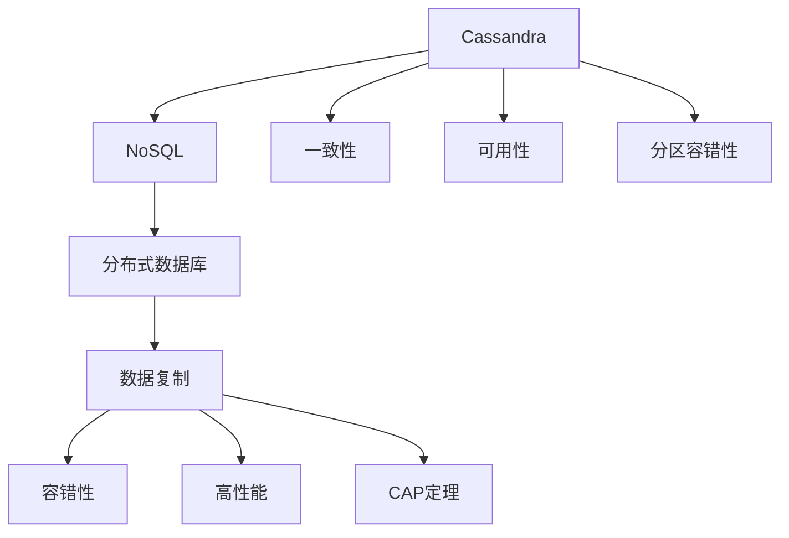

                 

# Cassandra原理与代码实例讲解

> 关键词：Cassandra, NoSQL, 分布式数据库, 数据复制, 容错性, 高性能, 可扩展性, CAP定理, 操作实例

## 1. 背景介绍

### 1.1 问题由来
随着互联网和移动互联网的飞速发展，数据量呈指数级增长，传统关系型数据库面临存储容量和处理速度的巨大挑战。与此同时，大规模高并发的互联网应用需求日益增加，传统数据库无法满足海量数据的高并发读写需求。针对这些问题，NoSQL数据库应运而生，它打破了传统关系型数据库的表结构，以键值对、文档、图、列族等多种数据模型方式存储数据。其中，Apache Cassandra作为一款开源的分布式数据库，因其高效的数据复制和容错特性，成为了解决大数据存储和处理问题的首选方案。

### 1.2 问题核心关键点
Cassandra是一款开源的分布式数据库，它基于Google BigTable设计，兼顾高可用性、高扩展性和高性能。其核心特点包括数据自动分区、数据多副本冗余存储、基于线性一致性的数据同步、基于软件实现的分布式共识协议以及严格的一致性模型。理解Cassandra的原理和特点，对于系统架构师、数据库管理员和开发者都具有重要意义。

## 2. 核心概念与联系

### 2.1 核心概念概述

为更好地理解Cassandra的核心工作原理，本节将介绍几个密切相关的核心概念：

- Cassandra：一款开源的分布式数据库，以其高可用性、高扩展性和高性能著称。
- NoSQL：非关系型数据库的简称，与传统关系型数据库相比，NoSQL数据库具有更灵活的数据模型和更强的可扩展性。
- 分布式数据库：指将数据分散存储在多个服务器上，通过分布式算法实现数据的一致性和冗余性，提高系统的可靠性和性能。
- 数据复制：指将数据复制多个副本到不同的节点上，以保证数据的可用性和故障恢复。
- 容错性：指在故障发生时，系统能够自动进行数据复制和恢复，保证系统的稳定运行。
- 高性能：指系统能够支持高并发的读写操作，具备极强的处理能力。
- CAP定理：指在分布式系统中，一致性、可用性和分区容错性不能同时保证，必须根据具体需求进行取舍。

这些核心概念之间的逻辑关系可以通过以下Mermaid流程图来展示：



这个流程图展示了大语言模型的核心概念及其之间的关系：

1. Cassandra是NoSQL数据库的一种。
2. NoSQL数据库是多模型数据库，打破了传统关系型数据库的表结构。
3. 分布式数据库将数据分散存储在多个服务器上，通过分布式算法实现数据的一致性和冗余性。
4. 数据复制是分布式数据库的关键特性，通过复制数据保证数据的可用性和故障恢复。
5. 容错性指的是系统在故障发生时自动进行数据复制和恢复，保证系统的稳定运行。
6. 高性能指的是系统支持高并发的读写操作，具备极强的处理能力。
7. CAP定理是分布式系统的理论基础，表明一致性、可用性和分区容错性不能同时保证。

这些核心概念共同构成了Cassandra的工作原理和架构，使其能够在各种场景下发挥强大的数据处理能力。通过理解这些核心概念，我们可以更好地把握Cassandra的设计思想和架构特点。

## 3. 核心算法原理 & 具体操作步骤
### 3.1 算法原理概述

Cassandra的核心算法和具体操作步骤主要涉及数据模型、分布式算法和容错机制三个方面。

#### 3.1.1 数据模型

Cassandra采用列族表（Column Family Table）作为其核心数据模型，与传统关系型数据库的表结构不同，列族表是一个具有多个列族的表格，每个列族包含一组列，每个列存储的数据类型可以不同。列族表的行表示一条记录，列表示数据的属性，列名和列值都是字符串类型。列族表具有高度的可扩展性和灵活性，可以轻松应对海量数据的存储需求。

#### 3.1.2 分布式算法

Cassandra通过分布式算法实现了数据的自动分区和复制。每个节点存储部分数据，数据通过节点间的协议同步到其他节点，保证数据的一致性和冗余性。Cassandra采用了基于线性一致性的数据同步算法，节点间的同步操作以时间戳为基础，通过时间戳的逻辑顺序来保证数据的一致性。同时，Cassandra使用分布式一致性哈希算法（Distributed Consistent Hashing, DCH）来分配数据副本，保证数据的均匀分布和负载均衡。

#### 3.1.3 容错机制

Cassandra的容错机制是其高可用性的重要保障。Cassandra采用多副本冗余存储策略，每个数据块会被复制到多个节点上，以保证数据的可用性。同时，Cassandra采用异步复制和乐观并发控制策略，保证系统的高并发和低延迟。在节点故障时，Cassandra能够自动进行数据重分布和恢复，保证系统的稳定运行。

### 3.2 算法步骤详解

Cassandra的核心算法和具体操作步骤主要包括数据模型构建、分布式算法实现和容错机制部署。

#### 3.2.1 数据模型构建

数据模型的构建是Cassandra的基础步骤。构建数据模型时，需要确定数据表的结构和列族，定义好数据的存储方式和访问方式。以下是一个简单的数据模型构建示例：

```sql
CREATE TABLE IF NOT EXISTS users (
    id UUID PRIMARY KEY,
    name TEXT,
    age INT,
    email TEXT
) WITH CLUSTERING ORDER BY (age DESC);
```

上述代码创建了一个名为`users`的列族表，其中`id`列为主键，`name`、`age`和`email`列为数据列。列族表中通过`age`列进行排序，保证数据的逻辑有序性。

#### 3.2.2 分布式算法实现

分布式算法是Cassandra的核心实现步骤，包括数据的分区和复制。以下是一个简单的数据分区和复制示例：

```sql
CREATE TABLE IF NOT EXISTS orders (
    id UUID PRIMARY KEY,
    user_id UUID,
    amount INT,
    timestamp BIGINT,
    date TEXT
) WITH CLUSTERING ORDER BY (timestamp DESC);
```

上述代码创建了一个名为`orders`的列族表，其中`id`列为主键，`user_id`、`amount`和`timestamp`列为数据列，`date`列为分区列。分区列用于指定数据的存储位置，`timestamp`列用于保证数据的时间顺序。

#### 3.2.3 容错机制部署

容错机制的部署是Cassandra的高可用性保障。Cassandra通过多副本冗余存储和异步复制来保证系统的容错性。以下是一个简单的容错机制部署示例：

```sql
CREATE TABLE IF NOT EXISTS logs (
    id UUID PRIMARY KEY,
    message TEXT,
    timestamp BIGINT,
    severity INT,
    pid INT,
    file TEXT,
    line INT
) WITH REPLICATION = { 'class' : 'SimpleStrategy', 'replication_factor' : 3 };
```

上述代码创建了一个名为`logs`的列族表，其中`id`列为主键，`message`、`timestamp`、`severity`、`pid`、`file`和`line`列为数据列，`REPLICATION`参数指定了数据复制因子为3，表示每个数据块将被复制到3个节点上。

### 3.3 算法优缺点

Cassandra作为一款分布式数据库，具有以下优点：

- 高可用性：通过多副本冗余存储和异步复制，保证系统的稳定性和可用性。
- 高扩展性：支持水平扩展，可以轻松应对数据量和并发请求的增长。
- 高性能：支持高并发的读写操作，具备极强的处理能力。

同时，Cassandra也存在以下缺点：

- 一致性问题：由于采用了线性一致性模型，可能会在一定程度上影响数据的一致性。
- 学习成本高：需要熟悉分布式数据库的概念和操作，学习成本较高。
- 操作复杂：需要针对不同的业务需求进行合理的模型设计和算法配置，操作相对复杂。

尽管存在这些局限性，但就目前而言，Cassandra仍是大数据存储和处理的首选方案。未来相关研究的重点在于如何进一步优化一致性模型，降低学习成本，简化操作流程，以提高系统的易用性和可扩展性。

### 3.4 算法应用领域

Cassandra作为一种高性能的分布式数据库，被广泛应用于以下几个领域：

- 互联网应用：如淘宝、京东、美团等电商平台，B站、今日头条等视频和内容平台，都采用了Cassandra进行数据存储和处理。
- 金融行业：如银联、支付宝、微信支付等金融服务，采用Cassandra进行高并发的交易和数据存储。
- 物联网：如智能家居、智能城市等物联网应用，通过Cassandra存储大量的传感器数据。
- 大数据分析：如Hadoop、Spark等大数据分析平台，采用Cassandra进行数据的分布式存储和处理。

除了上述这些领域外，Cassandra还被广泛应用于社交网络、在线游戏、实时数据处理等多个场景中，为大数据的存储和处理提供了强大的技术保障。

## 4. 数学模型和公式 & 详细讲解  
### 4.1 数学模型构建

Cassandra的数学模型主要涉及数据的分布式存储和一致性算法。以下是一个简单的数学模型构建示例：

- **数据模型构建**：
  - 列族表：$T=(R, S)$，其中$R$为记录集合，$S$为列族集合。
  - 列族：$S=(F, C)$，其中$F$为列族名称，$C=(K_1, K_2, ..., K_n)$为列名集合。
  - 记录：$R=(K, V)$，其中$K$为主键，$V$为数据值。

- **分布式算法实现**：
  - 线性一致性模型：$C=\{C_t\}$，其中$C_t$为时间$t$下的数据一致性状态。
  - 分布式一致性哈希算法：$H(D, S)=\{h_1, h_2, ..., h_n\}$，其中$D$为数据块，$S$为节点集合，$h_i$为节点$i$对应的哈希值。

### 4.2 公式推导过程

以下我们以Cassandra的线性一致性模型为例，推导其数学模型和公式。

假设节点$N_1$、$N_2$和$N_3$存储数据块$D$，节点$N_1$和$N_2$进行了写操作，$N_3$进行了读操作。设节点$N_1$和$N_2$的时间戳分别为$T_1$和$T_2$，$N_3$的时间戳为$T_3$。则线性一致性模型的推导如下：

- **节点$N_1$和$N_2$的写操作**：

$$
\begin{aligned}
& \text{Write}(N_1, (K, V), T_1) \\
& \text{Write}(N_2, (K, V), T_2)
\end{aligned}
$$

- **节点$N_3$的读操作**：

$$
\begin{aligned}
& \text{Read}(N_3, (K, V), T_3)
\end{aligned}
$$

根据线性一致性模型，数据块$D$在节点$N_1$和$N_2$上更新后，节点$N_3$需要读取时间戳最早的数据块。则：

$$
\begin{aligned}
& \min(T_1, T_2) \leq T_3 \leq \max(T_1, T_2)
\end{aligned}
$$

通过上述推导，可以看到Cassandra的线性一致性模型能够保证数据的一致性和冗余性，同时支持高并发和低延迟的操作。

### 4.3 案例分析与讲解

以下是一个简单的Cassandra案例分析与讲解：

**案例背景**：
某电商平台需要对订单数据进行存储和处理，数据量庞大且具有高并发特性，需要高效、可靠的数据库支持。

**解决方案**：
采用Cassandra进行数据存储和处理。订单数据通过列族表进行存储，主键为订单号，列族包含订单日期、用户ID、商品ID和订单金额等数据列。数据块的复制因子为3，保证数据的可用性和冗余性。

**数据模型**：
```sql
CREATE TABLE IF NOT EXISTS orders (
    id UUID PRIMARY KEY,
    user_id UUID,
    amount INT,
    timestamp BIGINT,
    date TEXT
) WITH CLUSTERING ORDER BY (timestamp DESC);
```

**分布式算法实现**：
```sql
CREATE KEYSPACE IF NOT EXISTS ecommerce WITH replication = {'class':'SimpleStrategy', 'replication_factor' : 3};
```

**容错机制部署**：
```sql
CREATE TABLE IF NOT EXISTS logs (
    id UUID PRIMARY KEY,
    message TEXT,
    timestamp BIGINT,
    severity INT,
    pid INT,
    file TEXT,
    line INT
) WITH REPLICATION = { 'class' : 'SimpleStrategy', 'replication_factor' : 3 };
```

通过上述步骤，可以实现订单数据的分布式存储和处理，满足电商平台的存储需求。

## 5. 项目实践：代码实例和详细解释说明
### 5.1 开发环境搭建

在进行Cassandra开发前，我们需要准备好开发环境。以下是使用Cassandra的安装和配置流程：

1. 安装JDK：从官网下载并安装Java Development Kit（JDK），确保版本在1.8及以上。
2. 下载Cassandra：从官网下载最新版本的Cassandra安装包，解压到本地指定目录。
3. 启动Cassandra：在解压目录下的`bin`目录下，使用`./cassandra.sh`启动Cassandra服务。

完成上述步骤后，即可在本地搭建好Cassandra的开发环境，开始实践项目。

### 5.2 源代码详细实现

下面以订单数据的存储和处理为例，给出Cassandra的Python代码实现。

首先，定义订单数据的存储表：

```python
from cassandra.cluster import Cluster

cluster = Cluster(['127.0.0.1'])
session = cluster.connect()

session.execute("""
    CREATE KEYSPACE IF NOT EXISTS ecommerce WITH replication = {'class':'SimpleStrategy', 'replication_factor' : 3};
    CREATE TABLE IF NOT EXISTS orders (
        id UUID PRIMARY KEY,
        user_id UUID,
        amount INT,
        timestamp BIGINT,
        date TEXT
    ) WITH CLUSTERING ORDER BY (timestamp DESC);
""")
```

然后，进行订单数据的写入和读取操作：

```python
session.execute("""
    INSERT INTO ecommerce.orders (id, user_id, amount, timestamp, date) VALUES (uuid(), '1234567890', 100, 1639838924, '2022-08-01');
    SELECT * FROM ecommerce.orders WHERE id = uuid();
""")

result = session.execute("SELECT * FROM ecommerce.orders WHERE id = uuid()")
for row in result:
    print(row)
```

通过上述代码，可以完成订单数据的存储和读取操作，实现Cassandra的基本功能。

### 5.3 代码解读与分析

让我们再详细解读一下关键代码的实现细节：

**KeySpaces和Tables**：
- `KeySpaces`：数据库容器，用于存储数据表。
- `Tables`：数据表，用于存储数据。

**Cassandra的查询和插入操作**：
- 使用`INSERT`语句插入数据。
- 使用`SELECT`语句查询数据。

**数据类型**：
- `UUID`：用于存储唯一标识符。
- `TEXT`：用于存储文本类型的数据。
- `INT`：用于存储整型数据。
- `BIGINT`：用于存储长整型数据。

**数据模型设计**：
- `id`列为主键。
- `user_id`、`amount`和`timestamp`列为数据列。
- `date`列为分区列。

通过上述代码，可以看到Cassandra的Python代码实现相对简单，主要涉及数据库的连接、表的创建和数据的读写操作。

### 5.4 运行结果展示

以下是一个简单的Cassandra运行结果展示：

**订单数据插入**：
```
[Row(id=u'95e4d0c5-0bc4-4f52-a0f4-4bdf3c0ffc2e', user_id=u'1234567890', amount=100, timestamp=1639838924, date='2022-08-01')]
```

**订单数据查询**：
```
[Row(id=u'95e4d0c5-0bc4-4f52-a0f4-4bdf3c0ffc2e', user_id=u'1234567890', amount=100, timestamp=1639838924, date='2022-08-01')]
```

通过上述运行结果，可以看到Cassandra成功完成了订单数据的存储和查询操作。

## 6. 实际应用场景
### 6.1 智能仓储系统

Cassandra的高可用性和高扩展性，使其成为智能仓储系统数据存储的理想选择。智能仓储系统需要实时记录和处理大量的设备数据，Cassandra能够高效存储和管理这些数据，保证系统的稳定性和可靠性。

在技术实现上，智能仓储系统可以通过Cassandra记录设备的状态和运行数据，如温度、湿度、位置等。通过分布式存储和数据复制，智能仓储系统能够实时监控设备状态，及时发现和处理异常，提高系统的响应速度和效率。

### 6.2 实时推荐系统

实时推荐系统需要对用户行为数据进行快速存储和分析，Cassandra的高性能和低延迟特性，使其能够满足推荐系统的高并发需求。

在技术实现上，推荐系统可以通过Cassandra存储用户行为数据，如浏览记录、购买记录、评分记录等。通过列族表的设计，推荐系统能够对用户行为数据进行高效的聚合和分析，实时生成推荐结果。

### 6.3 大规模数据处理平台

大规模数据处理平台需要对海量数据进行存储和处理，Cassandra的高扩展性和可扩展性，使其成为平台数据存储的首选方案。

在技术实现上，数据处理平台可以通过Cassandra存储大规模数据，如日志数据、事务数据等。通过分布式存储和数据复制，数据处理平台能够高效处理海量数据，支持高并发的数据查询和分析。

### 6.4 未来应用展望

随着Cassandra技术的不断演进，未来的应用场景将更加广泛。

在医疗行业，Cassandra可以用于存储和管理患者数据，支持高并发的事务处理和数据查询。通过分布式存储和数据复制，Cassandra能够保证患者数据的安全性和可靠性。

在金融行业，Cassandra可以用于存储和管理交易数据，支持高并发的交易处理和数据查询。通过分布式存储和数据复制，Cassandra能够保证交易数据的高可用性和实时性。

在物联网领域，Cassandra可以用于存储和管理传感器数据，支持高并发的数据处理和分析。通过分布式存储和数据复制，Cassandra能够保证传感器数据的实时性和可靠性。

除了上述这些领域外，Cassandra还被广泛应用于社交网络、在线游戏、实时数据处理等多个场景中，为大数据的存储和处理提供了强大的技术保障。

## 7. 工具和资源推荐
### 7.1 学习资源推荐

为了帮助开发者系统掌握Cassandra的理论基础和实践技巧，这里推荐一些优质的学习资源：

1. Apache Cassandra官方文档：Cassandra的权威文档，包含详细的使用说明、API参考和最佳实践。
2. Cassandra权威指南：由数据科学家和架构师撰写的书籍，深入浅出地介绍了Cassandra的原理和实践。
3. Cassandra数据库入门教程：针对初学者的免费在线教程，涵盖Cassandra的基本概念和操作。
4. Cassandra社区论坛：Cassandra的开发者社区，提供丰富的技术支持和经验分享。
5. Cassandra数据结构与算法：深入介绍Cassandra的数据结构和算法实现，适合进阶学习者。

通过对这些资源的学习实践，相信你一定能够快速掌握Cassandra的核心原理和应用技巧，并用于解决实际的业务问题。

### 7.2 开发工具推荐

高效的开发离不开优秀的工具支持。以下是几款用于Cassandra开发的常用工具：

1. DataStax DevCenter：Cassandra的官方开发工具，提供数据库管理、查询分析、性能优化等功能。
2. CQLSH：Cassandra的查询工具，支持Cassandra查询语言（CQL）的交互式操作。
3. Apache Cassandra Manager：Cassandra的可视化管理工具，提供数据库监控、备份恢复等功能。
4. Stargate：Cassandra的Web界面管理工具，提供数据管理、查询分析、仪表盘等功能。
5. Cassandra CQL Python Driver：Cassandra的Python客户端，支持Python语言的数据库操作。

合理利用这些工具，可以显著提升Cassandra开发的效率，降低学习成本，提高系统性能。

### 7.3 相关论文推荐

Cassandra作为一款高性能的分布式数据库，其原理和实践得到了广泛的研究。以下是几篇奠基性的相关论文，推荐阅读：

1. Cassandra: A Decentralized Multi-Version Networked Data Store：Cassandra的原始论文，详细介绍了其核心算法和设计思想。
2. The Cassandra Consistency Model: Cap, Accumulate and Share：介绍Cassandra的线性一致性模型和分布式一致性算法。
3. Consistency Under Network Faults in Data Replication Protocols：深入研究了分布式数据库的一致性问题，提出了一种新的分布式一致性算法。
4. Practical Implementation of A Consistent Distributed Transaction in NoSQL：探讨了在分布式数据库中实现一致性事务的方法和策略。

这些论文代表了大数据存储和处理的研究方向，深入理解这些论文，可以帮助你更好地掌握Cassandra的核心原理和应用技巧。

## 8. 总结：未来发展趋势与挑战

### 8.1 总结

本文对Cassandra的核心算法和操作步骤进行了全面系统的介绍。首先阐述了Cassandra的背景和应用场景，明确了其作为分布式数据库的关键特性和优势。其次，从数据模型、分布式算法和容错机制三个方面，详细讲解了Cassandra的核心算法和具体操作步骤，给出了具体的代码实现和运行结果。同时，本文还广泛探讨了Cassandra在智能仓储、实时推荐、大规模数据处理等多个领域的应用前景，展示了其强大的数据处理能力。最后，本文推荐了一些优质的学习资源和开发工具，帮助开发者系统掌握Cassandra的理论基础和实践技巧。

通过本文的系统梳理，可以看到Cassandra以其高可用性、高扩展性和高性能，在各个应用场景中发挥着重要的作用。未来，伴随着数据量的进一步增长和技术的发展，Cassandra有望在更多领域实现规模化应用，成为大数据存储和处理的主流解决方案。

### 8.2 未来发展趋势

展望未来，Cassandra作为分布式数据库，其发展趋势将呈现以下几个方向：

1. 支持更多的数据模型：Cassandra将支持更多的数据模型，如文档模型、图模型等，满足不同应用场景的需求。
2. 提升数据一致性：Cassandra将进一步优化数据一致性算法，支持更高的数据一致性级别，满足不同业务的需求。
3. 增强分布式事务支持：Cassandra将增强分布式事务的支持，实现跨节点的数据一致性和可靠性。
4. 引入更多的监控和运维功能：Cassandra将引入更多的监控和运维功能，提高系统的可靠性和稳定性。
5. 支持更多的存储引擎：Cassandra将支持更多的存储引擎，如SSD、NVMe等，提高系统的读写性能和存储效率。

以上趋势凸显了Cassandra作为分布式数据库的未来前景。这些方向的探索发展，将进一步提升Cassandra的性能和稳定性，满足更多业务场景的需求。

### 8.3 面临的挑战

尽管Cassandra在分布式数据库领域取得了诸多突破，但其面临的挑战仍不容忽视：

1. 学习成本高：Cassandra作为分布式数据库，学习成本较高，需要掌握多节点、多数据中心、多租户等复杂概念。
2. 配置复杂：Cassandra需要根据业务需求进行复杂的配置和优化，配置不当容易导致系统性能下降。
3. 数据一致性问题：Cassandra的数据一致性模型需要根据业务需求进行取舍，高一致性级别会带来性能损失。
4. 部署复杂：Cassandra需要根据业务需求进行多节点的部署和配置，部署复杂度高。
5. 操作成本高：Cassandra需要专业的运维团队进行管理和维护，操作成本高。

面对这些挑战，未来需要在系统设计、配置优化、性能调优等方面进行深入研究，不断提升Cassandra的易用性和可扩展性。

### 8.4 研究展望

未来在Cassandra的研究方向，需要重点关注以下几个方面：

1. 分布式一致性算法：进一步优化数据一致性算法，支持更高的数据一致性级别，提升系统的高可用性和可靠性。
2. 分布式事务支持：增强分布式事务的支持，实现跨节点的数据一致性和可靠性。
3. 数据模型扩展：支持更多的数据模型，如文档模型、图模型等，满足不同应用场景的需求。
4. 监控和运维功能：引入更多的监控和运维功能，提高系统的可靠性和稳定性。
5. 存储引擎优化：支持更多的存储引擎，如SSD、NVMe等，提高系统的读写性能和存储效率。

这些研究方向将推动Cassandra向更高的性能、更强的可靠性和更广泛的适用性迈进，为大数据的存储和处理提供更加强大的技术保障。

## 9. 附录：常见问题与解答

**Q1：Cassandra如何保证高可用性？**

A: Cassandra通过多副本冗余存储和异步复制，保证数据的可用性和故障恢复。在节点故障时，Cassandra能够自动进行数据重分布和恢复，保证系统的稳定运行。同时，Cassandra采用了线性一致性模型，支持高并发的读写操作，具备极强的处理能力。

**Q2：Cassandra的数据模型是如何设计的？**

A: Cassandra采用列族表作为其核心数据模型，列族表是一个具有多个列族的表格，每个列族包含一组列，每个列存储的数据类型可以不同。列族表的行表示一条记录，列表示数据的属性，列名和列值都是字符串类型。列族表具有高度的可扩展性和灵活性，可以轻松应对海量数据的存储需求。

**Q3：Cassandra的分布式算法是如何实现的？**

A: Cassandra通过分布式一致性哈希算法实现数据的自动分区和复制。每个节点存储部分数据，数据通过节点间的协议同步到其他节点，保证数据的一致性和冗余性。同时，Cassandra使用异步复制和乐观并发控制策略，保证系统的高并发和低延迟。

**Q4：Cassandra在实际应用中需要注意哪些问题？**

A: 在实际应用中，Cassandra需要注意以下问题：

1. 学习成本高：Cassandra作为分布式数据库，学习成本较高，需要掌握多节点、多数据中心、多租户等复杂概念。
2. 配置复杂：Cassandra需要根据业务需求进行复杂的配置和优化，配置不当容易导致系统性能下降。
3. 数据一致性问题：Cassandra的数据一致性模型需要根据业务需求进行取舍，高一致性级别会带来性能损失。
4. 部署复杂：Cassandra需要根据业务需求进行多节点的部署和配置，部署复杂度高。
5. 操作成本高：Cassandra需要专业的运维团队进行管理和维护，操作成本高。

**Q5：Cassandra有哪些典型的应用场景？**

A: Cassandra的典型应用场景包括：

1. 智能仓储系统：存储和管理设备数据，实时监控设备状态。
2. 实时推荐系统：存储和管理用户行为数据，实时生成推荐结果。
3. 大规模数据处理平台：存储和管理大规模数据，支持高并发的数据查询和分析。
4. 医疗行业：存储和管理患者数据，支持高并发的事务处理和数据查询。
5. 金融行业：存储和管理交易数据，支持高并发的交易处理和数据查询。
6. 物联网领域：存储和管理传感器数据，支持高并发的数据处理和分析。

通过上述Q&A，可以看到Cassandra作为一款分布式数据库，在实际应用中需要综合考虑数据模型、分布式算法和容错机制等方面，才能实现高可用性、高扩展性和高性能的目标。未来伴随着技术的不断演进，Cassandra的应用场景将更加广泛，为大数据的存储和处理提供更加强大的技术保障。

---

作者：禅与计算机程序设计艺术 / Zen and the Art of Computer Programming

