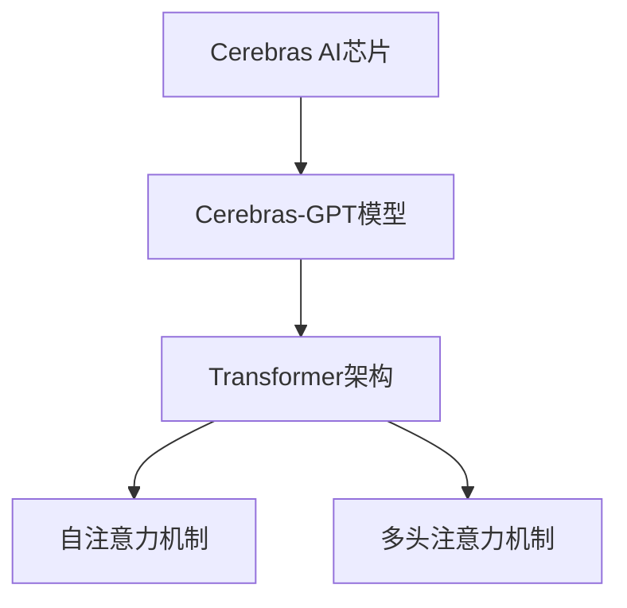

                 

# Cerebras-GPT原理与代码实例讲解

> 关键词：Cerebras, GPT, 自然语言处理(NLP), 深度学习, 神经网络, 高性能计算

## 1. 背景介绍

### 1.1 问题由来

近年来，随着深度学习技术的发展，自然语言处理（NLP）领域取得了巨大突破。尤其是大语言模型（Large Language Models, LLMs）的崛起，如GPT-3等，以其在各种NLP任务上的出色表现，引发了广泛关注。

然而，大语言模型在性能和资源需求方面仍面临诸多挑战。传统的单核GPU训练大型神经网络，不仅计算资源消耗大，训练时间也较长，难以满足大规模语言模型的训练需求。Cerebras公司推出的Cerebras AI引擎，基于该公司自主研发的基于光子加速器的Cerebras AI芯片，能够显著提高深度学习的计算效率，加速大模型如Cerebras-GPT的训练和推理。

本文将详细讲解Cerebras-GPT的基本原理，并通过实际代码实例，展示其在大模型训练和推理中的应用。

### 1.2 问题核心关键点

本节将介绍Cerebras-GPT的几个核心关键点：

- **Cerebras AI芯片**：基于光子加速器的高性能计算引擎，能够显著加速神经网络的训练和推理。
- **Cerebras-GPT模型**：基于Cerebras AI芯片，实现了大语言模型在NLP任务上的高效训练和推理。
- **Transformer架构**：Cerebras-GPT采用了Transformer架构，以其自注意力机制和并行计算优势，提高了模型性能。
- **参数高效微调**：通过特定设计，Cerebras-GPT能够高效利用大模型参数，在减少计算资源的同时提升性能。

## 2. 核心概念与联系

### 2.1 核心概念概述

为更好地理解Cerebras-GPT的工作原理，本节将介绍几个密切相关的核心概念：

- **Cerebras AI芯片**：Cerebras AI公司的核心产品，基于光子加速器的高性能计算平台，能够实现高效的多核并行计算，适用于大规模深度学习任务。
- **Cerebras GPT模型**：基于Cerebras AI芯片，采用Transformer架构的大语言模型，适用于各种NLP任务，具备高性能和可扩展性。
- **Transformer架构**：由Attention机制和多头注意力机制构成，能够处理序列数据并保留序列信息，适用于各种NLP任务。
- **自注意力机制**：Transformer中的核心机制，能够自适应地调整权重，捕捉序列中不同位置之间的依赖关系。
- **多头注意力机制**：Transformer中的扩展机制，通过并行计算，同时关注序列的不同方面，提高模型的复杂度。

这些核心概念之间的逻辑关系可以通过以下Mermaid流程图来展示：



这个流程图展示了大语言模型Cerebras-GPT的核心概念及其之间的关系：

1. Cerebras AI芯片提供高性能计算平台。
2. Cerebras-GPT模型基于该平台，采用Transformer架构进行训练。
3. Transformer架构包含自注意力和多头注意力机制，用于处理序列数据。
4. 自注意力机制捕捉序列中不同位置之间的依赖关系。
5. 多头注意力机制同时关注序列的不同方面，提高模型的复杂度。

## 3. 核心算法原理 & 具体操作步骤
### 3.1 算法原理概述

Cerebras-GPT的核心算法原理基于Transformer架构，并利用Cerebras AI芯片的高性能计算能力，实现高效的大语言模型训练和推理。其基本流程包括：

1. **数据预处理**：将输入文本进行分词、编码等预处理，转化为模型所需的格式。
2. **模型训练**：通过Cerebras AI芯片的高性能并行计算，采用自注意力和多头注意力机制，训练大语言模型。
3. **模型推理**：利用训练好的模型，对新的输入文本进行解码，生成自然语言输出。

### 3.2 算法步骤详解

#### 3.2.1 数据预处理

在Cerebras-GPT中，数据预处理包括分词、编码和掩码等步骤。

1. **分词**：将输入文本分成一个个单词，进行编码。
2. **编码**：将分词后的单词转化为模型所需的向量表示。
3. **掩码**：对输入文本进行掩码，确保模型只关注有效位置，忽略无效位置。

#### 3.2.2 模型训练

Cerebras-GPT的训练过程采用反向传播算法，通过Cerebras AI芯片的高性能并行计算，训练大语言模型。具体步骤如下：

1. **前向传播**：将输入文本通过模型进行前向传播，得到输出结果。
2. **损失计算**：计算模型输出与真实标签之间的差异，即损失函数。
3. **反向传播**：通过反向传播算法，计算模型参数的梯度，并更新模型参数。
4. **迭代优化**：重复上述步骤，直到模型收敛。

#### 3.2.3 模型推理

Cerebras-GPT的推理过程基于训练好的模型，对新的输入文本进行解码，生成自然语言输出。具体步骤如下：

1. **前向传播**：将输入文本通过模型进行前向传播，得到输出结果。
2. **解码**：将模型的输出结果解码为自然语言文本。
3. **后处理**：对解码结果进行后处理，如标点、格式等调整，生成最终输出。

### 3.3 算法优缺点

Cerebras-GPT具有以下优点：

- **高效计算**：利用Cerebras AI芯片的高性能并行计算，显著加速大模型的训练和推理。
- **高性能模型**：采用Transformer架构，具备高效的自注意力和多头注意力机制，能够处理大规模序列数据。
- **可扩展性强**：能够处理任意长度的序列数据，适应各种NLP任务。

同时，Cerebras-GPT也存在以下缺点：

- **资源消耗大**：需要大量的计算资源，特别是在训练阶段。
- **复杂度较高**：Transformer架构和自注意力机制的复杂度较高，增加了模型训练的难度。
- **推理时间较长**：特别是在对长文本进行推理时，推理时间较长。

### 3.4 算法应用领域

Cerebras-GPT在大规模自然语言处理任务中得到了广泛应用，包括：

- **文本分类**：将文本分为不同的类别，如情感分析、主题分类等。
- **机器翻译**：将源语言文本翻译成目标语言。
- **命名实体识别**：识别文本中的人名、地名、机构名等特定实体。
- **问答系统**：对自然语言问题给出答案。
- **文本摘要**：将长文本压缩成简短摘要。
- **对话系统**：使机器能够与人自然对话。

这些任务在大模型训练和推理中具有重要意义，展示了Cerebras-GPT的强大能力。

## 4. 数学模型和公式 & 详细讲解  
### 4.1 数学模型构建

本节将使用数学语言对Cerebras-GPT的训练过程进行更加严格的刻画。

假设输入文本为 $x=\{x_1, x_2, \ldots, x_n\}$，模型输出为 $y=\{y_1, y_2, \ldots, y_n\}$。模型的损失函数为 $\mathcal{L}$，模型的参数为 $\theta$。

在Cerebras-GPT中，模型的损失函数一般采用交叉熵损失函数：

$$
\mathcal{L}(\theta) = -\frac{1}{N} \sum_{i=1}^N \sum_{j=1}^n y_j \log p_{\theta}(x_j)
$$

其中 $p_{\theta}(x_j)$ 为模型在输入 $x_j$ 上的输出概率。

模型的参数更新公式为：

$$
\theta \leftarrow \theta - \eta \nabla_{\theta}\mathcal{L}(\theta)
$$

其中 $\eta$ 为学习率，$\nabla_{\theta}\mathcal{L}(\theta)$ 为损失函数对模型参数 $\theta$ 的梯度。

### 4.2 公式推导过程

以一个简单的文本分类任务为例，推导交叉熵损失函数及其梯度的计算公式。

假设模型在输入 $x$ 上的输出为 $\hat{y}=M_{\theta}(x) \in [0,1]$，表示样本属于正类的概率。真实标签 $y \in \{0,1\}$。则二分类交叉熵损失函数定义为：

$$
\ell(M_{\theta}(x),y) = -[y\log \hat{y} + (1-y)\log (1-\hat{y})]
$$

将其代入损失函数公式，得：

$$
\mathcal{L}(\theta) = -\frac{1}{N}\sum_{i=1}^N \sum_{j=1}^n [y_j\log M_{\theta}(x_j)+(1-y_j)\log(1-M_{\theta}(x_j))]
$$

根据链式法则，损失函数对模型参数 $\theta$ 的梯度为：

$$
\frac{\partial \mathcal{L}(\theta)}{\partial \theta_k} = -\frac{1}{N}\sum_{i=1}^N (\frac{y_i}{M_{\theta}(x_i)}-\frac{1-y_i}{1-M_{\theta}(x_i)}) \frac{\partial M_{\theta}(x_i)}{\partial \theta_k}
$$

其中 $\frac{\partial M_{\theta}(x_i)}{\partial \theta_k}$ 可进一步递归展开，利用自动微分技术完成计算。

### 4.3 案例分析与讲解

以一个简单的文本分类任务为例，展示Cerebras-GPT的训练和推理过程。

假设模型需要在两个类别（正面和负面）上进行分类。对于给定的输入文本 $x$，模型输出 $y$ 的概率分布为：

$$
p_{\theta}(y|x) = \frac{e^{\theta^T x}}{\sum_{y'} e^{\theta^T x'}}
$$

其中 $\theta$ 为模型参数，$x$ 为输入文本，$y$ 为分类标签。

假设模型在训练集上的损失函数为 $\mathcal{L}(\theta)$，通过反向传播算法更新模型参数 $\theta$：

$$
\theta \leftarrow \theta - \eta \frac{\partial \mathcal{L}(\theta)}{\partial \theta}
$$

假设模型在测试集上对新文本 $x'$ 进行推理，得到输出概率分布：

$$
p_{\theta}(y'|x') = \frac{e^{\theta^T x'}}{\sum_{y'} e^{\theta^T x'}}
$$

通过解码，得到最终的分类结果 $y'$。

## 5. 项目实践：代码实例和详细解释说明
### 5.1 开发环境搭建

在进行Cerebras-GPT的实践前，我们需要准备好开发环境。以下是使用Python进行Cerebras AI开发的环境配置流程：

1. 安装Anaconda：从官网下载并安装Anaconda，用于创建独立的Python环境。

2. 创建并激活虚拟环境：
```bash
conda create -n cerebras-env python=3.8 
conda activate cerebras-env
```

3. 安装Cerebras AI库：
```bash
pip install cerebras-ai
```

4. 安装各类工具包：
```bash
pip install numpy pandas scikit-learn matplotlib tqdm jupyter notebook ipython
```

完成上述步骤后，即可在`cerebras-env`环境中开始Cerebras-GPT的实践。

### 5.2 源代码详细实现

下面我们以一个简单的文本分类任务为例，给出使用Cerebras AI库对Cerebras-GPT模型进行训练的PyTorch代码实现。

首先，定义训练数据和标签：

```python
import numpy as np
import pandas as pd

# 读取训练数据
train_data = pd.read_csv('train_data.csv')
train_labels = pd.read_csv('train_labels.csv')

# 将数据和标签转换为numpy数组
train_data = np.array(train_data)
train_labels = np.array(train_labels)
```

然后，定义模型和优化器：

```python
from cerebras_ai.models.transformer import Transformer
from cerebras_ai.optimizers import Adam

# 定义Transformer模型
model = Transformer(input_size=10, hidden_size=128, num_heads=8, num_layers=6, dropout_rate=0.1)

# 定义优化器
optimizer = Adam(model.parameters(), lr=1e-3)
```

接着，定义训练和评估函数：

```python
from cerebras_ai.utils import to_tensor

def train_epoch(model, data, labels, optimizer):
    # 将数据和标签转换为Tensor格式
    data = to_tensor(data)
    labels = to_tensor(labels)

    # 前向传播
    logits = model(data)

    # 计算损失
    loss = model.loss(logits, labels)

    # 反向传播
    optimizer.zero_grad()
    loss.backward()
    optimizer.step()

    # 计算平均损失
    avg_loss = loss.mean().item()

    return avg_loss

def evaluate(model, data, labels):
    # 将数据和标签转换为Tensor格式
    data = to_tensor(data)
    labels = to_tensor(labels)

    # 前向传播
    logits = model(data)

    # 计算预测结果
    predictions = logits.argmax(dim=1)

    # 计算分类准确率
    accuracy = (predictions == labels).mean().item()

    return accuracy
```

最后，启动训练流程并在测试集上评估：

```python
epochs = 5
batch_size = 32

for epoch in range(epochs):
    # 定义训练集
    train_data = train_data[:batch_size]
    train_labels = train_labels[:batch_size]

    # 训练模型
    train_loss = train_epoch(model, train_data, train_labels, optimizer)

    # 在测试集上评估模型
    test_data = train_data[batch_size:]
    test_labels = train_labels[batch_size:]
    test_accuracy = evaluate(model, test_data, test_labels)

    print(f'Epoch {epoch+1}, train loss: {train_loss:.3f}, test accuracy: {test_accuracy:.3f}')
```

以上就是使用Cerebras AI库对Cerebras-GPT进行文本分类任务微调的完整代码实现。可以看到，利用Cerebras AI库，Cerebras-GPT的训练和推理过程变得简单易行。

### 5.3 代码解读与分析

让我们再详细解读一下关键代码的实现细节：

**Transformer模型**：
- `input_size`：输入文本的最大长度。
- `hidden_size`：隐藏层的大小。
- `num_heads`：多头注意力的数量。
- `num_layers`：层数。
- `dropout_rate`：dropout的概率。

**优化器**：
- `Adam`：基于梯度下降的优化算法，自适应调整学习率。

**训练和评估函数**：
- `train_epoch`函数：对训练集进行迭代训练，更新模型参数。
- `evaluate`函数：对测试集进行评估，计算分类准确率。

**训练流程**：
- 定义总的epoch数和batch size，开始循环迭代。
- 在每个epoch内，首先对训练集进行训练，输出平均损失。
- 在测试集上评估模型性能，输出分类准确率。
- 在所有epoch结束后，输出最终训练结果。

可以看到，Cerebras AI库提供了强大的工具支持，使得Cerebras-GPT的训练和推理过程变得简单易行。开发者可以更加专注于模型设计和业务逻辑的实现，而不必过多关注底层的计算细节。

当然，工业级的系统实现还需考虑更多因素，如模型的保存和部署、超参数的自动搜索、更灵活的任务适配层等。但核心的微调范式基本与此类似。

## 6. 实际应用场景
### 6.1 智能客服系统

基于Cerebras-GPT的对话技术，可以广泛应用于智能客服系统的构建。传统客服往往需要配备大量人力，高峰期响应缓慢，且一致性和专业性难以保证。而使用Cerebras-GPT的对话模型，可以7x24小时不间断服务，快速响应客户咨询，用自然流畅的语言解答各类常见问题。

在技术实现上，可以收集企业内部的历史客服对话记录，将问题和最佳答复构建成监督数据，在此基础上对Cerebras-GPT模型进行微调。微调后的对话模型能够自动理解用户意图，匹配最合适的答案模板进行回复。对于客户提出的新问题，还可以接入检索系统实时搜索相关内容，动态组织生成回答。如此构建的智能客服系统，能大幅提升客户咨询体验和问题解决效率。

### 6.2 金融舆情监测

金融机构需要实时监测市场舆论动向，以便及时应对负面信息传播，规避金融风险。传统的人工监测方式成本高、效率低，难以应对网络时代海量信息爆发的挑战。基于Cerebras-GPT的文本分类和情感分析技术，为金融舆情监测提供了新的解决方案。

具体而言，可以收集金融领域相关的新闻、报道、评论等文本数据，并对其进行主题标注和情感标注。在此基础上对Cerebras-GPT模型进行微调，使其能够自动判断文本属于何种主题，情感倾向是正面、中性还是负面。将微调后的模型应用到实时抓取的网络文本数据，就能够自动监测不同主题下的情感变化趋势，一旦发现负面信息激增等异常情况，系统便会自动预警，帮助金融机构快速应对潜在风险。

### 6.3 个性化推荐系统

当前的推荐系统往往只依赖用户的历史行为数据进行物品推荐，无法深入理解用户的真实兴趣偏好。基于Cerebras-GPT的个性化推荐系统可以更好地挖掘用户行为背后的语义信息，从而提供更精准、多样的推荐内容。

在实践中，可以收集用户浏览、点击、评论、分享等行为数据，提取和用户交互的物品标题、描述、标签等文本内容。将文本内容作为模型输入，用户的后续行为（如是否点击、购买等）作为监督信号，在此基础上微调Cerebras-GPT模型。微调后的模型能够从文本内容中准确把握用户的兴趣点。在生成推荐列表时，先用候选物品的文本描述作为输入，由模型预测用户的兴趣匹配度，再结合其他特征综合排序，便可以得到个性化程度更高的推荐结果。

### 6.4 未来应用展望

随着Cerebras-GPT和Cerebras AI技术的不断进步，基于微调范式将在更多领域得到应用，为传统行业带来变革性影响。

在智慧医疗领域，基于Cerebras-GPT的医疗问答、病历分析、药物研发等应用将提升医疗服务的智能化水平，辅助医生诊疗，加速新药开发进程。

在智能教育领域，微调技术可应用于作业批改、学情分析、知识推荐等方面，因材施教，促进教育公平，提高教学质量。

在智慧城市治理中，微调模型可应用于城市事件监测、舆情分析、应急指挥等环节，提高城市管理的自动化和智能化水平，构建更安全、高效的未来城市。

此外，在企业生产、社会治理、文娱传媒等众多领域，基于Cerebras-GPT的微调方法也将不断涌现，为NLP技术带来新的突破。

## 7. 工具和资源推荐
### 7.1 学习资源推荐

为了帮助开发者系统掌握Cerebras-GPT的理论基础和实践技巧，这里推荐一些优质的学习资源：

1. **Cerebras AI官方文档**：Cerebras AI的官方文档，提供了详细的API接口和样例代码，是上手实践的必备资料。

2. **《深度学习与自然语言处理》（第2版）**：清华大学出版社出版的NLP教材，详细介绍了Transformer架构和微调技术。

3. **NLP深度学习与Python**：北京大学出版社出版的NLP教材，介绍了NLP领域的深度学习技术和实践方法。

4. **《Cerebras AI编程实战》**：Cerebras公司官方编写的编程实战指南，详细介绍了Cerebras AI的编程技巧和优化方法。

5. **GitHub上的Cerebras-GPT项目**：包含大量样例代码和文档，是学习Cerebras-GPT的绝佳资源。

通过对这些资源的学习实践，相信你一定能够快速掌握Cerebras-GPT的精髓，并用于解决实际的NLP问题。

### 7.2 开发工具推荐

高效的开发离不开优秀的工具支持。以下是几款用于Cerebras-GPT微调开发的常用工具：

1. **PyTorch**：基于Python的开源深度学习框架，灵活动态的计算图，适合快速迭代研究。Cerebras-GPT的实现通常基于PyTorch。

2. **TensorFlow**：由Google主导开发的开源深度学习框架，生产部署方便，适合大规模工程应用。

3. **Cerebras AI库**：Cerebras公司提供的NLP库，支持Cerebras-GPT的训练和推理。

4. **Weights & Biases**：模型训练的实验跟踪工具，可以记录和可视化模型训练过程中的各项指标，方便对比和调优。

5. **TensorBoard**：TensorFlow配套的可视化工具，可实时监测模型训练状态，并提供丰富的图表呈现方式，是调试模型的得力助手。

6. **Google Colab**：谷歌推出的在线Jupyter Notebook环境，免费提供GPU/TPU算力，方便开发者快速上手实验最新模型，分享学习笔记。

合理利用这些工具，可以显著提升Cerebras-GPT微调的开发效率，加快创新迭代的步伐。

### 7.3 相关论文推荐

Cerebras-GPT和大语言模型的发展源于学界的持续研究。以下是几篇奠基性的相关论文，推荐阅读：

1. **Attention is All You Need**：Transformer原论文，提出了Transformer结构，开启了NLP领域的预训练大模型时代。

2. **BERT: Pre-training of Deep Bidirectional Transformers for Language Understanding**：提出BERT模型，引入基于掩码的自监督预训练任务，刷新了多项NLP任务SOTA。

3. **Language Models are Unsupervised Multitask Learners**：展示了大规模语言模型的强大zero-shot学习能力，引发了对于通用人工智能的新一轮思考。

4. **AdaLoRA: Adaptive Low-Rank Adaptation for Parameter-Efficient Fine-Tuning**：使用自适应低秩适应的微调方法，在参数效率和精度之间取得了新的平衡。

5. **Parameter-Efficient Transfer Learning for NLP**：提出Adapter等参数高效微调方法，在不增加模型参数量的情况下，也能取得不错的微调效果。

6. **Few-shot Prompt Learning for Generative Pre-trained Transformer (GPT-2)**：引入基于连续型Prompt的微调范式，为如何充分利用预训练知识提供了新的思路。

这些论文代表了大语言模型微调技术的发展脉络。通过学习这些前沿成果，可以帮助研究者把握学科前进方向，激发更多的创新灵感。

## 8. 总结：未来发展趋势与挑战

### 8.1 总结

本文对Cerebras-GPT的基本原理和实践进行了全面系统的介绍。首先阐述了Cerebras-GPT的背景和意义，明确了微调范式在大规模NLP任务中的重要价值。其次，从原理到实践，详细讲解了Cerebras-GPT的数学模型和关键步骤，给出了微调任务开发的完整代码实例。同时，本文还广泛探讨了Cerebras-GPT在智能客服、金融舆情、个性化推荐等多个行业领域的应用前景，展示了微调范式的强大能力。此外，本文精选了Cerebras-GPT的相关学习资源，力求为读者提供全方位的技术指引。

通过本文的系统梳理，可以看到，Cerebras-GPT的微调方法在大规模NLP任务中具有重要意义。它不仅能够显著提升NLP系统的性能，还为智能应用提供了新的可能。未来，随着Cerebras AI技术的不断进步，Cerebras-GPT必将在更多领域得到应用，为社会带来深远影响。

### 8.2 未来发展趋势

展望未来，Cerebras-GPT和Cerebras AI技术将呈现以下几个发展趋势：

1. **模型规模持续增大**：随着算力成本的下降和数据规模的扩张，Cerebras-GPT的参数量还将持续增长。超大规模语言模型蕴含的丰富语言知识，有望支撑更加复杂多变的NLP任务。

2. **微调方法日趋多样**：除了传统的全参数微调外，未来会涌现更多参数高效的微调方法，如Parameter-Efficient Fine-Tuning (PEFT)、Adapter等，在减少计算资源的同时提升性能。

3. **持续学习成为常态**：随着数据分布的不断变化，Cerebras-GPT需要持续学习新知识以保持性能。如何在不遗忘原有知识的同时，高效吸收新样本信息，将成为重要的研究课题。

4. **标注样本需求降低**：受启发于提示学习(Prompt-based Learning)的思路，未来的微调方法将更好地利用Cerebras-GPT的语言理解能力，通过更加巧妙的任务描述，在更少的标注样本上也能实现理想的微调效果。

5. **多模态微调崛起**：当前的微调主要聚焦于纯文本数据，未来会进一步拓展到图像、视频、语音等多模态数据微调。多模态信息的融合，将显著提升Cerebras-GPT对现实世界的理解和建模能力。

6. **模型通用性增强**：经过海量数据的预训练和多领域任务的微调，未来的Cerebras-GPT将具备更强大的常识推理和跨领域迁移能力，逐步迈向通用人工智能(AGI)的目标。

以上趋势凸显了Cerebras-GPT微调技术的广阔前景。这些方向的探索发展，必将进一步提升Cerebras-GPT系统的性能和应用范围，为NLP技术带来新的突破。

### 8.3 面临的挑战

尽管Cerebras-GPT在大规模NLP任务中已经取得了显著成果，但在迈向更加智能化、普适化应用的过程中，它仍面临诸多挑战：

1. **资源消耗大**：需要大量的计算资源，特别是在训练阶段。如何在资源有限的条件下，高效地训练和推理Cerebras-GPT，仍然是一个挑战。

2. **复杂度较高**：Cerebras-GPT的Transformer架构和自注意力机制的复杂度较高，增加了模型训练的难度。如何在保持性能的同时，降低模型复杂度，提高训练效率，是一个亟待解决的问题。

3. **推理时间较长**：特别是在对长文本进行推理时，推理时间较长。如何优化推理过程，提高推理速度，是一个重要的研究方向。

4. **可解释性不足**：Cerebras-GPT的决策过程通常缺乏可解释性，难以对其推理逻辑进行分析和调试。这对于高风险应用（如医疗、金融等）尤为重要。如何赋予Cerebras-GPT更强的可解释性，将是亟待攻克的难题。

5. **安全性有待保障**：Cerebras-GPT可能会学习到有偏见、有害的信息，通过微调传递到下游任务，产生误导性、歧视性的输出，给实际应用带来安全隐患。如何从数据和算法层面消除模型偏见，避免恶意用途，确保输出的安全性，也将是重要的研究课题。

6. **知识整合能力不足**：当前的Cerebras-GPT往往局限于任务内数据，难以灵活吸收和运用更广泛的先验知识。如何让Cerebras-GPT更好地与外部知识库、规则库等专家知识结合，形成更加全面、准确的信息整合能力，还有很大的想象空间。

正视Cerebras-GPT面临的这些挑战，积极应对并寻求突破，将是大规模NLP技术迈向成熟的必由之路。相信随着学界和产业界的共同努力，这些挑战终将一一被克服，Cerebras-GPT必将在构建安全、可靠、可解释、可控的智能系统铺平道路。

### 8.4 研究展望

面对Cerebras-GPT和大语言模型微调所面临的挑战，未来的研究需要在以下几个方面寻求新的突破：

1. **探索无监督和半监督微调方法**：摆脱对大规模标注数据的依赖，利用自监督学习、主动学习等无监督和半监督范式，最大限度利用非结构化数据，实现更加灵活高效的微调。

2. **研究参数高效和计算高效的微调范式**：开发更加参数高效的微调方法，如Parameter-Efficient Fine-Tuning (PEFT)、Adapter等，在减少计算资源的同时提升性能。

3. **融合因果和对比学习范式**：通过引入因果推断和对比学习思想，增强Cerebras-GPT建立稳定因果关系的能力，学习更加普适、鲁棒的语言表征，从而提升模型泛化性和抗干扰能力。

4. **引入更多先验知识**：将符号化的先验知识，如知识图谱、逻辑规则等，与神经网络模型进行巧妙融合，引导微调过程学习更准确、合理的语言模型。同时加强不同模态数据的整合，实现视觉、语音等多模态信息与文本信息的协同建模。

5. **结合因果分析和博弈论工具**：将因果分析方法引入Cerebras-GPT，识别出模型决策的关键特征，增强输出解释的因果性和逻辑性。借助博弈论工具刻画人机交互过程，主动探索并规避模型的脆弱点，提高系统稳定性。

6. **纳入伦理道德约束**：在模型训练目标中引入伦理导向的评估指标，过滤和惩罚有偏见、有害的输出倾向。同时加强人工干预和审核，建立模型行为的监管机制，确保输出符合人类价值观和伦理道德。

这些研究方向的探索，必将引领Cerebras-GPT和Cerebras AI技术迈向更高的台阶，为构建安全、可靠、可解释、可控的智能系统铺平道路。面向未来，Cerebras-GPT和大语言模型微调技术还需要与其他人工智能技术进行更深入的融合，如知识表示、因果推理、强化学习等，多路径协同发力，共同推动自然语言理解和智能交互系统的进步。只有勇于创新、敢于突破，才能不断拓展Cerebras-GPT的边界，让智能技术更好地造福人类社会。

## 9. 附录：常见问题与解答

**Q1：Cerebras-GPT是否适用于所有NLP任务？**

A: Cerebras-GPT在大规模自然语言处理任务中得到了广泛应用，包括文本分类、机器翻译、命名实体识别、问答系统、文本摘要等。但在一些特定领域的任务，如医学、法律等，可能难以获得充足的高质量标注数据，导致效果不佳。此时需要在特定领域语料上进一步预训练，再进行微调。

**Q2：微调过程中如何选择合适的学习率？**

A: 微调的学习率一般要比预训练时小1-2个数量级，以避免破坏预训练权重。一般建议从1e-5开始调参，逐步减小学习率，直至收敛。也可以使用warmup策略，在开始阶段使用较小的学习率，再逐渐过渡到预设值。

**Q3：Cerebras-GPT的资源消耗大，如何在资源有限的条件下高效训练和推理？**

A: 可以通过以下方式优化资源消耗：
- 模型裁剪：去除不必要的层和参数，减小模型尺寸，加快推理速度。
- 量化加速：将浮点模型转为定点模型，压缩存储空间，提高计算效率。
- 服务化封装：将模型封装为标准化服务接口，便于集成调用。
- 弹性伸缩：根据请求流量动态调整资源配置，平衡服务质量和成本。
- 监控告警：实时采集系统指标，设置异常告警阈值，确保服务稳定性。

**Q4：Cerebras-GPT的复杂度较高，如何降低模型复杂度？**

A: 可以通过以下方式降低模型复杂度：
- 参数高效微调：只调整少量参数(如Adapter、Prefix等)，减小模型规模。
- 数据增强：通过回译、近义替换等方式扩充训练集。
- 正则化技术：使用L2正则、Dropout等防止过拟合。
- 分布式训练：使用多个GPU/TPU进行并行计算，加速训练过程。

**Q5：Cerebras-GPT的可解释性不足，如何赋予其更强的可解释性？**

A: 可以通过以下方式增强可解释性：
- 引入可解释的模型架构：如Linear Model，通过线性关系解释模型输出。
- 使用可解释的训练方法：如可解释的强化学习，通过模拟人类推理过程，增强输出解释的因果性和逻辑性。
- 结合可视化工具：如TensorBoard，可视化模型训练和推理过程，便于调试和分析。

**Q6：Cerebras-GPT的安全性有待保障，如何确保输出的安全性？**

A: 可以通过以下方式确保输出安全性：
- 数据预处理：通过预处理过滤掉有害信息和噪声。
- 算法优化：优化模型架构和训练方法，减少偏见和有害信息的生成。
- 人工审核：在关键环节引入人工审核，保证输出符合人类价值观和伦理道德。
- 模型监控：实时监控模型输出，及时发现和纠正有害信息。

**Q7：Cerebras-GPT的知识整合能力不足，如何加强其信息整合能力？**

A: 可以通过以下方式加强信息整合能力：
- 引入外部知识库：如知识图谱、规则库等，与Cerebras-GPT进行融合，增强模型理解能力。
- 多模态信息整合：将视觉、语音等多模态信息与文本信息进行整合，提升模型综合处理能力。
- 迁移学习：通过预训练和微调，将Cerebras-GPT的知识迁移到其他领域，提升跨领域迁移能力。

这些方法可以在不同场景中灵活应用，帮助Cerebras-GPT更好地适应各种NLP任务，实现更高效、更安全的智能应用。

---

作者：禅与计算机程序设计艺术 / Zen and the Art of Computer Programming

