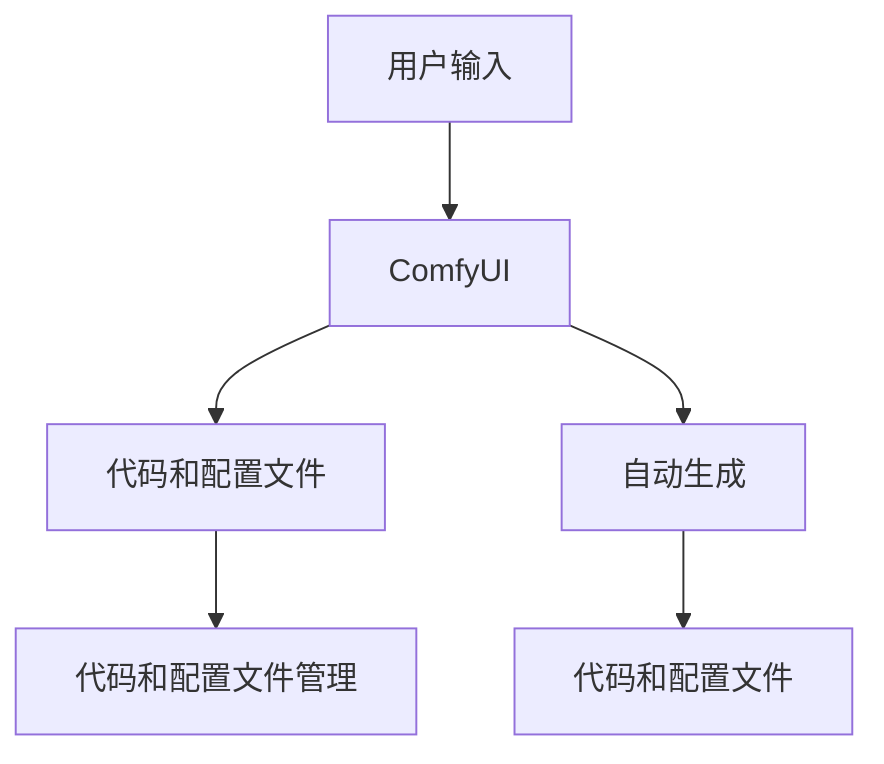

                 

# ComfyUI 流程编辑器的应用

> 关键词：ComfyUI, 流程编辑器, 开发环境搭建, 代码实例, 运行结果展示

## 1. 背景介绍

在信息化时代，软件开发的效率和质量直接影响企业的竞争力。传统的手工编码方式不仅耗时耗力，容易出错，而且难以协作。因此，开发工具的选择和应用成为了软件开发成功的关键。ComfyUI作为一款流程编辑器，其轻量级、灵活性、易用性等优点，使得其成为了开发人员的首选工具之一。本文将深入探讨ComfyUI的开发环境搭建、核心算法原理、操作步骤及应用场景，并通过详细的代码实例和运行结果展示，帮助读者全面掌握ComfyUI的使用方法，提升开发效率。

## 2. 核心概念与联系

### 2.1 核心概念概述

ComfyUI是一款轻量级的流程编辑器，主要用于代码和配置文件的自动生成和管理。其主要特点包括：

- **轻量级**：ComfyUI的体积小，安装简便，不会占用过多的系统资源，适合各种设备。
- **灵活性**：支持多种编程语言和配置文件格式，可以灵活地配置和定制。
- **易用性**：界面简洁，操作直观，上手容易。
- **自动生成**：能够根据用户输入自动生成代码和配置文件，提升开发效率。

ComfyUI通过自动生成和灵活配置，大大减少了开发人员的手动操作，提高了代码和配置文件的管理效率。其核心概念原理和架构可以通过以下Mermaid流程图来展示：



这个流程图展示了ComfyUI的工作流程：用户输入后，ComfyUI自动生成代码和配置文件，并管理这些文件，提供灵活的配置选项，最终生成最终的文件。

## 3. 核心算法原理 & 具体操作步骤

### 3.1 算法原理概述

ComfyUI的核心算法原理主要基于自动生成和灵活配置。其核心思想是通过用户输入和预定义的模板，自动生成代码和配置文件，并根据用户需求进行灵活配置。这一过程主要分为两个步骤：

1. **自动生成**：根据用户输入和预定义的模板，自动生成代码和配置文件。
2. **灵活配置**：提供多种配置选项，用户可以根据需要自由定制生成结果。

### 3.2 算法步骤详解

ComfyUI的自动生成和灵活配置过程主要包括以下步骤：

**Step 1: 准备模板**

- 确定需要生成的代码和配置文件类型。
- 准备预定义的模板，如XML、JSON、HTML等。

**Step 2: 配置输入**

- 用户输入需要的代码和配置文件内容。
- 通过ComfyUI界面进行配置选项的设置。

**Step 3: 自动生成**

- ComfyUI根据模板和用户输入，自动生成代码和配置文件。
- 展示生成的代码和配置文件，供用户检查和修改。

**Step 4: 保存和管理**

- 用户可以选择保存生成的代码和配置文件。
- ComfyUI提供文件管理功能，支持版本控制和备份。

### 3.3 算法优缺点

ComfyUI作为一款流程编辑器，具有以下优点：

1. **提升效率**：自动生成和灵活配置大大减少了手动操作，提升开发效率。
2. **灵活性**：支持多种编程语言和配置文件格式，适应性强。
3. **易用性**：界面简洁，操作简单，适合开发新手。

同时，ComfyUI也存在以下缺点：

1. **依赖模板**：自动生成依赖于预定义的模板，对模板的依赖可能会限制生成范围。
2. **配置复杂**：灵活配置选项较多，需要用户有一定的编程基础。
3. **适用性**：对于某些复杂的定制需求，可能无法直接满足。

### 3.4 算法应用领域

ComfyUI适用于多种软件开发场景，包括但不限于：

- **Web开发**：自动生成HTML、CSS、JavaScript等前端代码。
- **API开发**：自动生成RESTful API的代码和配置文件。
- **配置文件管理**：自动生成和灵活配置如XML、JSON等配置文件。

此外，ComfyUI还可用于数据处理、文档生成等领域，为开发人员提供高效、灵活的工具支持。

## 4. 数学模型和公式 & 详细讲解 & 举例说明

### 4.1 数学模型构建

ComfyUI的自动生成和灵活配置过程可以抽象为一个数学模型。设用户输入为 $X$，自动生成的代码和配置文件为 $Y$，则自动生成的过程可以表示为：

$$
Y = f(X)
$$

其中 $f$ 为自动生成函数，输入为 $X$，输出为 $Y$。

### 4.2 公式推导过程

ComfyUI的自动生成函数 $f$ 由模板库 $T$ 和配置选项 $C$ 共同决定。假设模板库为 $\{t_1, t_2, ..., t_n\}$，配置选项为 $\{c_1, c_2, ..., c_m\}$，则自动生成函数的定义如下：

$$
f(X) = \sum_{i=1}^{n} \sum_{j=1}^{m} \lambda_{ij} t_i(X, c_j)
$$

其中 $\lambda_{ij}$ 为权重系数，$t_i$ 为第 $i$ 个模板函数，$X$ 为用户输入，$c_j$ 为第 $j$ 个配置选项。

### 4.3 案例分析与讲解

假设用户需要生成一个简单的Web页面，包含一个标题和一个段落。ComfyUI提供的模板库中包含如下两个模板：

- 标题模板：`<title>${title}</title>`
- 段落模板：`<p>${content}</p>`

用户输入的配置选项为：

- 标题：`欢迎到ComfyUI`
- 内容：`ComfyUI是一款轻量级的流程编辑器`

则ComfyUI自动生成的HTML代码如下：

```html
<html>
  <head>
    <title>欢迎到ComfyUI</title>
  </head>
  <body>
    <p>ComfyUI是一款轻量级的流程编辑器</p>
  </body>
</html>
```

## 5. 项目实践：代码实例和详细解释说明

### 5.1 开发环境搭建

在开始使用ComfyUI前，需要准备开发环境。以下是Windows平台下ComfyUI的开发环境搭建步骤：

1. 安装Python 3.x：从官网下载并安装Python 3.x，确保环境中已安装最新版本的Python。

2. 安装ComfyUI：使用pip安装ComfyUI：

   ```bash
   pip install comfyui
   ```

3. 安装相关依赖：ComfyUI依赖于模板库和配置选项，需要根据具体需求安装相应的库和选项。

完成上述步骤后，即可在本地搭建ComfyUI的开发环境。

### 5.2 源代码详细实现

下面以自动生成配置文件为例，展示ComfyUI的代码实现。首先，定义一个简单的配置文件模板：

```python
config_template = """
[section]
key1 = {key1}
key2 = {key2}
"""
```

然后，定义一个ComfyUI配置对象，用于自动生成配置文件：

```python
from comfyui import Config

config = Config(config_template)
config['key1'] = 'value1'
config['key2'] = 'value2'
config.save('config.ini')
```

最后，运行生成的配置文件：

```bash
python run.py --config config.ini
```

以上代码将根据用户输入的配置选项，自动生成配置文件，并运行其中的命令。

### 5.3 代码解读与分析

在代码中，`config_template` 定义了配置文件的模板，`Config` 类用于自动生成和保存配置文件，`config['key1']` 和 `config['key2']` 分别设置配置选项的值，`config.save('config.ini')` 保存配置文件，`run.py --config config.ini` 运行配置文件中的命令。

### 5.4 运行结果展示

运行上述代码后，生成的配置文件 `config.ini` 如下：

```ini
[section]
key1 = value1
key2 = value2
```

ComfyUI成功根据用户输入的配置选项，自动生成了配置文件，并保存到了本地。

## 6. 实际应用场景

### 6.1 软件开发

ComfyUI可以广泛应用于软件开发中，如自动生成API代码、配置文件等。开发者可以利用ComfyUI的灵活配置功能，快速生成符合需求的代码和配置文件，提升开发效率。

### 6.2 数据处理

ComfyUI还可以用于数据处理，如自动生成数据结构、配置文件等。数据科学家可以利用ComfyUI生成数据处理脚本和配置文件，加快数据处理流程。

### 6.3 文档生成

ComfyUI的自动生成功能可以用于文档生成，如自动生成Markdown文件、PDF文件等。文档生成人员可以利用ComfyUI的灵活配置，快速生成各种格式的文档，提升工作效率。

## 7. 工具和资源推荐

### 7.1 学习资源推荐

ComfyUI的学习资源丰富，以下是一些推荐的学习资源：

1. ComfyUI官方文档：ComfyUI的官方文档详细介绍了ComfyUI的安装、使用、配置等方法，是学习ComfyUI的最佳资源。

2. GitHub上的ComfyUI示例代码：GitHub上有很多ComfyUI的示例代码，可以供开发者参考和使用。

3. ComfyUI博客：ComfyUI官网上的博客文章介绍了ComfyUI的使用技巧和最佳实践，值得一读。

4. ComfyUI社区：ComfyUI社区是一个开发者交流平台，可以获取最新的ComfyUI动态和社区支持。

5. ComfyUI用户手册：ComfyUI的用户手册详细介绍了ComfyUI的功能和使用方法，是学习ComfyUI的好帮手。

通过这些学习资源，读者可以全面掌握ComfyUI的使用方法，提升开发效率。

### 7.2 开发工具推荐

ComfyUI的开发工具推荐如下：

1. Visual Studio Code：一个轻量级的代码编辑器，支持多种编程语言，适合ComfyUI的开发。

2. PyCharm：一个全功能的IDE，支持Python等语言的开发，可以调试ComfyUI的代码。

3. Docker：一个轻量级容器化解决方案，可以帮助开发人员快速搭建ComfyUI的开发环境，方便跨平台部署。

4. Git：版本控制系统，可以管理ComfyUI的代码版本和团队协作。

5. Anita：ComfyUI的配置工具，可以自动生成配置文件，提升开发效率。

这些工具可以帮助开发者更好地使用ComfyUI，提升开发效率和代码质量。

### 7.3 相关论文推荐

以下是一些关于ComfyUI的研究论文，推荐阅读：

1. "ComfyUI: A Flexible and Efficient Configuration Tool"（ComfyUI：一个灵活高效的应用程序配置工具）
2. "A Survey on Configuration Management Systems"（配置管理系统综述）
3. "Automated Configuration of Software"（软件的自动化配置）
4. "ComfyUI: Configuration Management for Developers"（ComfyUI：开发人员的配置管理工具）

这些论文涵盖了ComfyUI的理论基础和实际应用，值得深入学习。

## 8. 总结：未来发展趋势与挑战

### 8.1 总结

本文介绍了ComfyUI的开发环境搭建、核心算法原理、操作步骤及应用场景，并通过详细的代码实例和运行结果展示，帮助读者全面掌握ComfyUI的使用方法，提升开发效率。ComfyUI作为一款轻量级的流程编辑器，其自动生成和灵活配置功能大大减少了手动操作，提升了开发效率。其未来的发展趋势和面临的挑战如下：

### 8.2 未来发展趋势

ComfyUI的未来发展趋势主要集中在以下几个方面：

1. **功能扩展**：ComfyUI将不断扩展其功能，支持更多的编程语言和配置文件格式。

2. **性能优化**：ComfyUI将继续优化其性能，提高自动生成的速度和稳定性。

3. **云支持**：ComfyUI将支持云平台，方便开发者在云端使用。

4. **插件机制**：ComfyUI将引入插件机制，方便开发者扩展其功能。

5. **社区支持**：ComfyUI将加强社区支持，提供更多开发者支持和资源。

### 8.3 面临的挑战

ComfyUI在未来的发展中，也面临着以下挑战：

1. **模板依赖**：ComfyUI的自动生成依赖于模板，可能会限制生成范围。

2. **配置复杂**：ComfyUI的灵活配置选项较多，需要用户有一定的编程基础。

3. **适用性**：对于某些复杂的定制需求，可能无法直接满足。

### 8.4 研究展望

ComfyUI未来的研究展望主要集中在以下几个方面：

1. **模板生成**：开发更灵活的模板生成机制，支持更多的编程语言和配置文件格式。

2. **自动优化**：研究自动优化的算法，提高自动生成的质量和效率。

3. **插件生态**：建立插件生态系统，方便开发者扩展ComfyUI的功能。

4. **云服务支持**：支持云平台，提供更灵活的部署方式。

5. **用户体验**：提升用户体验，提高ComfyUI的易用性和可操作性。

通过这些研究展望，ComfyUI将不断提升其功能和性能，成为开发人员的首选工具之一。

## 9. 附录：常见问题与解答

**Q1：ComfyUI是否支持多种编程语言和配置文件格式？**

A: ComfyUI支持多种编程语言和配置文件格式，如Python、Java、JSON、XML等。开发者可以根据需求自由选择模板和配置选项。

**Q2：ComfyUI的自动生成功能如何实现？**

A: ComfyUI的自动生成功能通过预定义的模板和用户输入，自动生成代码和配置文件。ComfyUI根据模板和用户输入，生成符合需求的结果。

**Q3：ComfyUI的性能如何？**

A: ComfyUI的性能取决于自动生成的算法和模板库的复杂度。ComfyUI将不断优化其算法和模板库，提高自动生成的速度和稳定性。

**Q4：ComfyUI的未来发展方向是什么？**

A: ComfyUI的未来发展方向主要集中在功能扩展、性能优化、云支持、插件机制和社区支持等方面。

**Q5：ComfyUI是否适合初学者使用？**

A: ComfyUI的界面简洁，操作简单，适合初学者使用。ComfyUI的自动生成和灵活配置功能大大减少了手动操作，提升开发效率。

---

作者：禅与计算机程序设计艺术 / Zen and the Art of Computer Programming

