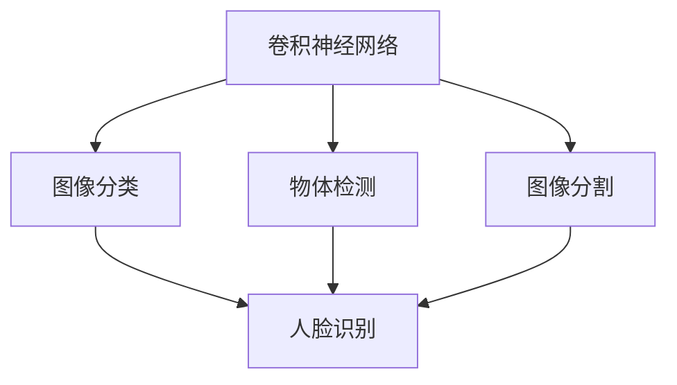

                 

# Computer Vision原理与代码实例讲解

> 关键词：Computer Vision, 卷积神经网络(CNN), 图像分类, 物体检测, 图像分割, 人脸识别, PyTorch, TensorFlow, Keras

## 1. 背景介绍

计算机视觉（Computer Vision, CV）是人工智能（AI）和机器学习（ML）领域的重要分支，旨在让计算机理解、解释和处理图像和视频数据。随着深度学习技术的不断发展，卷积神经网络（Convolutional Neural Networks, CNNs）成为了计算机视觉领域的主流模型。本文将深入介绍卷积神经网络的基本原理，并结合实际代码实例讲解图像分类、物体检测、图像分割、人脸识别等关键任务的实现方法。

## 2. 核心概念与联系

### 2.1 核心概念概述

计算机视觉主要关注以下几个核心概念：

- **卷积神经网络（CNN）**：CNN是深度学习中用于图像和视频处理的最广泛使用的模型。其核心组件是卷积层、池化层和全连接层，通过堆叠这些层，可以自动学习图像特征。
- **图像分类（Image Classification）**：图像分类是指将图像分为不同的类别，如猫、狗、车等。
- **物体检测（Object Detection）**：物体检测不仅要将图像分类，还要确定每个分类在图像中的位置。
- **图像分割（Image Segmentation）**：图像分割是将图像分成多个区域，每个区域属于同一个类别。
- **人脸识别（Face Recognition）**：人脸识别是识别并验证人身份的过程。

这些概念之间的联系可以通过以下Mermaid流程图来展示：



这个流程图展示了卷积神经网络与图像分类、物体检测、图像分割和人脸识别等关键任务之间的逻辑关系：卷积神经网络通过自动学习图像特征，为上述任务提供基础支持。

## 3. 核心算法原理 & 具体操作步骤

### 3.1 算法原理概述

卷积神经网络（CNN）的核心思想是通过卷积层自动提取图像特征，并通过池化层减小特征图的尺寸，最后通过全连接层进行分类。其核心组件包括卷积层、池化层和全连接层。

- **卷积层（Convolutional Layer）**：卷积层通过滑动卷积核（Filter）在输入图像上进行操作，自动学习图像的特征。卷积操作可以保留输入图像的空间结构，使得模型能够学习到图像的局部特征。
- **池化层（Pooling Layer）**：池化层通过对卷积层输出的特征图进行降采样，减小特征图的尺寸，降低模型参数数量，提高计算效率。
- **全连接层（Fully Connected Layer）**：全连接层将卷积和池化层提取的特征进行线性变换，进行最终的分类。

### 3.2 算法步骤详解

以下是CNN在图像分类任务上的具体操作步骤：

**Step 1: 准备数据集**
- 收集图像数据集，并进行标注。例如，使用CIFAR-10数据集，其中包含60,000个32x32x3的彩色图像，分为10个类别。
- 对图像进行归一化处理，将像素值缩放到[0,1]范围内。
- 将图像和标签划分为训练集、验证集和测试集，一般比例为6:2:2。

**Step 2: 定义模型结构**
- 使用PyTorch、TensorFlow或Keras等深度学习框架定义CNN模型结构。
- 定义卷积层、池化层、全连接层的数量和大小。
- 定义激活函数、优化器、损失函数等。

**Step 3: 训练模型**
- 将数据集分为批次（Batch），每个批次包含多个样本。
- 在训练集上使用梯度下降等优化算法更新模型参数，最小化损失函数。
- 在验证集上评估模型性能，避免过拟合。

**Step 4: 测试模型**
- 在测试集上评估模型性能，计算准确率、召回率等指标。
- 保存最优模型参数，进行推理预测。

**Step 5: 应用模型**
- 将训练好的模型部署到实际应用场景中，进行图像分类、物体检测、图像分割等任务。

### 3.3 算法优缺点

CNN在图像处理中具有以下优点：
- **自动特征提取**：CNN通过卷积层自动学习图像特征，减少了手动提取特征的工作量。
- **局部连接和权值共享**：卷积操作保留了输入图像的空间结构，并通过权值共享减少模型参数数量，提高计算效率。
- **平移不变性**：卷积操作对输入图像进行平移，对平移不变的特征进行学习，使得模型具有更好的泛化能力。

同时，CNN也存在一些缺点：
- **深度限制**：随着深度增加，模型容易过拟合，训练难度增大。
- **参数量较大**：深层CNN具有大量的参数，需要较大的计算资源。
- **依赖标注数据**：CNN需要大量标注数据进行训练，标注成本较高。

尽管存在这些缺点，CNN在图像分类、物体检测、图像分割等领域仍表现出优异的性能，广泛应用于计算机视觉的各种任务中。

### 3.4 算法应用领域

CNN在计算机视觉中广泛应用，涉及以下领域：

- **图像分类**：例如，将图像分为不同的类别，如猫、狗、车等。
- **物体检测**：例如，在图像中检测出物体的位置和类别，如人脸检测、车辆检测等。
- **图像分割**：例如，将图像分割成不同的区域，如语义分割、实例分割等。
- **人脸识别**：例如，识别并验证人身份的过程，如人脸解锁、身份认证等。
- **医疗影像分析**：例如，分析医学影像，检测肿瘤、病变等。
- **自动驾驶**：例如，通过摄像头和传感器，实时分析道路情况，进行自动驾驶决策。

这些应用领域展示了CNN在计算机视觉中的广泛应用前景。

## 4. 数学模型和公式 & 详细讲解 & 举例说明

### 4.1 数学模型构建

CNN的核心数学模型包括卷积层、池化层和全连接层。以图像分类任务为例，CNN的数学模型可以表示为：

$$
y = W^{[1]} \sigma( W^{[0]} x + b^{[0]})
$$

其中，$x$ 表示输入的图像特征图，$y$ 表示输出类别的概率分布，$W^{[0]}, b^{[0]}$ 是卷积层和激活函数的参数，$W^{[1]}$ 是全连接层的参数，$\sigma$ 是激活函数（如ReLU）。

### 4.2 公式推导过程

卷积层的推导如下：

$$
y_{i,j,k} = \sum_{m,n} w_{m,n} x_{i+m,j+n}
$$

其中，$y_{i,j,k}$ 表示卷积层输出的特征图，$x_{i+m,j+n}$ 表示输入图像的特征值，$w_{m,n}$ 表示卷积核的权重。

池化层的推导如下：

$$
y_{i,j} = \max(\{y_{i',j'} | i' \in [i-d+1, i+d-1], j' \in [j-d+1, j+d-1]\})
$$

其中，$y_{i,j}$ 表示池化层输出的特征值，$d$ 表示池化核的大小，$x_{i',j'}$ 表示输入图像的特征值。

### 4.3 案例分析与讲解

以下是一个简单的CNN模型，用于图像分类任务：

```python
import torch
import torch.nn as nn
import torch.optim as optim

class CNN(nn.Module):
    def __init__(self):
        super(CNN, self).__init__()
        self.conv1 = nn.Conv2d(3, 16, kernel_size=3, stride=1, padding=1)
        self.relu = nn.ReLU()
        self.pool = nn.MaxPool2d(kernel_size=2, stride=2)
        self.fc1 = nn.Linear(16 * 8 * 8, 256)
        self.fc2 = nn.Linear(256, 10)
        
    def forward(self, x):
        x = self.conv1(x)
        x = self.relu(x)
        x = self.pool(x)
        x = x.view(-1, 16 * 8 * 8)
        x = self.fc1(x)
        x = self.relu(x)
        x = self.fc2(x)
        return x
```

该模型包括两个卷积层、一个池化层和两个全连接层。在训练过程中，可以定义损失函数和优化器：

```python
criterion = nn.CrossEntropyLoss()
optimizer = optim.Adam(model.parameters(), lr=0.001)
```

然后，在训练集上进行训练：

```python
for epoch in range(num_epochs):
    for i, (inputs, labels) in enumerate(train_loader):
        inputs, labels = inputs.to(device), labels.to(device)
        optimizer.zero_grad()
        outputs = model(inputs)
        loss = criterion(outputs, labels)
        loss.backward()
        optimizer.step()
        if (i+1) % 100 == 0:
            print('Epoch [{}/{}], Step [{}/{}], Loss: {:.4f}'
                  .format(epoch+1, num_epochs, i+1, len(train_loader), loss.item()))
```

## 5. 项目实践：代码实例和详细解释说明

### 5.1 开发环境搭建

在进行CV项目实践前，我们需要准备好开发环境。以下是使用Python进行TensorFlow开发的环境配置流程：

1. 安装Anaconda：从官网下载并安装Anaconda，用于创建独立的Python环境。

2. 创建并激活虚拟环境：
```bash
conda create -n tf-env python=3.8 
conda activate tf-env
```

3. 安装TensorFlow：从官网获取对应的安装命令。例如：
```bash
pip install tensorflow==2.7
```

4. 安装各类工具包：
```bash
pip install numpy pandas scikit-learn matplotlib tqdm jupyter notebook ipython
```

完成上述步骤后，即可在`tf-env`环境中开始CV项目实践。

### 5.2 源代码详细实现

下面我们以图像分类任务为例，给出使用TensorFlow实现CNN模型的代码实现。

首先，定义模型结构：

```python
import tensorflow as tf

class CNN(tf.keras.Model):
    def __init__(self):
        super(CNN, self).__init__()
        self.conv1 = tf.keras.layers.Conv2D(32, 3, activation='relu')
        self.pool1 = tf.keras.layers.MaxPooling2D()
        self.flatten = tf.keras.layers.Flatten()
        self.fc1 = tf.keras.layers.Dense(128, activation='relu')
        self.fc2 = tf.keras.layers.Dense(10)
        
    def call(self, x):
        x = self.conv1(x)
        x = self.pool1(x)
        x = self.flatten(x)
        x = self.fc1(x)
        x = self.fc2(x)
        return x
```

然后，定义数据集和模型：

```python
(train_images, train_labels), (test_images, test_labels) = tf.keras.datasets.cifar10.load_data()
train_images = train_images / 255.0
test_images = test_images / 255.0

model = CNN()
```

接着，定义优化器、损失函数和评估指标：

```python
optimizer = tf.keras.optimizers.Adam(learning_rate=0.001)
loss_fn = tf.keras.losses.SparseCategoricalCrossentropy(from_logits=True)
metrics = tf.keras.metrics.SparseCategoricalAccuracy()
```

最后，启动训练流程并在测试集上评估：

```python
num_epochs = 10

for epoch in range(num_epochs):
    for batch, (x, y) in enumerate(train_dataset):
        with tf.GradientTape() as tape:
            logits = model(x)
            loss = loss_fn(y, logits)
        grads = tape.gradient(loss, model.trainable_variables)
        optimizer.apply_gradients(zip(grads, model.trainable_variables))
        if batch % 100 == 0:
            loss, accuracy = loss_fn(y, logits), metrics(y, logits)
            print(f'Epoch {epoch+1}, Batch {batch+1}, Loss: {loss.numpy():.4f}, Accuracy: {accuracy.numpy():.4f}')
    
    test_loss, test_acc = loss_fn(test_labels, model(test_images)).numpy(), metrics(test_labels, model(test_images)).numpy()
    print(f'Epoch {epoch+1}, Test Loss: {test_loss:.4f}, Test Accuracy: {test_acc:.4f}')
```

以上就是使用TensorFlow实现CNN模型的完整代码实现。可以看到，TensorFlow提供了方便的API，使得模型定义和训练变得简洁高效。

### 5.3 代码解读与分析

让我们再详细解读一下关键代码的实现细节：

**CNN类**：
- `__init__`方法：初始化卷积层、池化层、全连接层等组件。
- `call`方法：定义前向传播过程，通过卷积、池化、全连接等操作，将输入数据转化为输出。

**数据集处理**：
- 使用`tf.keras.datasets.cifar10.load_data()`获取CIFAR-10数据集。
- 将图像像素值缩放到[0,1]范围内，以便训练。

**训练流程**：
- 使用`tf.keras.optimizers.Adam`定义优化器，并设置学习率。
- 定义损失函数和评估指标，用于计算损失和准确率。
- 在训练集上进行迭代训练，并在验证集上进行评估。

可以看到，TensorFlow的API设计使得模型定义和训练变得简单明了。开发者可以将更多精力放在数据处理和模型优化上，而不必过多关注底层实现细节。

## 6. 实际应用场景

### 6.1 智能安防

在智能安防领域，CNN被广泛应用于视频监控、人脸识别等任务。例如，通过摄像头捕捉视频流，使用CNN进行实时图像分类，检测出异常行为或可疑人员，从而提高安防系统的预警能力。

在人脸识别任务中，通过收集大量的人脸图像数据，并对其进行标注，训练CNN模型进行人脸特征提取和身份验证。将训练好的模型部署到安防系统中，可以实现人员进出管理、门禁识别等应用。

### 6.2 医疗影像诊断

在医疗影像诊断领域，CNN被广泛应用于病灶检测、病变分类等任务。例如，通过收集大量的医学影像数据，并对其进行标注，训练CNN模型进行病灶识别和分类。将训练好的模型部署到医疗影像系统中，可以辅助医生进行诊断和治疗。

在病灶检测任务中，通过将医学影像分割成不同区域，并使用CNN对每个区域进行分类，可以自动识别出肿瘤、病变等可疑区域。通过将结果输出给医生，辅助医生进行精准诊断。

### 6.3 自动驾驶

在自动驾驶领域，CNN被广泛应用于图像处理、物体检测等任务。例如，通过安装在车辆上的摄像头，实时捕捉道路情况，使用CNN进行图像分类和物体检测，识别出道路标志、行人和车辆，从而进行自动驾驶决策。

在物体检测任务中，通过将摄像头捕捉的图像输入CNN模型，检测出车辆、行人等物体的位置和类别，可以实时监测道路情况，辅助自动驾驶系统进行决策。

### 6.4 未来应用展望

随着深度学习技术的发展，CNN将在更多领域得到应用，为传统行业带来变革性影响。

在智慧农业领域，CNN可以用于图像识别和数据分析，帮助农民进行农作物病害检测、田间管理等。

在智能家居领域，CNN可以用于图像识别和视频分析，实现智能家居控制和安防监控。

在智慧城市领域，CNN可以用于交通流量分析、城市事件检测等，提高城市管理的智能化水平。

此外，在娱乐、教育、金融等众多领域，CNN技术也将不断涌现，为各行各业带来新的技术进步。相信随着技术的日益成熟，CNN必将在更广泛的领域中得到应用，推动人工智能技术的进一步发展。

## 7. 工具和资源推荐

### 7.1 学习资源推荐

为了帮助开发者系统掌握CNN理论基础和实践技巧，这里推荐一些优质的学习资源：

1. 《深度学习》书籍：由Ian Goodfellow等作者编写，全面介绍了深度学习的基本原理和经典模型。
2. CS231n《卷积神经网络》课程：斯坦福大学开设的计算机视觉明星课程，内容涵盖CNN的原理和实践。
3. 《TensorFlow实战》书籍：介绍如何使用TensorFlow进行深度学习开发，包括CNN模型的构建和训练。
4. Kaggle竞赛：参加Kaggle竞赛可以学习实际应用中的CNN模型优化方法和技术。
5. GitHub开源项目：查找和研究GitHub上的CNN项目，了解实际应用中的模型优化和实现细节。

通过对这些资源的学习实践，相信你一定能够快速掌握CNN的精髓，并用于解决实际的CV问题。

### 7.2 开发工具推荐

高效的开发离不开优秀的工具支持。以下是几款用于CNN开发和应用推荐的工具：

1. TensorFlow：由Google主导开发的深度学习框架，功能强大，支持GPU/TPU算力加速，适合大规模工程应用。
2. PyTorch：基于Python的开源深度学习框架，灵活动态的计算图，适合快速迭代研究。
3. Keras：高层次的深度学习API，易于使用，适合初学者快速上手。
4. OpenCV：开源计算机视觉库，提供丰富的图像处理和计算机视觉算法。
5. Weights & Biases：模型训练的实验跟踪工具，可以记录和可视化模型训练过程中的各项指标。
6. TensorBoard：TensorFlow配套的可视化工具，可实时监测模型训练状态，并提供丰富的图表呈现方式。

合理利用这些工具，可以显著提升CNN任务的开发效率，加快创新迭代的步伐。

### 7.3 相关论文推荐

CNN的发展源于学界的持续研究。以下是几篇奠基性的相关论文，推荐阅读：

1. Convolutional Neural Networks for Visual Recognition（AlexNet论文）：提出卷积神经网络结构，取得ImageNet图像分类任务SOTA。
2. ResNet: Deep Residual Learning for Image Recognition：提出残差连接结构，解决深度神经网络中的梯度消失问题。
3. Inception: Go Deeper with Convolutions：提出Inception模块，提高模型的表达能力。
4. DenseNet: Dense Convolutional Networks：提出稠密连接结构，提高特征共享效率。
5. EfficientNet: Rethinking Model Scaling for Convolutional Neural Networks：提出网络架构搜索方法，构建高效能的CNN模型。

这些论文代表了大模型微调技术的发展脉络。通过学习这些前沿成果，可以帮助研究者把握学科前进方向，激发更多的创新灵感。

## 8. 总结：未来发展趋势与挑战

### 8.1 总结

本文对卷积神经网络（CNN）的基本原理和实现方法进行了全面系统的介绍。首先阐述了CNN在计算机视觉中的应用背景和重要性，明确了CNN在图像分类、物体检测、图像分割等领域的重要作用。其次，从原理到实践，详细讲解了CNN的数学模型和操作步骤，给出了CNN模型在实际应用中的代码实现。同时，本文还探讨了CNN在智能安防、医疗影像、自动驾驶等实际场景中的应用前景，展示了CNN技术的广泛应用价值。最后，本文精选了CNN技术的各类学习资源，力求为读者提供全方位的技术指引。

通过本文的系统梳理，可以看到，CNN作为深度学习中最重要的模型之一，已经广泛应用于计算机视觉的各个领域。随着深度学习技术的不断发展，CNN将在更多领域得到应用，为传统行业带来变革性影响。未来，伴随CNN模型的持续演进，相信计算机视觉技术必将在更广泛的领域中得到应用，深刻影响人类的生产生活方式。

### 8.2 未来发展趋势

展望未来，CNN技术将呈现以下几个发展趋势：

1. 模型规模持续增大。随着算力成本的下降和数据规模的扩张，CNN模型的参数量还将持续增长。超大规模CNN模型蕴含的丰富特征表示，有望支撑更加复杂多变的计算机视觉任务。
2. 网络结构优化。未来的CNN模型将采用更加高效的架构，如Inception、ResNet、EfficientNet等，提高模型的表达能力和训练效率。
3. 多模态融合。未来的CNN模型将融合视觉、语音、文本等多模态信息，实现更全面的场景感知和理解。
4. 实时性增强。未来的CNN模型将采用轻量化网络结构和硬件优化技术，提高实时性和推理速度，适应边缘计算和物联网等应用场景。
5. 数据驱动的模型训练。未来的CNN模型将更多地利用无标注数据进行自监督学习，减少对标注数据的依赖，降低数据成本。

以上趋势凸显了CNN技术的广阔前景。这些方向的探索发展，必将进一步提升计算机视觉系统的性能和应用范围，为人类认知智能的进化带来深远影响。

### 8.3 面临的挑战

尽管CNN技术已经取得了瞩目成就，但在迈向更加智能化、普适化应用的过程中，它仍面临着诸多挑战：

1. 过拟合问题。随着模型深度增加，CNN模型容易过拟合，训练难度增大。如何提高模型的泛化能力，是未来需要重点解决的问题。
2. 参数量较大。深度CNN模型具有大量的参数，需要较大的计算资源。如何优化模型结构和参数，提高计算效率，是未来需要解决的问题。
3. 数据标注成本高。CNN模型需要大量标注数据进行训练，标注成本较高。如何降低标注成本，是未来需要解决的问题。
4. 模型可解释性不足。CNN模型通常被视为"黑盒"系统，难以解释其内部工作机制和决策逻辑。如何赋予模型更强的可解释性，是未来需要解决的问题。
5. 数据隐私和安全问题。CNN模型需要大量的标注数据进行训练，如何保护数据隐私和安全，是未来需要解决的问题。

尽管存在这些挑战，但随着学界和产业界的共同努力，CNN技术的发展前景仍然十分广阔。相信通过不断的技术创新和优化，CNN必将在计算机视觉领域发挥更大的作用，推动人工智能技术的进一步发展。

### 8.4 研究展望

面对CNN技术面临的诸多挑战，未来的研究需要在以下几个方面寻求新的突破：

1. 探索无监督和半监督CNN模型。摆脱对大规模标注数据的依赖，利用自监督学习、主动学习等无监督和半监督范式，最大限度利用非结构化数据，实现更加灵活高效的CNN模型。
2. 研究参数高效和计算高效的CNN范式。开发更加参数高效的CNN模型，如网络架构搜索、参数共享等，提高模型训练效率和泛化能力。
3. 引入更多先验知识。将符号化的先验知识，如知识图谱、逻辑规则等，与CNN模型进行巧妙融合，提高模型学习能力和泛化能力。
4. 融合因果和对比学习范式。通过引入因果推断和对比学习思想，增强CNN模型建立稳定因果关系的能力，学习更加普适、鲁棒的语言表征，从而提升模型泛化性和抗干扰能力。
5. 结合因果分析和博弈论工具。将因果分析方法引入CNN模型，识别出模型决策的关键特征，增强输出解释的因果性和逻辑性。借助博弈论工具刻画人机交互过程，主动探索并规避模型的脆弱点，提高系统稳定性。

这些研究方向的探索，必将引领CNN技术迈向更高的台阶，为计算机视觉技术的进步提供新的动力。面向未来，CNN技术还需要与其他人工智能技术进行更深入的融合，如知识表示、因果推理、强化学习等，多路径协同发力，共同推动计算机视觉技术的进步。只有勇于创新、敢于突破，才能不断拓展CNN技术的边界，让智能技术更好地造福人类社会。

## 9. 附录：常见问题与解答

**Q1：CNN是否适用于所有计算机视觉任务？**

A: CNN在计算机视觉中广泛应用，但在某些特定任务中可能表现不佳。例如，对于文本处理任务，CNN通常不如RNN、Transformer等序列模型。对于动态场景，如视频分析和运动检测等，CNN可能不如RNN、LSTM等序列模型。

**Q2：CNN在图像分类中如何避免过拟合？**

A: 避免过拟合的方法包括：
1. 数据增强：通过旋转、翻转、裁剪等方式扩充训练集。
2. 正则化：使用L2正则、Dropout等技术避免过拟合。
3. 早停（Early Stopping）：监控验证集上的性能，一旦性能停止提升，停止训练。
4. 模型集成：将多个CNN模型进行集成，取平均输出，避免过拟合。

**Q3：CNN在训练过程中如何保证模型的泛化能力？**

A: 提高模型的泛化能力的方法包括：
1. 使用更多的训练数据，增加样本的多样性。
2. 引入数据增强技术，扩充训练集。
3. 使用正则化技术，如L2正则、Dropout等。
4. 使用预训练模型，提高模型的初始化能力。
5. 使用自监督学习技术，利用无标注数据进行预训练。

**Q4：CNN在实际应用中如何保证模型的实时性？**

A: 保证模型的实时性的方法包括：
1. 使用轻量化网络结构，如MobileNet、ShuffleNet等。
2. 使用硬件加速技术，如GPU、TPU等。
3. 使用量化加速技术，将浮点模型转为定点模型。
4. 使用模型并行技术，将模型拆分成多个子模块进行并行计算。
5. 使用缓存技术，减少重复计算。

**Q5：CNN在实际应用中如何保证模型的可解释性？**

A: 提高模型的可解释性方法包括：
1. 使用可解释性模型，如LIME、SHAP等。
2. 使用可视化技术，如激活图、热力图等。
3. 使用特征重要性分析，理解模型的决策过程。
4. 结合领域知识，解释模型的输出结果。

通过这些方法，可以更好地理解和解释CNN模型的输出结果，提升系统的可信度和可靠性。

---

作者：禅与计算机程序设计艺术 / Zen and the Art of Computer Programming

