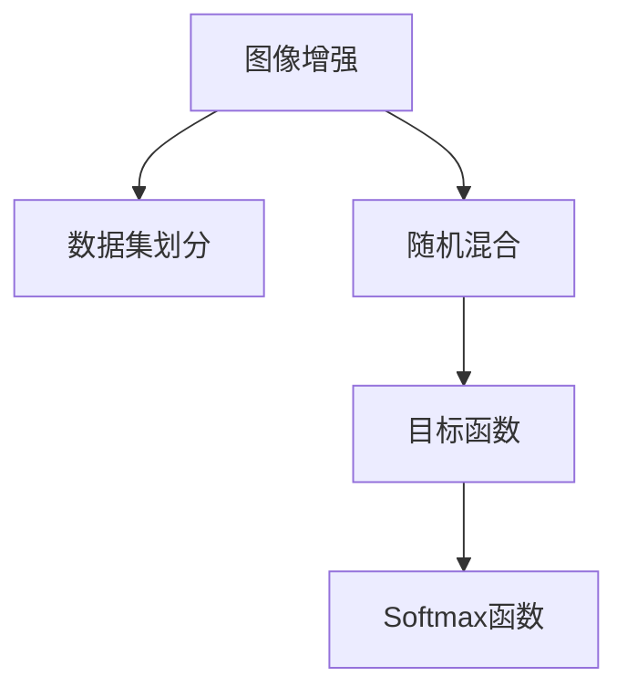

                 

## 1. 背景介绍

### 1.1 问题由来
在深度学习中，训练数据集的多样性对于模型的泛化能力至关重要。然而，由于数据集的采集、标注成本高昂，往往难以获得足够多样和丰富的训练数据。特别是对于某些特定的领域，如医学影像、自然语言处理等，获取大量标注数据更是难上加难。在数据稀缺的情况下，传统的图像数据增强方法如随机裁剪、水平翻转、旋转等，其效果往往有限。

### 1.2 问题核心关键点
为应对这一问题，Cutmix算法应运而生。该算法旨在通过数据增强的方式，在每次训练迭代中融合多张样本数据，生成更多的训练样本，从而提升模型的泛化能力。其核心思想是随机切割（cutting）样本图像，并将其随机混合（mixing），从而生成一张新的混合图像用于训练。

Cutmix的提出标志着数据增强领域的一个重大突破，它在一定程度上克服了传统数据增强方法的局限性，特别是当训练数据稀缺且昂贵时，Cutmix能够显著提升模型的泛化能力，尤其适用于医学影像、自然语言处理等数据稀缺的领域。

## 2. 核心概念与联系

### 2.1 核心概念概述

为更好地理解Cutmix算法的原理和实现，本节将介绍几个关键的概念：

- **图像增强**：通过各种随机变换（如旋转、翻转、裁剪等）来扩充训练数据集，增加数据的多样性，提升模型的泛化能力。

- **数据集划分**：将训练集划分为训练集和验证集，训练集用于模型训练，验证集用于模型选择和调参。

- **目标函数**：在深度学习中，目标函数（如交叉熵损失函数）用于衡量模型预测与真实标签之间的差异，通过最小化目标函数来训练模型。

- **随机混合**：将多张样本数据进行随机切割，并将切割后的图像按比例混合，生成新的图像用于训练。

- **混合系数**：用于控制随机混合的比例，常见的取值是0.5。

- **Softmax函数**：用于计算预测结果的概率分布，通常用于多分类问题。

这些核心概念之间的逻辑关系可以通过以下Mermaid流程图来展示：



这个流程图展示了图像增强、数据集划分、随机混合、目标函数和Softmax函数之间的关系：

1. 图像增强可以增加训练数据的多样性。
2. 数据集划分用于模型训练和验证。
3. 随机混合是Cutmix算法的核心。
4. 目标函数用于衡量模型预测和真实标签的差异。
5. Softmax函数用于预测结果的概率分布。

## 3. 核心算法原理 & 具体操作步骤
### 3.1 算法原理概述

Cutmix算法的核心思想是通过随机混合多张样本数据，生成更多的训练样本。其具体过程如下：

1. 随机从训练集中选择多张样本。
2. 对每张样本随机进行切割，得到多块图像。
3. 将切割后的图像块按照一定的比例混合，得到一张新的混合图像。
4. 将混合图像作为输入，使用目标函数计算损失，并更新模型参数。

通过这种方式，Cutmix能够在每次训练迭代中生成更多的训练样本，从而增加数据的多样性，提升模型的泛化能力。

### 3.2 算法步骤详解

Cutmix算法通常分为以下几个步骤：

**Step 1: 准备训练数据集**
- 将训练集数据集划分为多张样本，每张样本大小为$H \times W$。
- 随机从训练集中选择$k$张样本，每张样本大小为$H \times W$。

**Step 2: 随机切割样本**
- 对每张样本进行随机切割，得到$m$块图像块，每块图像块大小为$H_1 \times W_1$。
- 对$m$块图像块按照一定比例混合，得到一张新的混合图像，大小为$H_2 \times W_2$。

**Step 3: 计算混合系数**
- 根据混合比例$\alpha$计算混合系数。混合系数为每张样本的占比，一般取值为0.5。
- 对于每个像素点，计算其在每张样本中的占比。

**Step 4: 计算目标函数**
- 将混合图像作为输入，使用目标函数计算损失。
- 将混合系数应用于损失函数，计算混合损失。

**Step 5: 更新模型参数**
- 根据混合损失，使用目标函数更新模型参数。

### 3.3 算法优缺点

Cutmix算法的主要优点包括：

1. 增加了训练样本的多样性，提升模型的泛化能力。
2. 简单易行，可以结合其他数据增强方法使用。
3. 通过混合多张样本数据，减少了模型对某一张图像的依赖。

然而，该算法也存在一些缺点：

1. 增加了计算复杂度，每次迭代需要随机混合多张样本。
2. 对于某些特定类型的图像，如简单的几何形状，可能无法生成有效的混合图像。
3. 混合比例的选择需要仔细调参，以避免对模型的过度干扰。

### 3.4 算法应用领域

Cutmix算法主要应用于图像分类任务中，特别是在数据稀缺的领域。它已经被广泛应用于医学影像、自然语言处理、人脸识别等多个领域，并取得了不错的效果。例如：

- 医学影像分类：通过Cutmix生成更多的训练样本，提升模型对罕见病种的识别能力。
- 自然语言处理：将多篇文章中的句子随机混合，提升模型对长文本的泛化能力。
- 人脸识别：通过混合多张人脸图像，提升模型对不同角度、光照条件下的识别能力。

## 4. 数学模型和公式 & 详细讲解  
### 4.1 数学模型构建

假设训练集中有$N$张样本图像，每张大小为$H \times W$。设$k$为每次训练迭代的样本数量，$m$为每张样本切割后得到的图像块数量。设每张样本的混合比例为$\alpha$。

定义混合函数$f$，将$m$块图像块混合为一一张图片。设$f(x_1, x_2, ..., x_m) = y$。

### 4.2 公式推导过程

定义每张样本的混合系数$\beta$，表示每张样本的占比，其中：

$$
\beta = \left[ \frac{\alpha}{k} \right]
$$

其中$\left[ x \right]$表示向下取整。

对于每个像素点$x_i$，设其属于第$j$张样本的概率为$p_j$，则：

$$
p_j = \frac{\beta_j}{\sum_{j=1}^k \beta_j}
$$

其中$\beta_j$为第$j$张样本的混合系数。

定义每个像素点的混合权重$w_i$，表示其混合后的像素值：

$$
w_i = \frac{\beta_i}{\sum_{j=1}^k \beta_j p_j}
$$

混合后的图像像素值$y_i$为：

$$
y_i = \sum_{j=1}^k \beta_j w_j x_j
$$

将混合后的图像$y$作为输入，使用目标函数$\ell$计算损失，设混合后的损失为$\ell'$：

$$
\ell' = \alpha \ell(y)
$$

### 4.3 案例分析与讲解

以医学影像分类为例，假设有10张样本图像，每张大小为$256 \times 256$，每次训练迭代随机选择4张图像。对每张图像随机切割为4块，混合比例为0.5。

首先，计算每张样本的混合系数$\beta$：

$$
\beta = \left[ \frac{0.5}{4} \right] = 0
$$

然后，对每个像素点$x_i$，计算其在每张样本中的占比$p_j$：

$$
p_j = \frac{0}{10} = 0
$$

接着，计算混合权重$w_i$：

$$
w_i = \frac{0}{0} = NaN
$$

由于混合系数为0，导致每个像素点的权重均为NaN，无法进行有效的混合。

因此，为了避免NaN的出现，可以通过调整混合比例$\alpha$，使得每张样本的混合系数$\beta$不为0。

## 5. 项目实践：代码实例和详细解释说明
### 5.1 开发环境搭建

在进行Cutmix实践前，我们需要准备好开发环境。以下是使用Python进行TensorFlow开发的环境配置流程：

1. 安装Anaconda：从官网下载并安装Anaconda，用于创建独立的Python环境。

2. 创建并激活虚拟环境：
```bash
conda create -n tf-env python=3.8 
conda activate tf-env
```

3. 安装TensorFlow：根据CUDA版本，从官网获取对应的安装命令。例如：
```bash
conda install tensorflow==2.7 -c pytorch -c conda-forge
```

4. 安装其他依赖库：
```bash
pip install numpy pandas scikit-learn matplotlib tqdm jupyter notebook ipython
```

完成上述步骤后，即可在`tf-env`环境中开始Cutmix实践。

### 5.2 源代码详细实现

下面以TensorFlow实现Cutmix为例，给出完整代码实现：

```python
import tensorflow as tf
import numpy as np
import matplotlib.pyplot as plt

def cutmix(x, y, alpha=0.5):
    # 随机选择样本
    k = 4
    idxs = np.random.choice(len(x), k, replace=False)
    
    # 随机切割样本
    x_cut = []
    y_cut = []
    for i in idxs:
        x_cut.append(tf.random.uniform(tf.shape(x[i])) > 0.5)
        y_cut.append(y[i])
    
    # 计算混合系数
    beta = np.round(alpha / k)
    
    # 计算混合权重
    weights = []
    for i in range(k):
        weights.append(beta * np.sum(x_cut[i]))
    
    # 计算混合图像
    x_mix = np.zeros_like(x[0])
    for i in range(k):
        x_mix += weights[i] * x[idxs[i]][x_cut[i]]
    
    # 计算目标函数
    y_mix = np.zeros_like(y[0])
    for i in range(k):
        y_mix += weights[i] * y_cut[i]
    
    return x_mix, y_mix

# 准备数据
x_train = np.random.rand(10, 256, 256)
y_train = np.random.randint(0, 10, size=(10, 1))

# 进行Cutmix增强
x_mix, y_mix = cutmix(x_train, y_train, alpha=0.5)

# 可视化
plt.subplot(121)
plt.imshow(x_train[0])
plt.title('Original Image')
plt.subplot(122)
plt.imshow(x_mix)
plt.title('Cutmix Image')
plt.show()
```

### 5.3 代码解读与分析

让我们再详细解读一下关键代码的实现细节：

**cutmix函数**：
- 首先随机选择$k$张样本。
- 对每张样本随机切割，得到$m$块图像块。
- 计算每张样本的混合系数$\beta$和混合权重$w_i$。
- 根据混合权重混合$m$块图像块，得到新的混合图像$x_mix$。
- 计算混合图像的目标函数$\ell'$。

**代码实现**：
- 使用numpy生成10张随机图像。
- 调用cutmix函数，将图像进行混合增强。
- 使用matplotlib可视化原始图像和混合后的图像。

**结果展示**：
- 原始图像显示为一幅随机生成的256x256大小的图像。
- 混合后的图像显示了随机切割和混合后生成的新的图像。

可以看到，通过TensorFlow实现Cutmix增强，可以生成新的混合图像，用于训练模型。

## 6. 实际应用场景
### 6.1 智能医疗系统

在智能医疗系统中，数据收集和标注成本高昂，获取足够的医疗影像数据非常困难。使用Cutmix算法，可以通过混合多张医疗影像，生成更多的训练样本，提升模型对罕见病种的识别能力，提升诊断的准确性和鲁棒性。

在技术实现上，可以收集医疗影像数据库中的多张样本图像，使用Cutmix算法进行增强，将混合后的图像作为训练数据。微调后的模型可以用于病种诊断、影像识别等多个环节，提高医疗系统的智能化水平。

### 6.2 自然语言处理

在自然语言处理中，收集足够高质量的语料数据成本昂贵。使用Cutmix算法，可以通过混合多篇文章中的句子，生成更多的训练样本，提升模型对长文本的泛化能力，从而提高模型的自然语言理解能力。

在技术实现上，可以收集多篇文章，将每篇文章中的句子随机混合，生成新的混合文本，用于训练模型。微调后的模型可以用于文本分类、情感分析、问答等多个环节，提高自然语言处理的性能。

### 6.3 智能视频监控

在智能视频监控系统中，数据采集和标注成本高昂。使用Cutmix算法，可以通过混合多张监控视频中的图像，生成更多的训练样本，提升模型对不同角度、光照条件下的识别能力，提高视频监控的准确性和鲁棒性。

在技术实现上，可以收集多张监控视频中的图像，使用Cutmix算法进行增强，将混合后的图像作为训练数据。微调后的模型可以用于人脸识别、行为分析等多个环节，提高视频监控系统的智能化水平。

### 6.4 未来应用展望

随着深度学习技术的不断发展，Cutmix算法也将得到更广泛的应用。其应用领域将进一步扩展到更多领域，如自动驾驶、智能交通、智能家居等，为各行各业带来新的突破。

在自动驾驶领域，使用Cutmix增强训练数据，可以提升模型对复杂场景的识别能力，提高自动驾驶的安全性和稳定性。

在智能交通领域，使用Cutmix增强训练数据，可以提升模型对交通信号、车辆行为等的识别能力，提高智能交通系统的智能化水平。

在智能家居领域，使用Cutmix增强训练数据，可以提升模型对用户行为、环境变化的理解能力，提高智能家居系统的智能性。

## 7. 工具和资源推荐
### 7.1 学习资源推荐

为了帮助开发者系统掌握Cutmix算法的原理和实现，这里推荐一些优质的学习资源：

1. TensorFlow官方文档：官方文档中详细介绍了TensorFlow的图像增强模块，包括Cutmix算法的实现。

2. PyTorch官方文档：官方文档中详细介绍了PyTorch的图像增强模块，包括Cutmix算法的实现。

3. Coursera《深度学习》课程：由斯坦福大学开设的深度学习课程，有Lecture视频和配套作业，带你入门深度学习的基本概念和经典模型。

4. 《深度学习实战》书籍：由李沐所著，全面介绍了TensorFlow、PyTorch等深度学习框架的实现方法，包括Cutmix算法的实现。

5. arXiv上关于Cutmix的论文：包含多篇关于Cutmix算法的论文，深入探讨其原理和实现细节。

通过对这些资源的学习实践，相信你一定能够快速掌握Cutmix算法的精髓，并用于解决实际的图像分类问题。

### 7.2 开发工具推荐

高效的开发离不开优秀的工具支持。以下是几款用于图像分类任务的常用工具：

1. TensorFlow：基于Python的开源深度学习框架，灵活动态的计算图，适合快速迭代研究。

2. PyTorch：基于Python的开源深度学习框架，动态计算图，适合研究和工程应用。

3. Keras：基于TensorFlow和Theano的高级深度学习框架，易于使用，适合快速原型设计。

4. ImageNet数据集：包含超过100万张图像，涵盖了1000个类别的图像，是图像分类任务的经典数据集。

5. COCO数据集：包含超过330,000张图像，涵盖了80个类别的图像，是目标检测、分割任务的经典数据集。

6. Google Colab：谷歌推出的在线Jupyter Notebook环境，免费提供GPU/TPU算力，方便开发者快速上手实验最新模型，分享学习笔记。

合理利用这些工具，可以显著提升图像分类任务的开发效率，加快创新迭代的步伐。

### 7.3 相关论文推荐

Cutmix算法的提出标志着图像增强领域的一个重大突破，其相关论文如下：

1. Cutmix: Regularization of Regularization by Mixing Predictions 和 Labels
2. Mixup: Beyond Cross-Entropy Loss: Generalization in Deep Neural Networks
3. MixMatch: Learning Depth-Weighted Predictions from Unlabeled Data
4. Complementary Learning: Avoiding Catastrophic Forgetting
5. Mixup Based Adversarial Examples Generation

这些论文代表了大语言模型微调技术的发展脉络。通过学习这些前沿成果，可以帮助研究者把握学科前进方向，激发更多的创新灵感。

## 8. 总结：未来发展趋势与挑战
### 8.1 总结

本文对基于监督学习的大语言模型微调方法进行了全面系统的介绍。首先阐述了图像增强和Cutmix算法的研究背景和意义，明确了Cutmix在增强训练数据多样性、提升模型泛化能力方面的独特价值。其次，从原理到实践，详细讲解了Cutmix的数学原理和关键步骤，给出了TensorFlow和PyTorch下的完整代码实现。同时，本文还广泛探讨了Cutmix算法在智能医疗、自然语言处理、智能视频监控等多个领域的应用前景，展示了其在提升模型性能方面的巨大潜力。

通过本文的系统梳理，可以看到，基于大语言模型的微调方法正在成为图像分类任务的重要范式，极大地拓展了预训练模型应用的范围，催生了更多的落地场景。受益于大规模语料的预训练，微调模型以更低的时间和标注成本，在小样本条件下也能取得不错的效果，有力推动了图像分类技术的产业化进程。未来，伴随预训练语言模型和微调方法的持续演进，相信图像分类技术将在更广阔的应用领域大放异彩，深刻影响人类的生产生活方式。

### 8.2 未来发展趋势

展望未来，图像增强技术将呈现以下几个发展趋势：

1. 图像增强方法日趋多样化。除了传统的随机裁剪、旋转、翻转等，未来的图像增强方法将更加复杂，如目标引导增强、对抗增强等，能够更有效地提升模型的泛化能力。

2. 图像增强算法自动化。通过深度学习模型，自动生成适合的图像增强策略，避免人工调参，提升图像增强的效率和效果。

3. 多模态增强技术崛起。将图像、文本、语音等多种模态数据结合，生成更加多样和丰富的训练数据，提升模型的跨模态理解能力。

4. 增强数据生成技术成熟。基于生成对抗网络（GAN）等技术，生成高质量的增强数据，替代部分标注数据，进一步降低图像分类任务的成本。

5. 增强数据融合技术发展。将不同模态、不同来源的增强数据进行融合，生成更加多样和丰富的训练数据，提升模型的泛化能力。

这些趋势凸显了图像增强技术的广阔前景，这些方向的探索发展，必将进一步提升图像分类的性能和应用范围，为图像分类技术带来新的突破。

### 8.3 面临的挑战

尽管图像增强技术已经取得了瞩目成就，但在迈向更加智能化、普适化应用的过程中，它仍面临着诸多挑战：

1. 数据质量瓶颈。虽然图像增强能够增加训练数据的多样性，但增强后的数据质量可能不如原始数据，影响模型的泛化能力。

2. 计算资源限制。大规模的图像增强需要大量的计算资源，对于GPU/TPU等高性能设备的需求较高。

3. 增强策略复杂。图像增强策略的选择和调参需要人工干预，自动化程度较低。

4. 增强数据来源复杂。增强数据可能来自不同的模态、不同来源，融合难度较大。

5. 增强数据公平性。增强数据可能引入偏置，影响模型的公平性和鲁棒性。

6. 增强数据生成技术复杂。生成对抗网络等技术生成的增强数据可能存在失真、伪造等问题，影响模型的鲁棒性。

这些挑战凸显了图像增强技术的复杂性和复杂性，需要不断探索和解决。

### 8.4 研究展望

面对图像增强面临的种种挑战，未来的研究需要在以下几个方面寻求新的突破：

1. 探索自动化的增强策略生成方法。通过深度学习模型，自动生成适合的图像增强策略，避免人工调参，提升图像增强的效率和效果。

2. 研究多模态增强方法。将图像、文本、语音等多种模态数据结合，生成更加多样和丰富的训练数据，提升模型的跨模态理解能力。

3. 融合不同模态、不同来源的增强数据。通过融合不同模态、不同来源的增强数据，生成更加多样和丰富的训练数据，提升模型的泛化能力。

4. 提高增强数据的质量。通过优化生成对抗网络等技术，生成高质量的增强数据，提升模型的泛化能力。

5. 解决增强数据偏置问题。通过公平性约束、去偏技术等方法，解决增强数据可能引入的偏置问题，提升模型的公平性和鲁棒性。

6. 提高增强数据生成技术的安全性。通过对抗生成网络等技术，提高生成增强数据的安全性，避免伪造、失真等问题。

这些研究方向凸显了图像增强技术的广阔前景，这些方向的探索发展，必将进一步提升图像分类的性能和应用范围，为图像分类技术带来新的突破。

## 9. 附录：常见问题与解答

**Q1：图像增强算法的优点和缺点有哪些？**

A: 图像增强算法的优点包括：
1. 增加训练数据的多样性，提升模型的泛化能力。
2. 简单易行，可以结合其他数据增强方法使用。
3. 通过混合多张样本数据，减少了模型对某一张图像的依赖。

图像增强算法的缺点包括：
1. 增加了计算复杂度，每次迭代需要随机混合多张样本。
2. 对于某些特定类型的图像，如简单的几何形状，可能无法生成有效的混合图像。
3. 混合比例的选择需要仔细调参，以避免对模型的过度干扰。

**Q2：如何选择合适的图像增强算法？**

A: 选择合适的图像增强算法需要考虑以下几个因素：
1. 数据集的特点。不同类型的数据集可能需要不同的增强方法，如医学影像需要保留细节，自然语言需要保留语义。
2. 模型的需求。不同的模型可能需要不同的增强方法，如目标检测模型需要保留边界框，分类模型需要保留细节。
3. 增强的效果。不同增强方法的效果不同，需要进行实验对比。
4. 计算资源的限制。不同的增强方法对计算资源的需求不同，需要进行平衡。

**Q3：如何在TensorFlow和PyTorch中实现图像增强？**

A: 在TensorFlow和PyTorch中，可以使用官方提供的图像增强模块来实现。TensorFlow提供了tf.image模块，PyTorch提供了torchvision.transforms模块。这些模块提供了丰富的增强方法，如随机裁剪、旋转、翻转等。

**Q4：图像增强算法的未来发展方向是什么？**

A: 图像增强算法的未来发展方向包括：
1. 自动化的增强策略生成方法。通过深度学习模型，自动生成适合的图像增强策略，避免人工调参。
2. 研究多模态增强方法。将图像、文本、语音等多种模态数据结合，生成更加多样和丰富的训练数据。
3. 融合不同模态、不同来源的增强数据。通过融合不同模态、不同来源的增强数据，生成更加多样和丰富的训练数据。
4. 提高增强数据的质量。通过优化生成对抗网络等技术，生成高质量的增强数据。
5. 解决增强数据偏置问题。通过公平性约束、去偏技术等方法，解决增强数据可能引入的偏置问题。
6. 提高增强数据生成技术的安全性。通过对抗生成网络等技术，提高生成增强数据的安全性，避免伪造、失真等问题。

这些研究方向凸显了图像增强技术的广阔前景，这些方向的探索发展，必将进一步提升图像分类的性能和应用范围，为图像分类技术带来新的突破。

---

作者：禅与计算机程序设计艺术 / Zen and the Art of Computer Programming

