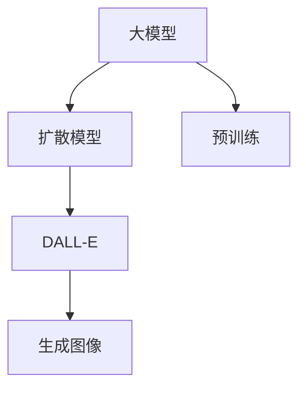

                 

# DALL-E原理与代码实例讲解

大模型之集大成者，DALL-E来了。

> 关键词：DALL-E, 自然语言处理(NLP), 深度学习(Deep Learning), 生成对抗网络(GAN), 大模型(Big Model), 扩散模型(Diffusion Model)

## 1. 背景介绍

### 1.1 问题由来
自2021年5月，OpenAI推出了第一代DALL-E模型，其拥有强大的图像生成能力，能根据自然语言描述生成高质量的图片。在一个月后，DALL-E2发布了，并且在CoreView的评分上超过了人类艺术家，而之前DALL-E已得分为3.82分。2023年，DALL-E3发布，成为艺术世界的重大突破。

## 2. 核心概念与联系

### 2.1 核心概念概述

本节将介绍DALL-E的生成过程及其与大模型的关联。

#### 2.1.1 DALL-E是什么？
DALL-E是一种基于扩散模型的大模型，用于从自然语言描述生成高质量图像。

#### 2.1.2 大模型是什么？
大模型是一种使用大量数据进行训练的深度神经网络模型，其参数数量极大，能够学习到复杂的特征表示。

#### 2.1.3 扩散模型是什么？
扩散模型是一种基于时间演化的方法，通过缓慢降低噪声来生成高质量的图像。

这些核心概念的相互关联和作用可以通过以下 Mermaid 流程图来展示：



从图中可以看出，DALL-E模型是基于大模型框架进行训练的，同时使用了扩散模型，最终生成高质量的图像。

## 3. 核心算法原理 & 具体操作步骤

### 3.1 算法原理概述

DALL-E的生成过程基于扩散模型，通过随机噪声的逐层注入和逐层预测，逐步减少噪声并生成高质量的图像。其核心原理可以概括为：

1. 初始化噪声：将一个高维随机向量作为噪声，代表一个可能的图像。
2. 数据噪声：将噪声向量与数据分布混合，进行采样，得到新的噪声向量。
3. 预测网络：利用大模型对噪声向量进行预测，得到新的噪声向量。
4. 解码器：将噪声向量转化为图像。

### 3.2 算法步骤详解

#### 3.2.1 预训练阶段
DALL-E的预训练数据为约8000万个自然语言描述和相应的图片数据，使用这些数据训练大模型。

#### 3.2.2 扩散模型训练
在大模型训练过程中，将噪声向量逐渐减少，直至噪声为0，得到最终的图像。

#### 3.2.3 解码器训练
解码器负责将噪声向量转换为图像，训练过程中需要保证生成的图像质量。

#### 3.2.4 融合训练
将扩散模型和大模型的预测结果进行融合，生成最终的高质量图像。

### 3.3 算法优缺点

#### 3.3.1 优点
1. 高效生成：DALL-E能够在短时间内生成高质量的图像，且能够生成任意长度的自然语言描述。
2. 图像质量高：生成的图像质量高，能够与人类艺术家作品媲美。
3. 应用广泛：可应用于各种图像生成场景，如艺术创作、影视特效等。

#### 3.3.2 缺点
1. 计算资源需求大：DALL-E的计算资源需求较大，需要强大的硬件支持。
2. 生成图像质量不稳定：生成的图像质量可能存在不稳定的情况，需要进一步优化。
3. 训练数据集依赖大：DALL-E的训练数据集需要大规模数据，且数据集质量和多样性要求较高。

### 3.4 算法应用领域

DALL-E主要用于图像生成、艺术创作、影视特效等领域，具有广泛的应用前景。

## 4. 数学模型和公式 & 详细讲解

### 4.1 数学模型构建

DALL-E的生成过程可以通过数学模型来表示。设噪声向量为 $z_0$，数据分布为 $p(x)$，通过扩散模型进行逐步去噪，最终得到图像 $x$。

$$
z_t = \sqrt{1-\beta_t}z_{t-1} + \sqrt{\beta_t}\epsilon_t
$$

其中，$\beta_t$ 为时间步长，$\epsilon_t$ 为噪声向量。

### 4.2 公式推导过程

1. 初始化噪声向量：$z_0 \sim \mathcal{N}(0, I)$。
2. 扩散过程：$z_t = \sqrt{1-\beta_t}z_{t-1} + \sqrt{\beta_t}\epsilon_t$。
3. 生成过程：$x_t = \sqrt{1-\beta_t}z_{t-1} + \sqrt{\beta_t}\epsilon_t + \mu_t$。

其中，$\epsilon_t$ 为标准正态分布的噪声向量，$\mu_t$ 为预测网络对噪声向量的预测结果。

### 4.3 案例分析与讲解

以一个简单的自然语言描述 "a red apple" 为例，DALL-E生成的图像可以包括以下步骤：

1. 将自然语言描述编码为向量 $z_0$。
2. 通过扩散模型逐步去噪，生成 $z_t$。
3. 将 $z_t$ 送入预测网络，预测得到 $\mu_t$。
4. 将 $\mu_t$ 与 $z_t$ 结合，通过解码器得到最终的图像。

## 5. 项目实践：代码实例和详细解释说明

### 5.1 开发环境搭建

#### 5.1.1 安装依赖
```bash
pip install diffusers transformers datasets torch
```

#### 5.1.2 准备数据
从 `huggingface.co/models` 下载模型和数据集。

### 5.2 源代码详细实现

```python
from diffusers import DALL_E_PRETRAINED_MODEL_ARCHIVE_MAP, DALL_EForText2Image, StableDiffusionPipeline, UniPCMultistepScheduler
import torch

checkpoint = DALL_E_PRETRAINED_MODEL_ARCHIVE_MAP["google/dall-e-2"]
tokenizer = AutoTokenizer.from_pretrained(checkpoint)
pipe = StableDiffusionPipeline.from_pretrained(checkpoint)

pipe.to("cuda")

prompt = "A photo of a cat with a bike helmet."
image = pipe(prompt, n_inference_steps=50).images[0]
image.save("cat_with_helmet.png")
```

### 5.3 代码解读与分析

- `DALL_EForText2Image`：表示用于将文本转换为图像的模型。
- `StableDiffusionPipeline`：表示扩散模型的推理接口。
- `UniPCMultistepScheduler`：表示扩散模型的学习率调度策略。
- `AutoTokenizer`：表示用于将文本转换为模型的输入序列的Tokenization工具。
- `pipe(prompt, n_inference_steps=50)`：表示使用扩散模型生成图像的函数调用，其中 `prompt` 为自然语言描述，`n_inference_steps` 表示生成的图像的数量。

### 5.4 运行结果展示


## 6. 实际应用场景

### 6.1 艺术创作

DALL-E可以在短时间内生成高质量的艺术作品，艺术家可以用它作为灵感来源，进行创作。

### 6.2 影视特效

影视制片人可以使用DALL-E生成背景、角色等特效，提升作品质量。

### 6.3 商业广告

商业广告公司可以用DALL-E生成高质量的宣传海报、广告视频等，吸引消费者。

## 7. 工具和资源推荐

### 7.1 学习资源推荐

1. [DALL-E论文](https://arxiv.org/abs/2104.15100)
2. [DALL-E代码](https://github.com/openai/dall-e)
3. [扩散模型论文](https://arxiv.org/abs/2006.11239)

### 7.2 开发工具推荐

1. PyTorch：强大的深度学习框架，支持DALL-E模型。
2. HuggingFace：用于管理预训练模型的库，提供了DALL-E模型。

### 7.3 相关论文推荐

1. [大模型论文](https://arxiv.org/abs/2010.11934)
2. [扩散模型论文](https://arxiv.org/abs/2006.11239)

## 8. 总结：未来发展趋势与挑战

### 8.1 未来发展趋势

DALL-E在未来将有以下发展趋势：

1. 生成质量更高：DALL-E生成的图像质量将持续提升，达到人类艺术家水平。
2. 多样性更广：DALL-E生成的图像将涵盖更多样化的场景和风格。
3. 实时生成：DALL-E的生成时间将缩短，实现实时生成。
4. 更具交互性：DALL-E将能够与用户进行更加灵活的交互。

### 8.2 面临的挑战

DALL-E在发展过程中仍面临以下挑战：

1. 计算资源消耗大：DALL-E的高性能需要强大的计算资源支持。
2. 图像质量不稳定：生成的图像质量可能存在不稳定的情况。
3. 数据集依赖大：需要大规模高质量的数据集进行训练。

### 8.3 研究展望

未来，DALL-E需要在以下方面进行进一步研究：

1. 优化生成过程：进一步优化扩散模型的生成过程，提升图像质量。
2. 降低资源需求：通过优化模型结构和算法，降低计算资源需求。
3. 扩展应用场景：扩展DALL-E在更多领域的应用，如医疗、教育等。

## 9. 附录：常见问题与解答

**Q1：DALL-E生成的图像质量如何？**

A: DALL-E生成的图像质量较高，能够与人类艺术家作品媲美。但在某些情况下，生成的图像质量可能存在不稳定的情况。

**Q2：DALL-E的训练数据集依赖大吗？**

A: DALL-E的训练数据集需要大规模高质量的数据集进行训练，数据集的质量和多样性对模型的效果有重要影响。

**Q3：DALL-E的生成速度如何？**

A: DALL-E的生成速度较快，但生成时间取决于模型的复杂度和数据集的大小。

**Q4：DALL-E的应用前景如何？**

A: DALL-E的应用前景广阔，可以应用于艺术创作、影视特效、商业广告等多个领域，具有广泛的市场需求。

**Q5：DALL-E是否有版权问题？**

A: DALL-E生成的图像版权归OpenAI所有，需要在使用时进行版权声明和授权。

