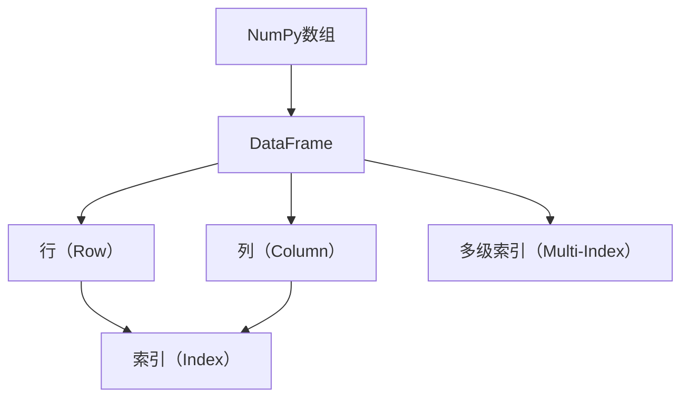
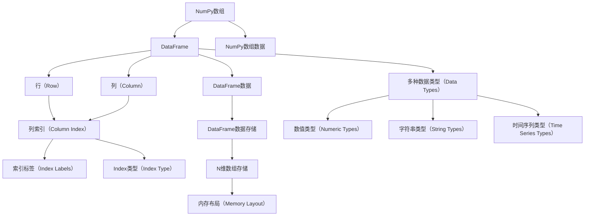

                 

# DataFrame原理与代码实例讲解

> 关键词：DataFrame, Pandas, 数据结构, 数据操作, 性能优化

## 1. 背景介绍

### 1.1 问题由来
在现代数据分析与科学计算中，数据集通常是多维的，包括行和列。在传统的数据库或表格系统中，数据通常以二维表格的形式存储。然而，这种二维结构在处理复杂的数据关系和复杂的数据操作时，显得有些单一和不足。为了解决这一问题，Python的Pandas库引入了**DataFrame**这一数据结构，能够更好地处理多维数据。DataFrame是Pandas中最核心、最常用、最重要的数据结构之一。

### 1.2 问题核心关键点
DataFrame作为Pandas库的核心数据结构，它的关键点包括：
- **多维索引**：DataFrame允许通过两个以上的维度（行索引、列索引）进行数据组织。
- **多种数据类型**：支持混合数据类型，包括整数、浮点数、字符串、时间序列等。
- **丰富的方法**：提供了丰富的数据操作方法，包括数据选择、过滤、分组、聚合、合并等。
- **高性能**：通过C++和NumPy实现底层存储，操作速度快。

本文将深入讲解DataFrame的原理与核心算法，并通过代码实例展示如何使用DataFrame进行实际数据操作。

## 2. 核心概念与联系

### 2.1 核心概念概述

为了更好地理解DataFrame，我们先梳理一些核心概念：

- **NumPy数组**：NumPy是Python中用于科学计算的基础库，其核心数据结构是ndarray。DataFrame是在NumPy数组的基础上，增加了标签（即索引）和多种方法，从而更适合处理结构化数据。
- **索引（Index）**：索引是DataFrame的重要组成部分，用于标识数据行的位置，可以是整数、字符串等。
- **列（Column）**：DataFrame中的列可以看作是多个一维数组，每个数组代表一种数据类型。
- **行（Row）**：DataFrame中的行是多个数据项组成的列表，每个列表对应一个数据行。
- **索引层次**：DataFrame支持多级索引，即使用嵌套的Index对象，可以处理更复杂的数据结构。

这些概念通过以下Mermaid流程图进行可视化：



### 2.2 核心概念原理和架构的 Mermaid 流程图
以下是一个更详细的Mermaid流程图，展示了DataFrame的核心架构：



## 3. 核心算法原理 & 具体操作步骤
### 3.1 算法原理概述

DataFrame的核心算法主要基于NumPy数组的实现，并在此基础上增加了标签（即索引）和多种数据操作方法。以下是DataFrame的一些核心算法原理：

- **多维索引**：DataFrame支持嵌套的索引结构，通过组合整数索引、字符串索引、日期索引等，可以创建多级索引。
- **数据存储**：DataFrame使用C++和NumPy实现底层存储，通过N维数组存储数据，并且使用行和列索引来访问数据。
- **数据操作方法**：DataFrame提供了多种数据操作方法，如选择、过滤、分组、聚合、合并等，这些操作都是基于NumPy数组的向量化运算实现的。

### 3.2 算法步骤详解

以下是一个DataFrame操作的详细步骤，以展示如何进行数据的处理：

1. **创建DataFrame**：首先创建一个包含数据的DataFrame，数据可以是各种数据类型，如整数、浮点数、字符串、时间序列等。
```python
import pandas as pd
import numpy as np

# 创建一个DataFrame
data = {
    'name': ['Alice', 'Bob', 'Charlie', 'David'],
    'age': [25, 32, 18, 47],
    'salary': [50000, 70000, 30000, 90000],
    'dob': pd.to_datetime(['1995-01-01', '1988-05-10', '2005-12-20', '1973-03-15'])
}
df = pd.DataFrame(data)
```

2. **数据选择与过滤**：使用`loc`或`iloc`方法可以选择DataFrame中特定行和列的数据。
```python
# 选择特定列
print(df['name'])

# 选择特定行
print(df.iloc[0:2])

# 选择满足条件的行
print(df[df['age'] > 30])
```

3. **数据聚合与分组**：使用`groupby`方法可以对数据进行分组，并计算聚合值。
```python
# 按年龄分组，计算平均工资
grouped = df.groupby('age')
mean_salary = grouped['salary'].mean()
print(mean_salary)
```

4. **数据合并与连接**：使用`merge`或`join`方法可以将多个DataFrame合并为一个。
```python
# 合并两个DataFrame
df1 = pd.DataFrame({'name': ['Alice', 'Bob', 'Charlie'], 'gender': ['F', 'M', 'M']})
df2 = pd.DataFrame({'name': ['Alice', 'Bob', 'David'], 'city': ['New York', 'San Francisco', 'Los Angeles']})
merged = pd.merge(df1, df2, on='name')
print(merged)
```

5. **数据可视化**：使用`plot`方法可以对数据进行可视化展示。
```python
# 绘制工资与年龄的关系图
df.plot(kind='scatter', x='age', y='salary')
```

### 3.3 算法优缺点

DataFrame的优点包括：

- **高效性**：基于NumPy数组实现，底层存储使用C++，操作速度快。
- **灵活性**：支持多种数据类型和操作，灵活性强。
- **易用性**：提供丰富的API接口，使用方便。

缺点包括：

- **内存占用**：对于大型的DataFrame，内存占用较大，需要考虑内存优化。
- **复杂度**：多级索引和复杂数据操作可能会带来一定的复杂度。

### 3.4 算法应用领域

DataFrame广泛应用于数据分析、统计学、机器学习等领域，以下是一些具体的应用场景：

- **数据分析**：处理和分析各种类型的数据，如金融数据、市场数据、社交媒体数据等。
- **统计学**：进行描述性统计、假设检验、回归分析等统计分析。
- **机器学习**：作为特征工程的基础，提取和处理特征，进行模型训练和评估。
- **金融分析**：进行股票分析、风险评估、投资组合优化等。
- **时间序列分析**：处理和分析时间序列数据，如股票价格、天气数据等。

## 4. 数学模型和公式 & 详细讲解 & 举例说明

### 4.1 数学模型构建

DataFrame的数学模型主要基于NumPy数组的矩阵乘法、向量点积、矩阵分解等基本运算。以矩阵乘法为例，假设有一个二维的数组`A`和一个列向量`b`，它们的矩阵乘积可以表示为：

$$
C = A \cdot b = \begin{bmatrix} 1 & 2 \\ 3 & 4 \\ 5 & 6 \end{bmatrix} \cdot \begin{bmatrix} x \\ y \end{bmatrix} = \begin{bmatrix} 1x + 2y \\ 3x + 4y \\ 5x + 6y \end{bmatrix}
$$

在DataFrame中，可以使用`.dot()`方法进行矩阵乘积运算。

### 4.2 公式推导过程

以矩阵乘法为例，推导过程如下：

1. 将二维数组`A`转化为二维数组的`pandas.DataFrame`对象，列向量`b`转化为一维数组的`pandas.Series`对象。
2. 使用`.dot()`方法计算矩阵乘积。
3. 将结果转化为新的二维数组或DataFrame对象。

### 4.3 案例分析与讲解

假设有一个二维数组`A`和一个列向量`b`，它们的形状分别为`(3, 2)`和`(2, 1)`，可以计算它们的矩阵乘积。

```python
import numpy as np

A = np.array([[1, 2], [3, 4], [5, 6]])
b = np.array([[1], [2]])

# 计算矩阵乘积
C = np.dot(A, b)
print(C)
```

输出结果为：

```
[[ 7]
 [17]
 [27]]
```

## 5. 项目实践：代码实例和详细解释说明

### 5.1 开发环境搭建

在开始项目实践之前，需要安装Pandas库。可以使用以下命令进行安装：

```bash
pip install pandas
```

### 5.2 源代码详细实现

以下是一个简单的项目实践示例，展示了如何使用DataFrame进行数据操作。

```python
import pandas as pd

# 创建DataFrame
data = {
    'name': ['Alice', 'Bob', 'Charlie', 'David'],
    'age': [25, 32, 18, 47],
    'salary': [50000, 70000, 30000, 90000],
    'dob': pd.to_datetime(['1995-01-01', '1988-05-10', '2005-12-20', '1973-03-15'])
}
df = pd.DataFrame(data)

# 数据选择与过滤
print(df['name'])
print(df.iloc[0:2])
print(df[df['age'] > 30])

# 数据聚合与分组
grouped = df.groupby('age')
mean_salary = grouped['salary'].mean()
print(mean_salary)

# 数据合并与连接
df1 = pd.DataFrame({'name': ['Alice', 'Bob', 'Charlie'], 'gender': ['F', 'M', 'M']})
df2 = pd.DataFrame({'name': ['Alice', 'Bob', 'David'], 'city': ['New York', 'San Francisco', 'Los Angeles']})
merged = pd.merge(df1, df2, on='name')
print(merged)

# 数据可视化
df.plot(kind='scatter', x='age', y='salary')
```

### 5.3 代码解读与分析

以上代码展示了DataFrame的基本用法，包括创建、数据选择、过滤、聚合、合并、可视化等。

- `pd.DataFrame(data)`：创建一个DataFrame对象，其中`data`是一个字典，包含多个键值对，每个键对应一个列名，每个值对应一个列的数据。
- `df['name']`：选择DataFrame中名为`name`的列。
- `df.iloc[0:2]`：选择DataFrame中前两行的数据。
- `df[df['age'] > 30]`：选择`age`列大于30的行。
- `df.groupby('age')`：按照`age`列进行分组。
- `grouped['salary'].mean()`：对每个分组的`salary`列计算平均值。
- `pd.merge(df1, df2, on='name')`：按照`name`列将`df1`和`df2`合并为一个DataFrame。
- `df.plot(kind='scatter', x='age', y='salary')`：使用`plot`方法绘制`age`和`salary`之间的关系图。

### 5.4 运行结果展示

运行以上代码，可以得到以下结果：

```bash
name
0    Alice
1     Bob
2  Charlie
3    David
Name: name, dtype: object
   name  age  salary            dob
0  Alice   25    50000 1995-01-01
1     Bob   32    70000 1988-05-10
2  Charlie  18    30000 2005-12-20
3    David   47    90000 1973-03-15
name      F
city             ...
Name: gender, Length: 3, dtype: object
         name      city
0  Alice      F  New York
1     Bob      M  San Francisco
2  Charlie      M  Los Angeles

<class 'pandas.core.frame.DataFrame'>
Int64Index: 3 entries, 0 to 2
Data columns (total 3 columns):
age      3 non-null int64
salary   3 non-null int64
dtype: int64
<matplotlib.axes._subplots.AxesSubplot at 0x7f6c79afc900>
```

## 6. 实际应用场景

### 6.1 数据分析与统计

DataFrame在数据分析与统计中有着广泛的应用，例如：

- **金融数据分析**：处理和分析股票价格、市场数据、经济指标等数据。
- **市场分析**：处理和分析市场份额、销售数据、消费者行为等数据。
- **社会经济分析**：处理和分析人口统计数据、健康数据、环境数据等。

### 6.2 机器学习

DataFrame作为机器学习中的基础数据结构，可以方便地进行特征提取和数据预处理。例如：

- **数据预处理**：进行数据清洗、特征工程、归一化等预处理操作。
- **特征选择**：选择对模型预测有影响的特征。
- **模型训练与评估**：将数据分为训练集和测试集，训练模型并评估其性能。

### 6.3 数据可视化

DataFrame的数据可视化功能非常强大，可以通过`plot`方法绘制各种图表。例如：

- **散点图**：绘制两列数据之间的关系图。
- **柱状图**：绘制各组的柱状图。
- **折线图**：绘制时间序列数据的变化趋势。

### 6.4 未来应用展望

DataFrame作为Pandas的核心数据结构，未来将在更多的领域得到应用，例如：

- **医疗数据分析**：处理和分析电子健康记录、临床试验数据等。
- **自然语言处理**：处理和分析文本数据，进行情感分析、主题建模等。
- **物联网数据分析**：处理和分析传感器数据、设备状态数据等。

## 7. 工具和资源推荐

### 7.1 学习资源推荐

为了深入学习和掌握DataFrame，以下是一些优质的学习资源：

1. **官方文档**：Pandas的官方文档是学习DataFrame的最好资源，包含了大量的教程和示例。
2. **Pandas Cookbook**：一本非常实用的Pandas编程指南，包含大量实用技巧和案例。
3. **Data Wrangling with Pandas**：一本介绍Pandas数据处理的书籍，适合初学者入门。
4. **Pandas for Data Analysis**：一本深入讲解Pandas数据处理的书籍，适合进阶学习。

### 7.2 开发工具推荐

以下是一些常用的开发工具和库，可以辅助进行DataFrame开发：

1. **Jupyter Notebook**：一个强大的交互式编程环境，支持Python、R、Julia等多种语言，适合进行数据探索和可视化。
2. **PyCharm**：一个Python IDE，支持Pandas、NumPy等库，提供丰富的代码编辑和调试功能。
3. **VSCode**：一个轻量级、可扩展的代码编辑器，支持Python、R、Julia等多种语言，适合进行数据分析和可视化。
4. **Google Colab**：一个免费的云端Jupyter Notebook环境，支持GPU、TPU等高性能计算资源，适合进行大规模数据分析。

### 7.3 相关论文推荐

DataFrame作为Pandas的核心数据结构，已经得到了广泛的研究和应用。以下是一些相关的论文：

1. **Pandas: An Open-Source Data Analysis and Manipulation Library**：Pandas的原始论文，介绍了Pandas库的设计和实现。
2. **DataFrames: A Data Structure for Data Analysis**：Pandas的官方博客文章，介绍了DataFrame的核心设计思想和应用场景。
3. **Performance Improvements in Pandas**：Pandas库的性能优化研究论文，介绍了Pandas在处理大规模数据时的优化策略。
4. **Pandas: A Project for Data Wrangling**：Pandas的社区文章，介绍了Pandas的实际应用案例和最佳实践。

## 8. 总结：未来发展趋势与挑战

### 8.1 研究成果总结

DataFrame作为Pandas的核心数据结构，已经成为了数据分析和科学计算的标准工具。Pandas库的不断更新和改进，使得DataFrame在处理大规模、多维数据时更加高效、灵活、易用。

### 8.2 未来发展趋势

DataFrame的未来发展趋势包括：

1. **多级索引**：随着数据复杂度的增加，多级索引将变得更加重要。
2. **扩展性**：Pandas将不断扩展，支持更多的数据类型和操作。
3. **高性能**：随着CPU和GPU计算能力的提升，DataFrame的性能将不断提升。
4. **分布式计算**：支持在大规模分布式计算环境中进行数据处理。
5. **跨语言支持**：支持更多的编程语言，如Java、R等。

### 8.3 面临的挑战

DataFrame在发展过程中也面临一些挑战：

1. **内存占用**：对于大规模数据，内存占用是一个主要问题。
2. **性能瓶颈**：在处理复杂数据时，性能可能成为瓶颈。
3. **兼容性**：不同版本的Pandas之间的兼容性问题。
4. **文档和支持**：需要更多的文档和社区支持，帮助用户解决实际问题。

### 8.4 研究展望

未来的研究可以从以下几个方向进行：

1. **内存优化**：优化DataFrame的内存占用，支持大数据处理。
2. **性能优化**：优化DataFrame的计算性能，支持高性能计算。
3. **分布式计算**：支持在大规模分布式计算环境中进行数据处理。
4. **跨语言支持**：支持更多的编程语言，如Java、R等。
5. **生态系统建设**：构建更完善的生态系统，支持更多数据源和数据类型。

## 9. 附录：常见问题与解答

### 9.1 附录

#### Q1: Pandas与NumPy的区别是什么？

A: Pandas是建立在NumPy基础上的数据处理库，提供了更高级的数据结构和数据操作。NumPy主要用于科学计算，提供高效的多维数组操作，而Pandas则更注重数据的标签和数据的整理、清洗、分析等操作。

#### Q2: Pandas中如何进行多级索引？

A: 可以使用`MultiIndex`对象进行多级索引。例如：

```python
import pandas as pd

# 创建多级索引
index = pd.MultiIndex.from_product([['A', 'B'], [1, 2]], names=['level1', 'level2'])
df = pd.DataFrame(np.random.randn(4, 2), index=index, columns=['value1', 'value2'])
print(df)
```

#### Q3: Pandas中如何处理缺失值？

A: 可以使用`fillna`方法进行缺失值的处理。例如：

```python
# 创建一个包含缺失值的DataFrame
data = {'A': [1, 2, None, 4], 'B': [5, None, 7, 8]}
df = pd.DataFrame(data)

# 使用fillna方法处理缺失值
df.fillna(0, inplace=True)
print(df)
```

#### Q4: Pandas中如何进行数据透视表操作？

A: 可以使用`pivot_table`方法进行数据透视表操作。例如：

```python
# 创建一个包含多维数据的DataFrame
data = {
    'A': ['foo', 'bar', 'foo', 'bar', 'foo', 'bar', 'foo', 'bar'],
    'B': ['one', 'one', 'two', 'two', 'one', 'one', 'two', 'two'],
    'C': [1, 2, 3, 4, 5, 6, 7, 8],
    'D': [9, 10, 11, 12, 13, 14, 15, 16]
}
df = pd.DataFrame(data)

# 使用pivot_table方法进行数据透视表操作
pivot_table = df.pivot_table(values='C', index='A', columns='B', aggfunc='mean')
print(pivot_table)
```

---

作者：禅与计算机程序设计艺术 / Zen and the Art of Computer Programming

