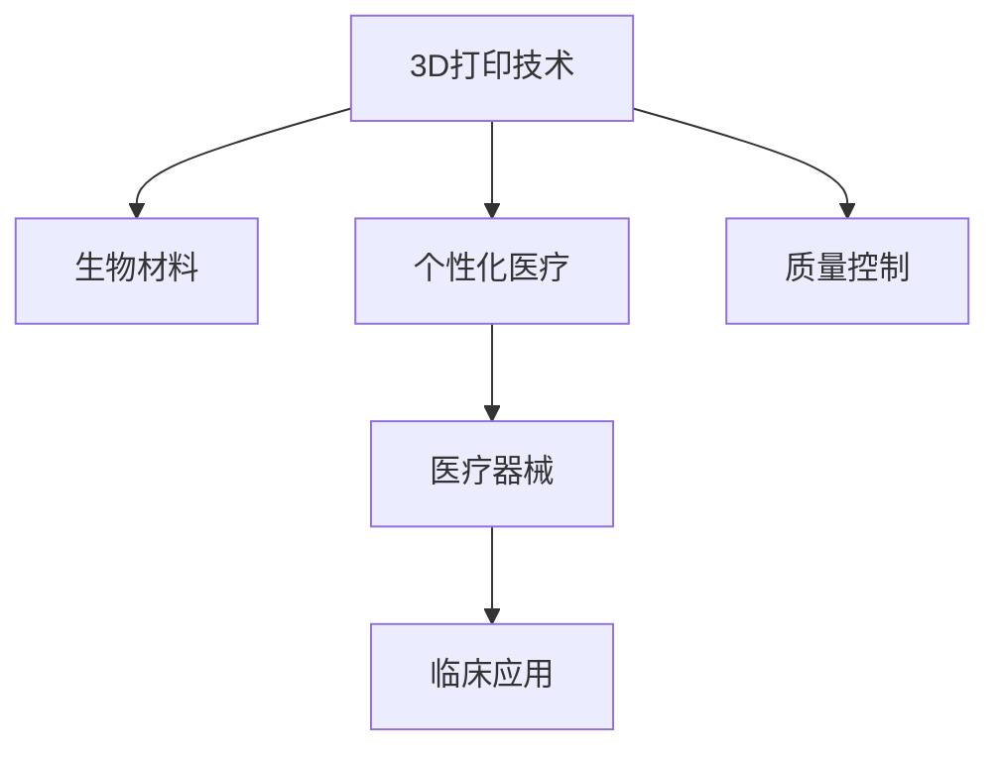

                 

## 1. 背景介绍

### 1.1 问题由来

3D打印技术（Additive Manufacturing），又称为增材制造，是一种逐层堆积材料以形成三维实体的方法。这项技术自20世纪80年代末发展至今，已经从原型制造走向了工业生产，广泛应用于多个行业领域。在医疗器械制造中，3D打印技术以其个性化、定制化、低成本、快速制造等优势，展现了巨大的应用潜力。

近年来，随着生物材料和打印技术的不断进步，3D打印在医疗器械制造中的应用范围不断扩大，涵盖从人工骨骼、牙齿、心脏支架等生物植入物，到手术导板、个性化矫形器、助听器等医疗器械。这不仅大大提升了医疗服务的精准性和个性化水平，也为个性化医疗的发展提供了新的方向。

### 1.2 问题核心关键点

基于3D打印技术在医疗器械制造中的应用，本文将详细探讨以下几个核心问题：

1. 3D打印技术的原理及其在医疗器械制造中的应用。
2. 生物材料在3D打印中的重要性及其选择。
3. 3D打印医疗器械的个性化设计及其实现流程。
4. 3D打印医疗器械的制造工艺和质量控制。
5. 3D打印医疗器械在临床应用中的效果与挑战。
6. 未来3D打印医疗器械的发展趋势和应用前景。

## 2. 核心概念与联系

### 2.1 核心概念概述

为更好地理解3D打印技术在医疗器械制造中的应用，本节将介绍几个密切相关的核心概念：

- **3D打印技术**：一种逐层堆积材料形成三维实体的制造技术，包括光固化、熔融沉积、粉末烧结等多种打印方法。
- **生物材料**：用于3D打印医疗器械的材料，必须具有良好的生物相容性、可降解性和生物力学性能。
- **个性化医疗**：根据患者个体差异，量身定制医疗产品和服务，以实现最佳治疗效果。
- **医疗器械**：用于诊断、预防、治疗、监护和缓解疾病的设备、仪器、器具、材料及其他物品的总称。
- **临床应用**：指医疗器械在实际医疗环境中的应用，包括诊断、治疗、监护等具体场景。
- **质量控制**：在医疗器械生产过程中，对材料、设备、工艺、环境等进行全面控制，确保产品的质量和安全性。

这些核心概念之间的逻辑关系可以通过以下Mermaid流程图来展示：



这个流程图展示了几组概念之间的联系：

1. 3D打印技术利用生物材料，为个性化医疗提供解决方案。
2. 个性化医疗驱动医疗器械的个性化设计和制造。
3. 临床应用验证医疗器械的实际效果和安全性。
4. 质量控制在整个制造过程中至关重要，保证最终产品的可靠性和合规性。

## 3. 核心算法原理 & 具体操作步骤
### 3.1 算法原理概述

3D打印技术在医疗器械制造中的应用，本质上是通过计算机辅助设计（CAD）软件，将患者的生理数据转化为3D打印文件，进而生成个性化医疗器械的过程。其核心算法原理包括：

1. **数据采集与处理**：通过CT、MRI、X射线等影像设备，采集患者的具体生理数据，并进行预处理和切片。
2. **几何建模**：使用CAD软件将采集的数据转化为数字模型，包括设计、修改和优化。
3. **切片生成**：将数字模型进行切片，生成打印路径和材料参数。
4. **材料选择**：根据医疗器械的功能需求，选择合适的生物材料。
5. **打印制造**：利用3D打印机，根据切片数据逐层堆积材料，最终生成医疗器械。
6. **后处理与质量控制**：对打印后的医疗器械进行后期处理，如打磨、抛光、消毒等，并进行全面的质量控制。

### 3.2 算法步骤详解

以下将详细介绍3D打印技术在医疗器械制造中的具体步骤：

1. **数据采集与处理**：
   - 使用CT、MRI、X射线等影像设备采集患者的具体生理数据。
   - 数据导入到3D建模软件，如Mimics、3D Slicer等，进行预处理和切片。

2. **几何建模**：
   - 在CAD软件中，将处理后的切片数据转化为数字模型，进行初步设计、修改和优化。
   - 设计医疗器械的几何结构，如牙齿、骨骼、心脏支架等，确保其符合生理和功能需求。

3. **切片生成**：
   - 根据数字模型，生成3D打印所需的切片文件，包括打印路径和材料参数。
   - 切片文件由3D打印机识别并执行打印。

4. **材料选择**：
   - 根据医疗器械的功能需求，选择合适的生物材料，如生物陶瓷、高分子材料、金属材料等。
   - 材料的选择需考虑其生物相容性、机械性能、打印适应性等因素。

5. **打印制造**：
   - 将材料装入3D打印机，启动打印程序，逐层堆积材料，最终生成医疗器械。
   - 不同类型的3D打印机具有不同的打印方法和工艺，需根据具体需求选择。

6. **后处理与质量控制**：
   - 打印后的医疗器械进行后期处理，如打磨、抛光、消毒等，确保其表面光滑、无缺陷。
   - 进行全面的质量控制，包括尺寸、精度、生物相容性、机械性能等指标的检测。

### 3.3 算法优缺点

3D打印技术在医疗器械制造中的应用具有以下优点：

1. **个性化设计**：能够根据患者的具体生理数据，定制个性化的医疗器械，提高治疗效果和患者满意度。
2. **快速制造**：相比于传统制造方法，3D打印可以快速生成医疗器械，缩短从设计到生产的时间。
3. **材料选择多样**：可以选择多种生物材料，满足不同医疗器械的功能需求。
4. **低成本**：批量生产时，3D打印的成本相对较低，尤其适合个性化和小批量生产。

同时，3D打印技术也存在以下局限性：

1. **材料限制**：部分生物材料在打印过程中可能存在流动性问题，影响打印质量。
2. **设备复杂**：高精度的3D打印机价格较高，维护成本也相对较高。
3. **质量控制**：打印过程中的材料堆积可能导致医疗器械的精度和表面光滑度不足，需要进行后期处理。
4. **临床验证**：打印后的医疗器械需要经过严格的临床验证，确保其安全性和有效性。

### 3.4 算法应用领域

3D打印技术在医疗器械制造中的应用范围非常广泛，涵盖以下几个领域：

1. **人工植入物**：如人工骨骼、牙齿、心脏支架等，用于替代或修复受损组织。
2. **矫形器与助听器**：根据患者的具体需求，定制个性化的矫形器、助听器等辅助设备。
3. **手术导板与模板**：用于外科手术中的辅助定位和引导，提高手术的精确性和安全性。
4. **牙科器械**：如牙冠、牙桥、牙套等，满足不同患者的口腔需求。
5. **耳鼻喉科器械**：如人工耳蜗、喉罩等，改善耳鼻喉功能。
6. **生物打印**：通过3D打印技术，打印细胞和组织，用于再生医学和组织工程。

这些领域的应用不仅展示了3D打印技术的强大潜力，也体现了其对医疗服务的深远影响。

## 4. 数学模型和公式 & 详细讲解 & 举例说明

### 4.1 数学模型构建

在3D打印医疗器械的制造过程中，主要涉及几何建模和切片生成。以牙齿修复为例，其数学模型可以描述为：

- 牙齿形状由一系列离散点构成，通过多项式拟合或曲面拟合，得到牙齿的几何模型。
- 使用三角剖分技术，将几何模型转化为三角形网格。
- 将三角形网格进行切片，生成3D打印所需的切片文件。

### 4.2 公式推导过程

以下以三角形网格的生成为例，推导其数学公式：

- 设三角形网格的节点数为 $N$，节点的坐标为 $\mathbf{x}_i=(x_i, y_i, z_i)$。
- 三角形的边长为 $L$，网格的分辨率为 $\Delta$。
- 网格的生成公式为：

$$
\begin{aligned}
x &= x_i + (j \Delta - \frac{1}{2}) \Delta \\
y &= y_i + (k \Delta - \frac{1}{2}) \Delta \\
z &= z_i + (l \Delta - \frac{1}{2}) \Delta
\end{aligned}
$$

其中，$j, k, l$ 分别为 $x, y, z$ 方向上的网格编号。

### 4.3 案例分析与讲解

以牙冠的3D打印为例，分析其具体实现流程：

1. **数据采集与处理**：
   - 使用CT或MRI扫描患者的牙齿，获取牙冠的数字模型。
   - 对扫描数据进行预处理，去除噪声和边缘。

2. **几何建模**：
   - 在CAD软件中，对预处理后的数据进行建模，设计出牙冠的几何结构。
   - 调整牙冠的形状、厚度、颜色等参数，确保其符合生理和功能需求。

3. **切片生成**：
   - 使用三角剖分技术，将几何模型转化为三角形网格。
   - 将三角形网格进行切片，生成3D打印所需的切片文件。

4. **材料选择**：
   - 选择合适的生物材料，如高分子材料或生物陶瓷，满足牙冠的机械性能和生物相容性需求。
   - 根据材料特性，调整打印参数，如打印速度、温度等。

5. **打印制造**：
   - 将材料装入3D打印机，启动打印程序，逐层堆积材料。
   - 打印过程中，需不断监控打印状态，防止材料流动性不足或打印失败。

6. **后处理与质量控制**：
   - 打印后的牙冠进行后期处理，如打磨、抛光、消毒等，确保其表面光滑、无缺陷。
   - 进行全面的质量控制，包括尺寸、精度、生物相容性、机械性能等指标的检测。

## 5. 项目实践：代码实例和详细解释说明

### 5.1 开发环境搭建

在进行3D打印医疗器械的开发前，需要准备好开发环境。以下是使用Python进行开发的流程：

1. 安装Python：从官网下载并安装Python，确保版本稳定。
2. 安装必要的库：安装Pillow、numpy、scipy等库，用于图像处理和数学计算。
3. 安装3D打印软件：如3D Slicer、MeshLab等，用于几何建模和切片生成。
4. 准备3D打印机：选择合适的3D打印机，确保其兼容性好、打印精度高。
5. 准备生物材料：选择合适的生物材料，进行预处理和切片。

完成上述步骤后，即可在开发环境中进行3D打印医疗器械的开发。

### 5.2 源代码详细实现

以下是一个简单的3D打印牙冠的代码实现，使用Python和Pillow库：

```python
from PIL import Image
import numpy as np

# 读取原始扫描图像
img = Image.open('original_scan.png')

# 转换为灰度图像
img_gray = img.convert('L')

# 图像处理，去除噪声和边缘
img_gray = img_gray.filter(ImageFilter.BLUR)

# 将图像转换为数组
img_array = np.array(img_gray)

# 生成3D打印切片文件
slicing_point = (img_array.shape[0] // 2, img_array.shape[1] // 2)
slice_depth = 1
for i in range(img_array.shape[0] // slice_depth):
    for j in range(img_array.shape[1] // slice_depth):
        slice_data = img_array[slicing_point[0] + i * slice_depth: slicing_point[0] + (i + 1) * slice_depth,
                              slicing_point[1] + j * slice_depth: slicing_point[1] + (j + 1) * slice_depth]
        slice_data = (slice_data - img_array.min()) / (img_array.max() - img_array.min())  # 归一化处理
        slice_data = slice_data * 255  # 转换为灰度值
        slice_data = slice_data.astype(np.uint8)  # 转换为整数类型
        slice_data = slice_data.reshape((slice_depth, img_array.shape[1], img_array.shape[0]))
        slice_data = slice_data.transpose((1, 2, 0))  # 调整维度顺序
        slice_data = slice_data.tobytes()  # 转换为字节流
        # 将切片文件保存到磁盘
        with open(f'slice_{i}x{j}.png', 'wb') as f:
            f.write(slice_data)

print('切片文件生成完成！')
```

### 5.3 代码解读与分析

让我们再详细解读一下关键代码的实现细节：

**代码实现**：
1. 读取原始扫描图像，并进行灰度化处理。
2. 进行图像处理，去除噪声和边缘，确保打印质量。
3. 将图像转换为数组，并生成切片文件。
4. 将切片文件保存到磁盘，供3D打印机使用。

**实现思路**：
- 使用Pillow库读取原始扫描图像，并进行预处理。
- 将图像转换为数组，并进行归一化和转换为整数类型处理。
- 生成切片文件，并保存到磁盘。
- 使用3D打印机进行打印。

**性能优化**：
- 使用numpy库进行数组运算，提高处理效率。
- 使用ImageFilter进行图像处理，减少计算复杂度。
- 使用字节流存储切片文件，节省磁盘空间。

**打印注意事项**：
- 选择合适的3D打印机，确保其打印精度和兼容性。
- 根据材料特性调整打印参数，如打印速度、温度等。
- 在打印过程中，不断监控打印状态，防止失败。

## 6. 实际应用场景

### 6.1 智能医疗系统

3D打印技术在智能医疗系统中具有广泛的应用场景，主要体现在以下几个方面：

1. **个性化手术导板**：用于外科手术中的辅助定位和引导，提高手术的精确性和安全性。
2. **人工植入物**：如人工骨骼、牙齿、心脏支架等，用于替代或修复受损组织。
3. **矫形器和助听器**：根据患者的具体需求，定制个性化的矫形器和助听器等辅助设备。
4. **牙科器械**：如牙冠、牙桥、牙套等，满足不同患者的口腔需求。
5. **耳鼻喉科器械**：如人工耳蜗、喉罩等，改善耳鼻喉功能。

### 6.2 生物打印

3D打印技术在生物打印中的应用，是将细胞和组织材料打印成生物结构的复杂过程，具有重要医学意义。生物打印技术不仅能够打印出具有生物学活性的组织，还能实现复杂器官的打印，为再生医学和组织工程提供新的解决方案。

1. **人工骨骼**：通过3D打印技术，打印出具有生物活性的骨骼结构，用于修复受损骨骼。
2. **人工心脏**：打印出具有泵血功能的人工心脏，用于治疗心脏疾病。
3. **人工肝脏**：打印出具有肝功能的3D打印肝脏，用于治疗肝病。

### 6.3 未来应用展望

随着3D打印技术的不断进步，其在医疗器械制造中的应用将更加广泛和深入。未来，3D打印医疗器械的发展趋势和应用前景如下：

1. **高精度打印**：通过使用高精度3D打印机，打印出更精细的医疗器械，满足更高的医疗需求。
2. **生物相容性**：开发更多生物相容性高的材料，确保打印医疗器械的安全性和可靠性。
3. **个性化设计**：根据患者的具体需求，实现更精确、个性化的医疗器械设计，提高治疗效果和患者满意度。
4. **多模态打印**：实现多种打印材料和工艺的结合，满足不同医疗器械的功能需求。
5. **远程打印**：利用3D打印技术，实现医疗器械的远程制造和定制，提高医疗服务的覆盖面。

## 7. 工具和资源推荐

### 7.1 学习资源推荐

为了帮助开发者系统掌握3D打印技术在医疗器械制造中的应用，这里推荐一些优质的学习资源：

1. **《3D打印技术入门》**：一本系统介绍3D打印技术的书籍，涵盖3D打印的原理、材料、设备、应用等方面。
2. **Coursera《3D打印技术》课程**：由斯坦福大学开设的3D打印技术课程，包括理论基础和实践技巧。
3. **Udacity《3D打印技术》纳米学位**：提供3D打印技术的深入学习，涵盖CAD软件、切片生成、材料选择等内容。
4. **3D Slicer官方文档**：3D打印软件的官方文档，提供全面的使用指南和案例分享。
5. **生物打印技术专题讲座**：邀请行业专家讲解生物打印技术的发展现状和未来方向。

通过对这些资源的学习实践，相信你一定能够快速掌握3D打印技术在医疗器械制造中的应用，并用于解决实际的医疗问题。

### 7.2 开发工具推荐

高效的开发离不开优秀的工具支持。以下是几款用于3D打印医疗器械开发的常用工具：

1. **Pillow库**：用于图像处理，支持多种图像格式和操作。
2. **numpy库**：用于数学计算和数组处理，提高处理效率。
3. **scipy库**：用于科学计算和数据处理，提供丰富的数学函数和工具。
4. **MeshLab**：用于几何建模和切片生成，支持多种3D文件格式。
5. **PrusaSlicer**：一款开源的切片生成软件，支持多种3D打印机和材料。

合理利用这些工具，可以显著提升3D打印医疗器械的开发效率，加快创新迭代的步伐。

### 7.3 相关论文推荐

3D打印技术在医疗器械制造中的应用，源于学界的持续研究。以下是几篇奠基性的相关论文，推荐阅读：

1. **《3D打印技术在医疗领域的应用》**：探讨了3D打印技术在医疗领域的具体应用，包括个性化手术导板、人工植入物等。
2. **《生物打印技术的发展现状与未来》**：综述了生物打印技术的发展历程和未来方向，涉及人工骨骼、人工心脏、人工肝脏等方面。
3. **《3D打印医疗器械的制造工艺和质量控制》**：详细介绍了3D打印医疗器械的制造工艺和质量控制方法，确保打印产品的可靠性和安全性。
4. **《3D打印在医疗设备制造中的应用研究》**：研究了3D打印技术在医疗设备制造中的具体应用，包括个性化矫形器、助听器等。

这些论文代表了大语言模型微调技术的发展脉络。通过学习这些前沿成果，可以帮助研究者把握学科前进方向，激发更多的创新灵感。

## 8. 总结：未来发展趋势与挑战

### 8.1 总结

本文对3D打印技术在医疗器械制造中的应用进行了全面系统的介绍。首先阐述了3D打印技术的原理及其在医疗器械制造中的应用。其次，从生物材料的选择到个性化设计的实现流程，详细讲解了3D打印医疗器械的具体实现步骤。同时，本文还广泛探讨了3D打印技术在智能医疗系统、生物打印等领域的广泛应用，展示了其强大的应用潜力。

通过本文的系统梳理，可以看到，3D打印技术在医疗器械制造中的应用，不仅提高了医疗服务的精准性和个性化水平，也为个性化医疗的发展提供了新的方向。未来，伴随3D打印技术的不断进步，其在医疗器械制造中的应用将更加广泛和深入，为医疗服务的智能化、定制化、低成本化提供新的解决方案。

### 8.2 未来发展趋势

展望未来，3D打印技术在医疗器械制造中的应用将呈现以下几个发展趋势：

1. **高精度打印**：通过使用高精度3D打印机，打印出更精细的医疗器械，满足更高的医疗需求。
2. **生物相容性**：开发更多生物相容性高的材料，确保打印医疗器械的安全性和可靠性。
3. **个性化设计**：根据患者的具体需求，实现更精确、个性化的医疗器械设计，提高治疗效果和患者满意度。
4. **多模态打印**：实现多种打印材料和工艺的结合，满足不同医疗器械的功能需求。
5. **远程打印**：利用3D打印技术，实现医疗器械的远程制造和定制，提高医疗服务的覆盖面。

### 8.3 面临的挑战

尽管3D打印技术在医疗器械制造中的应用已经取得了显著进展，但在迈向更加智能化、普适化应用的过程中，仍面临诸多挑战：

1. **材料限制**：部分生物材料在打印过程中可能存在流动性问题，影响打印质量。
2. **设备复杂**：高精度的3D打印机价格较高，维护成本也相对较高。
3. **质量控制**：打印过程中的材料堆积可能导致医疗器械的精度和表面光滑度不足，需要进行后期处理。
4. **临床验证**：打印后的医疗器械需要经过严格的临床验证，确保其安全性和有效性。
5. **伦理问题**：3D打印技术涉及伦理道德问题，如隐私保护、知识产权等，需要建立相应的规范和机制。

### 8.4 研究展望

面对3D打印技术在医疗器械制造中面临的挑战，未来的研究需要在以下几个方面寻求新的突破：

1. **新材料开发**：开发更多生物相容性高、打印性能好的材料，提升打印质量。
2. **高精度打印技术**：提升3D打印机的打印精度和稳定性，满足更高要求的医疗器械制造。
3. **质量控制**：研发更加精准的质量控制方法，确保打印产品的可靠性和安全性。
4. **临床验证**：建立完善的临床验证体系，确保打印医疗器械的实际效果和安全性。
5. **伦理道德**：制定3D打印技术的伦理道德规范，保护患者隐私和知识产权。

这些研究方向的探索，必将引领3D打印技术在医疗器械制造中迈向更高的台阶，为医疗服务的智能化、定制化、低成本化提供新的解决方案。面向未来，3D打印技术在医疗器械制造中的应用，将更加广泛和深入，为人类健康事业带来新的突破。

## 9. 附录：常见问题与解答

**Q1：3D打印技术在医疗器械制造中的具体应用有哪些？**

A: 3D打印技术在医疗器械制造中的应用非常广泛，涵盖人工植入物、矫形器、助听器、牙科器械、耳鼻喉科器械等多个领域。具体应用包括：

1. **人工植入物**：如人工骨骼、牙齿、心脏支架等，用于替代或修复受损组织。
2. **矫形器与助听器**：根据患者的具体需求，定制个性化的矫形器和助听器等辅助设备。
3. **牙科器械**：如牙冠、牙桥、牙套等，满足不同患者的口腔需求。
4. **耳鼻喉科器械**：如人工耳蜗、喉罩等，改善耳鼻喉功能。

**Q2：3D打印医疗器械在临床应用中需要注意哪些问题？**

A: 3D打印医疗器械在临床应用中需要注意以下几个问题：

1. **生物相容性**：确保打印材料具有优良的生物相容性，避免对患者造成不良影响。
2. **安全性**：打印医疗器械需要经过严格的临床验证，确保其安全性和有效性。
3. **精度和光滑度**：打印过程中需要控制材料堆积，确保医疗器械的精度和表面光滑度。
4. **伦理问题**：涉及伦理道德问题，如隐私保护、知识产权等，需要建立相应的规范和机制。

**Q3：如何选择适合的生物材料进行3D打印？**

A: 选择适合的生物材料进行3D打印，需要考虑以下几个方面：

1. **生物相容性**：确保材料具有优良的生物相容性，避免对患者造成不良影响。
2. **机械性能**：根据医疗器械的功能需求，选择具有合适机械性能的材料。
3. **打印适应性**：选择打印性能良好的材料，确保打印质量。
4. **成本和可获得性**：考虑材料的成本和可获得性，确保材料供应充足。

**Q4：3D打印技术在医疗器械制造中面临哪些挑战？**

A: 3D打印技术在医疗器械制造中面临以下几个挑战：

1. **材料限制**：部分生物材料在打印过程中可能存在流动性问题，影响打印质量。
2. **设备复杂**：高精度的3D打印机价格较高，维护成本也相对较高。
3. **质量控制**：打印过程中的材料堆积可能导致医疗器械的精度和表面光滑度不足，需要进行后期处理。
4. **临床验证**：打印后的医疗器械需要经过严格的临床验证，确保其安全性和有效性。
5. **伦理问题**：涉及伦理道德问题，如隐私保护、知识产权等，需要建立相应的规范和机制。

这些挑战需要通过技术进步和政策完善，逐步克服，以实现3D打印技术在医疗器械制造中的大规模应用。

**Q5：3D打印技术在未来有哪些发展趋势？**

A: 3D打印技术在未来将呈现以下几个发展趋势：

1. **高精度打印**：通过使用高精度3D打印机，打印出更精细的医疗器械，满足更高的医疗需求。
2. **生物相容性**：开发更多生物相容性高的材料，确保打印医疗器械的安全性和可靠性。
3. **个性化设计**：根据患者的具体需求，实现更精确、个性化的医疗器械设计，提高治疗效果和患者满意度。
4. **多模态打印**：实现多种打印材料和工艺的结合，满足不同医疗器械的功能需求。
5. **远程打印**：利用3D打印技术，实现医疗器械的远程制造和定制，提高医疗服务的覆盖面。

通过这些趋势的发展，3D打印技术在医疗器械制造中的应用将更加广泛和深入，为医疗服务的智能化、定制化、低成本化提供新的解决方案。

---

作者：禅与计算机程序设计艺术 / Zen and the Art of Computer Programming

