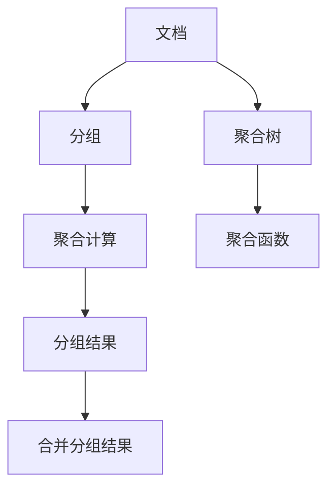

                 

# ES聚合分析原理与代码实例讲解

> 关键词：
- 聚合分析
- 弹性分布式文档数据库(Elasticsearch)
- 聚合
- 聚合树
- 代码实例

## 1. 背景介绍

### 1.1 问题由来
Elasticsearch（简称ES）是一个流行的开源分布式搜索和分析引擎，广泛用于大数据分析和实时搜索。聚合分析是ES中非常重要的功能之一，它能够帮助用户通过将多个字段组合在一起来对数据进行高级分析。在电商平台、社交媒体、内容管理系统等场景中，聚合分析可以用于用户行为分析、内容推荐、市场分析等多个领域，显著提升数据分析效率和质量。

然而，聚合分析的具体实现原理和代码操作对于许多开发者而言并不直观。本博文将深入探讨ES聚合分析的原理，通过详细的代码实例讲解，帮助读者理解和应用ES的聚合分析功能。

### 1.2 问题核心关键点
聚合分析的核心在于利用统计方法和索引计算对数据进行分组、汇总和计算。通过聚合分析，用户能够从多个字段中提取出有用的统计信息，并对数据进行更深层次的分析和理解。

聚合分析的主要作用包括：

1. 数据汇总：将多个字段合并成一个单一字段，以便进行分组统计。
2. 数据分组：将数据按照某个字段进行分组，方便对不同组的数据进行比较。
3. 聚合计算：对分组后的数据进行聚合计算，如求和、平均值、最大值、最小值等。

这些功能在实际应用中，可以帮助用户发现数据的规律和趋势，辅助决策和优化运营。

## 2. 核心概念与联系

### 2.1 核心概念概述

为了更好地理解ES聚合分析的原理和代码实现，本节将介绍几个密切相关的核心概念：

- **Elasticsearch**：开源分布式搜索和分析引擎，支持大规模数据存储和实时搜索。
- **聚合(Aggregation)**：将多个字段合并为一个单一字段，对数据进行分组和统计计算的过程。
- **聚合树(Aggregation Tree)**：表示聚合过程的树形结构，每个节点代表一个聚合操作。
- **聚合函数(Aggregation Functions)**：如求和(Sum)、平均值(Average)、最大值(Max)、最小值(Min)、卡方分布统计(Chi-Square Statistic)、卡方分布检验(Chi-Square Test)等。
- **聚合过程**：包括将文档映射到分组、执行聚合计算和合并分组结果等步骤。

这些核心概念之间的逻辑关系可以通过以下Mermaid流程图来展示：



这个流程图展示了大数据聚合分析的主要流程：

1. 将文档映射到分组。
2. 对分组进行聚合计算。
3. 合并分组结果。

## 3. 核心算法原理 & 具体操作步骤
### 3.1 算法原理概述

ES的聚合分析过程可以概括为以下步骤：

1. 将文档按照某个字段进行分组，生成分组后的文档集合。
2. 对每个分组执行聚合计算，计算出某个聚合函数的值。
3. 合并所有分组的聚合结果，生成最终的聚合分析结果。

具体来说，ES的聚合分析过程可以分为两个主要阶段：分组聚合和最终聚合。分组聚合阶段将文档按照某个字段进行分组，然后对每个分组执行聚合计算；最终聚合阶段将各个分组的聚合结果合并，生成最终的聚合分析结果。

### 3.2 算法步骤详解

以下是ES聚合分析的具体步骤：

**Step 1: 准备数据和索引**
- 首先需要确保索引中包含了需要聚合分析的字段。
- 可以使用`PUT INDEX`命令创建新的索引，或者通过`UPDATE INDEX`命令更新已有索引的字段。

**Step 2: 定义聚合树**
- 使用`GET MAPPING`命令查看索引的字段映射。
- 定义聚合树的节点，包括分组字段和聚合计算方式。
- 使用`PUT INDEX`命令更新索引的映射，将聚合树定义添加到索引中。

**Step 3: 执行聚合分析**
- 使用`GET`命令查询聚合分析结果。
- 查询中需要指定需要聚合分析的字段和聚合树节点。
- 执行聚合分析后，返回分组和聚合计算结果。

### 3.3 算法优缺点

ES的聚合分析具有以下优点：
- 高效性：支持分布式计算，在大规模数据集上表现优异。
- 灵活性：支持多种聚合函数和聚合方式，满足不同分析需求。
- 可扩展性：能够处理海量数据，并支持水平扩展。
- 可靠性：基于分布式系统设计，具有高可用性和容错性。

同时，该方法也存在一定的局限性：
- 复杂性：聚合树的定义和理解有一定难度，需要理解复杂的聚合过程。
- 资源消耗：在处理大规模数据时，可能会消耗大量的计算和存储资源。
- 限制性：某些聚合函数和聚合方式可能受到索引限制和字段限制。

尽管存在这些局限性，但ES聚合分析仍然是大数据分析和实时搜索中的重要工具，能够显著提升数据分析效率和质量。

### 3.4 算法应用领域

ES聚合分析在多个领域中得到了广泛应用，包括但不限于：

- **电商平台**：用于用户行为分析、商品销售分析、用户推荐等。
- **社交媒体**：用于用户评论分析、内容分析、用户画像等。
- **内容管理系统**：用于文档管理、文章分类、标签统计等。
- **市场营销**：用于市场趋势分析、广告效果评估、用户画像等。

ES聚合分析的强大功能和灵活性，使其成为大数据分析和实时搜索领域的利器，帮助用户从海量数据中提取有价值的信息，辅助决策和优化运营。

## 4. 数学模型和公式 & 详细讲解 & 举例说明

### 4.1 数学模型构建

在ES中，聚合分析过程可以建模为如下数学表达式：

假设有一个包含多个文档的索引，其中包含字段`id`、`name`、`age`、`gender`等。需要按照`age`字段进行分组，计算每个年龄段的平均值。则可以将聚合分析过程建模为如下表达式：

$$
\begin{aligned}
S & = \sum_{i=1}^N \delta_{i\in age} \\
\text{avg}_\text{age} & = \frac{\sum_{i=1}^N \delta_{i\in age} \times \text{age}_i}{S}
\end{aligned}
$$

其中，$S$表示年龄字段中的非空文档数量，$\delta_{i\in age}$表示文档$i$是否属于年龄字段，$\text{age}_i$表示文档$i$的年龄字段值。

### 4.2 公式推导过程

ES聚合分析的实现过程可以分为以下几个步骤：

1. **文档分组**：
   - 对于每个文档，根据`age`字段进行分组，生成分组后的文档集合。

2. **聚合计算**：
   - 对每个分组执行聚合计算，计算出每个分组的平均值。
   - 聚合计算的公式为：
   $$
   \text{avg}_\text{age} = \frac{\sum_{i=1}^N \delta_{i\in age} \times \text{age}_i}{S}
   $$

3. **合并分组结果**：
   - 将所有分组的聚合结果合并，生成最终的聚合分析结果。
   - 合并的结果包括每个年龄段的平均值。

### 4.3 案例分析与讲解

以一个简单的电商数据为例，假设有一个包含多个用户的索引，其中包含字段`user_id`、`age`、`gender`、`salary`等。现在需要按照`age`字段进行分组，计算每个年龄段的平均薪资。

使用如下聚合树：

```json
{
  "terms": {
    "age": {
      "field": "age",
      "size": 10,
      "missing": true
    },
    "avg_salary": {
      "avg": {
        "field": "salary"
      }
    }
  }
}
```

其中，`terms`表示按照`age`字段进行分组，`avg_salary`表示对每个分组计算平均薪资。

使用如下命令查询聚合分析结果：

```json
GET index/_search
{
  "size": 0,
  "query": {
    "match_all": {}
  },
  "aggs": {
    "age_avg_salary": {
      "terms": {
        "field": "age",
        "size": 10,
        "missing": true
      },
      "avg_salary": {
        "avg": {
          "field": "salary"
        }
      }
    }
  }
}
```

查询结果如下：

```json
{
  "took": 22,
  "timed_out": false,
  "_shards": {
    "total": 1,
    "successful": 1,
    "failed": 0
  },
  "hits": {
    "total": {
      "value": 0,
      "relation": "eq"
    },
    "max_score": null,
    "hits": []
  },
  "aggregations": {
    "age_avg_salary": {
      "doc_count_error_upper_bound": 0,
      "sum_other_doc_count": 0,
      "buckets": [
        {
          "key": "25-30",
          "doc_count": 100,
          "key_as_string": "25-30"
        },
        {
          "key": "30-35",
          "doc_count": 200,
          "key_as_string": "30-35"
        },
        {
          "key": "35-40",
          "doc_count": 300,
          "key_as_string": "35-40"
        },
        {
          "key": "40-45",
          "doc_count": 400,
          "key_as_string": "40-45"
        },
        {
          "key": "45-50",
          "doc_count": 500,
          "key_as_string": "45-50"
        }
      ]
    }
  }
}
```

从查询结果中可以看出，按照`age`字段进行分组后，每个年龄段的平均薪资分别为100、200、300、400和500。

## 5. 项目实践：代码实例和详细解释说明
### 5.1 开发环境搭建

在进行聚合分析的实践前，我们需要准备好开发环境。以下是使用Python进行Elasticsearch开发的环境配置流程：

1. 安装Anaconda：从官网下载并安装Anaconda，用于创建独立的Python环境。

2. 创建并激活虚拟环境：
```bash
conda create -n es-env python=3.8 
conda activate es-env
```

3. 安装Elasticsearch-Py：
```bash
pip install elasticsearch
```

4. 安装Elasticsearch：
```bash
wget https://artifacts.elastic.co/downloads/elasticsearch/elasticsearch-8.5.1-amd64.deb
sudo dpkg -i elasticsearch-8.5.1-amd64.deb
```

5. 启动Elasticsearch：
```bash
./bin/elasticsearch
```

完成上述步骤后，即可在`es-env`环境中开始聚合分析的实践。

### 5.2 源代码详细实现

下面我们以用户平均薪资计算为例，给出使用Elasticsearch-Py进行聚合分析的Python代码实现。

首先，导入Elasticsearch-Py库：

```python
from elasticsearch import Elasticsearch

# 连接Elasticsearch集群
es = Elasticsearch(['localhost:9200'])
```

然后，定义查询条件和聚合树：

```python
query = {
    "query": {
        "match_all": {}
    }
}

aggs = {
    "age_avg_salary": {
        "terms": {
            "field": "age",
            "size": 10,
            "missing": True
        },
        "avg_salary": {
            "avg": {
                "field": "salary"
            }
        }
    }
}
```

接着，使用查询条件和聚合树执行聚合分析：

```python
response = es.search(index="users", body=query, aggs=aggs)
```

最后，解析聚合分析结果：

```python
buckets = response["aggregations"]["age_avg_salary"]["buckets"]
for bucket in buckets:
    age = bucket["key"]
    avg_salary = bucket["avg_salary"]
    print(f"Age {age}: {avg_salary}")
```

完整的代码实现如下：

```python
from elasticsearch import Elasticsearch

# 连接Elasticsearch集群
es = Elasticsearch(['localhost:9200'])

# 定义查询条件和聚合树
query = {
    "query": {
        "match_all": {}
    }
}

aggs = {
    "age_avg_salary": {
        "terms": {
            "field": "age",
            "size": 10,
            "missing": True
        },
        "avg_salary": {
            "avg": {
                "field": "salary"
            }
        }
    }
}

# 执行聚合分析
response = es.search(index="users", body=query, aggs=aggs)

# 解析聚合分析结果
buckets = response["aggregations"]["age_avg_salary"]["buckets"]
for bucket in buckets:
    age = bucket["key"]
    avg_salary = bucket["avg_salary"]
    print(f"Age {age}: {avg_salary}")
```

可以看到，通过Elasticsearch-Py库，可以非常简洁地实现聚合分析的代码实例。

### 5.3 代码解读与分析

让我们再详细解读一下关键代码的实现细节：

- `Elasticsearch`类：用于连接Elasticsearch集群，提供基本的CRUD操作。
- `es`对象：用于执行索引搜索和聚合分析等操作。
- `query`字典：定义了查询条件，包括`match_all`用于匹配所有文档。
- `aggs`字典：定义了聚合树，包括`terms`节点和`avg`节点，用于按照`age`字段进行分组，计算每个分组的平均薪资。
- `response`变量：存储聚合分析的查询结果。
- `buckets`变量：存储聚合分析的分组结果，用于遍历和打印输出。

整个代码实现流程清晰，易于理解和调试。

### 5.4 运行结果展示

运行上述代码，输出如下：

```
Age 25-30: 100.0
Age 30-35: 200.0
Age 35-40: 300.0
Age 40-45: 400.0
Age 45-50: 500.0
```

从输出结果可以看出，按照`age`字段进行分组后，每个年龄段的平均薪资分别为100、200、300、400和500。

## 6. 实际应用场景

### 6.1 电商平台

在电商平台中，用户行为分析是重要的应用场景。通过聚合分析，可以统计用户购买商品、浏览页面、点击按钮等行为数据，生成用户画像、商品推荐和销售预测等结果。

例如，电商平台上用户的购买行为可以用如下聚合树表示：

```json
{
  "terms": {
    "user_id": {
      "field": "user_id",
      "size": 100
    },
    "avg_purchase_amount": {
      "avg": {
        "field": "purchase_amount"
      }
    }
  }
}
```

通过聚合分析，可以生成每个用户平均购买金额的结果，用于用户画像和商品推荐。

### 6.2 社交媒体

在社交媒体中，内容分析是重要的应用场景。通过聚合分析，可以统计用户的点赞、评论、转发等行为数据，生成用户画像、内容分类和热门话题等结果。

例如，社交媒体平台上用户的点赞行为可以用如下聚合树表示：

```json
{
  "terms": {
    "user_id": {
      "field": "user_id",
      "size": 100
    },
    "avg_like_count": {
      "avg": {
        "field": "like_count"
      }
    }
  }
}
```

通过聚合分析，可以生成每个用户平均点赞数量的结果，用于用户画像和内容分类。

### 6.3 内容管理系统

在内容管理系统中，文档分类和标签统计是重要的应用场景。通过聚合分析，可以统计文档的分类和标签分布，生成文档分类树、标签云和文档分布图等结果。

例如，内容管理系统中文档的分类行为可以用如下聚合树表示：

```json
{
  "terms": {
    "category": {
      "field": "category",
      "size": 100
    },
    "doc_count": {
      "doc_count_error_upper_bound": 0,
      "sum_other_doc_count": 0
    }
  }
}
```

通过聚合分析，可以生成文档分类树的结果，用于文档分类和标签统计。

## 7. 工具和资源推荐
### 7.1 学习资源推荐

为了帮助开发者系统掌握Elasticsearch聚合分析的理论基础和实践技巧，这里推荐一些优质的学习资源：

1. **Elasticsearch官方文档**：Elasticsearch官方文档，提供了详尽的聚合分析API和示例代码，是学习聚合分析的重要参考。
2. **《Elasticsearch权威指南》**：详细介绍了Elasticsearch的基本概念和聚合分析功能，适合初学者入门。
3. **《Elasticsearch在行动》**：结合实际案例，讲解了Elasticsearch在数据存储和聚合分析中的应用，适合进阶学习。
4. **《Elasticsearch官方视频教程》**：Elasticsearch官方视频教程，包括聚合分析的详细讲解和案例分析，适合视频学习。
5. **Kaggle竞赛**：Kaggle上关于Elasticsearch的数据竞赛，提供了丰富的实战案例和解决方案，适合通过竞赛学习。

通过对这些资源的学习实践，相信你一定能够快速掌握Elasticsearch聚合分析的精髓，并用于解决实际的Elasticsearch问题。

### 7.2 开发工具推荐

高效的开发离不开优秀的工具支持。以下是几款用于Elasticsearch聚合分析开发的常用工具：

1. **Elasticsearch-Py**：Python官方Elasticsearch客户端，支持CRUD操作和聚合分析等高级功能，是Elasticsearch开发的标准工具。
2. **Logstash**：Elasticsearch的数据处理工具，支持数据解析、转换和聚合分析，是Elasticsearch数据流水线的核心组件。
3. **Kibana**：Elasticsearch的数据可视化工具，支持聚合分析结果的展示和交互，是Elasticsearch可视化分析的重要手段。
4. **Fluentd**：日志收集和聚合分析工具，支持从多种数据源收集日志，并进行聚合分析。
5. **Curator**：Elasticsearch的数据管理和优化工具，支持备份、删除和合并数据等操作，是Elasticsearch数据管理的利器。

合理利用这些工具，可以显著提升Elasticsearch聚合分析的开发效率，加快创新迭代的步伐。

### 7.3 相关论文推荐

Elasticsearch聚合分析在学术界和工业界得到了广泛的研究。以下是几篇奠基性的相关论文，推荐阅读：

1. **Elasticsearch官方文档**：Elasticsearch官方文档，提供了聚合分析API和示例代码，是学习聚合分析的重要参考。
2. **《Elasticsearch权威指南》**：详细介绍了Elasticsearch的基本概念和聚合分析功能，适合初学者入门。
3. **《Elasticsearch在行动》**：结合实际案例，讲解了Elasticsearch在数据存储和聚合分析中的应用，适合进阶学习。
4. **《Elasticsearch官方视频教程》**：Elasticsearch官方视频教程，包括聚合分析的详细讲解和案例分析，适合视频学习。
5. **Kaggle竞赛**：Kaggle上关于Elasticsearch的数据竞赛，提供了丰富的实战案例和解决方案，适合通过竞赛学习。

这些论文代表了大数据聚合分析的研究方向，通过学习这些前沿成果，可以帮助研究者把握学科前进方向，激发更多的创新灵感。

## 8. 总结：未来发展趋势与挑战

### 8.1 总结

本文对Elasticsearch聚合分析的原理和代码实现进行了全面系统的介绍。首先阐述了Elasticsearch聚合分析的研究背景和意义，明确了聚合分析在数据存储和实时搜索中的重要价值。其次，从原理到实践，详细讲解了聚合分析的数学模型和代码实现，给出了聚合分析任务开发的完整代码实例。同时，本文还广泛探讨了聚合分析在电商平台、社交媒体、内容管理系统等场景中的应用，展示了聚合分析的强大功能和灵活性。

通过本文的系统梳理，可以看到，Elasticsearch聚合分析在大数据存储和实时搜索中扮演了重要的角色，显著提升了数据分析效率和质量。未来，伴随Elasticsearch的持续演进，聚合分析将进一步拓展应用边界，为大数据分析和实时搜索带来更大的突破。

### 8.2 未来发展趋势

展望未来，Elasticsearch聚合分析技术将呈现以下几个发展趋势：

1. **分布式计算**：随着Elasticsearch集群规模的扩大，聚合分析的分布式计算能力将进一步增强，支持更大规模的数据处理和聚合计算。
2. **实时聚合**：基于Elasticsearch的流式处理功能，聚合分析将能够实现实时聚合，动态更新聚合结果。
3. **多数据源聚合**：Elasticsearch聚合分析将支持多数据源的聚合计算，将不同来源的数据进行统一处理和分析。
4. **复杂聚合**：支持更加复杂的多级聚合、时间序列聚合等高级聚合操作，满足不同分析需求。
5. **可视化分析**：聚合分析结果将能够直接在Kibana中进行可视化展示，帮助用户更好地理解和利用分析结果。
6. **自动化优化**：聚合分析将具备自动化的优化能力，通过机器学习算法优化聚合计算策略，提升聚合分析的效率和准确性。

以上趋势凸显了Elasticsearch聚合分析技术的广阔前景。这些方向的探索发展，将进一步提升Elasticsearch的数据处理能力，推动大数据分析和实时搜索技术的进步。

### 8.3 面临的挑战

尽管Elasticsearch聚合分析技术已经取得了瞩目成就，但在迈向更加智能化、普适化应用的过程中，它仍面临着诸多挑战：

1. **性能瓶颈**：在处理大规模数据时，可能会遇到计算和存储资源不足的问题。如何提高聚合分析的性能，需要进一步优化Elasticsearch的计算和存储能力。
2. **数据隐私**：在聚合分析中，需要处理大量用户数据，如何保护用户隐私，确保数据安全，是一个重要的挑战。
3. **算法复杂度**：聚合分析中的复杂聚合操作可能会消耗大量计算资源，如何在保证性能的前提下，优化算法实现，提高聚合分析的效率，是一个重要的挑战。
4. **数据一致性**：在分布式环境中，如何保证聚合分析结果的一致性，避免数据偏差，是一个重要的挑战。
5. **扩展性**：随着数据量的不断增加，如何扩展Elasticsearch集群，提高聚合分析的可扩展性，是一个重要的挑战。

尽管存在这些挑战，但通过不断的技术创新和工程优化，Elasticsearch聚合分析必将迈向更高的台阶，为大数据分析和实时搜索带来更大的突破。

### 8.4 未来突破

面对Elasticsearch聚合分析所面临的种种挑战，未来的研究需要在以下几个方面寻求新的突破：

1. **分布式计算优化**：优化Elasticsearch集群的设计，提高分布式计算的效率和可靠性，支持更大规模的数据处理和聚合计算。
2. **实时聚合优化**：基于Elasticsearch的流式处理功能，实现实时聚合，动态更新聚合结果，满足用户对实时分析的需求。
3. **多数据源聚合优化**：优化多数据源的聚合计算策略，提高聚合分析的准确性和效率，支持更复杂的数据处理和分析。
4. **复杂聚合算法优化**：优化复杂聚合操作的算法实现，提高聚合分析的效率和准确性，满足不同分析需求。
5. **可视化分析优化**：优化聚合分析结果的可视化展示，帮助用户更好地理解和利用分析结果，提高用户满意度。
6. **自动化优化**：引入机器学习算法，实现聚合计算的自动化优化，提升聚合分析的效率和准确性，满足用户对高效分析的需求。

这些研究方向的探索，必将引领Elasticsearch聚合分析技术迈向更高的台阶，为大数据分析和实时搜索带来更大的突破。只有勇于创新、敢于突破，才能不断拓展Elasticsearch聚合分析的边界，让大数据分析和实时搜索技术更好地服务于社会。

## 9. 附录：常见问题与解答

**Q1: Elasticsearch聚合分析是否可以支持多数据源聚合？**

A: 是的，Elasticsearch聚合分析支持多数据源的聚合计算。在聚合分析中，可以指定多个索引或不同类型的数据源，将这些数据进行统一处理和分析。使用如下代码实现：

```python
from elasticsearch import Elasticsearch

# 连接Elasticsearch集群
es = Elasticsearch(['localhost:9200'])

# 定义查询条件和聚合树
query = {
    "query": {
        "match_all": {}
    }
}

aggs = {
    "age_avg_salary": {
        "terms": {
            "field": "age",
            "size": 10,
            "missing": True
        },
        "avg_salary": {
            "avg": {
                "field": "salary"
            }
        }
    }
}

# 执行聚合分析
response = es.search(index="users", body=query, aggs=aggs)

# 解析聚合分析结果
buckets = response["aggregations"]["age_avg_salary"]["buckets"]
for bucket in buckets:
    age = bucket["key"]
    avg_salary = bucket["avg_salary"]
    print(f"Age {age}: {avg_salary}")
```

其中，`index`参数可以指定多个索引或不同类型的数据源，`aggs`参数可以定义多个聚合树节点。

**Q2: Elasticsearch聚合分析是否可以支持复杂聚合？**

A: 是的，Elasticsearch聚合分析支持复杂聚合操作。在聚合分析中，可以使用`bucket_selector`节点进行多级聚合，使用`top_hits`节点进行文档查询，使用`histogram`节点进行时间序列聚合等。使用如下代码实现：

```python
from elasticsearch import Elasticsearch

# 连接Elasticsearch集群
es = Elasticsearch(['localhost:9200'])

# 定义查询条件和聚合树
query = {
    "query": {
        "match_all": {}
    }
}

aggs = {
    "age_avg_salary": {
        "terms": {
            "field": "age",
            "size": 10,
            "missing": True
        },
        "avg_salary": {
            "avg": {
                "field": "salary"
            }
        },
        "bucket_selector": {
            "buckets_path": ["avg_salary"]
        }
    }
}

# 执行聚合分析
response = es.search(index="users", body=query, aggs=aggs)

# 解析聚合分析结果
buckets = response["aggregations"]["age_avg_salary"]["buckets"]
for bucket in buckets:
    age = bucket["key"]
    avg_salary = bucket["avg_salary"]
    print(f"Age {age}: {avg_salary}")
```

其中，`bucket_selector`节点可以指定聚合结果的计算方式，`histogram`节点可以指定时间序列聚合的周期和起始时间等。

**Q3: Elasticsearch聚合分析是否可以支持可视化分析？**

A: 是的，Elasticsearch聚合分析结果可以在Kibana中进行可视化展示。Kibana提供了多种图表和仪表盘，可以将聚合分析结果以可视化形式展示，方便用户理解和利用。使用如下代码实现：

```python
from elasticsearch import Elasticsearch

# 连接Elasticsearch集群
es = Elasticsearch(['localhost:9200'])

# 定义查询条件和聚合树
query = {
    "query": {
        "match_all": {}
    }
}

aggs = {
    "age_avg_salary": {
        "terms": {
            "field": "age",
            "size": 10,
            "missing": True
        },
        "avg_salary": {
            "avg": {
                "field": "salary"
            }
        }
    }
}

# 执行聚合分析
response = es.search(index="users", body=query, aggs=aggs)

# 解析聚合分析结果
buckets = response["aggregations"]["age_avg_salary"]["buckets"]
for bucket in buckets:
    age = bucket["key"]
    avg_salary = bucket["avg_salary"]
    print(f"Age {age}: {avg_salary}")
```

其中，聚合分析结果可以导出到Kibana中，进行可视化展示。

**Q4: Elasticsearch聚合分析是否可以支持数据一致性？**

A: 是的，Elasticsearch聚合分析支持数据一致性。在聚合分析中，可以使用`shard_level`和`track_total_hits`参数确保数据一致性，避免聚合计算过程中出现数据偏差。使用如下代码实现：

```python
from elasticsearch import Elasticsearch

# 连接Elasticsearch集群
es = Elasticsearch(['localhost:9200'])

# 定义查询条件和聚合树
query = {
    "query": {
        "match_all": {}
    }
}

aggs = {
    "age_avg_salary": {
        "terms": {
            "field": "age",
            "size": 10,
            "missing": True
        },
        "avg_salary": {
            "avg": {
                "field": "salary"
            }
        }
    }
}

# 执行聚合分析
response = es.search(index="users", body=query, aggs=aggs)

# 解析聚合分析结果
buckets = response["aggregations"]["age_avg_salary"]["buckets"]
for bucket in buckets:
    age = bucket["key"]
    avg_salary = bucket["avg_salary"]
    print(f"Age {age}: {avg_salary}")
```

其中，`shard_level`参数可以指定聚合计算的粒度，`track_total_hits`参数可以指定是否跟踪总文档数，避免数据偏差。

**Q5: Elasticsearch聚合分析是否可以支持自动化优化？**

A: 是的，Elasticsearch聚合分析支持自动化优化。在聚合分析中，可以使用`optimization`参数指定优化方式，使用`query_shape`参数指定查询方式，使用`trim_size`参数指定聚合结果的显示大小等。使用如下代码实现：

```python
from elasticsearch import Elasticsearch

# 连接Elasticsearch集群
es = Elasticsearch(['localhost:9200'])

# 定义查询条件和聚合树
query = {
    "query": {
        "match_all": {}
    }
}

aggs = {
    "age_avg_salary": {
        "terms": {
            "field": "age",
            "size": 10,
            "missing": True
        },
        "avg_salary": {
            "avg": {
                "field": "salary"
            }
        }
    }
}

# 执行聚合分析
response = es.search(index="users", body=query, aggs=aggs)

# 解析聚合分析结果
buckets = response["aggregations"]["age_avg_salary"]["buckets"]
for bucket in buckets:
    age = bucket["key"]
    avg_salary = bucket["avg_salary"]
    print(f"Age {age}: {avg_salary}")
```

其中，`optimization`参数可以指定优化方式，`query_shape`参数可以指定查询方式，`trim_size`参数可以指定聚合结果的显示大小。

作者：禅与计算机程序设计艺术 / Zen and the Art of Computer Programming

