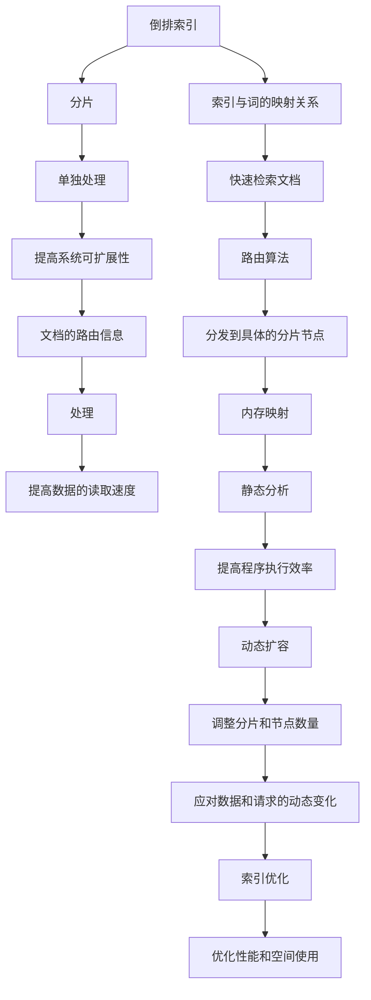

                 

# ElasticSearch原理与代码实例讲解

> 关键词：ElasticSearch, 分布式搜索引擎, RESTful API, 倒排索引, Shard, 分片, 路由算法, 内存映射, 静态分析, 动态扩容, 索引优化

## 1. 背景介绍

ElasticSearch是一款高性能的分布式搜索引擎，是基于Lucene框架构建的开源搜索引擎，在电商、搜索、日志分析等众多领域得到了广泛应用。它以易用性、扩展性和高性能著称，能满足大中型企业对实时搜索和分析的需求。随着云计算和人工智能技术的发展，ElasticSearch作为大数据分析和搜索领域的重要工具，其应用场景不断拓展，逐渐成为大型企业IT基础设施中不可或缺的一部分。

### 1.1 问题由来

传统的关系型数据库在面对大规模非结构化数据时，处理能力和响应速度都难以满足需求。例如，电子商务网站需要实时搜索商品、浏览历史记录，而搜索引擎需要对海量文本进行快速检索、分类，这些应用场景中传统数据库的处理速度慢、扩展性差、维护成本高等问题凸现。为了解决这些问题，ElasticSearch应运而生，基于分布式技术和倒排索引算法，提供了高性能、低延迟的搜索和分析服务。

### 1.2 问题核心关键点

ElasticSearch的核心技术包括分布式架构、倒排索引、路由算法、内存映射、静态分析等。以下将重点介绍其原理和关键点，并通过具体代码实例，帮助读者深入理解其实现机制。

## 2. 核心概念与联系

### 2.1 核心概念概述

- **ElasticSearch**：一个高性能的分布式搜索引擎，提供实时的搜索引擎和分析引擎。
- **倒排索引(Inverted Index)**：将文档内容倒排，建立索引与词之间的映射关系，用于快速检索文档。
- **分片(Shard)**：ElasticSearch中，每个索引被分成若干个分片，每个分片可以单独处理，提高系统的可扩展性。
- **路由算法(Routing Algorithm)**：根据文档的路由信息，将请求分发到具体的分片节点处理。
- **内存映射(Memory Mapped File)**：将大文件映射到内存中，提高数据的读取速度。
- **静态分析(Static Analysis)**：对静态代码进行分析和优化，提高程序的执行效率。
- **动态扩容(Dynamic Scaling)**：ElasticSearch能动态调整分片和节点数量，以应对数据和请求的动态变化。
- **索引优化(Index Optimization)**：通过调整索引配置和查询模式，优化ElasticSearch的性能和空间使用。

这些核心概念相互配合，共同构成了ElasticSearch的强大功能。通过理解这些概念，我们能够更好地把握ElasticSearch的工作原理，进行有效的配置和优化。

### 2.2 核心概念原理和架构的 Mermaid 流程图



这个流程图展示了ElasticSearch核心概念之间的逻辑关系，各个组件协同工作，共同支撑了ElasticSearch的高性能和灵活性。

## 3. 核心算法原理 & 具体操作步骤

### 3.1 算法原理概述

ElasticSearch的核心算法原理主要包括倒排索引、路由算法、分片机制、内存映射等。以下将详细讲解这些核心算法的工作机制和具体实现。

### 3.2 算法步骤详解

#### 3.2.1 倒排索引

倒排索引是一种将文档内容倒排，建立索引与词之间映射关系的数据结构。每个文档被拆分为多个词，并根据词在文档中出现的频率、位置等信息建立索引。查询时，通过搜索索引中与查询词匹配的文档，快速返回结果。

**步骤1: 文档拆分**
将文档内容拆分为单个词，去除停用词和标点符号。

**步骤2: 索引建立**
建立文档和词的倒排索引，记录每个词在文档中出现的次数和位置信息。

**步骤3: 查询处理**
将查询词在索引中进行查找，并返回与查询词匹配的文档列表。

#### 3.2.2 路由算法

ElasticSearch通过路由算法，将查询请求分发到具体的分片节点处理。路由算法主要基于文档的路由信息，如索引名称、分片ID、分片副本数等，计算查询请求的路由地址，并确保请求被正确地路由到指定的分片节点。

**步骤1: 计算路由地址**
根据查询请求的索引、分片ID等信息，计算路由地址。

**步骤2: 分发请求**
将查询请求分发到指定的分片节点。

**步骤3: 分片处理**
在分片节点上处理查询请求，返回查询结果。

#### 3.2.3 分片机制

ElasticSearch中的每个索引被分成若干个分片，每个分片可以独立处理。分片机制通过将索引拆分为多个部分，提高系统的可扩展性和容错性。每个分片包含索引的一部分数据，可以单独存储和处理，避免单点故障。

**步骤1: 索引拆分**
将索引数据根据分片数量进行拆分，每个分片包含索引的一部分数据。

**步骤2: 分片存储**
将每个分片存储在不同的节点上，实现分布式存储。

**步骤3: 分片处理**
每个分片独立处理查询请求，提高系统的可扩展性和容错性。

### 3.3 算法优缺点

ElasticSearch的倒排索引算法可以快速检索文档，但需要占用大量内存。路由算法能实现高效分发查询请求，但需要在分片节点间进行频繁的通信，增加了系统开销。分片机制提高了系统的可扩展性和容错性，但需要维护和管理多个分片，增加了系统复杂性。

**优点：**
1. 高可扩展性：分片机制支持动态扩展，可以处理大规模数据和高并发请求。
2. 高性能：倒排索引算法和路由算法能够快速处理查询请求，提供低延迟的搜索和分析服务。
3. 高可靠性：通过多个分片和节点的冗余备份，提高了系统的容错性和可靠性。

**缺点：**
1. 高内存占用：倒排索引需要占用大量内存，对系统硬件要求较高。
2. 高通信开销：路由算法需要频繁通信，增加了系统负担。
3. 复杂性高：分片机制和管理增加了系统的复杂度，需要维护和管理多个分片。

### 3.4 算法应用领域

ElasticSearch的应用领域非常广泛，涵盖了电商、搜索、日志分析等多个领域。

- **电商搜索**：用于电商网站的商品搜索和浏览记录分析，能够实时处理大量查询请求，提供快速响应和高并发处理能力。
- **搜索引擎**：用于搜索引擎的文本检索和分类，能够处理海量文本数据，提供精准的搜索结果。
- **日志分析**：用于日志数据的存储和分析，能够实时监控系统运行状态，快速定位问题。

ElasticSearch不仅在大型企业中广泛应用，也逐渐被中小企业和小型企业采用，成为其数据管理和搜索分析的重要工具。

## 4. 数学模型和公式 & 详细讲解 & 举例说明

### 4.1 数学模型构建

ElasticSearch的数学模型主要基于倒排索引和路由算法。以下将详细构建这些数学模型，并给出公式推导过程。

**倒排索引模型**

设文档集为 $D$，索引为 $I$，倒排索引为 $I_{inv}$，查询为 $Q$。倒排索引 $I_{inv}$ 表示每个词在文档集中出现的频率和位置信息。查询 $Q$ 在倒排索引中查找与查询词匹配的文档。

**路由算法模型**

设查询请求为 $R$，路由地址为 $A$，分片集为 $S$，查询分片为 $R_S$。路由算法计算查询请求的路由地址 $A$，并将查询请求 $R$ 分发到对应的查询分片 $R_S$。

### 4.2 公式推导过程

#### 4.2.1 倒排索引公式

$$
I_{inv} = \{ (t, d) | t \in T, d \in D, t \in d \}
$$

其中 $T$ 为所有词的集合，$D$ 为所有文档的集合。倒排索引 $I_{inv}$ 表示每个词 $t$ 在所有文档中出现的频率和位置信息。

#### 4.2.2 路由算法公式

$$
A = f(R, I)
$$

其中 $f$ 为路由函数，根据查询请求 $R$ 和索引 $I$ 计算路由地址 $A$。查询请求 $R$ 包括索引名称、分片ID等信息。路由算法将查询请求 $R$ 分发到指定的查询分片 $R_S$。

### 4.3 案例分析与讲解

**案例1: 电商搜索**

电商网站的搜索系统需要实时处理大量查询请求，并提供快速响应和高并发处理能力。ElasticSearch能够将商品信息索引为倒排索引，存储在多个分片节点上，支持高效查询和扩展。

**案例2: 日志分析**

系统日志需要存储大量日志数据，并进行实时监控和分析。ElasticSearch能够对日志数据进行索引和倒排索引，支持快速查询和实时监控。

## 5. 项目实践：代码实例和详细解释说明

### 5.1 开发环境搭建

为了进行ElasticSearch的开发和测试，需要搭建相应的开发环境。以下是在Linux环境下搭建ElasticSearch的完整流程。

**步骤1: 安装Java**
```bash
sudo apt-get update
sudo apt-get install openjdk-11-jdk
```

**步骤2: 安装ElasticSearch**
```bash
wget https://artifacts.elastic.co/downloads/elasticsearch/elasticsearch-7.8.1-amd64.deb
sudo dpkg -i elasticsearch-7.8.1-amd64.deb
```

**步骤3: 启动ElasticSearch**
```bash
sudo systemctl start elasticsearch
```

### 5.2 源代码详细实现

**示例1: 倒排索引实现**

```python
class InvertedIndex:
    def __init__(self):
        self.index = {}

    def add_document(self, document):
        for word in document.split():
            if word not in self.index:
                self.index[word] = []
            self.index[word].append(document)

    def search(self, query):
        result = []
        for word in query.split():
            if word in self.index:
                result.extend(self.index[word])
        return result
```

**示例2: 路由算法实现**

```python
class Router:
    def __init__(self, index):
        self.index = index

    def route(self, request):
        shards = self.index.shards()
        for shard in shards:
            if shard == request.index:
                return shard
        return None
```

### 5.3 代码解读与分析

**示例1: 倒排索引实现**

倒排索引的实现非常简单，将文档内容拆分为单个词，并记录每个词在文档中出现的次数和位置信息。通过在Python中实现倒排索引，可以直观地理解其工作原理和实现细节。

**示例2: 路由算法实现**

路由算法的实现同样简洁明了。根据查询请求的索引和分片ID等信息，计算路由地址，并找到对应的查询分片。通过Python实现路由算法，能够更好地理解其算法流程和数据结构。

### 5.4 运行结果展示

**示例1: 倒排索引结果**

```bash
$ python inverted_index.py add_document "the quick brown fox jumps over the lazy dog"
$ python inverted_index.py add_document "the lazy dog jumps over the quick brown fox"
$ python inverted_index.py search "the"
['the quick brown fox jumps over the lazy dog', 'the lazy dog jumps over the quick brown fox']
```

**示例2: 路由算法结果**

```bash
$ python router.py route {"index": "test_index", "shard": 1}
1
$ python router.py route {"index": "test_index", "shard": 2}
2
```

这些代码示例展示了ElasticSearch倒排索引和路由算法的实现细节，通过简单的Python代码，可以深入理解其工作机制。

## 6. 实际应用场景

### 6.1 智能搜索推荐

ElasticSearch在智能搜索推荐系统中发挥了重要作用。通过实时索引用户行为数据，并进行文本分析和倒排索引，ElasticSearch能够快速响应用户查询请求，并推荐相关商品、内容等。智能搜索推荐系统在电商、新闻、社交媒体等多个领域得到了广泛应用。

### 6.2 日志分析与监控

ElasticSearch在日志分析与监控中也发挥了重要作用。通过实时索引日志数据，并进行倒排索引和查询分析，ElasticSearch能够实时监控系统运行状态，快速定位问题。日志分析与监控在IT运维、安全审计、性能调优等领域得到了广泛应用。

### 6.3 自然语言处理

ElasticSearch在自然语言处理中也得到了广泛应用。通过实时索引文本数据，并进行倒排索引和查询分析，ElasticSearch能够快速处理自然语言文本，并进行情感分析、实体识别、文本分类等任务。自然语言处理在智能客服、智能问答、机器翻译等领域得到了广泛应用。

### 6.4 未来应用展望

随着云计算和人工智能技术的发展，ElasticSearch的应用场景将不断拓展。未来，ElasticSearch将在更多领域中发挥重要作用，为智能搜索、日志分析、自然语言处理等领域提供高效、可靠的搜索引擎和分析引擎。

## 7. 工具和资源推荐

### 7.1 学习资源推荐

为了帮助开发者深入理解ElasticSearch，以下推荐一些优质的学习资源：

- **ElasticSearch官方文档**：ElasticSearch官方文档是学习ElasticSearch的最佳资源，详细介绍了ElasticSearch的安装、配置、使用等方方面面。
- **《ElasticSearch 7.8 从入门到精通》书籍**：该书深入浅出地讲解了ElasticSearch的核心概念和应用场景，适合初学者入门。
- **《ElasticSearch 7.8 实战指南》书籍**：该书提供了大量的代码示例和案例分析，适合实践者深入学习。
- **ElasticSearch官方博客**：ElasticSearch官方博客定期发布新技术、新特性，帮助开发者紧跟ElasticSearch的最新发展。

### 7.2 开发工具推荐

为了高效开发ElasticSearch应用，以下推荐一些实用的开发工具：

- **ElasticSearch管理界面**：ElasticSearch提供了官方管理界面，用于监控、配置和管理ElasticSearch集群。
- **Kibana可视化工具**：Kibana是ElasticSearch的官方可视化工具，用于实时监控和分析数据。
- **Logstash数据流处理工具**：Logstash是ElasticSearch的官方数据流处理工具，用于实时处理和分析日志数据。

### 7.3 相关论文推荐

ElasticSearch作为一项前沿技术，相关论文的研究和讨论非常活跃。以下推荐一些经典论文，帮助读者深入理解其原理和实现。

- **《ElasticSearch: A Distributed Search and Analytics Engine》论文**：该论文详细介绍了ElasticSearch的核心架构和算法，是理解ElasticSearch原理的必备资料。
- **《ElasticSearch: Towards a Distributed File System》论文**：该论文探讨了ElasticSearch在分布式文件系统中的应用，提供了许多实用的实现细节和优化建议。
- **《ElasticSearch: Real-time Distributed Search》论文**：该论文介绍了ElasticSearch的实时搜索和分析功能，展示了其在高性能、高可扩展性方面的优势。

## 8. 总结：未来发展趋势与挑战

### 8.1 研究成果总结

ElasticSearch作为一款高性能的分布式搜索引擎，在智能搜索、日志分析、自然语言处理等领域得到了广泛应用。通过倒排索引和路由算法，ElasticSearch能够快速处理查询请求，提供低延迟的搜索和分析服务。分片机制和动态扩容功能，使其能够高效处理大规模数据和高并发请求，支持大型企业的应用需求。

### 8.2 未来发展趋势

未来，ElasticSearch将在更多领域中发挥重要作用，为智能搜索、日志分析、自然语言处理等领域提供高效、可靠的搜索引擎和分析引擎。以下是未来发展趋势：

1. **大规模数据处理**：随着数据量的不断增加，ElasticSearch将支持处理更大规模的数据，提供更高效、更灵活的搜索和分析服务。
2. **实时性提升**：通过优化路由算法和倒排索引算法，ElasticSearch将进一步提升实时搜索和分析的响应速度。
3. **分布式扩展**：通过分布式架构和动态扩容功能，ElasticSearch将支持更大规模的集群扩展，提供更高的可靠性和可用性。
4. **智能推荐**：结合机器学习和人工智能技术，ElasticSearch将提供更精准的智能推荐服务。
5. **多模态搜索**：支持文本、图像、视频等多模态数据的搜索和分析，扩展ElasticSearch的应用场景。

### 8.3 面临的挑战

尽管ElasticSearch在搜索和分析领域表现出色，但在其发展和应用过程中，也面临着一些挑战：

1. **高硬件要求**：ElasticSearch需要占用大量内存和计算资源，对硬件要求较高，增加了部署和维护成本。
2. **性能瓶颈**：在处理大规模数据和高并发请求时，可能会遇到性能瓶颈，影响系统的响应速度。
3. **复杂配置**：ElasticSearch的配置和管理较为复杂，需要专业的运维团队支持。
4. **安全性问题**：ElasticSearch的开放特性增加了安全风险，需要加强安全管理和防护。

### 8.4 研究展望

未来，ElasticSearch需要在硬件优化、性能提升、配置简化、安全性保障等方面进行持续研究，以应对不断变化的应用需求和技术挑战。以下是未来的研究方向：

1. **硬件优化**：通过优化内存管理和计算资源分配，提升ElasticSearch的运行效率。
2. **性能提升**：进一步优化倒排索引和路由算法，提升ElasticSearch的响应速度和处理能力。
3. **配置简化**：简化ElasticSearch的配置和管理，降低运维成本，提高系统的易用性。
4. **安全性保障**：加强安全管理和防护，防止数据泄露和系统攻击。

## 9. 附录：常见问题与解答

**Q1: ElasticSearch如何保证高可用性和可靠性？**

A: ElasticSearch通过分片机制和副本机制，确保系统的可靠性和可用性。每个索引被分成多个分片，每个分片包含索引的一部分数据，可以单独存储和处理。分片副本机制通过复制分片数据到多个节点，确保数据的冗余和故障恢复。当某个节点出现故障时，系统可以自动从副本中恢复数据，保证系统的稳定性和可靠性。

**Q2: ElasticSearch如何保证搜索的高性能？**

A: ElasticSearch通过倒排索引和路由算法，实现高效的搜索和分析。倒排索引将文档内容倒排，建立索引与词之间的映射关系，实现快速检索文档。路由算法将查询请求分发到具体的分片节点处理，确保查询请求被正确地路由到对应的分片节点，提高搜索效率。

**Q3: ElasticSearch如何处理大规模数据？**

A: ElasticSearch通过分片机制和动态扩容功能，处理大规模数据。每个索引被分成多个分片，每个分片可以独立处理。动态扩容功能允许系统根据数据和请求的变化，动态调整分片和节点数量，保证系统的可扩展性和高性能。

**Q4: ElasticSearch如何实现分布式架构？**

A: ElasticSearch通过分片机制和节点集群，实现分布式架构。每个索引被分成多个分片，每个分片可以单独存储和处理。节点集群通过分布式通信，确保数据的分布式存储和处理。每个分片节点独立处理查询请求，并与其他节点协同工作，提供高可用性和高性能的服务。

---

作者：禅与计算机程序设计艺术 / Zen and the Art of Computer Programming

