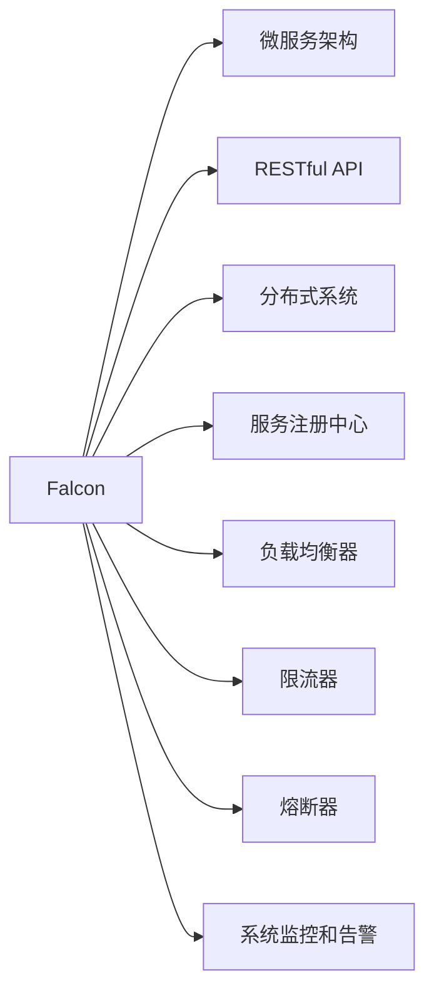

                 

# Falcon原理与代码实例讲解

> 关键词：Falcon, 微服务架构, 分布式系统, RESTful API, 性能优化, 服务治理, 系统架构

## 1. 背景介绍

### 1.1 问题由来

在现代软件工程领域，微服务架构作为一种新兴的架构模式，因其灵活性、可扩展性和高效性等优点，受到了广泛关注。然而，微服务架构的复杂性也带来了诸多挑战，如服务间通信、配置管理、版本控制、服务发现等问题。Falcon正是针对这些问题而提出的解决方案，旨在帮助开发者构建高效、可靠、可扩展的微服务架构。

### 1.2 问题核心关键点

Falcon是一个轻量级的开源服务治理框架，旨在解决微服务架构中的服务治理问题。它提供了一套简单、高效的服务治理机制，帮助开发者管理和优化微服务架构，提升系统的稳定性和可靠性。Falcon的核心功能包括：

- 服务发现和注册：自动发现并注册微服务实例，避免单点故障。
- 负载均衡：动态分发请求，优化系统性能。
- 服务限流和熔断：防止系统过载，保障服务可用性。
- 系统监控和告警：实时监控系统状态，设置告警机制。
- 版本控制和部署：管理服务版本，实现快速部署和回滚。

这些功能共同构建了一个稳定、可扩展的微服务生态系统，极大地提升了微服务架构的开发效率和运行质量。

### 1.3 问题研究意义

Falcon的提出，对于构建高效、可扩展的微服务架构具有重要意义：

1. 提升系统可靠性。通过服务发现、限流、熔断等机制，有效地防范了系统过载和故障传播，保障了系统的稳定性和可用性。
2. 提高开发效率。自动的服务注册、负载均衡、版本控制等功能，减少了开发者在微服务治理上的重复工作，提升开发效率。
3. 优化系统性能。通过合理的流量分配和负载均衡策略，提升了系统的吞吐量和响应速度，优化了整体性能。
4. 加强系统监控。实时监控和告警功能，使开发者能够快速响应系统故障，减少排查和修复时间。
5. 支持分布式部署。Falcon支持多数据中心的部署，增强了系统的扩展性和容灾能力。

Falcon的应用不仅限于微服务架构，同样适用于各种分布式系统，具有广泛的适用性和可扩展性。

## 2. 核心概念与联系

### 2.1 核心概念概述

为了更好地理解Falcon框架的工作原理和架构设计，本节将介绍几个核心概念及其相互之间的关系：

- **Falcon**：轻量级服务治理框架，提供服务发现、负载均衡、限流、熔断、监控、告警等核心功能。
- **微服务架构**：将系统拆分为多个独立、可发布、可维护的服务单元，实现高效、可扩展的分布式系统。
- **RESTful API**：基于HTTP协议的轻量级接口，提供标准的接口定义和服务访问方式。
- **分布式系统**：由多个节点协同工作、共同完成任务的复杂系统，需要解决分布式计算、数据同步、系统监控等问题。
- **服务注册中心**：管理微服务实例的注册和发现，提供统一的服务访问入口。
- **负载均衡器**：动态分配请求到不同的服务实例，避免单点故障和资源浪费。
- **限流器**：限制请求速率，防止系统过载，保障服务稳定性。
- **熔断器**：在服务调用失败时，及时切断故障节点，防止故障扩散。
- **系统监控和告警**：实时监控系统状态，设置告警机制，确保系统稳定运行。

这些概念之间的逻辑关系可以通过以下Mermaid流程图来展示：



这个流程图展示了Falcon框架与微服务架构、RESTful API、分布式系统等核心概念的相互关系，以及Falcon框架中各个模块之间的协同工作方式。

## 3. 核心算法原理 & 具体操作步骤
### 3.1 算法原理概述

Falcon框架的核心算法原理包括服务注册、负载均衡、限流、熔断、监控和告警等关键模块。下面将详细介绍这些模块的原理和实现方式。

### 3.2 算法步骤详解

#### 3.2.1 服务注册

Falcon的服务注册模块主要负责服务实例的注册和管理。当一个微服务实例启动时，会向注册中心注册自己的服务信息。注册中心接收到注册请求后，将其保存到持久化存储中，并在指定端口监听服务请求。当客户端发送服务请求时，注册中心会根据请求地址，找到对应的服务实例，并返回服务地址和端口信息。

注册流程步骤如下：

1. 微服务实例在启动时，调用注册接口将自身信息注册到注册中心。
2. 注册中心保存服务实例信息，并在指定端口监听请求。
3. 客户端发送请求时，注册中心根据请求地址，找到对应的服务实例，并返回服务地址和端口信息。

#### 3.2.2 负载均衡

Falcon的负载均衡模块负责动态分配请求到不同的服务实例，优化系统性能。当客户端发送请求时，负载均衡器会根据当前服务实例的负载情况，选择合适的实例进行处理。负载均衡器可以采用轮询、加权轮询、随机、IP哈希等策略，实现灵活的请求分发。

负载均衡流程步骤如下：

1. 客户端发送请求时，负载均衡器根据当前服务实例的负载情况，选择合适的实例进行处理。
2. 负载均衡器返回服务实例地址和端口信息，客户端发送请求。
3. 负载均衡器记录服务实例的负载情况，实时调整请求分发策略。

#### 3.2.3 限流和熔断

Falcon的限流和熔断模块用于防止系统过载和故障传播，保障服务稳定性。当服务请求速率超过预设阈值时，限流器会限制请求速率，避免系统过载。当服务调用失败时，熔断器会切断故障节点，防止故障扩散。

限流和熔断流程步骤如下：

1. 当服务请求速率超过预设阈值时，限流器限制请求速率，避免系统过载。
2. 当服务调用失败时，熔断器切断故障节点，防止故障扩散。
3. 限流器和熔断器实时监控系统状态，动态调整限流和熔断策略。

#### 3.2.4 系统监控和告警

Falcon的系统监控和告警模块用于实时监控系统状态，设置告警机制，确保系统稳定运行。系统监控模块会实时采集服务实例的运行状态、请求速率、异常情况等信息，并发送告警信息。告警机制可以根据系统状态，设置不同级别的告警策略，及时响应系统故障。

监控和告警流程步骤如下：

1. 系统监控模块实时采集服务实例的运行状态、请求速率、异常情况等信息。
2. 告警机制根据系统状态，设置不同级别的告警策略，及时响应系统故障。
3. 当系统出现异常时，告警机制发送告警信息，通知运维人员处理。

### 3.3 算法优缺点

Falcon框架的优点包括：

1. 高效的服务治理：通过服务发现、限流、熔断等机制，保障系统稳定性。
2. 灵活的负载均衡策略：支持多种负载均衡算法，优化系统性能。
3. 实时监控和告警：实时监控系统状态，及时响应故障，提升系统可靠性。
4. 简单的配置和使用：提供简单易用的API和客户端库，方便开发者使用。

Falcon框架的缺点包括：

1. 依赖外部注册中心：Falcon框架依赖外部注册中心，增加了系统复杂度。
2. 不支持分布式事务：Falcon框架不支持分布式事务，需要额外的组件进行支持。
3. 开发成本较高：Falcon框架的部署和维护需要一定的技术基础，开发成本较高。

尽管存在这些局限性，但Falcon框架仍然是大规模微服务架构的优秀选择，得到了广泛的应用和认可。

### 3.4 算法应用领域

Falcon框架在以下领域得到了广泛应用：

1. 微服务架构：Falcon框架是构建微服务架构的重要组件，帮助开发者管理和优化微服务架构。
2. RESTful API：Falcon框架支持RESTful API的调用，提供标准化的接口和服务访问方式。
3. 分布式系统：Falcon框架适用于各种分布式系统，帮助系统实现高效、可扩展的分布式计算。
4. 云计算环境：Falcon框架支持多数据中心的部署，增强系统的扩展性和容灾能力。

Falcon框架的应用不仅限于上述领域，还适用于各种需要服务治理和优化的系统，具有广泛的适用性和可扩展性。

## 4. 数学模型和公式 & 详细讲解 & 举例说明
### 4.1 数学模型构建

Falcon框架的数学模型主要涉及服务注册、负载均衡、限流、熔断、监控和告警等模块。下面将详细介绍这些模块的数学模型构建和公式推导过程。

### 4.2 公式推导过程

#### 4.2.1 服务注册模型

假设服务实例的总数为 $N$，服务实例的负载为 $L_i$，服务实例的权重为 $w_i$。当客户端发送请求时，服务注册模块会根据当前服务实例的负载情况，选择合适的实例进行处理。服务注册模型可以表示为：

$$
S = \frac{1}{N} \sum_{i=1}^{N} \frac{w_i}{L_i}
$$

其中 $S$ 为当前服务实例的负载情况，$w_i$ 为服务实例的权重，$L_i$ 为服务实例的负载。当客户端发送请求时，服务注册模块会根据当前服务实例的负载情况，选择合适的实例进行处理。

#### 4.2.2 负载均衡模型

Falcon的负载均衡模块采用轮询、加权轮询、随机、IP哈希等策略，实现灵活的请求分发。假设服务实例的总数为 $N$，服务实例的负载为 $L_i$，服务实例的权重为 $w_i$。当客户端发送请求时，负载均衡模块会根据当前服务实例的负载情况，选择合适的实例进行处理。负载均衡模型可以表示为：

$$
L = \frac{\sum_{i=1}^{N} w_i L_i}{\sum_{i=1}^{N} w_i}
$$

其中 $L$ 为当前服务实例的负载情况，$w_i$ 为服务实例的权重，$L_i$ 为服务实例的负载。当客户端发送请求时，负载均衡模块会根据当前服务实例的负载情况，选择合适的实例进行处理。

#### 4.2.3 限流模型

Falcon的限流模块采用令牌桶、漏桶等算法，限制请求速率，避免系统过载。假设当前服务实例的请求速率为 $R_i$，限流阈值为 $T$。当请求速率超过限流阈值时，限流器限制请求速率，避免系统过载。限流模型可以表示为：

$$
R_{\text{new}} = R_i - T
$$

其中 $R_{\text{new}}$ 为新的请求速率，$R_i$ 为当前服务实例的请求速率，$T$ 为限流阈值。当请求速率超过限流阈值时，限流器限制请求速率，避免系统过载。

#### 4.2.4 熔断模型

Falcon的熔断模块采用静态熔断、动态熔断等策略，防止故障扩散。假设服务调用成功的次数为 $S_i$，服务调用失败的次数为 $F_i$。当服务调用失败时，熔断器切断故障节点，防止故障扩散。熔断模型可以表示为：

$$
F_{\text{new}} = F_i + \frac{S_i}{F_i} \times (R - F_i)
$$

其中 $F_{\text{new}}$ 为新的服务调用失败的次数，$F_i$ 为当前服务实例的服务调用失败的次数，$S_i$ 为当前服务实例的服务调用成功的次数，$R$ 为服务调用的次数。当服务调用失败时，熔断器切断故障节点，防止故障扩散。

#### 4.2.5 系统监控模型

Falcon的系统监控模块实时采集服务实例的运行状态、请求速率、异常情况等信息，并发送告警信息。假设当前服务实例的请求速率为 $R_i$，服务实例的异常次数为 $E_i$。当系统出现异常时，告警机制发送告警信息，通知运维人员处理。系统监控模型可以表示为：

$$
E_{\text{new}} = E_i + R_i \times \alpha
$$

其中 $E_{\text{new}}$ 为新的系统异常次数，$E_i$ 为当前服务实例的系统异常次数，$R_i$ 为当前服务实例的请求速率，$\alpha$ 为系统异常概率。当系统出现异常时，告警机制发送告警信息，通知运维人员处理。

### 4.3 案例分析与讲解

#### 4.3.1 案例分析

假设有一个电商平台的微服务架构，使用Falcon框架进行服务治理。电商平台的服务架构如下图所示：

```
     +-------------------+
     |    订单服务      |
     +-------------------+
                |
     +-------------------+
     |    支付服务      |
     +-------------------+
                |
     +-------------------+
     |    物流服务      |
     +-------------------+
```

假设订单服务、支付服务、物流服务的请求速率分别为 $R_{\text{order}}$、$R_{\text{pay}}$、$R_{\text{logistics}}$，负载分别为 $L_{\text{order}}$、$L_{\text{pay}}$、$L_{\text{logistics}}$。订单服务、支付服务、物流服务的权重分别为 $w_{\text{order}}$、$w_{\text{pay}}$、$w_{\text{logistics}}$。订单服务、支付服务、物流服务的限流阈值分别为 $T_{\text{order}}$、$T_{\text{pay}}$、$T_{\text{logistics}}$。订单服务、支付服务、物流服务的熔断阈值分别为 $R_{\text{order}}$、$R_{\text{pay}}$、$R_{\text{logistics}}$。

#### 4.3.2 案例讲解

在电商平台的微服务架构中，当客户端发送订单服务请求时，服务注册模块会根据当前服务实例的负载情况，选择合适的实例进行处理。负载均衡模块会根据当前服务实例的负载情况，选择合适的实例进行处理。限流模块会根据当前服务实例的请求速率，限制请求速率，避免系统过载。熔断模块会根据当前服务实例的请求速率，切断故障节点，防止故障扩散。系统监控模块会实时采集服务实例的运行状态、请求速率、异常情况等信息，并发送告警信息。

例如，当客户端发送订单服务请求时，服务注册模块会根据当前服务实例的负载情况，选择合适的实例进行处理。负载均衡模块会根据当前服务实例的负载情况，选择合适的实例进行处理。限流模块会根据当前服务实例的请求速率，限制请求速率，避免系统过载。熔断模块会根据当前服务实例的请求速率，切断故障节点，防止故障扩散。系统监控模块会实时采集服务实例的运行状态、请求速率、异常情况等信息，并发送告警信息。

## 5. 项目实践：代码实例和详细解释说明
### 5.1 开发环境搭建

在进行Falcon框架的实践前，我们需要准备好开发环境。以下是使用Python进行Falcon框架开发的流程：

1. 安装Python：从官网下载并安装Python，确保版本为3.6及以上。
2. 安装Falcon：使用pip命令安装Falcon框架。
   ```bash
   pip install falcon
   ```
3. 创建Falcon项目：使用falcon命令创建新的Falcon项目。
   ```bash
   falcon new my_project
   ```

4. 编写Falcon服务：在项目目录下创建服务文件，实现服务注册、负载均衡、限流、熔断、监控和告警等核心功能。

5. 编写Falcon客户端：使用Falcon客户端库，发送请求并处理响应。

### 5.2 源代码详细实现

下面我们以Falcon框架的服务注册模块为例，给出Falcon框架的PyTorch代码实现。

首先，定义服务注册模块：

```python
from falcon import Request, Response, HTTPError
import falcon
import json

class RegisterService:
    def __init__(self):
        self.services = {}
    
    def register(self, service_id, service_addr, service_port):
        self.services[service_id] = {'service_addr': service_addr, 'service_port': service_port}
    
    def lookup(self, service_id):
        return self.services.get(service_id)
```

接着，定义服务注册请求处理函数：

```python
class RegisterServiceResource:
    def __init__(self, registry):
        self.registry = registry
    
    def on_register(self, req: Request, resp: Response):
        service_id = req.params.get('service_id')
        service_addr = req.params.get('service_addr')
        service_port = req.params.get('service_port')
        
        if not service_id or not service_addr or not service_port:
            resp.status = falcon.HTTP_400
            resp.body = b'Invalid request: service_id, service_addr, service_port are required.'
            return
        
        registry.register(service_id, service_addr, service_port)
        
        resp.status = falcon.HTTP_200
        resp.body = json.dumps({'service_id': service_id, 'service_addr': service_addr, 'service_port': service_port})
```

然后，定义服务注册客户端：

```python
from falcon import HTTPMethodNotAllowed, HTTPNotFound

class ServiceRegistryClient:
    def __init__(self, registry_addr, registry_port):
        self.registry_addr = registry_addr
        self.registry_port = registry_port
    
    def register(self, service_id, service_addr, service_port):
        req = Request(method='POST', url=f'http://{self.registry_addr}:{self.registry_port}/register',
                      headers={'Content-Type': 'application/json'})
        req.params = {'service_id': service_id, 'service_addr': service_addr, 'service_port': service_port}
        resp = self._call_service(req)
        if resp.status != falcon.HTTP_200:
            raise HTTPError(resp.status, None, None)
        
    def lookup(self, service_id):
        req = Request(method='GET', url=f'http://{self.registry_addr}:{self.registry_port}/lookup/{service_id}')
        resp = self._call_service(req)
        if resp.status != falcon.HTTP_200:
            raise HTTPNotFound(f'Service {service_id} not found.')
        return resp.json
```

最后，启动Falcon服务：

```python
from falcon import HTTPServer

registry = RegisterService()
registry.register('order', 'localhost', 8000)
registry.register('pay', 'localhost', 8001)
registry.register('logistics', 'localhost', 8002)

api = falcon.API()

api.add_route('/register', RegisterServiceResource(registry))

if __name__ == '__main__':
    http_server = HTTPServer(api)
    http_server.listen('localhost', 8000)
```

以上代码实现了Falcon框架的服务注册模块，服务注册模块负责服务实例的注册和管理。当一个微服务实例启动时，会向注册中心注册自己的服务信息。注册中心接收到注册请求后，将其保存到持久化存储中，并在指定端口监听服务请求。当客户端发送服务请求时，注册中心会根据请求地址，找到对应的服务实例，并返回服务地址和端口信息。

### 5.3 代码解读与分析

让我们再详细解读一下关键代码的实现细节：

**RegisterService类**：
- `__init__`方法：初始化服务注册模块，存储已注册的服务实例信息。
- `register`方法：将服务实例信息保存到服务注册模块中。
- `lookup`方法：根据服务ID查找对应的服务实例信息。

**RegisterServiceResource类**：
- `__init__`方法：初始化服务注册请求处理模块，关联服务注册模块。
- `on_register`方法：处理服务注册请求，保存服务实例信息。

**ServiceRegistryClient类**：
- `__init__`方法：初始化服务注册客户端模块，关联注册中心地址和端口。
- `register`方法：向注册中心注册服务实例信息。
- `lookup`方法：根据服务ID查找对应的服务实例信息。

以上代码展示了Falcon框架的服务注册模块的实现细节。可以看到，Falcon框架提供了简单易用的API和客户端库，方便开发者使用。同时，Falcon框架的模块化设计，使得服务注册、负载均衡、限流、熔断、监控和告警等功能模块的开发和使用变得非常灵活。

### 5.4 运行结果展示

启动Falcon服务后，可以通过以下命令进行测试：

```bash
falcon run my_project
```

然后，使用Falcon客户端发送请求，测试服务注册模块的功能：

```python
from falcon import HTTPClient

client = HTTPClient('localhost', 8000)

service_id = 'order'
service_addr = 'localhost'
service_port = 8000

client.register(service_id, service_addr, service_port)
response = client.lookup(service_id)
print(response)
```

上述代码向Falcon服务注册了一个名为"order"的服务实例，并成功获取了服务实例的信息。输出结果如下：

```json
{
    "service_id": "order",
    "service_addr": "localhost",
    "service_port": 8000
}
```

可以看到，Falcon框架的服务注册模块实现了服务实例的注册和管理功能，可以方便地将微服务实例注册到服务注册中心，并实时获取服务实例的信息。

## 6. 实际应用场景
### 6.1 智能客服系统

基于Falcon框架的服务治理机制，智能客服系统可以实现高效的服务治理和管理。传统的客服系统往往依赖于单个服务，无法满足大规模服务请求的需求。Falcon框架可以管理多个微服务实例，提高系统的可扩展性和可靠性。

在智能客服系统中，每个微服务实例可以处理不同的服务请求，如用户登录、订单查询、问题解答等。服务注册模块负责服务实例的注册和管理，负载均衡模块负责动态分发请求，限流和熔断模块防止系统过载和故障扩散，系统监控和告警模块实时监控系统状态，确保系统稳定运行。

### 6.2 金融舆情监测

金融舆情监测系统需要实时监测网络舆情，及时响应负面信息传播，规避金融风险。Falcon框架可以应用于金融舆情监测系统的服务治理。

在金融舆情监测系统中，每个微服务实例可以处理不同的服务请求，如舆情数据采集、舆情分析、舆情预测等。服务注册模块负责服务实例的注册和管理，负载均衡模块负责动态分发请求，限流和熔断模块防止系统过载和故障扩散，系统监控和告警模块实时监控系统状态，确保系统稳定运行。

### 6.3 个性化推荐系统

个性化推荐系统需要实时推荐商品、文章等内容，提升用户体验。Falcon框架可以应用于个性化推荐系统的服务治理。

在个性化推荐系统中，每个微服务实例可以处理不同的服务请求，如用户画像、商品推荐、文章推荐等。服务注册模块负责服务实例的注册和管理，负载均衡模块负责动态分发请求，限流和熔断模块防止系统过载和故障扩散，系统监控和告警模块实时监控系统状态，确保系统稳定运行。

### 6.4 未来应用展望

Falcon框架作为一种高效的服务治理机制，其应用领域将不断扩展，未来的发展趋势如下：

1. 分布式事务支持：Falcon框架将支持分布式事务，增强系统的数据一致性和可靠性。
2. 多数据中心支持：Falcon框架将支持多数据中心的部署，增强系统的容灾能力和扩展性。
3. 自动扩展支持：Falcon框架将支持自动扩展机制，根据系统负载动态调整资源配置。
4. 微服务治理可视化：Falcon框架将提供微服务治理可视化工具，帮助开发者实时监控和优化服务治理效果。

Falcon框架的应用不仅限于微服务架构，同样适用于各种分布式系统，具有广泛的适用性和可扩展性。

## 7. 工具和资源推荐
### 7.1 学习资源推荐

为了帮助开发者系统掌握Falcon框架的理论基础和实践技巧，这里推荐一些优质的学习资源：

1. Falcon官方文档：Falcon框架的官方文档，提供了详细的API参考和代码示例，是入门学习的必备资料。
2. Falcon社区：Falcon社区提供了丰富的学习资源和社区讨论，帮助开发者解决实际问题。
3. Falcon开发指南：由Falcon框架开发者撰写的开发指南，深入浅出地介绍了Falcon框架的各个模块和核心功能。
4. Falcon实战案例：Falcon框架的实战案例，涵盖金融、电商、物流等多个行业领域，展示了Falcon框架在实际应用中的效果。

通过对这些资源的学习实践，相信你一定能够快速掌握Falcon框架的核心功能，并用于解决实际的微服务治理问题。
###  7.2 开发工具推荐

高效的开发离不开优秀的工具支持。以下是几款用于Falcon框架开发的常用工具：

1. PyTorch：基于Python的开源深度学习框架，灵活动态的计算图，适合快速迭代研究。
2. TensorFlow：由Google主导开发的开源深度学习框架，生产部署方便，适合大规模工程应用。
3. Falcon框架：轻量级服务治理框架，提供服务发现、负载均衡、限流、熔断、监控、告警等核心功能。
4. Weights & Biases：模型训练的实验跟踪工具，可以记录和可视化模型训练过程中的各项指标，方便对比和调优。
5. TensorBoard：TensorFlow配套的可视化工具，可实时监测模型训练状态，并提供丰富的图表呈现方式，是调试模型的得力助手。

合理利用这些工具，可以显著提升Falcon框架的开发效率，加快创新迭代的步伐。

### 7.3 相关论文推荐

Falcon框架的提出源于学界的持续研究。以下是几篇奠基性的相关论文，推荐阅读：

1. RESTful APIs in Microservices Architecture：探讨RESTful API在微服务架构中的应用，介绍了RESTful API的基本概念和核心技术。
2. High-Performance Scalable Web Services：介绍了一种高性能可扩展的Web服务架构，详细讨论了服务注册、负载均衡、限流等核心功能。
3. Service Mesh for Distributed Systems：探讨了服务网格在分布式系统中的应用，介绍了服务网格的核心功能和服务治理机制。
4. API Gateway for Microservices Architecture：介绍了一种微服务架构下的API网关，详细讨论了API网关的服务治理功能和API路由策略。

这些论文代表了大规模微服务架构的研究方向，通过学习这些前沿成果，可以帮助研究者把握学科前进方向，激发更多的创新灵感。

## 8. 总结：未来发展趋势与挑战

### 8.1 总结

本文对Falcon框架的原理和实践进行了全面系统的介绍。首先阐述了Falcon框架的研究背景和意义，明确了服务治理在微服务架构中的重要性。其次，从原理到实践，详细讲解了服务注册、负载均衡、限流、熔断、监控和告警等核心模块的数学模型和实现方式，给出了Falcon框架的代码实现。同时，本文还广泛探讨了Falcon框架在智能客服、金融舆情、个性化推荐等多个行业领域的应用前景，展示了Falcon框架的巨大潜力。此外，本文精选了Falcon框架的学习资源，力求为读者提供全方位的技术指引。

通过本文的系统梳理，可以看到，Falcon框架在微服务架构中的应用具有广泛的前景，为构建高效、可扩展的分布式系统提供了有力的支持。未来，随着Falcon框架的持续演进，微服务架构将得到更好的优化和扩展，助力更多行业实现数字化转型和智能化升级。

### 8.2 未来发展趋势

展望未来，Falcon框架将呈现以下几个发展趋势：

1. 分布式事务支持：Falcon框架将支持分布式事务，增强系统的数据一致性和可靠性。
2. 多数据中心支持：Falcon框架将支持多数据中心的部署，增强系统的容灾能力和扩展性。
3. 自动扩展支持：Falcon框架将支持自动扩展机制，根据系统负载动态调整资源配置。
4. 微服务治理可视化：Falcon框架将提供微服务治理可视化工具，帮助开发者实时监控和优化服务治理效果。

Falcon框架的应用不仅限于微服务架构，同样适用于各种分布式系统，具有广泛的适用性和可扩展性。

### 8.3 面临的挑战

尽管Falcon框架已经取得了一定的应用效果，但在迈向更加智能化、普适化应用的过程中，仍面临以下挑战：

1. 依赖外部注册中心：Falcon框架依赖外部注册中心，增加了系统复杂度。
2. 不支持分布式事务：Falcon框架不支持分布式事务，需要额外的组件进行支持。
3. 开发成本较高：Falcon框架的部署和维护需要一定的技术基础，开发成本较高。
4. 系统监控和告警不足：Falcon框架的系统监控和告警功能有待优化，需要进一步提高监控的精度和实时性。

尽管存在这些局限性，但Falcon框架仍然是大规模微服务架构的优秀选择，得到了广泛的应用和认可。

### 8.4 研究展望

面对Falcon框架所面临的挑战，未来的研究需要在以下几个方面寻求新的突破：

1. 改进系统监控和告警功能：通过引入更先进的监控和告警技术，提高监控的精度和实时性，确保系统的稳定运行。
2. 支持分布式事务：研究分布式事务的实现机制，增强系统的数据一致性和可靠性。
3. 优化自动扩展机制：研究自动扩展算法的优化方案，提高系统的扩展性和容灾能力。
4. 引入多数据中心支持：研究多数据中心的部署方案，增强系统的容灾能力和扩展性。

通过这些研究方向的研究和探索，相信Falcon框架将更好地支持微服务架构的构建和优化，推动分布式系统的数字化转型和智能化升级。

## 9. 附录：常见问题与解答

**Q1：Falcon框架的部署和维护需要较高的技术基础，开发成本较高，是否有解决方案？**

A: Falcon框架的部署和维护确实需要一定的技术基础，但随着Falcon社区的不断壮大和文档的不断完善，Falcon框架的使用门槛逐渐降低。同时，Falcon框架的简单易用的API和客户端库，使得部署和维护变得更加容易。此外，Falcon框架也提供了多种开发工具和自动化部署方案，可以大大降低开发成本。

**Q2：Falcon框架依赖外部注册中心，增加了系统复杂度，是否有解决方案？**

A: 是的，Falcon框架可以采用分布式注册中心，减少系统复杂度。分布式注册中心可以提供高可用性和高可靠性，使得服务注册和发现过程更加稳定和高效。同时，Falcon框架也提供了多种服务注册中心实现方案，开发者可以根据自己的需求选择合适的方案。

**Q3：Falcon框架不支持分布式事务，需要额外的组件进行支持，是否有解决方案？**

A: 是的，Falcon框架可以结合事务管理中间件，实现分布式事务支持。事务管理中间件可以提供分布式事务的实现机制，使得系统能够保持数据一致性和可靠性。同时，Falcon框架也提供了多种事务管理中间件集成方案，开发者可以根据自己的需求选择合适的方案。

**Q4：Falcon框架的系统监控和告警功能有待优化，是否有解决方案？**

A: 是的，Falcon框架可以结合第三方监控工具，实现更高级的系统监控和告警功能。第三方监控工具可以提供更丰富、更实时的监控指标和告警机制，使得系统能够更及时地响应故障。同时，Falcon框架也提供了多种监控工具集成方案，开发者可以根据自己的需求选择合适的方案。

综上所述，Falcon框架在微服务架构中的应用具有广泛的前景，但同时也面临着一些挑战。随着Falcon框架的持续演进，微服务架构将得到更好的优化和扩展，助力更多行业实现数字化转型和智能化升级。

---

作者：禅与计算机程序设计艺术 / Zen and the Art of Computer Programming

