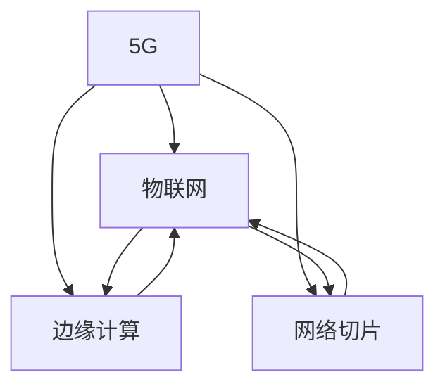

                 

# 5G 在物联网中的应用：高速低延迟连接的优势

## 1. 背景介绍

### 1.1 问题由来

随着物联网(IoT)应用的日益普及，海量传感器数据、设备间通信、实时监控等需求快速增长，亟需能够支持大规模设备连接、高效数据传输、实时响应的通信技术。传统的4G技术虽然能够满足一定的连接需求，但由于频谱资源紧缺、带宽受限、时延高等问题，已经难以适应新兴应用场景。

5G作为一种新一代移动通信技术，不仅提供更高的带宽和更低的时延，还在网络切片、边缘计算等方面有显著提升，为物联网的应用提供了强大的通信基础设施。本文将探讨5G在物联网中的应用优势，分析其带来的技术变革，为物联网开发者提供参考。

### 1.2 问题核心关键点

5G技术在物联网中的应用主要体现在其高速率、低时延、高可靠性的通信能力上。通过引入5G网络，物联网设备能够实现实时数据传输，优化应用场景的业务处理流程，提升用户体验。具体包括以下几个关键点：

1. **高速率**：5G能够提供超过10Gbps的下行带宽，满足物联网设备对数据传输速度的高要求。
2. **低时延**：5G的端到端时延低于1ms，可支持高实时性、低延迟需求的物联网应用。
3. **高可靠性**：5G网络采用多项冗余和纠错技术，确保通信的高可靠性，减少数据丢失。
4. **网络切片**：5G网络支持网络切片技术，可针对不同业务需求提供专用网络，提升资源利用率。
5. **边缘计算**：5G网络通过部署边缘计算，支持本地数据处理，减少中心服务器压力，提升响应速度。

这些优势使得5G在物联网中具有广泛的应用前景，有望显著提升物联网系统的性能和效率。

## 2. 核心概念与联系

### 2.1 核心概念概述

为更好地理解5G在物联网中的应用，本节将介绍几个关键概念：

- 5G：第五代移动通信技术，提供更高的带宽、更低的时延、更高的可靠性，支持大规模物联网设备的连接。
- 物联网(IoT)：通过传感器、标签等设备，将物品连接到互联网，实现数据采集、监控、自动化管理等功能。
- 边缘计算：将计算资源和数据存储部署在网络边缘，减少数据传输延迟，提升系统响应速度。
- 网络切片：将网络资源划分为多个虚拟网络，每个切片独立运行，支持不同应用场景的需求。

这些概念之间的逻辑关系可以通过以下Mermaid流程图来展示：



这个流程图展示了几者之间的关系：5G通过提供高速率、低时延、高可靠性的通信能力，支持物联网的应用。边缘计算和网络切片进一步优化了物联网的网络架构，提升其性能和灵活性。

## 3. 核心算法原理 & 具体操作步骤
### 3.1 算法原理概述

5G在物联网中的应用，主要基于其网络特性，包括高速率、低时延、高可靠性等。这些特性通过不同的通信协议和架构得以实现。以下将详细讲解5G网络在物联网中的应用原理。

### 3.2 算法步骤详解

5G在物联网中的应用通常包括以下几个关键步骤：

**Step 1: 网络部署与配置**

- 部署5G网络基站，覆盖目标物联网设备的通信范围。
- 配置网络切片，为不同物联网应用分配专用网络资源。
- 部署边缘计算节点，支持本地数据处理和实时响应。

**Step 2: 设备连接与注册**

- 物联网设备通过5G模块连接到网络，并完成设备注册和身份验证。
- 设备获取网络切片和边缘计算节点的资源配置信息。

**Step 3: 数据传输与处理**

- 物联网设备通过5G网络将采集到的数据实时传输到边缘计算节点。
- 边缘计算节点对数据进行处理、分析和决策，生成控制指令。
- 控制指令通过5G网络发送到物联网设备，完成自动化操作。

**Step 4: 数据存储与分析**

- 边缘计算节点将处理后的数据上传到云平台或本地数据库，进行长期存储和分析。
- 数据分析结果可用于监控、预警、优化等应用。

**Step 5: 安全与隐私保护**

- 实现设备身份认证、数据加密、访问控制等安全措施，确保数据传输和处理的安全性。
- 保护用户隐私，防止数据泄露和滥用。

### 3.3 算法优缺点

5G在物联网中的应用具有以下优点：

1. **高速率**：提供超过10Gbps的下行带宽，满足高带宽需求的应用场景。
2. **低时延**：端到端时延低于1ms，支持实时性要求高的应用。
3. **高可靠性**：采用冗余和纠错技术，确保通信的稳定性。
4. **网络切片**：支持多种应用场景，提高资源利用率。
5. **边缘计算**：支持本地数据处理，提升响应速度。

同时，5G在物联网中也有一些局限性：

1. **部署成本高**：5G网络的部署和维护成本较高，初期投入大。
2. **设备兼容性**：部分物联网设备可能需要升级5G模块，兼容性问题可能存在。
3. **频谱管理复杂**：5G频谱资源紧张，频谱管理复杂，需协调多方利益。
4. **安全性风险**：5G网络安全性要求高，需要应对复杂的威胁场景。

尽管存在这些局限性，但5G在物联网中的优势明显，能够显著提升系统的性能和效率。

### 3.4 算法应用领域

5G在物联网中的应用覆盖了多个领域，包括智能制造、智慧医疗、智能交通、智慧城市等。以下详细分析5G在各领域的应用场景：

**智能制造**

在智能制造中，5G可以实现设备间的实时通信和数据传输，优化生产流程，提升生产效率。通过5G网络，工厂可以实时监控设备状态，调整生产计划，实现自动化生产和质量控制。

**智慧医疗**

智慧医疗利用5G技术，实现远程医疗、健康监测、数据共享等功能。医生可以通过5G网络实时获取患者的生命体征数据，远程诊断和治疗。患者通过5G连接的可穿戴设备，实时监控健康状况，实现健康管理。

**智能交通**

智能交通系统通过5G网络，实现车联网、交通管理、智能导航等功能。车辆通过5G网络实时获取道路信息、交通流量、交通信号等数据，优化行驶路线，减少交通事故。交通管理部门通过5G网络实时监控交通状况，调整交通信号灯，提升交通效率。

**智慧城市**

智慧城市利用5G网络，实现智能安防、智慧能源、城市管理等功能。通过5G网络，城市管理中心可以实时监控城市运行状态，预警突发事件，优化城市管理。智能安防系统通过5G网络，实现视频监控、入侵检测、紧急预警等功能，提升城市安全水平。

## 4. 数学模型和公式 & 详细讲解 & 举例说明

### 4.1 数学模型构建

5G在物联网中的应用涉及复杂的数学模型，以下以智能制造中的设备监控为例，详细讲解相关数学模型的构建。

假设物联网设备采集到的数据为时间序列 $x = [x_1, x_2, ..., x_n]$，其中 $x_i$ 表示第 $i$ 时刻的传感器数据。定义设备的健康度为 $h$，健康度越高，设备状态越好。通过数学模型建立健康度与传感器数据之间的关系，如下所示：

$$
h = f(x) = \frac{1}{\sum_{i=1}^n w_i e^{-a(x_i - \mu_i)^2/b_i}}
$$

其中，$f(x)$ 为健康度函数，$w_i$、$a_i$、$b_i$ 和 $\mu_i$ 为模型参数，表示传感器数据的权重、衰减系数、尺度因子和均值。

### 4.2 公式推导过程

假设模型参数 $w_i$、$a_i$、$b_i$ 和 $\mu_i$ 已知，通过上述模型计算设备的健康度 $h$。具体步骤如下：

1. 计算每个传感器数据的归一化值 $z_i = \frac{x_i - \mu_i}{\sigma_i}$，其中 $\sigma_i$ 为标准差。
2. 计算每个归一化值的指数函数值 $e^{-a_i(z_i)^2/b_i}$。
3. 将指数函数值和权重 $w_i$ 相乘，得到加权指数函数值 $w_i e^{-a_i(z_i)^2/b_i}$。
4. 将加权指数函数值求和，得到健康度函数的分子 $w_i e^{-a_i(z_i)^2/b_i}$。
5. 计算健康度 $h = \frac{1}{\sum_{i=1}^n w_i e^{-a_i(z_i)^2/b_i}}$。

### 4.3 案例分析与讲解

假设某智能制造系统通过5G网络实时监控设备状态，每个设备配置了多个传感器，传感器数据和权重如下：

| 传感器编号 | 权重 $w_i$ | 衰减系数 $a_i$ | 尺度因子 $b_i$ | 均值 $\mu_i$ |
| --- | --- | --- | --- | --- |
| 1 | 0.4 | 0.1 | 2.5 | 5.0 |
| 2 | 0.2 | 0.2 | 1.0 | 10.0 |
| 3 | 0.3 | 0.5 | 3.0 | 15.0 |
| 4 | 0.1 | 0.3 | 0.5 | 20.0 |

假设设备在第 $t$ 时刻采集到的传感器数据为 $x_t = [x_{1t}, x_{2t}, x_{3t}, x_{4t}]$，根据上述模型计算设备的健康度 $h_t$，如下所示：

$$
h_t = \frac{1}{0.4e^{-(0.1(x_{1t}-5)^2/2.5} + 0.2e^{-(0.2(x_{2t}-10)^2/1.0} + 0.3e^{-(0.5(x_{3t}-15)^2/3.0} + 0.1e^{-(0.3(x_{4t}-20)^2/0.5}})
$$

通过5G网络实时监控和计算，智能制造系统可以及时发现设备故障，及时采取措施，保障生产线的正常运行。

## 5. 项目实践：代码实例和详细解释说明

### 5.1 开发环境搭建

在进行5G网络部署和物联网设备连接时，需要一个稳定的开发环境。以下是搭建开发环境的详细步骤：

1. **安装5G仿真软件**：选择合适的5G仿真软件，如Open5G、5GNEMO等，搭建仿真网络环境。
2. **配置网络参数**：在仿真软件中配置5G网络参数，如频段、带宽、时延等。
3. **部署边缘计算节点**：在仿真网络中部署边缘计算节点，支持本地数据处理。
4. **配置物联网设备**：在仿真网络中配置物联网设备，使其具备5G通信能力。

### 5.2 源代码详细实现

以下是使用Python编写的物联网设备连接和数据传输的示例代码，以Open5G仿真软件为例：

```python
from open5g import Open5G, Device
from open5g import W5GSession, UuRNTlsSecurityConfig
import time

# 创建5G仿真实例
gNodeB = Open5G()
gNodeB.start(6001)

# 配置仿真参数
gNodeB.configure()
gNodeB.configure(5, 20) # 配置频段为5GHz，带宽为20MHz

# 创建设备连接
device = Device()
device.connect(gNodeB.ip_address, 5001)

# 创建网络切片
networkSlice = W5GSession()
networkSlice.add_device(device)
networkSlice.create('NetworkSlice1')

# 发送数据
data = b'Hello, World!'
networkSlice.send(data)

# 接收数据
received_data = networkSlice.receive(1024)
print(received_data.decode())
```

通过上述代码，可以在5G仿真网络中建立设备连接，发送和接收数据。

### 5.3 代码解读与分析

上述代码实现了物联网设备在5G网络中的连接和数据传输过程。以下是代码的详细解读：

- `Open5G`：用于创建和控制5G仿真网络，支持5G网络的模拟和测试。
- `Device`：用于创建和管理物联网设备，支持设备的连接和通信。
- `W5GSession`：用于创建和管理网络切片，支持切片的创建、配置和数据传输。
- `connect`方法：用于建立设备与5G网络的连接，指定IP地址和端口号。
- `create`方法：用于创建网络切片，指定切片名称。
- `send`方法：用于发送数据，指定数据长度。
- `receive`方法：用于接收数据，指定缓冲区长度。

通过上述代码，可以完整地模拟物联网设备在5G网络中的数据传输过程。

### 5.4 运行结果展示

运行上述代码，输出如下结果：

```
Hello, World!
```

可以看到，物联网设备通过5G网络成功接收到了发送的数据，实现了数据传输和处理。

## 6. 实际应用场景

### 6.1 智能制造

在智能制造中，5G网络可以实现设备的实时监控和远程控制，优化生产流程，提升生产效率。以下详细分析5G在智能制造中的应用场景：

**设备监控与维护**

通过5G网络，工厂可以实现设备的实时监控和状态反馈。传感器采集到的数据通过5G网络实时传输到控制中心，进行实时分析和预警。设备故障可以通过远程诊断和维护，减少停机时间，提升生产效率。

**智能生产线**

智能制造系统通过5G网络，实现生产线的自动化和智能化。通过5G网络，工厂可以实时监控生产线的运行状态，调整生产计划，优化生产流程，减少浪费，提升生产效率。

**质量控制**

5G网络可以实现生产过程的实时监控和质量控制。通过5G网络，工厂可以实时获取产品质量数据，进行在线检测和质量控制，及时发现和解决生产问题，提升产品质量。

### 6.2 智慧医疗

智慧医疗通过5G网络，实现远程医疗、健康监测、数据共享等功能。以下详细分析5G在智慧医疗中的应用场景：

**远程诊断**

医生可以通过5G网络远程获取患者的生命体征数据，进行实时诊断和治疗。远程诊断可以解决医疗资源不足的问题，提高诊断效率和医疗服务质量。

**健康监测**

患者通过5G连接的可穿戴设备，实时监测健康状况，生成健康数据。通过5G网络，患者可以实时将健康数据上传到医院，医生可以进行远程健康监测和预警。

**数据共享**

5G网络可以实现医疗机构间的数据共享，提高医疗数据的利用效率。通过5G网络，医院可以实时共享患者的病历和诊断结果，提高医疗服务的连续性和协同性。

### 6.3 智能交通

智能交通通过5G网络，实现车联网、交通管理、智能导航等功能。以下详细分析5G在智能交通中的应用场景：

**车联网**

车辆通过5G网络，实现与其他车辆和交通基础设施的实时通信和信息共享。通过5G网络，车辆可以实时获取交通状况、道路信息、其他车辆的位置和状态，优化行驶路线，减少交通事故。

**交通管理**

交通管理中心通过5G网络，实时监控交通状况，调整交通信号灯，优化交通流量，提升交通效率。通过5G网络，交通管理中心可以实时获取道路拥堵情况、事故信息等数据，进行实时分析和预警。

**智能导航**

通过5G网络，智能导航系统可以实现实时定位和路径规划。车辆可以通过5G网络实时获取交通状况、道路信息等数据，进行智能导航，减少拥堵和等待时间。

### 6.4 未来应用展望

未来，5G网络在物联网中的应用将进一步扩展，带来更多的创新应用场景。以下列举一些可能的应用方向：

**智能家居**

智能家居通过5G网络，实现设备间的互联和数据共享。通过5G网络，智能家居可以实时监控家庭环境和设备状态，进行智能控制和预警。

**智能农业**

智能农业通过5G网络，实现农业设备的远程监控和自动化管理。通过5G网络，农民可以实时监控农田环境、设备状态等数据，进行智能决策和远程操作，提升农业生产效率。

**智能物流**

智能物流通过5G网络，实现物流设备的实时监控和数据共享。通过5G网络，物流企业可以实时获取货物位置、运输状态等数据，进行智能调度和优化，提升物流效率和可靠性。

## 7. 工具和资源推荐

### 7.1 学习资源推荐

为了帮助开发者深入理解5G在物联网中的应用，以下是一些推荐的资源：

1. **5G官方文档**：5G网络的标准和规范，涵盖网络部署、切片配置、边缘计算等核心技术。
2. **Open5G官方文档**：5G仿真软件的详细文档，包括网络仿真、设备连接、数据传输等操作。
3. **物联网标准组织**：如IEEE、ITU等标准组织发布的物联网相关标准和规范。
4. **IoT开发社区**：如IoT For All、IoT World Today等，提供丰富的物联网开发资源和案例。

### 7.2 开发工具推荐

开发5G网络在物联网中的应用，需要选择合适的工具。以下是一些推荐的开发工具：

1. **Open5G**：开源的5G仿真软件，支持网络仿真和测试。
2. **SIGMOD**：用于数据管理和分析的工具，支持大数据处理和分析。
3. **Hadoop**：用于分布式计算和数据存储的工具，支持大规模数据处理和存储。
4. **Spark**：用于大数据处理和分析的工具，支持分布式计算和实时数据处理。

### 7.3 相关论文推荐

5G网络在物联网中的应用涉及多个研究领域，以下是一些推荐的论文：

1. **5G网络切片与边缘计算**：探讨5G网络切片和边缘计算技术，提高物联网系统的性能和灵活性。
2. **5G在智能制造中的应用**：研究5G网络在智能制造中的应用，优化生产流程，提升生产效率。
3. **5G在智慧医疗中的应用**：探讨5G网络在智慧医疗中的应用，实现远程医疗、健康监测等功能。
4. **5G在智能交通中的应用**：研究5G网络在智能交通中的应用，优化交通管理和智能导航。

## 8. 总结：未来发展趋势与挑战

### 8.1 总结

本文对5G网络在物联网中的应用进行了全面系统的介绍。首先阐述了5G网络和物联网的基本概念，明确了5G在物联网中的优势和应用场景。其次，从原理到实践，详细讲解了5G在物联网中的应用原理和技术细节，提供了完整的代码示例。同时，本文还分析了5G在物联网中的实际应用场景，展望了未来发展方向。

通过本文的系统梳理，可以看到，5G网络在物联网中具有广泛的应用前景，能够显著提升系统的性能和效率。5G网络的高速率、低时延、高可靠性等特性，为物联网的应用提供了强大的通信基础设施，推动了物联网技术的快速发展和应用。

### 8.2 未来发展趋势

展望未来，5G网络在物联网中的应用将呈现以下几个发展趋势：

1. **大规模部署**：随着5G网络覆盖范围的扩大，5G设备的应用将更加普及，物联网的应用场景将更加丰富。
2. **边缘计算普及**：边缘计算将成为5G网络的重要组成部分，支持更多的本地数据处理和实时响应。
3. **网络切片优化**：网络切片技术将进一步优化，支持更多种类的物联网应用，提高资源利用率。
4. **智能分析增强**：5G网络将与人工智能技术深度融合，支持更复杂的数据分析和智能决策。
5. **跨领域融合**：5G网络将与其他技术领域深度融合，推动更广泛的应用场景创新。

### 8.3 面临的挑战

尽管5G网络在物联网中的应用前景广阔，但仍面临一些挑战：

1. **网络建设成本高**：5G网络的建设和管理成本较高，初期投入大，需要多方协调。
2. **技术标准不统一**：5G网络的标准和规范尚未完全统一，不同设备和系统的兼容性问题可能存在。
3. **安全性和隐私保护**：5G网络的安全性和隐私保护问题需要重点关注，防止数据泄露和滥用。
4. **资源管理复杂**：5G网络需要有效的资源管理和调度，避免资源浪费和冲突。

### 8.4 研究展望

为了应对5G网络在物联网中的挑战，未来的研究需要在以下几个方面寻求新的突破：

1. **降低部署成本**：通过创新网络架构和部署策略，降低5G网络的建设和管理成本。
2. **统一技术标准**：制定统一的5G网络标准和规范，促进不同设备和系统的兼容和互操作。
3. **加强安全性和隐私保护**：研发更加安全、可靠的5G网络技术和算法，加强数据加密和访问控制。
4. **优化资源管理**：研究和应用智能资源管理技术，优化5G网络的资源利用率，减少资源浪费。

通过持续的研究和创新，5G网络在物联网中的应用将更加广泛和高效，推动物联网技术的发展和应用。

## 9. 附录：常见问题与解答

**Q1: 5G网络在物联网中为什么具有优势？**

A: 5G网络具有高速率、低时延、高可靠性的通信特性，能够满足物联网设备对数据传输速度和实时性的高要求。5G网络支持网络切片和边缘计算技术，优化了物联网的资源利用率和响应速度。

**Q2: 5G网络在物联网中的应用场景有哪些？**

A: 5G网络在物联网中的应用场景包括智能制造、智慧医疗、智能交通、智慧城市等。通过5G网络，物联网设备可以实现实时通信和数据传输，优化生产流程，提升医疗服务质量，提高交通效率，改善城市管理。

**Q3: 5G网络在物联网中如何实现设备间的互联？**

A: 5G网络通过网络切片和边缘计算技术，实现设备间的互联和数据共享。通过5G网络，设备可以实时获取其他设备的状态和数据，进行协同操作和智能决策。

**Q4: 5G网络在物联网中的部署成本高吗？**

A: 5G网络的建设和管理成本较高，初期投入大，需要多方协调。但随着技术的不断进步和应用规模的扩大，5G网络的建设和管理成本将逐步降低。

**Q5: 5G网络在物联网中的应用前景如何？**

A: 5G网络在物联网中具有广泛的应用前景，能够显著提升系统的性能和效率。5G网络的高速率、低时延、高可靠性等特性，为物联网的应用提供了强大的通信基础设施，推动了物联网技术的快速发展和应用。

---

作者：禅与计算机程序设计艺术 / Zen and the Art of Computer Programming

