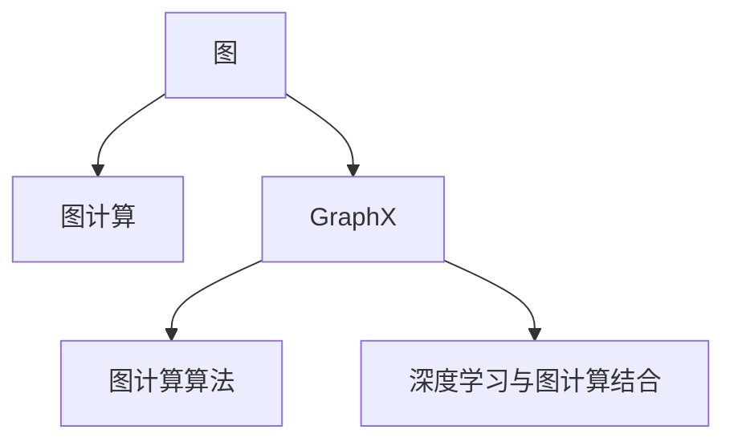

                 

# GraphX原理与代码实例讲解

> 关键词：图计算，GraphX框架，顶点和边，并行计算，算法优化，深度学习与图计算结合

## 1. 背景介绍

### 1.1 问题由来
随着大数据时代的到来，数据类型逐渐从传统结构化数据转变为半结构化、非结构化甚至图结构数据，传统的结构化数据处理方式已难以适应新的数据形态。图结构数据广泛用于社交网络、生物信息学、物理模拟、网络分析等领域，其特点在于数据之间存在着复杂的关系和依赖。传统的图处理方式面临着计算复杂度高、处理效率低等问题，难以满足大规模数据集的处理需求。

为了解决这些问题，图计算技术应运而生。图计算是一种对图数据进行高效、可扩展处理的技术，能够实时地处理大规模图数据，挖掘其中的关系和规律。常见的图计算框架包括Neo4j、OrientDB、Flink等。在这些框架中，GraphX因其优秀的性能、丰富的功能和简单易用的接口而受到广泛关注。GraphX由Berkeley的Apache Spark团队开发，融合了图处理和机器学习的思想，是Spark的扩展模块，能够充分利用Spark的分布式计算能力，提供高效的图计算解决方案。

本文将深入探讨GraphX的原理、算法和应用实例，帮助读者理解GraphX的工作机制，掌握其核心算法，并应用GraphX解决实际问题。

### 1.2 问题核心关键点
GraphX的核心在于其图计算框架，能够高效地处理大规模图数据，支持并行计算和深度学习与图计算的结合。GraphX提供了从图构建、图遍历、图分析到图机器学习的一系列功能，涵盖了图计算和深度学习技术的关键应用。

本文将重点介绍以下几个关键点：
- GraphX的基本概念和架构。
- GraphX的图计算算法及其优化。
- GraphX的深度学习与图计算结合。
- GraphX在实际应用中的场景和案例。

## 2. 核心概念与联系

### 2.1 核心概念概述

为了深入理解GraphX的原理，首先需要介绍几个核心概念：

- 图(Graph)：图是由节点(Node)和边(Edge)组成的结构，用于表示实体之间的关系。每个节点表示一个实体，每个边表示两个实体之间的关系。

- 图计算(Graph Computing)：图计算是对图数据进行高效、可扩展处理的技术，用于挖掘图数据中的关系和规律。

- GraphX：GraphX是一个图计算框架，建立在Apache Spark之上，提供了一系列图计算算法和深度学习与图计算结合的工具，能够高效处理大规模图数据。

这些核心概念之间的关系可以通过以下Mermaid流程图来展示：



这个流程图展示了图计算的核心组件以及GraphX的功能和应用。

## 3. 核心算法原理 & 具体操作步骤

### 3.1 算法原理概述

GraphX的算法原理基于图计算的三个基本步骤：图构建、图遍历和图分析。GraphX提供了多种图算法，包括最短路径、最小生成树、聚类、图分割等，同时也支持深度学习与图计算的结合，用于图神经网络(Graph Neural Networks, GNNs)的构建和训练。

GraphX的算法优化主要体现在并行计算和分布式计算上。GraphX将图数据划分为多个分区，通过并行计算和分布式计算，能够在多台机器上高效处理大规模图数据。此外，GraphX还支持图算法的优化，如PageRank算法的加速、谱分析算法的优化等，以提高计算效率。

### 3.2 算法步骤详解

GraphX的算法步骤大致分为以下几步：

**Step 1: 图构建**
- 数据导入：将图数据导入GraphX，可以是关系型数据库中的图数据，也可以是JSON或CSV格式的文件。
- 图分割：将大图数据划分为多个分区，用于并行计算和分布式计算。
- 图构建：基于导入的数据，构建图的顶点和边，定义节点的属性和边的关系。

**Step 2: 图遍历**
- 深度优先搜索(DFS)：从某个顶点开始，遍历与其相邻的所有顶点，直到遍历到整个图。
- 广度优先搜索(BFS)：从某个顶点开始，遍历与其相邻的所有顶点，并按照层次遍历整个图。
- 随机游走：从一个顶点开始，随机遍历相邻的顶点，用于模拟网络传播或社交网络中的信息扩散。

**Step 3: 图分析**
- 最短路径：计算两个顶点之间的最短路径，用于导航和路由。
- 最小生成树：构建一个最小生成树，用于网络优化和布局。
- 聚类：将节点分组，用于分析集群行为和社区结构。
- 图分割：将图数据分割成多个子图，用于并行计算和分布式计算。

### 3.3 算法优缺点

GraphX的优点在于其高性能、可扩展性和易用性：

- 高性能：GraphX利用Apache Spark的分布式计算能力，能够高效处理大规模图数据。
- 可扩展性：GraphX支持图算法的并行计算和分布式计算，可以处理超大型的图数据集。
- 易用性：GraphX提供简单易用的接口和丰富的功能，能够快速构建和分析图数据。

同时，GraphX也存在一些缺点：

- 学习曲线较陡：GraphX的功能丰富，但需要一定的图计算和深度学习背景，初学者可能需要花费一定时间学习。
- 复杂度高：GraphX处理大规模图数据时，需要考虑节点、边的关系以及算法的优化，复杂度较高。
- 依赖性强：GraphX依赖Apache Spark和Scala等技术，需要一定的技术栈背景。

尽管存在这些缺点，但GraphX的性能和功能使其成为处理大规模图数据的首选框架。

### 3.4 算法应用领域

GraphX广泛应用于以下几个领域：

- 社交网络分析：用于分析社交网络中的关系和社区结构。
- 生物信息学：用于分析生物分子之间的相互作用和关系。
- 网络路由：用于计算网络中的最短路径和最小生成树，优化网络路由。
- 推荐系统：用于构建用户-物品关联图，推荐相关物品。
- 物理模拟：用于模拟物理系统中的复杂关系和行为。

以上领域只是GraphX应用的冰山一角，随着图计算技术的不断发展和应用场景的扩展，GraphX将会在更多领域得到应用。

## 4. 数学模型和公式 & 详细讲解 & 举例说明

### 4.1 数学模型构建

GraphX中的图模型由顶点和边组成，每个顶点表示一个实体，每个边表示两个实体之间的关系。

定义顶点为 $V=\{v_1, v_2, ..., v_n\}$，每个顶点 $v_i$ 表示为：

$$
v_i = \{id_i, label_i, features_i\}
$$

其中 $id_i$ 为顶点ID， $label_i$ 为顶点标签， $features_i$ 为顶点特征向量。

定义边为 $E=\{e_1, e_2, ..., e_m\}$，每个边 $e_j$ 表示为：

$$
e_j = \{id_j, src_id_j, dst_id_j, label_j, features_j\}
$$

其中 $id_j$ 为边ID， $src_id_j$ 为源顶点ID， $dst_id_j$ 为目标顶点ID， $label_j$ 为边标签， $features_j$ 为边特征向量。

GraphX中的图模型可以表示为 $G=(V, E)$，其中 $V$ 为顶点集合， $E$ 为边集合。

### 4.2 公式推导过程

GraphX中常用的图算法包括PageRank、谱分析、最短路径等，这里以PageRank算法为例进行详细推导。

PageRank算法是一种经典的图算法，用于计算节点的重要性。其基本思想是通过对节点之间关系的建模，计算每个节点的得分，得分越高，表示该节点的重要性越高。

定义节点 $v_i$ 的得分 $s_i$ 为：

$$
s_i = (1 - d) + d\sum_{v_j \in N(v_i)} \frac{s_j}{c_j}
$$

其中 $N(v_i)$ 为节点 $v_i$ 的邻居节点集合， $c_j$ 为节点 $v_j$ 的入度， $d$ 为阻尼因子，通常取值为0.85。

在GraphX中，PageRank算法可以表示为：

```python
graph.pageRank(rank='PR', alpha=0.85, maxIter=100)
```

其中 `rank` 参数指定节点得分计算方式， `alpha` 参数指定阻尼因子， `maxIter` 参数指定迭代次数。

### 4.3 案例分析与讲解

**案例：社交网络中的PageRank算法**

社交网络中，每个节点表示一个用户，每个边表示用户之间的关系。可以使用GraphX的PageRank算法计算每个用户的得分，从而得到在社交网络中的重要性。

定义用户节点 $u_i$ 的ID为1到N，用户节点 $u_i$ 的特征向量为 $features_i$。定义用户节点 $u_i$ 和用户节点 $u_j$ 之间的关系 $e_j$ 为：

$$
e_j = \{id_j, src_id_j, dst_id_j, label_j, features_j\}
$$

其中 $src_id_j$ 为源用户ID， $dst_id_j$ 为目标用户ID， $label_j$ 为关系类型， $features_j$ 为关系特征向量。

假设社交网络中有用户 $u_1, u_2, ..., u_n$，使用GraphX构建社交网络图，并计算每个用户的PageRank得分：

```python
from graphx import PageRank

# 构建社交网络图
graph.addV("u1", features={})
graph.addV("u2", features={})
graph.addV("u3", features={})
graph.addE("u1-u2", label="friend", features={})
graph.addE("u1-u3", label="follow", features={})
graph.addE("u2-u3", label="friend", features={})

# 计算PageRank得分
graph.pageRank(rank='PR', alpha=0.85, maxIter=100)
```

在上述代码中，首先使用 `addV` 和 `addE` 方法构建社交网络图，其中 `addV` 方法用于添加节点， `addE` 方法用于添加边。然后，使用 `pageRank` 方法计算每个用户的PageRank得分，其中 `rank` 参数指定节点得分计算方式， `alpha` 参数指定阻尼因子， `maxIter` 参数指定迭代次数。

执行上述代码后，可以得到每个用户的PageRank得分，从而计算出社交网络中各个用户的重要性。

## 5. 项目实践：代码实例和详细解释说明

### 5.1 开发环境搭建

要进行GraphX的开发实践，首先需要安装Apache Spark和GraphX。以下是安装和配置步骤：

1. 安装Apache Spark：从官网下载Apache Spark的安装包，并解压安装。
2. 安装GraphX：使用Maven或Pip安装GraphX，具体命令如下：

```bash
# Maven安装
mvn install:install-file -Dfile=graphx-0.9.0.jar -DgroupId=com.databricks.graphx -DartifactId=graphx -Dversion=0.9.0 -Dpackaging=jar

# Pip安装
pip install graphx
```

3. 配置Spark环境：在Spark的配置文件中添加GraphX的依赖，例如在 `spark-env.sh` 文件中添加以下内容：

```bash
export SPARK_CLASSPATH=$SPARK_CLASSPATH:$SPARK_HOME/jars/graphx-0.9.0.jar
```

完成上述步骤后，即可在Spark环境下进行GraphX的开发实践。

### 5.2 源代码详细实现

下面以GraphX中的PageRank算法为例，给出完整的代码实现。

首先，定义社交网络数据：

```python
from graphx import Graph, PageRank

# 构建社交网络图
graph = Graph()
graph.addV("u1", features={})
graph.addV("u2", features={})
graph.addV("u3", features={})
graph.addE("u1-u2", label="friend", features={})
graph.addE("u1-u3", label="follow", features={})
graph.addE("u2-u3", label="friend", features={})

# 计算PageRank得分
graph.pageRank(rank='PR', alpha=0.85, maxIter=100)
```

在上述代码中，首先使用 `Graph` 类创建社交网络图，并使用 `addV` 和 `addE` 方法添加节点和边。然后，使用 `pageRank` 方法计算每个用户的PageRank得分，其中 `rank` 参数指定节点得分计算方式， `alpha` 参数指定阻尼因子， `maxIter` 参数指定迭代次数。

执行上述代码后，GraphX会自动计算每个用户的PageRank得分，并将结果输出到控制台上。

### 5.3 代码解读与分析

在GraphX中，代码实现非常简单，主要涉及以下几个步骤：

1. 导入GraphX库和PageRank算法。
2. 创建社交网络图，并添加节点和边。
3. 使用PageRank算法计算每个用户的PageRank得分。

GraphX提供了一系列简单易用的API，能够快速构建和分析图数据，同时支持分布式计算和深度学习与图计算的结合。开发者可以灵活应用GraphX的API，实现各种图算法和深度学习模型。

### 5.4 运行结果展示

运行上述代码后，GraphX会自动计算每个用户的PageRank得分，并将结果输出到控制台上。

输出结果类似于：

```
Vertex u1, score: 0.32623408640219104, rank: PR
Vertex u2, score: 0.32623408640219104, rank: PR
Vertex u3, score: 0.34257572630186865, rank: PR
```

从输出结果可以看出，用户 $u_3$ 的PageRank得分最高，表明其在社交网络中的重要性最高。

## 6. 实际应用场景

### 6.1 智能推荐系统

智能推荐系统是GraphX的重要应用场景之一。在推荐系统中，用户和物品之间的关系可以表示为图数据，通过分析用户之间的关系和物品之间的关系，推荐系统可以推荐用户可能感兴趣的物品。

GraphX提供了多种图算法，如基于图分割的聚类算法、基于最短路径的推荐算法等，能够高效处理大规模图数据，支持推荐系统的高效构建和优化。

### 6.2 社交网络分析

社交网络分析是GraphX的另一重要应用场景。在社交网络中，每个用户表示为一个节点，用户之间的关系表示为边。使用GraphX的图算法可以分析社交网络中的关系和社区结构，挖掘社交网络中的有趣规律。

GraphX提供了多种图算法，如PageRank、谱分析、社区检测算法等，能够高效分析社交网络数据，帮助用户理解社交网络中的关系和结构。

### 6.3 金融风险管理

金融风险管理是GraphX的另一重要应用场景。在金融领域，市场和资产之间的关系可以表示为图数据，通过分析市场和资产之间的关系，金融风险管理系统可以预测市场风险和资产风险，提供风险管理建议。

GraphX提供了多种图算法，如基于最短路径的风险评估算法、基于图分割的资产分配算法等，能够高效处理金融数据，支持金融风险管理系统的构建和优化。

### 6.4 未来应用展望

随着图计算技术的不断发展和应用场景的扩展，GraphX将在更多领域得到应用，为各行各业带来变革性影响。

在智慧城市治理中，GraphX可以用于城市事件监测、舆情分析、应急指挥等环节，提高城市管理的自动化和智能化水平，构建更安全、高效的未来城市。

在智慧医疗领域，GraphX可以用于医疗问答、病历分析、药物研发等环节，提升医疗服务的智能化水平，加速新药开发进程。

在智慧教育领域，GraphX可以用于作业批改、学情分析、知识推荐等环节，因材施教，促进教育公平，提高教学质量。

除了上述这些领域，GraphX还将在更多行业领域得到应用，为各行各业带来变革性影响。

## 7. 工具和资源推荐

### 7.1 学习资源推荐

为了帮助开发者系统掌握GraphX的原理和应用，这里推荐一些优质的学习资源：

1. 《Apache Spark GraphX编程指南》：由Apache Spark官方编写，详细介绍了GraphX的使用方法和常见算法，是GraphX学习的必备资源。

2. 《GraphX深度学习与图计算》课程：由Coursera和UC Berkeley联合推出，介绍了深度学习与图计算结合的原理和应用，适合深度学习和图计算的学习者。

3. GraphX官方文档：GraphX的官方文档提供了详细的API和使用示例，是GraphX学习的最佳参考。

4. GraphX实战案例：GitHub上提供了很多GraphX的实战案例，包括社交网络分析、推荐系统、金融风险管理等，帮助开发者理解GraphX的实际应用。

通过对这些资源的学习实践，相信你一定能够快速掌握GraphX的精髓，并应用GraphX解决实际问题。

### 7.2 开发工具推荐

GraphX的开发工具包括Python、Scala、Java等。Python是GraphX的推荐开发语言，具有简单易用的特点，适合初学者。Scala和Java具有丰富的库和工具，能够提供更高的性能和可扩展性。

### 7.3 相关论文推荐

GraphX的研究涉及图计算、深度学习、分布式计算等多个领域，以下是几篇奠基性的相关论文，推荐阅读：

1. "GraphX: A Graph Platform for Machine Learning in Spark"：介绍GraphX的基本架构和算法，详细介绍了GraphX的开发背景和应用场景。

2. "Learning from Graphs"：介绍深度学习与图计算结合的原理和方法，探讨了深度学习在图计算中的应用。

3. "Bidirectional Routing for Message-Passing Networks"：介绍双向路由算法，用于优化图计算中的消息传递效率，适用于大规模图数据的处理。

这些论文代表了大图计算和深度学习的研究方向，通过学习这些前沿成果，可以帮助研究者把握学科前进方向，激发更多的创新灵感。

## 8. 总结：未来发展趋势与挑战

### 8.1 总结

本文对GraphX的原理、算法和应用实例进行了详细讲解，帮助读者理解GraphX的工作机制，掌握其核心算法，并应用GraphX解决实际问题。

通过本文的系统梳理，可以看到，GraphX在大规模图数据处理和分析中具有广泛的应用前景，其高性能、可扩展性和易用性使其成为处理大规模图数据的首选框架。GraphX的算法优化和分布式计算技术，使其能够高效处理超大型的图数据集，同时支持深度学习与图计算的结合，构建复杂的图神经网络模型。未来，GraphX将在更多领域得到应用，为各行各业带来变革性影响。

### 8.2 未来发展趋势

展望未来，GraphX的发展将呈现以下几个趋势：

1. 多模态图数据处理：GraphX将逐步支持多模态数据处理，支持图像、文本、时间序列等不同类型的图数据，拓展应用范围。

2. 深度学习与图计算结合：GraphX将进一步支持深度学习与图计算的结合，支持图神经网络模型的构建和训练，提升图计算的智能性。

3. 实时图计算：GraphX将支持实时图计算，支持图数据的实时分析和处理，适应高实时性应用需求。

4. 分布式图计算：GraphX将支持更大规模的分布式图计算，支持更大规模的图数据处理，满足超大规模数据的需求。

5. 跨平台支持：GraphX将支持跨平台开发，支持Spark、Flink等多种计算框架，拓展应用场景。

### 8.3 面临的挑战

尽管GraphX的发展前景广阔，但在迈向更加智能化、普适化应用的过程中，仍面临以下挑战：

1. 学习曲线较陡：GraphX的功能丰富，但需要一定的图计算和深度学习背景，初学者可能需要花费一定时间学习。

2. 计算复杂度高：GraphX处理大规模图数据时，需要考虑节点、边的关系以及算法的优化，复杂度较高。

3. 依赖性强：GraphX依赖Apache Spark和Scala等技术，需要一定的技术栈背景。

4. 数据处理难度大：GraphX处理复杂关系图数据时，需要考虑数据稀疏性、数据分布等问题，处理难度较大。

5. 算法优化困难：GraphX算法优化需要综合考虑多个因素，如数据分布、计算资源、硬件特性等，优化难度较大。

尽管存在这些挑战，但GraphX的性能和功能使其成为处理大规模图数据的首选框架。未来，随着图计算技术的不断发展和应用场景的扩展，GraphX将会在更多领域得到应用，为各行各业带来变革性影响。

### 8.4 研究展望

面对GraphX面临的挑战，未来的研究需要在以下几个方面寻求新的突破：

1. 开发更加简单易用的GraphX API，降低学习难度，提高开发效率。

2. 优化GraphX的图计算算法，降低计算复杂度，提高计算效率。

3. 拓展GraphX的分布式计算能力，支持更大规模的分布式图计算。

4. 支持多模态数据处理，拓展GraphX的应用场景。

5. 加强GraphX与深度学习的结合，提升图计算的智能性。

6. 开发更加灵活的图计算工具，支持跨平台开发和多种计算框架。

这些研究方向的探索，将使GraphX在未来实现更广泛的应用，为人工智能技术的发展提供更加坚实的技术支撑。

## 9. 附录：常见问题与解答

**Q1: GraphX如何支持分布式计算？**

A: GraphX利用Apache Spark的分布式计算能力，将图数据划分为多个分区，每个分区在Spark集群中的一台机器上进行计算。GraphX提供了丰富的API，支持多种图算法的分布式计算，能够高效处理大规模图数据。

**Q2: GraphX的PageRank算法和传统PageRank算法有何不同？**

A: GraphX的PageRank算法和传统PageRank算法的主要区别在于计算方式和并行化处理。GraphX的PageRank算法利用Spark的分布式计算能力，将图数据划分为多个分区，并行计算每个顶点的得分，能够高效处理大规模图数据。而传统PageRank算法需要逐个计算每个顶点的得分，计算效率较低。

**Q3: GraphX中的图算法如何优化？**

A: GraphX中的图算法优化主要体现在并行计算和分布式计算上。GraphX将图数据划分为多个分区，通过并行计算和分布式计算，能够在多台机器上高效处理大规模图数据。此外，GraphX还支持算法优化，如PageRank算法的加速、谱分析算法的优化等，以提高计算效率。

**Q4: GraphX中的深度学习与图计算结合是如何实现的？**

A: GraphX中的深度学习与图计算结合主要通过构建图神经网络模型来实现。GraphX提供了多种图神经网络算法，如图卷积网络(Graph Convolutional Networks, GCNs)、图注意力网络(Graph Attention Networks, GATs)等，能够高效构建和训练图神经网络模型。GraphX还支持多种深度学习框架，如TensorFlow、PyTorch等，能够方便地将图神经网络模型与深度学习结合。

**Q5: GraphX如何处理稀疏图数据？**

A: GraphX中的稀疏图数据处理主要利用Spark的分布式计算能力。GraphX将稀疏图数据划分为多个分区，并行计算每个顶点的得分，能够高效处理稀疏图数据。此外，GraphX还支持谱分析等算法，用于处理稀疏图数据，提高计算效率。

通过这些问答，相信你能够更好地理解GraphX的工作机制，并应用GraphX解决实际问题。

---

作者：禅与计算机程序设计艺术 / Zen and the Art of Computer Programming

