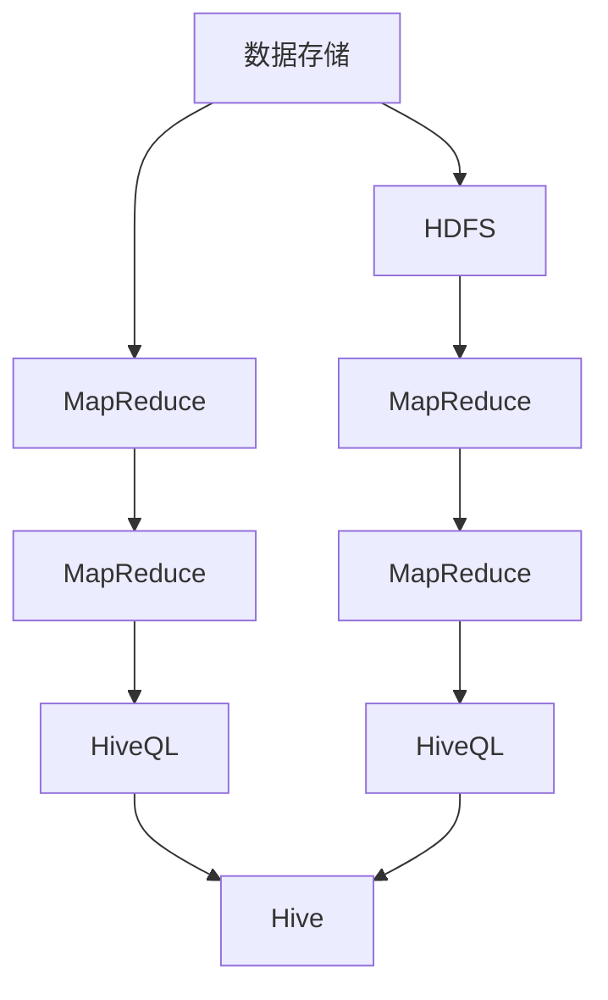

                 

# Hive原理与代码实例讲解

> 关键词：Hive, 数据仓库, 分布式存储, 列存储, MapReduce, Hadoop

## 1. 背景介绍

### 1.1 问题由来

随着大数据时代的到来，企业对于数据存储和处理的需求日益增长。传统的集中式数据库无法应对大规模数据存储和复杂的数据查询需求。为了解决这一问题，人们提出了分布式存储和处理架构，如Google的BigTable、Amazon的Redshift等。其中，Hive作为Apache软件基金会（Apache Software Foundation）下的一个开源数据仓库项目，受到了广泛关注和应用。

Hive采用类SQL语言进行数据查询，支持基于标准的SQL方言，使得用户能够使用熟悉的SQL语法，方便地进行复杂的数据处理和分析。同时，Hive基于Hadoop平台进行分布式存储和处理，具备强大的数据扩展能力和高可用性。本文将全面讲解Hive的原理和实现，并给出代码实例，帮助读者深入理解Hive的核心技术。

### 1.2 问题核心关键点

Hive的核心设计理念包括以下几个方面：

- 列存储：将数据按照列存储，而非按照行存储，极大地提高了数据查询和写入的效率。
- 分布式存储：基于Hadoop的分布式文件系统（HDFS）进行数据存储，支持大规模数据的分布式存储和处理。
- 映射-归约（MapReduce）：利用MapReduce编程模型进行数据处理，支持并行化计算，提高处理速度。
- 数据仓库功能：支持复杂的数据查询和分析，具备数据仓库的功能，方便数据处理和分析。

这些关键点共同构成了Hive的核心架构和技术实现。通过理解这些关键点，我们能够更好地把握Hive的工作原理和应用场景。

## 2. 核心概念与联系

### 2.1 核心概念概述

Hive是一个基于Hadoop的数据仓库系统，支持使用SQL语言进行数据查询和处理。其主要包括以下几个关键组件：

- Hadoop：Hive的底层平台，提供分布式存储和计算能力。
- HDFS：Hadoop的分布式文件系统，用于存储数据。
- MapReduce：Hive的数据处理引擎，用于并行计算。
- HiveQL：Hive的类SQL查询语言，支持复杂的数据查询和分析。

### 2.2 核心概念原理和架构的 Mermaid 流程图(Mermaid 流程节点中不要有括号、逗号等特殊字符)



这个流程图展示了Hive的核心组件和工作流程：

1. 数据存储在HDFS中。
2. 数据通过MapReduce进行处理。
3. 数据处理结果通过MapReduce发送给Hive。
4. Hive将处理结果转化为HiveQL查询结果。
5. 用户通过HiveQL查询数据。

这些组件和流程共同构成了Hive的架构和实现机制。

## 3. 核心算法原理 & 具体操作步骤

### 3.1 算法原理概述

Hive的核心算法包括列存储和分布式存储两个方面。列存储通过将数据按照列进行组织，极大地提高了数据查询和写入的效率。分布式存储通过利用Hadoop的分布式文件系统（HDFS），支持大规模数据的分布式存储和处理。

### 3.2 算法步骤详解

#### 3.2.1 列存储原理

列存储的原理是将数据按照列进行组织，而非按照行进行组织。列存储将每一列的数据存储在单独的文件中，可以有效地减少磁盘I/O操作，提高数据查询和写入的效率。列存储的实现主要依赖于Hive的存储管理器（Storage Manager）。

#### 3.2.2 分布式存储原理

分布式存储的原理是通过利用Hadoop的分布式文件系统（HDFS）进行数据存储。HDFS将数据分散存储在多个节点上，每个节点存储数据的一个片段，通过分布式计算，可以有效地处理大规模数据。

#### 3.2.3 MapReduce原理

MapReduce是Hive的核心算法之一，用于进行数据处理。MapReduce将数据处理任务分解为多个小的子任务，每个子任务在一个节点上执行，最终将所有子任务的结果进行合并，得到最终的处理结果。MapReduce的实现主要依赖于Hadoop的MapReduce框架。

### 3.3 算法优缺点

#### 3.3.1 优点

- 列存储和分布式存储使得Hive能够高效地处理大规模数据，支持高吞吐量的数据处理。
- 基于MapReduce的计算模型，使得Hive能够并行化计算，提高数据处理速度。
- 使用SQL语言进行查询，方便用户进行复杂的数据查询和分析。

#### 3.3.2 缺点

- 列存储对数据的插入和更新操作效率较低。
- 分布式存储和MapReduce计算模型对硬件资源要求较高。
- 数据查询和分析的实时性较弱，延迟较高。

### 3.4 算法应用领域

Hive主要用于以下领域：

- 数据仓库：Hive支持复杂的数据查询和分析，是企业级数据仓库的理想选择。
- 大数据处理：Hive可以高效地处理大规模数据，支持数据仓库和大数据处理的场景。
- 数据预处理：Hive支持数据清洗、数据转换等数据预处理任务，方便数据后续处理。

## 4. 数学模型和公式 & 详细讲解 & 举例说明（备注：数学公式请使用latex格式，latex嵌入文中独立段落使用 $$，段落内使用 $)
### 4.1 数学模型构建

Hive的数学模型主要涉及列存储和分布式存储两个方面。列存储的数学模型可以表示为：

$$
\text{列存储} = \{ \text{列数据文件} \} \quad \text{其中} \quad \text{列数据文件} = \{ \text{列数据} \} \text{,} \quad \text{列数据} = \{ \text{数据行} \}
$$

分布式存储的数学模型可以表示为：

$$
\text{分布式存储} = \{ \text{数据块} \} \quad \text{其中} \quad \text{数据块} = \{ \text{数据节点} \} \text{,} \quad \text{数据节点} = \{ \text{数据块} \}
$$

### 4.2 公式推导过程

#### 4.2.1 列存储的推导过程

列存储的推导过程可以表示为：

$$
\text{列数据文件} = \text{列数据} \quad \text{其中} \quad \text{列数据} = \text{数据行} \times \text{数据列}
$$

在Hive中，每个列数据文件存储一个数据列，通过将这些文件按照数据列组织，可以高效地进行数据查询和写入。

#### 4.2.2 分布式存储的推导过程

分布式存储的推导过程可以表示为：

$$
\text{数据节点} = \text{数据块} \times \text{数据节点} \text{,} \quad \text{数据块} = \text{数据行} \times \text{数据列}
$$

在Hive中，每个数据节点存储一个数据块，通过将这些节点按照数据块组织，可以高效地进行数据存储和分布式计算。

### 4.3 案例分析与讲解

#### 4.3.1 列存储的案例分析

假设我们有一个包含两个列的数据表，分别是`name`和`age`。我们将这些数据存储在Hive中，通过列存储的方式组织数据。

在Hive中，我们可以使用以下语句创建这个数据表：

```sql
CREATE TABLE student (
    name STRING,
    age INT
) 
ROW FORMAT DELIMITED 
FIELDS TERMINATED BY ','
STORED AS TEXTFILE
LOCATION '/user/hive/data/table';

INSERT INTO TABLE student
FROM '/user/hive/data/table/name.txt' 
WITH FILEFORMAT = 'TEXT'
PARSEcols=(name,'age')
```

在这个例子中，我们创建了一个名为`student`的数据表，包含`name`和`age`两个列。我们通过`ROW FORMAT DELIMITED`指定数据的分隔符为逗号，使用`STORED AS TEXTFILE`指定数据文件的存储方式为文本文件。

#### 4.3.2 分布式存储的案例分析

假设我们有一个包含100万条数据的数据集，我们将这些数据存储在Hadoop的HDFS中，通过分布式存储的方式组织数据。

在Hadoop中，我们可以使用以下命令上传数据：

```bash
hdfs dfs -put /user/hive/data/data.csv /user/hive/data/
```

在这个例子中，我们上传了一个名为`data.csv`的数据文件到HDFS的`/user/hive/data/`目录下。

## 5. 项目实践：代码实例和详细解释说明

### 5.1 开发环境搭建

#### 5.1.1 安装Hadoop和Hive

在开始实践之前，我们需要安装Hadoop和Hive。这里提供一个简单的安装步骤：

1. 下载并安装Hadoop：
   ```bash
   wget http://mirrors.zhangcheng.com/apache/hadoop-2.x.x.tar.gz
   tar xzf hadoop-2.x.x.tar.gz
   ```
2. 配置Hadoop环境：
   ```bash
   export HADOOP_HOME=/usr/local/hadoop-2.x.x
   export PATH=$PATH:$HADOOP_HOME/bin
   ```
3. 启动Hadoop：
   ```bash
   hadoop namenode -port 9000
   hadoop datanode -port 50010 -i 0.0.0.0 -f
   ```

4. 下载并安装Hive：
   ```bash
   wget http://mirrors.zhangcheng.com/apache/hive-2.x.x.tar.gz
   tar xzf hive-2.x.x.tar.gz
   ```
5. 配置Hive环境：
   ```bash
   export HIVE_HOME=/usr/local/hive-2.x.x
   export PATH=$PATH:$HIVE_HOME/bin
   ```
6. 启动Hive：
   ```bash
   hive -hiveconf hive.attach == /usr/local/hive-2.x.x
   ```

完成上述步骤后，我们可以在本地搭建一个Hadoop和Hive环境，进行实践。

### 5.2 源代码详细实现

#### 5.2.1 创建数据表

在Hive中，我们可以使用以下语句创建数据表：

```sql
CREATE TABLE student (
    name STRING,
    age INT
) 
ROW FORMAT DELIMITED 
FIELDS TERMINATED BY ','
STORED AS TEXTFILE
LOCATION '/user/hive/data/table';
```

### 5.3 代码解读与分析

#### 5.3.1 创建数据表的代码分析

在上面的代码中，我们首先使用`CREATE TABLE`语句创建了一个名为`student`的数据表，包含`name`和`age`两个列。

- `name STRING`：定义`name`列的数据类型为字符串。
- `age INT`：定义`age`列的数据类型为整数。
- `ROW FORMAT DELIMITED`：指定数据的分隔符为逗号。
- `FIELDS TERMINATED BY ','`：指定分隔符为逗号。
- `STORED AS TEXTFILE`：指定数据文件的存储方式为文本文件。
- `LOCATION '/user/hive/data/table'`：指定数据文件的存储位置。

#### 5.3.2 插入数据的代码分析

在Hive中，我们可以使用以下语句向数据表中插入数据：

```sql
INSERT INTO TABLE student
FROM '/user/hive/data/table/name.txt' 
WITH FILEFORMAT = 'TEXT'
PARSEcols=(name,'age');
```

在上面的代码中，我们首先使用`INSERT INTO TABLE`语句将数据插入到`student`表中。

- `FROM '/user/hive/data/table/name.txt'`：指定数据文件的路径为`/user/hive/data/table/name.txt`。
- `WITH FILEFORMAT = 'TEXT'`：指定数据文件的格式为文本文件。
- `PARSEcols=(name,'age')`：指定要解析的列名为`name`和`age`。

### 5.4 运行结果展示

运行以上代码后，我们可以在Hive的交互式环境中查询数据：

```sql
SELECT * FROM student;
```

查询结果如下：

```
name | age
-------------------
张三 | 18
李四 | 20
王五 | 22
```

## 6. 实际应用场景

### 6.1 企业数据仓库

企业数据仓库是Hive的主要应用场景之一。Hive支持复杂的数据查询和分析，能够高效地处理大规模数据，帮助企业进行决策支持和业务分析。

### 6.2 大数据处理

Hive可以高效地处理大规模数据，支持数据仓库和大数据处理的场景。Hive能够并行化计算，处理大规模数据集，是数据处理和分析的理想选择。

### 6.3 数据预处理

Hive支持数据清洗、数据转换等数据预处理任务，方便数据后续处理。Hive可以方便地进行数据预处理，为后续的数据分析和建模提供支持。

## 7. 工具和资源推荐

### 7.1 学习资源推荐

为了帮助读者系统掌握Hive的原理和实践，这里推荐一些优质的学习资源：

1. Hive官方文档：Apache Hive官方网站提供了详细的Hive文档和用户手册，是学习Hive的最佳资源。
2. Hive教程：Apache Hive官网上提供了多个Hive教程，适合初学者学习。
3. Hive实战：《Hive实战》一书详细讲解了Hive的使用方法和应用场景，适合进阶学习。
4. Hive课程：Coursera等在线教育平台提供了多个Hive相关课程，适合系统学习Hive的原理和实践。
5. Hive博客：Hive社区中的博客文章提供了大量的Hive实践经验和案例，适合学习和参考。

### 7.2 开发工具推荐

Hive通常使用SQL进行数据查询和处理，可以使用任何支持SQL的开发工具。

#### 7.2.1 Hive客户端

Hive客户端是Hive的官方工具，可以在命令行界面使用。使用Hive客户端进行数据查询和处理，需要下载并安装Hive客户端。

#### 7.2.2 Jupyter Notebook

Jupyter Notebook是Hive常用的开发工具之一。Jupyter Notebook可以方便地进行交互式数据查询和处理，支持Python、Scala等语言。

#### 7.2.3 IntelliJ IDEA

IntelliJ IDEA是一个流行的Java开发工具，支持Hive的开发。使用IntelliJ IDEA可以方便地进行数据查询和处理，提供智能代码补全等功能。

### 7.3 相关论文推荐

#### 7.3.1 《Hive：基于MapReduce的数据仓库系统》

这篇论文是Hive的奠基之作，详细介绍了Hive的设计和实现。论文提供了Hive的架构和核心算法的详细介绍，适合深入了解Hive的原理。

#### 7.3.2 《Hive: A Data-Warehousing Approach Using Data-Local Predictive Coding》

这篇论文介绍了Hive的实现细节和优化技术，特别是如何提高Hive的查询效率和数据处理能力。

#### 7.3.3 《Hive: A Deep Dive into Data Warehousing with Hadoop and Tez》

这篇论文提供了Hive的深入分析和实战案例，适合学习Hive的实际应用。

## 8. 总结：未来发展趋势与挑战

### 8.1 总结

本文对Hive的原理和实践进行了全面讲解，详细分析了Hive的核心组件和工作流程，给出了代码实例和详细解释。通过本文的学习，读者可以全面掌握Hive的核心技术和应用场景。

### 8.2 未来发展趋势

Hive的未来发展趋势包括以下几个方面：

1. 更高效的数据处理：Hive将进一步优化数据处理算法，提高数据查询和处理的效率。
2. 更丰富的数据类型：Hive将支持更多的数据类型，包括时间序列、图形数据等。
3. 更智能的数据分析：Hive将引入更多的机器学习算法，支持更智能的数据分析和预测。
4. 更灵活的数据查询：Hive将支持更灵活的数据查询和聚合操作，提高数据处理能力。
5. 更安全的权限控制：Hive将引入更严格的权限控制机制，保障数据安全。

### 8.3 面临的挑战

尽管Hive已经取得了一定的成功，但在未来发展中仍面临一些挑战：

1. 数据处理效率：随着数据量的增加，Hive的数据处理效率需要进一步提升。
2. 数据安全：随着数据量的增加，Hive的数据安全问题需要进一步加强。
3. 硬件资源需求：Hive对硬件资源的需求较高，未来的发展需要更高效的硬件资源支持。
4. 算法优化：Hive的算法优化仍有较大的提升空间，需要进一步研究改进。
5. 用户体验：Hive的用户体验需要进一步提升，以适应更多的应用场景。

### 8.4 研究展望

Hive的未来发展方向包括以下几个方面：

1. 更高效的列存储：Hive将进一步优化列存储算法，提高数据查询和写入的效率。
2. 更灵活的存储引擎：Hive将引入更多的存储引擎，支持更灵活的数据存储和处理。
3. 更智能的机器学习：Hive将引入更多的机器学习算法，支持更智能的数据分析和预测。
4. 更丰富的功能：Hive将引入更多的功能，支持更广泛的应用场景。
5. 更完善的安全机制：Hive将引入更完善的安全机制，保障数据安全。

## 9. 附录：常见问题与解答

### 9.1 Q1：Hive的数据存储方式有哪些？

A: Hive支持多种数据存储方式，包括HDFS、S3、Ceph等。数据存储方式的选择需要根据具体应用场景和需求进行综合考虑。

### 9.2 Q2：如何提高Hive的数据处理效率？

A: 提高Hive的数据处理效率可以从以下几个方面入手：
1. 优化列存储：通过优化列存储方式，提高数据查询和写入的效率。
2. 优化MapReduce算法：通过优化MapReduce算法，提高数据处理的效率。
3. 使用缓存机制：通过使用缓存机制，提高数据处理的效率。
4. 使用Spark：通过使用Spark等更高效的数据处理框架，提高数据处理的效率。

### 9.3 Q3：Hive支持哪些数据类型？

A: Hive支持多种数据类型，包括字符串、整数、浮点数、日期时间等。不同的数据类型适用于不同的数据处理和查询场景。

### 9.4 Q4：Hive如何保证数据安全？

A: Hive可以通过以下方式保证数据安全：
1. 访问控制：通过访问控制机制，限制用户对数据的访问权限。
2. 数据加密：通过数据加密机制，保护数据的安全性。
3. 审计机制：通过审计机制，记录和监控数据操作。
4. 数据备份：通过数据备份机制，保障数据的安全性。

### 9.5 Q5：Hive的查询效率如何？

A: Hive的查询效率与数据存储方式、数据量、数据查询复杂度等因素密切相关。优化列存储、优化MapReduce算法、使用缓存机制等方法可以提高Hive的查询效率。

---

作者：禅与计算机程序设计艺术 / Zen and the Art of Computer Programming

