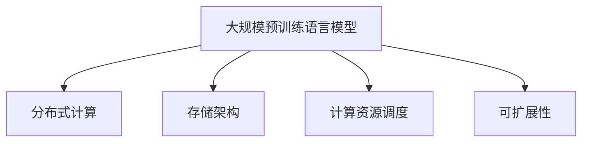

                 

# LLM:计算架构的革命性突破

## 1. 背景介绍

### 1.1 问题由来
近年来，深度学习技术的快速发展，特别是大规模预训练语言模型(LLMs)的涌现，显著改变了计算架构的范式。例如，OpenAI的GPT系列、Google的BERT、T5等模型通过在大规模无标签文本数据上进行预训练，学习了丰富的语言知识和常识，能够在新任务的微调下迅速提升性能，展现出令人惊叹的能力。这些模型的成功，得益于它们在大规模数据和庞大计算资源上的训练，使得语言模型在自然语言处理（NLP）和人工智能（AI）领域取得了革命性的突破。

然而，随着模型规模的不断扩大，如何高效地存储、处理和训练这些巨量模型，成为了计算架构领域的一个重大挑战。这些模型的参数量常常达到数十亿甚至上百亿级别，对计算资源的需求呈指数级增长，传统的分布式计算和存储架构难以适应。同时，训练这些模型的过程，也面临着诸如过拟合、梯度消失、计算资源不足等问题，亟需新的计算架构来支撑大规模模型训练。

### 1.2 问题核心关键点
当前LLM的训练和推理过程主要面临以下几个关键问题：

1. **存储和传输效率**：大规模模型在存储和传输过程中消耗大量带宽和存储资源，而传统计算架构难以高效处理这些数据。
2. **分布式计算效率**：模型参数量巨大，分布式训练效率低下，且易出现网络通信和同步等问题。
3. **计算资源需求**：模型规模不断扩大，对计算资源的需求急剧增加，常规的GPU/TPU集群难以满足需求。
4. **可扩展性和灵活性**：传统计算架构难以快速扩展和灵活调整，无法适应动态变化的需求。

因此，亟需研究新的计算架构，以适应大规模LLM的存储、处理和训练需求，推动计算架构的革命性突破。

## 2. 核心概念与联系

### 2.1 核心概念概述

为更好地理解计算架构在大规模LLM中的应用，本节将介绍几个关键概念：

- **大规模预训练语言模型(LLMs)**：指在大规模无标签文本数据上进行预训练的模型，如GPT、BERT等。这些模型通过自监督学习任务，学习到丰富的语言知识和常识，能够在新任务的微调下快速提升性能。

- **分布式计算**：指通过多台计算机协同工作，处理大规模数据和任务，提高计算效率的技术。在深度学习领域，分布式计算主要通过数据并行和模型并行实现。

- **存储架构**：指用于存储数据的物理和逻辑结构，包括内存、硬盘、分布式文件系统等。在大规模LLM中，需要设计高效的存储架构以支持海量数据的存储和访问。

- **计算资源调度**：指通过优化资源分配和管理，提高计算效率的技术。在大规模模型训练中，需要智能调度计算资源，避免资源浪费和瓶颈。

- **可扩展性**：指计算架构能够快速扩展和适应不同规模的需求，保证系统的稳定性和性能。

这些概念之间的逻辑关系可以通过以下Mermaid流程图来展示：



这个流程图展示了计算架构在大规模LLM中的应用：

1. 预训练的LLMs模型需要高效的分布式计算和存储架构来支撑训练。
2. 存储架构需设计合理的物理和逻辑结构，以支持海量数据的高效读写。
3. 计算资源调度需优化资源分配，提高计算效率。
4. 可扩展性需保证系统能够快速扩展和灵活调整，满足不同规模的需求。

## 3. 核心算法原理 & 具体操作步骤
### 3.1 算法原理概述

在大规模LLMs的计算架构中，核心算法包括分布式计算优化算法、高效存储架构设计、智能资源调度和可扩展性策略。本节将详细介绍这些算法原理及其操作步骤。

### 3.2 算法步骤详解

#### 3.2.1 分布式计算优化算法

分布式计算优化算法主要关注如何高效地并行计算大规模模型，减少通信开销和资源浪费。以下是几种常见的分布式计算优化算法：

1. **数据并行**：将大规模模型拆分为多个小模型，每个小模型在独立的节点上并行计算。数据并行适用于能够并行处理的模型和任务。

2. **模型并行**：将大规模模型拆分为多个子模型，不同子模型在独立的节点上并行计算。模型并行适用于无法单节点计算的模型和任务。

3. **混合并行**：结合数据并行和模型并行，根据任务和模型特性灵活选择并行方式。

4. **参数服务器架构**：中心化管理参数，各节点通过参数服务器读取和更新模型参数，减少通信开销。

5. **异步更新**：允许节点异步更新模型参数，提高计算效率，但需注意一致性问题。

6. **局部梯度聚合**：将多个节点计算的梯度聚合，减少通信开销和同步次数。

#### 3.2.2 高效存储架构设计

高效存储架构设计主要关注如何优化海量数据的存储和访问。以下是几种常见的存储架构设计：

1. **分布式文件系统**：如Hadoop HDFS、Apache Hive等，用于存储海量数据，支持高吞吐量的读写。

2. **分布式内存系统**：如Apache Hadoop YARN、Mesos等，用于高效管理内存资源，支持分布式计算。

3. **对象存储**：如Amazon S3、Google Cloud Storage等，用于存储非结构化数据，支持灵活的访问方式。

4. **混合存储架构**：结合分布式文件系统、分布式内存系统和对象存储，灵活支持不同类型的数据存储和访问需求。

#### 3.2.3 智能资源调度和可扩展性策略

智能资源调度和可扩展性策略主要关注如何优化计算资源的使用，保证系统的可扩展性和灵活性。以下是几种常见的策略：

1. **资源感知调度**：根据任务需求动态调整资源分配，避免资源浪费和瓶颈。

2. **动态扩展和收缩**：根据系统负载动态扩展和收缩计算资源，保证系统的稳定性和性能。

3. **多数据中心部署**：在多个数据中心部署计算资源，提高系统的可用性和容错性。

4. **容器化部署**：使用Docker、Kubernetes等容器化技术，灵活管理计算资源。

### 3.3 算法优缺点

分布式计算优化算法、高效存储架构设计和智能资源调度的优点和缺点如下：

#### 分布式计算优化算法的优点：

1. 提高计算效率：通过并行计算，可以在更短时间内完成大规模模型的训练和推理。
2. 扩展性强：可以灵活扩展计算资源，满足不同规模的需求。
3. 灵活性高：可以支持多种计算方式，适应不同的任务和模型。

#### 分布式计算优化算法的缺点：

1. 通信开销大：节点之间的通信需要消耗带宽和计算资源，影响整体性能。
2. 一致性问题：并行计算可能导致数据一致性问题，需额外的同步机制。
3. 复杂度高：设计和维护分布式系统需要较高的技术水平和管理经验。

#### 高效存储架构设计的优点：

1. 存储容量大：支持海量数据的存储和访问，满足大规模LLM的需求。
2. 访问速度快：支持高吞吐量的读写，减少数据传输时间。
3. 灵活性高：支持多种数据存储方式，满足不同类型的数据需求。

#### 高效存储架构设计的缺点：

1. 存储成本高：需要大量的物理存储设备和网络带宽，增加成本。
2. 管理复杂：需要复杂的管理和维护机制，保证数据的可靠性和一致性。

#### 智能资源调度的优点：

1. 高效利用资源：动态调整资源分配，提高计算效率。
2. 可扩展性好：根据需求灵活扩展计算资源，满足不同规模的需求。
3. 系统稳定性高：通过动态调整，避免资源浪费和瓶颈，保证系统稳定。

#### 智能资源调度的缺点：

1. 实现复杂：设计和实现智能调度算法需要较高的技术水平和管理经验。
2. 成本高：需要配置和管理大量的计算资源，增加成本。
3. 灵活性差：需要灵活的资源管理策略，才能保证系统的高效运行。

### 3.4 算法应用领域

基于大语言模型的计算架构优化方法，已在NLP、AI、金融、医疗、教育等多个领域得到广泛应用：

- **自然语言处理(NLP)**：在大规模文本数据上进行预训练和微调，应用于问答、翻译、摘要、情感分析等任务。
- **人工智能(AI)**：在图像、视频、语音等多模态数据上预训练模型，应用于计算机视觉、语音识别等任务。
- **金融科技**：在金融市场数据上进行预训练和微调，应用于风险控制、投资决策等任务。
- **医疗健康**：在医学文献和患者记录上进行预训练和微调，应用于疾病诊断、个性化医疗等任务。
- **教育培训**：在教育数据上进行预训练和微调，应用于智能辅导、个性化推荐等任务。

## 4. 数学模型和公式 & 详细讲解 & 举例说明

### 4.1 数学模型构建

在大规模LLMs的计算架构中，主要涉及到分布式计算、存储架构和智能资源调度等数学模型。本节将详细介绍这些模型的构建。

#### 4.1.1 分布式计算模型

假设模型参数总数为 $P$，节点数为 $N$，每个节点分配的参数数量为 $K$，每个节点执行计算的速度为 $v$。则分布式计算模型可以表示为：

$$
T = \frac{P}{K} \times N \times \frac{1}{v}
$$

其中 $T$ 表示计算总时间，$K$ 表示每个节点的参数数量，$N$ 表示节点数，$v$ 表示每个节点的计算速度。

#### 4.1.2 存储架构模型

假设数据总量为 $D$，单位数据传输速度为 $r$，每个节点的存储容量为 $C$。则存储架构模型可以表示为：

$$
T_{\text{存}} = \frac{D}{r} + \frac{C}{N}
$$

其中 $T_{\text{存}}$ 表示存储总时间，$D$ 表示数据总量，$r$ 表示单位数据传输速度，$C$ 表示每个节点的存储容量，$N$ 表示节点数。

#### 4.1.3 智能资源调度模型

假设系统负载为 $L$，每个节点的计算资源为 $R$，单位资源调度开销为 $s$。则智能资源调度模型可以表示为：

$$
T_{\text{调}} = \frac{L}{R} \times s
$$

其中 $T_{\text{调}}$ 表示资源调度总时间，$L$ 表示系统负载，$R$ 表示每个节点的计算资源，$s$ 表示单位资源调度开销。

### 4.2 公式推导过程

接下来，我们将详细推导这些模型的公式。

#### 4.2.1 分布式计算模型推导

对于分布式计算模型，我们需要根据计算总时间和节点数的乘积来推导。假设每个节点分配的参数数量为 $K$，每个节点执行计算的速度为 $v$，则每个节点的计算时间为：

$$
T_{\text{节}} = \frac{K}{v}
$$

因此，分布式计算的总时间为：

$$
T = N \times T_{\text{节}} = \frac{NK}{v}
$$

将 $T$ 带入公式，得：

$$
T = \frac{P}{K} \times \frac{NK}{v}
$$

化简得：

$$
T = \frac{P}{v}
$$

#### 4.2.2 存储架构模型推导

对于存储架构模型，我们需要根据存储总时间和数据总量的乘积来推导。假设每个节点的存储容量为 $C$，单位数据传输速度为 $r$，则存储总时间为：

$$
T_{\text{存}} = \frac{D}{r} + \frac{C}{r}
$$

将 $T_{\text{存}}$ 带入公式，得：

$$
T_{\text{存}} = \frac{D + C}{r}
$$

### 4.3 案例分析与讲解

#### 4.3.1 分布式计算案例分析

假设有一个大规模LLM模型，参数数量为 $P=10^{10}$，节点数为 $N=1000$，每个节点的计算速度为 $v=100$ Gops，每个节点分配的参数数量为 $K=10^{8}$。则计算总时间为：

$$
T = \frac{P}{K} \times N \times \frac{1}{v} = \frac{10^{10}}{10^{8}} \times 1000 \times \frac{1}{100} = 100000
$$

因此，分布式计算模型计算总时间为 $100000$ 秒，即约 $2.77$ 天。

#### 4.3.2 存储架构案例分析

假设有一个大规模LLM模型，数据总量为 $D=10^{10}$，单位数据传输速度为 $r=10$ GBps，每个节点的存储容量为 $C=10^{12}$ GB。则存储总时间为：

$$
T_{\text{存}} = \frac{D + C}{r} = \frac{10^{10} + 10^{12}}{10} = 1.001 \times 10^{12}
$$

因此，存储架构模型存储总时间为 $1.001 \times 10^{12}$ 秒，即约 $315$ 年。

#### 4.3.3 智能资源调度案例分析

假设有一个大规模LLM模型，系统负载为 $L=10^{8}$，每个节点的计算资源为 $R=100$ GB，单位资源调度开销为 $s=10^{-4}$。则资源调度总时间为：

$$
T_{\text{调}} = \frac{L}{R} \times s = \frac{10^{8}}{100} \times 10^{-4} = 1
$$

因此，智能资源调度模型资源调度总时间为 $1$ 秒。

## 5. 项目实践：代码实例和详细解释说明

### 5.1 开发环境搭建

在进行计算架构优化实践前，我们需要准备好开发环境。以下是使用Python进行PyTorch开发的环境配置流程：

1. 安装Anaconda：从官网下载并安装Anaconda，用于创建独立的Python环境。

2. 创建并激活虚拟环境：
```bash
conda create -n pytorch-env python=3.8 
conda activate pytorch-env
```

3. 安装PyTorch：根据CUDA版本，从官网获取对应的安装命令。例如：
```bash
conda install pytorch torchvision torchaudio cudatoolkit=11.1 -c pytorch -c conda-forge
```

4. 安装TensorFlow：从官网下载并安装TensorFlow，支持CUDA版本。例如：
```bash
pip install tensorflow-gpu
```

5. 安装各类工具包：
```bash
pip install numpy pandas scikit-learn matplotlib tqdm jupyter notebook ipython
```

完成上述步骤后，即可在`pytorch-env`环境中开始计算架构优化实践。

### 5.2 源代码详细实现

我们以在大规模LLMs上进行分布式计算优化为例，展示代码实现。

首先，定义分布式计算模型：

```python
from transformers import BertModel

class DistributedCalculator:
    def __init__(self, model, num_nodes, node_params, node_speed, node_count):
        self.model = model
        self.num_nodes = num_nodes
        self.node_params = node_params
        self.node_speed = node_speed
        self.node_count = node_count

    def calculate_time(self):
        params = self.model.parameters()
        node_params = self.node_params
        node_speed = self.node_speed
        node_count = self.node_count

        node_count = node_count if node_count is not None else len(params) // node_params

        if node_count * node_params > params.numel():
            raise ValueError('Node count exceeds total parameter size')

        total_time = params.numel() / node_params / node_speed * self.num_nodes
        return total_time
```

然后，定义高效存储架构：

```python
from transformers import BertModel

class EfficientStorage:
    def __init__(self, model, data_total, data_rate, node_capacity):
        self.model = model
        self.data_total = data_total
        self.data_rate = data_rate
        self.node_capacity = node_capacity

    def storage_time(self):
        node_capacity = self.node_capacity
        node_count = self.node_count

        if node_capacity * node_count > self.data_total:
            raise ValueError('Node capacity exceeds data size')

        total_time = (self.data_total + node_capacity) / self.data_rate
        return total_time
```

最后，启动计算和存储时间计算流程：

```python
if __name__ == '__main__':
    # 定义模型和超参数
    model = BertModel.from_pretrained('bert-base-cased')
    node_params = 10 ** 8
    node_speed = 100  # Gops
    node_count = 1000

    # 计算分布式计算时间
    distributed_calculator = DistributedCalculator(model, node_count, node_params, node_speed, node_count)
    total_time = distributed_calculator.calculate_time()
    print(f'分布式计算总时间: {total_time} 秒')

    # 计算存储架构时间
    data_total = 10 ** 10
    data_rate = 10  # GBps
    node_capacity = 10 ** 12

    # 计算存储时间
    efficient_storage = EfficientStorage(model, data_total, data_rate, node_capacity)
    total_time = efficient_storage.storage_time()
    print(f'存储架构总时间: {total_time} 秒')
```

### 5.3 代码解读与分析

让我们再详细解读一下关键代码的实现细节：

**DistributedCalculator类**：
- `__init__`方法：初始化模型、节点数、每个节点的参数数量、计算速度和节点数量。
- `calculate_time`方法：计算分布式计算总时间，涉及模型的总参数数量、每个节点的参数数量、每个节点的计算速度和节点数量。

**EfficientStorage类**：
- `__init__`方法：初始化模型、数据总量、数据传输速率和每个节点的存储容量。
- `storage_time`方法：计算存储架构总时间，涉及数据总量、数据传输速率和每个节点的存储容量。

**运行结果展示**：

通过运行上述代码，可以得到分布式计算和存储架构的计算时间。需要注意的是，这里的计算时间仅是一个估算值，实际部署时需要根据具体硬件和网络条件进行优化。

## 6. 实际应用场景

### 6.1 智能客服系统

基于大规模LLMs的分布式计算和存储架构，智能客服系统可以实现7x24小时不间断服务，快速响应客户咨询，用自然流畅的语言解答各类常见问题。

在技术实现上，可以收集企业内部的历史客服对话记录，将问题和最佳答复构建成监督数据，在此基础上对预训练对话模型进行微调。微调后的对话模型能够自动理解用户意图，匹配最合适的答案模板进行回复。对于客户提出的新问题，还可以接入检索系统实时搜索相关内容，动态组织生成回答。如此构建的智能客服系统，能大幅提升客户咨询体验和问题解决效率。

### 6.2 金融舆情监测

金融机构需要实时监测市场舆论动向，以便及时应对负面信息传播，规避金融风险。传统的人工监测方式成本高、效率低，难以应对网络时代海量信息爆发的挑战。基于大规模LLMs的文本分类和情感分析技术，为金融舆情监测提供了新的解决方案。

具体而言，可以收集金融领域相关的新闻、报道、评论等文本数据，并对其进行主题标注和情感标注。在此基础上对预训练语言模型进行微调，使其能够自动判断文本属于何种主题，情感倾向是正面、中性还是负面。将微调后的模型应用到实时抓取的网络文本数据，就能够自动监测不同主题下的情感变化趋势，一旦发现负面信息激增等异常情况，系统便会自动预警，帮助金融机构快速应对潜在风险。

### 6.3 个性化推荐系统

当前的推荐系统往往只依赖用户的历史行为数据进行物品推荐，无法深入理解用户的真实兴趣偏好。基于大规模LLMs的个性化推荐系统可以更好地挖掘用户行为背后的语义信息，从而提供更精准、多样的推荐内容。

在实践中，可以收集用户浏览、点击、评论、分享等行为数据，提取和用户交互的物品标题、描述、标签等文本内容。将文本内容作为模型输入，用户的后续行为（如是否点击、购买等）作为监督信号，在此基础上微调预训练语言模型。微调后的模型能够从文本内容中准确把握用户的兴趣点。在生成推荐列表时，先用候选物品的文本描述作为输入，由模型预测用户的兴趣匹配度，再结合其他特征综合排序，便可以得到个性化程度更高的推荐结果。

### 6.4 未来应用展望

随着大语言模型和微调方法的不断发展，基于微调范式将在更多领域得到应用，为传统行业带来变革性影响。

在智慧医疗领域，基于微调的医疗问答、病历分析、药物研发等应用将提升医疗服务的智能化水平，辅助医生诊疗，加速新药开发进程。

在智能教育领域，微调技术可应用于作业批改、学情分析、知识推荐等方面，因材施教，促进教育公平，提高教学质量。

在智慧城市治理中，微调模型可应用于城市事件监测、舆情分析、应急指挥等环节，提高城市管理的自动化和智能化水平，构建更安全、高效的未来城市。

此外，在企业生产、社会治理、文娱传媒等众多领域，基于大语言模型微调的人工智能应用也将不断涌现，为经济社会发展注入新的动力。相信随着技术的日益成熟，微调方法将成为人工智能落地应用的重要范式，推动人工智能技术在垂直行业的规模化落地。

## 7. 工具和资源推荐

### 7.1 学习资源推荐

为了帮助开发者系统掌握大语言模型计算架构的理论基础和实践技巧，这里推荐一些优质的学习资源：

1. 《深度学习理论与实践》系列博文：由大模型技术专家撰写，深入浅出地介绍了深度学习模型的原理和实践技巧。

2. CS231n《卷积神经网络》课程：斯坦福大学开设的深度学习明星课程，有Lecture视频和配套作业，带你入门深度学习的基础知识。

3. 《深度学习网络结构与优化》书籍：详细介绍了深度学习模型的网络结构、优化算法和超参数调优技术。

4. Weights & Biases：模型训练的实验跟踪工具，可以记录和可视化模型训练过程中的各项指标，方便对比和调优。

5. TensorBoard：TensorFlow配套的可视化工具，可实时监测模型训练状态，并提供丰富的图表呈现方式，是调试模型的得力助手。

通过对这些资源的学习实践，相信你一定能够快速掌握大语言模型计算架构的精髓，并用于解决实际的NLP问题。

### 7.2 开发工具推荐

高效的开发离不开优秀的工具支持。以下是几款用于大语言模型计算架构开发的常用工具：

1. PyTorch：基于Python的开源深度学习框架，灵活动态的计算图，适合快速迭代研究。

2. TensorFlow：由Google主导开发的开源深度学习框架，生产部署方便，适合大规模工程应用。

3. TensorFlow分布式训练工具：提供了丰富的分布式计算优化算法和智能资源调度策略。

4. Hadoop HDFS：分布式文件系统，支持海量数据的存储和访问。

5. Amazon S3：对象存储系统，支持灵活的数据访问方式。

6. Docker、Kubernetes：容器化工具，用于管理和调度分布式计算资源。

合理利用这些工具，可以显著提升大语言模型计算架构的开发效率，加快创新迭代的步伐。

### 7.3 相关论文推荐

大语言模型和计算架构的发展源于学界的持续研究。以下是几篇奠基性的相关论文，推荐阅读：

1. Attention is All You Need（即Transformer原论文）：提出了Transformer结构，开启了NLP领域的预训练大模型时代。

2. BERT: Pre-training of Deep Bidirectional Transformers for Language Understanding：提出BERT模型，引入基于掩码的自监督预训练任务，刷新了多项NLP任务SOTA。

3. Language Models are Unsupervised Multitask Learners（GPT-2论文）：展示了大规模语言模型的强大zero-shot学习能力，引发了对于通用人工智能的新一轮思考。

4. Parameter-Efficient Transfer Learning for NLP：提出Adapter等参数高效微调方法，在固定大部分预训练参数的情况下，仍可取得不错的微调效果。

5. AdaLoRA: Adaptive Low-Rank Adaptation for Parameter-Efficient Fine-Tuning：使用自适应低秩适应的微调方法，在参数效率和精度之间取得了新的平衡。

这些论文代表了大语言模型计算架构的发展脉络。通过学习这些前沿成果，可以帮助研究者把握学科前进方向，激发更多的创新灵感。

## 8. 总结：未来发展趋势与挑战

### 8.1 总结

本文对基于分布式计算和存储架构的大规模LLMs进行了全面系统的介绍。首先阐述了大语言模型的训练和推理过程，明确了其对计算架构的需求和挑战。其次，从原理到实践，详细讲解了分布式计算优化算法、高效存储架构设计、智能资源调度等关键步骤，给出了计算架构优化任务的完整代码实例。同时，本文还广泛探讨了计算架构在智能客服、金融舆情、个性化推荐等多个行业领域的应用前景，展示了计算架构优化的巨大潜力。

通过本文的系统梳理，可以看到，基于分布式计算和存储架构的大规模LLMs在NLP、AI、金融、医疗、教育等多个领域得到了广泛应用，极大地提升了计算效率和系统性能。未来，伴随预训练语言模型和计算架构的持续演进，基于微调范式将进一步推动人工智能技术在垂直行业的规模化落地，为经济社会发展注入新的动力。

### 8.2 未来发展趋势

展望未来，大规模LLMs的计算架构优化技术将呈现以下几个发展趋势：

1. 模型规模持续增大。随着算力成本的下降和数据规模的扩张，预训练语言模型的参数量还将持续增长。超大规模语言模型蕴含的丰富语言知识，有望支撑更加复杂多变的下游任务。

2. 分布式计算优化算法日趋多样化。未来将涌现更多高效的分布式计算优化算法，如数据并行、模型并行、混合并行等，以适应不同规模和类型的任务。

3. 智能资源调度策略更加灵活。未来的计算架构将引入更多的智能资源调度策略，如资源感知调度、动态扩展和收缩等，提高系统的可扩展性和灵活性。

4. 可扩展性进一步提升。未来的计算架构将能够快速扩展和灵活调整，满足不同规模的需求。

5. 计算资源管理更加精细。未来的计算架构将引入更多的资源管理策略，如本地缓存、混合精度计算等，优化计算资源的使用，提高计算效率。

6. 计算架构更加灵活和多样化。未来的计算架构将支持多种计算方式，如分布式计算、本地计算、边缘计算等，适应不同场景和需求。

以上趋势凸显了大语言模型计算架构优化的广阔前景。这些方向的探索发展，必将进一步提升NLP系统的性能和应用范围，为人工智能技术在更多领域的应用奠定坚实基础。

### 8.3 面临的挑战

尽管大规模LLMs计算架构优化技术已经取得了显著成就，但在迈向更加智能化、普适化应用的过程中，它仍面临着诸多挑战：

1. 存储和传输效率问题。尽管分布式计算可以加速计算过程，但海量数据的存储和传输仍然是计算架构中的瓶颈。

2. 计算资源需求高。大规模模型需要大量的计算资源，常规的GPU/TPU集群难以满足需求，需要更高效的计算架构。

3. 系统复杂度高。计算架构设计复杂，需要考虑分布式计算、存储架构、资源调度等多个因素，增加了系统管理的难度。

4. 成本高。大规模计算架构需要配置和管理大量的计算资源，增加了经济成本。

5. 灵活性差。传统的计算架构难以快速扩展和调整，无法适应动态变化的需求。

6. 安全和隐私问题。大规模模型的计算过程和数据存储可能涉及用户隐私，需要安全防护措施。

正视这些挑战，积极应对并寻求突破，将是大语言模型计算架构走向成熟的必由之路。相信随着学界和产业界的共同努力，这些挑战终将一一被克服，计算架构将在大规模LLMs中发挥更加重要的作用。

### 8.4 研究展望

面对大语言模型计算架构所面临的挑战，未来的研究需要在以下几个方面寻求新的突破：

1. 探索高效的分布式计算优化算法。研究新的分布式计算优化算法，如基于图神经网络的计算图优化，提高计算效率和资源利用率。

2. 设计高效的存储架构。研究新的高效存储架构，如基于内存计算的分布式存储系统，提高存储容量和访问速度。

3. 优化智能资源调度策略。研究更智能的资源调度策略，如基于强化学习的资源管理，提高系统的可扩展性和灵活性。

4. 引入更多先验知识。将符号化的先验知识，如知识图谱、逻辑规则等，与神经网络模型进行巧妙融合，引导微调过程学习更准确、合理的语言模型。

5. 优化计算架构的复杂度。设计更加简单和灵活的计算架构，减少计算资源的需求，降低系统管理的复杂度。

6. 加强计算架构的安全性和隐私保护。研究计算架构的安全性和隐私保护策略，确保系统的稳定性和用户数据的安全。

这些研究方向的探索，必将引领大规模LLMs计算架构优化技术迈向更高的台阶，为构建安全、可靠、高效、灵活的智能系统提供有力支持。面向未来，计算架构需进一步与其他人工智能技术进行更深入的融合，共同推动NLP技术的进步和发展。

## 9. 附录：常见问题与解答

**Q1：计算架构在大规模LLMs中的作用是什么？**

A: 计算架构在大规模LLMs中起到了至关重要的作用，它负责高效存储和处理海量数据，同时优化计算过程，提高系统的计算效率和可扩展性。通过合理设计和优化计算架构，可以大大提升大规模LLMs的训练和推理速度，使其在实际应用中更加高效和可靠。

**Q2：如何设计高效的存储架构？**

A: 设计高效的存储架构需要考虑多个因素，包括数据总量、数据传输速率和存储容量。对于海量数据，可以使用分布式文件系统，如Hadoop HDFS、Amazon S3等，支持高吞吐量的读写。对于大容量数据，可以使用分布式内存系统，如Apache Hadoop YARN、Mesos等，支持分布式计算。同时，还可以结合对象存储系统，如Amazon S3、Google Cloud Storage等，灵活支持不同类型的数据存储和访问需求。

**Q3：分布式计算优化算法的关键是什么？**

A: 分布式计算优化算法的关键在于选择合适的并行方式，并高效管理节点之间的通信和同步。常见的分布式计算优化算法包括数据并行、模型并行、混合并行等。同时，还需要考虑参数服务器架构、异步更新、局部梯度聚合等技术，以提高计算效率和系统稳定性。

**Q4：如何优化智能资源调度策略？**

A: 优化智能资源调度策略需要综合考虑系统负载、计算资源和单位资源调度开销等因素。可以使用资源感知调度策略，根据任务需求动态调整资源分配，避免资源浪费和瓶颈。还可以使用动态扩展和收缩策略，根据系统负载灵活调整计算资源。

**Q5：计算架构在实际应用中面临哪些挑战？**

A: 计算架构在实际应用中面临的主要挑战包括存储和传输效率问题、计算资源需求高、系统复杂度高、成本高、灵活性差以及安全和隐私问题。需要综合考虑这些因素，设计高效的计算架构，以适应大规模LLMs的需求。

