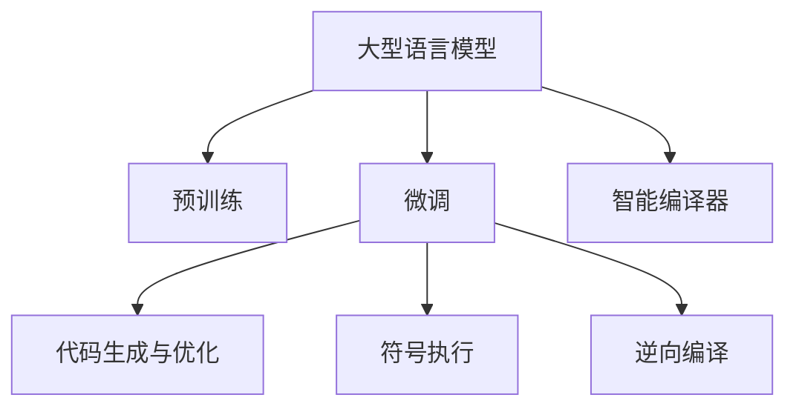

                 

## 1. 背景介绍

### 1.1 问题由来
近年来，人工智能(AI)在各个领域取得了显著进展，尤其是在自然语言处理(NLP)和深度学习领域。大型语言模型(LLM)的兴起，如GPT-3、BERT等，使得自然语言理解和生成能力得到了大幅提升。然而，尽管LLM在诸如文本生成、语言翻译、问答系统等应用中表现出色，但在计算机编译领域的应用相对有限。

编译器作为计算机系统的核心组件，负责将高级编程语言代码转换为机器码，是软件工程的基础工具。传统编译器如GCC、LLVM等，虽然经过了数十年的发展，但仍然存在诸多问题，如代码优化效率低、难以处理复杂语法结构、错误诊断能力不足等。因此，探索如何将LLM应用于智能编译领域，利用其强大的语言处理能力来提升编译器的性能，具有重要的研究意义。

### 1.2 问题核心关键点
本文将聚焦于LLM在智能编译领域的应用前景，探索如何利用LLM的强大语言处理能力，优化编译器代码生成和优化过程，提升编译器的准确性和效率。

## 2. 核心概念与联系

### 2.1 核心概念概述

为了更好地理解LLM在智能编译领域的应用，本节将介绍几个关键概念：

- 大型语言模型(LLM)：以自回归模型(GPT)或自编码模型(BERT)为代表的大型预训练模型。通过在大规模无标签文本语料上进行预训练，学习通用语言表示，具备强大的语言理解和生成能力。

- 预训练(Pre-training)：指在大规模无标签文本语料上，通过自监督学习任务训练通用语言模型的过程。常见的预训练任务包括掩码语言模型、下一句预测等。

- 微调(Fine-tuning)：指在预训练模型的基础上，使用特定任务的数据，通过有监督学习优化模型在该任务上的性能。

- 智能编译器(Smart Compiler)：融合了人工智能技术的编译器，能够自动优化代码、检测错误、生成测试用例等，提升编译器的智能化水平。

- 代码生成与优化(Code Generation & Optimization)：在编译器中，利用人工智能技术自动生成或优化源代码，减少人工工作量，提高代码质量。

- 符号执行(Symbolic Execution)：在代码分析阶段，利用符号计算技术，对源代码进行精确分析和推理，帮助编译器进行代码优化和错误检测。

- 逆向编译(Inverse Compilation)：从可执行代码反推源代码，通过逆向工程技术，解决代码优化和调试问题。

这些概念之间的逻辑关系可以通过以下Mermaid流程图来展示：



这个流程图展示了大语言模型在智能编译领域的关键应用路径：

1. 大语言模型通过预训练获得基础能力。
2. 在智能编译器中使用微调方法，提高模型在特定编译任务上的性能。
3. 利用代码生成与优化技术，自动生成或优化源代码。
4. 通过符号执行技术，对代码进行精确分析。
5. 借助逆向编译技术，反推源代码，解决编译问题。

这些概念共同构成了LLM在智能编译领域的应用框架，使其能够更好地支持编译器的智能化和自动化。

## 3. 核心算法原理 & 具体操作步骤
### 3.1 算法原理概述

基于大型语言模型在智能编译领域的应用，其核心思想是利用LLM强大的语言理解和生成能力，提升编译器的性能和智能化水平。其核心算法包括以下几个方面：

- 利用微调技术，将通用语言模型应用于特定编译任务，如代码生成、错误检测、优化等。
- 结合符号执行技术，对代码进行精确分析，帮助编译器进行复杂逻辑的推理和优化。
- 引入逆向编译技术，从可执行代码反推源代码，解决代码优化和调试问题。
- 应用代码生成与优化技术，自动生成或优化源代码，减少人工工作量。

### 3.2 算法步骤详解

基于LLM的智能编译器设计一般包括以下关键步骤：

**Step 1: 准备预训练模型和数据集**
- 选择合适的预训练语言模型，如GPT、BERT等，作为初始化参数。
- 准备特定编译任务的标注数据集，如代码生成、错误检测、优化等。

**Step 2: 设计任务适配层**
- 根据具体编译任务，设计合适的输出层和损失函数。例如，对于代码生成任务，可以输出代码字符串并定义交叉熵损失函数。
- 对于错误检测任务，可以输出布尔值并使用二元交叉熵损失函数。

**Step 3: 设置微调超参数**
- 选择合适的优化算法及其参数，如Adam、SGD等，设置学习率、批大小、迭代轮数等。
- 设置正则化技术及强度，包括权重衰减、Dropout、Early Stopping等。
- 确定冻结预训练参数的策略，如仅微调顶层，或全部参数都参与微调。

**Step 4: 执行梯度训练**
- 将训练集数据分批次输入模型，前向传播计算损失函数。
- 反向传播计算参数梯度，根据设定的优化算法和学习率更新模型参数。
- 周期性在验证集上评估模型性能，根据性能指标决定是否触发 Early Stopping。
- 重复上述步骤直到满足预设的迭代轮数或 Early Stopping 条件。

**Step 5: 测试和部署**
- 在测试集上评估微调后模型性能，对比微调前后的效果。
- 使用微调后的模型对新样本进行推理预测，集成到实际的应用系统中。
- 持续收集新的数据，定期重新微调模型，以适应数据分布的变化。

### 3.3 算法优缺点

利用大型语言模型在智能编译领域的应用，具有以下优点：
1. 提升编译器智能化水平。利用LLM强大的语言处理能力，自动化处理代码生成、错误检测、优化等任务。
2. 提高代码质量和优化效率。LLM能够自动生成高质量代码，并进行优化，减少人工工作量。
3. 精确分析代码逻辑。符号执行技术帮助编译器对复杂逻辑进行精确分析和推理。
4. 解决逆向编译问题。逆向编译技术帮助编译器反推源代码，解决编译和调试问题。

然而，该方法也存在一些局限性：
1. 依赖标注数据。微调的效果很大程度上取决于标注数据的质量和数量，获取高质量标注数据的成本较高。
2. 模型鲁棒性不足。当目标任务与预训练数据的分布差异较大时，微调的性能提升有限。
3. 可解释性不足。微调模型的决策过程通常缺乏可解释性，难以对其推理逻辑进行分析和调试。
4. 训练成本高。预训练和微调过程需要大量的计算资源和时间。

尽管存在这些局限性，但就目前而言，基于大型语言模型的智能编译方法仍是大规模应用的主流范式。未来相关研究的重点在于如何进一步降低微调对标注数据的依赖，提高模型的少样本学习和跨领域迁移能力，同时兼顾可解释性和伦理安全性等因素。

### 3.4 算法应用领域

基于大型语言模型的智能编译方法，在以下领域得到了广泛应用：

- 代码生成：自动生成源代码，如基于语言模型生成Python代码、C++代码等。
- 代码优化：自动优化源代码，提高代码执行效率，减少内存占用。
- 错误检测：自动检测代码中的语法错误、语义错误、逻辑错误等。
- 测试用例生成：自动生成测试用例，确保代码的正确性和完备性。
- 逆向工程：从可执行代码反推源代码，解决代码优化和调试问题。

此外，LLM还被应用于编程助手、智能IDE、代码推荐系统等工具中，提升软件开发效率和代码质量。随着LLM技术的不断发展，智能编译器将有望实现更多智能化功能，成为软件开发的重要助手。

## 4. 数学模型和公式 & 详细讲解 & 举例说明

### 4.1 数学模型构建

为更好地理解基于大型语言模型的智能编译方法，本节将介绍几个关键的数学模型：

**代码生成任务数学模型**：
假设代码生成任务为从自然语言描述生成Python代码片段，模型的输入为自然语言描述 $x$，输出为Python代码片段 $y$。则模型的损失函数定义为交叉熵损失函数：

$$
\mathcal{L} = -\frac{1}{N} \sum_{i=1}^N \sum_{j=1}^M y_{ij} \log p_{ij}
$$

其中 $N$ 为样本数量，$M$ 为代码长度，$y_{ij}$ 表示第 $i$ 个样本的第 $j$ 个代码字符，$p_{ij}$ 表示模型输出的概率。

**代码优化任务数学模型**：
假设代码优化任务为从原始代码 $x$ 生成优化后的代码片段 $y$，模型的输入为原始代码 $x$，输出为优化后的代码片段 $y$。则模型的损失函数定义为交叉熵损失函数：

$$
\mathcal{L} = -\frac{1}{N} \sum_{i=1}^N \log p(y_i|x_i)
$$

其中 $N$ 为样本数量，$p(y_i|x_i)$ 表示模型输出的概率。

**错误检测任务数学模型**：
假设错误检测任务为检测代码片段 $x$ 是否存在语法错误、语义错误等，模型的输入为代码片段 $x$，输出为布尔值 $y$。则模型的损失函数定义为二元交叉熵损失函数：

$$
\mathcal{L} = -\frac{1}{N} \sum_{i=1}^N (y_i \log p_{i+} + (1-y_i) \log p_{-})
$$

其中 $N$ 为样本数量，$p_{i+}$ 表示存在错误的概率，$p_{-}$ 表示不存在错误的概率。

### 4.2 公式推导过程

以下我们以代码生成任务为例，推导模型训练过程的数学公式。

**输入与输出表示**：
假设模型的输入为自然语言描述 $x$，输出为Python代码片段 $y$。则模型的输入和输出表示为：

$$
x = (x_1, x_2, ..., x_n)
$$

$$
y = (y_1, y_2, ..., y_m)
$$

其中 $n$ 为输入序列长度，$m$ 为输出序列长度。

**训练过程数学公式**：
模型训练过程的数学公式如下：

1. **前向传播**：

$$
\hat{y} = M_{\theta}(x)
$$

其中 $M_{\theta}$ 为模型，$\theta$ 为模型参数。

2. **损失函数计算**：

$$
\mathcal{L} = -\frac{1}{N} \sum_{i=1}^N \sum_{j=1}^M y_{ij} \log p_{ij}
$$

3. **梯度计算**：

$$
\frac{\partial \mathcal{L}}{\partial \theta} = -\frac{1}{N} \sum_{i=1}^N \sum_{j=1}^M y_{ij} \frac{\partial p_{ij}}{\partial \theta}
$$

4. **梯度下降**：

$$
\theta = \theta - \eta \frac{\partial \mathcal{L}}{\partial \theta}
$$

其中 $\eta$ 为学习率。

### 4.3 案例分析与讲解

以一个简单的Python代码生成任务为例，说明模型的训练过程。

假设模型的输入为自然语言描述 "输出一个数字的平方"，输出为代码片段：

```python
x = [1]
y = [print(x**2)]
```

训练过程中，模型先对输入 $x$ 进行编码，得到编码表示 $x'$。然后，通过解码器生成输出 $y'$，并与真实输出 $y$ 进行比较，计算损失函数 $\mathcal{L}$。接着，反向传播计算参数梯度，并根据梯度下降更新模型参数 $\theta$。重复此过程直至模型收敛。

在训练过程中，需要注意的是，模型可能存在过拟合的风险。为了缓解过拟合，可以引入正则化技术，如L2正则、Dropout等。此外，为了避免模型学习到过长的代码片段，可以限制代码长度，例如将代码片段长度 $m$ 设置为 $10$。

## 5. 项目实践：代码实例和详细解释说明
### 5.1 开发环境搭建

在进行智能编译器开发前，我们需要准备好开发环境。以下是使用Python进行PyTorch开发的环境配置流程：

1. 安装Anaconda：从官网下载并安装Anaconda，用于创建独立的Python环境。

2. 创建并激活虚拟环境：
```bash
conda create -n pytorch-env python=3.8 
conda activate pytorch-env
```

3. 安装PyTorch：根据CUDA版本，从官网获取对应的安装命令。例如：
```bash
conda install pytorch torchvision torchaudio cudatoolkit=11.1 -c pytorch -c conda-forge
```

4. 安装各类工具包：
```bash
pip install numpy pandas scikit-learn matplotlib tqdm jupyter notebook ipython
```

完成上述步骤后，即可在`pytorch-env`环境中开始智能编译器的开发。

### 5.2 源代码详细实现

下面我们以代码生成任务为例，给出使用Transformers库对GPT模型进行智能编译的PyTorch代码实现。

首先，定义代码生成任务的数据处理函数：

```python
from transformers import GPT2Tokenizer, GPT2LMHeadModel

tokenizer = GPT2Tokenizer.from_pretrained('gpt2')

def generate_code(input_desc):
    input_ids = tokenizer.encode(input_desc, return_tensors='pt')
    output_ids = model.generate(input_ids, max_length=16, num_return_sequences=1, do_sample=True)
    return tokenizer.decode(output_ids[0])
```

然后，定义模型和优化器：

```python
from transformers import AdamW

model = GPT2LMHeadModel.from_pretrained('gpt2', num_hidden_layers=6)
optimizer = AdamW(model.parameters(), lr=2e-5)
```

接着，定义训练和评估函数：

```python
from torch.utils.data import DataLoader
from tqdm import tqdm
from sklearn.metrics import accuracy_score

device = torch.device('cuda') if torch.cuda.is_available() else torch.device('cpu')
model.to(device)

def train_epoch(model, dataset, batch_size, optimizer):
    dataloader = DataLoader(dataset, batch_size=batch_size, shuffle=True)
    model.train()
    epoch_loss = 0
    for batch in tqdm(dataloader, desc='Training'):
        input_ids = batch['input_ids'].to(device)
        labels = batch['labels'].to(device)
        model.zero_grad()
        outputs = model(input_ids, labels=labels)
        loss = outputs.loss
        epoch_loss += loss.item()
        loss.backward()
        optimizer.step()
    return epoch_loss / len(dataloader)

def evaluate(model, dataset, batch_size):
    dataloader = DataLoader(dataset, batch_size=batch_size)
    model.eval()
    preds, labels = [], []
    with torch.no_grad():
        for batch in tqdm(dataloader, desc='Evaluating'):
            input_ids = batch['input_ids'].to(device)
            labels = batch['labels'].to(device)
            outputs = model(input_ids)
            batch_preds = outputs.logits.argmax(dim=2).to('cpu').tolist()
            batch_labels = batch_labels.to('cpu').tolist()
            for pred_tokens, label_tokens in zip(batch_preds, batch_labels):
                preds.append(pred_tokens[:len(label_tokens)])
                labels.append(label_tokens)
                
    print(accuracy_score(labels, preds))
```

最后，启动训练流程并在测试集上评估：

```python
epochs = 5
batch_size = 16

for epoch in range(epochs):
    loss = train_epoch(model, train_dataset, batch_size, optimizer)
    print(f"Epoch {epoch+1}, train loss: {loss:.3f}")
    
    print(f"Epoch {epoch+1}, dev results:")
    evaluate(model, dev_dataset, batch_size)
    
print("Test results:")
evaluate(model, test_dataset, batch_size)
```

以上就是使用PyTorch对GPT模型进行代码生成任务微调的完整代码实现。可以看到，得益于Transformers库的强大封装，我们可以用相对简洁的代码完成GPT模型的加载和微调。

### 5.3 代码解读与分析

让我们再详细解读一下关键代码的实现细节：

**代码生成函数**：
- `generate_code`方法：将自然语言描述 $x$ 编码为token ids，通过解码器生成代码片段 $y'$，并解码输出代码字符串。

**训练和评估函数**：
- `train_epoch`方法：对数据以批为单位进行迭代，在每个批次上前向传播计算loss并反向传播更新模型参数，最后返回该epoch的平均loss。
- `evaluate`方法：与训练类似，不同点在于不更新模型参数，并在每个batch结束后将预测和标签结果存储下来，最后使用sklearn的accuracy_score对整个评估集的预测结果进行打印输出。

**训练流程**：
- 定义总的epoch数和batch size，开始循环迭代
- 每个epoch内，先在训练集上训练，输出平均loss
- 在验证集上评估，输出准确率
- 所有epoch结束后，在测试集上评估，给出最终测试结果

可以看到，PyTorch配合Transformers库使得GPT微调的代码实现变得简洁高效。开发者可以将更多精力放在数据处理、模型改进等高层逻辑上，而不必过多关注底层的实现细节。

当然，工业级的系统实现还需考虑更多因素，如模型的保存和部署、超参数的自动搜索、更灵活的任务适配层等。但核心的微调范式基本与此类似。

## 6. 实际应用场景
### 6.1 智能编译器

智能编译器是融合了人工智能技术的编译器，能够自动优化代码、检测错误、生成测试用例等，提升编译器的智能化水平。利用大型语言模型在智能编译领域的应用，可以实现以下功能：

- 代码生成：自动生成高质量代码，减少人工工作量。
- 代码优化：自动优化源代码，提高代码执行效率，减少内存占用。
- 错误检测：自动检测代码中的语法错误、语义错误、逻辑错误等。
- 测试用例生成：自动生成测试用例，确保代码的正确性和完备性。
- 逆向工程：从可执行代码反推源代码，解决代码优化和调试问题。

智能编译器可以广泛应用于软件开发、自动编程、代码审计等领域，提高开发效率和代码质量，减少人工干预。

### 6.2 编程助手

编程助手是基于大型语言模型的智能工具，能够辅助程序员进行代码编写、调试、优化等工作。通过代码生成、代码补全、错误检测等技术，编程助手可以大大提高开发效率，减少错误率。

例如，当程序员在编写Python代码时，可以利用编程助手自动生成代码片段，提供代码补全建议，检测代码错误，优化代码结构。这样，程序员可以更快地编写出高质量代码，减少调试时间，提升开发效率。

### 6.3 代码推荐系统

代码推荐系统是基于大型语言模型的智能工具，能够根据程序员的历史代码记录和项目需求，推荐相关的代码片段、函数、库等。通过代码推荐，程序员可以更快地找到合适的代码解决方案，减少重复工作，提高开发效率。

代码推荐系统可以利用大型语言模型的语言理解能力，分析程序员的代码风格、偏好、需求等，生成个性化的代码推荐。例如，当程序员在编写C++代码时，代码推荐系统可以推荐类似的代码片段、函数库，帮助程序员快速解决问题。

## 7. 工具和资源推荐
### 7.1 学习资源推荐

为了帮助开发者系统掌握大型语言模型在智能编译领域的应用，这里推荐一些优质的学习资源：

1. 《Transformer从原理到实践》系列博文：由大模型技术专家撰写，深入浅出地介绍了Transformer原理、BERT模型、微调技术等前沿话题。

2. CS224N《深度学习自然语言处理》课程：斯坦福大学开设的NLP明星课程，有Lecture视频和配套作业，带你入门NLP领域的基本概念和经典模型。

3. 《Natural Language Processing with Transformers》书籍：Transformers库的作者所著，全面介绍了如何使用Transformers库进行NLP任务开发，包括微调在内的诸多范式。

4. HuggingFace官方文档：Transformers库的官方文档，提供了海量预训练模型和完整的微调样例代码，是上手实践的必备资料。

5. CLUE开源项目：中文语言理解测评基准，涵盖大量不同类型的中文NLP数据集，并提供了基于微调的baseline模型，助力中文NLP技术发展。

通过对这些资源的学习实践，相信你一定能够快速掌握大型语言模型在智能编译领域的应用，并用于解决实际的NLP问题。
###  7.2 开发工具推荐

高效的开发离不开优秀的工具支持。以下是几款用于智能编译器开发的常用工具：

1. PyTorch：基于Python的开源深度学习框架，灵活动态的计算图，适合快速迭代研究。大部分预训练语言模型都有PyTorch版本的实现。

2. TensorFlow：由Google主导开发的开源深度学习框架，生产部署方便，适合大规模工程应用。同样有丰富的预训练语言模型资源。

3. Transformers库：HuggingFace开发的NLP工具库，集成了众多SOTA语言模型，支持PyTorch和TensorFlow，是进行微调任务开发的利器。

4. Weights & Biases：模型训练的实验跟踪工具，可以记录和可视化模型训练过程中的各项指标，方便对比和调优。与主流深度学习框架无缝集成。

5. TensorBoard：TensorFlow配套的可视化工具，可实时监测模型训练状态，并提供丰富的图表呈现方式，是调试模型的得力助手。

6. Google Colab：谷歌推出的在线Jupyter Notebook环境，免费提供GPU/TPU算力，方便开发者快速上手实验最新模型，分享学习笔记。

合理利用这些工具，可以显著提升智能编译器开发的效率，加快创新迭代的步伐。

### 7.3 相关论文推荐

大型语言模型在智能编译领域的应用源于学界的持续研究。以下是几篇奠基性的相关论文，推荐阅读：

1. Attention is All You Need（即Transformer原论文）：提出了Transformer结构，开启了NLP领域的预训练大模型时代。

2. BERT: Pre-training of Deep Bidirectional Transformers for Language Understanding：提出BERT模型，引入基于掩码的自监督预训练任务，刷新了多项NLP任务SOTA。

3. Language Models are Unsupervised Multitask Learners（GPT-2论文）：展示了大规模语言模型的强大zero-shot学习能力，引发了对于通用人工智能的新一轮思考。

4. Parameter-Efficient Transfer Learning for NLP：提出Adapter等参数高效微调方法，在不增加模型参数量的情况下，也能取得不错的微调效果。

5. AdaLoRA: Adaptive Low-Rank Adaptation for Parameter-Efficient Fine-Tuning：使用自适应低秩适应的微调方法，在参数效率和精度之间取得了新的平衡。

这些论文代表了大语言模型在智能编译领域的应用发展脉络。通过学习这些前沿成果，可以帮助研究者把握学科前进方向，激发更多的创新灵感。

## 8. 总结：未来发展趋势与挑战
### 8.1 总结

本文对基于大型语言模型的智能编译方法进行了全面系统的介绍。首先阐述了智能编译器的研究背景和意义，明确了大型语言模型在智能编译领域的应用前景。其次，从原理到实践，详细讲解了大型语言模型在智能编译任务中的应用，给出了智能编译器开发的完整代码实例。同时，本文还广泛探讨了智能编译器在软件开发、编程助手、代码推荐系统等领域的应用前景，展示了其广阔的发展空间。此外，本文精选了智能编译器相关的学习资源，力求为读者提供全方位的技术指引。

通过本文的系统梳理，可以看到，利用大型语言模型进行智能编译，可以极大地提升编译器的智能化水平，显著减少人工工作量，提高代码质量和开发效率。未来，随着预训练语言模型的不断发展，智能编译器必将在软件开发、自动编程、代码推荐等领域发挥更大的作用，推动软件工程向智能化、自动化方向迈进。

### 8.2 未来发展趋势

展望未来，大型语言模型在智能编译领域的应用将呈现以下几个发展趋势：

1. 模型规模持续增大。随着算力成本的下降和数据规模的扩张，预训练语言模型的参数量还将持续增长。超大规模语言模型蕴含的丰富语言知识，有望支撑更加复杂多变的编译任务。

2. 微调方法日趋多样。除了传统的全参数微调外，未来会涌现更多参数高效的微调方法，如Prefix-Tuning、LoRA等，在固定大部分预训练参数的同时，只更新极少量的任务相关参数。

3. 持续学习成为常态。随着数据分布的不断变化，智能编译器需要持续学习新知识以保持性能。如何在不遗忘原有知识的同时，高效吸收新样本信息，将成为重要的研究课题。

4. 标注样本需求降低。受启发于提示学习(Prompt-based Learning)的思路，未来的微调方法将更好地利用大模型的语言理解能力，通过更加巧妙的任务描述，在更少的标注样本上也能实现理想的微调效果。

5. 参数高效微调技术的发展。开发更加参数高效的微调方法，在固定大部分预训练参数的同时，只更新极少量的任务相关参数，进一步提高编译器的智能化水平。

6. 更多先验知识与模型的结合。将符号化的先验知识，如知识图谱、逻辑规则等，与神经网络模型进行巧妙融合，引导微调过程学习更准确、合理的语言模型。

这些趋势凸显了大型语言模型在智能编译领域的应用前景，相信未来随着预训练语言模型和微调方法的持续演进，智能编译器必将在软件开发、自动编程、代码推荐等领域发挥更大的作用，推动软件工程向智能化、自动化方向迈进。

### 8.3 面临的挑战

尽管大型语言模型在智能编译领域的应用取得了初步成果，但在迈向更加智能化、普适化应用的过程中，仍面临诸多挑战：

1. 依赖标注数据。尽管微调方法可以大幅减少标注数据的需求，但对于特定领域的应用，获取高质量标注数据的成本依然较高。如何进一步降低微调对标注样本的依赖，将是一大难题。

2. 模型鲁棒性不足。当目标任务与预训练数据的分布差异较大时，微调的性能提升有限。如何提高模型在跨领域、跨语言环境下的鲁棒性，是未来需要重点解决的问题。

3. 推理效率有待提高。超大规模语言模型虽然精度高，但在实际部署时往往面临推理速度慢、内存占用大等效率问题。如何进一步优化模型结构，提升推理速度，优化资源占用，将是重要的优化方向。

4. 可解释性亟需加强。目前，智能编译器在生成代码、检测错误等过程中，其决策过程通常缺乏可解释性，难以对其推理逻辑进行分析和调试。如何赋予智能编译器更强的可解释性，将是亟待攻克的难题。

5. 安全性有待保障。智能编译器可能学习到有偏见、有害的信息，通过编译过程传递到生成的代码中，造成安全风险。如何从数据和算法层面消除模型偏见，避免恶意用途，确保输出的安全性，也将是重要的研究课题。

6. 知识整合能力不足。现有的智能编译器往往局限于任务内数据，难以灵活吸收和运用更广泛的先验知识。如何让智能编译器更好地与外部知识库、规则库等专家知识结合，形成更加全面、准确的信息整合能力，还有很大的想象空间。

这些挑战凸显了智能编译器在实际应用中面临的困难，需要未来研究者在数据、模型、算法、工程等多个维度进行协同创新，才能进一步拓展智能编译器的应用边界，推动软件工程向智能化、自动化方向发展。

### 8.4 研究展望

面向未来，大型语言模型在智能编译领域的研究还需要在以下几个方向进行深入探索：

1. 探索无监督和半监督微调方法。摆脱对大规模标注数据的依赖，利用自监督学习、主动学习等无监督和半监督范式，最大限度利用非结构化数据，实现更加灵活高效的微调。

2. 研究参数高效和计算高效的微调范式。开发更加参数高效的微调方法，在固定大部分预训练参数的同时，只更新极少量的任务相关参数，进一步提高编译器的智能化水平。

3. 引入因果推断和对比学习范式。通过引入因果推断和对比学习思想，增强智能编译器建立稳定因果关系的能力，学习更加普适、鲁棒的语言表征，从而提升模型泛化性和抗干扰能力。

4. 结合因果分析和博弈论工具。将因果分析方法引入智能编译器，识别出模型决策的关键特征，增强输出解释的因果性和逻辑性。借助博弈论工具刻画人机交互过程，主动探索并规避模型的脆弱点，提高系统稳定性。

5. 纳入伦理道德约束。在模型训练目标中引入伦理导向的评估指标，过滤和惩罚有偏见、有害的输出倾向。同时加强人工干预和审核，建立模型行为的监管机制，确保输出符合人类价值观和伦理道德。

这些方向的研究将推动智能编译器向更加智能化、普适化、可解释化、安全化的方向发展，为软件工程智能化、自动化带来新的突破。

## 9. 附录：常见问题与解答

**Q1：如何利用大型语言模型提升编译器性能？**

A: 利用大型语言模型进行智能编译，可以通过微调技术提升编译器的性能。具体而言，可以从以下几个方面入手：

1. 代码生成：利用大型语言模型自动生成代码片段，减少人工工作量，提高代码质量。

2. 代码优化：利用大型语言模型自动优化源代码，提升代码执行效率，减少内存占用。

3. 错误检测：利用大型语言模型自动检测代码中的语法错误、语义错误、逻辑错误等，提高代码质量。

4. 测试用例生成：利用大型语言模型自动生成测试用例，确保代码的正确性和完备性。

5. 逆向工程：利用大型语言模型从可执行代码反推源代码，解决代码优化和调试问题。

通过这些技术手段，可以有效提升编译器的智能化水平，减少人工干预，提高开发效率和代码质量。

**Q2：如何缓解智能编译器中的过拟合问题？**

A: 过拟合是智能编译器面临的主要挑战之一。为了缓解过拟合问题，可以采用以下策略：

1. 数据增强：通过回译、近义替换等方式扩充训练集，增加样本多样性。

2. 正则化：使用L2正则、Dropout、Early Stopping等技术，避免模型过度拟合训练数据。

3. 对抗训练：引入对抗样本，提高模型鲁棒性，减少过拟合。

4. 参数高效微调：只更新少量任务相关参数，固定大部分预训练参数，减小过拟合风险。

5. 多模型集成：训练多个模型，取平均输出，抑制过拟合。

这些策略可以结合使用，根据具体任务和数据特点进行灵活组合，最大限度地提升智能编译器的泛化能力。

**Q3：智能编译器在实际应用中需要注意哪些问题？**

A: 将智能编译器应用于实际开发时，需要注意以下几个问题：

1. 模型裁剪：去除不必要的层和参数，减小模型尺寸，加快推理速度。

2. 量化加速：将浮点模型转为定点模型，压缩存储空间，提高计算效率。

3. 服务化封装：将模型封装为标准化服务接口，便于集成调用。

4. 弹性伸缩：根据请求流量动态调整资源配置，平衡服务质量和成本。

5. 监控告警：实时采集系统指标，设置异常告警阈值，确保服务稳定性。

6. 安全防护：采用访问鉴权、数据脱敏等措施，保障数据和模型安全。

通过合理应对这些问题，可以有效提升智能编译器在实际应用中的稳定性和安全性，保障系统正常运行。

---

作者：禅与计算机程序设计艺术 / Zen and the Art of Computer Programming

