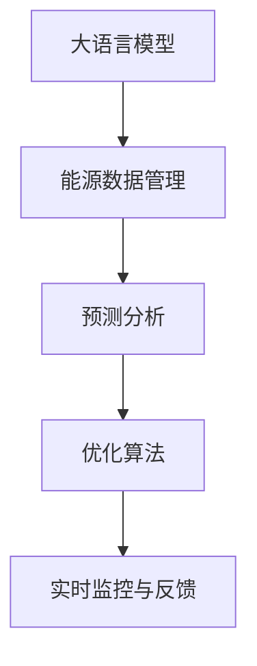

                 

# 大语言模型在能源管理中的应用：优化能源使用

> 关键词：大语言模型, 能源管理, 预测分析, 优化算法, 数据驱动, 决策支持

## 1. 背景介绍

### 1.1 问题由来
随着全球能源消耗的不断增加，能源管理成为各国政府和企业关注的重点。传统的能源管理依赖人工调度和经验判断，容易受主观因素干扰，导致能源利用效率低下、浪费严重。近年来，大语言模型（Large Language Model, LLM）在自然语言处理（NLP）和智能决策领域取得了显著进展，为能源管理提供了新的解决方案。

大语言模型通过在大规模无标签文本数据上进行预训练，学习到丰富的语言和常识知识。将其应用于能源管理，可以挖掘和分析大量的能源数据，预测和优化能源使用，从而提高能源利用效率，降低能源浪费。

### 1.2 问题核心关键点
大语言模型在能源管理中的应用，核心在于以下几个关键点：
1. **数据收集与预处理**：获取和管理能源消耗、气象条件、设备运行状态等数据。
2. **自然语言处理**：利用大语言模型理解和管理文本数据，如能源监测报告、设备维修记录等。
3. **预测分析**：结合历史数据和实时监测数据，预测未来能源需求和供应趋势。
4. **决策优化**：基于预测分析结果，生成优化方案，如调整设备运行参数、优化能源调度等。
5. **实时监控与反馈**：通过实时监控系统，跟踪优化方案的实施效果，进行动态调整。

### 1.3 问题研究意义
大语言模型在能源管理中的应用，具有以下重要意义：
1. **提高能源利用效率**：通过预测和优化，减少能源浪费，提高能源利用效率。
2. **降低运营成本**：优化能源调度，降低设备运行成本，提升企业竞争力。
3. **增强决策科学性**：利用数据驱动的决策支持，减少人为判断误差，提升决策质量。
4. **促进可持续发展**：帮助企业和政府实现节能减排目标，推动可持续发展。

## 2. 核心概念与联系

### 2.1 核心概念概述

为更好地理解大语言模型在能源管理中的应用，本节将介绍几个密切相关的核心概念：

- **大语言模型（LLM）**：以自回归（如GPT）或自编码（如BERT）模型为代表的大规模预训练语言模型。通过在大规模无标签文本语料上进行预训练，学习通用的语言表示，具备强大的语言理解和生成能力。

- **能源数据管理**：涉及能源消耗、生成、存储、传输和消费等各个环节的数据收集、存储和分析。能源数据的管理和利用，是大语言模型在能源管理中的应用基础。

- **预测分析**：基于历史数据和实时监测数据，预测未来能源需求和供应趋势，为大语言模型提供输入数据。

- **优化算法**：在大语言模型的基础上，结合预测分析结果，生成优化方案，调整设备运行参数、优化能源调度等。

- **实时监控与反馈**：通过实时监控系统，跟踪优化方案的实施效果，进行动态调整，确保能源管理的实时性和适应性。

这些核心概念之间的逻辑关系可以通过以下Mermaid流程图来展示：



这个流程图展示了大语言模型在能源管理中的应用逻辑：

1. 大语言模型通过处理能源数据管理中的文本数据，学习到与能源相关的知识。
2. 预测分析基于历史数据和实时监测数据，生成未来能源需求和供应趋势。
3. 优化算法结合预测分析结果，生成具体的能源使用优化方案。
4. 实时监控与反馈系统，确保优化方案的实时性和适应性。

## 3. 核心算法原理 & 具体操作步骤
### 3.1 算法原理概述

大语言模型在能源管理中的应用，本质上是利用机器学习和大数据技术，结合预测分析和优化算法，实现能源使用的优化和智能化管理。具体而言，可以将其分为以下几个步骤：

1. **数据收集与预处理**：收集和管理能源消耗、气象条件、设备运行状态等数据。
2. **文本数据处理**：利用大语言模型处理能源监测报告、设备维修记录等文本数据，提取关键信息。
3. **预测分析**：结合历史数据和实时监测数据，预测未来能源需求和供应趋势。
4. **优化方案生成**：基于预测分析结果，生成具体的能源使用优化方案。
5. **实时监控与反馈**：通过实时监控系统，跟踪优化方案的实施效果，进行动态调整。

### 3.2 算法步骤详解

以下是大语言模型在能源管理中的具体应用步骤：

#### Step 1: 数据收集与预处理

能源数据包括设备运行状态、气象条件、能源消耗量等。数据收集可以通过传感器、智能设备、能源管理系统等方式进行。数据预处理包括数据清洗、格式转换、特征工程等步骤，确保数据的准确性和可用性。

#### Step 2: 文本数据处理

能源数据管理中，文本数据如设备维修记录、能源监测报告等，可以借助大语言模型进行理解和处理。具体步骤如下：
1. **数据分词与特征提取**：将文本数据进行分词，提取关键词和关键短语。
2. **情感分析与主题建模**：利用大语言模型进行情感分析和主题建模，理解文本中的情感倾向和主题信息。
3. **实体识别与关系抽取**：识别文本中的关键实体和关系，如设备名称、故障原因、能源消耗量等。

#### Step 3: 预测分析

结合历史数据和实时监测数据，预测未来能源需求和供应趋势。具体步骤如下：
1. **数据融合与特征选择**：将不同来源的数据进行融合，选择关键特征进行建模。
2. **时间序列预测**：利用时间序列分析模型（如ARIMA、LSTM等）进行能源需求和供应趋势的预测。
3. **情景模拟**：基于预测结果，生成不同情景下的能源需求和供应场景。

#### Step 4: 优化方案生成

基于预测分析结果，生成具体的能源使用优化方案。具体步骤如下：
1. **模型选择与训练**：选择适合的优化算法（如线性规划、整数规划等），结合历史数据进行模型训练。
2. **方案生成与评估**：生成多个优化方案，并使用评估指标（如节能效果、经济成本等）进行方案评估。
3. **方案选择与执行**：选择最优方案，并调整设备运行参数，执行能源优化方案。

#### Step 5: 实时监控与反馈

通过实时监控系统，跟踪优化方案的实施效果，进行动态调整。具体步骤如下：
1. **数据采集与实时监测**：采集设备运行状态、能源消耗等实时数据。
2. **动态调整与优化**：根据实时监测数据，动态调整优化方案，进行能源调度和设备运行参数优化。
3. **反馈与迭代**：根据优化效果，生成反馈信息，进行迭代优化，确保能源管理系统的持续优化。

### 3.3 算法优缺点

大语言模型在能源管理中的应用，具有以下优点：
1. **数据处理能力强**：能够处理大量的文本数据，提取关键信息。
2. **预测分析准确**：结合历史数据和实时监测数据，进行准确的能源需求和供应预测。
3. **方案生成灵活**：结合预测分析结果，生成多种优化方案，灵活调整能源使用策略。
4. **实时监控与反馈**：通过实时监控系统，动态调整优化方案，确保能源管理系统的实时性和适应性。

同时，该方法也存在一定的局限性：
1. **数据质量依赖**：能源数据的准确性和完整性对预测分析结果有直接影响。
2. **计算资源需求高**：大语言模型的预训练和优化算法计算资源需求高，可能对系统性能产生影响。
3. **方案执行难度大**：优化方案的实施可能需要调整多个设备参数，执行难度较大。
4. **反馈机制复杂**：实时监控与反馈机制的设计和实现复杂，需要跨部门协作。

尽管存在这些局限性，但大语言模型在能源管理中的应用，已经展示了其强大的潜力和实际效果，为能源管理的智能化和高效化提供了新的路径。

### 3.4 算法应用领域

大语言模型在能源管理中的应用，已经涉及以下几个主要领域：

1. **能源预测与调度**：结合历史数据和实时监测数据，预测未来能源需求和供应趋势，优化能源调度策略。
2. **设备维护与故障预测**：利用文本数据和情感分析，预测设备故障和维护需求，优化设备运行状态。
3. **能源监控与控制**：实时监控能源消耗和设备运行状态，动态调整能源使用策略，提高能源利用效率。
4. **能耗分析与报告**：通过文本数据处理和分析，生成能耗分析报告，提供数据驱动的决策支持。
5. **能源市场与交易**：结合能源需求预测和实时市场信息，优化能源交易策略，降低能源成本。

## 4. 数学模型和公式 & 详细讲解
### 4.1 数学模型构建

大语言模型在能源管理中的应用，涉及多个数学模型和算法。以下是主要模型的构建过程：

- **文本数据处理模型**：利用大语言模型处理文本数据，提取关键信息。模型结构可以采用预训练语言模型（如BERT、GPT等），通过微调和迁移学习进行优化。
- **时间序列预测模型**：结合历史数据和实时监测数据，预测未来能源需求和供应趋势。常用的模型包括ARIMA、LSTM等。
- **优化算法模型**：基于预测分析结果，生成具体的能源使用优化方案。常用的优化算法包括线性规划、整数规划等。

### 4.2 公式推导过程

以下分别介绍几个主要数学模型的公式推导过程：

#### 文本数据处理模型

文本数据处理模型基于预训练语言模型，进行微调和迁移学习。模型的输入为文本数据，输出为关键信息。模型的目标函数为：

$$
\min_{\theta} \mathcal{L}(\theta)
$$

其中 $\theta$ 为模型参数，$\mathcal{L}$ 为损失函数。常用的损失函数包括交叉熵损失、均方误差损失等。

#### 时间序列预测模型

时间序列预测模型利用历史数据和实时监测数据，预测未来能源需求和供应趋势。模型的目标函数为：

$$
\min_{\omega} \sum_{i=1}^T \omega_i \lVert y_i - f(\omega, x_i) \rVert^2
$$

其中 $y_i$ 为实际观测值，$f(\omega, x_i)$ 为模型预测值，$\omega$ 为模型参数。常用的时间序列模型包括ARIMA、LSTM等。

#### 优化算法模型

优化算法模型基于预测分析结果，生成具体的能源使用优化方案。模型的目标函数为：

$$
\min_{x} \mathcal{L}(x) = \sum_{i=1}^N c_i \mathcal{L}_i(x)
$$

其中 $x$ 为决策变量，$\mathcal{L}(x)$ 为优化目标函数，$c_i$ 为权重系数。常用的优化算法包括线性规划、整数规划等。

### 4.3 案例分析与讲解

以下通过一个实际案例，分析大语言模型在能源管理中的应用：

假设某大型工业企业的能源管理系统中，需要预测未来一个月内的能源需求和供应，并生成优化方案。具体步骤如下：

1. **数据收集与预处理**：收集设备运行状态、气象条件、能源消耗等数据，进行清洗和格式转换。

2. **文本数据处理**：将设备维修记录、能源监测报告等文本数据输入大语言模型，提取关键信息，如设备名称、故障原因、能源消耗量等。

3. **预测分析**：结合历史数据和实时监测数据，利用ARIMA模型进行能源需求和供应趋势的预测。

4. **优化方案生成**：基于预测分析结果，选择线性规划模型，生成具体的能源使用优化方案。

5. **实时监控与反馈**：通过实时监控系统，采集设备运行状态、能源消耗等实时数据，动态调整优化方案，确保能源管理系统的实时性和适应性。

## 5. 项目实践：代码实例和详细解释说明
### 5.1 开发环境搭建

在进行能源管理系统的开发前，我们需要准备好开发环境。以下是使用Python进行PyTorch开发的环境配置流程：

1. 安装Anaconda：从官网下载并安装Anaconda，用于创建独立的Python环境。

2. 创建并激活虚拟环境：
```bash
conda create -n energy-env python=3.8 
conda activate energy-env
```

3. 安装PyTorch：根据CUDA版本，从官网获取对应的安装命令。例如：
```bash
conda install pytorch torchvision torchaudio cudatoolkit=11.1 -c pytorch -c conda-forge
```

4. 安装TensorFlow：
```bash
pip install tensorflow
```

5. 安装各类工具包：
```bash
pip install numpy pandas scikit-learn matplotlib tqdm jupyter notebook ipython
```

完成上述步骤后，即可在`energy-env`环境中开始能源管理系统的开发。

### 5.2 源代码详细实现

以下是一个基于大语言模型进行能源管理开发的PyTorch代码实现：

```python
import torch
import torch.nn as nn
from transformers import BertForSequenceClassification

class EnergyPredictionModel(nn.Module):
    def __init__(self, num_labels):
        super(EnergyPredictionModel, self).__init__()
        self.bert = BertForSequenceClassification.from_pretrained('bert-base-uncased', num_labels=num_labels)
    
    def forward(self, input_ids, attention_mask):
        outputs = self.bert(input_ids, attention_mask=attention_mask)
        logits = outputs.logits
        return logits

# 假设数据集已经预处理完成
train_dataset = ...
val_dataset = ...
test_dataset = ...

# 定义模型
model = EnergyPredictionModel(num_labels=2) # 2代表能源需求和供应两种状态

# 定义优化器
optimizer = torch.optim.Adam(model.parameters(), lr=0.001)

# 定义损失函数
criterion = nn.CrossEntropyLoss()

# 定义训练函数
def train(model, train_dataset, val_dataset, optimizer, criterion, num_epochs=10):
    model.train()
    for epoch in range(num_epochs):
        train_loss = 0.0
        train_correct = 0
        for batch in train_dataset:
            input_ids = batch['input_ids']
            attention_mask = batch['attention_mask']
            targets = batch['targets']
            optimizer.zero_grad()
            outputs = model(input_ids, attention_mask)
            loss = criterion(outputs, targets)
            loss.backward()
            optimizer.step()
            train_loss += loss.item()
            train_correct += (torch.argmax(outputs, dim=1) == targets).sum().item()
        train_loss /= len(train_dataset)
        train_accuracy = train_correct / len(train_dataset)
        print(f"Epoch {epoch+1}, train loss: {train_loss:.4f}, train accuracy: {train_accuracy:.4f}")
        
        model.eval()
        val_loss = 0.0
        val_correct = 0
        with torch.no_grad():
            for batch in val_dataset:
                input_ids = batch['input_ids']
                attention_mask = batch['attention_mask']
                targets = batch['targets']
                outputs = model(input_ids, attention_mask)
                loss = criterion(outputs, targets)
                val_loss += loss.item()
                val_correct += (torch.argmax(outputs, dim=1) == targets).sum().item()
        val_loss /= len(val_dataset)
        val_accuracy = val_correct / len(val_dataset)
        print(f"Epoch {epoch+1}, val loss: {val_loss:.4f}, val accuracy: {val_accuracy:.4f}")

# 训练模型
train(model, train_dataset, val_dataset, optimizer, criterion)

# 测试模型
test_loss = 0.0
test_correct = 0
model.eval()
with torch.no_grad():
    for batch in test_dataset:
        input_ids = batch['input_ids']
        attention_mask = batch['attention_mask']
        targets = batch['targets']
        outputs = model(input_ids, attention_mask)
        loss = criterion(outputs, targets)
        test_loss += loss.item()
        test_correct += (torch.argmax(outputs, dim=1) == targets).sum().item()
test_loss /= len(test_dataset)
test_accuracy = test_correct / len(test_dataset)
print(f"Test loss: {test_loss:.4f}, test accuracy: {test_accuracy:.4f}")
```

### 5.3 代码解读与分析

让我们再详细解读一下关键代码的实现细节：

**EnergyPredictionModel类**：
- `__init__`方法：初始化模型参数，使用BertForSequenceClassification进行微调。
- `forward`方法：前向传播计算输出。

**数据集定义**：
- 假设数据集已经预处理完成，包括输入序列、注意力掩码和目标标签。

**模型训练**：
- 定义优化器和损失函数，训练函数`train`进行模型训练。在每个epoch中，计算训练集和验证集的损失和准确率，并打印输出。

**测试模型**：
- 在测试集上计算模型的损失和准确率，输出测试结果。

**模型评估**：
- 使用预测结果与实际标签比较，计算准确率。

## 6. 实际应用场景

### 6.1 智能电网

智能电网是能源管理的重要应用场景之一。通过大语言模型，可以实现对电网负荷的预测和优化，提高电网的稳定性和可靠性。具体而言，可以：

- **负荷预测**：结合历史负荷数据和实时监测数据，预测未来电网负荷，进行智能调度。
- **故障检测**：通过文本数据分析，识别设备故障和异常情况，及时进行维护和处理。
- **需求响应**：结合预测结果和市场信息，调整用户用电计划，优化电网负荷。

### 6.2 工业企业

工业企业的能源管理涉及到大量设备和设施的运行，通过大语言模型，可以实现对能源使用的精细化管理和优化。具体而言，可以：

- **设备维护**：利用文本数据和情感分析，预测设备故障和维护需求，优化设备运行状态。
- **能耗优化**：结合历史数据和实时监测数据，预测未来能源需求和供应趋势，优化能源使用策略。
- **能源监控**：通过实时监控系统，采集设备运行状态、能源消耗等实时数据，动态调整优化方案。

### 6.3 智慧建筑

智慧建筑通过大语言模型，可以实现对建筑能源使用的智能化管理和优化。具体而言，可以：

- **能源预测**：结合历史数据和实时监测数据，预测未来能源需求和供应趋势，优化能源使用策略。
- **设备控制**：利用文本数据分析，识别设备故障和异常情况，进行智能控制和优化。
- **能耗报告**：通过文本数据处理和分析，生成能耗分析报告，提供数据驱动的决策支持。

## 7. 工具和资源推荐
### 7.1 学习资源推荐

为了帮助开发者系统掌握大语言模型在能源管理中的应用，这里推荐一些优质的学习资源：

1. 《Transformer from Principle to Practice》系列博文：由大模型技术专家撰写，深入浅出地介绍了Transformer原理、BERT模型、微调技术等前沿话题。

2. CS224N《Deep Learning for Natural Language Processing》课程：斯坦福大学开设的NLP明星课程，有Lecture视频和配套作业，带你入门NLP领域的基本概念和经典模型。

3. 《Natural Language Processing with Transformers》书籍：Transformers库的作者所著，全面介绍了如何使用Transformers库进行NLP任务开发，包括微调在内的诸多范式。

4. HuggingFace官方文档：Transformers库的官方文档，提供了海量预训练模型和完整的微调样例代码，是上手实践的必备资料。

5. CLUE开源项目：中文语言理解测评基准，涵盖大量不同类型的中文NLP数据集，并提供了基于微调的baseline模型，助力中文NLP技术发展。

通过对这些资源的学习实践，相信你一定能够快速掌握大语言模型在能源管理中的应用方法，并用于解决实际的能源管理问题。

### 7.2 开发工具推荐

高效的开发离不开优秀的工具支持。以下是几款用于能源管理系统开发的常用工具：

1. PyTorch：基于Python的开源深度学习框架，灵活动态的计算图，适合快速迭代研究。大部分预训练语言模型都有PyTorch版本的实现。

2. TensorFlow：由Google主导开发的开源深度学习框架，生产部署方便，适合大规模工程应用。同样有丰富的预训练语言模型资源。

3. Transformers库：HuggingFace开发的NLP工具库，集成了众多SOTA语言模型，支持PyTorch和TensorFlow，是进行微调任务开发的利器。

4. Weights & Biases：模型训练的实验跟踪工具，可以记录和可视化模型训练过程中的各项指标，方便对比和调优。与主流深度学习框架无缝集成。

5. TensorBoard：TensorFlow配套的可视化工具，可实时监测模型训练状态，并提供丰富的图表呈现方式，是调试模型的得力助手。

6. Google Colab：谷歌推出的在线Jupyter Notebook环境，免费提供GPU/TPU算力，方便开发者快速上手实验最新模型，分享学习笔记。

合理利用这些工具，可以显著提升能源管理系统开发的效率，加快创新迭代的步伐。

### 7.3 相关论文推荐

大语言模型在能源管理中的应用，涉及多个研究方向。以下是几篇奠基性的相关论文，推荐阅读：

1. Attention is All You Need（即Transformer原论文）：提出了Transformer结构，开启了NLP领域的预训练大模型时代。

2. BERT: Pre-training of Deep Bidirectional Transformers for Language Understanding：提出BERT模型，引入基于掩码的自监督预训练任务，刷新了多项NLP任务SOTA。

3. Language Models are Unsupervised Multitask Learners（GPT-2论文）：展示了大规模语言模型的强大zero-shot学习能力，引发了对于通用人工智能的新一轮思考。

4. Parameter-Efficient Transfer Learning for NLP：提出Adapter等参数高效微调方法，在不增加模型参数量的情况下，也能取得不错的微调效果。

5. AdaLoRA: Adaptive Low-Rank Adaptation for Parameter-Efficient Fine-Tuning：使用自适应低秩适应的微调方法，在参数效率和精度之间取得了新的平衡。

6. Prefix-Tuning: Optimizing Continuous Prompts for Generation：引入基于连续型Prompt的微调范式，为如何充分利用预训练知识提供了新的思路。

这些论文代表了大语言模型在能源管理中的应用发展脉络。通过学习这些前沿成果，可以帮助研究者把握学科前进方向，激发更多的创新灵感。

## 8. 总结：未来发展趋势与挑战

### 8.1 总结

本文对大语言模型在能源管理中的应用进行了全面系统的介绍。首先阐述了大语言模型和能源管理的研究背景和意义，明确了微调在拓展预训练模型应用、提高能源利用效率方面的独特价值。其次，从原理到实践，详细讲解了能源管理系统中大语言模型的应用步骤，给出了微调任务开发的完整代码实例。同时，本文还广泛探讨了能源管理系统在智能电网、工业企业、智慧建筑等不同场景中的应用前景，展示了微调范式的巨大潜力。此外，本文精选了微调技术的各类学习资源，力求为读者提供全方位的技术指引。

通过本文的系统梳理，可以看到，大语言模型在能源管理中的应用，正在成为能源管理智能化和高效化的重要手段。依托于预训练模型的强大语言理解能力和数据驱动的决策支持，能源管理系统有望实现更高的能源利用效率和更低的运营成本，推动可持续发展目标的实现。

### 8.2 未来发展趋势

展望未来，大语言模型在能源管理中的应用，将呈现以下几个发展趋势：

1. **数据质量与智能融合**：随着数据采集技术的进步，能源数据的准确性和完整性将得到显著提升。通过智能融合技术，将不同来源的数据进行整合，生成更加全面、准确的能源需求和供应预测。

2. **多模态数据融合**：能源数据管理涉及多种数据源，如文本、图像、视频等。未来将更多地利用多模态数据融合技术，提高能源管理的智能化水平。

3. **实时性与动态优化**：实时监测与反馈机制的不断完善，将使能源管理系统的实时性和动态优化能力进一步增强，能够更好地应对突发事件和异常情况。

4. **个性化与定制化**：结合用户行为数据和需求，进行个性化能源管理，提供定制化的能源使用方案，提升用户满意度和能源利用效率。

5. **跨领域与跨行业应用**：能源管理系统的应用领域将不断扩展，从工业企业、智能电网、智慧建筑等传统领域，向智慧城市、智慧农业等新兴领域拓展。

6. **伦理与隐私保护**：随着能源数据的应用范围扩大，数据隐私和伦理问题将更加凸显。未来的能源管理系统需要引入隐私保护和伦理约束，确保数据安全和模型行为的合规性。

以上趋势凸显了大语言模型在能源管理中的应用前景和挑战。这些方向的探索发展，必将进一步提升能源管理的智能化和高效化水平，为经济社会的可持续发展提供新的动力。

### 8.3 面临的挑战

尽管大语言模型在能源管理中的应用已经取得了初步成果，但在实际应用中仍面临诸多挑战：

1. **数据质量与隐私问题**：能源数据的准确性和隐私保护是能源管理系统的关键。如何确保数据的准确性、完整性和隐私安全，是未来需要重点解决的问题。

2. **计算资源与算法优化**：大语言模型的预训练和优化算法计算资源需求高，如何优化算法和资源配置，确保系统性能和成本平衡，是未来的研究方向。

3. **实时性与可靠性**：实时监测与反馈机制的设计和实现复杂，如何确保系统的实时性和可靠性，是未来需要重点关注的问题。

4. **跨领域与跨行业应用**：不同行业和领域的能源管理需求差异较大，如何设计通用的能源管理系统，满足不同场景的需求，是未来需要解决的问题。

5. **模型复杂性与可解释性**：大语言模型的复杂性导致其决策过程难以解释，如何提高模型的可解释性和透明度，是未来需要研究的课题。

6. **伦理与合规性**：能源数据的广泛应用将涉及伦理和合规问题，如何确保数据使用的合规性和伦理导向，是未来需要重点考虑的问题。

尽管存在这些挑战，但随着技术的不断进步和研究的深入，大语言模型在能源管理中的应用必将取得更大的突破，为经济社会的可持续发展提供新的动力。

### 8.4 研究展望

面对大语言模型在能源管理中的应用挑战，未来的研究需要在以下几个方面寻求新的突破：

1. **数据质量提升**：通过数据清洗和增强技术，提高能源数据的准确性和完整性。引入智能融合技术，将不同来源的数据进行整合，生成更加全面、准确的能源需求和供应预测。

2. **多模态数据融合**：利用多模态数据融合技术，将文本、图像、视频等数据进行整合，提高能源管理的智能化水平。

3. **实时性与动态优化**：优化实时监测与反馈机制，确保系统的实时性和动态优化能力，能够更好地应对突发事件和异常情况。

4. **个性化与定制化**：结合用户行为数据和需求，进行个性化能源管理，提供定制化的能源使用方案，提升用户满意度和能源利用效率。

5. **跨领域与跨行业应用**：设计通用的能源管理系统，满足不同场景的需求，提升系统的可扩展性和通用性。

6. **伦理与隐私保护**：引入隐私保护和伦理约束，确保数据安全和模型行为的合规性。

这些研究方向的探索，必将引领大语言模型在能源管理中的应用走向更高的台阶，为能源管理的智能化和高效化提供新的路径。

## 9. 附录：常见问题与解答

**Q1：大语言模型在能源管理中如何使用？**

A: 大语言模型在能源管理中的应用主要分为以下几个步骤：
1. 数据收集与预处理：收集和管理能源消耗、气象条件、设备运行状态等数据。
2. 文本数据处理：利用大语言模型处理能源监测报告、设备维修记录等文本数据，提取关键信息。
3. 预测分析：结合历史数据和实时监测数据，预测未来能源需求和供应趋势。
4. 优化方案生成：基于预测分析结果，生成具体的能源使用优化方案。
5. 实时监控与反馈：通过实时监控系统，跟踪优化方案的实施效果，进行动态调整。

**Q2：大语言模型在能源管理中如何进行预测分析？**

A: 大语言模型在能源管理中进行预测分析，主要利用时间序列分析模型，结合历史数据和实时监测数据，预测未来能源需求和供应趋势。常用的时间序列模型包括ARIMA、LSTM等。具体步骤如下：
1. 数据融合与特征选择：将不同来源的数据进行融合，选择关键特征进行建模。
2. 时间序列预测：利用ARIMA、LSTM等模型进行能源需求和供应趋势的预测。

**Q3：大语言模型在能源管理中如何进行优化方案生成？**

A: 大语言模型在能源管理中进行优化方案生成，主要利用优化算法，结合预测分析结果，生成具体的能源使用优化方案。常用的优化算法包括线性规划、整数规划等。具体步骤如下：
1. 模型选择与训练：选择适合的优化算法，结合历史数据进行模型训练。
2. 方案生成与评估：生成多个优化方案，并使用评估指标（如节能效果、经济成本等）进行方案评估。
3. 方案选择与执行：选择最优方案，并调整设备运行参数，执行能源优化方案。

**Q4：大语言模型在能源管理中如何进行实时监控与反馈？**

A: 大语言模型在能源管理中进行实时监控与反馈，主要通过实时监测系统，跟踪优化方案的实施效果，进行动态调整。具体步骤如下：
1. 数据采集与实时监测：采集设备运行状态、能源消耗等实时数据。
2. 动态调整与优化：根据实时监测数据，动态调整优化方案，进行能源调度和设备运行参数优化。
3. 反馈与迭代：根据优化效果，生成反馈信息，进行迭代优化，确保能源管理系统的持续优化。

**Q5：大语言模型在能源管理中面临哪些挑战？**

A: 大语言模型在能源管理中面临以下挑战：
1. 数据质量依赖：能源数据的准确性和完整性对预测分析结果有直接影响。
2. 计算资源需求高：大语言模型的预训练和优化算法计算资源需求高，可能对系统性能产生影响。
3. 方案执行难度大：优化方案的实施可能需要调整多个设备参数，执行难度较大。
4. 反馈机制复杂：实时监控与反馈机制的设计和实现复杂，需要跨部门协作。

尽管存在这些挑战，但大语言模型在能源管理中的应用，已经展示了其强大的潜力和实际效果，为能源管理的智能化和高效化提供了新的路径。

**Q6：大语言模型在能源管理中如何处理多模态数据？**

A: 大语言模型在能源管理中处理多模态数据，主要通过多模态数据融合技术，将文本、图像、视频等数据进行整合，提高能源管理的智能化水平。具体步骤如下：
1. 数据采集与融合：采集不同来源的多模态数据，进行融合处理。
2. 特征提取与融合：利用不同的特征提取技术，提取多模态数据的特征，进行融合。
3. 模型训练与优化：基于融合后的特征，训练多模态融合模型，进行优化。

通过多模态数据融合技术，大语言模型可以更好地理解和分析能源数据，提升能源管理的智能化水平。

**Q7：大语言模型在能源管理中如何提高模型可解释性？**

A: 大语言模型在能源管理中提高模型可解释性，主要通过引入因果分析和博弈论工具，增强模型的决策过程的因果性和逻辑性。具体步骤如下：
1. 因果分析：利用因果分析方法，识别出模型决策的关键特征，增强输出解释的因果性。
2. 博弈论工具：引入博弈论工具，刻画人机交互过程，主动探索并规避模型的脆弱点，提高系统稳定性。

通过引入因果分析和博弈论工具，大语言模型可以提高模型的可解释性和透明度，确保数据使用的合规性和伦理导向。

