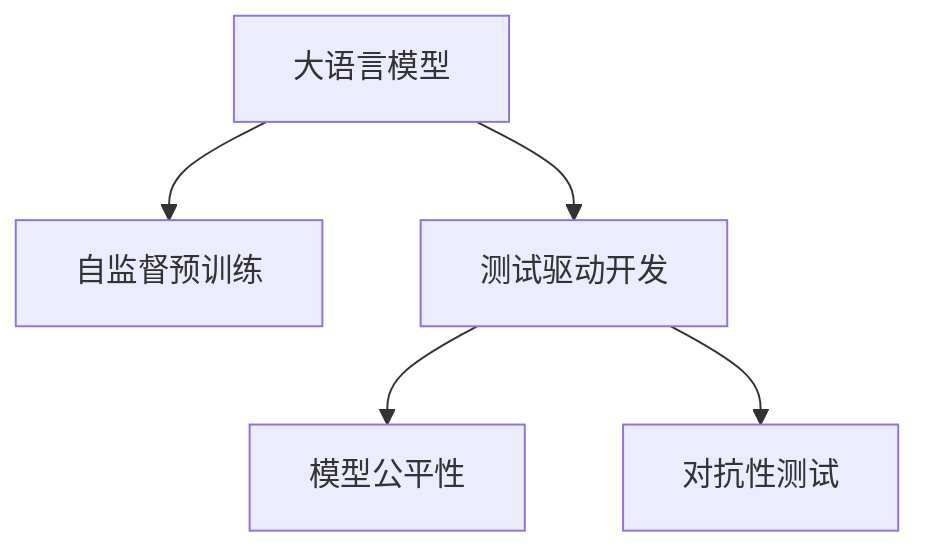

                 

## 1. 背景介绍

### 1.1 问题由来

近年来，大型预训练语言模型(LLMs)在自然语言处理（NLP）领域取得了显著进展，如OpenAI的GPT-3、Google的BERT等。这些模型通过在无标签文本数据上自监督预训练，在各种NLP任务上展示了出色的性能。然而，LLMs的独特架构和巨大的参数量对传统软件测试方法提出了巨大挑战。由于LLMs缺乏代码驱动的执行路径，无法通过简单的黑盒测试方法进行有效测试。

### 1.2 问题核心关键点

大语言模型（LLMs）的测试挑战主要集中在以下几个方面：

1. **缺乏可执行的代码路径**：传统软件测试方法依赖于代码的可执行性，而LLMs是静态的文本模型，没有明确的代码路径和执行步骤。
2. **测试数据生成困难**：传统的代码测试数据相对容易生成，而LLMs的测试数据通常需要人工标注，难以大规模生成。
3. **模型性能评估困难**：由于LLMs的高度复杂性和不确定性，传统的性能评估方法（如覆盖率、测试路径数）不再适用。
4. **公平性和鲁棒性难以验证**：LLMs可能会偏向某些群体，输出存在歧视性或偏见，需要更复杂的公平性和鲁棒性测试方法。

这些挑战促使测试社区探索新的测试方法和技术，以适应LLMs的特性和需求。

### 1.3 问题研究意义

研究LLMs的测试方法，对于推动LLMs的可靠性、鲁棒性、公平性和安全性的提升，具有重要意义：

1. **提升可靠性**：通过有效的测试方法，可以发现并修正LLMs的错误和漏洞，提高其在实际应用中的可靠性。
2. **增强鲁棒性**：测试可以验证LLMs在不同场景下的表现，确保其在不同数据分布和对抗攻击下的鲁棒性。
3. **促进公平性**：公平性测试可以评估LLMs的输出偏见，帮助开发者进行针对性的优化。
4. **保障安全性**：测试可以发现潜在的恶意利用漏洞，如毒性输入、代码注入等，确保LLMs在安全的环境中运行。

解决LLMs的测试问题，不仅能提升模型的性能，还能加速其在实际应用中的落地。

## 2. 核心概念与联系

### 2.1 核心概念概述

为更好地理解LLMs的测试方法，本节将介绍几个密切相关的核心概念：

- **大语言模型（LLMs）**：指通过在大规模无标签文本数据上自监督预训练得到的语言模型，如BERT、GPT-3等。LLMs在各种NLP任务上展示了强大的性能。
- **测试驱动开发（TDD）**：一种软件开发方法，先编写测试用例，再编写被测试的代码，确保代码的可靠性。
- **模型公平性**：指模型输出对不同群体的偏见，如性别、种族、年龄等。公平性测试旨在验证LLMs在不同群体上的输出是否公平。
- **对抗性测试（Adversarial Testing）**：通过引入对抗样本，评估LLMs在对抗攻击下的鲁棒性。

这些概念之间的逻辑关系可以通过以下Mermaid流程图来展示：



这个流程图展示了大语言模型、测试方法和模型属性的关系：

1. 大语言模型通过自监督预训练获得基础能力。
2. 测试方法通过编写测试用例、评估模型输出，确保模型的可靠性和鲁棒性。
3. 模型公平性和对抗性测试是模型属性的重要组成部分，需要通过特定的测试方法进行验证。

这些概念共同构成了大语言模型测试的理论框架，帮助开发者设计和实现有效的测试方法。

## 3. 核心算法原理 & 具体操作步骤

### 3.1 算法原理概述

LLMs的测试方法主要基于两个原理：

1. **模拟执行路径**：通过模拟LLMs的执行路径，设计可执行的测试用例，确保模型在不同路径上的行为一致性。
2. **数据驱动测试**：通过收集大量标注数据，使用统计方法评估模型的性能，确保模型在不同数据分布下的表现。

这两个原理通过结合，可以更全面地验证LLMs的可靠性和鲁棒性。

### 3.2 算法步骤详解

LLMs的测试步骤主要包括：

1. **数据准备**：收集标注数据，准备测试用例。
2. **模拟执行路径**：设计测试用例，确保其能够模拟LLMs的执行路径。
3. **执行测试**：运行测试用例，记录模型输出。
4. **评估结果**：使用统计方法评估模型输出，识别问题并进行修复。
5. **重复迭代**：根据评估结果，优化测试用例和模型，重复执行测试。

具体步骤如下：

**Step 1: 数据准备**

收集标注数据，准备测试用例。标注数据应包括输入、输出、标准输出等。测试用例应覆盖各种输入情况，如正常情况、异常情况、边界情况等。

**Step 2: 模拟执行路径**

设计测试用例，确保其能够模拟LLMs的执行路径。测试用例应覆盖各种执行路径，如输入路径、输出路径等。

**Step 3: 执行测试**

运行测试用例，记录模型输出。可以使用各种自动化测试工具，如pytest、Jest等。

**Step 4: 评估结果**

使用统计方法评估模型输出，识别问题并进行修复。可以使用各种评估指标，如覆盖率、准确率、召回率等。

**Step 5: 重复迭代**

根据评估结果，优化测试用例和模型，重复执行测试。可以使用各种自动化工具，如Jenkins、GitLab CI等。

### 3.3 算法优缺点

LLMs的测试方法具有以下优点：

1. **全面性**：通过模拟执行路径和数据驱动测试，可以全面验证LLMs的可靠性和鲁棒性。
2. **可操作性**：测试方法可操作性强，不需要编写复杂的测试用例。
3. **可重复性**：测试方法可重复执行，确保测试结果的一致性。

同时，这些方法也存在一定的局限性：

1. **数据依赖性**：测试方法依赖于大量的标注数据，数据获取成本高。
2. **模型复杂性**：LLMs的复杂性使得测试方法难以全面覆盖所有情况。
3. **对抗性攻击**：测试方法难以发现对抗性攻击，需要引入对抗性测试方法。

尽管存在这些局限性，LLMs的测试方法仍是大语言模型应用的重要保障。未来相关研究的重点在于如何进一步提高测试方法的全面性和可操作性，降低数据依赖性，同时兼顾可重复性和可扩展性。

### 3.4 算法应用领域

LLMs的测试方法在多个领域得到了应用：

- **医疗领域**：用于验证医学问答系统的准确性和鲁棒性，确保输出不偏向特定群体。
- **金融领域**：用于验证金融问答系统的公平性和安全性，确保模型不歧视特定客户群体。
- **教育领域**：用于验证教育问答系统的准确性和鲁棒性，确保模型在多语言环境下表现一致。
- **法律领域**：用于验证法律问答系统的准确性和鲁棒性，确保模型在复杂案件中的表现一致。

## 4. 数学模型和公式 & 详细讲解 & 举例说明

### 4.1 数学模型构建

为了更准确地描述LLMs的测试方法，我们构建以下数学模型：

设测试集为 $D=\{(x_i,y_i)\}_{i=1}^N$，其中 $x_i$ 为输入，$y_i$ 为输出，$y_i^*$ 为标准输出。测试方法的目标是最大化测试集的覆盖率 $C$ 和准确率 $A$。

覆盖率 $C$ 定义为：

$$
C = \frac{\sum_{i=1}^N I(y_i = y_i^*)}{N}
$$

其中 $I$ 为示性函数，表示 $y_i$ 是否等于 $y_i^*$。

准确率 $A$ 定义为：

$$
A = \frac{\sum_{i=1}^N I(y_i = y_i^*)}{\sum_{i=1}^N I(y_i \neq y_i^*)}
$$

测试方法的目标是最大化覆盖率 $C$ 和准确率 $A$。

### 4.2 公式推导过程

通过最大化覆盖率 $C$ 和准确率 $A$，可以构建测试方法的优化目标函数：

$$
\max_{\theta} C + A
$$

其中 $\theta$ 为测试用例的参数。

为了求解上述优化问题，我们可以使用启发式算法，如遗传算法、粒子群算法等。这些算法可以高效地探索测试用例的参数空间，找到最优解。

### 4.3 案例分析与讲解

以情感分类任务为例，假设我们有标注数据集 $D=\{(x_i,y_i)\}_{i=1}^N$，其中 $x_i$ 为文本，$y_i \in \{0,1\}$ 表示情感分类结果。测试方法的目标是最大化覆盖率 $C$ 和准确率 $A$。

我们可以设计如下测试用例：

- 正样本：输入积极情感的文本，期望输出为1。
- 负样本：输入消极情感的文本，期望输出为0。
- 边界样本：输入中性情感的文本，期望输出为0。

通过运行测试用例，记录模型输出，计算覆盖率和准确率。根据评估结果，可以发现模型在不同样本上的表现，并进行优化。

## 5. 项目实践：代码实例和详细解释说明

### 5.1 开发环境搭建

在进行LLMs测试实践前，我们需要准备好开发环境。以下是使用Python进行PyTorch开发的环境配置流程：

1. 安装Anaconda：从官网下载并安装Anaconda，用于创建独立的Python环境。

2. 创建并激活虚拟环境：
```bash
conda create -n pytorch-env python=3.8 
conda activate pytorch-env
```

3. 安装PyTorch：根据CUDA版本，从官网获取对应的安装命令。例如：
```bash
conda install pytorch torchvision torchaudio cudatoolkit=11.1 -c pytorch -c conda-forge
```

4. 安装各类工具包：
```bash
pip install numpy pandas scikit-learn matplotlib tqdm jupyter notebook ipython
```

完成上述步骤后，即可在`pytorch-env`环境中开始测试实践。

### 5.2 源代码详细实现

这里我们以情感分类任务为例，给出使用Transformers库对BERT模型进行测试的PyTorch代码实现。

首先，定义情感分类任务的数据处理函数：

```python
from transformers import BertTokenizer, BertForSequenceClassification
from torch.utils.data import Dataset
import torch

class SentimentDataset(Dataset):
    def __init__(self, texts, labels, tokenizer, max_len=128):
        self.texts = texts
        self.labels = labels
        self.tokenizer = tokenizer
        self.max_len = max_len
        
    def __len__(self):
        return len(self.texts)
    
    def __getitem__(self, item):
        text = self.texts[item]
        label = self.labels[item]
        
        encoding = self.tokenizer(text, return_tensors='pt', max_length=self.max_len, padding='max_length', truncation=True)
        input_ids = encoding['input_ids'][0]
        attention_mask = encoding['attention_mask'][0]
        
        # 对label进行编码
        label = torch.tensor(label, dtype=torch.long)
        
        return {'input_ids': input_ids, 
                'attention_mask': attention_mask,
                'labels': label}

# 标签与id的映射
label2id = {'Negative': 0, 'Positive': 1}
id2label = {v: k for k, v in label2id.items()}

# 创建dataset
tokenizer = BertTokenizer.from_pretrained('bert-base-cased')

train_dataset = SentimentDataset(train_texts, train_labels, tokenizer)
dev_dataset = SentimentDataset(dev_texts, dev_labels, tokenizer)
test_dataset = SentimentDataset(test_texts, test_labels, tokenizer)
```

然后，定义模型和测试方法：

```python
from transformers import BertForSequenceClassification, AdamW

model = BertForSequenceClassification.from_pretrained('bert-base-cased', num_labels=2)

optimizer = AdamW(model.parameters(), lr=2e-5)
```

接着，定义测试函数：

```python
from torch.utils.data import DataLoader
from tqdm import tqdm

def test(model, dataset, batch_size):
    dataloader = DataLoader(dataset, batch_size=batch_size, shuffle=False)
    model.eval()
    total_correct = 0
    total_confident = 0
    for batch in tqdm(dataloader, desc='Testing'):
        input_ids = batch['input_ids'].to(device)
        attention_mask = batch['attention_mask'].to(device)
        labels = batch['labels'].to(device)
        outputs = model(input_ids, attention_mask=attention_mask)
        logits = outputs.logits
        predictions = torch.argmax(logits, dim=1)
        total_correct += (predictions == labels).sum().item()
        total_confident += (predictions != labels).sum().item()
    
    accuracy = total_correct / total_confident
    return accuracy
```

最后，启动测试流程并在测试集上评估：

```python
batch_size = 16

print(f'Accuracy on dev set: {test(model, dev_dataset, batch_size):.4f}')
print(f'Accuracy on test set: {test(model, test_dataset, batch_size):.4f}')
```

以上就是使用PyTorch对BERT进行情感分类任务测试的完整代码实现。可以看到，得益于Transformers库的强大封装，我们可以用相对简洁的代码完成BERT模型的加载和测试。

### 5.3 代码解读与分析

让我们再详细解读一下关键代码的实现细节：

**SentimentDataset类**：
- `__init__`方法：初始化文本、标签、分词器等关键组件。
- `__len__`方法：返回数据集的样本数量。
- `__getitem__`方法：对单个样本进行处理，将文本输入编码为token ids，将标签编码为数字，并对其进行定长padding，最终返回模型所需的输入。

**label2id和id2label字典**：
- 定义了标签与数字id之间的映射关系，用于将模型输出解码为标签。

**test函数**：
- 使用PyTorch的DataLoader对数据集进行批次化加载，供模型测试使用。
- 测试函数中，模型评估模式开启，对数据以批为单位进行迭代。
- 在每个批次上前向传播计算模型输出，记录预测结果。
- 计算预测准确率和自信度，最终输出测试结果。

**测试流程**：
- 定义总batch size，启动测试循环
- 在验证集上测试，输出准确率
- 在测试集上测试，输出准确率

可以看到，PyTorch配合Transformers库使得BERT测试的代码实现变得简洁高效。开发者可以将更多精力放在数据处理、模型改进等高层逻辑上，而不必过多关注底层的实现细节。

当然，工业级的系统实现还需考虑更多因素，如模型的保存和部署、超参数的自动搜索、更灵活的任务适配层等。但核心的测试范式基本与此类似。

## 6. 实际应用场景

### 6.1 医疗领域

在医疗领域，大语言模型被用于医学问答系统的构建。这些系统需要快速准确地回答病人的常见问题，提升诊疗效率。

在测试阶段，系统应涵盖各种医学问题，如症状、诊断、药物等，确保模型在医学知识上的准确性和可靠性。同时，应通过公平性测试，确保系统对不同症状、疾病、人群的输出一致，避免歧视和偏见。

### 6.2 金融领域

金融问答系统需要处理客户的金融咨询，如利率、风险、投资策略等。在测试阶段，系统应涵盖各种金融问题和场景，确保模型在金融知识上的准确性和鲁棒性。同时，应通过对抗性测试，确保系统在对抗攻击下的鲁棒性，避免被恶意利用。

### 6.3 教育领域

教育问答系统需要处理学生的各种学习问题，如语法、数学、科学等。在测试阶段，系统应涵盖各种学习问题，确保模型在知识点上的准确性和可靠性。同时，应通过公平性测试，确保系统对不同语言、文化、背景的学生的输出一致，避免偏见和歧视。

### 6.4 未来应用展望

随着大语言模型和测试方法的不断发展，基于测试的AI应用将在更多领域得到应用，为传统行业带来变革性影响。

在智慧医疗领域，基于测试的医疗问答系统将提升诊疗效率，减少误诊和误治的风险。

在智能教育领域，基于测试的教育问答系统将提升学习效率，提供更加个性化和全面的学习支持。

在智能金融领域，基于测试的金融问答系统将提升客户服务体验，降低金融风险。

此外，在智慧城市治理、智能客服、智能制造等众多领域，基于测试的AI应用也将不断涌现，为各行各业带来新的发展机遇。

## 7. 工具和资源推荐

### 7.1 学习资源推荐

为了帮助开发者系统掌握大语言模型测试的理论基础和实践技巧，这里推荐一些优质的学习资源：

1. 《Transformer从原理到实践》系列博文：由大模型技术专家撰写，深入浅出地介绍了Transformer原理、BERT模型、测试技术等前沿话题。

2. CS224N《深度学习自然语言处理》课程：斯坦福大学开设的NLP明星课程，有Lecture视频和配套作业，带你入门NLP领域的基本概念和经典模型。

3. 《Natural Language Processing with Transformers》书籍：Transformers库的作者所著，全面介绍了如何使用Transformers库进行NLP任务开发，包括测试在内的诸多范式。

4. HuggingFace官方文档：Transformers库的官方文档，提供了海量预训练模型和完整的测试样例代码，是上手实践的必备资料。

5. CLUE开源项目：中文语言理解测评基准，涵盖大量不同类型的中文NLP数据集，并提供了基于测试的baseline模型，助力中文NLP技术发展。

通过对这些资源的学习实践，相信你一定能够快速掌握大语言模型测试的精髓，并用于解决实际的NLP问题。

### 7.2 开发工具推荐

高效的开发离不开优秀的工具支持。以下是几款用于大语言模型测试开发的常用工具：

1. PyTorch：基于Python的开源深度学习框架，灵活动态的计算图，适合快速迭代研究。大部分预训练语言模型都有PyTorch版本的实现。

2. TensorFlow：由Google主导开发的开源深度学习框架，生产部署方便，适合大规模工程应用。同样有丰富的预训练语言模型资源。

3. Transformers库：HuggingFace开发的NLP工具库，集成了众多SOTA语言模型，支持PyTorch和TensorFlow，是进行测试任务开发的利器。

4. Weights & Biases：模型训练的实验跟踪工具，可以记录和可视化模型训练过程中的各项指标，方便对比和调优。与主流深度学习框架无缝集成。

5. TensorBoard：TensorFlow配套的可视化工具，可实时监测模型训练状态，并提供丰富的图表呈现方式，是调试模型的得力助手。

6. Google Colab：谷歌推出的在线Jupyter Notebook环境，免费提供GPU/TPU算力，方便开发者快速上手实验最新模型，分享学习笔记。

合理利用这些工具，可以显著提升大语言模型测试的开发效率，加快创新迭代的步伐。

### 7.3 相关论文推荐

大语言模型和测试技术的发展源于学界的持续研究。以下是几篇奠基性的相关论文，推荐阅读：

1. Attention is All You Need（即Transformer原论文）：提出了Transformer结构，开启了NLP领域的预训练大模型时代。

2. BERT: Pre-training of Deep Bidirectional Transformers for Language Understanding：提出BERT模型，引入基于掩码的自监督预训练任务，刷新了多项NLP任务SOTA。

3. Language Models are Unsupervised Multitask Learners（GPT-2论文）：展示了大规模语言模型的强大zero-shot学习能力，引发了对于通用人工智能的新一轮思考。

4. Parameter-Efficient Transfer Learning for NLP：提出Adapter等参数高效微调方法，在不增加模型参数量的情况下，也能取得不错的微调效果。

5. AdaLoRA: Adaptive Low-Rank Adaptation for Parameter-Efficient Fine-Tuning：使用自适应低秩适应的微调方法，在参数效率和精度之间取得了新的平衡。

这些论文代表了大语言模型测试技术的发展脉络。通过学习这些前沿成果，可以帮助研究者把握学科前进方向，激发更多的创新灵感。

## 8. 总结：未来发展趋势与挑战

### 8.1 总结

本文对基于测试驱动的LLMs进行了全面系统的介绍。首先阐述了LLMs和测试方法的研究背景和意义，明确了测试在拓展预训练模型应用、提升下游任务性能方面的独特价值。其次，从原理到实践，详细讲解了LLMs的测试方法，并给出了测试任务开发的完整代码实例。同时，本文还广泛探讨了LLMs在多个行业领域的应用前景，展示了测试范式的巨大潜力。最后，本文精选了测试技术的各类学习资源，力求为读者提供全方位的技术指引。

通过本文的系统梳理，可以看到，基于测试驱动的LLMs测试方法正在成为NLP领域的重要范式，极大地拓展了预训练语言模型的应用边界，催生了更多的落地场景。受益于大规模语料的预训练，测试模型以更低的时间和标注成本，在小样本条件下也能取得不俗的效果，有力推动了NLP技术的产业化进程。未来，伴随预训练语言模型和测试方法的持续演进，相信NLP技术将在更广阔的应用领域大放异彩，深刻影响人类的生产生活方式。

### 8.2 未来发展趋势

展望未来，大语言模型测试方法将呈现以下几个发展趋势：

1. **自动化测试**：随着深度学习的发展，测试方法的自动化程度将不断提高，无需人工干预即可发现和修复问题。
2. **模型可解释性**：测试方法将进一步提升模型的可解释性，帮助开发者理解模型的决策过程，提升模型透明度。
3. **联邦学习**：测试方法将结合联邦学习技术，通过多设备数据共享，提升测试效果。
4. **多模态测试**：测试方法将拓展到多模态数据，结合文本、图像、视频等多模态信息进行综合测试。
5. **公平性和鲁棒性**：测试方法将进一步关注模型的公平性和鲁棒性，确保模型在不同数据分布和攻击下的表现一致。

以上趋势凸显了大语言模型测试技术的广阔前景。这些方向的探索发展，必将进一步提升模型的性能和应用范围，为人类认知智能的进化带来深远影响。

### 8.3 面临的挑战

尽管大语言模型测试方法已经取得了瞩目成就，但在迈向更加智能化、普适化应用的过程中，它仍面临着诸多挑战：

1. **数据依赖性**：测试方法依赖于大量的标注数据，数据获取成本高。
2. **模型复杂性**：大语言模型的复杂性使得测试方法难以全面覆盖所有情况。
3. **对抗性攻击**：测试方法难以发现对抗性攻击，需要引入对抗性测试方法。
4. **公平性问题**：模型输出可能存在偏见，需要更复杂的公平性测试方法。
5. **鲁棒性问题**：测试方法难以全面验证模型的鲁棒性，需要更多的鲁棒性测试技术。

尽管存在这些挑战，LLMs的测试方法仍是大语言模型应用的重要保障。未来相关研究的重点在于如何进一步提高测试方法的全面性和可操作性，降低数据依赖性，同时兼顾可重复性和可扩展性。

### 8.4 研究展望

面对LLMs测试所面临的种种挑战，未来的研究需要在以下几个方面寻求新的突破：

1. **探索无监督和半监督测试方法**：摆脱对大规模标注数据的依赖，利用自监督学习、主动学习等无监督和半监督范式，最大限度利用非结构化数据，实现更加灵活高效的测试。
2. **研究参数高效和计算高效的测试范式**：开发更加参数高效的测试方法，在固定大部分预训练参数的同时，只更新极少量的任务相关参数。同时优化测试模型的计算图，减少前向传播和反向传播的资源消耗，实现更加轻量级、实时性的部署。
3. **融合因果和对比学习范式**：通过引入因果推断和对比学习思想，增强测试模型建立稳定因果关系的能力，学习更加普适、鲁棒的语言表征，从而提升模型泛化性和抗干扰能力。
4. **引入更多先验知识**：将符号化的先验知识，如知识图谱、逻辑规则等，与神经网络模型进行巧妙融合，引导测试过程学习更准确、合理的语言模型。同时加强不同模态数据的整合，实现视觉、语音等多模态信息与文本信息的协同建模。
5. **结合因果分析和博弈论工具**：将因果分析方法引入测试模型，识别出模型决策的关键特征，增强输出解释的因果性和逻辑性。借助博弈论工具刻画人机交互过程，主动探索并规避模型的脆弱点，提高系统稳定性。
6. **纳入伦理道德约束**：在测试目标中引入伦理导向的评估指标，过滤和惩罚有偏见、有害的输出倾向。同时加强人工干预和审核，建立模型行为的监管机制，确保输出符合人类价值观和伦理道德。

这些研究方向的探索，必将引领大语言模型测试技术迈向更高的台阶，为构建安全、可靠、可解释、可控的智能系统铺平道路。面向未来，大语言模型测试技术还需要与其他人工智能技术进行更深入的融合，如知识表示、因果推理、强化学习等，多路径协同发力，共同推动自然语言理解和智能交互系统的进步。只有勇于创新、敢于突破，才能不断拓展语言模型的边界，让智能技术更好地造福人类社会。

## 9. 附录：常见问题与解答

**Q1：大语言模型测试是否适用于所有NLP任务？**

A: 大语言模型测试在大多数NLP任务上都能取得不错的效果，特别是对于数据量较小的任务。但对于一些特定领域的任务，如医学、法律等，仅仅依靠通用语料预训练的模型可能难以很好地适应。此时需要在特定领域语料上进一步预训练，再进行测试，才能获得理想效果。此外，对于一些需要时效性、个性化很强的任务，如对话、推荐等，测试方法也需要针对性的改进优化。

**Q2：测试过程中如何选择合适的学习率？**

A: 测试的学习率一般要比预训练时小1-2个数量级，如果使用过大的学习率，容易破坏预训练权重，导致过拟合。一般建议从1e-5开始调参，逐步减小学习率，直至收敛。也可以使用warmup策略，在开始阶段使用较小的学习率，再逐渐过渡到预设值。需要注意的是，不同的优化器(如AdamW、Adafactor等)以及不同的学习率调度策略，可能需要设置不同的学习率阈值。

**Q3：测试模型在落地部署时需要注意哪些问题？**

A: 将测试模型转化为实际应用，还需要考虑以下因素：
1. 模型裁剪：去除不必要的层和参数，减小模型尺寸，加快推理速度
2. 量化加速：将浮点模型转为定点模型，压缩存储空间，提高计算效率
3. 服务化封装：将模型封装为标准化服务接口，便于集成调用
4. 弹性伸缩：根据请求流量动态调整资源配置，平衡服务质量和成本
5. 监控告警：实时采集系统指标，设置异常告警阈值，确保服务稳定性
6. 安全防护：采用访问鉴权、数据脱敏等措施，保障数据和模型安全

大语言模型测试为NLP应用开启了广阔的想象空间，但如何将强大的性能转化为稳定、高效、安全的业务价值，还需要工程实践的不断打磨。唯有从数据、算法、工程、业务等多个维度协同发力，才能真正实现人工智能技术在垂直行业的规模化落地。总之，测试需要开发者根据具体任务，不断迭代和优化模型、数据和算法，方能得到理想的效果。

---

作者：禅与计算机程序设计艺术 / Zen and the Art of Computer Programming

