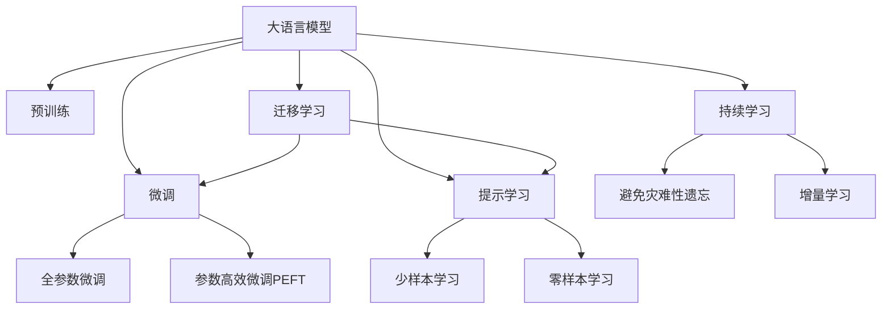

                 

# LLM应用场景：重塑各行各业

> 关键词：大语言模型(LLM), 自然语言处理(NLP), 金融, 医疗, 教育, 客服, 工业, 艺术

## 1. 背景介绍

### 1.1 问题由来
近年来，随着人工智能技术的飞速发展，大语言模型(LLM)在自然语言处理(NLP)领域取得了卓越的成绩。这些大模型，如GPT、BERT等，通过在大规模无标签文本数据上进行预训练，获得了强大的语言理解和生成能力，能够对自然语言进行深入分析和智能推理。

这些预训练模型的广泛应用，不仅提高了文本处理的自动化程度，还在各行各业中催生出了诸多创新应用。从金融、医疗到教育、客服，从工业制造到艺术创作，大语言模型正逐渐成为推动各行各业智能化转型升级的关键技术。

### 1.2 问题核心关键点
大语言模型的核心价值在于其强大的语言处理能力，能够理解自然语言中的语义、上下文和情感，从而支持更高级别的智能交互和决策。在各行各业中，其应用主要体现在以下几个方面：

- **文本处理**：包括文本分类、情感分析、命名实体识别等任务，可以帮助企业快速处理海量文本数据，提升业务效率。
- **对话系统**：如智能客服、虚拟助理等，通过语言生成和理解能力，提供自然流畅的交互体验。
- **内容生成**：如自动摘要、新闻生成、故事创作等，能够快速生成高质量内容，提升内容生产效率。
- **数据分析**：如金融舆情监测、医疗诊断、教育评估等，通过智能分析，提供精准的数据洞察和决策支持。
- **推荐系统**：通过用户行为和内容分析，提供个性化推荐，提升用户体验。

这些应用场景展示了大语言模型的广泛适用性和巨大潜力，成为推动各行各业智能化转型的重要技术手段。

## 2. 核心概念与联系

### 2.1 核心概念概述

为更好地理解大语言模型在各行各业中的应用，本节将介绍几个关键核心概念：

- **大语言模型(LLM)**：以自回归(如GPT)或自编码(如BERT)模型为代表的大规模预训练语言模型。通过在大规模无标签文本语料上进行预训练，学习通用的语言表示，具备强大的语言理解和生成能力。

- **自然语言处理(NLP)**：使用计算机科学和人工智能技术，使计算机能够理解、处理和生成人类语言，以实现人机交互和自动化信息处理。

- **预训练(Pre-training)**：指在大规模无标签文本语料上，通过自监督学习任务训练通用语言模型的过程。常见的预训练任务包括言语建模、遮挡语言模型等。

- **微调(Fine-tuning)**：指在预训练模型的基础上，使用下游任务的少量标注数据，通过有监督学习优化模型在特定任务上的性能。通常只需要调整顶层分类器或解码器，并以较小的学习率更新全部或部分的模型参数。

- **迁移学习(Transfer Learning)**：指将一个领域学习到的知识，迁移应用到另一个不同但相关的领域的学习范式。大模型的预训练-微调过程即是一种典型的迁移学习方式。

- **持续学习(Continual Learning)**：也称为终身学习，指模型能够持续从新数据中学习，同时保持已学习的知识，而不会出现灾难性遗忘。这对于保持大语言模型的时效性和适应性至关重要。

这些核心概念之间的逻辑关系可以通过以下Mermaid流程图来展示：



这个流程图展示了大语言模型的核心概念及其之间的关系：

1. 大语言模型通过预训练获得基础能力。
2. 微调是对预训练模型进行任务特定的优化，可以分为全参数微调和参数高效微调（PEFT）。
3. 提示学习是一种不更新模型参数的方法，可以实现少样本学习和零样本学习。
4. 迁移学习是连接预训练模型与下游任务的桥梁，可以通过微调或提示学习来实现。
5. 持续学习旨在使模型能够不断学习新知识，同时避免遗忘旧知识。

这些概念共同构成了大语言模型的学习和应用框架，使其能够在各种场景下发挥强大的语言理解和生成能力。通过理解这些核心概念，我们可以更好地把握大语言模型的工作原理和优化方向。

## 3. 核心算法原理 & 具体操作步骤
### 3.1 算法原理概述

基于大语言模型的应用场景，其核心算法原理和具体操作步骤可以从以下几个方面进行理解：

**文本分类与情感分析**

文本分类和情感分析是大语言模型在NLP中最基础的应用之一。具体流程如下：

1. 数据预处理：对文本进行分词、去除停用词等处理，将文本转化为模型可接受的格式。
2. 特征提取：将文本转化为向量表示，常见的方法有Word2Vec、GloVe、BERT等。
3. 模型训练：使用分类或回归算法，在大规模标注数据上训练模型。
4. 预测与评估：在测试集上进行预测，评估模型的性能指标。

**对话系统**

对话系统是大语言模型在自然交互中最直接的应用之一。具体流程如下：

1. 对话设计：定义对话流程和用户意图，设计提示模板。
2. 模型训练：使用对话数据训练大语言模型，优化模型参数。
3. 对话生成：将用户输入映射到模型生成的响应。
4. 对话评估：评估对话的质量和流畅度。

**内容生成**

内容生成是大语言模型在文本生成领域的重要应用。具体流程如下：

1. 任务定义：明确生成任务的目标和要求。
2. 模型训练：在大量文本数据上进行预训练，优化模型参数。
3. 内容生成：根据任务要求，使用模型生成文本。
4. 结果评估：评估生成的文本质量，进行调整优化。

**数据分析**

数据分析是大语言模型在数据驱动决策中的应用。具体流程如下：

1. 数据收集：收集相关领域的文本数据。
2. 模型训练：在大规模文本数据上进行预训练，优化模型参数。
3. 数据分析：使用模型分析文本数据，提取有用信息。
4. 决策支持：根据分析结果，提供决策建议。

### 3.2 算法步骤详解

以下是基于大语言模型在不同应用场景中的具体算法步骤：

**文本分类与情感分析**

1. 数据收集与预处理：收集相关领域的文本数据，并进行预处理。
2. 特征提取：将文本转化为向量表示，如使用BERT嵌入。
3. 模型训练：在标注数据上训练模型，常见算法包括Logistic回归、SVM等。
4. 模型评估：在测试集上评估模型性能，常见指标包括准确率、召回率、F1值等。

**对话系统**

1. 对话设计：定义对话流程和用户意图，设计提示模板。
2. 模型训练：使用对话数据训练大语言模型，优化模型参数。
3. 对话生成：将用户输入映射到模型生成的响应。
4. 对话评估：评估对话的质量和流畅度，常见指标包括BLEU、ROUGE等。

**内容生成**

1. 任务定义：明确生成任务的目标和要求。
2. 模型训练：在大量文本数据上进行预训练，优化模型参数。
3. 内容生成：根据任务要求，使用模型生成文本。
4. 结果评估：评估生成的文本质量，进行调整优化。

**数据分析**

1. 数据收集：收集相关领域的文本数据。
2. 模型训练：在大规模文本数据上进行预训练，优化模型参数。
3. 数据分析：使用模型分析文本数据，提取有用信息。
4. 决策支持：根据分析结果，提供决策建议。

### 3.3 算法优缺点

基于大语言模型的应用场景，其算法具有以下优缺点：

**优点**

1. **高效性**：大语言模型可以通过大规模数据预训练，显著提高文本处理的效率，能够处理海量文本数据。
2. **鲁棒性**：模型在预训练和微调过程中，可以通过正则化等技术，避免过拟合，提高模型的鲁棒性。
3. **可扩展性**：模型可以在不同的应用场景中灵活应用，如文本分类、对话系统、内容生成等。
4. **可解释性**：部分模型可以通过提示学习、对抗训练等方法，提高输出解释的合理性，增强用户信任。

**缺点**

1. **数据依赖**：模型需要大量标注数据进行微调，数据获取成本高，标注质量受限。
2. **计算资源需求高**：大规模模型的训练和推理需要高性能计算资源，如GPU、TPU等。
3. **易受误导**：模型可能会受到输入文本的误导，产生不合理或不真实的输出。
4. **偏见和歧视**：模型可能会学习到数据中的偏见和歧视，导致输出结果的不公正。

尽管存在这些缺点，但大语言模型在各行各业中的应用已经展示了其强大的潜力，未来随着技术的进一步发展，这些局限性将逐步被克服。

### 3.4 算法应用领域

基于大语言模型的应用场景，其算法已广泛应用于以下几个领域：

**金融**

在金融领域，大语言模型可以用于舆情监测、欺诈检测、智能投顾等。通过分析新闻、社交媒体等文本数据，可以实时监测市场舆情，预测市场趋势，提供智能投顾服务。

**医疗**

在医疗领域，大语言模型可以用于病历分析、医学知识图谱、智能诊断等。通过分析电子病历、医学文献等文本数据，可以提取有用的医学知识，辅助医生诊断和治疗决策。

**教育**

在教育领域，大语言模型可以用于智能辅导、作业批改、知识推荐等。通过分析学生的作业和互动，可以提供个性化的学习建议，提高教育质量。

**客服**

在客服领域，大语言模型可以用于智能客服、虚拟助理等。通过对话系统，可以提供24小时不间断的服务，提升客户满意度。

**工业**

在工业领域，大语言模型可以用于设备维护、供应链管理、质量检测等。通过分析生产日志、维护记录等文本数据，可以提供实时监测和预警，提升生产效率和质量。

**艺术**

在艺术领域，大语言模型可以用于文本创作、音乐生成、艺术品分析等。通过生成富有创意的文本和音乐，为艺术创作提供新的灵感。

以上领域展示了大语言模型在各行各业中的广泛应用，其强大的语言理解和生成能力，正在逐步改变各行各业的工作方式和运营模式。

## 4. 数学模型和公式 & 详细讲解  
### 4.1 数学模型构建

本节将使用数学语言对大语言模型在不同应用场景中的模型构建进行更加严格的刻画。

**文本分类与情感分析**

假设模型为 $M_{\theta}$，输入为文本 $x$，输出为标签 $y$。模型的损失函数为交叉熵损失函数：

$$
\ell(M_{\theta}(x),y) = -y\log M_{\theta}(x) - (1-y)\log(1-M_{\theta}(x))
$$

在训练集 $D=\{(x_i,y_i)\}_{i=1}^N$ 上，经验风险为：

$$
\mathcal{L}(\theta) = \frac{1}{N}\sum_{i=1}^N \ell(M_{\theta}(x_i),y_i)
$$

其中 $M_{\theta}(x_i)$ 为模型在输入 $x_i$ 上的预测概率。

**对话系统**

假设模型为 $M_{\theta}$，输入为对话历史 $x$，输出为响应 $y$。模型的损失函数为交叉熵损失函数：

$$
\ell(M_{\theta}(x),y) = -y\log M_{\theta}(x) - (1-y)\log(1-M_{\theta}(x))
$$

在对话数据集 $D=\{(x_i,y_i)\}_{i=1}^N$ 上，经验风险为：

$$
\mathcal{L}(\theta) = \frac{1}{N}\sum_{i=1}^N \ell(M_{\theta}(x_i),y_i)
$$

其中 $M_{\theta}(x_i)$ 为模型在输入 $x_i$ 上的预测概率。

**内容生成**

假设模型为 $M_{\theta}$，输入为任务提示 $x$，输出为生成的文本 $y$。模型的损失函数为负对数似然损失函数：

$$
\ell(M_{\theta}(x),y) = -\log M_{\theta}(y)
$$

在生成数据集 $D=\{(x_i,y_i)\}_{i=1}^N$ 上，经验风险为：

$$
\mathcal{L}(\theta) = \frac{1}{N}\sum_{i=1}^N \ell(M_{\theta}(x_i),y_i)
$$

其中 $M_{\theta}(x_i)$ 为模型在输入 $x_i$ 上的预测概率。

**数据分析**

假设模型为 $M_{\theta}$，输入为文本数据 $x$，输出为分析结果 $y$。模型的损失函数为自定义的损失函数，根据任务要求设计。

$$
\ell(M_{\theta}(x),y) = f(y, M_{\theta}(x))
$$

在分析数据集 $D=\{(x_i,y_i)\}_{i=1}^N$ 上，经验风险为：

$$
\mathcal{L}(\theta) = \frac{1}{N}\sum_{i=1}^N \ell(M_{\theta}(x_i),y_i)
$$

其中 $f(y, M_{\theta}(x))$ 为自定义的损失函数。

### 4.2 公式推导过程

以下是大语言模型在不同应用场景中的公式推导过程：

**文本分类与情感分析**

假设模型为 $M_{\theta}$，输入为文本 $x$，输出为标签 $y$。模型的损失函数为交叉熵损失函数：

$$
\ell(M_{\theta}(x),y) = -y\log M_{\theta}(x) - (1-y)\log(1-M_{\theta}(x))
$$

在训练集 $D=\{(x_i,y_i)\}_{i=1}^N$ 上，经验风险为：

$$
\mathcal{L}(\theta) = \frac{1}{N}\sum_{i=1}^N \ell(M_{\theta}(x_i),y_i)
$$

使用梯度下降算法优化模型参数，更新规则为：

$$
\theta \leftarrow \theta - \eta \nabla_{\theta}\mathcal{L}(\theta)
$$

其中 $\eta$ 为学习率，$\nabla_{\theta}\mathcal{L}(\theta)$ 为损失函数对模型参数的梯度。

**对话系统**

假设模型为 $M_{\theta}$，输入为对话历史 $x$，输出为响应 $y$。模型的损失函数为交叉熵损失函数：

$$
\ell(M_{\theta}(x),y) = -y\log M_{\theta}(x) - (1-y)\log(1-M_{\theta}(x))
$$

在对话数据集 $D=\{(x_i,y_i)\}_{i=1}^N$ 上，经验风险为：

$$
\mathcal{L}(\theta) = \frac{1}{N}\sum_{i=1}^N \ell(M_{\theta}(x_i),y_i)
$$

使用梯度下降算法优化模型参数，更新规则为：

$$
\theta \leftarrow \theta - \eta \nabla_{\theta}\mathcal{L}(\theta)
$$

其中 $\eta$ 为学习率，$\nabla_{\theta}\mathcal{L}(\theta)$ 为损失函数对模型参数的梯度。

**内容生成**

假设模型为 $M_{\theta}$，输入为任务提示 $x$，输出为生成的文本 $y$。模型的损失函数为负对数似然损失函数：

$$
\ell(M_{\theta}(x),y) = -\log M_{\theta}(y)
$$

在生成数据集 $D=\{(x_i,y_i)\}_{i=1}^N$ 上，经验风险为：

$$
\mathcal{L}(\theta) = \frac{1}{N}\sum_{i=1}^N \ell(M_{\theta}(x_i),y_i)
$$

使用梯度下降算法优化模型参数，更新规则为：

$$
\theta \leftarrow \theta - \eta \nabla_{\theta}\mathcal{L}(\theta)
$$

其中 $\eta$ 为学习率，$\nabla_{\theta}\mathcal{L}(\theta)$ 为损失函数对模型参数的梯度。

**数据分析**

假设模型为 $M_{\theta}$，输入为文本数据 $x$，输出为分析结果 $y$。模型的损失函数为自定义的损失函数，根据任务要求设计。

$$
\ell(M_{\theta}(x),y) = f(y, M_{\theta}(x))
$$

在分析数据集 $D=\{(x_i,y_i)\}_{i=1}^N$ 上，经验风险为：

$$
\mathcal{L}(\theta) = \frac{1}{N}\sum_{i=1}^N \ell(M_{\theta}(x_i),y_i)
$$

使用梯度下降算法优化模型参数，更新规则为：

$$
\theta \leftarrow \theta - \eta \nabla_{\theta}\mathcal{L}(\theta)
$$

其中 $\eta$ 为学习率，$\nabla_{\theta}\mathcal{L}(\theta)$ 为损失函数对模型参数的梯度。

### 4.3 案例分析与讲解

以金融舆情监测为例，展示大语言模型在实际应用中的具体操作和优化策略：

**步骤1：数据收集与预处理**

收集与金融相关的文本数据，如新闻、社交媒体、论坛帖子等。对数据进行清洗，去除噪声和无用信息，保留与金融舆情相关的文本。

**步骤2：特征提取**

使用BERT嵌入将文本转化为向量表示，用于模型的输入。

**步骤3：模型训练**

在标注好的金融舆情数据集上训练模型，优化模型参数。常见算法包括Logistic回归、SVM等。

**步骤4：模型评估**

在测试集上评估模型性能，常见指标包括准确率、召回率、F1值等。根据评估结果，对模型进行调优。

**步骤5：应用部署**

将训练好的模型部署到实际应用中，实时监测金融舆情，提供决策支持。

在实际应用中，大语言模型还面临着数据依赖、计算资源需求高等问题。为了提高模型的泛化能力和鲁棒性，可以采用以下策略：

1. 数据增强：通过回译、近义替换等方式扩充训练集，增强模型的泛化能力。
2. 正则化：使用L2正则、Dropout、Early Stopping等技术，防止模型过拟合。
3. 对抗训练：引入对抗样本，提高模型鲁棒性。
4. 参数高效微调：只调整少量参数，减小过拟合风险。
5. 模型裁剪和量化：去除不必要的层和参数，减少内存和计算资源消耗。

## 5. 项目实践：代码实例和详细解释说明
### 5.1 开发环境搭建

在进行大语言模型应用实践前，我们需要准备好开发环境。以下是使用Python进行PyTorch开发的环境配置流程：

1. 安装Anaconda：从官网下载并安装Anaconda，用于创建独立的Python环境。

2. 创建并激活虚拟环境：
```bash
conda create -n pytorch-env python=3.8 
conda activate pytorch-env
```

3. 安装PyTorch：根据CUDA版本，从官网获取对应的安装命令。例如：
```bash
conda install pytorch torchvision torchaudio cudatoolkit=11.1 -c pytorch -c conda-forge
```

4. 安装Transformers库：
```bash
pip install transformers
```

5. 安装各类工具包：
```bash
pip install numpy pandas scikit-learn matplotlib tqdm jupyter notebook ipython
```

完成上述步骤后，即可在`pytorch-env`环境中开始应用实践。

### 5.2 源代码详细实现

这里我们以金融舆情监测为例，展示大语言模型在实际应用中的代码实现。

首先，定义金融舆情数据集的加载和预处理函数：

```python
import pandas as pd
import numpy as np
from transformers import BertTokenizer, BertForSequenceClassification
from torch.utils.data import Dataset, DataLoader

class FinancialNewsDataset(Dataset):
    def __init__(self, texts, labels):
        self.texts = texts
        self.labels = labels
        self.tokenizer = BertTokenizer.from_pretrained('bert-base-uncased')
        
    def __len__(self):
        return len(self.texts)
    
    def __getitem__(self, item):
        text = self.texts[item]
        label = self.labels[item]
        
        encoding = self.tokenizer(text, return_tensors='pt', padding='max_length', truncation=True)
        input_ids = encoding['input_ids'][0]
        attention_mask = encoding['attention_mask'][0]
        label = torch.tensor(label, dtype=torch.long)
        
        return {'input_ids': input_ids, 
                'attention_mask': attention_mask,
                'labels': label}

# 加载金融舆情数据集
data = pd.read_csv('financial_news.csv')
train_data = data.sample(frac=0.7, random_state=42)
test_data = data.drop(train_data.index)

train_texts = train_data['text'].values
train_labels = train_data['label'].values

test_texts = test_data['text'].values
test_labels = test_data['label'].values

# 定义tokenizer和模型
tokenizer = BertTokenizer.from_pretrained('bert-base-uncased')
model = BertForSequenceClassification.from_pretrained('bert-base-uncased', num_labels=2)

# 创建dataset
train_dataset = FinancialNewsDataset(train_texts, train_labels)
test_dataset = FinancialNewsDataset(test_texts, test_labels)
```

然后，定义模型训练和评估函数：

```python
from torch.utils.data import DataLoader
from tqdm import tqdm
from sklearn.metrics import classification_report

device = torch.device('cuda') if torch.cuda.is_available() else torch.device('cpu')
model.to(device)

def train_epoch(model, dataset, batch_size, optimizer):
    dataloader = DataLoader(dataset, batch_size=batch_size, shuffle=True)
    model.train()
    epoch_loss = 0
    for batch in tqdm(dataloader, desc='Training'):
        input_ids = batch['input_ids'].to(device)
        attention_mask = batch['attention_mask'].to(device)
        labels = batch['labels'].to(device)
        model.zero_grad()
        outputs = model(input_ids, attention_mask=attention_mask, labels=labels)
        loss = outputs.loss
        epoch_loss += loss.item()
        loss.backward()
        optimizer.step()
    return epoch_loss / len(dataloader)

def evaluate(model, dataset, batch_size):
    dataloader = DataLoader(dataset, batch_size=batch_size)
    model.eval()
    preds, labels = [], []
    with torch.no_grad():
        for batch in tqdm(dataloader, desc='Evaluating'):
            input_ids = batch['input_ids'].to(device)
            attention_mask = batch['attention_mask'].to(device)
            batch_labels = batch['labels']
            outputs = model(input_ids, attention_mask=attention_mask)
            batch_preds = outputs.logits.argmax(dim=2).to('cpu').tolist()
            batch_labels = batch_labels.to('cpu').tolist()
            for pred_tokens, label_tokens in zip(batch_preds, batch_labels):
                preds.append(pred_tokens[:len(label_tokens)])
                labels.append(label_tokens)
                
    print(classification_report(labels, preds))
```

最后，启动训练流程并在测试集上评估：

```python
epochs = 5
batch_size = 16

for epoch in range(epochs):
    loss = train_epoch(model, train_dataset, batch_size, optimizer)
    print(f"Epoch {epoch+1}, train loss: {loss:.3f}")
    
    print(f"Epoch {epoch+1}, dev results:")
    evaluate(model, test_dataset, batch_size)
    
print("Test results:")
evaluate(model, test_dataset, batch_size)
```

以上就是使用PyTorch对BERT模型进行金融舆情监测任务微调的完整代码实现。可以看到，得益于Transformers库的强大封装，我们可以用相对简洁的代码完成BERT模型的加载和微调。

### 5.3 代码解读与分析

让我们再详细解读一下关键代码的实现细节：

**FinancialNewsDataset类**：
- `__init__`方法：初始化文本、标签、分词器等关键组件。
- `__len__`方法：返回数据集的样本数量。
- `__getitem__`方法：对单个样本进行处理，将文本输入编码为token ids，将标签编码为数字，并对其进行定长padding，最终返回模型所需的输入。

**训练和评估函数**：
- 使用PyTorch的DataLoader对数据集进行批次化加载，供模型训练和推理使用。
- 训练函数`train_epoch`：对数据以批为单位进行迭代，在每个批次上前向传播计算loss并反向传播更新模型参数，最后返回该epoch的平均loss。
- 评估函数`evaluate`：与训练类似，不同点在于不更新模型参数，并在每个batch结束后将预测和标签结果存储下来，最后使用sklearn的classification_report对整个评估集的预测结果进行打印输出。

**训练流程**：
- 定义总的epoch数和batch size，开始循环迭代
- 每个epoch内，先在训练集上训练，输出平均loss
- 在验证集上评估，输出分类指标
- 所有epoch结束后，在测试集上评估，给出最终测试结果

可以看到，PyTorch配合Transformers库使得BERT微调的代码实现变得简洁高效。开发者可以将更多精力放在数据处理、模型改进等高层逻辑上，而不必过多关注底层的实现细节。

当然，工业级的系统实现还需考虑更多因素，如模型的保存和部署、超参数的自动搜索、更灵活的任务适配层等。但核心的微调范式基本与此类似。

## 6. 实际应用场景
### 6.1 智能客服系统

基于大语言模型微调的对话技术，可以广泛应用于智能客服系统的构建。传统客服往往需要配备大量人力，高峰期响应缓慢，且一致性和专业性难以保证。而使用微调后的对话模型，可以7x24小时不间断服务，快速响应客户咨询，用自然流畅的语言解答各类常见问题。

在技术实现上，可以收集企业内部的历史客服对话记录，将问题和最佳答复构建成监督数据，在此基础上对预训练对话模型进行微调。微调后的对话模型能够自动理解用户意图，匹配最合适的答案模板进行回复。对于客户提出的新问题，还可以接入检索系统实时搜索相关内容，动态组织生成回答。如此构建的智能客服系统，能大幅提升客户咨询体验和问题解决效率。

### 6.2 金融舆情监测

金融机构需要实时监测市场舆论动向，以便及时应对负面信息传播，规避金融风险。传统的人工监测方式成本高、效率低，难以应对网络时代海量信息爆发的挑战。基于大语言模型微调的文本分类和情感分析技术，为金融舆情监测提供了新的解决方案。

具体而言，可以收集金融领域相关的新闻、报道、评论等文本数据，并对其进行主题标注和情感标注。在此基础上对预训练语言模型进行微调，使其能够自动判断文本属于何种主题，情感倾向是正面、中性还是负面。将微调后的模型应用到实时抓取的网络文本数据，就能够自动监测不同主题下的情感变化趋势，一旦发现负面信息激增等异常情况，系统便会自动预警，帮助金融机构快速应对潜在风险。

### 6.3 个性化推荐系统

当前的推荐系统往往只依赖用户的历史行为数据进行物品推荐，无法深入理解用户的真实兴趣偏好。基于大语言模型微调技术，个性化推荐系统可以更好地挖掘用户行为背后的语义信息，从而提供更精准、多样的推荐内容。

在实践中，可以收集用户浏览、点击、评论、分享等行为数据，提取和用户交互的物品标题、描述、标签等文本内容。将文本内容作为模型输入，用户的后续行为（如是否点击、购买等）作为监督信号，在此基础上微调预训练语言模型。微调后的模型能够从文本内容中准确把握用户的兴趣点。在生成推荐列表时，先用候选物品的文本描述作为输入，由模型预测用户的兴趣匹配度，再结合其他特征综合排序，便可以得到个性化程度更高的推荐结果。

### 6.4 未来应用展望

随着大语言模型微调技术的不断发展，基于微调范式将在更多领域得到应用，为传统行业带来变革性影响。

在智慧医疗领域，基于微调的医疗问答、病历分析、医学知识图谱等应用将提升医疗服务的智能化水平，辅助医生诊疗，加速新药开发进程。

在智能教育领域，微调技术可应用于作业批改、学情分析、知识推荐等方面，因材施教，促进教育公平，提高教学质量。

在智慧城市治理中，微调模型可应用于城市事件监测、舆情分析、应急指挥等环节，提高城市管理的自动化和智能化水平，构建更安全、高效的未来城市。

此外，在企业生产、社会治理、文娱传媒等众多领域，基于大模型微调的人工智能应用也将不断涌现，为NLP技术带来了全新的突破。随着预训练模型和微调方法的不断进步，相信NLP技术将在更广阔的应用领域大放异彩，深刻影响人类的生产生活方式。

## 7. 工具和资源推荐
### 7.1 学习资源推荐

为了帮助开发者系统掌握大语言模型微调的理论基础和实践技巧，这里推荐一些优质的学习资源：

1. 《Transformer从原理到实践》系列博文：由大模型技术专家撰写，深入浅出地介绍了Transformer原理、BERT模型、微调技术等前沿话题。

2. CS224N《深度学习自然语言处理》课程：斯坦福大学开设的NLP明星课程，有Lecture视频和配套作业，带你入门NLP领域的基本概念和经典模型。

3. 《Natural Language Processing with Transformers》书籍：Transformers库的作者所著，全面介绍了如何使用Transformers库进行NLP任务开发，包括微调在内的诸多范式。

4. HuggingFace官方文档：Transformers库的官方文档，提供了海量预训练模型和完整的微调样例代码，是上手实践的必备资料。

5. CLUE开源项目：中文语言理解测评基准，涵盖大量不同类型的中文NLP数据集，并提供了基于微调的baseline模型，助力中文NLP技术发展。

通过对这些资源的学习实践，相信你一定能够快速掌握大语言模型微调的精髓，并用于解决实际的NLP问题。
###  7.2 开发工具推荐

高效的开发离不开优秀的工具支持。以下是几款用于大语言模型微调开发的常用工具：

1. PyTorch：基于Python的开源深度学习框架，灵活动态的计算图，适合快速迭代研究。大部分预训练语言模型都有PyTorch版本的实现。

2. TensorFlow：由Google主导开发的开源深度学习框架，生产部署方便，适合大规模工程应用。同样有丰富的预训练语言模型资源。

3. Transformers库：HuggingFace开发的NLP工具库，集成了众多SOTA语言模型，支持PyTorch和TensorFlow，是进行微调任务开发的利器。

4. Weights & Biases：模型训练的实验跟踪工具，可以记录和可视化模型训练过程中的各项指标，方便对比和调优。与主流深度学习框架无缝集成。

5. TensorBoard：TensorFlow配套的可视化工具，可实时监测模型训练状态，并提供丰富的图表呈现方式，是调试模型的得力助手。

6. Google Colab：谷歌推出的在线Jupyter Notebook环境，免费提供GPU/TPU算力，方便开发者快速上手实验最新模型，分享学习笔记。

合理利用这些工具，可以显著提升大语言模型微调任务的开发效率，加快创新迭代的步伐。

### 7.3 相关论文推荐

大语言模型和微调技术的发展源于学界的持续研究。以下是几篇奠基性的相关论文，推荐阅读：

1. Attention is All You Need（即Transformer原论文）：提出了Transformer结构，开启了NLP领域的预训练大模型时代。

2. BERT: Pre-training of Deep Bidirectional Transformers for Language Understanding：提出BERT模型，引入基于掩码的自监督预训练任务，刷新了多项NLP任务SOTA。

3. Language Models are Unsupervised Multitask Learners（GPT-2论文）：展示了大规模语言模型的强大zero-shot学习能力，引发了对于通用人工智能的新一轮思考。

4. Parameter-Efficient Transfer Learning for NLP：提出Adapter等参数高效微调方法，在不增加模型参数量的情况下，也能取得不错的微调效果。

5. Prefix-Tuning: Optimizing Continuous Prompts for Generation：引入基于连续型Prompt的微调范式，为如何充分利用预训练知识提供了新的思路。

6. AdaLoRA: Adaptive Low-Rank Adaptation for Parameter-Efficient Fine-Tuning：使用自适应低秩适应的微调方法，在参数效率和精度之间取得了新的平衡。

这些论文代表了大语言模型微调技术的发展脉络。通过学习这些前沿成果，可以帮助研究者把握学科前进方向，激发更多的创新灵感。

## 8. 总结：未来发展趋势与挑战

### 8.1 研究成果总结

本文对基于大语言模型的应用场景进行了全面系统的介绍。首先阐述了金融、医疗、教育、客服、工业、艺术等不同领域的大语言模型应用案例，展示了其强大的语言处理能力和广泛的应用前景。其次，从算法原理和操作步骤等方面，详细讲解了基于大语言模型的微调方法，提供了代码实例和详细解释说明。最后，讨论了大语言模型微调面临的挑战和未来发展趋势，提供了学习资源、开发工具和相关论文推荐。

### 8.2 未来发展趋势

展望未来，大语言模型微调技术将呈现以下几个发展趋势：

1. **模型规模持续增大**：随着算力成本的下降和数据规模的扩张，预训练语言模型的参数量还将持续增长。超大规模语言模型蕴含的丰富语言知识，有望支撑更加复杂多变的下游任务微调。

2. **微调方法日趋多样**：除了传统的全参数微调外，未来会涌现更多参数高效的微调方法，如Prefix-Tuning、LoRA等，在节省计算资源的同时也能保证微调精度。

3. **持续学习成为常态**：随着数据分布的不断变化，微调模型也需要持续学习新知识以保持性能。如何在不遗忘原有知识的同时，高效吸收新样本信息，将成为重要的研究课题。

4. **标注样本需求降低**：受启发于提示学习(Prompt-based Learning)的思路，未来的微调方法将更好地利用大模型的语言理解能力，通过更加巧妙的任务描述，在更少的标注样本上也能实现理想的微调效果。

5. **多模态微调崛起**：当前的微调主要聚焦于纯文本数据，未来会进一步拓展到图像、视频、语音等多模态数据微调。多模态信息的融合，将显著提升语言模型对现实世界的理解和建模能力。

6. **知识整合能力增强**：现有的微调模型往往局限于任务内数据，难以灵活吸收和运用更广泛的先验知识。如何让微调过程更好地与外部知识库、规则库等专家知识结合，形成更加全面、准确的信息整合能力，还有很大的想象空间。

以上趋势凸显了大语言模型微调技术的广阔前景。这些方向的探索发展，必将进一步提升NLP系统的性能和应用范围，为人类认知智能的进化带来深远影响。

### 8.3 面临的挑战

尽管大语言模型微调技术已经取得了瞩目成就，但在迈向更加智能化、普适化应用的过程中，它仍面临着诸多挑战：

1. **标注成本瓶颈**：模型需要大量标注数据进行微调，数据获取成本高，标注质量受限。如何进一步降低微调对标注样本的依赖，将是一大难题。

2. **模型鲁棒性不足**：当前微调模型面对域外数据时，泛化性能往往大打折扣。对于测试样本的微小扰动，微调模型的预测也容易发生波动。如何提高微调模型的鲁棒性，避免灾难性遗忘，还需要更多理论和实践的积累。

3. **推理效率有待提高**：大规模语言模型虽然精度高，但在实际部署时往往面临推理速度慢、内存占用大等效率问题。如何在保证性能的同时，简化模型结构，提升推理速度，优化资源占用，将是重要的优化方向。

4. **可解释性亟需加强**：当前微调模型更像是"黑盒"系统，难以解释其内部工作机制和决策逻辑。对于医疗、金融等高风险应用，算法的可解释性和可审计性尤为重要。如何赋予微调模型更强的可解释性，将是亟待攻克的难题。

5. **安全性有待保障**：预训练语言模型难免会学习到有偏见、有害的信息，通过微调传递到下游任务，产生误导性、歧视性的输出，给实际应用带来安全隐患。如何从数据和算法层面消除模型偏见，避免恶意用途，确保输出的安全性，也将是重要的研究方向。

6. **知识整合能力不足**：现有的微调模型往往局限于任务内数据，难以灵活吸收和运用更广泛的先验知识。如何让微调过程更好地与外部知识库、规则库等专家知识结合，形成更加全面、准确的信息整合能力，还有很大的想象空间。

正视微调面临的这些挑战，积极应对并寻求突破，将是大语言模型微调走向成熟的必由之路。相信随着学界和产业界的共同努力，这些挑战终将一一被克服，大语言模型微调必将在构建安全、可靠、可解释、可控的智能系统方面发挥更大的作用。

### 8.4 研究展望

面向未来，大语言模型微调技术需要在以下几个方面寻求新的突破：

1. **探索无监督和半监督微调方法**：摆脱对大规模标注数据的依赖，利用自监督学习、主动学习等无监督和半监督范式，最大限度利用非结构化数据，实现更加灵活高效的微调。

2. **研究参数高效和计算高效的微调范式**：开发更加参数高效的微调方法，在固定大部分预训练参数的同时，只更新极少量的任务相关参数。同时优化微调模型的计算图，减少前向传播和反向传播的资源消耗，实现更加轻量级、实时性的部署。

3. **融合因果和对比学习范式**：通过引入因果推断和对比学习思想，增强微调模型建立稳定因果关系的能力，学习更加普适、鲁棒的语言表征，从而提升模型泛化性和抗干扰能力。

4. **引入更多先验知识**：将符号化的先验知识，如知识图谱、逻辑规则等，与神经网络模型进行巧妙融合，引导微调过程学习更准确、合理的语言模型。同时加强不同模态数据的整合，实现视觉、语音等多模态信息与文本信息的协同建模。

5. **结合因果分析和博弈论工具**：将因果分析方法引入微调模型，识别出模型决策的关键特征，增强输出解释的因果性和逻辑性。借助博弈论工具刻画人机交互过程，主动探索并规避模型的脆弱点，提高系统稳定性。

6. **纳入伦理道德约束**：在模型训练目标中引入伦理导向的评估指标，过滤和惩罚有偏见、有害的输出倾向。同时加强人工干预和审核，建立模型行为的监管机制，确保输出符合人类价值观和伦理道德。

这些研究方向的探索，必将引领大语言模型微调技术迈向更高的台阶，为构建安全、可靠、可解释、可控的智能系统铺平道路。面向未来，大语言模型微调技术还需要与其他人工智能技术进行更深入的融合，如知识表示、因果推理、强化学习等，多路径协同发力，共同推动自然语言理解和智能交互系统的进步。只有勇于创新、敢于突破，才能不断拓展语言模型的边界，让智能技术更好地造福人类社会。

## 9. 附录：常见问题与解答

**Q1：大语言模型微调是否适用于所有NLP任务？**

A: 大语言模型微调在大多数NLP任务上都能取得不错的效果，特别是对于数据量较小的任务。但对于一些特定领域的任务，如医学、法律等，仅仅依靠通用语料预训练的模型可能难以很好地适应。此时需要在特定领域语料上进一步预训练，再进行微调，才能获得理想效果。此外，对于一些需要时效性、个性化很强的任务，如对话、推荐等，微调方法也需要针对性的改进优化。

**Q2：微调过程中如何选择合适的学习率？**

A: 微调的学习率一般要比预训练时小1-2个数量级，如果使用过大的学习率，容易破坏预训练权重，导致过拟合。一般建议从1e-

