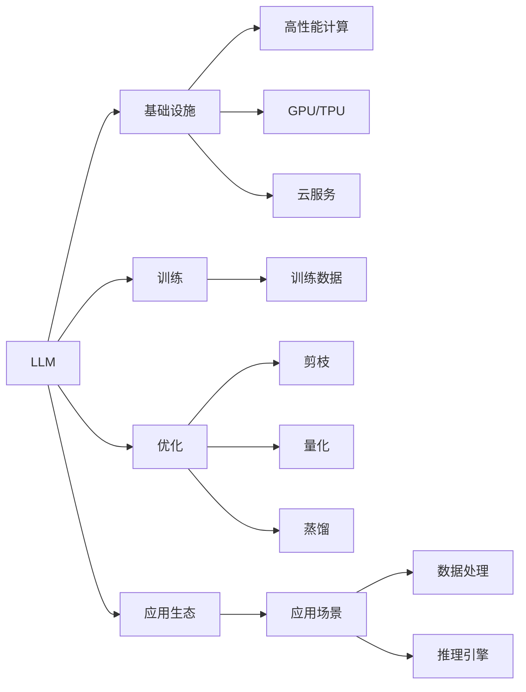

                 

# LLM生态发展：类比CPU的发展历程

> 关键词：语言模型,类比,演化,基础设施,生态系统,深度学习,人工智能,云计算,模型优化

## 1. 背景介绍

### 1.1 问题由来

在人类历史上，计算机的发展可以分为多个阶段，其中最显著的就是CPU的发展。从最初的晶体管时代，到如今的纳米技术时代，CPU经历了数十年的演进。与之相仿，近年来语言模型（Language Models, LMs）也在经历了迅猛发展，形成了如今的超大规模语言模型（Large Language Models, LLMs）。这一演进不仅限于模型本身，还涵盖了模型训练、应用部署和生态构建等多个方面。

### 1.2 问题核心关键点

为了深刻理解LLM的发展历程和未来趋势，需要从多个维度进行分析，包括：
- 模型演进的历程
- 基础设施和算力演变
- 生态系统构建
- 应用场景与价值
- 未来发展的挑战与机遇

本文章旨在通过类比CPU的发展历程，揭示LLM生态发展的脉络，并分析其面临的挑战与机遇，为未来LLM的演进提供思考。

## 2. 核心概念与联系

### 2.1 核心概念概述

- **语言模型（LM）**：指能够基于给定上下文预测下一个词或字符的概率分布的模型。
- **超大规模语言模型（LLM）**：指具有数十亿甚至百亿参数的LM，如GPT-3、BERT等，能够理解复杂的自然语言任务。
- **训练基础设施**：包括高性能计算集群、GPU/TPU、云服务等，为模型训练提供必要的算力和存储资源。
- **模型优化**：指通过剪枝、量化、蒸馏等技术，减小模型规模，提高推理速度和效率。
- **应用生态**：指围绕LLM构建的各类工具、平台和应用，如自然语言处理（NLP）任务库、多模态应用等。
- **云计算**：提供基础设施即服务（IaaS）、平台即服务（PaaS）和软件即服务（SaaS）等，支持模型的开发、训练和部署。
- **人工智能（AI）**：涵盖机器学习、深度学习、自然语言处理等多个子领域，推动各行各业的智能化转型。

### 2.2 核心概念原理和架构的 Mermaid 流程图



## 3. 核心算法原理 & 具体操作步骤

### 3.1 算法原理概述

LLM的发展历程与CPU类似，经历了从单核到多核、从摩尔定律到深度学习加速器的演进。早期的LM通常只有几百万到几千万参数，难以处理复杂的自然语言任务。而现代LLM通过多层堆叠和参数量级的提升，实现了对大规模文本数据的理解和生成。

- **算法原理**：
  - **自回归模型（如GPT）**：通过预测下一个词或字符，逐步生成完整的文本。
  - **自编码模型（如BERT）**：通过预测上下文中的缺失部分，学习语言表示。
  - **深度学习加速器**：如TPU、NPU等，提供专门的硬件加速支持。

- **操作步骤**：
  - **数据收集与预处理**：收集大规模无标签文本数据，进行分词、标记等预处理。
  - **模型训练**：使用大规模数据和深度学习框架，进行模型训练和调参。
  - **优化与压缩**：使用剪枝、量化等技术，减小模型规模，提高推理速度。
  - **部署与应用**：将模型部署到服务器或云平台，提供API服务，支持自然语言处理任务。

### 3.2 算法步骤详解

**Step 1: 数据准备与预处理**

1. **数据收集**：收集大规模无标签文本数据，如维基百科、新闻、小说等。
2. **分词与标记**：使用分词工具进行分词，标注实体、词性等。
3. **数据清洗**：去除噪声、低频词等，保持数据质量和分布。
4. **批量处理**：将数据分批次处理，适合训练。

**Step 2: 模型训练**

1. **选择架构**：选择适合的语言模型架构，如自回归、自编码等。
2. **设定超参数**：如学习率、批大小、迭代轮数等，进行调参。
3. **训练过程**：使用深度学习框架（如PyTorch、TensorFlow）进行模型训练。
4. **评估指标**：使用BLEU、ROUGE等指标，评估模型效果。

**Step 3: 优化与压缩**

1. **剪枝**：去除不重要的参数，减小模型规模。
2. **量化**：将浮点数参数转为定点数，减少内存占用。
3. **蒸馏**：使用小规模模型迁移知识，保持性能。
4. **硬件加速**：使用TPU、NPU等硬件加速器，提高训练和推理速度。

**Step 4: 部署与应用**

1. **服务器选择**：选择高性能服务器，支持模型训练和推理。
2. **模型导出**：将训练好的模型导出为可部署的格式。
3. **API服务**：将模型封装为API服务，支持多语言输入输出。
4. **监控与维护**：实时监控模型性能，定期维护更新。

### 3.3 算法优缺点

**优点**：
- **处理能力提升**：通过参数量级的提升，LLM能够处理更复杂的自然语言任务。
- **模型优化**：通过剪枝、量化等技术，模型推理速度大幅提升。
- **应用生态完善**：围绕LLM构建了丰富的应用生态，推动了NLP技术的发展。

**缺点**：
- **资源消耗大**：训练和推理需要大量算力和存储空间。
- **数据依赖性强**：需要大规模无标签文本数据进行预训练，数据获取成本高。
- **易过拟合**：随着模型规模的增大，过拟合风险增加，需要精细调参。

### 3.4 算法应用领域

LLM在多个领域得到了广泛应用，如：

- **自然语言处理（NLP）**：文本分类、命名实体识别、机器翻译、对话系统等。
- **智能客服**：自动回答用户问题，提升客服效率。
- **金融分析**：分析新闻、公告等文本数据，辅助投资决策。
- **内容生成**：自动生成新闻、文章、摘要等，节省人力。
- **教育**：智能辅导、自动批改作业等，提升教学质量。

## 4. 数学模型和公式 & 详细讲解 & 举例说明

### 4.1 数学模型构建

**自回归模型（如GPT-3）**：
- **输入**：$x_1, x_2, ..., x_t$，其中$x_t$为当前输入。
- **输出**：$x_{t+1}$，表示下一个词。
- **目标函数**：
  $$
  \mathcal{L} = -\log P(x_{t+1} | x_1, ..., x_t)
  $$

**自编码模型（如BERT）**：
- **输入**：$x_1, x_2, ..., x_t$，其中$x_t$为当前输入。
- **输出**：$\hat{x}_{t+1}$，表示预测的缺失部分。
- **目标函数**：
  $$
  \mathcal{L} = \sum_{i=1}^t -\log P(x_i | x_1, ..., x_{i-1}, \hat{x}_i, x_{i+1}, ..., x_t)
  $$

### 4.2 公式推导过程

**自回归模型推导**：
- **前向传播**：
  $$
  z_t = W_z x_t + b_z
  $$
  $$
  h_t = \tanh(z_t)
  $$
  $$
  e_t = W_e h_t + b_e
  $$
  $$
  y_t = softmax(e_t)
  $$
- **损失函数计算**：
  $$
  \mathcal{L} = -\sum_{t=1}^T \log y_t^{(x_{t+1})}
  $$

**自编码模型推导**：
- **前向传播**：
  $$
  z_t = W_z x_t + b_z
  $$
  $$
  h_t = \tanh(z_t)
  $$
  $$
  e_t = W_e h_t + b_e
  $$
  $$
  \hat{x}_t = \tanh(e_t)
  $$
- **损失函数计算**：
  $$
  \mathcal{L} = \sum_{t=1}^T -\log P(x_t | x_1, ..., x_{t-1}, \hat{x}_t, x_{t+1}, ..., x_T)
  $$

### 4.3 案例分析与讲解

**GPT-3在新闻生成中的应用**：
- **数据准备**：收集新闻数据，进行分词、标记等预处理。
- **模型训练**：使用GPT-3架构，进行大规模训练。
- **优化与压缩**：使用剪枝、量化等技术，减小模型规模。
- **部署与应用**：将模型部署到服务器，提供API服务，生成新闻报道。

## 5. 项目实践：代码实例和详细解释说明

### 5.1 开发环境搭建

**Step 1: 安装PyTorch**
```bash
pip install torch torchtext
```

**Step 2: 准备数据集**
```python
import torchtext
from torchtext.datasets import News20
from torchtext.data import Field, TabularDataset

# 定义数据字段
TEXT = Field(tokenize='spacy', lower=True)
LABEL = Field(sequential=False, use_vocab=False)

# 加载数据集
train_data, test_data = News20.splits(TEXT, LABEL)

# 构建数据集
train_data, valid_data = train_data.split()

# 构建数据批处理器
TEXT.build_vocab(train_data, max_size=25000)
LABEL.build_vocab(train_data)

# 定义数据批处理器
BATCH_SIZE = 32
train_iterator, valid_iterator, test_iterator = datasets.BucketIterator.splits(
    (train_data, valid_data, test_data), 
    TEXT, LABEL, 
    batch_size=BATCH_SIZE,
    sort_within_batch=False)
```

### 5.2 源代码详细实现

**Step 1: 模型定义**
```python
import torch.nn as nn
import torch.nn.functional as F

class TransformerModel(nn.Module):
    def __init__(self, d_model, nheads, nhid, dropout=0.1):
        super(TransformerModel, self).__init__()
        self.embedding = nn.Embedding(num_embeddings=vocab_size, embedding_dim=d_model)
        self.pos_encoder = PositionalEncoding(d_model)
        self.encoder = nn.Transformer(d_model, nheads, nhid, dropout, src_mask, tgt_mask)
        self.decoder = nn.Transformer(d_model, nheads, nhid, dropout, src_mask, tgt_mask)
        self.fc = nn.Linear(d_model, label_size)

    def forward(self, src, trg):
        src = self.pos_encoder(src)
        trg = self.pos_encoder(trg)
        output = self.encoder(src, trg)
        output = self.decoder(trg, src)
        output = self.fc(output)
        return output
```

**Step 2: 训练过程**
```python
import torch.optim as optim

# 定义训练超参数
d_model = 512
nheads = 8
nhid = 2048
epochs = 10

# 定义优化器
optimizer = optim.Adam(model.parameters(), lr=0.001)
criterion = nn.CrossEntropyLoss()

# 定义训练过程
for epoch in range(epochs):
    train_loss = 0
    for batch in train_iterator:
        optimizer.zero_grad()
        output = model(batch.src, batch.trg)
        loss = criterion(output, batch.label)
        loss.backward()
        optimizer.step()
        train_loss += loss.item()
    train_loss /= len(train_iterator)

    # 定义验证过程
    valid_loss = 0
    for batch in valid_iterator:
        output = model(batch.src, batch.trg)
        loss = criterion(output, batch.label)
        valid_loss += loss.item()
    valid_loss /= len(valid_iterator)

    # 输出结果
    print('Epoch {}, train loss: {:.4f}, valid loss: {:.4f}'.format(epoch+1, train_loss, valid_loss))
```

### 5.3 代码解读与分析

**Step 1: 数据处理**
- **文本预处理**：使用PyTorch Text库进行分词、标记等预处理。
- **数据批处理**：使用BatchIterator批处理数据，适合训练。

**Step 2: 模型定义**
- **Transformer模型**：定义Transformer模型，包括嵌入层、位置编码器、编码器、解码器和全连接层。
- **前向传播**：通过Embedding层和PositionalEncoding层进行文本编码，通过Transformer进行编码和解码，最终通过全连接层输出结果。

**Step 3: 训练过程**
- **超参数设置**：定义模型的超参数，如隐藏层大小、头数、学习率等。
- **优化器选择**：使用Adam优化器进行模型训练。
- **损失函数**：使用CrossEntropyLoss进行模型训练。

**Step 4: 结果展示**
- **训练损失**：记录每个epoch的训练损失。
- **验证损失**：记录每个epoch的验证损失。

## 6. 实际应用场景

### 6.1 智能客服系统

智能客服系统利用LLM进行对话理解与生成，可以提供7x24小时不间断服务，自动回答用户问题。系统收集历史客服对话记录，将问题和最佳答复构建成监督数据，对预训练模型进行微调。微调后的模型能够自动理解用户意图，匹配最合适的答案模板进行回复。对于客户提出的新问题，可以接入检索系统实时搜索相关内容，动态组织生成回答。

### 6.2 金融舆情监测

金融机构需要实时监测市场舆论动向，以便及时应对负面信息传播，规避金融风险。利用LLM进行文本分类和情感分析，可以在数据量较少的情况下，对大量文本进行快速分析，判断市场情绪，提供决策支持。

### 6.3 个性化推荐系统

当前的推荐系统往往只依赖用户的历史行为数据进行物品推荐，无法深入理解用户的真实兴趣偏好。利用LLM进行个性化推荐，可以更好地挖掘用户行为背后的语义信息，从而提供更精准、多样的推荐内容。通过收集用户浏览、点击、评论、分享等行为数据，提取和用户交互的物品标题、描述、标签等文本内容，利用LLM进行推理，生成个性化推荐结果。

### 6.4 未来应用展望

LLM未来将在更多领域得到应用，为传统行业带来变革性影响。

- **智慧医疗**：利用LLM进行病历分析、药物研发等，提升医疗服务的智能化水平。
- **智能教育**：利用LLM进行学情分析、知识推荐等，因材施教，促进教育公平。
- **智慧城市**：利用LLM进行事件监测、舆情分析等，提高城市管理的自动化和智能化水平。

## 7. 工具和资源推荐

### 7.1 学习资源推荐

- **《Transformer从原理到实践》**：深入浅出地介绍了Transformer原理、BERT模型、微调技术等前沿话题。
- **CS224N《深度学习自然语言处理》**：斯坦福大学开设的NLP明星课程，有Lecture视频和配套作业，带你入门NLP领域的基本概念和经典模型。
- **《Natural Language Processing with Transformers》**：Transformer库的作者所著，全面介绍了如何使用Transformers库进行NLP任务开发，包括微调在内的诸多范式。
- **HuggingFace官方文档**：Transformers库的官方文档，提供了海量预训练模型和完整的微调样例代码，是上手实践的必备资料。
- **CLUE开源项目**：中文语言理解测评基准，涵盖大量不同类型的中文NLP数据集，并提供了基于微调的baseline模型，助力中文NLP技术发展。

### 7.2 开发工具推荐

- **PyTorch**：基于Python的开源深度学习框架，灵活动态的计算图，适合快速迭代研究。
- **TensorFlow**：由Google主导开发的开源深度学习框架，生产部署方便，适合大规模工程应用。
- **Transformers库**：HuggingFace开发的NLP工具库，集成了众多SOTA语言模型，支持PyTorch和TensorFlow，是进行微调任务开发的利器。
- **Weights & Biases**：模型训练的实验跟踪工具，可以记录和可视化模型训练过程中的各项指标，方便对比和调优。
- **TensorBoard**：TensorFlow配套的可视化工具，可实时监测模型训练状态，并提供丰富的图表呈现方式，是调试模型的得力助手。
- **Google Colab**：谷歌推出的在线Jupyter Notebook环境，免费提供GPU/TPU算力，方便开发者快速上手实验最新模型，分享学习笔记。

### 7.3 相关论文推荐

- **Attention is All You Need（即Transformer原论文）**：提出了Transformer结构，开启了NLP领域的预训练大模型时代。
- **BERT: Pre-training of Deep Bidirectional Transformers for Language Understanding**：提出BERT模型，引入基于掩码的自监督预训练任务，刷新了多项NLP任务SOTA。
- **Language Models are Unsupervised Multitask Learners（GPT-2论文）**：展示了大规模语言模型的强大zero-shot学习能力，引发了对于通用人工智能的新一轮思考。
- **Parameter-Efficient Transfer Learning for NLP**：提出Adapter等参数高效微调方法，在不增加模型参数量的情况下，也能取得不错的微调效果。
- **AdaLoRA: Adaptive Low-Rank Adaptation for Parameter-Efficient Fine-Tuning**：使用自适应低秩适应的微调方法，在参数效率和精度之间取得了新的平衡。
- **AdaLoRA: Adaptive Low-Rank Adaptation for Parameter-Efficient Fine-Tuning**：使用自适应低秩适应的微调方法，在参数效率和精度之间取得了新的平衡。

## 8. 总结：未来发展趋势与挑战

### 8.1 研究成果总结

LLM的发展历程体现了深度学习技术从原理到应用的演进，为人工智能领域带来了革命性变化。当前LLM已经形成了庞大的生态系统，包括预训练、微调、优化等多个环节，广泛应用于自然语言处理、智能客服、金融分析等多个领域。

### 8.2 未来发展趋势

1. **模型规模持续增大**：随着算力成本的下降和数据规模的扩张，预训练语言模型的参数量还将持续增长。超大规模语言模型蕴含的丰富语言知识，有望支撑更加复杂多变的下游任务微调。
2. **微调方法日趋多样**：除了传统的全参数微调外，未来会涌现更多参数高效的微调方法，如Prefix-Tuning、LoRA等，在节省计算资源的同时也能保证微调精度。
3. **持续学习成为常态**：随着数据分布的不断变化，微调模型也需要持续学习新知识以保持性能。如何在不遗忘原有知识的同时，高效吸收新样本信息，将成为重要的研究课题。
4. **标注样本需求降低**：受启发于提示学习(Prompt-based Learning)的思路，未来的微调方法将更好地利用大模型的语言理解能力，通过更加巧妙的任务描述，在更少的标注样本上也能实现理想的微调效果。
5. **多模态微调崛起**：当前的微调主要聚焦于纯文本数据，未来会进一步拓展到图像、视频、语音等多模态数据微调。多模态信息的融合，将显著提升语言模型对现实世界的理解和建模能力。
6. **知识整合能力增强**：现有的微调模型往往局限于任务内数据，难以灵活吸收和运用更广泛的先验知识。如何让微调过程更好地与外部知识库、规则库等专家知识结合，形成更加全面、准确的信息整合能力，还有很大的想象空间。

### 8.3 面临的挑战

尽管LLM已经取得了显著进展，但在迈向更加智能化、普适化应用的过程中，仍面临诸多挑战：

1. **标注成本瓶颈**：对于长尾应用场景，难以获得充足的高质量标注数据，成为制约微调性能的瓶颈。如何进一步降低微调对标注样本的依赖，将是一大难题。
2. **模型鲁棒性不足**：当前微调模型面对域外数据时，泛化性能往往大打折扣。对于测试样本的微小扰动，微调模型的预测也容易发生波动。如何提高微调模型的鲁棒性，避免灾难性遗忘，还需要更多理论和实践的积累。
3. **推理效率有待提高**：大规模语言模型虽然精度高，但在实际部署时往往面临推理速度慢、内存占用大等效率问题。如何在保证性能的同时，简化模型结构，提升推理速度，优化资源占用，将是重要的优化方向。
4. **可解释性亟需加强**：当前微调模型更像是"黑盒"系统，难以解释其内部工作机制和决策逻辑。对于医疗、金融等高风险应用，算法的可解释性和可审计性尤为重要。如何赋予微调模型更强的可解释性，将是亟待攻克的难题。
5. **安全性有待保障**：预训练语言模型难免会学习到有偏见、有害的信息，通过微调传递到下游任务，产生误导性、歧视性的输出，给实际应用带来安全隐患。如何从数据和算法层面消除模型偏见，避免恶意用途，确保输出的安全性，也将是重要的研究课题。
6. **知识整合能力不足**：现有的微调模型往往局限于任务内数据，难以灵活吸收和运用更广泛的先验知识。如何让微调过程更好地与外部知识库、规则库等专家知识结合，形成更加全面、准确的信息整合能力，还有很大的想象空间。

### 8.4 研究展望

未来的研究需要在以下几个方面寻求新的突破：

1. **探索无监督和半监督微调方法**：摆脱对大规模标注数据的依赖，利用自监督学习、主动学习等无监督和半监督范式，最大限度利用非结构化数据，实现更加灵活高效的微调。
2. **研究参数高效和计算高效的微调范式**：开发更加参数高效的微调方法，在固定大部分预训练参数的同时，只更新极少量的任务相关参数。同时优化微调模型的计算图，减少前向传播和反向传播的资源消耗，实现更加轻量级、实时性的部署。
3. **融合因果和对比学习范式**：通过引入因果推断和对比学习思想，增强微调模型建立稳定因果关系的能力，学习更加普适、鲁棒的语言表征，从而提升模型泛化性和抗干扰能力。
4. **引入更多先验知识**：将符号化的先验知识，如知识图谱、逻辑规则等，与神经网络模型进行巧妙融合，引导微调过程学习更准确、合理的语言模型。同时加强不同模态数据的整合，实现视觉、语音等多模态信息与文本信息的协同建模。
5. **结合因果分析和博弈论工具**：将因果分析方法引入微调模型，识别出模型决策的关键特征，增强输出解释的因果性和逻辑性。借助博弈论工具刻画人机交互过程，主动探索并规避模型的脆弱点，提高系统稳定性。
6. **纳入伦理道德约束**：在模型训练目标中引入伦理导向的评估指标，过滤和惩罚有偏见、有害的输出倾向。同时加强人工干预和审核，建立模型行为的监管机制，确保输出符合人类价值观和伦理道德。

## 9. 附录：常见问题与解答

**Q1: 大语言模型是否会取代人类语言？**

A: 大语言模型目前主要应用于辅助人类完成复杂的自然语言任务，而不是取代人类语言。它们能够理解和生成自然语言，但并不具备人类的逻辑思维和情感理解能力。在涉及情感、伦理等复杂问题时，仍然需要人类参与决策。

**Q2: 大语言模型的未来发展方向是什么？**

A: 大语言模型的未来发展方向包括：
1. **模型规模持续增大**：随着算力成本的下降和数据规模的扩张，预训练语言模型的参数量还将持续增长，有望支撑更加复杂多变的下游任务微调。
2. **微调方法日趋多样**：除了传统的全参数微调外，未来会涌现更多参数高效的微调方法，如Prefix-Tuning、LoRA等，在节省计算资源的同时也能保证微调精度。
3. **持续学习成为常态**：随着数据分布的不断变化，微调模型也需要持续学习新知识以保持性能。如何在不遗忘原有知识的同时，高效吸收新样本信息，将成为重要的研究课题。
4. **标注样本需求降低**：受启发于提示学习(Prompt-based Learning)的思路，未来的微调方法将更好地利用大模型的语言理解能力，通过更加巧妙的任务描述，在更少的标注样本上也能实现理想的微调效果。
5. **多模态微调崛起**：当前的微调主要聚焦于纯文本数据，未来会进一步拓展到图像、视频、语音等多模态数据微调。多模态信息的融合，将显著提升语言模型对现实世界的理解和建模能力。
6. **知识整合能力增强**：现有的微调模型往往局限于任务内数据，难以灵活吸收和运用更广泛的先验知识。如何让微调过程更好地与外部知识库、规则库等专家知识结合，形成更加全面、准确的信息整合能力，还有很大的想象空间。

**Q3: 大语言模型在训练和推理时需要注意哪些问题？**

A: 大语言模型在训练和推理时需要注意以下几个问题：
1. **训练数据**：数据质量直接影响模型的性能。需要收集大量高质量的训练数据，涵盖多种语言和领域。
2. **超参数调优**：学习率、批大小、迭代轮数等超参数的设定需要精细调优，以达到最佳的训练效果。
3. **硬件资源**：模型训练和推理需要大量的GPU/TPU资源，需要具备高性能计算集群。
4. **知识蒸馏**：在固定大部分预训练参数的同时，只更新极少量的任务相关参数，以提高微调效率和精度。
5. **模型压缩**：使用剪枝、量化等技术，减小模型规模，提高推理速度和内存效率。
6. **模型部署**：将模型部署到高性能服务器或云平台，支持API服务，提供高效、稳定的推理服务。

**Q4: 大语言模型在各个领域的应用有哪些？**

A: 大语言模型在多个领域得到了广泛应用，包括：
1. **自然语言处理（NLP）**：文本分类、命名实体识别、机器翻译、对话系统等。
2. **智能客服**：自动回答用户问题，提升客服效率。
3. **金融分析**：分析新闻、公告等文本数据，辅助投资决策。
4. **内容生成**：自动生成新闻、文章、摘要等，节省人力。
5. **教育**：智能辅导、自动批改作业等，提升教学质量。
6. **医疗**：病历分析、药物研发等，提升医疗服务的智能化水平。
7. **智能交通**：自动驾驶、智能交通管理等，提高交通系统的智能化水平。
8. **安全监控**：智能安防、网络监控等，提高安全监控的智能化水平。

**Q5: 如何降低大语言模型的资源消耗？**

A: 大语言模型在训练和推理时资源消耗较大，可以通过以下几个方法进行优化：
1. **模型压缩**：使用剪枝、量化等技术，减小模型规模，提高推理速度和内存效率。
2. **硬件加速**：使用TPU、NPU等专用硬件加速器，提高计算效率。
3. **分布式训练**：使用分布式训练框架，将模型任务分散到多台机器上进行训练，提高训练效率。
4. **模型蒸馏**：使用小规模模型迁移知识，保持性能的同时减小资源消耗。
5. **异步训练**：使用异步训练技术，提高资源利用率。

**Q6: 如何提高大语言模型的可解释性？**

A: 提高大语言模型的可解释性需要从以下几个方面入手：
1. **输出解释**：提供模型输出的详细解释，包括推理路径、关键特征等。
2. **可视化工具**：使用可视化工具，帮助用户理解模型内部机制和决策过程。
3. **因果分析**：使用因果分析方法，识别模型决策的关键特征，增强输出解释的因果性和逻辑性。
4. **透明模型**：设计透明模型，避免使用复杂结构，提高模型的可解释性。

**Q7: 大语言模型在实际应用中可能面临哪些伦理问题？**

A: 大语言模型在实际应用中可能面临以下伦理问题：
1. **偏见与歧视**：模型可能学习到数据中的偏见和歧视，产生误导性输出。
2. **隐私保护**：用户数据可能被滥用，造成隐私泄露。
3. **安全漏洞**：模型可能被恶意利用，导致安全漏洞。
4. **伦理决策**：模型在涉及伦理决策时，需要考虑人类的价值观和道德标准。
5. **公平性**：模型需要考虑不同群体的公平性，避免对特定群体产生偏见。

---

作者：禅与计算机程序设计艺术 / Zen and the Art of Computer Programming

