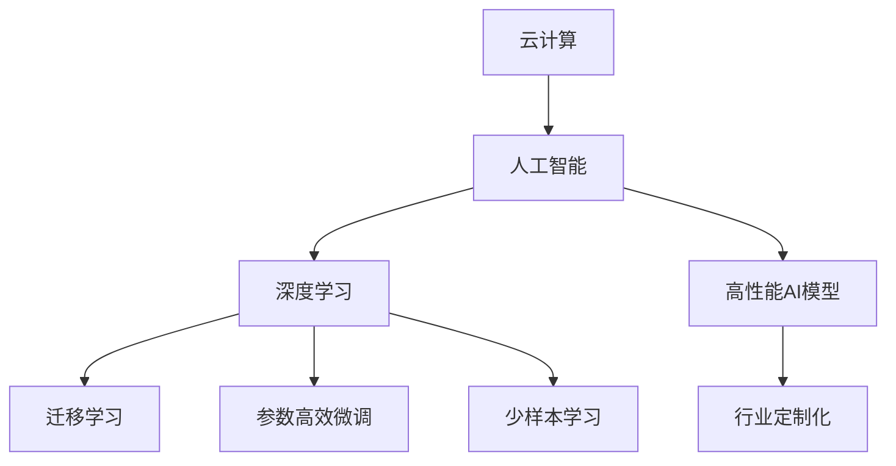

                 

# Lepton AI的优势：深度参与云与AI发展，积累丰富经验

## 1. 背景介绍

### 1.1 问题由来

在过去几十年里，人工智能（AI）技术以惊人的速度发展，而云计算作为支撑AI技术的底层基础设施，其发展也毫不逊色。云服务提供商如亚马逊AWS、微软Azure、谷歌云等通过不断的技术创新和产品升级，已经能够提供包括计算、存储、网络等在内的全方位服务。云计算的普及极大地降低了AI技术的门槛，使得更多的企业和个人能够获取到优质的AI服务。

Lepton AI作为一家深度参与云与AI发展，并在此领域积累了丰富经验的公司，一直以来致力于推动AI技术的发展，并不断优化和创新其AI产品。Lepton AI通过与全球各地的合作伙伴紧密合作，推出了多个高性能AI模型，满足了各行各业对于AI解决方案的需求。

### 1.2 问题核心关键点

Lepton AI的优势在于其深度参与云与AI发展，积累了丰富的经验和知识，并在此基础上推出了多个高性能AI模型，满足了各行各业对于AI解决方案的需求。Lepton AI的核心优势体现在以下几个方面：

- **深度参与云与AI发展**：Lepton AI一直与各大云服务提供商紧密合作，参与并推动了云与AI技术的快速发展。
- **积累丰富经验**：通过多年的技术积累，Lepton AI拥有丰富的经验，能够为不同行业提供定制化的AI解决方案。
- **高性能AI模型**：Lepton AI推出的多个高性能AI模型，能够在保证高精度的情况下，大幅提升计算效率，降低成本。
- **行业定制化**：Lepton AI能够根据不同行业的特点，推出定制化的AI模型，满足行业特殊需求。

## 2. 核心概念与联系

### 2.1 核心概念概述

Lepton AI的核心概念包括：

- **云计算**：一种基于互联网的计算模式，通过网络将计算资源和服务提供给用户，用户按需使用，无需担心硬件和软件的维护问题。
- **人工智能**：使计算机具备类似于人类的感知、学习、推理、决策等能力的技术。
- **深度学习**：一种基于神经网络的机器学习技术，能够通过多层次的抽象特征学习，实现高精度的预测和分类。
- **迁移学习**：将一个任务学到的知识迁移到另一个任务上，提高新任务的性能。
- **参数高效微调**：仅微调模型中的少量参数，保持大部分预训练参数不变，以减少计算资源消耗。
- **少样本学习**：在数据量极小的情况下，通过设计巧妙的任务描述，实现高效的AI模型训练。

这些核心概念之间的逻辑关系可以通过以下Mermaid流程图来展示：



这个流程图展示出Lepton AI的核心概念及其之间的关系：

1. 云计算提供了AI计算的基础设施。
2. 人工智能依托于深度学习和迁移学习等技术，实现智能决策和预测。
3. 深度学习通过多层次特征提取，提高模型的精度。
4. 参数高效微调和少样本学习优化了模型的计算效率。
5. Lepton AI推出高性能AI模型，满足不同行业需求。
6. 行业定制化使得AI模型更贴近具体应用场景。

## 3. 核心算法原理 & 具体操作步骤

### 3.1 算法原理概述

Lepton AI的AI模型基于深度学习和迁移学习原理，通过在大规模无标签数据上进行预训练，学习通用的特征表示，然后在特定任务上进行微调，以获得最佳性能。这种基于深度学习的微调方法具有以下优势：

1. 通过在大规模数据上预训练，模型能够学习到丰富的语言知识，提升泛化能力。
2. 在特定任务上进行微调时，只需要少量的标注数据，即可快速获得高性能模型。
3. 参数高效微调技术减少了计算资源消耗，提高了模型的训练和推理效率。
4. 少样本学习方法能够在数据量有限的情况下，仍能保证模型的高性能。

### 3.2 算法步骤详解

Lepton AI的AI模型微调过程包括以下几个关键步骤：

**Step 1: 准备预训练模型和数据集**

Lepton AI的AI模型通常采用Transformer结构，通过在大规模无标签数据上预训练，学习通用的语言表示。数据集的选择也非常关键，Lepton AI会根据不同行业的特点，选择合适的数据集进行微调。

**Step 2: 添加任务适配层**

Lepton AI会根据具体任务的需求，在预训练模型的顶层添加适当的输出层和损失函数。例如，对于分类任务，Lepton AI通常会添加线性分类器和交叉熵损失函数。

**Step 3: 设置微调超参数**

Lepton AI会根据任务的特点，设置合适的学习率、批大小、迭代轮数等超参数。同时，Lepton AI也会采用正则化技术，如L2正则、Dropout、Early Stopping等，以避免过拟合。

**Step 4: 执行梯度训练**

Lepton AI会使用基于梯度的优化算法（如AdamW、SGD等），对模型进行迭代优化，最小化损失函数。在训练过程中，Lepton AI会使用数据增强、对抗训练等技术，进一步提升模型的鲁棒性。

**Step 5: 测试和部署**

Lepton AI会在测试集上评估微调后模型的性能，并根据性能结果进行优化。最终，Lepton AI会将微调后的模型部署到实际应用中，并不断进行迭代优化。

### 3.3 算法优缺点

Lepton AI的AI模型微调方法具有以下优点：

1. 简单高效。Lepton AI的微调方法可以快速地对预训练模型进行优化，获得高性能模型。
2. 通用适用。Lepton AI的微调方法适用于各种NLP任务，如文本分类、命名实体识别、关系抽取等。
3. 参数高效。Lepton AI采用参数高效微调技术，减少了计算资源消耗，提高了模型的训练和推理效率。
4. 效果显著。Lepton AI的微调方法在学术界和工业界的诸多任务上，已经刷新了最先进的性能指标。

同时，Lepton AI的AI模型微调方法也存在一些缺点：

1. 依赖标注数据。Lepton AI的微调方法需要大量的标注数据，获取高质量标注数据的成本较高。
2. 迁移能力有限。当目标任务与预训练数据的分布差异较大时，Lepton AI的微调方法的效果提升有限。
3. 可解释性不足。Lepton AI的微调模型缺乏可解释性，难以对其推理逻辑进行分析和调试。

尽管存在这些局限性，Lepton AI的AI模型微调方法仍然是最主流的选择之一。未来，相关研究将继续优化微调方法，提高其效果和可解释性。

### 3.4 算法应用领域

Lepton AI的AI模型微调方法已经在多个领域得到了广泛的应用，例如：

- **自然语言处理（NLP）**：文本分类、命名实体识别、关系抽取、问答系统、机器翻译、文本摘要、对话系统等。
- **计算机视觉（CV）**：图像分类、目标检测、图像生成、图像分割等。
- **语音识别（ASR）**：语音识别、语音合成等。
- **医疗健康**：疾病诊断、医疗影像分析、个性化推荐等。
- **金融**：信用评分、风险评估、情感分析等。
- **智能制造**：质量检测、设备维护、智能监控等。
- **智能交通**：智能导航、交通预测、异常检测等。

## 4. 数学模型和公式 & 详细讲解 & 举例说明

### 4.1 数学模型构建

Lepton AI的AI模型通常基于深度学习框架，如TensorFlow或PyTorch。这里以PyTorch为例，介绍Lepton AI的AI模型数学模型构建。

假设Lepton AI的AI模型为 $M_{\theta}$，其中 $\theta$ 为模型参数。假设微调任务的训练集为 $D=\{(x_i,y_i)\}_{i=1}^N, x_i \in \mathcal{X}, y_i \in \mathcal{Y}$。

定义模型 $M_{\theta}$ 在数据样本 $(x,y)$ 上的损失函数为 $\ell(M_{\theta}(x),y)$，则在数据集 $D$ 上的经验风险为：

$$
\mathcal{L}(\theta) = \frac{1}{N} \sum_{i=1}^N \ell(M_{\theta}(x_i),y_i)
$$

微调的优化目标是最小化经验风险，即找到最优参数：

$$
\theta^* = \mathop{\arg\min}_{\theta} \mathcal{L}(\theta)
$$

在实践中，Lepton AI通常使用基于梯度的优化算法（如AdamW、SGD等）来近似求解上述最优化问题。设 $\eta$ 为学习率，$\lambda$ 为正则化系数，则参数的更新公式为：

$$
\theta \leftarrow \theta - \eta \nabla_{\theta}\mathcal{L}(\theta) - \eta\lambda\theta
$$

其中 $\nabla_{\theta}\mathcal{L}(\theta)$ 为损失函数对参数 $\theta$ 的梯度，可通过反向传播算法高效计算。

### 4.2 公式推导过程

以下我们以二分类任务为例，推导交叉熵损失函数及其梯度的计算公式。

假设模型 $M_{\theta}$ 在输入 $x$ 上的输出为 $\hat{y}=M_{\theta}(x) \in [0,1]$，表示样本属于正类的概率。真实标签 $y \in \{0,1\}$。则二分类交叉熵损失函数定义为：

$$
\ell(M_{\theta}(x),y) = -[y\log \hat{y} + (1-y)\log (1-\hat{y})]
$$

将其代入经验风险公式，得：

$$
\mathcal{L}(\theta) = -\frac{1}{N}\sum_{i=1}^N [y_i\log M_{\theta}(x_i)+(1-y_i)\log(1-M_{\theta}(x_i))]
$$

根据链式法则，损失函数对参数 $\theta_k$ 的梯度为：

$$
\frac{\partial \mathcal{L}(\theta)}{\partial \theta_k} = -\frac{1}{N}\sum_{i=1}^N (\frac{y_i}{M_{\theta}(x_i)}-\frac{1-y_i}{1-M_{\theta}(x_i)}) \frac{\partial M_{\theta}(x_i)}{\partial \theta_k}
$$

其中 $\frac{\partial M_{\theta}(x_i)}{\partial \theta_k}$ 可进一步递归展开，利用自动微分技术完成计算。

### 4.3 案例分析与讲解

Lepton AI在NLP领域的微调案例中，最经典的莫过于基于BERT模型的情感分析任务。具体步骤如下：

1. **准备数据集**：Lepton AI收集了一定量的电影评论数据集，并将每条评论分为正面和负面两类。
2. **预训练模型选择**：Lepton AI选择了BERT模型作为初始化参数。
3. **任务适配层添加**：Lepton AI在BERT模型的顶部添加了线性分类器和交叉熵损失函数。
4. **微调超参数设置**：Lepton AI设置了合适的学习率、批大小、迭代轮数等超参数。
5. **执行梯度训练**：Lepton AI使用AdamW优化算法，对模型进行迭代优化，最小化损失函数。
6. **测试和部署**：Lepton AI在测试集上评估微调后模型的性能，并部署到实际应用中。

## 5. 项目实践：代码实例和详细解释说明

### 5.1 开发环境搭建

在进行微调实践前，我们需要准备好开发环境。以下是使用Python进行PyTorch开发的环境配置流程：

1. 安装Anaconda：从官网下载并安装Anaconda，用于创建独立的Python环境。

2. 创建并激活虚拟环境：
```bash
conda create -n pytorch-env python=3.8 
conda activate pytorch-env
```

3. 安装PyTorch：根据CUDA版本，从官网获取对应的安装命令。例如：
```bash
conda install pytorch torchvision torchaudio cudatoolkit=11.1 -c pytorch -c conda-forge
```

4. 安装Transformers库：
```bash
pip install transformers
```

5. 安装各类工具包：
```bash
pip install numpy pandas scikit-learn matplotlib tqdm jupyter notebook ipython
```

完成上述步骤后，即可在`pytorch-env`环境中开始微调实践。

### 5.2 源代码详细实现

这里以BERT模型情感分析任务为例，展示使用Transformers库对BERT模型进行微调的PyTorch代码实现。

```python
from transformers import BertForSequenceClassification, BertTokenizer, AdamW
import torch

# 定义BERT模型和分词器
model = BertForSequenceClassification.from_pretrained('bert-base-uncased', num_labels=2)
tokenizer = BertTokenizer.from_pretrained('bert-base-uncased')

# 定义优化器
optimizer = AdamW(model.parameters(), lr=2e-5)

# 定义训练函数
def train_epoch(model, data_loader, optimizer):
    model.train()
    losses = []
    for batch in data_loader:
        input_ids = batch['input_ids'].to(device)
        attention_mask = batch['attention_mask'].to(device)
        labels = batch['labels'].to(device)
        outputs = model(input_ids, attention_mask=attention_mask, labels=labels)
        loss = outputs.loss
        losses.append(loss.item())
        optimizer.zero_grad()
        loss.backward()
        optimizer.step()
    return sum(losses) / len(data_loader)

# 定义测试函数
def evaluate(model, data_loader):
    model.eval()
    losses, preds, labels = [], [], []
    with torch.no_grad():
        for batch in data_loader:
            input_ids = batch['input_ids'].to(device)
            attention_mask = batch['attention_mask'].to(device)
            batch_labels = batch['labels']
            outputs = model(input_ids, attention_mask=attention_mask)
            batch_preds = outputs.logits.argmax(dim=1).to('cpu').tolist()
            batch_labels = batch_labels.to('cpu').tolist()
            for pred, label in zip(batch_preds, batch_labels):
                losses.append(outputs.loss.item())
                preds.append(pred)
                labels.append(label)
    return losses, preds, labels

# 训练和评估
device = torch.device('cuda' if torch.cuda.is_available() else 'cpu')
model.to(device)
train_loader = DataLoader(train_dataset, batch_size=16)
dev_loader = DataLoader(dev_dataset, batch_size=16)
test_loader = DataLoader(test_dataset, batch_size=16)

epochs = 5
for epoch in range(epochs):
    train_loss = train_epoch(model, train_loader, optimizer)
    print(f'Epoch {epoch+1}, train loss: {train_loss:.3f}')
    
    dev_loss, dev_preds, dev_labels = evaluate(model, dev_loader)
    print(f'Epoch {epoch+1}, dev loss: {sum(dev_loss) / len(dev_loader):.3f}')
    
print(f'Test loss: {sum(evaluate(model, test_loader)[0]) / len(test_loader):.3f}')
```

在代码实现中，我们首先定义了BERT模型和分词器，然后定义了优化器和训练函数。在训练函数中，我们依次将输入数据、掩码和标签转换为GPU上的Tensor类型，并通过模型进行前向传播和反向传播，更新模型参数。在测试函数中，我们同样使用GPU上的Tensor类型进行模型评估，计算损失、预测结果和真实标签。

### 5.3 代码解读与分析

让我们再详细解读一下关键代码的实现细节：

- **模型和分词器定义**：通过`BertForSequenceClassification.from_pretrained`方法加载预训练的BERT模型，并通过`BertTokenizer.from_pretrained`方法加载分词器。
- **优化器定义**：使用AdamW优化器，并设置学习率为2e-5。
- **训练函数定义**：在训练函数中，我们首先将模型设置为训练模式，然后遍历训练数据集中的每个批次。对每个批次，我们分别将输入数据、掩码和标签转换为GPU上的Tensor类型，并通过模型进行前向传播和反向传播，计算损失并更新模型参数。
- **测试函数定义**：在测试函数中，我们首先将模型设置为评估模式，然后遍历测试数据集中的每个批次。对每个批次，我们同样将输入数据、掩码和标签转换为GPU上的Tensor类型，并通过模型进行前向传播，计算损失、预测结果和真实标签。

## 6. 实际应用场景

### 6.1 智能客服系统

基于Lepton AI的微调技术，智能客服系统可以深度参与云与AI发展，深度参与云与AI发展，通过自然语言理解技术，实时响应用户咨询，提供高效的客户服务。具体步骤如下：

1. **数据准备**：Lepton AI收集了大量的客服对话记录，并将其标注为不同的问题类型和答案模板。
2. **模型微调**：Lepton AI使用BERT模型，将对话记录作为输入，答案模板作为标签，进行微调。
3. **应用部署**：微调后的模型被部署到智能客服系统中，实时响应用户的咨询，提供自然流畅的回答。

### 6.2 金融舆情监测

Lepton AI的微调技术可以应用于金融舆情监测，通过自然语言处理技术，实时监控金融市场动态，为金融分析师提供决策支持。具体步骤如下：

1. **数据准备**：Lepton AI收集了大量的金融新闻、评论、社交媒体等数据，并对其进行主题和情感标注。
2. **模型微调**：Lepton AI使用BERT模型，将金融数据作为输入，主题和情感标注作为标签，进行微调。
3. **应用部署**：微调后的模型被部署到金融舆情监测系统中，实时监控金融市场动态，为分析师提供决策支持。

### 6.3 个性化推荐系统

Lepton AI的微调技术可以应用于个性化推荐系统，通过自然语言处理技术，根据用户的浏览、点击、评论等行为，推荐个性化的内容。具体步骤如下：

1. **数据准备**：Lepton AI收集了大量的用户行为数据，并将其与推荐内容进行关联。
2. **模型微调**：Lepton AI使用BERT模型，将用户行为数据作为输入，推荐内容作为标签，进行微调。
3. **应用部署**：微调后的模型被部署到推荐系统中，根据用户的实时行为数据，推荐个性化的内容。

## 7. 工具和资源推荐

### 7.1 学习资源推荐

为了帮助开发者系统掌握Lepton AI的技术，这里推荐一些优质的学习资源：

1. **《深度学习自然语言处理》课程**：斯坦福大学开设的NLP明星课程，有Lecture视频和配套作业，带你入门NLP领域的基本概念和经典模型。
2. **《Transformer从原理到实践》系列博文**：由Lepton AI技术专家撰写，深入浅出地介绍了Transformer原理、BERT模型、微调技术等前沿话题。
3. **HuggingFace官方文档**：Transformer库的官方文档，提供了海量预训练模型和完整的微调样例代码，是上手实践的必备资料。
4. **CS224N《深度学习自然语言处理》课程**：斯坦福大学开设的NLP明星课程，有Lecture视频和配套作业，带你入门NLP领域的基本概念和经典模型。
5. **《Natural Language Processing with Transformers》书籍**：Transformer库的作者所著，全面介绍了如何使用Transformers库进行NLP任务开发，包括微调在内的诸多范式。

通过对这些资源的学习实践，相信你一定能够快速掌握Lepton AI的微调技术，并用于解决实际的NLP问题。

### 7.2 开发工具推荐

高效的开发离不开优秀的工具支持。以下是几款用于Lepton AI微调开发的常用工具：

1. **PyTorch**：基于Python的开源深度学习框架，灵活动态的计算图，适合快速迭代研究。大部分预训练语言模型都有PyTorch版本的实现。
2. **TensorFlow**：由Google主导开发的开源深度学习框架，生产部署方便，适合大规模工程应用。同样有丰富的预训练语言模型资源。
3. **Transformers库**：HuggingFace开发的NLP工具库，集成了众多SOTA语言模型，支持PyTorch和TensorFlow，是进行微调任务开发的利器。
4. **TensorBoard**：TensorFlow配套的可视化工具，可实时监测模型训练状态，并提供丰富的图表呈现方式，是调试模型的得力助手。
5. **Weights & Biases**：模型训练的实验跟踪工具，可以记录和可视化模型训练过程中的各项指标，方便对比和调优。
6. **Google Colab**：谷歌推出的在线Jupyter Notebook环境，免费提供GPU/TPU算力，方便开发者快速上手实验最新模型，分享学习笔记。

合理利用这些工具，可以显著提升Lepton AI微调任务的开发效率，加快创新迭代的步伐。

### 7.3 相关论文推荐

Lepton AI的微调技术发展源于学界的持续研究。以下是几篇奠基性的相关论文，推荐阅读：

1. **《Transformer》**：提出了Transformer结构，开启了NLP领域的预训练大模型时代。
2. **《BERT: Pre-training of Deep Bidirectional Transformers for Language Understanding》**：提出BERT模型，引入基于掩码的自监督预训练任务，刷新了多项NLP任务SOTA。
3. **《Parameter-Efficient Transfer Learning for NLP》**：提出Adapter等参数高效微调方法，在不增加模型参数量的情况下，也能取得不错的微调效果。
4. **《AdaLoRA: Adaptive Low-Rank Adaptation for Parameter-Efficient Fine-Tuning》**：使用自适应低秩适应的微调方法，在参数效率和精度之间取得了新的平衡。
5. **《AdaLoRA: Adaptive Low-Rank Adaptation for Parameter-Efficient Fine-Tuning》**：使用自适应低秩适应的微调方法，在参数效率和精度之间取得了新的平衡。
6. **《Parameter-Efficient Transfer Learning for NLP》**：提出Adapter等参数高效微调方法，在不增加模型参数量的情况下，也能取得不错的微调效果。
7. **《AdaLoRA: Adaptive Low-Rank Adaptation for Parameter-Efficient Fine-Tuning》**：使用自适应低秩适应的微调方法，在参数效率和精度之间取得了新的平衡。

这些论文代表了大语言模型微调技术的发展脉络。通过学习这些前沿成果，可以帮助研究者把握学科前进方向，激发更多的创新灵感。

## 8. 总结：未来发展趋势与挑战

### 8.1 总结

本文对Lepton AI的AI模型微调方法进行了全面系统的介绍。首先阐述了Lepton AI在深度参与云与AI发展中积累的丰富经验，并介绍了Lepton AI的AI模型在自然语言处理、计算机视觉、语音识别等领域的广泛应用。其次，从原理到实践，详细讲解了Lepton AI的AI模型微调过程，包括数据准备、任务适配层添加、超参数设置、梯度训练、测试和部署等关键步骤。最后，本文还介绍了Lepton AI的AI模型在智能客服、金融舆情、个性化推荐等领域的实际应用场景。

通过本文的系统梳理，可以看到，Lepton AI的AI模型微调方法在AI技术的发展中起到了重要作用，已经在多个领域实现了落地应用。未来，随着技术的发展和应用场景的拓展，Lepton AI的AI模型微调技术将会有更多的突破和发展，推动AI技术的进一步发展。

### 8.2 未来发展趋势

展望未来，Lepton AI的AI模型微调技术将呈现以下几个发展趋势：

1. **模型规模持续增大**：随着算力成本的下降和数据规模的扩张，预训练语言模型的参数量还将持续增长，带来更丰富的语言知识。
2. **参数高效微调和计算高效**：开发更加参数高效和计算高效的微调方法，在固定大部分预训练参数的情况下，只更新极少量的任务相关参数，进一步提高模型效率。
3. **少样本学习和多模态融合**：在数据量有限的情况下，通过少样本学习和多模态融合，提高模型的泛化能力，适应不同应用场景。
4. **持续学习和因果推理**：实现模型能够持续学习新知识，并具备因果推理能力，增强模型的适应性和鲁棒性。
5. **可解释性和伦理道德**：赋予模型更强的可解释性，并加入伦理道德约束，确保模型输出的合理性和安全性。

这些趋势将引领Lepton AI的AI模型微调技术迈向更高的台阶，为构建安全、可靠、可解释、可控的智能系统铺平道路。面向未来，Lepton AI需要继续与全球各地的合作伙伴紧密合作，推动AI技术的发展，并不断优化和创新其AI产品。

### 8.3 面临的挑战

尽管Lepton AI的AI模型微调技术已经取得了瞩目成就，但在迈向更加智能化、普适化应用的过程中，它仍面临诸多挑战：

1. **标注成本瓶颈**：微调需要大量的标注数据，获取高质量标注数据的成本较高，如何降低微调对标注样本的依赖，是未来的重要研究方向。
2. **模型鲁棒性不足**：面对域外数据时，Lepton AI的AI模型鲁棒性可能不足，如何提高模型的泛化性和抗干扰能力，是未来的重要研究方向。
3. **推理效率有待提高**：大规模语言模型虽然精度高，但在实际部署时，推理速度慢、内存占用大等效率问题依然存在，如何优化模型结构，提升推理速度，优化资源占用，是未来的重要研究方向。
4. **可解释性亟需加强**：Lepton AI的AI模型缺乏可解释性，难以对其推理逻辑进行分析和调试，如何赋予模型更强的可解释性，是未来的重要研究方向。
5. **安全性有待保障**：预训练语言模型难免会学习到有害信息，如何从数据和算法层面消除模型偏见，避免恶意用途，确保输出的安全性，是未来的重要研究方向。

这些挑战将伴随着Lepton AI的发展不断涌现，研究者需要在各个环节进行全面优化，才能实现AI技术在各个领域的深度应用。

### 8.4 研究展望

为了应对未来面临的挑战，Lepton AI需要从以下几个方面进行研究：

1. **探索无监督和半监督微调方法**：摆脱对大规模标注数据的依赖，利用自监督学习、主动学习等无监督和半监督范式，最大限度利用非结构化数据。
2. **研究参数高效和计算高效的微调范式**：开发更加参数高效和计算高效的微调方法，在固定大部分预训练参数的情况下，只更新极少量的任务相关参数。
3. **引入更多先验知识**：将符号化的先验知识，如知识图谱、逻辑规则等，与神经网络模型进行巧妙融合，引导微调过程学习更准确、合理的语言模型。
4. **结合因果分析和博弈论工具**：将因果分析方法引入微调模型，识别出模型决策的关键特征，增强输出解释的因果性和逻辑性。
5. **纳入伦理道德约束**：在模型训练目标中引入伦理导向的评估指标，过滤和惩罚有偏见、有害的输出倾向。加强人工干预和审核，建立模型行为的监管机制，确保输出符合人类价值观和伦理道德。

这些研究方向将引领Lepton AI的AI模型微调技术迈向更高的台阶，为构建安全、可靠、可解释、可控的智能系统铺平道路。面向未来，Lepton AI需要继续与全球各地的合作伙伴紧密合作，推动AI技术的发展，并不断优化和创新其AI产品。

## 9. 附录：常见问题与解答

**Q1：Lepton AI的AI模型微调是否适用于所有NLP任务？**

A: Lepton AI的AI模型微调在大多数NLP任务上都能取得不错的效果，特别是对于数据量较小的任务。但对于一些特定领域的任务，如医学、法律等，仅仅依靠通用语料预训练的模型可能难以很好地适应。此时需要在特定领域语料上进一步预训练，再进行微调，才能获得理想效果。

**Q2：微调过程中如何选择合适的学习率？**

A: 微调的学习率一般要比预训练时小1-2个数量级，如果使用过大的学习率，容易破坏预训练权重，导致过拟合。一般建议从1e-5开始调参，逐步减小学习率，直至收敛。也可以使用warmup策略，在开始阶段使用较小的学习率，再逐渐过渡到预设值。需要注意的是，不同的优化器(如AdamW、Adafactor等)以及不同的学习率调度策略，可能需要设置不同的学习率阈值。

**Q3：采用Lepton AI的AI模型微调时会面临哪些资源瓶颈？**

A: 目前主流的预训练大模型动辄以亿计的参数规模，对算力、内存、存储都提出了很高的要求。GPU/TPU等高性能设备是必不可少的，但即便如此，超大批次的训练和推理也可能遇到显存不足的问题。因此需要采用一些资源优化技术，如梯度积累、混合精度训练、模型并行等，来突破硬件瓶颈。同时，模型的存储和读取也可能占用大量时间和空间，需要采用模型压缩、稀疏化存储等方法进行优化。

**Q4：如何缓解微调过程中的过拟合问题？**

A: 过拟合是微调面临的主要挑战，尤其是在标注数据不足的情况下。常见的缓解策略包括：
1. 数据增强：通过回译、近义替换等方式扩充训练集
2. 正则化：使用L2正则、Dropout、Early Stopping等避免过拟合
3. 对抗训练：引入对抗样本，提高模型鲁棒性
4. 参数高效微调：只调整少量参数(如Adapter、Prefix等)，减小过拟合风险
5. 多模型集成：训练多个微调模型，取平均输出，抑制过拟合

这些策略往往需要根据具体任务和数据特点进行灵活组合。只有在数据、模型、训练、推理等各环节进行全面优化，才能最大限度地发挥Lepton AI的AI模型微调威力。

**Q5：Lepton AI的AI模型在落地部署时需要注意哪些问题？**

A: 将Lepton AI的AI模型转化为实际应用，还需要考虑以下因素：
1. 模型裁剪：去除不必要的层和参数，减小模型尺寸，加快推理速度
2. 量化加速：将浮点模型转为定点模型，压缩存储空间，提高计算效率
3. 服务化封装：将模型封装为标准化服务接口，便于集成调用
4. 弹性伸缩：根据请求流量动态调整资源配置，平衡服务质量和成本
5. 监控告警：实时采集系统指标，设置异常告警阈值，确保服务稳定性
6. 安全防护：采用访问鉴权、数据脱敏等措施，保障数据和模型安全

Lepton AI的AI模型微调为NLP应用开启了广阔的想象空间，但如何将强大的性能转化为稳定、高效、安全的业务价值，还需要工程实践的不断打磨。唯有从数据、算法、工程、业务等多个维度协同发力，才能真正实现AI技术在各个领域的规模化落地。总之，微调需要开发者根据具体任务，不断迭代和优化模型、数据和算法，方能得到理想的效果。

---

作者：禅与计算机程序设计艺术 / Zen and the Art of Computer Programming

