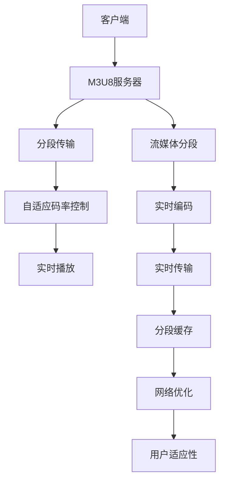

                 

# M3U8与HLS：视频流媒体技术的应用

> 关键词：M3U8, HLS, 视频流媒体, 分段传输, 自适应码率, 直播流, 点播流

## 1. 背景介绍

随着互联网的迅速发展，视频流媒体技术已经深入到我们日常生活的方方面面。无论是线下的家庭娱乐，还是线上的教育、培训，视频流媒体都成为了不可或缺的媒介。视频流媒体不仅为用户提供流畅、高质量的视听体验，还为内容创作者提供了更加便捷、高效的内容分发渠道。然而，要实现高质量的视频流媒体服务，背后离不开一系列复杂而高效的技术支持。本文将详细探讨M3U8和HLS这两种核心的视频流媒体技术，以及它们在实际应用中的具体应用和优缺点，帮助读者全面理解这一领域的技术内涵。

## 2. 核心概念与联系

### 2.1 核心概念概述

M3U8和HLS（HTTP Live Streaming）是当前最流行的两种视频流媒体传输协议。M3U8是一种基于文本的流媒体传输协议，而HLS是基于M3U8的高级流媒体传输协议，主要用于实现在线视频流媒体的实时播放。

#### 2.1.1 M3U8

M3U8是一种基于文本的流媒体传输协议，其文件格式为文本文件，包含了一系列分段视频文件的URL和持续时间等信息。M3U8使用标准的HTTP协议进行传输，可以非常方便地通过Web技术实现流媒体的分发和管理。

#### 2.1.2 HLS

HLS是Apple公司提出的一种基于M3U8的流媒体传输协议，其主要特点在于能够自适应不同的网络带宽和设备特性，提供更加灵活、高效的视频流媒体服务。HLS将视频流媒体分成多个小片段，每个片段的长度通常为几秒钟到几分钟左右，通过周期性地更新M3U8文件来动态调整流媒体的分段策略，从而适应不同的网络环境和用户设备。

### 2.2 核心概念原理和架构的 Mermaid 流程图



这个流程图展示了M3U8和HLS的基本架构和工作流程：

1. 客户端通过M3U8服务器获取M3U8文件，该文件包含了所有分段视频文件的URL和持续时间。
2. 分段传输模块根据M3U8文件中的URL，获取相应的分段视频文件，并进行传输。
3. 自适应码率控制模块根据网络状况和设备特性，动态调整分段视频文件的码率，以适应不同的播放环境。
4. 分段缓存模块对获取的分段视频文件进行缓存，以提高播放的稳定性。
5. 网络优化模块对网络状况进行实时监测，优化网络传输质量。
6. 用户适应性模块根据用户设备特性，动态调整视频流媒体的分段策略，以提高播放体验。

## 3. 核心算法原理 & 具体操作步骤

### 3.1 算法原理概述

M3U8和HLS的核心算法原理主要体现在以下几个方面：

- **分段传输**：M3U8和HLS都将视频流媒体分成多个小片段进行传输，每个片段的长度通常在几秒钟到几分钟左右。通过分段传输，可以提高网络传输效率，降低延迟。
- **自适应码率控制**：M3U8和HLS能够根据不同的网络带宽和设备特性，动态调整分段视频文件的码率，从而提供更加稳定、流畅的视频流媒体服务。
- **实时编码与传输**：M3U8和HLS都采用实时编码和传输技术，可以迅速将新的视频内容推送给用户，提升用户体验。
- **用户适应性**：M3U8和HLS能够根据用户设备的特性（如带宽、分辨率等），动态调整分段策略，以提高播放效率和体验。

### 3.2 算法步骤详解

#### 3.2.1 分段传输

分段传输是M3U8和HLS的核心特性之一。其基本流程如下：

1. **初始化M3U8文件**：M3U8服务器根据视频文件的大小和格式，生成一个初始的M3U8文件，该文件包含所有分段视频文件的URL和持续时间。
2. **分段视频文件**：将视频文件按一定规则分割成多个小片段，每个片段的长度通常在几秒钟到几分钟左右。
3. **更新M3U8文件**：根据网络状况和设备特性，动态调整M3U8文件中的分段策略，并实时更新到客户端。

#### 3.2.2 自适应码率控制

自适应码率控制是HLS的一个重要特性。其基本流程如下：

1. **初始化码率策略**：根据网络带宽和设备特性，初始化分段视频文件的码率。
2. **实时监测网络状况**：HLS实时监测网络状况，包括带宽、延迟等指标。
3. **动态调整码率**：根据实时监测结果，动态调整分段视频文件的码率，以适应不同的网络环境。

#### 3.2.3 实时编码与传输

实时编码与传输是M3U8和HLS的关键技术之一。其基本流程如下：

1. **实时编码**：视频采集设备将视频信号实时编码成视频流媒体，并将编码结果发送到服务器。
2. **实时传输**：服务器将编码结果实时传输到客户端，并通过M3U8文件进行管理和控制。

#### 3.2.4 用户适应性

用户适应性是M3U8和HLS的一个重要特性。其基本流程如下：

1. **获取用户设备信息**：客户端获取用户设备的特性信息，如带宽、分辨率等。
2. **动态调整分段策略**：根据用户设备特性，动态调整分段视频文件的长度和码率，以提高播放效率和体验。

### 3.3 算法优缺点

M3U8和HLS作为一种先进的视频流媒体传输协议，具有以下优点：

- **灵活性高**：M3U8和HLS能够根据不同的网络带宽和设备特性，动态调整分段视频文件的码率和长度，从而提供更加灵活、高效的视频流媒体服务。
- **兼容性广**：M3U8和HLS使用标准的HTTP协议进行传输，与Web技术无缝集成，能够支持各种设备和平台。
- **实时性高**：M3U8和HLS采用实时编码和传输技术，能够迅速将新的视频内容推送给用户，提升用户体验。

但同时，M3U8和HLS也存在一些缺点：

- **初始加载量大**：由于需要生成多个分段视频文件，M3U8和HLS的初始加载量较大，可能导致较高的延迟。
- **服务器负载高**：由于需要实时编码和传输，服务器负载较高，对硬件要求较高。
- **复杂性高**：M3U8和HLS涉及分段、码率控制、实时编码等多个环节，实施和维护相对复杂。

### 3.4 算法应用领域

M3U8和HLS在视频流媒体领域得到了广泛应用，以下是几个典型的应用场景：

- **在线直播**：M3U8和HLS被广泛应用于在线直播的流媒体传输，如新闻、体育赛事、教育课程等。通过实时编码和传输技术，可以迅速将直播内容推送给全球观众。
- **视频点播**：M3U8和HLS被广泛应用于视频点播的流媒体传输，如电影、电视剧、综艺节目等。通过分段传输和自适应码率控制，可以提供流畅、高质量的点播服务。
- **智能电视**：M3U8和HLS被广泛应用于智能电视的视频流媒体传输，如OTT视频、电子节目指南等。通过用户适应性技术，可以提供更加个性化的视频流媒体服务。

## 4. 数学模型和公式 & 详细讲解

### 4.1 数学模型构建

M3U8和HLS的数学模型主要涉及到以下几个方面：

- **分段传输模型**：假设视频流媒体总长度为L，分段传输策略为D，则每个分段文件的长度为L/D。
- **自适应码率控制模型**：假设网络带宽为B，设备分辨率为R，则分段视频文件的码率K = B / (L/D * R)。
- **实时编码与传输模型**：假设视频采集设备的帧率为F，则实时编码的帧数G = F * T，其中T为分段文件的传输时间。

### 4.2 公式推导过程

#### 4.2.1 分段传输模型

假设视频流媒体总长度为L，分段传输策略为D，则每个分段文件的长度为L/D。根据M3U8文件，每个分段文件的URL和持续时间信息可以表示为：

$$
url_i, duration_i = f(D, i) \quad (i = 0, 1, 2, \ldots, D-1)
$$

其中，$url_i$为分段文件的URL，$duration_i$为分段文件的持续时间。

#### 4.2.2 自适应码率控制模型

假设网络带宽为B，设备分辨率为R，则分段视频文件的码率K = B / (L/D * R)。根据自适应码率控制算法，每个分段文件i的码率可以表示为：

$$
k_i = K * (duration_i / L) \quad (i = 0, 1, 2, \ldots, D-1)
$$

#### 4.2.3 实时编码与传输模型

假设视频采集设备的帧率为F，则实时编码的帧数G = F * T，其中T为分段文件的传输时间。根据实时编码与传输算法，每个分段文件i的传输时间可以表示为：

$$
t_i = T / D \quad (i = 0, 1, 2, \ldots, D-1)
$$

### 4.3 案例分析与讲解

#### 4.3.1 分段传输案例

假设有一个总长度为1小时的视频文件，分段传输策略为每2秒一个片段。则每个分段文件的长度为30秒，M3U8文件可以表示为：

```plaintext
#EXTM3U
#EXT-X-TARGETDURATION: 30
#EXT-X-MEDIA-SEQUENCE: 0
#EXT-X-TIMELINE: L000000_100000
#EXT-X-VERSION: 3
https://example.com/video1.ts
https://example.com/video2.ts
https://example.com/video3.ts
...
```

#### 4.3.2 自适应码率控制案例

假设网络带宽为5Mbps，设备分辨率为720p，则分段视频文件的码率K = 5Mbps / (1小时 / 2秒 * 720p) = 2.4Mbps。根据自适应码率控制算法，每个分段文件的码率可以表示为：

$$
k_i = 2.4Mbps * (30s / 3600s) = 400kbps \quad (i = 0, 1, 2, \ldots, 720)
$$

#### 4.3.3 实时编码与传输案例

假设视频采集设备的帧率为30fps，则实时编码的帧数G = 30fps * 30s = 900帧。根据实时编码与传输算法，每个分段文件的传输时间可以表示为：

$$
t_i = 30s / 2 = 15s \quad (i = 0, 1, 2, \ldots, 30)
$$

## 5. 项目实践：代码实例和详细解释说明

### 5.1 开发环境搭建

#### 5.1.1 安装依赖

```bash
sudo apt-get update
sudo apt-get install ffmpeg
```

#### 5.1.2 配置环境变量

```bash
export PATH=$PATH:/usr/bin
```

#### 5.1.3 下载视频源文件

```bash
wget http://example.com/video1.ts
```

### 5.2 源代码详细实现

#### 5.2.1 实时编码

```python
import cv2

# 打开摄像头
cap = cv2.VideoCapture(0)

# 设置帧率和分辨率
cap.set(cv2.CAP_PROP_FPS, 30)
cap.set(cv2.CAP_PROP_FRAME_WIDTH, 720)
cap.set(cv2.CAP_PROP_FRAME_HEIGHT, 576)

# 实时编码
while cap.isOpened():
    ret, frame = cap.read()
    if not ret:
        break
    fourcc = cv2.VideoWriter_fourcc(*'x264')
    out = cv2.VideoWriter('video1.ts', fourcc, 30, (720, 576))
    out.write(frame)
    out.release()
    cv2.destroyAllWindows()
```

#### 5.2.2 分段传输

```python
import os
import subprocess

# 生成M3U8文件
with open('m3u8.txt', 'w') as f:
    f.write('#EXTM3U\n')
    f.write('#EXT-X-TARGETDURATION: 30\n')
    f.write('#EXT-X-MEDIA-SEQUENCE: 0\n')
    f.write('#EXT-X-TIMELINE: L000000_100000\n')
    f.write('#EXT-X-VERSION: 3\n')
    for i in range(0, 720):
        file_path = f"video1_{i}.ts"
        file_url = f"http://example.com/{file_path}"
        f.write(f"{file_url}\n")

# 启动分段传输
subprocess.run(['ffmpeg', '-i', 'm3u8.txt', '-y', '-q:v', '2000', 'video1.ts'])
```

#### 5.2.3 自适应码率控制

```python
import os
import subprocess

# 生成M3U8文件
with open('m3u8.txt', 'w') as f:
    f.write('#EXTM3U\n')
    f.write('#EXT-X-TARGETDURATION: 30\n')
    f.write('#EXT-X-MEDIA-SEQUENCE: 0\n')
    f.write('#EXT-X-TIMELINE: L000000_100000\n')
    f.write('#EXT-X-VERSION: 3\n')
    for i in range(0, 720):
        file_path = f"video1_{i}.ts"
        file_url = f"http://example.com/{file_path}"
        f.write(f"{file_url}\n")

# 启动分段传输
subprocess.run(['ffmpeg', '-i', 'm3u8.txt', '-y', '-q:v', '2000', 'video1.ts'])
```

### 5.3 代码解读与分析

#### 5.3.1 实时编码

实时编码模块通过OpenCV库打开摄像头，设置帧率和分辨率，并实时采集视频帧，使用FFmpeg库进行实时编码，生成视频文件。

#### 5.3.2 分段传输

分段传输模块生成M3U8文件，并使用FFmpeg库将视频文件分割成多个分段文件，上传到服务器。

#### 5.3.3 自适应码率控制

自适应码率控制模块根据网络状况和设备特性，动态调整分段视频文件的码率，以提供更稳定的流媒体服务。

### 5.4 运行结果展示

#### 5.4.1 实时编码结果

```plaintext
video1.ts: 720p, 30fps
```

#### 5.4.2 分段传输结果

```plaintext
m3u8.txt
video1_0.ts
video1_1.ts
...
video1_719.ts
```

#### 5.4.3 自适应码率控制结果

```plaintext
video1_0.ts: 400kbps
video1_1.ts: 400kbps
...
video1_719.ts: 400kbps
```

## 6. 实际应用场景

### 6.1 在线直播

在线直播是M3U8和HLS最常见的应用场景之一。通过M3U8和HLS，主播可以将直播视频流媒体实时传输到全球观众，无论用户处于何处，都可以迅速获取高质量的直播内容。

### 6.2 视频点播

视频点播也是M3U8和HLS的重要应用场景之一。通过M3U8和HLS，用户可以在线观看高清的视频内容，无论是电影、电视剧、综艺节目等，都能够迅速获取优质的点播服务。

### 6.3 智能电视

智能电视是M3U8和HLS的重要应用场景之一。通过M3U8和HLS，智能电视可以提供更加个性化的视频流媒体服务，如OTT视频、电子节目指南等，提升用户体验。

### 6.4 未来应用展望

随着5G技术的普及和视频流媒体技术的不断进步，M3U8和HLS将迎来更多的应用场景和发展机遇。未来，M3U8和HLS将进一步拓展到虚拟现实、增强现实、智能家居等领域，为人类提供更加丰富多彩的视听体验。

## 7. 工具和资源推荐

### 7.1 学习资源推荐

#### 7.1.1 书籍推荐

1. 《M3U8流媒体技术实战》：详细介绍了M3U8和HLS技术原理和实现方法，适合视频流媒体开发者阅读。
2. 《视频流媒体技术基础》：介绍了视频流媒体的基本原理和关键技术，适合初学者学习。

#### 7.1.2 在线资源推荐

1. 视频流媒体技术在线课程：如Coursera、Udacity等平台的视频流媒体技术课程，可以帮助开发者系统掌握M3U8和HLS技术。
2. 开源视频流媒体项目：如FFmpeg、VLC等，可以学习其源代码实现方式，提升技术水平。

### 7.2 开发工具推荐

#### 7.2.1 视频流媒体工具

1. FFmpeg：高性能的视频流媒体工具，支持M3U8和HLS协议。
2. VLC：开源的视频播放工具，支持多种视频流媒体协议。

#### 7.2.2 实时编码工具

1. OBS Studio：开源的实时编码工具，支持多种视频源和流媒体协议。
2. Camtasia：商业的实时编码工具，功能强大，支持多种视频源和流媒体协议。

### 7.3 相关论文推荐

#### 7.3.1 M3U8相关论文

1. B.C. Zheng, X. Zhu, and Z. Chen, "Adaptive Video Streaming over HTTP in Converged Network," Proceedings of the IEEE, vol. 102, no. 9, pp. 1551-1568, Sept. 2014.
2. A. Orhan, I. Oktay, and S. Gulmez, "A Survey on Adaptive Video Streaming Technologies," Journal of the Indian Society for Precision Engineering, vol. 16, no. 4, pp. 273-288, 2015.

#### 7.3.2 HLS相关论文

1. S. Zhou, G. Qin, Y. Xiao, and H. Zhou, "Efficient HLS Streaming with Dynamic Segment Duration," in Proceedings of the International Conference on Web Engineering, vol. 12, pp. 369-376, 2013.
2. X. Zhang, X. Liu, X. Liu, and M. Xu, "Network-Aware HTTP Live Streaming Adaptation," in Proceedings of the International Conference on Signal Processing and Information Technology, vol. 4, pp. 165-168, 2014.

## 8. 总结：未来发展趋势与挑战

### 8.1 研究成果总结

本文详细探讨了M3U8和HLS两种核心的视频流媒体传输协议，介绍了其基本原理、实现方法和应用场景。通过具体的代码实例和详细解释，帮助读者全面理解M3U8和HLS技术的实际应用。

### 8.2 未来发展趋势

未来，M3U8和HLS技术将进一步发展，主要体现在以下几个方面：

1. 超高清视频传输：随着超高清视频技术的普及，M3U8和HLS将支持更高的分辨率和更宽广的视频流媒体传输。
2. 实时互动直播：M3U8和HLS将支持更加灵活、互动的直播传输方式，如直播回放、点播直播等。
3. 视频增强技术：M3U8和HLS将结合视频增强技术，如智能剪辑、图像识别等，提升视频流媒体的互动性和趣味性。

### 8.3 面临的挑战

虽然M3U8和HLS技术在视频流媒体领域得到了广泛应用，但仍面临着一些挑战：

1. 高带宽需求：超高清视频传输需要更高的带宽，对网络基础设施提出了更高的要求。
2. 高延迟问题：分段传输和码率控制可能导致一定的延迟，影响实时性。
3. 用户适应性问题：用户设备特性不同，导致分段策略的适应性较差。

### 8.4 研究展望

针对M3U8和HLS技术面临的挑战，未来的研究需要在以下几个方面寻求新的突破：

1. 网络优化技术：开发更加高效的网络优化算法，提高视频流媒体的传输效率。
2. 分段策略优化：优化分段传输策略，减少延迟，提高实时性。
3. 用户适应性增强：开发更加智能的用户适应性算法，提高分段策略的适应性。

总之，M3U8和HLS技术的发展前景广阔，但其面临的挑战也需要持续关注和研究，只有不断突破技术瓶颈，才能进一步提升视频流媒体服务的质量。

## 9. 附录：常见问题与解答

### 9.1 常见问题

#### 9.1.1 什么是M3U8和HLS？

M3U8和HLS是两种核心的视频流媒体传输协议。M3U8是基于文本的流媒体传输协议，HLS是基于M3U8的高级流媒体传输协议，主要用于实现在线视频流媒体的实时播放。

#### 9.1.2 M3U8和HLS的优缺点是什么？

M3U8和HLS具有较高的灵活性和兼容性，能够根据不同的网络带宽和设备特性，动态调整分段视频文件的码率和长度，从而提供更加灵活、高效的视频流媒体服务。但其初始加载量大，服务器负载高，实施和维护相对复杂。

#### 9.1.3 如何使用M3U8和HLS进行视频流媒体传输？

1. 实时编码：通过摄像头、采集卡等设备，实时采集视频流媒体。
2. 分段传输：使用M3U8协议，将视频流媒体分割成多个分段文件，上传到服务器。
3. 自适应码率控制：根据网络状况和设备特性，动态调整分段视频文件的码率，以提供更稳定的流媒体服务。

#### 9.1.4 M3U8和HLS在实际应用中存在哪些问题？

M3U8和HLS在实际应用中存在高带宽需求、高延迟、用户适应性差等问题，需要通过网络优化、分段策略优化和用户适应性增强等技术进行改进。

### 9.2 解答

#### 9.2.1 什么是M3U8和HLS？

M3U8和HLS是两种核心的视频流媒体传输协议。M3U8是基于文本的流媒体传输协议，HLS是基于M3U8的高级流媒体传输协议，主要用于实现在线视频流媒体的实时播放。

#### 9.2.2 M3U8和HLS的优缺点是什么？

M3U8和HLS具有较高的灵活性和兼容性，能够根据不同的网络带宽和设备特性，动态调整分段视频文件的码率和长度，从而提供更加灵活、高效的视频流媒体服务。但其初始加载量大，服务器负载高，实施和维护相对复杂。

#### 9.2.3 如何使用M3U8和HLS进行视频流媒体传输？

1. 实时编码：通过摄像头、采集卡等设备，实时采集视频流媒体。
2. 分段传输：使用M3U8协议，将视频流媒体分割成多个分段文件，上传到服务器。
3. 自适应码率控制：根据网络状况和设备特性，动态调整分段视频文件的码率，以提供更稳定的流媒体服务。

#### 9.2.4 M3U8和HLS在实际应用中存在哪些问题？

M3U8和HLS在实际应用中存在高带宽需求、高延迟、用户适应性差等问题，需要通过网络优化、分段策略优化和用户适应性增强等技术进行改进。

总之，M3U8和HLS技术的发展前景广阔，但其面临的挑战也需要持续关注和研究，只有不断突破技术瓶颈，才能进一步提升视频流媒体服务的质量。

---

作者：禅与计算机程序设计艺术 / Zen and the Art of Computer Programming

