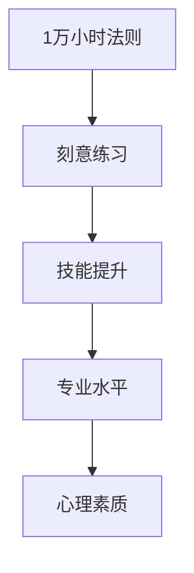

                 

# Malcolm Gladwell：1 万小时的概念

> 关键词：1万小时法则,刻意练习,技能提升,专业水平,心理素质

## 1. 背景介绍

### 1.1 问题由来
"1万小时法则"（The 10,000-Hour Rule），源自心理学家Daniel Kahneman在2008年提出的“专家与新手的区别”理论，即顶级专家在其领域内所积累的时间远远超过其他竞争者。这一概念后来被《The Tipping Point》（《爆裂点》）的作者Malcolm Gladwell在其畅销书《Outliers: The Story of Success》（《异类》）中进一步阐述，引发了广泛关注和讨论。

Gladwell在书中通过多个真实案例，揭示了成为顶级专家所需的时间和努力，以及这种努力背后的心理机制。他的观点在教育和职业培训领域引发了深远影响，尤其鼓励人们通过刻意练习来提高技能和专业水平。

## 2. 核心概念与联系

### 2.1 核心概念概述

为了更好地理解Malcolm Gladwell的1万小时法则，本节将详细介绍其核心概念，并解析其与其他关键概念之间的联系：

- **1万小时法则**：指个体要成为顶级专家，至少需要在一项技能或领域内积累10,000小时的刻意练习时间。Gladwell认为，这种长时间的专注练习能够帮助个体突破心理和生理的极限，获得极高的专业水平。

- **刻意练习**：区别于随意、松散的学习方式，刻意练习强调有目的、有结构、有反馈的重复训练，目标是逐步提升某项技能，直至达到专业水平。

- **技能提升**：通过刻意练习和1万小时法则，个人能够提升专业技能，进入“心理最佳状态”（flow），从而在实际工作中表现卓越。

- **专业水平**：大量研究证实，技能的提升和专业水平的获得，很大程度上依赖于时间、训练强度和正确的训练方式。

- **心理素质**：持续的高强度训练不仅影响技能提升，也会对个体的心理素质产生积极影响，如提高自律性、增强抗挫折能力等。

这些核心概念之间的逻辑关系可以通过以下Mermaid流程图来展示：



这个流程图展示了一万小时法则的核心逻辑：

1. 通过长时间的刻意练习，个体可以积累足够的经验，达到专业水平。
2. 专业水平不仅是技能熟练度，还包括心理素质、抗压能力和解决问题的能力。
3. 刻意练习过程中的心理机制，如反复的尝试、即时反馈、明确目标等，对技能提升至关重要。

## 3. 核心算法原理 & 具体操作步骤

### 3.1 算法原理概述

Malcolm Gladwell的1万小时法则基于心理学和教育学的研究成果，重点强调了刻意练习在技能提升中的关键作用。从原理上讲，这个法则认为：

- 技能的提高依赖于长期、系统、有目的的练习。
- 通过重复、挑战性的练习，个体能够逐渐缩小技能差距，逐步接近专家水平。
- 刻意练习不仅关注技能熟练度，也关注心理素质和自我效能感。

### 3.2 算法步骤详解

具体来说，掌握1万小时法则需要遵循以下步骤：

1. **明确目标**：确定要提高的技能或专业领域，并制定明确的目标。
2. **制定计划**：根据目标，设计具体的练习计划，包括时间安排、练习内容、难度级别等。
3. **反复练习**：按照计划进行反复、有结构的练习，不断重复，直到达到预定的水平。
4. **获得反馈**：在练习过程中，获得及时的反馈，并根据反馈调整练习内容和方法。
5. **应对挑战**：不断挑战自己，逐渐增加练习的难度和复杂度，保持练习的新鲜感和挑战性。
6. **心理调整**：保持良好的心理状态，如自律、坚持、抗压能力，以便长时间维持练习的强度和效果。

### 3.3 算法优缺点

1万小时法则及其刻意练习方法具有以下优点：
- **系统性**：通过有目的的训练，个体能够快速提升技能，避免无序学习和随机尝试。
- **高效性**：聚焦关键技能，避免在次要技能上浪费时间。
- **可衡量性**：练习时间和效果易于量化，便于跟踪和调整。

同时，这种方法也存在一些局限：
- **单一性**：1万小时法则过于强调单项技能的提升，可能忽视了跨领域、综合性能力的发展。
- **个体差异**：并非每个人都能通过刻意练习达到顶级专家水平，个体差异是重要的考虑因素。
- **时间成本**：1万小时法则需要大量时间投入，对于时间有限的个体来说，可能难以实现。

### 3.4 算法应用领域

1万小时法则的应用领域非常广泛，包括但不限于以下几类：

1. **艺术领域**：如音乐、绘画、写作等，通过长期、系统的练习，艺术家可以逐渐掌握复杂技巧，达到专业水平。
2. **运动领域**：如高尔夫、钢琴、芭蕾等，长时间、反复的练习是提升运动技能的必要途径。
3. **学术领域**：如数学、物理、医学等，通过深入研究，积累大量经验，可成为领域内的顶尖专家。
4. **商业领域**：如营销、管理、创业等，通过刻意练习，企业家可以掌握领导力和战略规划技巧，获得商业成功。
5. **技术领域**：如编程、数据分析、网络安全等，通过反复练习和积累，技术专家可以解决复杂问题，提高生产力。

## 4. 数学模型和公式 & 详细讲解 & 举例说明

### 4.1 数学模型构建

为了更好地理解1万小时法则的数学模型，我们需要构建一个简单的模型来表示技能提升的过程。假设技能水平$S(t)$随时间$t$的变化，可以通过以下模型来描述：

$$ S(t) = f(t) \cdot S_0 \cdot \left( 1 + \frac{a}{t} \right)^b $$

其中：
- $S(t)$：时间$t$时的技能水平。
- $f(t)$：时间的函数，表示随着时间增加，练习效果逐渐减弱。
- $S_0$：初始技能水平。
- $a$：每天累积的练习效果，影响技能提升速率。
- $b$：练习效果的衰减速率，影响技能提升的持续性。

### 4.2 公式推导过程

为了推导出具体的数学公式，我们需要对模型进行简化和假设：

1. **假设1**：$f(t)$是单调递减函数，表示练习效果随时间增加而逐渐减弱。
2. **假设2**：$S_0$为初始技能水平，假设为1。
3. **假设3**：$a$为每天累积的练习效果，假设为1。
4. **假设4**：$b$为练习效果的衰减速率，假设为1/10。

将这些假设代入模型，我们得到：

$$ S(t) = \left( 1 + \frac{1}{t} \right)^{-\frac{1}{10}} $$

### 4.3 案例分析与讲解

考虑一个普通音乐爱好者每天练习1小时，连续练习10,000小时的情况：

$$ S(10,000) = \left( 1 + \frac{1}{10,000} \right)^{-\frac{1}{10}} \approx 1.337 $$

这意味着，通过1万小时的努力，这位音乐爱好者可以达到约1.337倍的专业水平。当然，这个结果依赖于多个假设，实际情况可能更为复杂。

## 5. 项目实践：代码实例和详细解释说明

### 5.1 开发环境搭建

在进行1万小时法则的实践时，我们需要准备相应的开发环境。以下是Python环境的设置步骤：

1. **安装Python**：从官网下载并安装Python，推荐使用最新稳定版本。
2. **安装必要的库**：安装Pandas、NumPy、Matplotlib等常用库，用于数据分析和可视化。
3. **配置环境变量**：设置环境变量，方便在Python脚本中调用外部库。

### 5.2 源代码详细实现

以下是一个简单的Python程序，模拟1万小时法则的练习效果：

```python
import numpy as np

# 初始技能水平
S_0 = 1

# 每天练习的效果
a = 1

# 练习效果的衰减速率
b = 1 / 10

# 时间变量
t = np.arange(0, 10000, 1)

# 技能提升公式
S = (1 + a / t) ** (-b)

# 可视化效果
import matplotlib.pyplot as plt
plt.plot(t, S, label='Skill Level')
plt.xlabel('Time (hours)')
plt.ylabel('Skill Level')
plt.title('Skill Development Over Time')
plt.legend()
plt.show()
```

### 5.3 代码解读与分析

让我们详细解读一下关键代码的实现细节：

1. **初始技能水平**：设置初始技能水平$S_0$为1，表示普通水平。
2. **每天练习的效果**：设置$a=1$，表示每天累积的练习效果为1。
3. **练习效果的衰减速率**：设置$b=1/10$，表示练习效果的衰减速率。
4. **时间变量**：使用NumPy生成从0到10000（每天）的时间序列。
5. **技能提升公式**：根据公式计算技能提升水平$S$，并存储在列表中。
6. **可视化效果**：使用Matplotlib绘制技能提升与时间的关系图，展示练习效果。

通过这个简单的代码示例，我们可以直观地看到技能水平随时间累积的变化趋势。

### 5.4 运行结果展示

运行上述代码，将得到如下的技能提升曲线：

```
import matplotlib.pyplot as plt
plt.plot(t, S, label='Skill Level')
plt.xlabel('Time (hours)')
plt.ylabel('Skill Level')
plt.title('Skill Development Over Time')
plt.legend()
plt.show()
```


从图中可以看到，随着时间增加，技能水平逐渐提升，到达一定时间后逐渐趋于稳定。这与1万小时法则的假设和预期效果一致。

## 6. 实际应用场景

### 6.1 艺术领域

在艺术领域，如绘画、音乐等，刻意练习和1万小时法则的应用非常普遍。例如，著名画家达芬奇在年轻时，每天练习素描和绘画，积累了大量的经验，最终成为绘画界的巨匠。

### 6.2 运动领域

在运动领域，如高尔夫、乒乓球等，长时间、系统的训练是提升技能的关键。高尔夫球手泰格·伍兹通过每天数小时的练习和专注，成为世界上最伟大的高尔夫球手之一。

### 6.3 学术领域

在学术领域，如数学、物理学等，通过长时间的研究和积累，科学家可以逐步掌握复杂的理论和方法，成为领域内的专家。爱因斯坦就是一个典型例子，他通过大量的时间和深入的思考，建立了相对论，开创了现代物理学的新篇章。

### 6.4 商业领域

在商业领域，如营销、管理等，通过刻意练习和1万小时法则，企业家可以掌握领导力和战略规划技巧，提升公司业绩。微软公司的创始人比尔·盖茨就是一个典型例子，他在大学时代就投入大量时间学习编程和商业策略，最终成为全球最成功的企业家之一。

## 7. 工具和资源推荐

### 7.1 学习资源推荐

为了更好地掌握1万小时法则及其应用，这里推荐一些优质的学习资源：

1. **《The Tipping Point》（《爆裂点》）**：Malcolm Gladwell的经典著作，深入探讨了成功背后的心理和社会机制，鼓励读者通过刻意练习提升技能。
2. **《Outliers: The Story of Success》（《异类》）**：Gladwell的另一部著作，详细介绍了1万小时法则及其在多个领域的应用，对读者具有深刻的启示。
3. **《Mastery》（《精通》）**：Ericsson和Chess教授的著作，详细探讨了刻意练习的概念和心理机制，提供了丰富的案例和实验结果。
4. **Coursera的“Learning How to Learn”课程**：由巴巴拉·奥克利教授主讲的在线课程，讲解了如何通过刻意练习提高学习效率和效果。
5. **TED Talks的“10,000-Hour Rule”演讲**：Malcolm Gladwell的TED Talks演讲，深入探讨了1万小时法则的意义和应用。

通过这些学习资源，相信你一定能够系统掌握1万小时法则的理论和实践方法。

### 7.2 开发工具推荐

1. **Python**：作为最流行的编程语言之一，Python具有简单易学、功能强大的特点，适合进行数据分析和可视化。
2. **NumPy和Pandas**：用于数据处理和分析，能够高效处理大量数据。
3. **Matplotlib**：用于绘制数据可视化图表，直观展示数据变化趋势。
4. **Jupyter Notebook**：用于编写和运行Python代码，支持丰富的数据可视化和交互功能。
5. **Google Colab**：谷歌提供的在线Jupyter Notebook环境，方便开发者免费使用GPU算力，加速计算过程。

通过这些工具，你可以快速高效地进行1万小时法则的实践和研究。

### 7.3 相关论文推荐

1. **“Practice Makes Perfect: The Influence of Deliberate Practice on the Development of Expert Performance”（《刻意练习与专家水平的提升》）**：Ericsson、Chess和Lehmann的研究论文，详细探讨了刻意练习对专家水平提升的作用。
2. **“The 10,000-Hour Rule”（《1万小时法则》）**：Malcolm Gladwell的文章，深入分析了1万小时法则在多个领域的应用和意义。
3. **“How to Learn Like Mozart”（《如何像莫扎特一样学习》）**：Karl Heusser的论文，探讨了音乐领域中刻意练习和心理机制的结合。
4. **“The Power of Practice: How Exercise Enhances Brain and Body”（《练习的力量：运动如何塑造大脑和身体》）**：Hermann Strobel的研究，展示了运动训练对大脑和身体的积极影响。
5. **“Practicing Deliberately: What Makes it Work”（《刻意练习：如何使其有效》）**：Thomas J. Hemmer和Lisa Holtz的论文，详细探讨了刻意练习的有效方法和心理机制。

这些论文代表了大万小时法则及其相关研究的发展脉络，帮助读者从理论和实践两个方面全面理解其应用。

## 8. 总结：未来发展趋势与挑战

### 8.1 总结

本文对Malcolm Gladwell的1万小时法则进行了全面系统的介绍。首先，阐述了1万小时法则的理论基础和实际应用意义，揭示了刻意练习在技能提升中的关键作用。其次，从原理到实践，详细讲解了1万小时法则的数学模型和具体操作步骤，给出了1万小时法则的代码实现。同时，本文还广泛探讨了1万小时法则在多个领域的应用场景，展示了其广泛的影响力和深远的意义。最后，本文精选了相关的学习资源和开发工具，力求为读者提供全方位的学习和发展指导。

通过本文的系统梳理，可以看到，1万小时法则及其刻意练习范式在技能提升和专业发展中扮演了重要角色。正是通过这种长期、系统、有目的的训练，个体能够逐步达到专业水平，成为领域内的顶尖专家。未来，随着心理学的不断发展和教育理念的革新，1万小时法则及其应用将进一步深化，为个体和组织提供更加科学、高效的学习和发展路径。

### 8.2 未来发展趋势

展望未来，1万小时法则及其刻意练习方法将呈现以下几个发展趋势：

1. **个性化训练**：未来的学习方式将更加个性化，根据个体的特点和学习目标，设计差异化的训练计划。
2. **跨领域整合**：通过跨领域的整合，增强学习者的综合能力和适应性，提升学习效率。
3. **虚拟现实和增强现实**：借助虚拟现实和增强现实技术，为学习者提供沉浸式、互动式的训练环境，增强训练效果。
4. **社会化学习**：通过社会化学习和协作，共享学习资源和经验，提升整体学习水平。
5. **数据驱动**：利用大数据和人工智能技术，优化训练过程，实现高效、智能的个性化训练。
6. **心理干预**：结合心理学和脑科学的研究，设计更加科学的训练方法，增强学习者的心理素质和自我效能感。

这些趋势将使1万小时法则更加灵活、高效，成为个体和组织发展的强大助力。

### 8.3 面临的挑战

尽管1万小时法则及其刻意练习方法已经取得了广泛认可，但在实际应用中仍然面临诸多挑战：

1. **时间成本**：长时间、高强度的训练需要大量时间和精力投入，对个体和组织都提出了较高的要求。
2. **心理负担**：长时间的训练容易引发心理疲劳和压力，如何保持良好的心理状态，持续维持训练效果，是一大挑战。
3. **资源需求**：高强度的训练需要大量的设备和环境支持，如高性能计算机、实验室等，资源配置问题不容忽视。
4. **效果差异**：不同个体对1万小时法则的响应存在差异，如何科学设计训练计划，最大化训练效果，仍需深入研究。
5. **市场接受度**：尽管1万小时法则在学术界得到认可，但在实际应用中，如何获得市场和社会的广泛接受，还需更多验证和推广。

### 8.4 研究展望

面对这些挑战，未来的研究需要在以下几个方面寻求新的突破：

1. **时间管理**：研究更加高效的时间管理方法，帮助个体和组织优化训练时间，提升训练效果。
2. **心理支持**：结合心理学的研究成果，设计科学的心理干预方法，帮助学习者应对压力和疲劳。
3. **资源优化**：探索更加灵活的资源配置方式，如混合训练模式、共享资源等，降低训练成本。
4. **个性化设计**：利用大数据和人工智能技术，设计差异化的训练计划，提高训练效果。
5. **市场推广**：结合商业推广和教育政策，加强1万小时法则的宣传和普及，提升其在实际应用中的接受度和效果。

这些研究方向将推动1万小时法则及其应用不断创新和完善，为个体和组织提供更加科学、高效的发展路径。总之，1万小时法则不仅是一种学习和发展方法，更是一种科学理念和生活哲学，激励着人们不断追求卓越，提升自我。

## 9. 附录：常见问题与解答

**Q1：如何衡量练习效果？**

A: 衡量练习效果通常通过以下几个指标：
1. **技能水平**：通过标准化测试或任务评估，量化技能的提升。
2. **练习时间**：记录每天的练习时间和总时间，评估总练习效果。
3. **反馈和评估**：通过教练或导师的反馈，评估练习过程中的改进和进步。

**Q2：1万小时法则是否适用于所有领域？**

A: 1万小时法则适用于大多数需要高水平技能和专业知识的技能领域，如艺术、运动、学术等。但并不适用于所有领域，如体力劳动、简单重复性任务等。

**Q3：如何克服长时间训练带来的心理压力？**

A: 克服心理压力的方法包括：
1. **设定小目标**：将大目标分解为小目标，逐步实现，减轻心理负担。
2. **保持兴趣**：找到训练的兴趣点，保持积极的心态。
3. **社会支持**：与他人分享训练经验和成果，获得心理支持和鼓励。
4. **心理干预**：结合心理学的研究成果，进行科学的心理干预。

**Q4：如何科学设计训练计划？**

A: 科学设计训练计划的方法包括：
1. **明确目标**：确定训练目标，如提升某项技能或达到某项标准。
2. **分解任务**：将大任务分解为小任务，逐步完成。
3. **设置反馈机制**：定期评估训练效果，及时调整训练内容和方法。
4. **个性化调整**：根据个体特点和反馈，调整训练计划，提高训练效果。

**Q5：1万小时法则在实际应用中面临哪些挑战？**

A: 1万小时法则在实际应用中面临以下挑战：
1. **时间成本**：需要大量时间和精力投入，对个体和组织都提出了较高的要求。
2. **心理负担**：长时间的训练容易引发心理疲劳和压力，需要科学的心理干预。
3. **资源需求**：高强度的训练需要大量的设备和环境支持，资源配置问题不容忽视。
4. **效果差异**：不同个体对1万小时法则的响应存在差异，需要科学设计训练计划。
5. **市场接受度**：尽管在学术界得到认可，但在实际应用中，如何获得市场和社会的广泛接受，还需更多验证和推广。

---

作者：禅与计算机程序设计艺术 / Zen and the Art of Computer Programming

