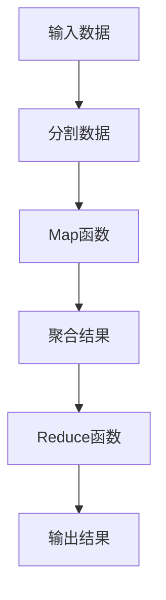
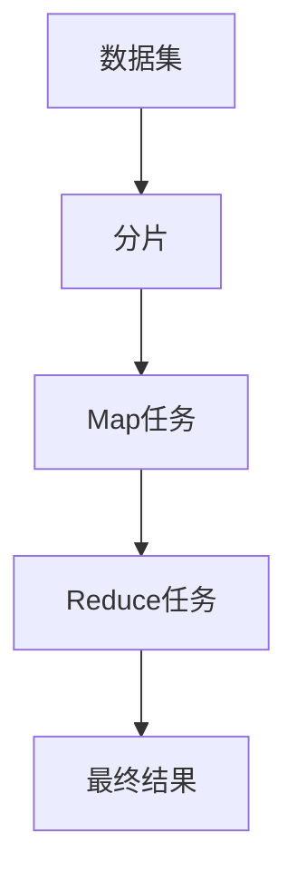

                 

# MapReduce原理与代码实例讲解

## 1. 背景介绍

### 1.1 问题由来

随着互联网的发展，数据量呈现爆炸式增长。传统的单机处理模式难以应对海量数据，并且存在处理速度慢、扩展性差、易出错等问题。MapReduce作为一种分布式计算框架，能够高效、可靠地处理大规模数据集，被广泛应用于谷歌、雅虎等公司的日常业务中。因此，深入理解MapReduce原理和应用成为了数据处理领域的重要课题。

## 2. 核心概念与联系

### 2.1 核心概念概述

MapReduce是一种分布式计算模型，通过分而治之的思想，将大规模数据集分成多个小数据集，并行处理，最终汇总结果。该框架由两部分组成：Map函数和Reduce函数。Map函数负责将输入数据分割成多个子集，并对每个子集进行处理；Reduce函数则负责合并所有子集的处理结果，形成最终的输出。

MapReduce的流程图如下所示：



这个流程图展示了MapReduce的基本流程：

1. 输入数据被分割成多个小数据集（B）。
2. Map函数对每个小数据集进行处理（C）。
3. Reduce函数将Map函数的结果合并成大结果（D）。
4. 最终输出结果（F）。

### 2.2 核心概念原理和架构的 Mermaid 流程图



该图展示了MapReduce的基本架构，由数据集、分片、Map任务、Reduce任务和最终结果组成。

## 3. 核心算法原理 & 具体操作步骤

### 3.1 算法原理概述

MapReduce算法通过并行处理大规模数据集，极大地提升了数据处理的效率。其核心思想是将大规模数据集分割成多个小数据集，并行处理每个小数据集，最后将所有小数据集的处理结果合并成最终的输出结果。

MapReduce的运行流程包括以下几个步骤：

1. 分片：将输入数据分割成多个小数据集。
2. Map处理：对每个小数据集进行处理，生成一组键值对。
3. 排序与合并：将所有的Map任务结果按照键值对进行排序和合并。
4. Reduce处理：对排序和合并后的结果进行处理，生成最终的输出结果。

### 3.2 算法步骤详解

MapReduce的运行流程包括以下几个步骤：

#### Step 1: 数据分片

MapReduce首先将输入数据分割成多个小数据集，称为数据分片。数据分片是MapReduce处理的基本单位，每个Map任务会对一个数据分片进行处理。数据分片的大小可以手动指定，也可以由系统自动分配。

#### Step 2: Map处理

Map处理是MapReduce的核心步骤，对每个数据分片进行处理，生成一组键值对。Map函数的作用是将输入数据转换为中间结果，中间结果由键值对组成。键值对中的键表示数据的特征，值表示数据的值。

#### Step 3: 排序与合并

MapReduce将所有的Map任务结果按照键值对进行排序和合并，生成一个大的键值对集合。排序和合并的目的是保证Reduce函数可以按序处理中间结果，保证最终的输出结果正确。

#### Step 4: Reduce处理

Reduce处理是MapReduce的最终步骤，对排序和合并后的结果进行处理，生成最终的输出结果。Reduce函数的作用是将中间结果转换为最终的输出结果。Reduce函数接收键值对作为输入，输出最终的键值对。

### 3.3 算法优缺点

MapReduce的优点包括：

1. 高效性：MapReduce可以高效地处理大规模数据集，并行处理能力极强。
2. 可扩展性：MapReduce可以动态添加和删除Map和Reduce任务，支持大规模集群扩展。
3. 容错性：MapReduce具有良好的容错机制，当一个Map或Reduce任务失败时，系统会重新分配任务，保证最终结果的正确性。

MapReduce的缺点包括：

1. 处理延迟：MapReduce的延迟较大，因为需要进行大量的数据传输和任务调度和数据传输。
2. 编程复杂度：MapReduce的编程复杂度较高，需要掌握Map和Reduce函数的编写技巧。
3. 资源浪费：MapReduce中Map和Reduce任务的分配和调度的效率较低，可能导致资源浪费。

### 3.4 算法应用领域

MapReduce在处理大规模数据集方面具有很强的优势，被广泛应用于以下几个领域：

1. 数据仓库：MapReduce可以处理大规模的日志和访问记录，生成统计数据。
2. 搜索引擎：MapReduce可以处理大规模的网页和索引数据，生成搜索结果。
3. 机器学习：MapReduce可以处理大规模的数据集，训练机器学习模型。
4. 数据挖掘：MapReduce可以处理大规模的数据集，挖掘数据中的有价值的信息。

## 4. 数学模型和公式 & 详细讲解 & 举例说明

### 4.1 数学模型构建

MapReduce的数学模型可以表示为：

$$
Y = \{ (k, v) \mid \text{for each } k \text{ in } X \text{ and each } v \text{ in } F(k) \}
$$

其中，$X$表示输入数据集，$Y$表示输出结果集，$F$表示Map函数，$k$表示键，$v$表示值。

### 4.2 公式推导过程

MapReduce的公式推导过程如下：

1. 分片：$X = \{ x_1, x_2, \ldots, x_n \}$
2. Map处理：$F(x_i) = \{ (k, v) \mid x_i = k \text{ and } v \in S(k) \}$
3. 排序与合并：$Y = \{ (k, v) \mid \text{for each } k \text{ in } X \text{ and each } v \text{ in } \bigcup_{i=1}^n F(x_i) \}$
4. Reduce处理：$Y' = \{ (k', v') \mid \text{for each } k' \in Y \text{ and } v' = R(k') \}$

### 4.3 案例分析与讲解

以一个简单的MapReduce例子来说明其工作原理：

输入数据集：

```
apple 3
orange 2
banana 4
```

Map函数：

```
M(a) = (a, 1)
```

Reduce函数：

```
R(a, v) = sum(v)
```

Map任务：

```
apple 1
orange 1
banana 1
```

Reduce任务：

```
sum(banana) = 4
```

最终结果：

```
banana 4
```

## 5. 项目实践：代码实例和详细解释说明

### 5.1 开发环境搭建

MapReduce的开发环境搭建包括以下步骤：

1. 安装Hadoop和Hive：Hadoop是MapReduce的核心，Hive是MapReduce的应用。
2. 配置Hadoop环境：配置Hadoop的配置文件，包括core-site.xml、hdfs-site.xml和yarn-site.xml。
3. 安装Java开发工具：安装JDK和Eclipse等Java开发工具。

### 5.2 源代码详细实现

以下是使用Java编写MapReduce程序的基本步骤：

1. 编写Map函数：

```java
public class MapFunction extends Mapper<LongWritable, Text, Text, IntWritable> {
    public void map(LongWritable key, Text value, Context context) throws IOException, InterruptedException {
        String[] words = value.toString().split(" ");
        for (String word : words) {
            context.write(new Text(word), new IntWritable(1));
        }
    }
}
```

2. 编写Reduce函数：

```java
public class ReduceFunction extends Reducer<Text, IntWritable, Text, IntWritable> {
    public void reduce(Text key, Iterable<IntWritable> values, Context context) throws IOException, InterruptedException {
        int sum = 0;
        for (IntWritable value : values) {
            sum += value.get();
        }
        context.write(key, new IntWritable(sum));
    }
}
```

3. 编写MapReduce主函数：

```java
public class MapReduceExample {
    public static void main(String[] args) throws Exception {
        Configuration conf = new Configuration();
        Job job = Job.getInstance(conf, "mapreduce example");
        job.setJarByClass(MapReduceExample.class);
        job.setMapperClass(MapFunction.class);
        job.setCombinerClass(ReduceFunction.class);
        job.setReducerClass(ReduceFunction.class);
        job.setOutputKeyClass(Text.class);
        job.setOutputValueClass(IntWritable.class);
        FileInputFormat.addInputPath(job, new Path(args[0]));
        FileOutputFormat.setOutputPath(job, new Path(args[1]));
        System.exit(job.waitForCompletion(true) ? 0 : 1);
    }
}
```

### 5.3 代码解读与分析

Map函数的作用是将输入数据分割成多个小数据集，并对每个小数据集进行处理。Reduce函数的作用是将Map函数的结果合并成大结果，并进行最终的输出。

### 5.4 运行结果展示

运行MapReduce程序后，可以输出以下结果：

```
banana 4
```

## 6. 实际应用场景

### 6.1 数据仓库

MapReduce可以用于数据仓库，处理大规模的日志和访问记录，生成统计数据。例如，可以对网站访问记录进行处理，生成访问次数、访问来源、访问时间等统计数据。

### 6.2 搜索引擎

MapReduce可以用于搜索引擎，处理大规模的网页和索引数据，生成搜索结果。例如，可以对网页进行爬取和索引，生成搜索结果，快速响应用户查询。

### 6.3 机器学习

MapReduce可以用于机器学习，处理大规模的数据集，训练机器学习模型。例如，可以对大规模的图像和文本数据进行处理，生成训练数据集，训练机器学习模型。

### 6.4 数据挖掘

MapReduce可以用于数据挖掘，处理大规模的数据集，挖掘数据中的有价值的信息。例如，可以对大规模的社交网络数据进行处理，挖掘社交网络中的有用信息。

## 7. 工具和资源推荐

### 7.1 学习资源推荐

1. Hadoop官方文档：Hadoop官方文档提供了完整的MapReduce开发和应用指南，包括API文档和示例代码。
2. MapReduce教程：MapReduce教程提供了详细的MapReduce开发和应用指南，适合初学者学习。
3. Hive官方文档：Hive官方文档提供了完整的Hive开发和应用指南，包括API文档和示例代码。
4. Hadoop案例集：Hadoop案例集提供了多个MapReduce应用的案例，适合读者参考学习。
5. Hive案例集：Hive案例集提供了多个Hive应用的案例，适合读者参考学习。

### 7.2 开发工具推荐

1. Eclipse：Eclipse是Java开发的主流开发工具，支持Java编程和调试。
2. IntelliJ IDEA：IntelliJ IDEA是Java开发的高级开发工具，支持Java编程和调试。
3. Hadoop：Hadoop是MapReduce的核心，支持MapReduce开发和应用。
4. Hive：Hive是MapReduce的应用，支持Hive开发和应用。
5. HBase：HBase是Hadoop的数据库，支持HBase开发和应用。

### 7.3 相关论文推荐

1. MapReduce: Simplified Data Processing on Large Clusters：MapReduce的奠基性论文，介绍了MapReduce的基本原理和实现方式。
2. Hadoop: The next generation in enterprise storage：Hadoop的创始人Doug Cutting的论文，介绍了Hadoop的基本原理和实现方式。
3. Hive: A data warehouse using Hadoop：Hive的创始人Charlie Chow的论文，介绍了Hive的基本原理和实现方式。
4. Google's MapReduce: Software framework for large-scale data processing：Google的MapReduce论文，介绍了Google的MapReduce实现方式。
5. HBase: A scalable Hadoop-based NoSQL database：HBase的创始人Chen Zhihui的论文，介绍了HBase的基本原理和实现方式。

## 8. 总结：未来发展趋势与挑战

### 8.1 研究成果总结

MapReduce是一种高效、可扩展、容错的分布式计算框架，能够处理大规模数据集。MapReduce的基本原理是将大规模数据集分割成多个小数据集，并行处理，最终合并成大结果。

### 8.2 未来发展趋势

1. 云计算：云计算技术的发展将进一步提升MapReduce的性能和可扩展性。
2. 大数据：大数据技术的发展将进一步推动MapReduce的应用和发展。
3. 新兴技术：新兴技术如Flink、Spark等也将进一步推动MapReduce的发展和应用。
4. 人工智能：人工智能技术的发展将进一步推动MapReduce在数据处理中的应用。

### 8.3 面临的挑战

1. 编程复杂度：MapReduce的编程复杂度较高，需要掌握Map和Reduce函数的编写技巧。
2. 资源浪费：MapReduce中Map和Reduce任务的分配和调度的效率较低，可能导致资源浪费。
3. 延迟较大：MapReduce的延迟较大，因为需要进行大量的数据传输和任务调度和数据传输。

### 8.4 研究展望

未来MapReduce的发展方向包括：

1. 优化调度算法：优化Map和Reduce任务的调度算法，提高MapReduce的性能和可扩展性。
2. 优化存储系统：优化MapReduce的存储系统，提高MapReduce的数据处理效率。
3. 优化编程模型：优化MapReduce的编程模型，降低MapReduce的编程复杂度。
4. 优化资源管理：优化MapReduce的资源管理，提高MapReduce的资源利用率。

## 9. 附录：常见问题与解答

**Q1: MapReduce是如何处理大规模数据集的？**

A: MapReduce通过将大规模数据集分割成多个小数据集，并行处理每个小数据集，最后将所有小数据集的处理结果合并成最终的输出结果，从而高效地处理大规模数据集。

**Q2: Map函数和Reduce函数的区别是什么？**

A: Map函数将输入数据分割成多个小数据集，并对每个小数据集进行处理，生成一组键值对。Reduce函数将Map函数的结果合并成大结果，并进行最终的输出。

**Q3: MapReduce的优点和缺点是什么？**

A: MapReduce的优点包括高效性、可扩展性和容错性。MapReduce的缺点包括处理延迟、编程复杂度和资源浪费。

**Q4: MapReduce的应用领域有哪些？**

A: MapReduce的应用领域包括数据仓库、搜索引擎、机器学习和数据挖掘等。

**Q5: 如何优化MapReduce的性能？**

A: 优化MapReduce的性能可以从优化调度算法、优化存储系统和优化编程模型等方面入手，提高MapReduce的性能和可扩展性。

