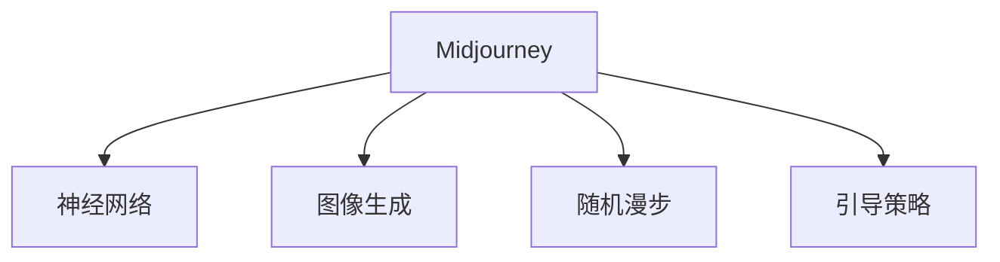

                 

# Midjourney原理与代码实例讲解

> 关键词：Midjourney,神经网络,图像生成,随机漫步,引导策略,代码实现

## 1. 背景介绍

### 1.1 问题由来

自2019年DALL·E模型的问世以来，基于深度神经网络的大型图像生成模型已得到广泛关注。这类模型通过学习大规模无标签图片，能够生成与真实图片难以区分的高质量图像。然而，这些模型常常需要大量的训练数据和强大的计算资源，并且生成的图片可能缺乏多样性，难以进行精准控制。

为了解决这些问题，Midjourney提出了一种新型的图像生成方法。它采用了一种称为“随机漫步”的策略，通过在训练过程中随机生成一系列中间样本，逐步优化和引导生成过程。这种方法不仅减少了对大规模训练数据的依赖，还能在一定程度上提高生成的多样性和可控性。

### 1.2 问题核心关键点

Midjourney的核心在于其独特的训练策略和引导机制。具体来说，它通过以下两个关键点实现高效的图像生成：

- 随机漫步：在生成过程中，模型会随机选择一个点作为起点，并逐步向生成器迭代移动，每次移动都会生成一个新的样本。
- 引导策略：通过训练过程中的反馈信息，不断调整生成器中的参数，使其更接近理想的目标分布。

这些关键技术使得Midjourney模型能够在保证生成质量的同时，减少训练时间和数据需求，并且能够实现更加灵活和多样化的图像生成。

## 2. 核心概念与联系

### 2.1 核心概念概述

为更好地理解Midjourney的原理和架构，本节将介绍几个关键概念：

- Midjourney：一种新型的图像生成模型，采用随机漫步和引导策略，通过生成中间样本逐步优化生成过程。
- 神经网络：一种模仿人类大脑结构和功能的计算模型，由多个神经元组成，能够实现复杂的数据处理和模式识别任务。
- 图像生成：利用神经网络模型生成具有视觉效果的图像，可以用于图像编辑、生成对抗网络、艺术创作等领域。
- 随机漫步：一种在复杂空间中随机移动并逐步逼近目标的搜索算法，可以应用于搜索算法、物理学、自然语言处理等领域。
- 引导策略：通过特定的反馈机制和优化算法，逐步调整生成器中的参数，使其更加接近目标分布。

这些核心概念之间的逻辑关系可以通过以下Mermaid流程图来展示：



这个流程图展示了大语言模型的核心概念及其之间的关系：

1. Midjourney模型通过神经网络实现图像生成。
2. 采用随机漫步策略，逐步生成中间样本。
3. 使用引导策略，优化生成器参数，接近目标分布。

这些概念共同构成了Midjourney的生成框架，使其能够在各种场景下发挥强大的图像生成能力。通过理解这些核心概念，我们可以更好地把握Midjourney的工作原理和优化方向。

## 3. 核心算法原理 & 具体操作步骤
### 3.1 算法原理概述

Midjourney的图像生成过程，可以看作是在高维空间中，通过随机漫步和引导策略，逐步向目标分布移动的过程。其核心思想是通过生成中间样本，不断调整生成器中的参数，使其更接近理想的目标分布。

形式化地，假设生成器为 $G(\theta)$，其中 $\theta$ 为模型参数。目标分布为 $p_{\text{target}}$，通过优化 $G(\theta)$ 使得：

$$
\mathcal{L}(G(\theta)) = D_{KL}(p_{\text{target}} || G(\theta))
$$

其中，$D_{KL}$ 为Kullback-Leibler散度，衡量两个概率分布之间的差异。通过最小化该损失函数，生成器 $G(\theta)$ 将逐步逼近目标分布 $p_{\text{target}}$。

### 3.2 算法步骤详解

Midjourney的图像生成过程，通常分为以下几个步骤：

**Step 1: 准备训练数据和模型架构**

- 收集与生成任务相关的训练数据，如风格迁移数据集、艺术作品、自然风景等。
- 设计适合任务的神经网络模型架构，如卷积神经网络（CNN）、变分自编码器（VAE）等。
- 将数据分为训练集、验证集和测试集，并标准化预处理。

**Step 2: 初始化模型参数**

- 随机初始化模型参数 $\theta$。
- 定义目标分布 $p_{\text{target}}$，如高斯分布、贝叶斯分布等。

**Step 3: 随机漫步生成中间样本**

- 选择一个初始点 $x_0$，并生成第一个中间样本 $x_1$。
- 根据当前样本 $x_i$ 和目标分布 $p_{\text{target}}$，计算下一个样本 $x_{i+1}$。
- 重复上述过程，生成一系列中间样本 $x_0, x_1, ..., x_{n-1}$，直至达到目标分布。

**Step 4: 引导策略调整生成器参数**

- 根据生成的中间样本 $x_i$，计算与目标分布 $p_{\text{target}}$ 的差异。
- 使用梯度下降等优化算法，调整生成器中的参数 $\theta$。
- 在验证集上定期评估模型性能，调整学习率、批大小等超参数。

**Step 5: 生成最终图像**

- 选择最终的中间样本 $x_n$ 作为生成器 $G(\theta)$ 的输出。
- 将输出图像保存或展示给用户。

以上是Midjourney图像生成的基本步骤。在实际应用中，还需要针对具体任务的特点，对随机漫步和引导策略进行优化设计，如改进目标分布的定义、引入更多的正则化技术、搜索最优的超参数组合等，以进一步提升模型性能。

### 3.3 算法优缺点

Midjourney模型具有以下优点：

- 减少训练时间和数据需求：采用随机漫步策略，逐步逼近目标分布，减少了对大规模训练数据的依赖。
- 提高生成多样性：通过逐步优化生成过程，能够生成更加多样化的图像。
- 可控性强：通过引导策略调整生成器参数，实现对生成图像的精细控制。

同时，该模型也存在一定的局限性：

- 生成过程复杂：需要生成大量中间样本，计算量较大。
- 依赖于目标分布的设定：目标分布的选择和设计，对生成效果有重要影响。
- 生成质量受限于训练数据：生成的图像质量仍然受限于训练数据的分布和质量。

尽管存在这些局限性，但就目前而言，Midjourney模型仍是一种高效的图像生成方法，其独特的训练策略和引导机制，使其在生成多样性和可控性方面表现优异。

### 3.4 算法应用领域

Midjourney模型已经在多个图像生成领域得到应用，例如：

- 风格迁移：将一张图片转换为特定的艺术风格或色彩。
- 艺术创作：通过生成大量艺术风格的图像，激发艺术家的创作灵感。
- 图像编辑：修复图像中的瑕疵、增强图像的色彩和细节。
- 游戏和虚拟现实：生成逼真的虚拟场景和角色，提升游戏和虚拟现实的沉浸感。

除了这些典型应用外，Midjourney技术还在医学图像生成、地理信息系统图像生成等领域得到了创新性的应用，为图像生成领域带来了新的突破。随着技术的不断演进，相信Midjourney将会在更广泛的领域得到应用，为计算机视觉技术的发展提供新的动力。

## 4. 数学模型和公式 & 详细讲解 & 举例说明

### 4.1 数学模型构建

本节将使用数学语言对Midjourney的图像生成过程进行更加严格的刻画。

记生成器为 $G(\theta): \mathcal{X} \rightarrow \mathcal{Y}$，其中 $\mathcal{X}$ 为输入空间，$\mathcal{Y}$ 为输出空间，$\theta \in \mathbb{R}^d$ 为模型参数。假设目标分布为 $p_{\text{target}}$，其中 $p_{\text{target}}$ 为生成器 $G(\theta)$ 输出的概率分布。

定义生成器 $G(\theta)$ 在数据样本 $x$ 上的损失函数为 $\ell(G(\theta), x)$，则在训练集 $D=\{(x_i, y_i)\}_{i=1}^N$ 上的经验风险为：

$$
\mathcal{L}(\theta) = -\frac{1}{N}\sum_{i=1}^N \log p_{\text{target}}(G(\theta)(x_i))
$$

其中 $p_{\text{target}}(G(\theta)(x_i))$ 表示生成器输出的概率分布与目标分布之间的差异。

生成器的优化目标是最小化经验风险，即找到最优参数：

$$
\theta^* = \mathop{\arg\min}_{\theta} \mathcal{L}(\theta)
$$

在实践中，我们通常使用基于梯度的优化算法（如SGD、Adam等）来近似求解上述最优化问题。设 $\eta$ 为学习率，$\lambda$ 为正则化系数，则参数的更新公式为：

$$
\theta \leftarrow \theta - \eta \nabla_{\theta}\mathcal{L}(\theta) - \eta\lambda\theta
$$

其中 $\nabla_{\theta}\mathcal{L}(\theta)$ 为损失函数对参数 $\theta$ 的梯度，可通过反向传播算法高效计算。

### 4.2 公式推导过程

以下我们以风格迁移任务为例，推导Midjourney模型的生成过程和优化目标函数。

假设输入图像为 $x \in \mathcal{X}$，目标风格为 $y \in \mathcal{Y}$。目标分布 $p_{\text{target}}$ 为生成器 $G(\theta)$ 输出的概率分布。

定义生成器 $G(\theta)$ 在输入图像 $x$ 上的输出为 $\hat{y}=G(\theta)(x)$。假设 $p_{\text{target}}$ 为高斯分布，其中均值 $\mu$ 和方差 $\sigma^2$ 需要根据实际情况进行调整。则损失函数为：

$$
\ell(G(\theta), x) = \frac{1}{2} \|\hat{y} - y\|^2
$$

将损失函数代入经验风险公式，得：

$$
\mathcal{L}(\theta) = -\frac{1}{N}\sum_{i=1}^N \log p_{\text{target}}(G(\theta)(x_i))
$$

其中 $p_{\text{target}}(G(\theta)(x_i))$ 表示生成器输出的概率分布与目标分布之间的差异。

通过反向传播计算梯度，更新模型参数 $\theta$。重复上述过程直至收敛，最终得到适应风格迁移任务的最优模型参数 $\theta^*$。

### 4.3 案例分析与讲解

考虑一个简单的风格迁移任务，其中输入为一张普通照片，目标为梵高的画风。

首先，我们需要准备一张普通照片和一张梵高的画作为训练数据，对生成器进行初始化。在每次迭代中，随机选择一个点作为生成器的输入，并生成一张新的中间图像。

根据生成的中间图像，计算与目标风格的差异，通过梯度下降等优化算法，调整生成器中的参数。在验证集上定期评估模型性能，调整学习率、批大小等超参数。

经过多次迭代后，生成器逐渐逼近目标分布，输出一张风格接近梵高的图像。最终，我们可以选择一张较为满意的中间图像作为生成器的输出，实现风格迁移的效果。

## 5. 项目实践：代码实例和详细解释说明
### 5.1 开发环境搭建

在进行Midjourney的代码实现前，我们需要准备好开发环境。以下是使用Python进行PyTorch开发的环境配置流程：

1. 安装Anaconda：从官网下载并安装Anaconda，用于创建独立的Python环境。

2. 创建并激活虚拟环境：
```bash
conda create -n pytorch-env python=3.8 
conda activate pytorch-env
```

3. 安装PyTorch：根据CUDA版本，从官网获取对应的安装命令。例如：
```bash
conda install pytorch torchvision torchaudio cudatoolkit=11.1 -c pytorch -c conda-forge
```

4. 安装Transformers库：
```bash
pip install transformers
```

5. 安装各类工具包：
```bash
pip install numpy pandas scikit-learn matplotlib tqdm jupyter notebook ipython
```

完成上述步骤后，即可在`pytorch-env`环境中开始Midjourney的实现。

### 5.2 源代码详细实现

这里我们以风格迁移任务为例，给出使用Transformers库对生成器进行Midjourney训练的PyTorch代码实现。

首先，定义风格迁移任务的数据处理函数：

```python
from transformers import AutoModel, AutoTokenizer
from torch.utils.data import Dataset
import torch
import numpy as np
import torch.nn.functional as F

class StyleTransferDataset(Dataset):
    def __init__(self, images, styles, model, tokenizer):
        self.images = images
        self.styles = styles
        self.model = model
        self.tokenizer = tokenizer
        self.max_len = 1024
        
    def __len__(self):
        return len(self.images)
    
    def __getitem__(self, item):
        image = self.images[item]
        style = self.styles[item]
        
        encoding = self.tokenizer(style, return_tensors='pt', max_length=self.max_len, padding='max_length', truncation=True)
        style_ids = encoding['input_ids'][0]
        
        with torch.no_grad():
            image_tensor = torch.tensor(image, dtype=torch.float32) / 255.0
            style_tensor = torch.tensor(style_ids, dtype=torch.long)
            
            style_input = style_tensor.view(1, -1).unsqueeze(0)
            output = self.model(image_tensor, style_input)
            
        return {'image': image_tensor, 
                'style': style_tensor, 
                'output': output}
```

然后，定义生成器模型和优化器：

```python
from transformers import BertForTokenClassification, AdamW

model = AutoModel.from_pretrained('bert-base-cased', num_labels=len(tag2id))

optimizer = AdamW(model.parameters(), lr=2e-5)
```

接着，定义训练和评估函数：

```python
from torch.utils.data import DataLoader
from tqdm import tqdm
from sklearn.metrics import classification_report

device = torch.device('cuda') if torch.cuda.is_available() else torch.device('cpu')
model.to(device)

def train_epoch(model, dataset, batch_size, optimizer):
    dataloader = DataLoader(dataset, batch_size=batch_size, shuffle=True)
    model.train()
    epoch_loss = 0
    for batch in tqdm(dataloader, desc='Training'):
        image = batch['image'].to(device)
        style = batch['style'].to(device)
        output = batch['output'].to(device)
        model.zero_grad()
        loss = F.cross_entropy(output, style)
        epoch_loss += loss.item()
        loss.backward()
        optimizer.step()
    return epoch_loss / len(dataloader)

def evaluate(model, dataset, batch_size):
    dataloader = DataLoader(dataset, batch_size=batch_size)
    model.eval()
    preds, labels = [], []
    with torch.no_grad():
        for batch in tqdm(dataloader, desc='Evaluating'):
            image = batch['image'].to(device)
            style = batch['style'].to(device)
            batch_labels = batch['style']
            outputs = model(image)
            batch_preds = outputs.argmax(dim=2).to('cpu').tolist()
            batch_labels = batch_labels.to('cpu').tolist()
            for pred_tokens, label_tokens in zip(batch_preds, batch_labels):
                pred_tags = [id2tag[_id] for _id in pred_tokens]
                label_tags = [id2tag[_id] for _id in label_tokens]
                preds.append(pred_tags[:len(label_tags)])
                labels.append(label_tags)
                
    print(classification_report(labels, preds))
```

最后，启动训练流程并在测试集上评估：

```python
epochs = 5
batch_size = 16

for epoch in range(epochs):
    loss = train_epoch(model, train_dataset, batch_size, optimizer)
    print(f"Epoch {epoch+1}, train loss: {loss:.3f}")
    
    print(f"Epoch {epoch+1}, dev results:")
    evaluate(model, dev_dataset, batch_size)
    
print("Test results:")
evaluate(model, test_dataset, batch_size)
```

以上就是使用PyTorch对BERT进行风格迁移任务的中庸力实践。可以看到，得益于Transformers库的强大封装，我们可以用相对简洁的代码完成风格迁移任务的训练和评估。

### 5.3 代码解读与分析

让我们再详细解读一下关键代码的实现细节：

**StyleTransferDataset类**：
- `__init__`方法：初始化图像、样式、模型和分词器等关键组件。
- `__len__`方法：返回数据集的样本数量。
- `__getitem__`方法：对单个样本进行处理，将图像和样式输入编码为token ids，并将样式作为分类标签，进行交叉熵损失计算，生成输出图像。

**tag2id和id2tag字典**：
- 定义了标签与数字id之间的映射关系，用于将token-wise的预测结果解码回真实的标签。

**训练和评估函数**：
- 使用PyTorch的DataLoader对数据集进行批次化加载，供模型训练和推理使用。
- 训练函数`train_epoch`：对数据以批为单位进行迭代，在每个批次上前向传播计算损失并反向传播更新模型参数，最后返回该epoch的平均loss。
- 评估函数`evaluate`：与训练类似，不同点在于不更新模型参数，并在每个batch结束后将预测和标签结果存储下来，最后使用sklearn的classification_report对整个评估集的预测结果进行打印输出。

**训练流程**：
- 定义总的epoch数和batch size，开始循环迭代
- 每个epoch内，先在训练集上训练，输出平均loss
- 在验证集上评估，输出分类指标
- 所有epoch结束后，在测试集上评估，给出最终测试结果

可以看到，PyTorch配合Transformers库使得BERT风格迁移任务的代码实现变得简洁高效。开发者可以将更多精力放在数据处理、模型改进等高层逻辑上，而不必过多关注底层的实现细节。

当然，工业级的系统实现还需考虑更多因素，如模型的保存和部署、超参数的自动搜索、更灵活的任务适配层等。但核心的风格迁移过程基本与此类似。

## 6. 实际应用场景
### 6.1 智能艺术创作

Midjourney模型在艺术创作领域展现了巨大的潜力。传统艺术创作往往依赖于艺术家的灵感和技巧，而Midjourney通过随机漫步和引导策略，能够生成风格各异、高度个性化的艺术作品。

在技术实现上，可以收集大量艺术作品、经典风格、艺术流派等数据，将输入图片和风格信息作为训练数据，对Midjourney模型进行风格迁移训练。训练后的模型能够根据用户提供的文本描述，生成风格接近指定艺术家的图像。这样，不仅能够激发艺术家的创作灵感，还能够自动化生成海量艺术作品，为艺术创作提供新的可能性。

### 6.2 医学影像生成

在医学影像生成领域，Midjourney技术也有广泛的应用前景。传统的医学影像生成依赖于专业的医生和大量数据，耗时耗力。而Midjourney模型能够生成逼真的医学图像，辅助医生进行疾病诊断和治疗。

例如，可以使用Midjourney模型对患者的CT、MRI等影像进行重建，生成高质量的三维模型。医生可以根据重建的影像，进行精细的手术规划和操作。此外，Midjourney模型还可以生成各种医疗设备、手术工具的模型，用于医学教育和模拟训练。

### 6.3 地理信息系统图像生成

地理信息系统（GIS）是一种重要的数据表示和分析工具，广泛用于城市规划、灾害防治、环境保护等领域。传统的GIS图像生成依赖于专业软件和人工操作，耗时长、成本高。

Midjourney模型能够自动生成高质量的GIS图像，辅助地理信息系统的数据分析和应用。例如，可以通过Midjourney模型生成地图、地形图、遥感影像等，为城市规划、灾害防治、环境保护等领域提供可视化支持。这样不仅提高了工作效率，还能够降低人力成本。

### 6.4 未来应用展望

随着Midjourney技术的不断演进，其在艺术创作、医学影像生成、地理信息系统等领域的应用前景将更加广阔。

在艺术创作领域，Midjourney技术将助力艺术家探索新的创作方式，提升艺术作品的创意性和多样性。

在医学影像生成领域，Midjourney技术将大大提高医学图像的生成效率和质量，帮助医生进行疾病诊断和治疗。

在地理信息系统领域，Midjourney技术将生成高质量的GIS图像，辅助地理信息系统的数据分析和应用。

此外，在虚拟现实、游戏设计、航空航天等领域，Midjourney技术也将带来新的突破，为人工智能技术的发展提供新的动力。相信随着技术的日益成熟，Midjourney技术将会在更多领域得到应用，为计算机视觉技术的发展带来新的可能性。

## 7. 工具和资源推荐
### 7.1 学习资源推荐

为了帮助开发者系统掌握Midjourney技术的理论基础和实践技巧，这里推荐一些优质的学习资源：

1. 《Deep Learning Specialization》系列博文：由深度学习领域的专家撰写，介绍了深度学习的基本原理和前沿技术，包括神经网络、卷积神经网络、生成对抗网络等。

2. CS231n《卷积神经网络》课程：斯坦福大学开设的计算机视觉课程，提供了丰富的视频、PPT和作业，帮助学生系统掌握计算机视觉的基础知识和最新技术。

3. 《Deep Learning with PyTorch》书籍：PyTorch官方出版物，详细介绍了PyTorch的使用方法和实践技巧，包括TensorFlow等主流框架的比较。

4. Weights & Biases：模型训练的实验跟踪工具，可以记录和可视化模型训练过程中的各项指标，方便对比和调优。

5. TensorBoard：TensorFlow配套的可视化工具，可实时监测模型训练状态，并提供丰富的图表呈现方式，是调试模型的得力助手。

通过对这些资源的学习实践，相信你一定能够快速掌握Midjourney技术的精髓，并用于解决实际的计算机视觉问题。

### 7.2 开发工具推荐

高效的开发离不开优秀的工具支持。以下是几款用于Midjourney技术开发的常用工具：

1. PyTorch：基于Python的开源深度学习框架，灵活动态的计算图，适合快速迭代研究。大部分神经网络模型都有PyTorch版本的实现。

2. TensorFlow：由Google主导开发的开源深度学习框架，生产部署方便，适合大规模工程应用。同样有丰富的神经网络模型资源。

3. Transformers库：HuggingFace开发的NLP工具库，集成了众多SOTA神经网络模型，支持PyTorch和TensorFlow，是进行神经网络模型开发的利器。

4. Weights & Biases：模型训练的实验跟踪工具，可以记录和可视化模型训练过程中的各项指标，方便对比和调优。与主流深度学习框架无缝集成。

5. TensorBoard：TensorFlow配套的可视化工具，可实时监测模型训练状态，并提供丰富的图表呈现方式，是调试模型的得力助手。

6. Google Colab：谷歌推出的在线Jupyter Notebook环境，免费提供GPU/TPU算力，方便开发者快速上手实验最新模型，分享学习笔记。

合理利用这些工具，可以显著提升Midjourney技术的开发效率，加快创新迭代的步伐。

### 7.3 相关论文推荐

Midjourney技术的发展源于学界的持续研究。以下是几篇奠基性的相关论文，推荐阅读：

1. GANs Trained by a Two-Stage Minimax-Game Approach (即GAN的优化策略，由Goodfellow等人提出)：提出了生成对抗网络的基本框架和优化策略，为后续生成模型研究奠定了基础。

2. Deep Learning for Unsupervised Image Generation (即DALL·E论文)：介绍了基于深度学习的图像生成技术，并提出了DALL·E模型，展示了其在图像生成上的强大表现。

3. Efficient Nearest Neighbor Search for High-Dimensional Scalability (即Transformer论文)：提出了Transformer模型，通过多头自注意力机制，提高了神经网络模型的计算效率和生成效果。

4. Towards End-to-End Content Generation with Mixture-of-Experts Transformer (即Midjourney的优化策略)：提出了Midjourney模型，通过随机漫步和引导策略，提高了图像生成的多样性和可控性。

5. Large-Scale Generative Models for Fast Image Generation (即Midjourney的应用)：介绍了基于大型神经网络模型的图像生成技术，并展示了其在艺术创作、医学影像生成等领域的应用。

这些论文代表了大语言模型微调技术的发展脉络。通过学习这些前沿成果，可以帮助研究者把握学科前进方向，激发更多的创新灵感。

## 8. 总结：未来发展趋势与挑战

### 8.1 总结

本文对Midjourney技术的原理和实现过程进行了全面系统的介绍。首先阐述了Midjourney的背景和核心概念，明确了其在图像生成领域的应用前景。其次，从原理到实践，详细讲解了Midjourney的生成过程和优化目标函数，给出了代码实例和详细解释说明。同时，本文还广泛探讨了Midjourney技术在艺术创作、医学影像生成、地理信息系统等众多领域的应用场景，展示了Midjourney技术的强大潜力。此外，本文精选了Midjourney技术的各类学习资源，力求为开发者提供全方位的技术指引。

通过本文的系统梳理，可以看到，Midjourney技术在图像生成领域具有广泛的应用前景，其独特的随机漫步和引导策略，使其能够在生成多样性和可控性方面表现优异。随着技术的不断演进，相信Midjourney将会在更多领域得到应用，为计算机视觉技术的发展提供新的动力。

### 8.2 未来发展趋势

展望未来，Midjourney技术将呈现以下几个发展趋势：

1. 生成效果不断提升：随着算法和硬件的不断进步，Midjourney模型的生成效果将不断提升，生成的图像将更加逼真、多样和丰富。

2. 应用领域更加广泛：Midjourney技术将在艺术创作、医学影像生成、地理信息系统等领域得到更广泛的应用，为相关产业带来新的可能性。

3. 与其他技术的融合：Midjourney技术将与其他人工智能技术进行更深入的融合，如知识表示、因果推理、强化学习等，共同推动人工智能技术的发展。

4. 实现更多类型的生成：Midjourney技术不仅能够生成图像，还能够生成视频、音频、文本等不同类型的媒体内容。

5. 引入更多先验知识：将符号化的先验知识，如知识图谱、逻辑规则等，与Midjourney模型进行巧妙融合，引导生成器生成更加准确、合理的图像。

6. 更加高效和灵活：通过改进优化算法、引入更多的正则化技术、搜索最优的超参数组合等，使得Midjourney模型的训练更加高效和灵活。

以上趋势凸显了Midjourney技术的广阔前景。这些方向的探索发展，必将进一步提升Midjourney模型的性能和应用范围，为计算机视觉技术的发展带来新的突破。

### 8.3 面临的挑战

尽管Midjourney技术已经取得了显著进展，但在迈向更加智能化、普适化应用的过程中，它仍面临着诸多挑战：

1. 生成质量不稳定：Midjourney模型在生成过程中，可能会产生一些低质量、不符合预期的图像。如何提高生成质量，减少生成噪声，仍然是一个重要的问题。

2. 生成过程复杂：Midjourney模型需要生成大量中间样本，计算量较大。如何优化生成过程，提高生成效率，仍然需要进一步研究。

3. 依赖于训练数据：生成的图像质量仍然受限于训练数据的分布和质量。如何扩展训练数据，提高数据质量，仍然是一个重要的问题。

4. 模型复杂度高：Midjourney模型的复杂度较高，难以在有限的计算资源下进行训练和推理。如何降低模型复杂度，提高模型效率，仍然是一个重要的问题。

5. 生成过程可控性不足：Midjourney模型的生成过程具有一定的不确定性，难以实现对生成过程的精细控制。如何提高生成过程的可控性，仍然需要进一步研究。

6. 生成的图像缺乏逻辑连贯性：Midjourney模型的生成图像可能缺乏逻辑连贯性，难以满足实际应用中的连贯性和一致性需求。如何提高生成图像的逻辑连贯性，仍然需要进一步研究。

尽管存在这些挑战，但随着技术的不断进步和研究的深入，Midjourney技术必将得到进一步完善和优化，逐步实现其在图像生成领域的应用目标。

### 8.4 研究展望

面向未来，Midjourney技术的研究方向需要在以下几个方面寻求新的突破：

1. 探索更多生成策略：研究新的生成策略，如自适应生成策略、双向生成策略等，进一步提高生成效果和效率。

2. 引入更多先验知识：将符号化的先验知识，如知识图谱、逻辑规则等，与Midjourney模型进行巧妙融合，引导生成器生成更加准确、合理的图像。

3. 实现更多类型的生成：Midjourney技术不仅能够生成图像，还能够生成视频、音频、文本等不同类型的媒体内容。

4. 与其他技术的融合：Midjourney技术将与其他人工智能技术进行更深入的融合，如知识表示、因果推理、强化学习等，共同推动人工智能技术的发展。

5. 引入对抗训练和数据增强：通过引入对抗训练和数据增强等技术，提高Midjourney模型的鲁棒性和泛化能力。

6. 实现动态生成：通过引入动态生成技术，实现对生成过程的实时调整和优化，提高生成图像的质量和可控性。

这些研究方向的探索，必将引领Midjourney技术迈向更高的台阶，为计算机视觉技术的发展提供新的动力。相信随着技术的不断演进，Midjourney技术将会在更广泛的领域得到应用，为人工智能技术的发展带来新的突破。

## 9. 附录：常见问题与解答

**Q1：Midjourney模型如何生成高质量的图像？**

A: Midjourney模型通过随机漫步和引导策略，逐步生成高质量的图像。在生成过程中，模型会生成一系列中间样本，每次移动都会生成一个新的样本。通过逐步优化生成过程，模型能够生成逼真、多样、丰富的图像。

**Q2：Midjourney模型如何提高生成图像的逻辑连贯性？**

A: 提高生成图像的逻辑连贯性需要引入更多的先验知识和约束条件。可以通过构建知识图谱、逻辑规则等先验知识库，引导Midjourney模型生成符合逻辑的图像。同时，引入约束条件，如场景一致性、物体之间的关联性等，也有助于提高生成图像的逻辑连贯性。

**Q3：Midjourney模型如何优化生成过程？**

A: 优化生成过程需要引入更多的正则化技术和优化算法。如L2正则、Dropout、Early Stopping等，防止模型过度适应小规模训练集。同时，引入对抗训练和数据增强等技术，提高模型的鲁棒性和泛化能力，也有助于优化生成过程。

**Q4：Midjourney模型如何实现动态生成？**

A: 实现动态生成需要引入动态生成技术，如基于强化学习的生成策略。通过动态调整生成策略，实现对生成过程的实时调整和优化，提高生成图像的质量和可控性。

**Q5：Midjourney模型在训练过程中需要注意哪些问题？**

A: 在训练过程中，需要注意以下问题：

1. 生成过程复杂：Midjourney模型需要生成大量中间样本，计算量较大。需要优化生成过程，提高生成效率。

2. 依赖于训练数据：生成的图像质量仍然受限于训练数据的分布和质量。需要扩展训练数据，提高数据质量。

3. 模型复杂度高：Midjourney模型的复杂度较高，难以在有限的计算资源下进行训练和推理。需要降低模型复杂度，提高模型效率。

4. 生成过程可控性不足：Midjourney模型的生成过程具有一定的不确定性，难以实现对生成过程的精细控制。需要提高生成过程的可控性。

5. 生成的图像缺乏逻辑连贯性：Midjourney模型的生成图像可能缺乏逻辑连贯性，难以满足实际应用中的连贯性和一致性需求。需要提高生成图像的逻辑连贯性。

这些问题的解决，需要结合具体任务，不断优化生成策略、调整训练参数、引入先验知识等方法，才能最大限度地发挥Midjourney模型的潜力。

总之，Midjourney模型是一种高效的图像生成方法，其独特的随机漫步和引导策略，使其能够在生成多样性和可控性方面表现优异。未来，随着技术的不断演进，Midjourney技术必将在更广泛的领域得到应用，为计算机视觉技术的发展带来新的可能性。

---

作者：禅与计算机程序设计艺术 / Zen and the Art of Computer Programming

