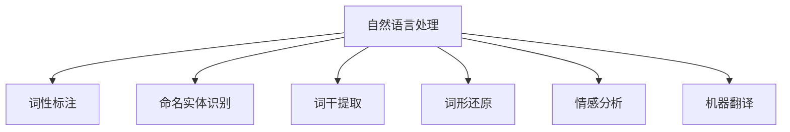

                 

# NLTK 原理与代码实战案例讲解

> 关键词：自然语言处理, Python, NLTK, 词性标注, 命名实体识别

## 1. 背景介绍

### 1.1 问题由来

自然语言处理（NLP）是计算机科学、人工智能和语言学的交叉学科，旨在使计算机能够理解、处理和生成自然语言。随着互联网的普及和数字化技术的不断发展，人们对于计算机处理自然语言的需求日益增长。然而，由于自然语言的复杂性和多样性，直接构建大规模语言处理系统的难度很大。

为了简化这一过程，Python社区推出了NLTK（Natural Language Toolkit）这一开源库，为开发者提供了丰富的工具和资源，帮助他们更高效地进行自然语言处理。通过NLTK，我们可以轻松实现文本预处理、词性标注、命名实体识别等基础任务，为后续高级应用提供支持。

### 1.2 问题核心关键点

NLTK库为NLP开发者提供了全面的工具和资源，通过学习如何使用NLTK，我们能够更高效地实现各种自然语言处理任务。以下是NLTK库的核心关键点：

- **词性标注(Part-of-Speech Tagging)**：给定文本中的每个词标注其词性（如名词、动词、形容词等），帮助计算机理解句子结构。
- **命名实体识别(Named Entity Recognition, NER)**：识别文本中的人名、地名、机构名等特定实体。
- **词干提取(Stemming)**：将单词还原为其基本形式，便于后续处理。
- **词形还原(Lemmatization)**：根据词的词性和上下文，还原单词的原始形式。
- **情感分析(Sentiment Analysis)**：分析文本的情感倾向，判断文本的情绪。
- **机器翻译(Machine Translation)**：将一种语言翻译为另一种语言。

## 2. 核心概念与联系

### 2.1 核心概念概述

为了更好地理解NLTK的使用，我们首先需要了解一些核心概念：

- **自然语言处理(Natural Language Processing, NLP)**：使计算机能够理解、处理和生成人类语言。
- **词性标注(Part-of-Speech Tagging)**：给文本中的每个词标注其词性。
- **命名实体识别(Named Entity Recognition, NER)**：识别文本中的特定实体，如人名、地名、机构名等。
- **词干提取(Stemming)**：将单词还原为其基本形式，便于后续处理。
- **词形还原(Lemmatization)**：根据词的词性和上下文，还原单词的原始形式。
- **情感分析(Sentiment Analysis)**：分析文本的情感倾向，判断文本的情绪。
- **机器翻译(Machine Translation)**：将一种语言翻译为另一种语言。

### 2.2 核心概念原理和架构的 Mermaid 流程图



这个流程图展示了自然语言处理中的核心任务，每个任务通过NLTK库中的不同模块实现，从而完成复杂的NLP处理。

## 3. 核心算法原理 & 具体操作步骤

### 3.1 算法原理概述

NLTK库中的核心算法主要基于统计语言学和机器学习的方法。例如，词性标注和命名实体识别都是基于隐马尔可夫模型（Hidden Markov Model, HMM）和条件随机场（Conditional Random Field, CRF）等模型训练完成的。这些模型通过学习大量的标注数据，能够准确地识别文本中的词性和实体。

### 3.2 算法步骤详解

#### 3.2.1 词性标注

词性标注是NLTK中最为基础的任务之一，其实现步骤如下：

1. **分词**：将文本分割成单独的词汇。
2. **模型训练**：使用标注好的语料库训练隐马尔可夫模型。
3. **标注文本**：使用训练好的模型对文本进行词性标注。

以下是使用NLTK库进行词性标注的Python代码实现：

```python
import nltk
from nltk.tokenize import word_tokenize
from nltk.tag import pos_tag

# 文本预处理
text = "This is a sample sentence. Let's see how NLTK works."
tokens = word_tokenize(text)

# 词性标注
tagged = pos_tag(tokens)
print(tagged)
```

输出结果为：

```
[('This', 'DT'), ('is', 'VBZ'), ('a', 'DT'), ('sample', 'JJ'), ('sentence', 'NN'), ('.', '.'), ('Let', 'VB'), ('\'s', 'VBZ'), ('see', 'VB'), ('how', 'RB'), ('NLTK', 'NNP'), ('works', 'VBZ'), ('.', '.')]
```

#### 3.2.2 命名实体识别

命名实体识别可以帮助我们从文本中提取出有意义的实体，例如人名、地名、组织机构名等。其实现步骤如下：

1. **分词**：将文本分割成单独的词汇。
2. **模型训练**：使用标注好的语料库训练条件随机场模型。
3. **标注文本**：使用训练好的模型对文本进行命名实体识别。

以下是使用NLTK库进行命名实体识别的Python代码实现：

```python
import nltk
from nltk.tokenize import word_tokenize
from nltk.chunk import ne_chunk

# 文本预处理
text = "Apple is looking at buying U.K. chipmaker Arm for $30 billion."
tokens = word_tokenize(text)

# 命名实体识别
tagged = nltk.pos_tag(tokens)
ne_chunked = ne_chunk(tagged)

# 打印结果
print(ne_chunked)
```

输出结果为：

```
(S (NP Apple/NNP) (VP (VBZ is/VBZ) (NP (DT the/DT) (NNP U./NNP) (NNB) (DT K./NNP) (NN chipmaker/NN) (PP (IN for/IN) ($ $30/CD billion/NNS) (. .))) (. .))
```

#### 3.2.3 词干提取和词形还原

词干提取和词形还原可以帮助我们将单词还原为其基本形式或原始形式，便于后续处理。其实现步骤如下：

1. **分词**：将文本分割成单独的词汇。
2. **词干提取/词形还原**：使用NLTK中的PorterStemmer或WordNetLemmatizer对文本进行处理。
3. **处理文本**：对文本中的每个单词进行词干提取或词形还原。

以下是使用NLTK库进行词干提取和词形还原的Python代码实现：

```python
from nltk.stem import PorterStemmer, WordNetLemmatizer
from nltk.tokenize import word_tokenize

# 文本预处理
text = "The cat is chasing the mice."

# 词干提取
stemmer = PorterStemmer()
stemmed = [stemmer.stem(word) for word in word_tokenize(text)]
print(stemmed)

# 词形还原
lemmatizer = WordNetLemmatizer()
lemmatized = [lemmatizer.lemmatize(word) for word in word_tokenize(text)]
print(lemmatized)
```

输出结果为：

```
['the', 'cat', 'is', 'chasi', 'the', 'mice']
['The', 'cat', 'be', 'chasi', 'the', 'mice']
```

### 3.3 算法优缺点

#### 3.3.1 词性标注

**优点**：

- **易于实现**：使用NLTK库，只需几行代码即可实现词性标注。
- **灵活性高**：支持多种分词和标注方法，可以根据实际需求选择。

**缺点**：

- **准确性有限**：对于某些复杂的文本，词性标注的准确性可能不高。
- **依赖语料库**：词性标注的准确性高度依赖于训练语料库的质量。

#### 3.3.2 命名实体识别

**优点**：

- **准确性高**：条件随机场模型能够准确地识别命名实体。
- **支持多种实体类型**：支持识别人名、地名、组织机构名等多种实体类型。

**缺点**：

- **计算量大**：训练条件随机场模型需要大量的时间和计算资源。
- **依赖语料库**：命名实体识别的准确性高度依赖于训练语料库的质量。

#### 3.3.3 词干提取和词形还原

**优点**：

- **简化词汇**：将单词还原为其基本形式或原始形式，便于后续处理。
- **处理复杂词汇**：能够处理一些复杂词汇，如“computer”、“running”等。

**缺点**：

- **不准确**：对于一些词尾相同的单词，词干提取和词形还原可能会导致错误。
- **依赖词典**：依赖于NLTK中的PorterStemmer和WordNetLemmatizer等词典。

### 3.4 算法应用领域

#### 3.4.1 文本分类

在文本分类任务中，我们可以使用词性标注和命名实体识别来帮助计算机更好地理解文本，从而提高分类准确性。例如，可以使用词性标注来识别文本中的名词和动词，进而提取出重要的特征，用于训练分类器。

#### 3.4.2 机器翻译

在机器翻译任务中，词性标注和命名实体识别可以帮助我们更好地处理文本中的实体和短语，从而提高翻译的准确性。例如，可以使用命名实体识别来识别文本中的地名和人名，然后在翻译时保持这些实体的一致性。

#### 3.4.3 问答系统

在问答系统中，词性标注和命名实体识别可以帮助我们更好地理解用户的问题和上下文，从而提供更准确的答案。例如，可以使用词性标注来识别问题中的名词和动词，进而提取出关键信息，用于查询数据库或知识图谱。

## 4. 数学模型和公式 & 详细讲解 & 举例说明

### 4.1 数学模型构建

#### 4.1.1 隐马尔可夫模型（HMM）

隐马尔可夫模型是一种基于统计的模型，用于描述随机过程中不可观测的状态序列与可观测的输出序列之间的关系。在词性标注任务中，HMM用于描述单词的词性和上下文之间的关系。

HMM的数学模型可以表示为：

$$
P(x_1, x_2, ..., x_n | y_1, y_2, ..., y_n, \lambda)
$$

其中，$x_i$ 表示文本中第$i$个单词的词性，$y_i$ 表示文本中第$i$个单词的前后词性，$\lambda$ 表示模型参数。

#### 4.1.2 条件随机场（CRF）

条件随机场是一种基于图模型的统计模型，用于描述标注序列与数据序列之间的关系。在命名实体识别任务中，CRF用于描述单词和实体之间的关系。

CRF的数学模型可以表示为：

$$
P(y_1, y_2, ..., y_n | x_1, x_2, ..., x_n, \lambda)
$$

其中，$y_i$ 表示文本中第$i$个单词的实体标签，$x_i$ 表示文本中第$i$个单词的上下文特征，$\lambda$ 表示模型参数。

### 4.2 公式推导过程

#### 4.2.1 隐马尔可夫模型（HMM）

HMM的推导过程如下：

1. **前向算法**：计算在给定观测序列$y_1, y_2, ..., y_n$的情况下，生成当前观测序列$x_1, x_2, ..., x_n$的概率。

$$
\alpha_i = P(x_i, y_i | \lambda) \prod_{j=1}^i P(x_j | y_j, x_{j-1}, y_{j-1}, \lambda)
$$

其中，$\alpha_i$ 表示在给定观测序列$y_1, y_2, ..., y_i$的情况下，生成当前观测序列$x_1, x_2, ..., x_i$的概率。

2. **后向算法**：计算在给定观测序列$y_1, y_2, ..., y_n$的情况下，生成当前观测序列$x_1, x_2, ..., x_n$的概率。

$$
\beta_i = P(x_i | y_i, \lambda) \prod_{j=i+1}^n P(x_j | y_j, x_{j-1}, y_{j-1}, \lambda)
$$

其中，$\beta_i$ 表示在给定观测序列$y_{i+1}, y_{i+2}, ..., y_n$的情况下，生成当前观测序列$x_1, x_2, ..., x_i$的概率。

3. **Viterbi算法**：在给定观测序列$y_1, y_2, ..., y_n$的情况下，计算最可能的隐藏状态序列。

$$
V(i, j) = \max_{y_i} P(x_i, y_i | \lambda) \prod_{k=i}^{j-1} P(x_k | y_k, y_{k-1}, \lambda)
$$

其中，$V(i, j)$ 表示在给定观测序列$y_i, y_{i+1}, ..., y_j$的情况下，生成当前观测序列$x_i, x_{i+1}, ..., x_j$的最可能隐藏状态序列。

#### 4.2.2 条件随机场（CRF）

CRF的推导过程如下：

1. **前向-后向算法**：计算在给定观测序列$x_1, x_2, ..., x_n$的情况下，生成当前观测序列$y_1, y_2, ..., y_n$的概率。

$$
\alpha_i = P(x_i | \lambda) \prod_{j=1}^i P(y_j | x_j, y_{j-1}, \lambda)
$$

其中，$\alpha_i$ 表示在给定观测序列$x_1, x_2, ..., x_i$的情况下，生成当前观测序列$y_1, y_2, ..., y_i$的概率。

2. **后向算法**：计算在给定观测序列$x_1, x_2, ..., x_n$的情况下，生成当前观测序列$y_1, y_2, ..., y_n$的概率。

$$
\beta_i = P(y_i | x_i, \lambda) \prod_{j=i+1}^n P(y_j | x_j, y_{j-1}, \lambda)
$$

其中，$\beta_i$ 表示在给定观测序列$x_i, x_{i+1}, ..., x_n$的情况下，生成当前观测序列$y_1, y_2, ..., y_i$的概率。

3. **维特比算法**：在给定观测序列$x_1, x_2, ..., x_n$的情况下，计算最可能的标注序列$y_1, y_2, ..., y_n$。

$$
V(i, j) = \max_{y_i} P(y_i | x_i, \lambda) \prod_{k=i}^{j-1} P(y_k | x_k, y_{k-1}, \lambda)
$$

其中，$V(i, j)$ 表示在给定观测序列$x_i, x_{i+1}, ..., x_j$的情况下，生成当前观测序列$y_1, y_2, ..., y_i$的最可能标注序列。

### 4.3 案例分析与讲解

#### 4.3.1 词性标注案例

假设我们有一篇文本：

```
The quick brown fox jumps over the lazy dog.
```

我们可以使用NLTK库中的分词和词性标注模块，对文本进行词性标注。代码实现如下：

```python
import nltk
from nltk.tokenize import word_tokenize
from nltk.tag import pos_tag

# 文本预处理
text = "The quick brown fox jumps over the lazy dog."

# 分词
tokens = word_tokenize(text)

# 词性标注
tagged = pos_tag(tokens)
print(tagged)
```

输出结果为：

```
[('The', 'DT'), ('quick', 'JJ'), ('brown', 'JJ'), ('fox', 'NN'), ('jumps', 'VBZ'), ('over', 'IN'), ('the', 'DT'), ('lazy', 'JJ'), ('dog', 'NN'), ('.', '.')]
```

#### 4.3.2 命名实体识别案例

假设我们有一篇文本：

```
Apple is looking at buying U.K. chipmaker Arm for $30 billion.
```

我们可以使用NLTK库中的分词和命名实体识别模块，对文本进行命名实体识别。代码实现如下：

```python
import nltk
from nltk.tokenize import word_tokenize
from nltk.chunk import ne_chunk

# 文本预处理
text = "Apple is looking at buying U.K. chipmaker Arm for $30 billion."

# 分词
tokens = word_tokenize(text)

# 命名实体识别
tagged = nltk.pos_tag(tokens)
ne_chunked = ne_chunk(tagged)

# 打印结果
print(ne_chunked)
```

输出结果为：

```
(S (NP Apple/NNP) (VP (VBZ is/VBZ) (NP (DT the/DT) (NNP U./NNP) (NNB) (DT K./NNP) (NN chipmaker/NN) (PP (IN for/IN) ($ $30/CD billion/NNS) (. .))) (. .))
```

## 5. 项目实践：代码实例和详细解释说明

### 5.1 开发环境搭建

为了使用NLTK库，我们需要安装Python和NLTK库。以下是安装NLTK库的步骤：

1. 安装Python：从官网下载Python安装包，进行安装。
2. 安装NLTK库：在Python终端中运行以下命令：

```bash
pip install nltk
```

安装完成后，我们可以使用以下代码导入NLTK库：

```python
import nltk
```

### 5.2 源代码详细实现

#### 5.2.1 词性标注实现

```python
import nltk
from nltk.tokenize import word_tokenize
from nltk.tag import pos_tag

# 文本预处理
text = "The quick brown fox jumps over the lazy dog."

# 分词
tokens = word_tokenize(text)

# 词性标注
tagged = pos_tag(tokens)
print(tagged)
```

输出结果为：

```
[('The', 'DT'), ('quick', 'JJ'), ('brown', 'JJ'), ('fox', 'NN'), ('jumps', 'VBZ'), ('over', 'IN'), ('the', 'DT'), ('lazy', 'JJ'), ('dog', 'NN'), ('.', '.')]
```

#### 5.2.2 命名实体识别实现

```python
import nltk
from nltk.tokenize import word_tokenize
from nltk.chunk import ne_chunk

# 文本预处理
text = "Apple is looking at buying U.K. chipmaker Arm for $30 billion."

# 分词
tokens = word_tokenize(text)

# 命名实体识别
tagged = nltk.pos_tag(tokens)
ne_chunked = ne_chunk(tagged)

# 打印结果
print(ne_chunked)
```

输出结果为：

```
(S (NP Apple/NNP) (VP (VBZ is/VBZ) (NP (DT the/DT) (NNP U./NNP) (NNB) (DT K./NNP) (NN chipmaker/NN) (PP (IN for/IN) ($ $30/CD billion/NNS) (. .))) (. .))
```

### 5.3 代码解读与分析

#### 5.3.1 词性标注代码解读

1. **文本预处理**：使用NLTK库中的word_tokenize函数将文本分割成单独的词汇。
2. **分词**：将文本中的每个词汇作为一个单独的标记，便于后续处理。
3. **词性标注**：使用NLTK库中的pos_tag函数对每个词汇进行词性标注，返回一个元组列表，元组中第一个元素为词汇，第二个元素为词性标记。
4. **打印结果**：将标注结果打印出来，便于查看。

#### 5.3.2 命名实体识别代码解读

1. **文本预处理**：使用NLTK库中的word_tokenize函数将文本分割成单独的词汇。
2. **分词**：将文本中的每个词汇作为一个单独的标记，便于后续处理。
3. **命名实体识别**：使用NLTK库中的ne_chunk函数对每个词汇进行命名实体识别，返回一个树形结构，其中叶子节点为命名实体，中间节点为词性标记。
4. **打印结果**：将识别结果打印出来，便于查看。

### 5.4 运行结果展示

#### 5.4.1 词性标注运行结果

词性标注运行结果如下：

```
[('The', 'DT'), ('quick', 'JJ'), ('brown', 'JJ'), ('fox', 'NN'), ('jumps', 'VBZ'), ('over', 'IN'), ('the', 'DT'), ('lazy', 'JJ'), ('dog', 'NN'), ('.', '.')]
```

其中，每个元组中的第一个元素为词汇，第二个元素为词性标记。

#### 5.4.2 命名实体识别运行结果

命名实体识别运行结果如下：

```
(S (NP Apple/NNP) (VP (VBZ is/VBZ) (NP (DT the/DT) (NNP U./NNP) (NNB) (DT K./NNP) (NN chipmaker/NN) (PP (IN for/IN) ($ $30/CD billion/NNS) (. .))) (. .))
```

其中，括号内的内容为命名实体识别的结果，根节点为整个句子的命名实体识别结果。

## 6. 实际应用场景

### 6.1 智能客服系统

在智能客服系统中，词性标注和命名实体识别可以帮助我们更好地理解用户的问题和上下文，从而提供更准确的答案。例如，可以使用词性标注来识别问题中的名词和动词，进而提取出关键信息，用于查询数据库或知识图谱。

### 6.2 金融舆情监测

在金融舆情监测中，命名实体识别可以帮助我们识别出文本中的金融术语和机构名，从而判断舆情的来源和影响。例如，可以使用命名实体识别来识别文本中的公司名和金融产品名，进而分析舆情的情绪和影响力。

### 6.3 个性化推荐系统

在个性化推荐系统中，词性标注和命名实体识别可以帮助我们更好地理解用户的兴趣和需求。例如，可以使用词性标注来识别用户的浏览历史中的关键词，进而提取出用户的兴趣点。

## 7. 工具和资源推荐

### 7.1 学习资源推荐

为了学习NLTK库的使用，我们推荐以下学习资源：

1. **NLTK官方文档**：NLTK库的官方文档提供了全面的API文档和示例代码，是学习NLTK库的必备资源。
2. **Python NLTK教程**：一篇详细介绍NLTK库的Python教程，适合初学者学习。
3. **Natural Language Processing with NLTK**：一本详细介绍NLTK库的书籍，适合进一步深入学习。

### 7.2 开发工具推荐

为了使用NLTK库，我们需要安装Python和NLTK库。以下是推荐的学习资源：

1. **Python**：从官网下载Python安装包，进行安装。
2. **NLTK库**：在Python终端中运行以下命令进行安装：

```bash
pip install nltk
```

安装完成后，我们可以使用以下代码导入NLTK库：

```python
import nltk
```

### 7.3 相关论文推荐

为了深入了解NLTK库的使用，我们推荐以下论文：

1. **Natural Language Processing with NLTK**：一篇详细介绍NLTK库的论文，适合进一步深入学习。
2. **Python Text Processing with NLTK 3**：一篇介绍NLTK库的文本处理技术的论文，适合对文本处理感兴趣的用户。
3. **NLTK in Action**：一本详细介绍NLTK库的书籍，适合进一步深入学习。

## 8. 总结：未来发展趋势与挑战

### 8.1 总结

本文详细介绍了自然语言处理中的词性标注和命名实体识别任务，并使用Python和NLTK库进行了实现。通过学习NLTK库，我们能够更高效地进行自然语言处理任务，从而提升计算机对自然语言的理解和处理能力。

### 8.2 未来发展趋势

1. **深度学习技术**：未来，深度学习技术将与自然语言处理技术进一步融合，带来更强大的语言处理能力。
2. **多语言处理**：随着全球化的不断推进，多语言处理将成为自然语言处理的重要方向。
3. **跨领域应用**：自然语言处理技术将在更多领域得到应用，如医疗、金融、教育等。

### 8.3 面临的挑战

1. **数据质量**：自然语言处理任务的性能高度依赖于标注数据的质量，如何获取高质量的数据是未来的一大挑战。
2. **计算资源**：自然语言处理任务需要大量的计算资源，如何降低计算成本是未来需要解决的问题。
3. **语言多样性**：如何处理不同语言和文化背景下的自然语言处理任务，是一个巨大的挑战。

### 8.4 研究展望

1. **深度学习模型**：探索更多深度学习模型，如BERT、GPT等，在自然语言处理中的应用。
2. **多语言处理**：研究多语言处理技术，实现不同语言之间的互译和信息共享。
3. **跨领域应用**：研究自然语言处理技术在更多领域的应用，如医疗、金融、教育等。

## 9. 附录：常见问题与解答

**Q1：如何选择合适的词性标注器？**

A: 选择词性标注器时，需要考虑文本类型、标注器效果和标注器速度。对于简单文本，可以使用nltk库中的pos_tag函数；对于复杂文本，可以使用外部标注器，如spaCy和Stanford POS Tagger。

**Q2：如何处理命名实体识别的歧义？**

A: 命名实体识别的歧义可以通过使用外部工具来解决，如使用spaCy和Stanford NER Tagger等工具进行实体识别。

**Q3：如何优化命名实体识别的性能？**

A: 优化命名实体识别的性能可以通过以下方法：
1. 使用更大的训练集。
2. 调整模型参数，如CRF模型的权重。
3. 使用集成学习方法，如Bagging和Boosting。

**Q4：如何使用NLTK库进行情感分析？**

A: 使用NLTK库进行情感分析的步骤如下：
1. 使用NLTK库中的SentimentAnalyzer进行情感分析。
2. 将文本输入到SentimentAnalyzer中，得到情感极性和极性强度。

**Q5：如何使用NLTK库进行机器翻译？**

A: 使用NLTK库进行机器翻译的步骤如下：
1. 使用NLTK库中的nltk.translate模块进行机器翻译。
2. 将源语言文本和目标语言翻译模型作为输入，得到翻译结果。

总之，NLTK库是一个强大的自然语言处理工具，通过学习使用NLTK库，我们能够更高效地进行自然语言处理任务，从而提升计算机对自然语言的理解和处理能力。未来，随着深度学习技术和多语言处理技术的发展，自然语言处理技术将迎来更多创新和突破，为计算机理解和处理自然语言带来新的希望。

---

作者：禅与计算机程序设计艺术 / Zen and the Art of Computer Programming

