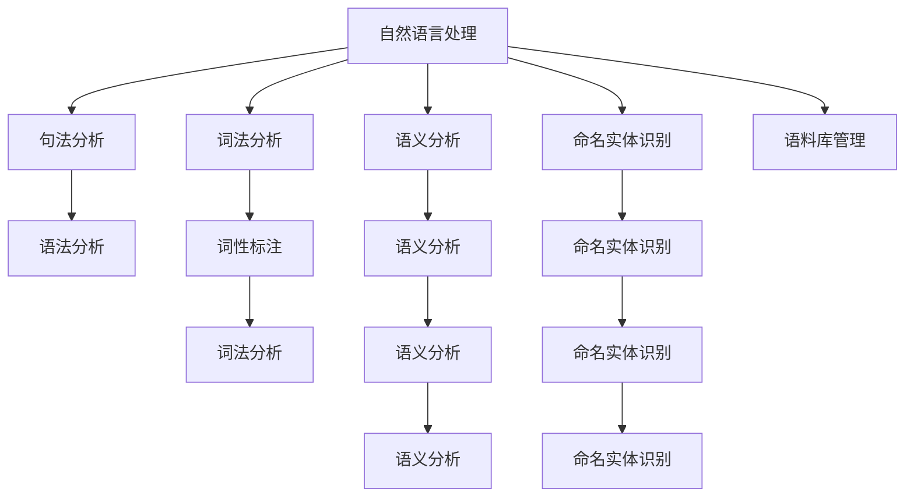

                 

# NLTK 原理与代码实战案例讲解

> 关键词：自然语言处理 (NLP), 自然语言工具包 (NLTK), 词法分析 (Tokenization), 词性标注 (Part-of-Speech Tagging), 命名实体识别 (Named Entity Recognition), 语义分析 (Semantic Analysis), 语法分析 (Syntactic Parsing), 语料库管理 (Corpus Management)

## 1. 背景介绍

### 1.1 问题由来
随着大数据和人工智能技术的迅猛发展，自然语言处理（Natural Language Processing, NLP）成为了计算机科学和人工智能领域的一个热门研究方向。自然语言处理通过将自然语言转化为计算机可理解的形式，使得计算机能够进行语义理解、情感分析、信息检索等复杂任务。然而，自然语言处理的复杂性在于其语言的开放性和多样性，这要求研究者开发出适应广泛语言特点的工具和算法。

### 1.2 问题核心关键点
自然语言处理的核心问题包括文本预处理、词法分析、句法分析、语义分析、命名实体识别、情感分析等。其中，文本预处理是所有自然语言处理任务的基础，词法分析和句法分析则是理解句子结构的关键步骤，而语义分析和命名实体识别则深入挖掘文本内容的语义信息。

为了简化自然语言处理的开发和应用，许多研究者和开发者开发出了各种自然语言处理工具包，其中最有名的当属自然语言工具包（Natural Language Toolkit, NLTK）。NLTK是一个Python库，提供了丰富的自然语言处理工具和数据，包括词法分析、句法分析、语义分析、命名实体识别等功能，是自然语言处理领域的重要资源。

## 2. 核心概念与联系

### 2.1 核心概念概述

为更好地理解自然语言处理工具包NLTK的原理和应用，本节将介绍几个密切相关的核心概念：

- 自然语言处理 (NLP)：通过计算机技术分析和理解自然语言，使其可以被机器理解和处理。包括文本预处理、词法分析、句法分析、语义分析、命名实体识别等关键步骤。

- 自然语言工具包 (NLTK)：Python语言编写的自然语言处理库，提供了多种自然语言处理功能，包括文本预处理、词法分析、句法分析、语义分析、命名实体识别等。

- 词法分析 (Tokenization)：将文本拆分成有意义的词语单元，是自然语言处理的基础步骤。

- 词性标注 (Part-of-Speech Tagging)：为文本中的每个词语标注其词性（如名词、动词、形容词等），帮助理解句子结构。

- 命名实体识别 (Named Entity Recognition)：从文本中识别出人名、地名、组织机构名等命名实体。

- 语义分析 (Semantic Analysis)：分析文本中的语义信息，理解句子的含义和逻辑关系。

- 语法分析 (Syntactic Parsing)：分析文本的句子结构，理解词与词之间的关系。

- 语料库管理 (Corpus Management)：管理和维护大规模的文本数据集，是自然语言处理研究的必要工具。

这些核心概念之间的逻辑关系可以通过以下Mermaid流程图来展示：



这个流程图展示了大语言模型的核心概念及其之间的关系：

1. 自然语言处理是核心，通过多个关键步骤实现自然语言的理解和处理。
2. 词法分析是基础，将文本拆分成词语单元。
3. 句法分析深入挖掘句子结构。
4. 语义分析理解句子的含义和逻辑关系。
5. 命名实体识别识别出文本中的命名实体。
6. 语料库管理管理和维护大规模文本数据集。

这些概念共同构成了自然语言处理的工具和方法，使得计算机能够理解和处理自然语言。

## 3. 核心算法原理 & 具体操作步骤
### 3.1 算法原理概述

自然语言处理工具包NLTK的核心算法原理主要包括以下几个方面：

- 文本预处理：包括分词、去除停用词、词干提取等步骤，为后续的自然语言处理提供基础数据。

- 词法分析：将文本拆分为单词、词组等有意义的词语单元，是自然语言处理的基础。

- 词性标注：为每个单词标注其词性，帮助理解句子结构和语法关系。

- 命名实体识别：从文本中识别出人名、地名、组织机构名等命名实体，是信息提取的重要步骤。

- 语义分析：理解句子的含义和逻辑关系，是自然语言处理的关键步骤。

- 句法分析：分析句子的结构，理解词与词之间的关系。

- 语料库管理：管理和维护大规模的文本数据集，是自然语言处理研究的必要工具。

### 3.2 算法步骤详解

NLTK提供了丰富的自然语言处理功能，使用NLTK进行自然语言处理的典型步骤如下：

**Step 1: 准备数据集**
- 收集自然语言处理任务所需的数据集，确保数据集的规模和质量。

**Step 2: 安装NLTK**
- 使用pip命令安装NLTK库：
```bash
pip install nltk
```

**Step 3: 导入数据和预处理**
- 使用NLTK提供的tokenize、pos_tag、ne_chunk等函数对文本进行预处理。

**Step 4: 词法分析**
- 使用NLTK提供的word_tokenize函数进行词法分析。

**Step 5: 词性标注**
- 使用NLTK提供的pos_tag函数进行词性标注。

**Step 6: 命名实体识别**
- 使用NLTK提供的ne_chunk函数进行命名实体识别。

**Step 7: 语义分析**
- 使用NLTK提供的依存句法分析器和语义分析器进行语义分析。

**Step 8: 句法分析**
- 使用NLTK提供的依存句法分析器进行句法分析。

**Step 9: 语料库管理**
- 使用NLTK提供的语料库管理工具，如punkt、averaged_perceptron_tagger等，管理和维护语料库。

### 3.3 算法优缺点

自然语言处理工具包NLTK具有以下优点：
1. 功能丰富：提供了词法分析、词性标注、命名实体识别、语义分析、句法分析等多种功能。
2. 简单易用：Python语言实现，易于学习和使用。
3. 数据资源丰富：内置多个语料库和词库，方便开发者进行自然语言处理任务。

同时，NLTK也存在一些缺点：
1. 速度较慢：由于功能丰富，NLTK的处理速度较慢，不适合大规模数据集。
2. 不适用于特定领域：由于是通用工具包，NLTK在某些特定领域的应用可能不如专用工具包。
3. 代码复杂：功能丰富也意味着代码复杂，开发者需要花费更多时间调试和优化。

### 3.4 算法应用领域

自然语言处理工具包NLTK在自然语言处理领域得到了广泛的应用，包括但不限于以下几个方面：

- 文本预处理：如分词、去停用词、词干提取等。
- 词法分析：将文本拆分为有意义的词语单元。
- 词性标注：标注每个单词的词性，帮助理解句子结构和语法关系。
- 命名实体识别：识别文本中的命名实体，如人名、地名、组织机构名等。
- 语义分析：理解句子的含义和逻辑关系，如语义角色标注、词向量等。
- 句法分析：分析句子的结构，理解词与词之间的关系。
- 语料库管理：管理和维护大规模的文本数据集，如punkt、averaged_perceptron_tagger等。

这些应用领域展示了NLTK的强大功能和广泛应用。

## 4. 数学模型和公式 & 详细讲解  
### 4.1 数学模型构建

本节将使用数学语言对NLTK的自然语言处理过程进行更加严格的刻画。

假设有文本序列 $S = [s_1, s_2, ..., s_n]$，其中 $s_i$ 表示文本中的第 $i$ 个单词。假设 $T$ 表示词法分析的结果，$P$ 表示词性标注的结果，$N$ 表示命名实体识别的结果，$R$ 表示语义分析的结果，$G$ 表示句法分析的结果，$C$ 表示语料库管理的结果。

定义词法分析函数 $T(S)$，词性标注函数 $P(S)$，命名实体识别函数 $N(S)$，语义分析函数 $R(S)$，句法分析函数 $G(S)$，语料库管理函数 $C(S)$。

则整个自然语言处理过程可以表示为：

$$
[S] \xrightarrow{T} [T] \xrightarrow{P} [P] \xrightarrow{N} [N] \xrightarrow{R} [R] \xrightarrow{G} [G] \xrightarrow{C} [C]
$$

### 4.2 公式推导过程

以下是一些常见的数学公式，展示了NLTK中常用的自然语言处理任务的公式推导：

**词法分析**
- 词法分析函数 $T(S)$ 将文本序列 $S$ 拆分为单词序列 $T$：
$$
T(S) = \{t_i | t_i \in S\}
$$

**词性标注**
- 词性标注函数 $P(S)$ 为单词序列 $S$ 中的每个单词 $s_i$ 标注其词性 $p_i$：
$$
P(S) = \{(p_i, s_i) | i = 1, ..., n\}
$$

**命名实体识别**
- 命名实体识别函数 $N(S)$ 识别单词序列 $S$ 中的命名实体 $n_i$：
$$
N(S) = \{n_i | n_i \in S\}
$$

**语义分析**
- 语义分析函数 $R(S)$ 分析单词序列 $S$ 的语义信息 $r_i$：
$$
R(S) = \{r_i | i = 1, ..., n\}
$$

**句法分析**
- 句法分析函数 $G(S)$ 分析单词序列 $S$ 的句法结构 $g_i$：
$$
G(S) = \{g_i | i = 1, ..., n\}
$$

**语料库管理**
- 语料库管理函数 $C(S)$ 管理和维护语料库 $C$，包括分词、词性标注、命名实体识别等功能：
$$
C(S) = C
$$

这些公式展示了NLTK中常见的自然语言处理任务的数学推导过程，为后续的详细讲解和案例分析提供了基础。

## 5. 项目实践：代码实例和详细解释说明
### 5.1 开发环境搭建

在进行自然语言处理任务开发前，我们需要准备好开发环境。以下是使用Python进行NLTK开发的环境配置流程：

1. 安装Anaconda：从官网下载并安装Anaconda，用于创建独立的Python环境。

2. 创建并激活虚拟环境：
```bash
conda create -n nltk-env python=3.8 
conda activate nltk-env
```

3. 安装NLTK：
```bash
pip install nltk
```

4. 下载和安装语言数据：
```bash
nltk.download('punkt')
nltk.download('averaged_perceptron_tagger')
nltk.download('maxent_ne_chunker')
nltk.download('words')
```

完成上述步骤后，即可在`nltk-env`环境中开始自然语言处理任务的开发。

### 5.2 源代码详细实现

下面我们以词性标注（Part-of-Speech Tagging）为例，给出使用NLTK库对文本进行词性标注的Python代码实现。

```python
import nltk
from nltk.tokenize import word_tokenize
from nltk import pos_tag

# 加载语言数据
nltk.download('punkt')
nltk.download('averaged_perceptron_tagger')

# 待标注的文本
text = "Natural language processing is a subfield of computer science, concerned with the interactions between computers and human (or natural) languages."

# 分词
tokens = word_tokenize(text)

# 词性标注
tagged_tokens = pos_tag(tokens)

# 输出结果
print(tagged_tokens)
```

运行以上代码，即可输出词性标注的结果，每个单词对应其词性标注：

```
[('Natural', 'JJ'), ('language', 'NN'), ('processing', 'NN'), ('is', 'VBZ'), ('a', 'DT'), ('subfield', 'NN'), ('of', 'IN'), ('computer', 'NN'), ('science', 'NN'), (',', ','), ('concerned', 'VBN'), ('with', 'IN'), ('the', 'DT'), ('interactions', 'NNS'), ('between', 'IN'), ('computers', 'NNS'), ('and', 'CC'), ('human', 'JJ'), ('(or', 'RB'), ('natural)', ')'), ('languages', 'NNS'), ('.', '.')]
```

### 5.3 代码解读与分析

让我们再详细解读一下关键代码的实现细节：

**NLTK导入与语言数据下载**
- 导入必要的NLTK模块，并下载所需的语言数据。NLTK提供了多种数据集，包括分词器、词性标注器、命名实体识别器等，需要根据具体需求进行下载。

**文本预处理**
- 使用`word_tokenize`函数对文本进行分词，将文本拆分为单词序列。
- 词性标注器使用`pos_tag`函数对单词序列进行词性标注，每个单词对应其词性标签。

**输出结果**
- 通过打印输出`tagged_tokens`变量，展示词性标注的结果。

可以看到，使用NLTK进行自然语言处理任务非常简单，只需几行代码即可实现。开发者可以根据具体需求，进一步组合使用NLTK提供的各种功能，完成更复杂的自然语言处理任务。

## 6. 实际应用场景
### 6.1 智能客服系统

基于NLTK的自然语言处理技术，可以构建智能客服系统，提升客户服务体验。智能客服系统能够自动理解和回答客户问题，减轻人工客服的负担。

在技术实现上，可以收集客户咨询历史数据，训练基于NLTK的自然语言处理模型，识别客户意图和问题，并自动给出回答。通过NLTK提供的命名实体识别、词性标注等功能，可以更好地理解客户的意图和问题。同时，可以结合机器学习算法，不断优化模型，提高准确率。

### 6.2 情感分析系统

情感分析系统可以帮助企业了解用户对产品或服务的情感态度。基于NLTK的自然语言处理技术，可以构建情感分析系统，分析用户评论和反馈。

在技术实现上，可以收集用户评论和反馈数据，使用NLTK提供的依存句法分析器和语义分析器，分析评论中的情感信息。通过NLTK提供的情感词典，可以将情感信息转化为数值，进行情感分析。同时，可以结合机器学习算法，训练模型，提高情感分析的准确率。

### 6.3 新闻摘要系统

新闻摘要系统可以帮助用户快速了解新闻内容。基于NLTK的自然语言处理技术，可以构建新闻摘要系统，自动生成新闻摘要。

在技术实现上，可以收集新闻数据，使用NLTK提供的语料库管理工具，进行分词和词性标注。通过NLTK提供的句法分析和语义分析器，可以分析新闻内容的句法结构和语义信息。通过NLTK提供的依存句法分析器，可以将新闻内容转化为句子结构，方便摘要生成。同时，可以结合机器学习算法，训练模型，提高摘要生成的准确率。

### 6.4 未来应用展望

随着NLTK等自然语言处理工具包的不断发展，自然语言处理技术将在更多领域得到应用，为各行各业带来变革性影响。

在智慧医疗领域，基于自然语言处理技术的智能医疗助手，可以辅助医生进行诊断和治疗，提高医疗服务的智能化水平。

在智能教育领域，基于自然语言处理技术的智能辅导系统，可以帮助学生进行自主学习，提高学习效果。

在智能家居领域，基于自然语言处理技术的智能家居助手，可以帮助用户进行智能控制，提高生活便利性。

此外，在企业生产、社会治理、文娱传媒等众多领域，基于NLTK的自然语言处理技术也将不断涌现，为NLP技术带来新的应用场景。相信伴随自然语言处理技术的持续演进，NLTK等工具包将在构建人机协同的智能时代中扮演越来越重要的角色。

## 7. 工具和资源推荐
### 7.1 学习资源推荐

为了帮助开发者系统掌握自然语言处理技术，这里推荐一些优质的学习资源：

1. 《Python自然语言处理》（第2版）：是一本经典教材，详细介绍了自然语言处理的基础知识和常用技术，适合初学者入门。

2. NLTK官方文档：提供了丰富的自然语言处理工具和数据，详细介绍了NLTK的使用方法和最佳实践。

3. Coursera自然语言处理课程：由斯坦福大学开设的NLP课程，内容涵盖自然语言处理的基础知识和前沿技术，适合进阶学习。

4. Deep Learning for Natural Language Processing：由斯坦福大学李飞飞教授主讲的NLP课程，介绍了NLP中的深度学习技术和最新进展。

5. NLP开源项目：如spaCy、Hugging Face等，提供了丰富的自然语言处理工具和数据，是学习和应用NLP技术的必备资源。

通过对这些资源的学习实践，相信你一定能够快速掌握自然语言处理的核心技术，并用于解决实际的NLP问题。

### 7.2 开发工具推荐

高效的开发离不开优秀的工具支持。以下是几款用于自然语言处理开发的常用工具：

1. Python：Python语言是自然语言处理的主流语言，提供了丰富的自然语言处理库和数据。

2. NLTK：Python语言编写的自然语言处理库，提供了多种自然语言处理功能，如分词、词性标注、命名实体识别等。

3. spaCy：Python语言编写的自然语言处理库，提供了丰富的自然语言处理功能和预训练模型，适合处理大规模文本数据。

4. Weights & Biases：模型训练的实验跟踪工具，可以记录和可视化模型训练过程中的各项指标，方便对比和调优。

5. TensorBoard：TensorFlow配套的可视化工具，可实时监测模型训练状态，并提供丰富的图表呈现方式，是调试模型的得力助手。

6. Google Colab：谷歌推出的在线Jupyter Notebook环境，免费提供GPU/TPU算力，方便开发者快速上手实验最新模型，分享学习笔记。

合理利用这些工具，可以显著提升自然语言处理任务的开发效率，加快创新迭代的步伐。

### 7.3 相关论文推荐

自然语言处理技术的发展源于学界的持续研究。以下是几篇奠基性的相关论文，推荐阅读：

1. The Stanford Dependency Parser：介绍了基于依存句法分析的自然语言处理技术，是依存句法分析领域的经典论文。

2. Word2Vec：提出了基于神经网络的词向量表示方法，是词向量领域的开创性工作。

3. Bidirectional LSTM-CRF Models for Sequence Tagging：提出了双向LSTM-CRF模型，是命名实体识别领域的重要进展。

4. Neural Machine Translation by Jointly Learning to Align and Translate：提出了基于序列到序列的神经机器翻译方法，是机器翻译领域的开创性工作。

5. Attention is All You Need：提出了Transformer模型，是自然语言处理领域的里程碑工作。

这些论文代表了大语言处理技术的发展脉络。通过学习这些前沿成果，可以帮助研究者把握学科前进方向，激发更多的创新灵感。

## 8. 总结：未来发展趋势与挑战

### 8.1 总结

本文对自然语言处理工具包NLTK的原理和应用进行了全面系统的介绍。首先阐述了自然语言处理技术的研究背景和意义，明确了NLTK在自然语言处理中的重要地位。其次，从原理到实践，详细讲解了自然语言处理的过程和常用算法，给出了自然语言处理任务开发的完整代码实例。同时，本文还广泛探讨了NLTK在智能客服、情感分析、新闻摘要等多个领域的应用前景，展示了NLTK的强大功能。

通过本文的系统梳理，可以看到，自然语言处理技术已经成为计算机科学和人工智能领域的重要研究方向。伴随NLTK等自然语言处理工具包的不断发展，自然语言处理技术将在更多领域得到应用，为各行各业带来变革性影响。未来，自然语言处理技术将进一步融入到智能系统和智能助手中，实现人机协同，推动人类社会的智能化进程。

### 8.2 未来发展趋势

展望未来，自然语言处理技术将呈现以下几个发展趋势：

1. 深度学习应用的普及：深度学习技术将在自然语言处理领域得到更广泛的应用，提升自然语言处理模型的精度和效果。

2. 跨语言处理技术的发展：随着全球化的推进，自然语言处理技术将从单一语言处理向跨语言处理方向发展，提升多语言处理能力。

3. 语音处理的融合：语音处理技术和自然语言处理技术的融合，将使得计算机能够更好地理解和处理语音信息。

4. 实时处理能力的提升：自然语言处理技术将变得更加高效，能够在实时场景下处理大规模文本数据。

5. 跨领域应用的拓展：自然语言处理技术将应用于更多领域，如金融、医疗、教育等，提升这些领域的智能化水平。

6. 自动化和智能化水平的提升：自然语言处理技术将进一步自动化和智能化，实现更多的自然语言交互和应用。

以上趋势凸显了自然语言处理技术的广阔前景。这些方向的探索发展，必将进一步提升自然语言处理模型的性能和应用范围，为人工智能技术的发展注入新的动力。

### 8.3 面临的挑战

尽管自然语言处理技术已经取得了显著进展，但在迈向更加智能化、普适化应用的过程中，仍面临诸多挑战：

1. 数据隐私和安全问题：自然语言处理技术需要大量的文本数据，如何保护用户隐私和数据安全，是一个重要问题。

2. 模型鲁棒性不足：自然语言处理模型在处理新数据时，往往表现不稳定，难以适应各种语境和场景。

3. 计算资源需求高：自然语言处理技术需要大量的计算资源，如何提高计算效率，降低计算成本，是一个重要挑战。

4. 多语言处理复杂：多语言处理涉及到多种语言之间的映射和转换，复杂度高，难以处理。

5. 知识整合能力不足：自然语言处理技术难以整合外部知识库和规则库，限制了其在特定领域的深度应用。

6. 道德和伦理问题：自然语言处理技术的应用可能会涉及道德和伦理问题，如偏见和歧视，需要引起重视。

面对这些挑战，需要更多的研究者和开发者共同努力，不断优化自然语言处理技术，推动其在更多领域的应用。

### 8.4 研究展望

未来的自然语言处理技术需要在以下几个方面进行进一步研究：

1. 引入更多先验知识：将符号化的先验知识，如知识图谱、逻辑规则等，与神经网络模型进行巧妙融合，提升自然语言处理模型的表现。

2. 融合更多数据类型：将语音、图像等多模态数据与文本数据进行融合，提升自然语言处理模型的泛化能力和鲁棒性。

3. 引入更多情感分析工具：开发更加智能的情感分析工具，提升对用户情感的识别和理解能力。

4. 优化模型架构和算法：开发更加高效的模型架构和算法，提升自然语言处理模型的性能和计算效率。

5. 解决数据隐私和安全问题：开发更加安全和隐私保护的自然语言处理技术，确保用户数据的安全和隐私。

这些研究方向的探索，将引领自然语言处理技术的进一步发展，推动人工智能技术的进步，为人类社会带来更多的福祉。总之，自然语言处理技术仍然处于快速发展阶段，需要更多的研究者和开发者共同努力，推动其在更多领域的应用。

## 9. 附录：常见问题与解答

**Q1：自然语言处理工具包NLTK有哪些常用功能？**

A: NLTK提供了多种自然语言处理功能，包括但不限于以下几类：

1. 文本预处理：如分词、去除停用词、词干提取等。
2. 词法分析：将文本拆分为有意义的词语单元。
3. 词性标注：标注每个单词的词性，帮助理解句子结构和语法关系。
4. 命名实体识别：识别文本中的命名实体，如人名、地名、组织机构名等。
5. 语义分析：理解句子的含义和逻辑关系，如语义角色标注、词向量等。
6. 句法分析：分析句子的结构，理解词与词之间的关系。
7. 语料库管理：管理和维护大规模的文本数据集，如punkt、averaged_perceptron_tagger等。

这些功能覆盖了自然语言处理的各个环节，帮助开发者进行自然语言处理任务。

**Q2：自然语言处理任务中如何选择合适的模型和算法？**

A: 选择自然语言处理任务中合适的模型和算法需要考虑以下几个因素：

1. 数据规模和质量：对于大规模数据集，可以使用深度学习模型；对于小规模数据集，可以使用基于规则的模型。

2. 任务类型：不同任务需要不同的模型和算法，如命名实体识别可以使用CRF模型，情感分析可以使用情感词典。

3. 计算资源：深度学习模型需要大量的计算资源，需要根据计算资源进行合理选择。

4. 模型效果：选择模型时需要考虑模型的精度、召回率、F1值等指标，选择表现最优的模型。

5. 实际需求：根据实际需求选择合适的模型和算法，如实时性需求、多语言处理需求等。

综上所述，选择合适的自然语言处理模型和算法需要综合考虑数据、任务、计算资源、模型效果和实际需求等多方面因素。

**Q3：自然语言处理任务中如何提高模型的性能？**

A: 提高自然语言处理任务的性能可以从以下几个方面入手：

1. 数据增强：通过数据增强技术，扩充训练数据集，提高模型泛化能力。

2. 正则化技术：使用L2正则、Dropout等技术，防止模型过拟合。

3. 模型优化：使用深度学习优化算法，如Adam、SGD等，优化模型参数。

4. 模型融合：使用模型融合技术，结合多个模型的优点，提升模型性能。

5. 迁移学习：在预训练大模型的基础上进行微调，提升模型在特定任务上的表现。

6. 多模态融合：将语音、图像等多模态数据与文本数据进行融合，提升模型的泛化能力和鲁棒性。

7. 自动化调参：使用自动化调参工具，寻找最优的模型参数组合。

综上所述，提高自然语言处理任务的性能需要从数据、模型、算法等多方面入手，综合考虑各种技术和方法。

**Q4：自然语言处理任务中如何处理多语言数据？**

A: 处理多语言数据需要考虑以下几个方面：

1. 语言识别：识别文本中的语言，使用NLTK提供的语言识别工具。

2. 文本预处理：将不同语言的文本进行统一的分词、词性标注等预处理。

3. 语料库管理：使用NLTK提供的语料库管理工具，管理和维护多语言语料库。

4. 模型训练：使用多语言数据集训练多语言模型，如使用BPE、SST等模型。

5. 多语言评估：使用多语言评估指标，如BLEU、ROUGE等，评估模型性能。

6. 多语言翻译：使用机器翻译技术，将不同语言的文本进行互译。

综上所述，处理多语言数据需要考虑语言识别、文本预处理、语料库管理、模型训练和多语言评估等多个环节，确保多语言处理的准确性和可靠性。

---

作者：禅与计算机程序设计艺术 / Zen and the Art of Computer Programming

